下面给你一份 **Blender 5.x 默认键位的「快捷键大全」**，重点覆盖建模、编辑、视图、动画、UV、节点、渲染等高频操作。

> 以下以 Blender 5.x 的 **Blender 默认 Keymap** 为准。Blender 5.x 仍提供 `Blender` 和 `Industry Compatible` 两套内置键位；如果你使用的是 Industry Compatible，部分快捷键会不同。([Blender 文档][1])
> **Mac** 上大多数 `Ctrl` 快捷键可以用 `Cmd` 替代，但存在与 macOS 系统快捷键冲突的例外。([Blender 文档][2])

---

# 1. ⭐ Blender 最核心的 30 个快捷键

如果你刚开始学 Blender，先把这些记住：

| 快捷键                | 功能               |
| ------------------ | ---------------- |
| `G`                | 移动 Move          |
| `R`                | 旋转 Rotate        |
| `S`                | 缩放 Scale         |
| `G X`              | 沿 X 移动           |
| `G Y`              | 沿 Y 移动           |
| `G Z`              | 沿 Z 移动           |
| `R X`              | 绕 X 旋转           |
| `R Y`              | 绕 Y 旋转           |
| `R Z`              | 绕 Z 旋转           |
| `S X`              | X 方向缩放           |
| `S Y`              | Y 方向缩放           |
| `S Z`              | Z 方向缩放           |
| `Tab`              | Object/Edit 模式切换 |
| `Ctrl + A`         | Apply 应用变换       |
| `Ctrl + Z`         | 撤销               |
| `Shift + Ctrl + Z` | 重做               |
| `X` / `Delete`     | 删除               |
| `Shift + D`        | 复制               |
| `Alt + D`          | 链接复制             |
| `Shift + A`        | 添加对象             |
| `F2`               | 重命名              |
| `F3`               | 搜索操作             |
| `N`                | Sidebar          |
| `T`                | Toolbar          |
| `H`                | 隐藏选择             |
| `Alt + H`          | 显示全部隐藏对象         |
| `A`                | 全选               |
| `Alt + A`          | 取消选择             |
| `NumPad .`         | 聚焦选中对象           |
| `Home`             | 查看全部对象           |
| `Ctrl + Space`     | 最大化当前区域          |

其中 `F3` 非常重要——**不知道快捷键时直接 F3 搜索命令**。

---

# 2. 🖱️ 3D Viewport 视图操作

## 鼠标

| 操作            | 功能     |
| ------------- | ------ |
| `MMB` 拖动      | 旋转视角   |
| `Shift + MMB` | 平移     |
| `Ctrl + MMB`  | 缩放     |
| 滚轮            | 缩放     |
| `Shift + 滚轮`  | 平移     |
| `Alt + MMB`   | 快速对齐视图 |

Blender 官方把 `MMB`、`Shift+MMB`、`Ctrl+MMB` 分别定义为 Orbit / Pan / Zoom。([Blender 文档][3])

---

# 3. 👁️ 视角快捷键

如果有小键盘：

| 快捷键               | 视图                         |
| ----------------- | -------------------------- |
| `NumPad 1`        | Front 前视图                  |
| `Ctrl + NumPad 1` | Back 后视图                   |
| `NumPad 3`        | Right 右视图                  |
| `Ctrl + NumPad 3` | Left 左视图                   |
| `NumPad 7`        | Top 顶视图                    |
| `Ctrl + NumPad 7` | Bottom 底视图                 |
| `NumPad 5`        | Perspective / Orthographic |
| `NumPad 0`        | Camera 摄像机视图               |
| `NumPad 9`        | 反向视图                       |
| `NumPad 2`        | 视角向下旋转                     |
| `NumPad 4`        | 视角向左旋转                     |
| `NumPad 6`        | 视角向右旋转                     |
| `NumPad 8`        | 视角向上旋转                     |
| `NumPad .`        | 聚焦选择                       |
| `Home`            | 查看全部                       |

官方文档确认了 `NumPad 1/3/7` 以及 `Ctrl + NumPad` 的反向视图对应关系。([Blender 文档][4])

### 没有小键盘

可以打开：

**Edit → Preferences → Input → Emulate Numpad**

这样普通数字键可以模拟 Numpad。

---

# 4. 🎯 选择操作

| 快捷键         | 功能                |
| ----------- | ----------------- |
| `A`         | 全选                |
| `Alt + A`   | 取消选择              |
| `Ctrl + I`  | 反选                |
| `B`         | 框选                |
| `C`         | 圆形选择              |
| `W`         | 选择模式/选择工具相关       |
| `Alt + Z`   | X-Ray             |
| `L`         | Edit Mode 中选择连接区域 |
| `Shift + L` | 取消连接区域选择          |
| `Ctrl + L`  | Select Linked     |
| `Shift + G` | Select Similar    |
| `3`         | Face Select       |
| `2`         | Edge Select       |
| `1`         | Vertex Select     |

注意：`1/2/3` 在 **Edit Mode** 下分别对应 Vertex / Edge / Face 选择模式。([Blender 文档][2])

---

# 5. 🔨 Object Mode

## 创建对象

```text
Shift + A
```

打开 Add 菜单。

例如：

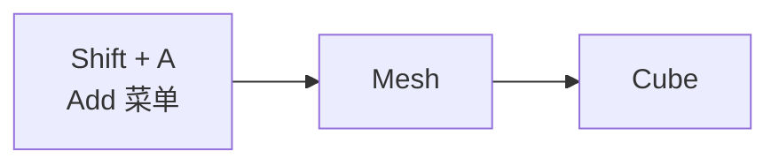

常见：

| 快捷键         | 功能                 |
| ----------- | ------------------ |
| `Shift + A` | 添加对象               |
| `Shift + D` | Duplicate          |
| `Alt + D`   | Linked Duplicate   |
| `F2`        | Rename             |
| `X`         | Delete             |
| `M`         | Move to Collection |
| `Ctrl + J`  | Join               |
| `Ctrl + P`  | Parent             |
| `Alt + P`   | Clear Parent       |
| `Ctrl + A`  | Apply              |

---

# 6. ⭐ G / R / S 变换系统

这是 Blender 最重要的一套快捷键。

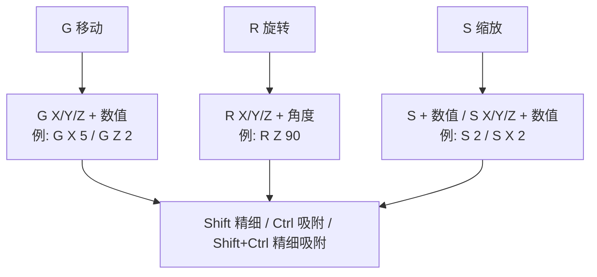

## 移动

```text
G
```

例如：

```text
G X 5
```

沿 X 移动 5。

```text
G Z 2
```

沿 Z 移动 2。

---

## 旋转

```text
R
```

例如：

```text
R Z 90
```

绕 Z 轴旋转 90°。

---

## 缩放

```text
S
```

例如：

```text
S 2
```

整体放大 2 倍。

```text
S X 2
```

X 方向放大 2 倍。

---

# 7. ⭐ 精确变换

例如：

```text
G X 10
```

X +10

```text
G X -10
```

X -10

```text
R Z 45
```

Z 轴旋转 45°

```text
S 0.5
```

缩小 50%

---

## Shift：精细控制

变换过程中按：

```text
Shift
```

可以降低变化速度，提高操作精度。

官方默认 Keymap 中也明确规定：

* `Ctrl`：粗粒度吸附
* `Shift`：精细调整
* `Shift + Ctrl`：精细吸附。([Blender 文档][2])

---

## Ctrl：吸附

例如：

```text
R Z 90
```

配合 `Ctrl` 可以更容易精确到固定角度。

---

# 8. 🔧 Apply 应用变换

非常重要：

```text
Ctrl + A
```

非常重要，执行流程：

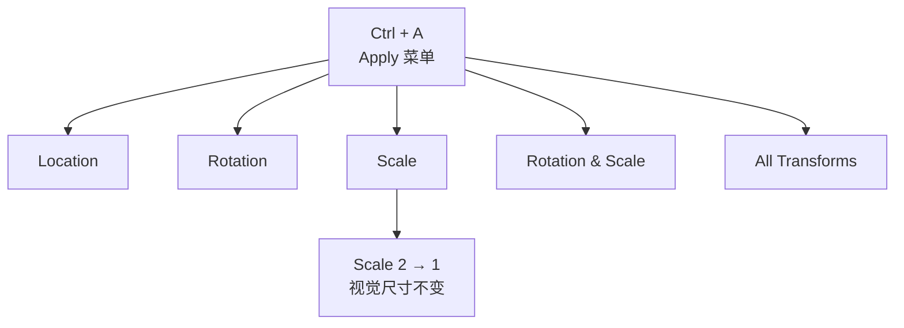

**建模时非常常用。**

---

# 9. 🧱 Edit Mode

进入：

```text
Tab
```

退出：

```text
Tab
```

---

## 基础编辑

| 快捷键        | 功能                   |
| ---------- | -------------------- |
| `Tab`      | Edit/Object Mode     |
| `1`        | Vertex               |
| `2`        | Edge                 |
| `3`        | Face                 |
| `A`        | 全选                   |
| `Alt + A`  | 取消选择                 |
| `X`        | 删除                   |
| `E`        | Extrude              |
| `I`        | Inset                |
| `Ctrl + R` | Loop Cut             |
| `K`        | Knife                |
| `F`        | Fill                 |
| `J`        | Connect              |
| `M`        | Merge                |
| `V`        | Rip                  |
| `P`        | Separate             |
| `Ctrl + B` | Bevel                |
| `Alt + S`  | Shrink/Fatten        |
| `O`        | Proportional Editing |

---

# 10. ⭐ Extrude

```text
E
```

例如：

```text
E Z 2
```

向 Z 方向挤出 2。

非常重要。

---

# 11. ⭐ Inset

```text
I
```

用于创建内部边界。

例如一个面，按 `I` 拖动即可产生内外双环：

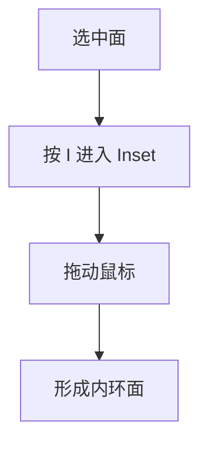

---

# 12. ⭐ Loop Cut

```text
Ctrl + R
```

这是 Blender 建模核心快捷键之一。

例如：

```text
Ctrl + R
```

在模型中添加 Loop Cut。

滚轮可以调整切割数量。

---

# 13. ⭐ Bevel

```text
Ctrl + B
```

用于倒角。

例如：

```text
Ctrl + B
```

然后移动鼠标。

滚轮：

```text
增加 Segments
```

常用于：

* 产品建模
* 硬表面
* 游戏模型
* 建筑模型

---

# 14. Knife

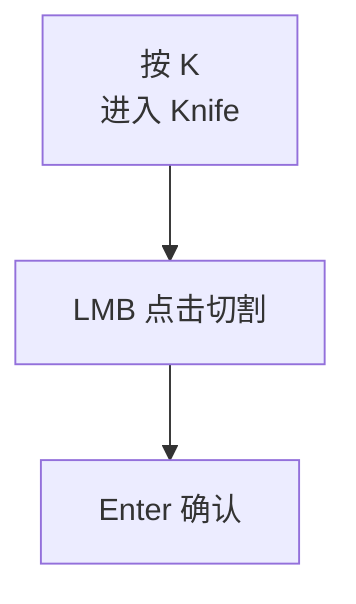

---

# 15. Merge

```text
M
```

打开 Merge 菜单。

常用：

```text
M → By Distance
```

合并距离过近的顶点。

---

# 16. Separate

```text
P
```

Edit Mode 下按 `P` 拆分：

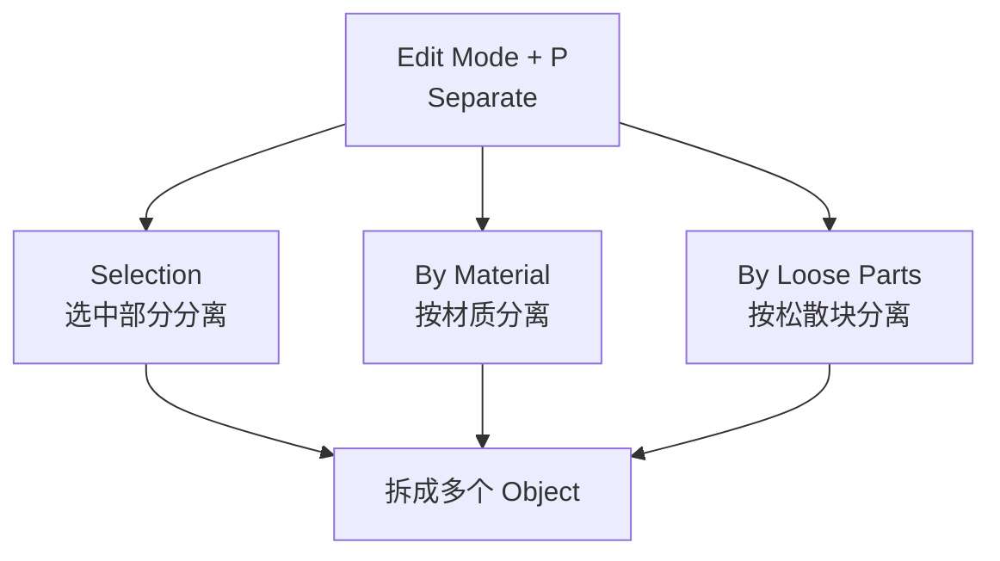

---

# 17. 🧲 Snapping

打开：

```text
Shift + Tab
```

可以快速切换 Snap。

常用于：

* 顶点吸附
* 边吸附
* 面吸附
* 增量吸附

---

# 18. 🧲 Proportional Editing

```text
O
```

开启/关闭。

开启后：

```text
G
```

移动一个顶点时，周围顶点也会受到影响。

滚轮：

```text
调整影响范围
```

非常适合：

* 地形
* 人脸
* 有机模型
* 地面变形

---

# 19. 👻 X-Ray

```text
Alt + Z
```

打开/关闭 X-Ray。

特别适合一次选择模型前后两面的顶点：

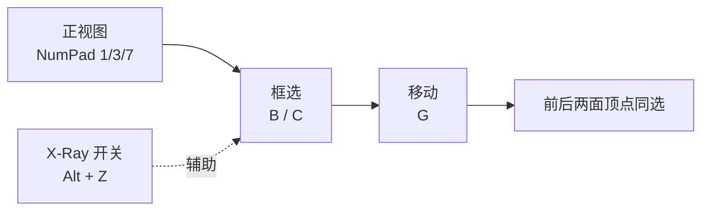

---

# 20. 🙈 隐藏 / 显示

| 快捷键         | 功能         |
| ----------- | ---------- |
| `H`         | 隐藏选择       |
| `Shift + H` | 隐藏未选择      |
| `Alt + H`   | 显示全部       |
| `/`         | Local View |
| `NumPad /`  | Local View |

Local View 可以只显示当前选择对象，非常适合复杂场景。([Blender 文档][5])

---

# 21. 🎨 Viewport Shading

快捷键：

```text
Z
```

打开 Shading Pie。

常见 shading 切换（Pie 菜单，以 `Z` 为中心）：

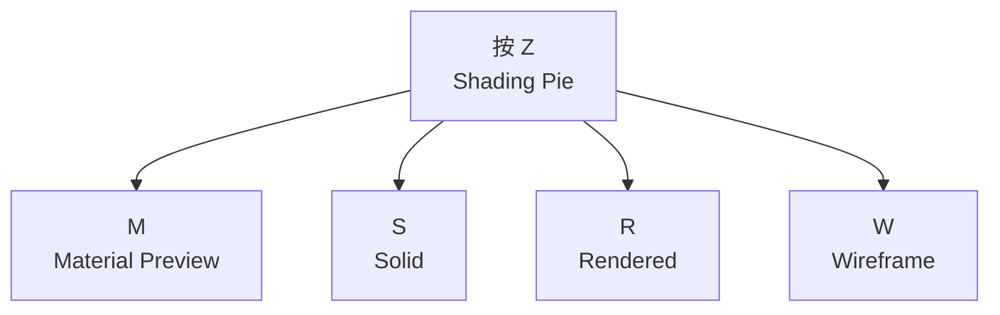

不同版本/键位设置下 Pie Menu 的字母可能存在差异，所以如果你不确定，直接：

```text
Z
```

然后看菜单。

---

# 22. 🧭 Viewport Pie

```text
`
```

也就是：

```text
Grave / Tilde
```

可以打开视角 Pie Menu。

官方默认 Keymap 将 `AccentGrave` 用于 3D Viewport navigation pie。([Blender 文档][2])

---

# 23. 🪟 界面区域

| 快捷键              | 功能                    |
| ---------------- | --------------------- |
| `N`              | Sidebar               |
| `T`              | Toolbar               |
| `Ctrl + Space`   | 最大化当前区域               |
| `Shift + Space`  | 最大化/区域相关操作            |
| `Ctrl + Alt + Q` | Quad View             |
| `F3`             | Search                |
| `F9`             | Adjust Last Operation |

Quad View：

```text
Ctrl + Alt + Q
```

会将 3D Viewport 分成四视图：

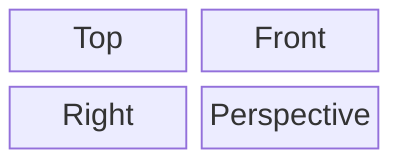

官方文档确认该快捷键。([Blender 文档][6])

---

# 24. 📁 文件操作

| 快捷键                | 功能        |
| ------------------ | --------- |
| `Ctrl + N`         | New       |
| `Ctrl + O`         | Open      |
| `Ctrl + S`         | Save      |
| `Ctrl + Shift + S` | Save As   |
| `Ctrl + Alt + S`   | Save Copy |
| `Ctrl + Z`         | Undo      |
| `Ctrl + Shift + Z` | Redo      |
| `F11`              | 显示 Render |
| `F12`              | Render    |

Blender 默认快捷键文档确认了 `Ctrl+O / Ctrl+S / Ctrl+N / Ctrl+Z / Shift+Ctrl+Z / F11 / F12`。([Blender 文档][2])

---

# 25. 🎬 Animation

| 快捷键               | 功能            |
| ----------------- | ------------- |
| `Space`           | 播放/暂停         |
| `Shift + Space`   | 播放方向相关        |
| `Left Arrow`      | 上一帧           |
| `Right Arrow`     | 下一帧           |
| `Up Arrow`        | 上一关键帧         |
| `Down Arrow`      | 下一关键帧         |
| `I`               | 插入 Keyframe   |
| `Alt + I`         | 删除 Keyframe   |
| `Shift + Alt + I` | 清除全部 Keyframe |

官方默认 Keymap 将 `I` 定义为插入关键帧，`Alt+I` 清除关键帧。([Blender 文档][2])

---

# 26. 🎥 Camera

| 快捷键                     | 功能            |
| ----------------------- | ------------- |
| `NumPad 0`              | Camera View   |
| `Ctrl + Alt + NumPad 0` | 当前视角对齐 Camera |
| `G`                     | 移动 Camera     |
| `R`                     | 旋转 Camera     |

非常常用，让 Camera 对齐当前视角：

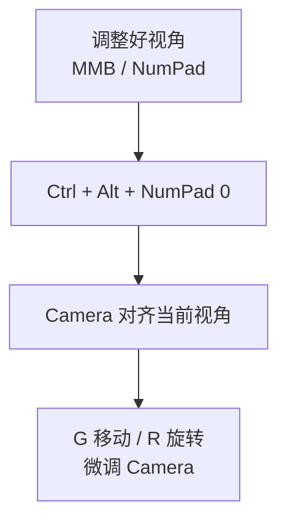

---

# 27. 🧩 Modifier / Object

常见操作：

```text
Ctrl + A
```

Apply Transform

```text
Ctrl + J
```

Join

```text
Ctrl + P
```

Parent

```text
Alt + P
```

Clear Parent

```text
Shift + D
```

Duplicate

```text
Alt + D
```

Linked Duplicate

---

# 28. 🦴 Armature / Rigging

| 快捷键          | 功能               |
| ------------ | ---------------- |
| `Tab`        | Edit/Pose/Object |
| `Ctrl + Tab` | Pose Mode        |
| `E`          | Extrude Bone     |
| `F`          | Create Bone      |
| `G`          | Move Bone        |
| `R`          | Rotate Bone      |
| `S`          | Scale Bone       |
| `Ctrl + P`   | Parent           |
| `I`          | Insert Keyframe  |

`Ctrl + Tab` 对 Armature 可以切换/进入 Pose Mode。([Blender 文档][2])

---

# 29. 🗺️ UV Editor

常用：

| 快捷键       | 功能            |
| --------- | ------------- |
| `U`       | UV Mapping 菜单 |
| `A`       | 全选            |
| `L`       | Select Linked |
| `P`       | Pin           |
| `Alt + P` | Unpin         |
| `G`       | 移动 UV         |
| `R`       | 旋转 UV         |
| `S`       | 缩放 UV         |

最常用 Unwrap 流程：

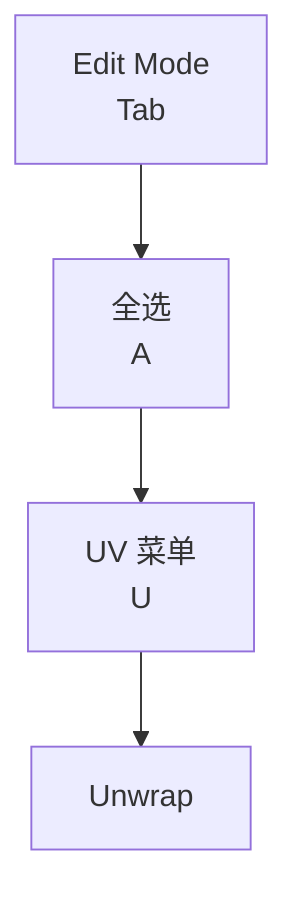

---

# 30. 🎨 Texture Paint / Sculpt

## Sculpt

常用：

```text
F
```

调整 Brush Size

```text
Shift + F
```

调整 Brush Strength

```text
X
```

切换 Brush 正/负方向。

---

# 31. 🌳 Shader Editor

Shader 节点操作非常多，但核心快捷键是：

| 快捷键                | 功能                        |
| ------------------ | ------------------------- |
| `Shift + A`        | Add Node                  |
| `G`                | 移动 Node                   |
| `X`                | 删除 Node                   |
| `Shift + D`        | Duplicate                 |
| `Ctrl + Shift + D` | Duplicate + linked/特定节点操作 |
| `M`                | Mute                      |
| `Ctrl + G`         | Frame/Group               |
| `Tab`              | 进入/退出 Group               |
| `Home`             | 查看全部节点                    |
| `N`                | Sidebar                   |

---

# 32. 🔗 节点快速连接

一个非常值得掌握的工作流：

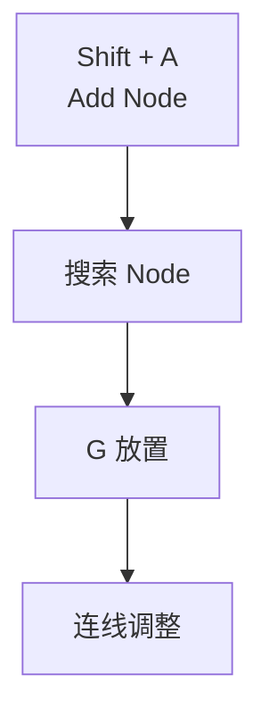

如果使用 Node Wrangler，还可以获得大量额外快捷操作。

---

# 33. 🔍 Search

### F3 万能搜索

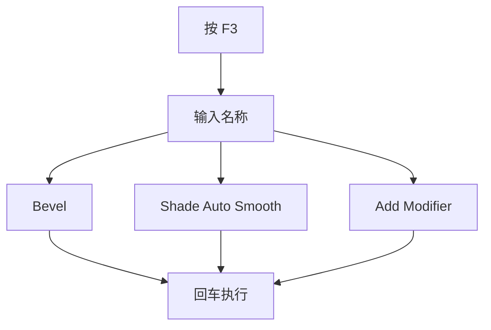

**实际上，F3 是 Blender 最重要的“万能快捷键”。**

不知道快捷键：

> **F3 → 输入功能名称**

---

# 34. ⭐ 建模最常用组合

如果你主要学习 **3D 建模**，建议优先背下面这套：

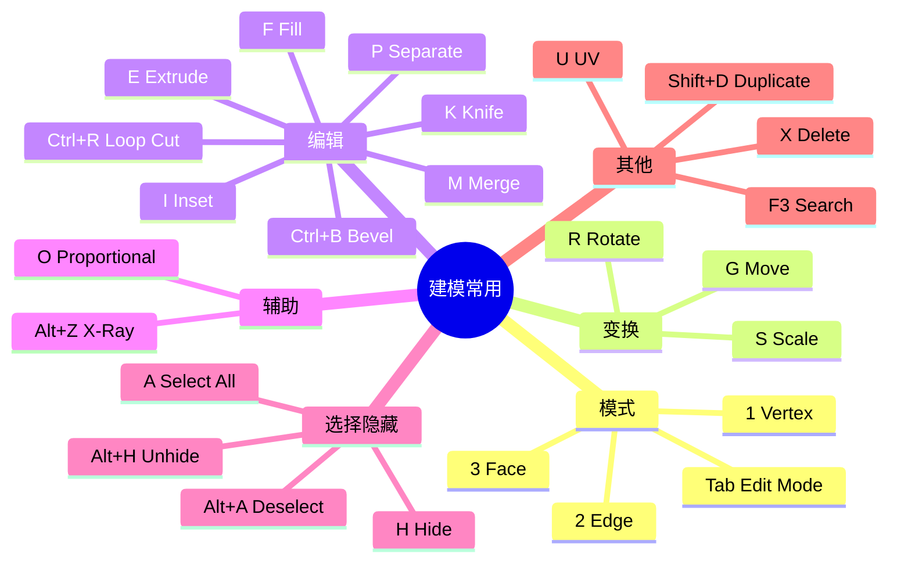

---

# 35. ⭐ Blender 建模的核心“语法”

可以把 Blender 快捷键理解成一门语言，核心模式是 **动作 + 轴 + 数值**：


| 输入 | 解析 |
| ---- | ---- |
| `G X 5` | Move → X → 5 |
| `R Z 90` | Rotate → Z → 90° |
| `S X 2` | Scale → X → 2 |
| `E Z 3` | Extrude → Z → 3 |

---

# 36. ⭐ 进一步理解：全局轴 / 局部轴

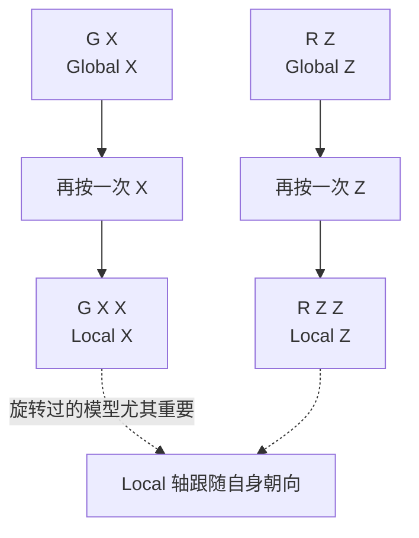

---

# 37. ⭐ 常用快捷键速查表

### Object

```text
Shift + A     Add
Shift + D     Duplicate
Alt + D       Linked Duplicate
Ctrl + J      Join
Ctrl + P      Parent
Alt + P       Clear Parent
F2            Rename
X             Delete
M             Collection
```

### Transform

```text
G             Move
R             Rotate
S             Scale

G X           Move X
G Y           Move Y
G Z           Move Z

R X           Rotate X
R Y           Rotate Y
R Z           Rotate Z

S X           Scale X
S Y           Scale Y
S Z           Scale Z

Ctrl + A      Apply
```

### Edit

```text
Tab           Edit Mode

1             Vertex
2             Edge
3             Face

E             Extrude
I             Inset
Ctrl + R      Loop Cut
Ctrl + B      Bevel
K             Knife
F             Fill
J             Connect
M             Merge
V             Rip
P             Separate
O             Proportional
```

### Selection

```text
A             Select All
Alt + A       Deselect
Ctrl + I      Invert
B             Box Select
C             Circle Select
L             Linked
Shift + G     Similar
```

### View

```text
NumPad 1      Front
NumPad 3      Right
NumPad 7      Top

Ctrl + 1      Back
Ctrl + 3      Left
Ctrl + 7      Bottom

NumPad 5      Perspective/Ortho
NumPad 0      Camera
NumPad .      Frame Selected
Home          Frame All

MMB           Orbit
Shift + MMB   Pan
Ctrl + MMB    Zoom

NumPad /      Local View
Alt + Z       X-Ray
Z             Shading Pie
```

### UI

```text
F3            Search
F9            Last Operation
N             Sidebar
T             Toolbar
Ctrl + Space  Maximize Area
Ctrl+Alt+Q    Quad View
```

---

# 38. 🍎 Mac 用户特别注意

你是在 **macOS** 上使用 Blender 的话，可以重点记：

```text
Cmd + Z          Undo
Cmd + Shift + Z  Redo
Cmd + S          Save
Cmd + O          Open
```

而 Blender 的很多传统 `Ctrl` 操作仍然按照 Blender 自己的 Keymap 工作，macOS 默认允许 `Cmd` 替代 `Ctrl`，但与系统快捷键冲突的情况除外。([Blender 文档][2])

所以不要简单理解成：

> **“Blender Mac = 全部 Ctrl 换 Cmd”**

并不是绝对如此。

---

## 39. 🚀 如果你准备系统学 Blender，我建议按这个顺序背

不要一口气背几百个快捷键。

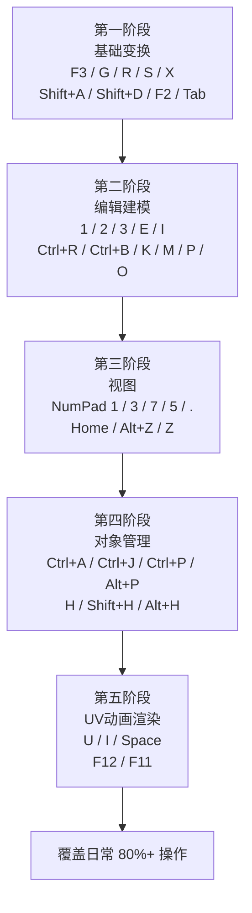

这样基本就能覆盖 **Blender 日常 80%+ 的操作**。

如果你是为了**建模/游戏开发**，尤其你之前也在关注 **Blender → Bevy / Cocos / Godot** 这类工作流，那么下一步最值得整理的是一份 **「Blender 5.x 建模快捷键 Cheat Sheet」**：按 **基础建模 → 硬表面 → 人物 → UV → 材质 → 骨骼 → 动画 → FBX/GLTF 导出** 分类，并把 `G/R/S/E/I/Ctrl+R/Ctrl+B` 这些快捷键组合成实际建模流程。

[1]: https://docs.blender.org/manual/en/latest/interface/keymap/index.html?utm_source=chatgpt.com "Keymap - Blender 5.2 LTS Manual"
[2]: https://docs.blender.org/manual/zh-hant/5.2/interface/keymap/blender_default.html?utm_source=chatgpt.com "Default Keymap - Blender 5.2 LTS Manual"
[3]: https://docs.blender.org/manual/zh-hans/latest/editors/3dview/navigate/navigation.html?utm_source=chatgpt.com "导航 - Blender 5.2 LTS Manual"
[4]: https://docs.blender.org/manual/en/latest/editors/3dview/navigate/viewpoint.html?utm_source=chatgpt.com "Viewpoint - Blender 5.2 LTS Manual"
[5]: https://docs.blender.org/manual/ja/5.2/editors/3dview/navigate/local_view.html?utm_source=chatgpt.com "Local View(ローカルビュー) - Blender 5.2 LTS Manual"
[6]: https://docs.blender.org/manual/en/5.2/editors/3dview/navigate/views.html?utm_source=chatgpt.com "Contextual Views - Blender 5.2 LTS Manual"
