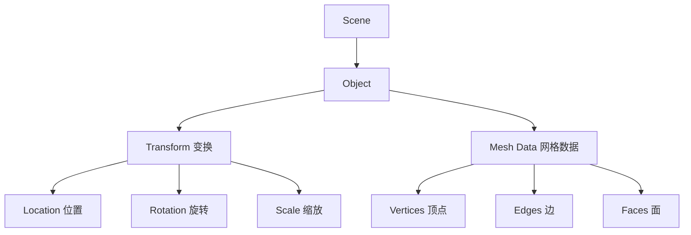
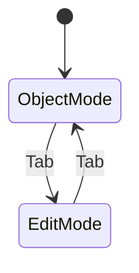
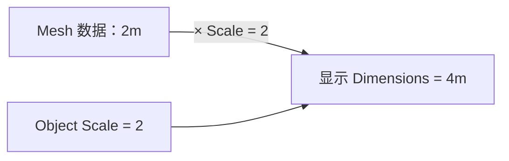
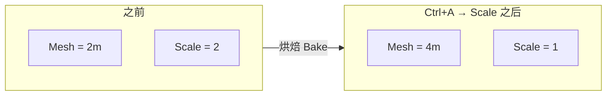
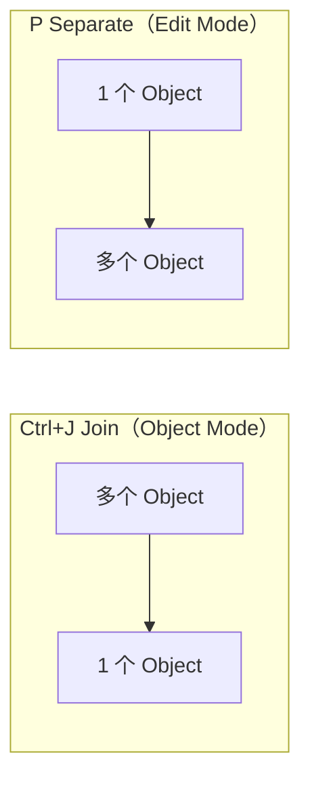
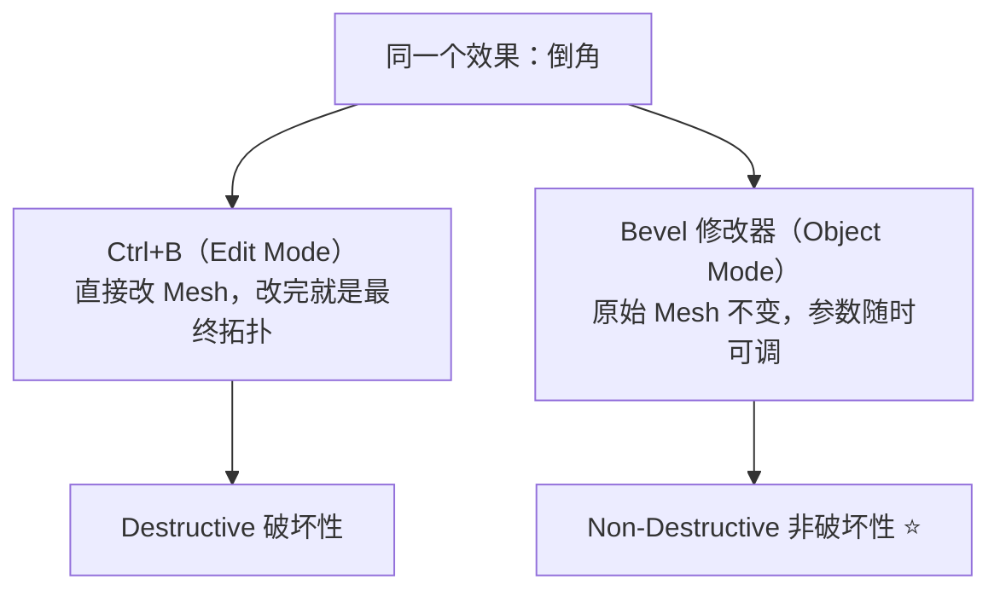
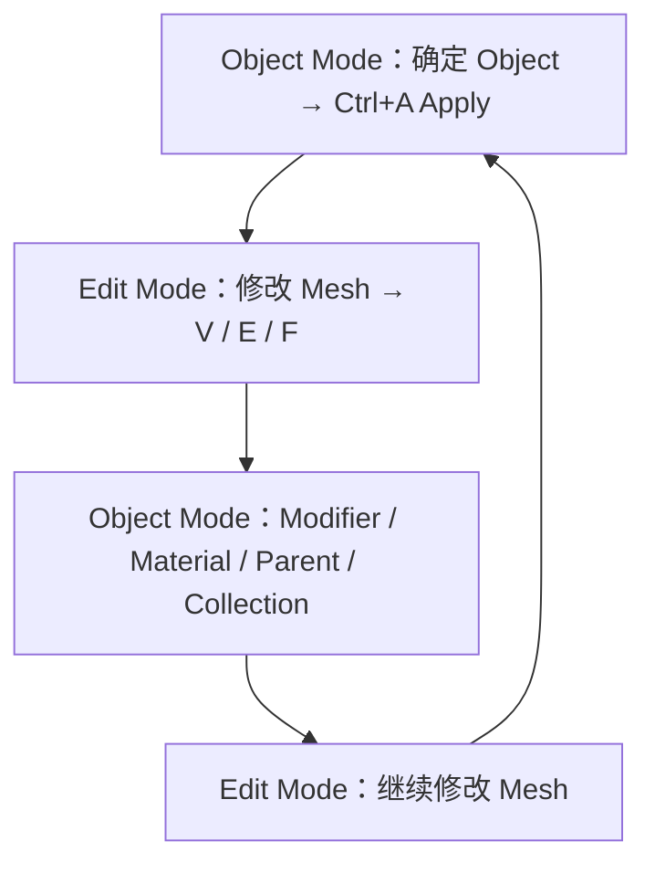

# 01 · 核心概念：Object 与 Mesh

> 来源合并：`对象模式与编辑模式.md` 全文 + `基础练习.md` 第 1–11 节 + `Bevel倒角详解.md` 第 1、4 节
> 一句话总纲：**Object Mode 决定「这个物体怎么存在、怎么摆放」；Edit Mode 决定「这个物体长什么样」。**

---

# 一、Blender 的数据结构

一个「模型」不是一个东西，而是两层：



> **Object 是容器，Mesh 是容器里真正的几何数据。**

默认 Cube：`8 Vertices / 12 Edges / 6 Faces`。

---

# 二、两种模式的职责对照

| 模式 | 操作对象 | 典型操作 | 结果 |
| --- | --- | --- | --- |
| **Object Mode** | 整个 Object（容器） | `G/R/S`、`Shift+D`、`Ctrl+J`、`Ctrl+P`、`Ctrl+A`、`M`（集合）、`F2` | 改变物体的位置 / 姿态 / 尺寸 / 归属 |
| **Edit Mode** | Mesh 里的 V / E / F | `1/2/3`、`E`、`I`、`Ctrl+R`、`Ctrl+B`、`K`、`M`、`P` | 改变物体的形状与拓扑 |

切换键：`Tab`。



---

# 三、Transform 三件套与 Scale 陷阱

Object 的 Transform 只是**作用在 Mesh 之上的一层乘数**，不改 Mesh 本身：



所以你会看到 `Dimensions = 4m` 但 `Scale = 2` —— **几何仍然是 2m，只是被放大显示了。**

这是建模里最多坑的地方：

| 后果 | 表现 |
| --- | --- |
| Bevel 被拉伸 | `Ctrl+B` 后各方向倒角宽度不一致（见 `06-倒角-Bevel.md`） |
| 修改器行为异常 | Subdivision / Array / Mirror 结果变形 |
| 导出比例错乱 | 进引擎后尺寸和轴向不对（见 `07-资产规范与引擎导出`） |

---

# 四、Ctrl + A 到底烘焙了什么



视觉尺寸不变，但 **Scale 从 2 变回 1，缩放被写进了 Mesh 数据**。

Apply 菜单（`Ctrl+A`）：

| 项 | 作用 |
| --- | --- |
| Location | 位置归零（原点回到世界原点） |
| Rotation | 旋转归零 |
| **Scale** | **缩放归 1（最常用）** |
| Rotation & Scale | 旋转+缩放一起归零 |
| All Transforms | 全部归零 |

> **硬表面建模固定动作**：调完 Object 尺寸 → `Ctrl+A → Scale` → 才进 Edit Mode 动刀。

---

# 五、同一个按键，两种模式含义不同 ⭐

这是最容易踩的坑，值得单独记一张表：

| 按键 | Object Mode | Edit Mode |
| --- | --- | --- |
| `Shift+D` | 复制出**新 Object** | 复制出**几何**（仍是同一个 Object） |
| `X` / `Delete` | 删除整个 Object | 弹出删除菜单（Vertices / Edges / Faces / Only Faces / Dissolve） |
| `M` | 移动到 Collection | Merge 合并顶点 |
| `1 / 2 / 3` | （无） | Vertex / Edge / Face 选择模式 |
| `G / R / S` | 变换整个物体 | 变换选中的顶点 / 边 / 面 |
| `E / I / Ctrl+R / Ctrl+B` | 无效 | 挤出 / 内插 / 环切 / 倒角 |

> 在 Object Mode 下按 `E` 没反应？先 `Tab`。

---

# 六、合并与拆分：`Ctrl+J` vs `P`



`P` 的三种方式：

| 方式 | 含义 |
| --- | --- |
| Selection | 把选中部分拆出去 |
| By Material | 按材质拆分 |
| **By Loose Parts** | **按互不相连的块自动拆分（最常用）** |

关键认知：

> **多个互不相连的 Mesh Island 可以共存于同一个 Object 中。**
> 所以「看起来是 3 个物体」≠「场景里有 3 个 Object」，导出前一定要检查。

---

# 七、删除 vs 溶解（Delete vs Dissolve）

```
●────●────●
```

| 操作 | 结果 | 用途 |
| --- | --- | --- |
| `X → Vertices` | `●       ●`（连接结构一起没了） | 真的要挖掉 |
| `X → Dissolve` | `●────────●`（形状不变，去掉多余顶点） | **清理多余拓扑，保持形状** |

> 建模后期清理布线，用 Dissolve 而不是 Delete。

---

# 八、Destructive vs Non-Destructive

这是从「会建模」到「能做资产」的分水岭：



| 维度 | 破坏性操作 | 修改器 |
| --- | --- | --- |
| 改参数 | 只能 `F9` 或 `Ctrl+Z` 重来 | 滑块随时拖 |
| 支持 Bevel Weight | ❌ | ✅ |
| 支持 Limit Method（角度限制） | ❌ | ✅ |
| 适合 | 快速试造型、一次性定型 | **正式资产、需要反复迭代** |

> 游戏资产的实践结论：**默认走修改器**（详见 `06-倒角-Bevel.md`）。

---

# 九、建模时的模式循环

真实建模不是「进 Edit Mode 一次做完」，而是不断来回：



---

# 十、记忆锚点

| 问题 | 答案 |
| --- | --- |
| Object 和 Mesh 是什么关系？ | Object 是容器，Mesh 是里面的几何数据 |
| 为什么必须 Apply Scale？ | 否则后续所有几何操作都带着一个隐藏的缩放倍数 |
| 什么时候用 Object Mode？ | 摆放、复制、合并、应用变换、加修改器 |
| 什么时候用 Edit Mode？ | 改形状、改拓扑、倒角、环切、展 UV 前 |

**下一步**：先搞清「怎么选」（`02-选择模式与视图导航.md`），再学「怎么动」（`03-变换系统-G-R-S.md`）。
