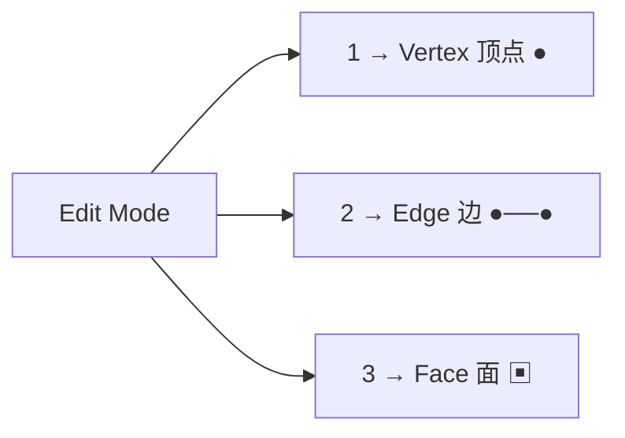
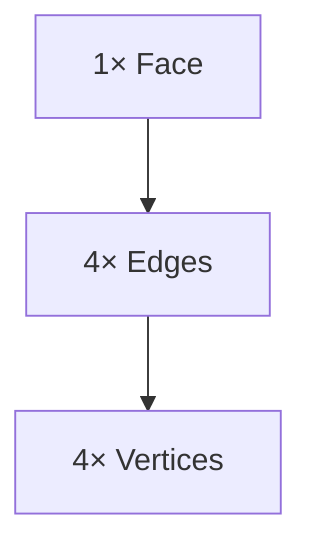
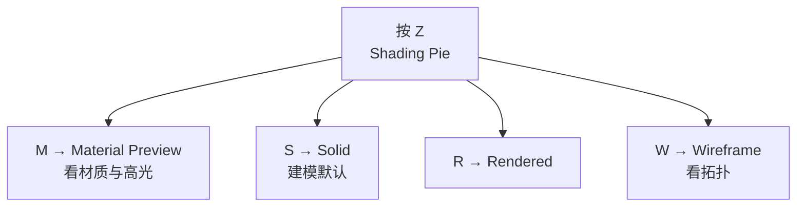

# 02 · 选择模式与视图导航

> 来源合并：`基础练习.md` 第 2–11 节 + `Blender快捷键.md` 第 2、3、4、19、20、21、22、23 节 + `环切详解.md` 第 27 节
> 一句话：**先选对，再操作。** 大部分「快捷键按了没反应 / 结果不对」都是选错了模式或选错了元素。

---

# 一、三种选择模式

进入 Edit Mode（`Tab`）后：



> 注意：`1/2/3` 是主键盘数字键，不是小键盘。

| 模式 | 选中的是 | 最适合干什么 |
| --- | --- | --- |
| **Vertex** `1` | 点 `●` | 改轮廓、做有机形状、合并顶点修拓扑 |
| **Edge** `2` | 线 `●──●` | 控制拓扑：`Ctrl+R` 环切、`Ctrl+B` 倒角、Edge Slide、选环 |
| **Face** `3` | 面 `▣` | 建立 / 移动大块几何：`E` 挤出、`I` 内插、`G/S` 缩放 |

三者不是孤立的，一个 Face 内含 `4 Vertices + 4 Edges + 1 Face`：



---

# 二、选择操作速查

| 快捷键 | 功能 | 备注 |
| --- | --- | --- |
| `A` | 全选 | 再按一次取消 |
| `Alt+A` | 取消选择 | |
| `Ctrl+I` | 反选 | |
| `B` | 框选 | |
| `C` | 圆形刷选 | 滚轮调半径 |
| `L` | 选择连通区域（Linked） | 选中一整块相连几何 |
| `Ctrl+L` | Select Linked | |
| `Shift+G` | Select Similar | 按面积 / 边数 / 材质等批量选同类 |
| `Alt+LMB` | **选整条 Edge Loop（选环）** | ⭐ 环切后必用 |
| `Ctrl+Alt+LMB` | **选 Edge Ring（选圈）** | ⭐ 平行边集合 |
| `Alt+Z` | X-Ray 透视选择 | 一次选中前后两面的元素 |
| `H` / `Shift+H` / `Alt+H` | 隐藏选中 / 隐藏未选 / 全部显示 | 复杂模型必备 |
| `/` 或 `NumPad /` | Local View 局部视图 | 只显示选中对象 |

> **X-Ray + 正视图 + 框选** = 一次性选中模型前后的对称元素，效率极高。

---

# 三、视图导航（每天用几百次）

## 鼠标

| 操作 | 功能 |
| --- | --- |
| `MMB` 拖动 | Orbit 旋转视角 |
| `Shift+MMB` | Pan 平移 |
| `Ctrl+MMB` | Zoom 缩放 |
| 滚轮 | 缩放 |
| `Shift+滚轮` | 平移 |
| `Alt+MMB` | 快速对齐视图 |

> **macOS 触控板用户**：MMB 极难按。建议弄个三键鼠标，或把 Orbit 改成 `Alt+LMB`。这一处卡手会非常劝退。

## 视角快捷键

| 快捷键 | 视图 |
| --- | --- |
| `NumPad 1` / `Ctrl+NumPad 1` | Front / Back |
| `NumPad 3` / `Ctrl+NumPad 3` | Right / Left |
| `NumPad 7` / `Ctrl+NumPad 7` | Top / Bottom |
| `NumPad 5` | 透视 / 正交切换 |
| `NumPad 0` | Camera 视图 |
| `Ctrl+Alt+NumPad 0` | 把相机对齐当前视角 ⭐ |
| `NumPad .` | 聚焦选中 |
| `Home` | 显示全部 |

**没有小键盘**：`Edit → Preferences → Input → Emulate Numpad`，用主键盘数字键模拟。

---

# 四、显示与界面

| 快捷键 | 功能 |
| --- | --- |
| `Z` | Shading Pie（Solid / Material Preview / Rendered / Wireframe） |
| `Alt+Z` | X-Ray |
| `` ` ``（Grave） | 视角 Pie Menu |
| `N` / `T` | Sidebar / Toolbar |
| `F3` | **万能搜索**（找不到命令就搜它） |
| `F9` | 调出上一次操作的参数面板 |
| `Ctrl+Space` | 最大化当前区域 |
| `Ctrl+Alt+Q` | Quad View 四视图 |



> 做倒角 / 硬表面时，最后一定切 **Material Preview** 转视角看边缘高光——那是唯一可信的验收方式。

---

# 五、Mac 用户特别注意

```
Cmd+Z      撤销
Cmd+Shift+Z 重做
Cmd+S      保存
Cmd+O      打开
```

但**不是所有 `Ctrl` 都能换成 `Cmd`** —— 与 macOS 系统快捷键冲突的会失效。

> 不要记成「Mac 上 Ctrl 全换 Cmd」。遇到某快捷键失灵时，按 `F3` 搜命令名执行，或去 Keymap 里改键。

---

# 六、自检清单

- [ ] 按 `1/2/3` 能立刻说出当前在选什么
- [ ] 能不用小键盘切到前 / 顶 / 右视图（开 Emulate Numpad 或改键）
- [ ] 能用 `Alt+LMB` 选中一整圈 Loop
- [ ] 能用 `Alt+Z` + 框选选中模型背面的元素
- [ ] 熟悉 `Z → Material Preview` 看高光
