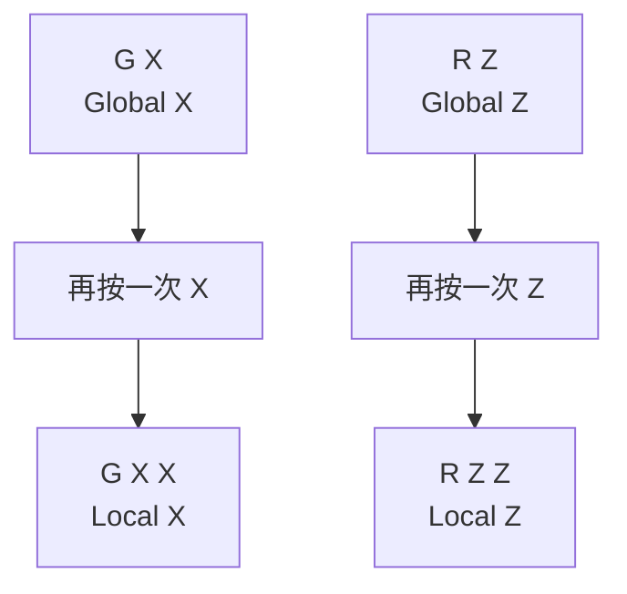
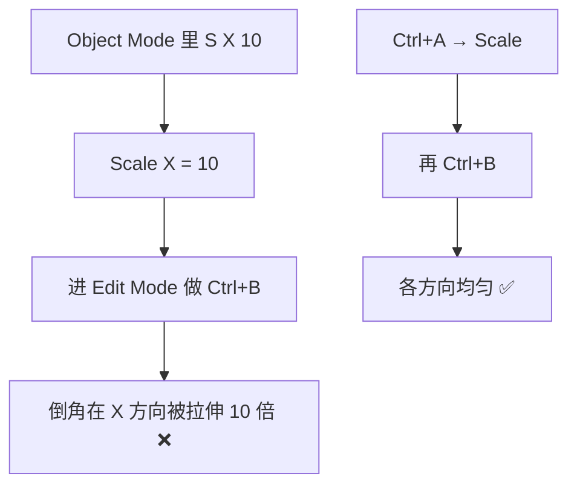
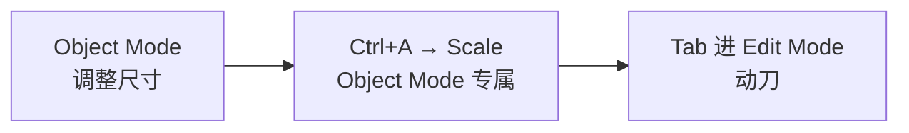

# 03 · 变换系统 G / R / S

> 来源合并：`Blender快捷键.md` 第 6、7、8、18、35、36 节 + `对象模式与编辑模式.md` 第 4–6、29 节
> 一句话：**Blender 的快捷键是一门语言，语法 = 动作 + 轴 + 数值。**
> 模式图例：**通用** = 两种模式都能用 ｜ **Edit** = 仅 Edit Mode ｜ **Object** = 仅 Object Mode

---

# 一、核心语法


| 输入 | 解析 | 模式 |
| --- | --- | --- |
| `G X 5` | 移动 → X 轴 → 5 | 通用 |
| `R Z 90` | 旋转 → Z 轴 → 90° | 通用 |
| `S X 2` | 缩放 → X 轴 → 2 倍 | 通用 |
| `E Z 3` | 挤出 → Z 轴 → 3 | ⚠️ **Edit** |
| `S 0.5` | 整体缩小 50% | 通用 |
| `G X -10` | 沿 X 反向移动 10 | 通用 |

> 按了动作键之后**不按轴**就是自由变换；按一次轴锁定该轴；输入数字回车即精确值。
>
> ⚠️ `E`（Extrude）是 Mesh 编辑操作，**Object Mode 下按 `E` 完全没反应**。要挤出必须先 `Tab` 进 Edit Mode（详见 `04-挤出与内插-E-I.md`）。

---

# 二、三个动作

| 键 | 动作 | 常见写法 | 模式 |
| --- | --- | --- | --- |
| `G` | Move 移动 | `G` / `G X` / `G Z 2` | 通用 |
| `R` | Rotate 旋转 | `R` / `R Z 90` | 通用 |
| `S` | Scale 缩放 | `S` / `S 2` / `S X 2` / `S Z 0.5` | 通用 |

同一个键，在不同模式下改的东西完全不一样：

| | **Object Mode** | **Edit Mode** |
| --- | --- | --- |
| 作用对象 | 整个物体 | 选中的点 / 边 / 面 |
| 变换中心 | 物体原点（Origin） | 默认 Median Point（所选元素的中心） |
| `S` 的结果 | 写入物体 **Scale 属性**（会累积） | 直接改 Mesh 顶点坐标，**Scale 属性保持 1** |
| 之后要 Apply 吗 | `S` / `R` 之后**要** `Ctrl+A` | **不需要**（数据本身就是新的） |

> 关键区别：**Object Mode 的 `S` 只是「给物体记了一个倍数」，Edit Mode 的 `S` 是「真的把顶点挪了」。** 这也是为什么只有前者会让后面的 Bevel / 修改器变形（见第六节）。

---

# 三、精细与吸附 ⭐

变换过程中（还没确认前）按这三个修饰键（**两种模式都生效**）：

| 修饰键 | 效果 | 模式 |
| --- | --- | --- |
| `Shift` | **精细模式**：降低变化速度，提高精度 | 通用 |
| `Ctrl` | **粗粒度吸附**：吸附到网格 / 固定角度（如 5° 一档） | 通用 |
| `Shift+Ctrl` | **精细吸附** | 通用 |

另有独立开关：

| 键 | 功能 | 模式 |
| --- | --- | --- |
| `Shift+Tab` | 切换 Snapping（顶点 / 边 / 面 / 增量吸附） | 通用 |
| `O` | Proportional Editing 衰减编辑（`O` 开关；`Shift+滚轮` 或 `PageUp` / `PageDown` 调影响半径） | **Edit 为主**（Object Mode 也生效，但作用于「相邻物体」） |

> `Ctrl` 吸附到什么，由 Snapping 设置决定：Edit Mode 常用「顶点 / 边 / 面」，Object Mode 常用「增量 / 网格 / 体积」。吸附到奇怪的地方时，先用 `Shift+Tab` 看当前是哪种。

Proportional Editing 适合：地形、有机形状、布料、人脸——移动一个点，周围按衰减一起动。

> ⚠️ `O` 是**开关**，不是一次性修饰键。开着忘关，后面每一次 `G` 都会带着一坨邻居一起动——看着像 bug，其实是它没关。

---

# 四、全局轴 vs 局部轴 ⭐⭐



**适用模式：通用**（Object / Edit 都一样有效）

- **第一次按轴 = 全局轴**（世界坐标）
- **再按一次同一个轴 = 局部轴**（跟随物体自身朝向）

> 物体被旋转过之后，`G X` 和 `G X X` 的方向完全不同。做角色 / 机械时这个区别会直接决定对不对。
>
> **Edit Mode 补充**：第二次按轴取的是**物体自身的局部轴**，不是选中元素的法线方向。想让顶点沿「各自的法线」移动，要把视图顶部的 Transform Orientation 切到 **Normal**。

---

# 五、Apply 应用变换（`Ctrl+A`）⚠️ Object 专属

> ⚠️ **只在 Object Mode 有效。** Edit Mode 下按 `Ctrl+A` **不会弹出 Apply 菜单**（这个组合在 Edit Mode 没有默认绑定，按了就是没反应）。
> Edit Mode 里全选请直接按 **`A`**——加 `Ctrl` 反而不灵。

| 菜单项 | 作用 |
| --- | --- |
| Location | 位置归零 |
| Rotation | 旋转归零 |
| **Scale** | **缩放归 1（最常用）** |
| Rotation & Scale | 两者一起 |
| All Transforms | 全部归零 |

---

# 六、为什么 Scale ≠ 1 是万恶之源



连带影响：修改器结果变形、镜像/阵列错位、导出进引擎后尺寸不对。

> 澄清一点：只有 **Object Mode 的 `S`** 会让 `Scale` 变成 10。在 Edit Mode 里 `S` 是直接改顶点坐标，物体 Scale 属性仍然是 1，所以**不会出现这个拉伸问题、也不需要 Apply**。

**固定流程：**



---

# 七、速查表（按模式分组）

```text
── 通用（Object / Edit 都能用）─────────────
G / R / S              移动 / 旋转 / 缩放
G X 5  R Z 90  S 2     动作 + 轴 + 数值
Shift                  精细
Ctrl                   吸附（固定角度 / 网格）
Shift+Ctrl             精细吸附
Shift+Tab              开关 Snapping
X X / Z Z              第二次按 = 局部轴

── Edit Mode 为主 ────────────────────────
E / E Z 3              挤出（Object Mode 下无反应）
O                      Proportional Editing
                       Shift+滚轮 / PageUp·PageDown 调半径
Ctrl+B                 Bevel 倒角（见 06）

── 仅 Object Mode ────────────────────────
Ctrl+A → Scale         应用缩放（建模前必做）
                       ⚠️ Edit Mode 按 Ctrl+A 无反应；
                          全选直接按 A
```

---

# 八、模式踩坑对照

| 现象 | 原因 | 解决 |
| --- | --- | --- |
| Object Mode 按 `E` 没反应 | Extrude 是 Mesh 编辑操作 | `Tab` 进 Edit Mode |
| Edit Mode 按 `Ctrl+A` 没反应、Apply 菜单弹不出来 | Apply 菜单只存在于 Object Mode | 回 Object Mode 再按 |
| Edit Mode 想全选却按了 `Ctrl+A` | Edit Mode 全选是 **`A`**，`Ctrl+A` 没绑定 | 去掉 `Ctrl` |
| 衰减半径调不动（滚轮只是缩放视图） | 默认键位是 `Shift+滚轮` 或 `PageUp` / `PageDown` | 按 `Shift+滚轮` |
| Object Mode 按 `Ctrl+B` 没反应 | Bevel 是 Edit Mode 操作 | `Tab` 进 Edit Mode |
| `O` 之后每次 `G` 都带一堆元素跟着动 | Proportional Editing 忘关 | 再按一次 `O` |
| Edit Mode 里 `G X X` 方向和预期不一样 | 第二次按轴取物体局部轴，不是元素法线 | Transform Orientation 切 Normal |
| `S` 之后 Bevel / 修改器变形 | Object Mode 的 `S` 写进了 Scale 属性 | `Ctrl+A → Scale` |
| Edit Mode 缩放后到处找 Apply | Edit Mode 的 `S` 改的是顶点，Scale 属性本就是 1 | 不用 Apply |

---

# 九、自检清单

- [ ] 能闭眼写出 `G X 5` / `R Z 90` / `S 0.5` 的含义
- [ ] 知道 `Shift` 是精细、`Ctrl` 是吸附
- [ ] 知道 `G X` 和 `G X X` 的区别，并能在旋转过的物体上用对
- [ ] 每次在 **Object Mode** 改完尺寸都记得 `Ctrl+A → Scale`
- [ ] 看到 `E` / `Ctrl+B` 立刻反应出「要先 `Tab` 进 Edit Mode」
- [ ] 知道 `Ctrl+A` 的 Apply 菜单只在 Object Mode 有，Edit Mode 全选按 `A`
