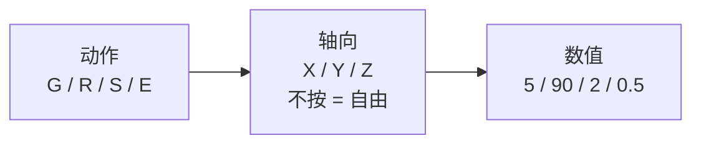
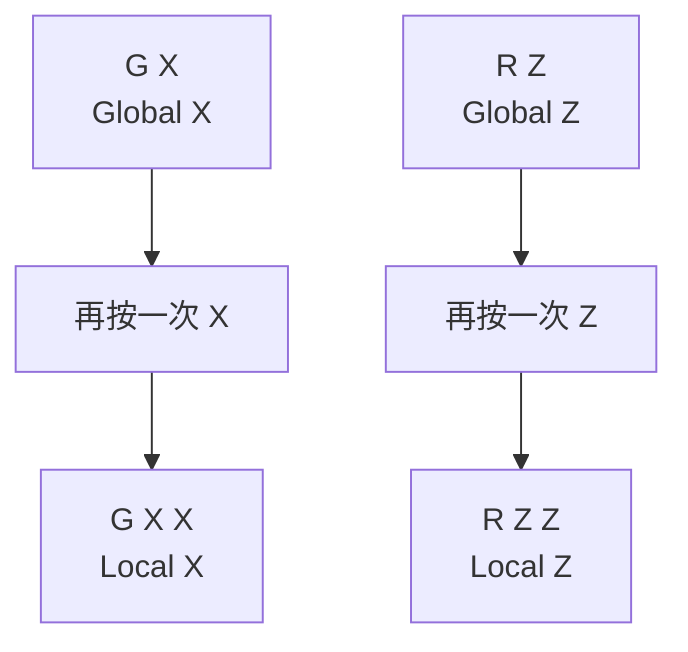
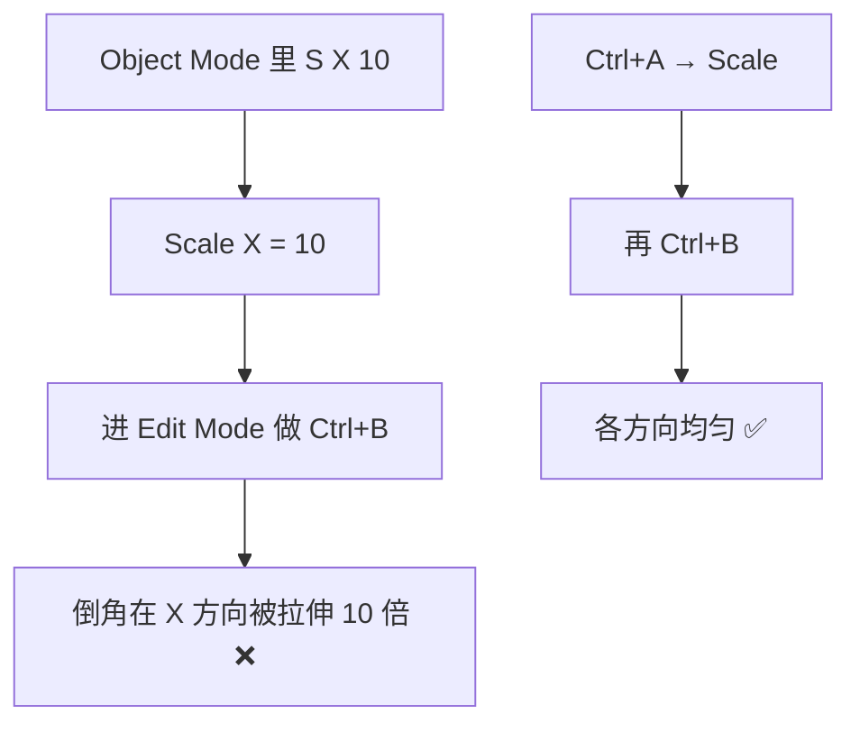

# 03 · 变换系统 G / R / S

> 来源合并：`Blender快捷键.md` 第 6、7、8、18、35、36 节 + `对象模式与编辑模式.md` 第 4–6、29 节
> 一句话：**Blender 的快捷键是一门语言，语法 = 动作 + 轴 + 数值。**

---

# 一、核心语法



| 输入 | 解析 |
| --- | --- |
| `G X 5` | 移动 → X 轴 → 5 |
| `R Z 90` | 旋转 → Z 轴 → 90° |
| `S X 2` | 缩放 → X 轴 → 2 倍 |
| `E Z 3` | 挤出 → Z 轴 → 3 |
| `S 0.5` | 整体缩小 50% |
| `G X -10` | 沿 X 反向移动 10 |

> 按了动作键之后**不按轴**就是自由变换；按一次轴锁定该轴；输入数字回车即精确值。

---

# 二、三个动作

| 键 | 动作 | 常见写法 |
| --- | --- | --- |
| `G` | Move 移动 | `G` / `G X` / `G Z 2` |
| `R` | Rotate 旋转 | `R` / `R Z 90` |
| `S` | Scale 缩放 | `S` / `S 2` / `S X 2` / `S Z 0.5` |

在 **Object Mode** 改的是整个物体；在 **Edit Mode** 改的是选中的点/边/面。

---

# 三、精细与吸附 ⭐

变换过程中（还没确认前）按这三个修饰键：

| 修饰键 | 效果 |
| --- | --- |
| `Shift` | **精细模式**：降低变化速度，提高精度 |
| `Ctrl` | **粗粒度吸附**：吸附到网格 / 固定角度（如 5° 一档） |
| `Shift+Ctrl` | **精细吸附** |

另有独立开关：

| 键 | 功能 |
| --- | --- |
| `Shift+Tab` | 切换 Snapping（顶点 / 边 / 面 / 增量吸附） |
| `O` | Proportional Editing 衰减编辑；滚轮调影响半径 |

Proportional Editing 适合：地形、有机形状、布料、人脸——移动一个点，周围按衰减一起动。

---

# 四、全局轴 vs 局部轴 ⭐⭐



- **第一次按轴 = 全局轴**（世界坐标）
- **再按一次同一个轴 = 局部轴**（跟随物体自身朝向）

> 物体被旋转过之后，`G X` 和 `G X X` 的方向完全不同。做角色 / 机械时这个区别会直接决定对不对。

---

# 五、Apply 应用变换（`Ctrl+A`）

| 菜单项 | 作用 |
| --- | --- |
| Location | 位置归零 |
| Rotation | 旋转归零 |
| **Scale** | **缩放归 1（最常用）** |
| Rotation & Scale | 两者一起 |
| All Transforms | 全部归零 |

---

# 六、为什么 Scale ≠ 1 是万恶之源



连带影响：修改器结果变形、镜像/阵列错位、导出进引擎后尺寸不对。

**固定流程：**


---

# 七、速查表

```text
G / R / S              移动 / 旋转 / 缩放
G X 5  R Z 90  S 2     动作 + 轴 + 数值
Shift                  精细
Ctrl                   吸附（固定角度 / 网格）
Shift+Ctrl             精细吸附
Shift+Tab              开关 Snapping
X X / Z Z              第二次按 = 局部轴
O                      Proportional Editing（滚轮调半径）
Ctrl+A → Scale         应用缩放（建模前必做）
```

---

# 八、自检清单

- [ ] 能闭眼写出 `G X 5` / `R Z 90` / `S 0.5` 的含义
- [ ] 知道 `Shift` 是精细、`Ctrl` 是吸附
- [ ] 知道 `G X` 和 `G X X` 的区别，并能在旋转过的物体上用对
- [ ] 每次改完 Object 尺寸都记得 `Ctrl+A → Scale`
