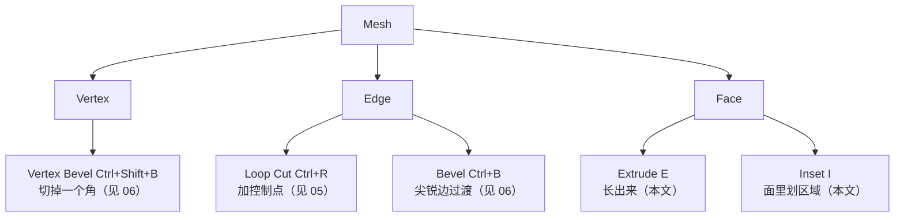
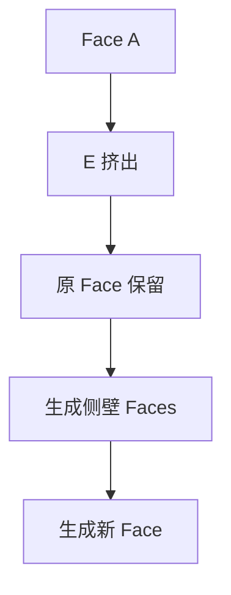
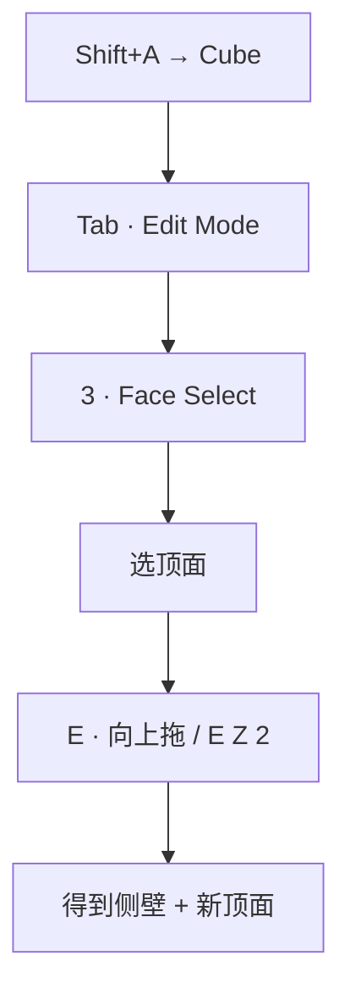
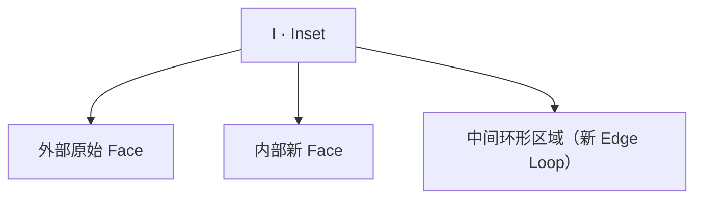
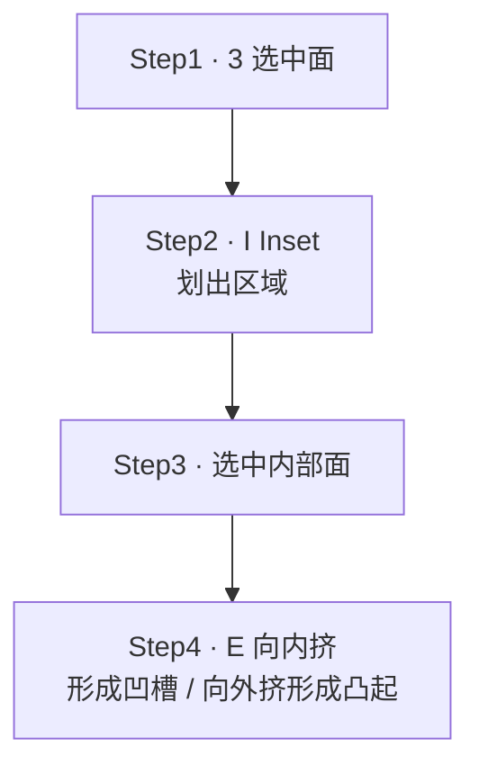

# 04 · 挤出与内插：E / I

> 来源合并：`基础练习.md` 第 12–20、38–40、46–48 节 + `Blender快捷键.md` 第 10、11 节
> 一句话：**Extrude 让模型「长出来」；Inset 在面内部「划一块区域」。**

四工具地图（本文讲前两个，后两个各有专篇）：



---

# 一、Extrude 的本质

> **Extrude 不是「移动一个面」，而是「复制选中的边界，并在新旧几何之间建立连接」。**



一次 Extrude 产生：新的 Vertex + 新的 Edge + 新的 Face —— **它在创造拓扑**。

对照：

| 操作 | 本质 |
| --- | --- |
| `G` 移动 | 搬动已有几何，拓扑不变 |
| `E` 挤出 | 复制边界 + 连接，**新增几何** |

---

# 二、最基本的挤出



```
      ┌────────┐
     /        /│
    /────────/ │
    │        │ │
    │        │ /
    └────────┘/
```

---

# 三、Extrude 的两个变体（`Alt+E`）

| 变体 | 行为 | 用途 |
| --- | --- | --- |
| **Extrude 默认 `E`** | 选中区域作为**连续整体**挤出 | 大多数情况 |
| **Individual Faces** | 每个面**各自独立**挤出 | 百叶窗、散热格栅、机械细节 |
| **Along Normals** | 每个面沿**自己的法线**挤出 | 斜面、多面体、非轴向结构 |

```
默认 E（整体）:        Individual（各自）:

┌───┬───┬───┐          ┌───┐ ┌───┐ ┌───┐
│   │   │   │          │ ↑ │ │ ↑ │ │ ↑ │
└───┴───┴───┘          └───┘ └───┘ └───┘
  一起长出来              各自长出来
```

---

# 四、Inset 的本质

> **Inset = 在当前 Face 内部创建一个新的 Face，中间形成一圈新的 Edge Loop。**

```
选一个面:           按 I 之后:

┌──────────┐        ┌──────────┐
│          │        │  ┌────┐  │
│          │   →    │  │    │  │
│          │        │  └────┘  │
└──────────┘        └──────────┘
```



**Inset 不产生体积**，它只是在面上划线分区——这一点决定了它和 Extrude 的分工。

---

# 五、Inset + Extrude：黄金组合

硬表面 90% 的凹槽 / 凸起都靠这两步：



```
┌──────────────┐
│              │
│   ┌──────┐   │
│   │      │   │  ← 向内挤入 = 凹槽
│   └──────┘   │
└──────────────┘
```

---

# 六、E / I / Ctrl+R 三者对照 ⭐

最容易混的三个工具：

| 工具 | 快捷键 | 作用范围 | 是否改变形状 | 典型误用 |
| --- | --- | --- | --- | --- |
| **Extrude** | `E` | 选中区域的边界 | ✅ 长出体积 | 当 `G` 用来「移动面」 |
| **Inset** | `I` | **单个 Face 内部** | ❌ 只在面上分区 | 当 `Ctrl+R` 用来「加一圈线」 |
| **Loop Cut** | `Ctrl+R` | **整圈连续拓扑** | ❌ 只切分，不移动 | 当 `I` 用来「做边框」 |

```
Loop Cut（整圈）:      Inset（面内嵌套）:

┌────────┐             ┌────────┐
│        │             │ ┌────┐ │
├────────┤             │ │    │ │
│        │             │ └────┘ │
└────────┘             └────────┘
```

---

# 七、四个工具对应四种造型意图 ⭐

| 工具 | 我心里想的是 |
| --- | --- |
| `E` Extrude | 「我要让模型**长出来**」 |
| `I` Inset | 「我要在这个面里**划一个区域**」 |
| `Ctrl+R` Loop Cut | 「我要**增加控制点**」 |
| `Ctrl+B` Bevel | 「我要让尖锐边**产生过渡**」 |

---

# 八、与本文相关的常见错误

| 错误 | 正确做法 |
| --- | --- |
| 在 Object Mode 按 `E` 没反应 | 先 `Tab` 进 Edit Mode |
| 想移动一个面却按了 `1`（顶点模式） | 按 `3` 面模式 |
| 把 `E` 当 `G` 用，模型多出一堆面 | 只想挪位置就用 `G`，要新增几何才用 `E` |
| 没 Apply Scale 就 Inset / Extrude | `Ctrl+A → Scale` 再来 |
| 用 `I` 做整圈切分 | 那是 `Ctrl+R` 的活 |

---

**下一步**：`05-环切与拓扑-Ctrl+R.md`（加控制点）→ `06-倒角-Bevel.md`（处理尖锐边）。
