# 05 · 环切与拓扑控制：Ctrl + R

> 来源合并：`环切详解.md` 全文 + `基础练习.md` 第 21–27 节 + `Bevel倒角详解.md` 第 8 节（SubD 策略）
> 已按 Blender 官方手册（Loop Cut and Slide / Edge Slide / Select Loops / Subdivision Surface）校准工具参数与边界行为。
> 一句话：**`Ctrl+R` 不是「切一刀」，而是在现有 Quad 拓扑中插入一个连续的 Edge Loop。**

接 `04` 的结尾：那里把 `E / I / Ctrl+R / Ctrl+B` 分成四种造型意图，`Ctrl+R` 对应的那句是——

> **「我要增加控制点。」**

`E` 和 `I` 会改变模型，`Ctrl+R` **不改变形状，只改变你能控制形状的能力**。这是它最容易被误解的地方。

**本文的阅读路径**（一条主线，按顺序走完就是完整闭环）：


---

# 一、它是什么

## 本质

> **沿着一整圈连续的面，插入一条首尾相接的边。**

单个面看，是「1 个 Quad 切成 2 个」：

```
A────────B      A────────B
│        │  →  │        │
│        │     ├────────┤   ← 新增一条边
C────────D      C────────D

1 个 Quad    →    2 个 Quad
```

但 `Ctrl+R` **从不只切一个面**。它切的是穿过这条边的**整个面环**。

## 为什么叫「环」切

把 Cube 的 4 个侧面沿水平方向想象成展开成一条带子（`↩` 表示绕回去首尾相接）：

```
   前面      右面      后面      左面
┌────────┬────────┬────────┬────────┐
│        │        │        │        │
│        │        │        │        │
└────────┴────────┴────────┴────────┘  ↩ 左面接回前面

Ctrl+R 一刀 = 在这条带子上画一条横线，4 个面同时各被切成 2 个：

┌────────┬────────┬────────┬────────┐
│        │        │        │        │
├────────┼────────┼────────┼────────┤  ← 一条连续的 Edge Loop
│        │        │        │        │
└────────┴────────┴────────┴────────┘

4 个 Quad  →  8 个 Quad
```

> **关键认知：你按下 `Ctrl+R` 时，改的是整个环，不是眼前那一个面。**
> 这也是后面所有「为什么这条线跑偏了」问题的根源——它沿着环走，不跟着你的视线走。

---

# 二、为什么需要它：四个动机

## 动机 1 · 没有控制点，就改不了形状

一大块平面，你想让中间鼓起来：

```
┌────────────┐
│            │
│            │   ← 只有 4 个角顶点，中间没有东西可抓
│            │
└────────────┘
```

`G / S / E` 都只能动到已有顶点。加一条 Loop 之后：

```
┌────────────┐
│            │
├────────────┤   ← 现在中间有一整排顶点可抓
│            │
└────────────┘
```

> **`Ctrl+R` 买的不是「细节」，是「抓手」。**

## 动机 2 · 给 `E / I / Ctrl+B` 提供拓扑

- `I` / `E` 需要一块面来操作 → 先用 `Ctrl+R` 划出那块面
- `Ctrl+B` 的倒角宽度受相邻面尺寸限制 → 先用 `Ctrl+R` 撑开空间
- 做把手 / 凸起 → 先加 Loop，再选面挤出

## 动机 3 · 控制 Subdivision 后的形状

这是 `Ctrl+R` 价值最高的用途，单独在第七节展开。

## 动机 4 · 按结构规划布线

做人体 / 角色时，Loop 的位置就是解剖结构的位置：

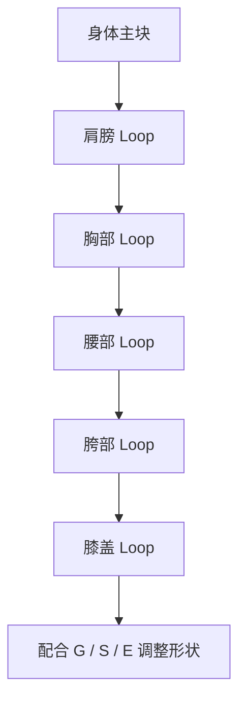

> **加线之前先想清楚「这条线代表什么结构」。**
> 随手加的线，后面调形状时全部会变成负担（见 `09-B1`）。

---

# 三、标准操作：三个阶段，两次左键

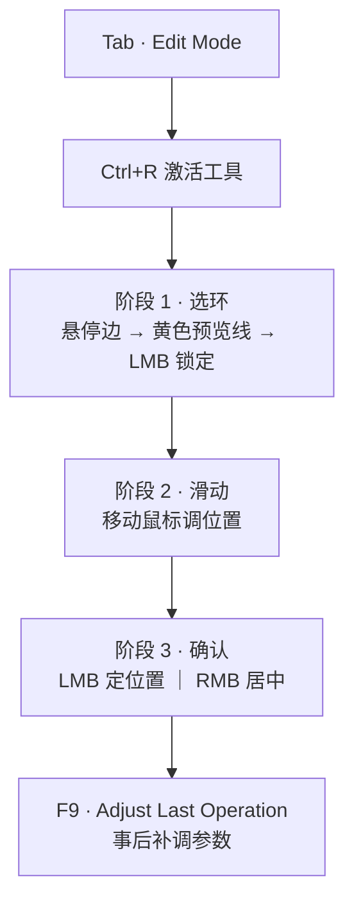

## 两次左键分别做什么 ⭐（最容易混淆的点）

| 次序 | 阶段 | 含义 |
| --- | --- | --- |
| **第一次 LMB** | 选环 | 锁定当前预览的**拓扑环**（此时还没定位置） |
| 移动鼠标 | 滑动 | 在两个相邻 Loop 之间**滑动** |
| **第二次 LMB** | 确认 | 在鼠标所在位置**切下去** |
| **第二次 RMB** | 确认 | 放弃偏移 → **Loop 落在正中间（50%）** |

## ⚠️ 同一个右键，两个阶段含义相反

这是本工具最大的坑，官方手册写得很明确：

| 阶段 | 按 `RMB` 的结果 |
| --- | --- |
| 阶段 1（还没按过 LMB） | **中止整个操作**，什么都不会发生 |
| 阶段 2（已按过第一次 LMB） | **确认切下去**，但位置强制居中 |

> **`Ctrl+R → LMB → RMB` = 在正中央快速加一条 Loop。**
> 这是最高频的一串操作，练到不用想。
> 记混的表现：「我按了右键怎么什么都没出来」——那是按早了。

---

# 四、参数：数量 / 方向 / 平滑

## 1 · 数量（Number of Cuts）

在**阶段 1**（锁定环之前）调整，三种方式等价：

| 方式 | 操作 |
| --- | --- |
| 滚轮 | 上滚加、下滚减 |
| 数字键 | 直接键入数字 |
| `PageUp` / `PageDown` | 逐个增减 |

```
1 Cut → 2 个面      2 Cuts → 3 个面      3 Cuts → 4 个面      5 Cuts → 6 个面
```

> ⚠️ **多重环切会跳过滑动阶段，且位置均匀分布、不可单独控制。**
> 官方手册原文：*these cuts are uniformly distributed in the original face loop, and you will not be able to control their positions*。
> 想要「几条线但位置各自不同」→ 只能一条一条加，再逐条 `G G` 滑。

## 2 · 方向

官方定义：**把光标悬停在「切割方向会穿过的那条边」上**——也就是垂直于你想要的切割方向的那条边。

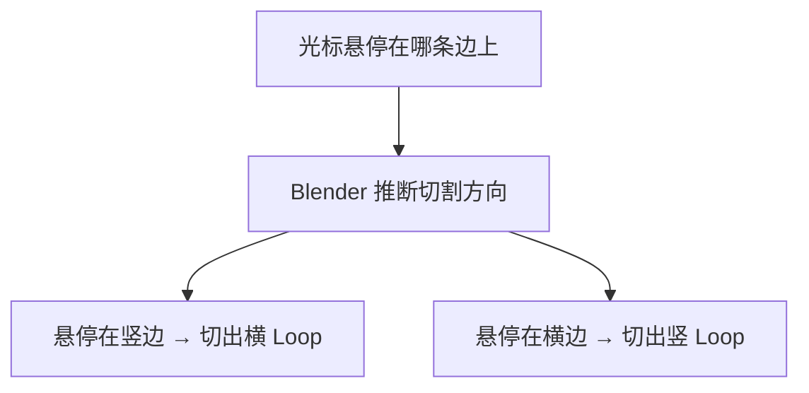

> 不要用「纵向边 / 横向边」记——**3D 里它会随视角旋转**。
> 稳定的记法是：**黄色预览线穿过哪条边，就悬停那条边。**

## 3 · Smoothness（`Alt + 滚轮`）

让新顶点沿法线偏移一点，以保持曲面曲率（类似 Subdivide 的 Smooth 值）。

- 默认 0：新顶点精确落在原边上 → 面保持平整，但 **SubD 后可能扭曲**
- 调高：保持原有曲率 → 有曲面的模型加线后不会变「瘪」

> 官方提示：这个参数在阶段 1 **不显示预览**，所以更好的做法是**先切完，再在 `F9` 面板里调**。

---

# 五、滑动 = Edge Slide（同一件事）

> **阶段 2 的移动鼠标，就是 Edge Slide。** 不是两个功能，是一个功能的两个入口。

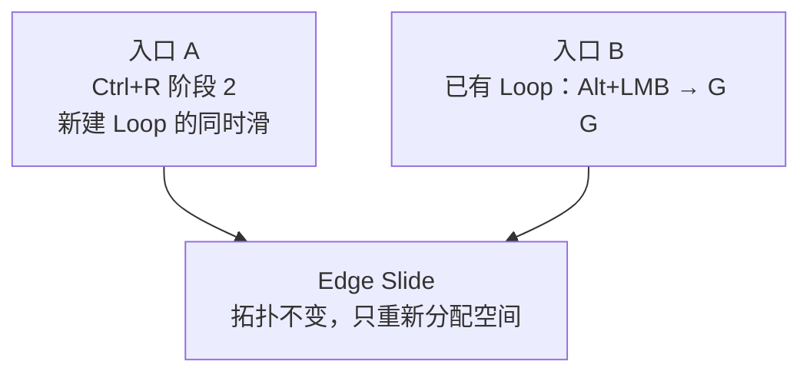

## 本质

Loop 在 A、B 两条边之间滑动，**不新增也不删除任何边**，只是重新分配 A、B 之间的空间：

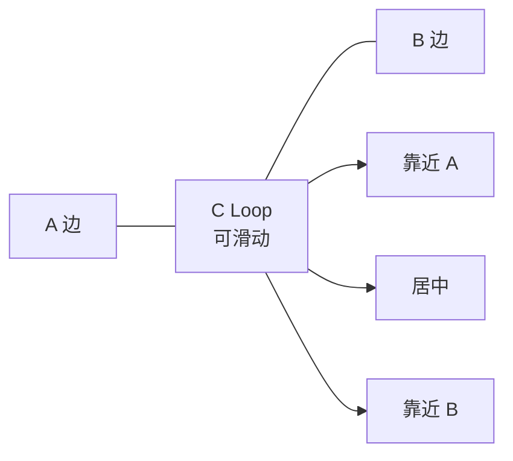

## 滑动中的三个开关 ⭐

| 开关 | 按键 | 作用 |
| --- | --- | --- |
| **Even** | `E` | 改成「与相邻 Loop 保持**相同绝对距离**」（默认按各边长度**百分比**移动）。长短边混合时默认会歪，开 Even 就跟相邻 Loop 平行 |
| **Flip** | `F` | Even 开启时才有效 → 改用**另一侧**的相邻 Loop 作为参照 |
| **Clamp** | `C`（或按住 `Alt`） | 限制 Loop 不滑出面的边界。**默认开**；关掉可以滑过头（一般不需要） |

> **默认模式 vs Even 模式**：默认每个顶点沿自己那条边走相同的**百分比**，所以边长短不一时 Loop 会歪；Even 改成走相同的**绝对距离**，结果是跟相邻 Loop 平行。
> 「加了线但线是斜的」→ 先试 `E`。

## 失败情形

`G G` 报 "Invalid selection" 通常有三种原因：

| 原因 | 说明 |
| --- | --- |
| 自相交的 Loop | 选到了同一面上的两条边 |
| 跨了多个 Loop | 选中的边不在同一条 Loop 上 |
| 单面的边界边 | 只有一个面相邻，找不到可滑的 Loop |

---

# 六、拓扑基础：Loop / Ring / 极点 / 面类型

## Edge Loop vs Edge Ring ⭐

| 概念 | 含义 | 选择方式 |
| --- | --- | --- |
| **Edge Loop** | 沿拓扑首尾相连的**一条链**（通常绕模型一圈） | `Alt+LMB` |
| **Edge Ring** | 一组**互相平行**的边（横跨一排面） | `Ctrl+Alt+LMB` |
| **追加选择** | 加到已有选区而不是替换 | `Shift+Alt+LMB` / `Shift+Ctrl+Alt+LMB` |

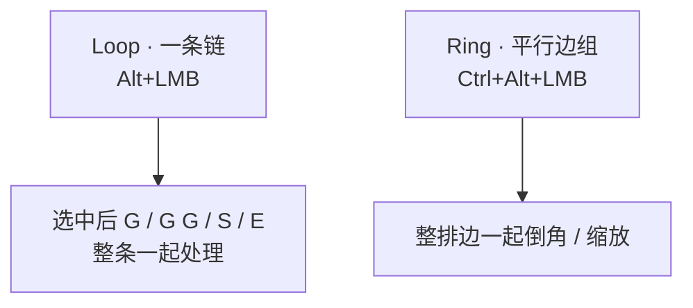

> ⚠️ **macOS 触控板用户注意**：若开了 `Emulate 3 Button Mouse`，`Alt+LMB` 会被占用作 MMB 模拟，选环**失效**。
> 官方给的替代：**双击 LMB** 选环。或者干脆接个三键鼠标（见路线图第 1 节）。

## Loop 在哪里会断：极点（Pole）

官方手册原文：*the to be created edge loop stops at the poles (tris and n-gons) where the existing face loop terminates.*

| 拓扑 | 对 Loop 的影响 |
| --- | --- |
| **Quad（4 边）** | Loop 顺畅穿过 ✅ |
| **Triangle（3 边）** | 阻断 / 转向 ❌ |
| **N-Gon（5+ 边）** | 无法继续 / 改变方向 / 结果不可控 ❌ |
| **Pole 极点**（连接 ≠4 条边的顶点） | Loop 在此**终止** |

> **Quad Flow 的本质就是：让 Edge Loop 能连续、按预期地流动。**
> 所以「Loop 切到一半断了」不要硬切——去看断点上是不是有个三角面或 N-Gon。

**修一个断掉的边界**：对边界边再执行一次 `Alt+LMB`（第二次），会选中**整条边界**（All Boundaries）。三角面 / N-Gon 混合时这招特别好用。

---

# 七、支撑线与 Subdivision ⭐⭐

## 核心现象

Subdivision Surface 会把模型变圆。**在边缘附近加 Loop 就能把它「撑住」**，这类 Loop 叫 **Support Loop（支撑线）**。

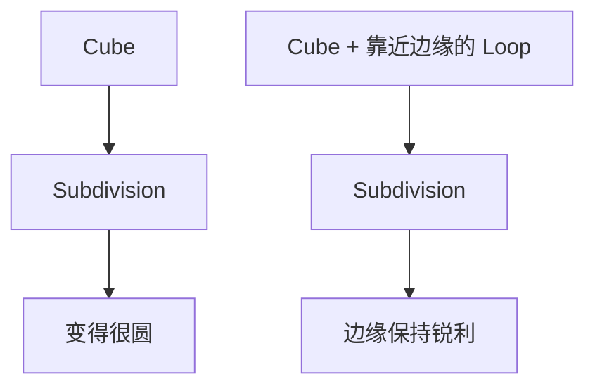

## 量化规律：圆角半径 ≈ 支撑线到边缘的距离 ⭐

这一条比「越近越硬」更好用，因为它**可预测、可调**：

一个角，剖面俯视（两侧的 `│` 是支撑线，`d` = 支撑线到边缘的距离）：

```
   d 大（支撑线远离边）          d 小（支撑线贴近边）

   ┌────────────────┐          ┌────────────────┐
   │   │        │   │          │ │            │ │
   │   │        │   │          │ │            │ │
   └───┼────────┼───┘          └─┼────────────┼─┘

   SubD 后：                   SubD 后：
      ╭──────╮                    ┃
     ╱        ╲                   ┃
    │          │                  ┃
     ╲        ╱                   ┃
      ╰──────╯                    ┃

   圆角半径 ≈ d（大 → 软）       圆角半径 ≈ d（小 → 硬）
```

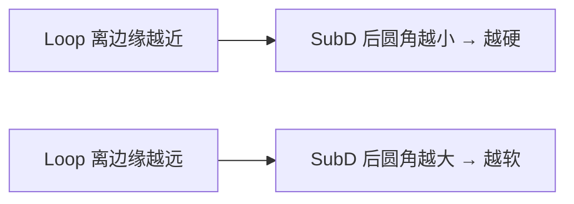

> 所以「Loop Cut + 滑动」实际是在**用线的位置调 SubD 后的圆角半径**。

## 支撑线 vs `Shift+E` 折痕

两种保硬边的方案，各有适用场景：

| 方案 | 做法 | 优点 | 缺点 |
| --- | --- | --- | --- |
| **支撑线** | `Ctrl+R` 靠边加线 | 不加修改器也能用；形状与硬边一起调 | 增加面数；调位置要重滑 |
| **Edge Crease** | 选边 → `Shift+E` 拖出权重（0–1） | **不加面数**；非破坏性 | 只在有 SubD 修改器时有效；高权重交汇处可能收缩变形 |

> **业界做法：两者结合**——主线用支撑线定住结构，局部细节用 `Shift+E` 补硬。
> `Shift+E = 1.0` 时该边完全不被平滑。

## 与 `06` 的关系

`06-倒角-Bevel.md` 第九节「策略 C：Bevel(1段) + SubD」是**硬表面的默认解**；本节是「策略 B：纯 SubD + 支撑线」。
两条路都能得到圆角方块，区别在面数与可控性 → 见 `08` 练习 8 的 A / B 路线对比。

---

# 八、四种组合技

| 组合 | 操作 | 什么时候用 |
| --- | --- | --- |
| `Ctrl+R` → `G` | 加线后移动 | 调整上下**比例**（比如把头做长一点） |
| `Ctrl+R` → `Alt+LMB` → `S` | 加线后选整圈缩放 | **收腰 / 瓶颈 / 手腕**——局部变细 |
| `Ctrl+R` → 选面 → `E` | 加线后挤出 | 长出**把手 / 凸起**这类结构 |
| `Ctrl+R` ×2 → `Ctrl+B` | 双支撑线 + 倒角 | **硬表面经典组合**，边又硬又有高光 |

> 判断依据只有一条：**你想控制的是「比例」「粗细」「长出结构」还是「硬边」**，四选一。

---

# 九、工具边界：与 `K` / Subdivide 的区别

| 工具 | 本质 | 可控性 | 产物 |
| --- | --- | --- | --- |
| **`Ctrl+R` Loop Cut** | 沿**拓扑流向**插入整圈 Loop | 方向 / 位置 / 数量 / 滑动**全部可控** | 保持 Quad ✅ |
| **`K` Knife** | 自由切割，点对点刻线 | 任意路径 | **会产生三角面 / N-Gon** ⚠️ |
| **右键 Subdivide** | 选中区域**整体细分** | 简单，但不控流向 | 保持 Quad，但**横竖同时切** |

```
原始 1 个 Quad：
┌────────────┐
│            │
│            │
└────────────┘

Ctrl+R（只切一个方向）：         Subdivide（横竖同时切）：
┌────────────┐                  ┌─────┬─────┐
│            │                  │     │     │
├────────────┤  ← 1 刀，2 个面   ├─────┼─────┤  ← 2 刀，4 个面
│            │                  │     │     │
└────────────┘                  └─────┴─────┘
```

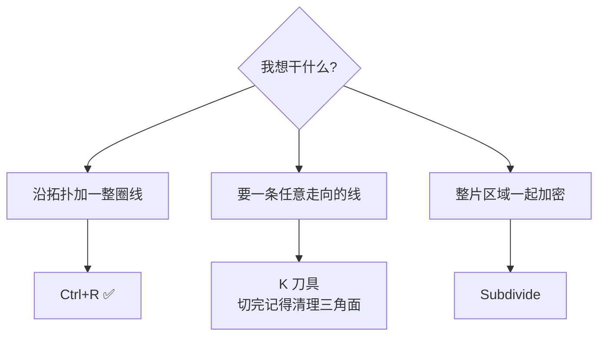

> **`K` 切完不清理是硬表面最常见的翻车方式**——一圈三角面会让后续所有 `Ctrl+R` 都跑偏。

---

# 十、完整案例：桌腿（理解「线控制形状」）

从一根长方体柱子到「上粗 / 中细 / 下粗」的桌腿，全程只用 `Ctrl+R / Alt+LMB / S / G`。

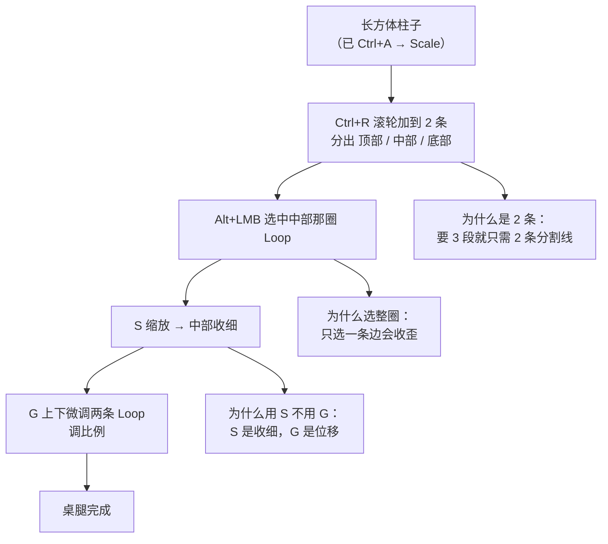

```
侧视（加线 → 收腰）：

  ┌──┐                    ┌──┐
  │  │                    │  │
  ├──┤  ← Loop 1          ├──┤
  │  │                    │ ┃┃  ← 中部被 S 收细
  ├──┤  ← Loop 2          │ ┃┃
  │  │                    ├──┤
  └──┘                    └──┘
   加线后                  收细后
```

> **自问一遍**：能不能说出每一步「为什么在这加线」？
> 说不出来 → 还没真正理解 `Ctrl+R`，回到第二节动机 4 重看。

---

# 十一、常见错误与排查

| 现象 | 原因 | 解法 |
| --- | --- | --- |
| 按了 `RMB` 什么都没发生 | 阶段 1 按的 `RMB` = 中止 | 先 `LMB` 锁环，再 `RMB` 居中 |
| 预览线方向不是想要的 | 悬停错了边 | 悬停**切割方向会穿过**的那条边 |
| 加了多条线但位置调不了 | 多切会跳过滑动阶段 | 逐条加，再逐条 `G G` |
| Loop 切到一半停了 / 跑偏 | 撞到三角面、N-Gon 或极点 | 清理该处拓扑；或用 `K` 后手动修 |
| `Alt+LMB` 选不中环 | 开了 `Emulate 3 Button Mouse` | 双击 LMB，或关掉该选项 / 接三键鼠标 |
| `G G` 报 Invalid selection | 选了自相交 / 跨 Loop / 单面边界边 | 用 `Alt+LMB` 重新选一条干净 Loop |
| SubD 后角还是糊 | 支撑线离边太远 | 把 Loop 往边滑近（圆角半径 ≈ 该距离） |
| 加了线反而更难改 | 为了「精细」乱加线 | 见 `09-B1`：先用最少的线把形状定住 |
| 在 Object Mode 按 `Ctrl+R` 无效 | 模式不对 | `Tab` 进 Edit Mode |

**通用排查顺序：**

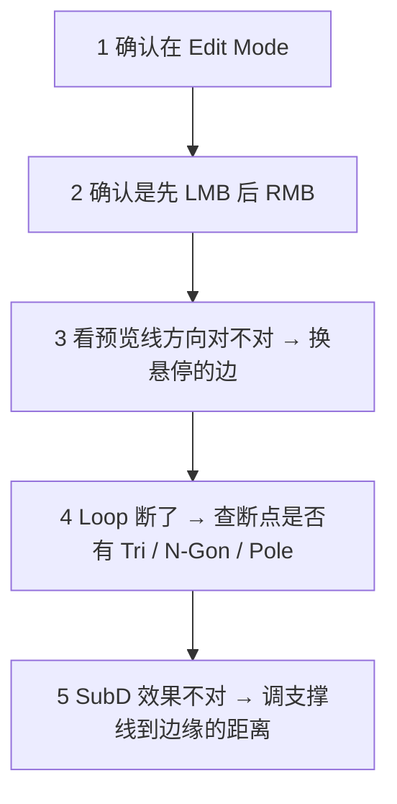

---

# 十二、速查与自检

## 快捷键

| 操作 | 快捷键 |
| --- | --- |
| 激活环切 | `Ctrl+R` |
| 锁环 / 定位置 | `LMB` ×2 |
| 中止（阶段 1）/ 居中（阶段 2） | `RMB` |
| 增减切割数量 | 滚轮 ｜ 数字键 ｜ `PageUp` / `PageDown` |
| 平滑度 | `Alt+滚轮`（建议事后在 `F9` 调） |
| 滑动时：等距 / 翻面 / 钳制 | `E` / `F` / `C` |
| 事后补调所有参数 | `F9`（Adjust Last Operation） |
| 独立滑动已有 Loop | `Alt+LMB` → `G G` |
| 选择 Loop / Ring | `Alt+LMB` / `Ctrl+Alt+LMB` |
| 追加到已有选区 | 上述组合再加 `Shift` |
| 折痕（保硬边的替代方案） | `Shift+E` |

## 自检：练到什么程度算过关

`08` 练习 6 有 5 个操作步骤，下面是可以**判定**的验收标准（不是操作罗列）：

| # | 验收点 | 判定方式 |
| - | ------ | -------- |
| ① | 中央加线不用想 | 连续 5 次 `Ctrl+R → LMB → RMB`，位置都在正中间 |
| ② | 数量控制 | 不看屏幕提示，能一次切出 2 / 5 / 10 条 |
| ③ | 会说清右键的两副面孔 | 能说出阶段 1 与阶段 2 按 `RMB` 的区别 |
| ④ | 滑动可控 | 能把已有 Loop 精确滑到距边「很近」和「居中」两个位置 |
| ⑤ | 支撑线量化 | 能预测「把 Loop 往边滑近 → SubD 后圆角变小」，并验证成立 |

> 全部 5 条通过 = 路线图 **Stage 0** 的 `Ctrl+R` 部分完成。

---

# 十三、一句话记忆

> `Ctrl+R` = 在 Quad 拓扑中**插入一个连续 Edge Loop**，它**不改变形状，只给你控制形状的位置**；
> 随后用 **Slide（`G G`）/ 移动（`G`）/ 缩放（`S`）/ 挤出（`E`）** 控制局部形状，
> 用**靠近边缘的支撑线**控制 Subdivision 后的圆角半径（距离 ≈ 半径）。

**下一步**：`06-倒角-Bevel.md` —— 处理尖锐边，以及「Bevel 1 段 + SubD」这个硬表面默认组合。
