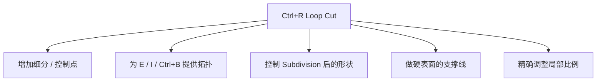
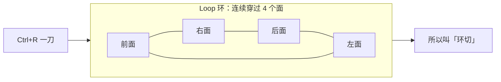
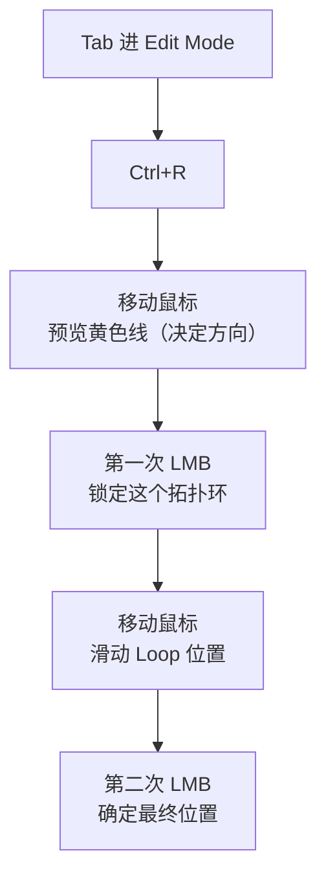
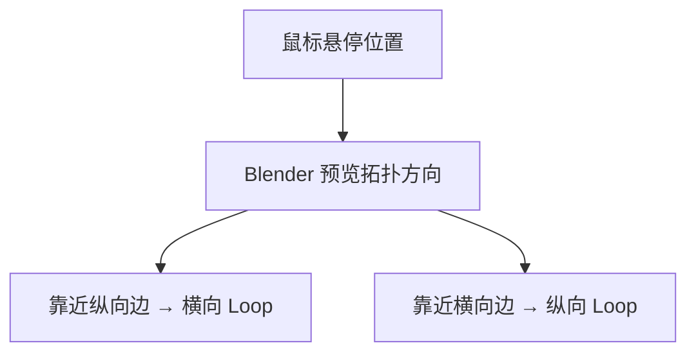
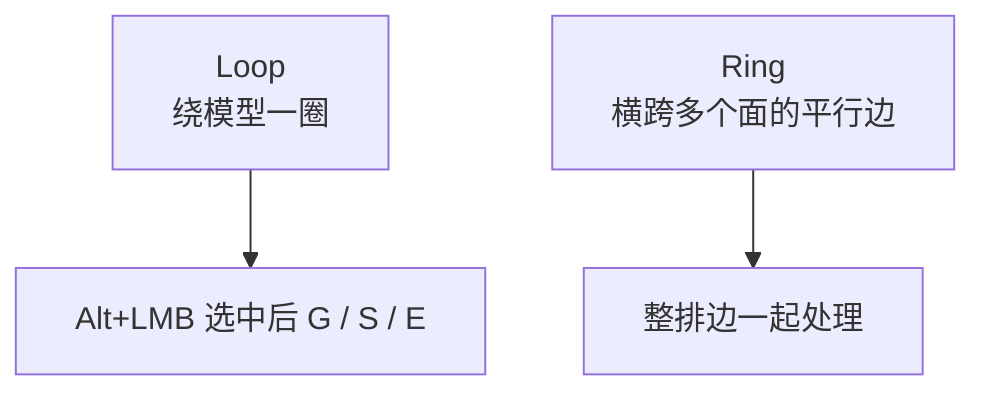
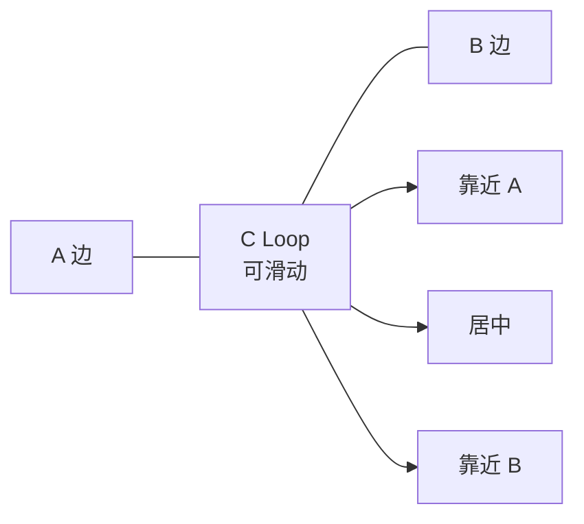
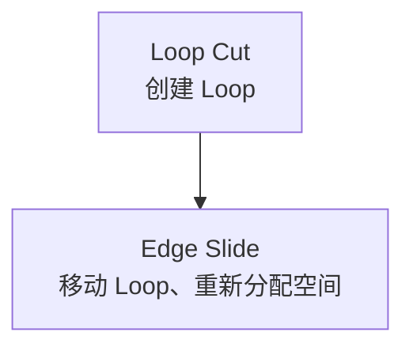
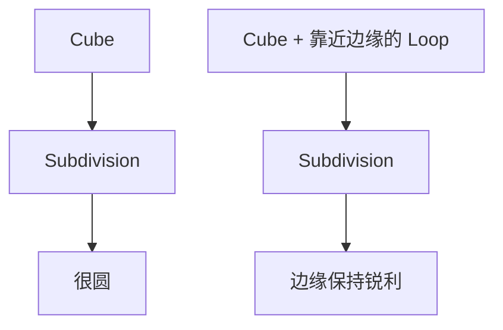
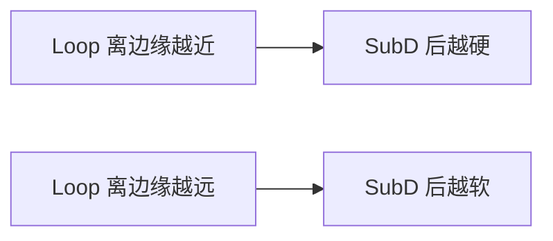

# 05 · 环切与拓扑控制：Ctrl + R

> 来源合并：`环切详解.md` 全文 + `基础练习.md` 第 21–27 节 + `Bevel倒角详解.md` 第 8 节（SubD 策略）
> 一句话：**`Ctrl+R` 不是「切一刀」，而是在现有 Quad 拓扑中插入一个连续的 Edge Loop。**

用途总览：



---

# 一、Loop Cut 到底在做什么

Cube 的每个面是 Quad。`Ctrl+R` 不是只切一个面，而是**沿整个连续的拓扑环切过去**：



```
A────────B      A────────B
│        │  →  │        │
│        │     ├────────┤
C────────D      C────────D
      1 个 Quad  →  2 个 Quad
```

---

# 二、标准操作流程



### 两次左键分别做什么 ⭐（最容易混淆的点）

| 次序 | 含义 |
| --- | --- |
| **第一次 LMB** | 锁定当前预览的**拓扑环**（此时还没定位置） |
| 移动鼠标 | 在两个相邻 Edge 之间**滑动** Loop |
| **第二次 LMB** | 确定 Loop 的**最终位置** |
| **右键（RMB）** | 取消位置偏移 → **Loop 直接居中** |

> **`Ctrl+R → LMB → RMB` = 在正中央快速加一条 Loop。**
> 这是最高频的一串操作，练到不用想。

---

# 三、数量与方向

| 控制项 | 操作 |
| --- | --- |
| 一次加多条 | `Ctrl+R` 后滚**滚轮**（或按数字键）：1 → 2 → 3 → 5 … |
| 方向 | **鼠标悬停位置决定**：靠近纵向边 → 切出横向 Loop；靠近横向边 → 纵向 Loop |



---

# 四、拓扑基础：Loop vs Ring ⭐

| 概念 | 含义 | 选择方式 |
| --- | --- | --- |
| **Edge Loop** | 沿拓扑连续、首尾相连的一圈 | `Alt+LMB` 选环 |
| **Edge Ring** | 一组**平行**的边 | `Ctrl+Alt+LMB` 选圈 |



### Quad / Triangle / N-Gon 对环切的影响

| 拓扑 | 环切表现 |
| --- | --- |
| **Quad** | Loop 顺畅穿过 ✅ |
| **Triangle** | 阻断 Loop，使其转向或中断 ❌ |
| **N-Gon（5+ 边）** | 无法继续 / 改变方向 / 结果不可控 ❌ |

> 这就是业界强调 **Quad Flow** 的原因：让 Edge Loop 保持连续、合理地流动。

---

# 五、Edge Slide（`G G`）：重新分配空间

> **Loop Cut = 创建 Loop；Edge Slide = 移动 Loop，拓扑不变。**



- 在 `Ctrl+R` 确认环之后移动鼠标 = 滑动
- 已有 Loop：选中后 `G G` 进入 Edge Slide



---

# 六、支撑线与 Subdivision ⭐⭐

Subdivision Surface 会把模型变圆；**在边缘附近加 Loop 就能把它「撑住」**：



**核心规律：**



所以「Loop Cut + 滑动」实际是在**控制 SubD 后的曲率**。这类 Loop 就叫 **Support Loop（支撑线）**。

---

# 七、常见组合技

| 组合 | 效果 |
| --- | --- |
| `Ctrl+R` → `G` | 移动 Loop，调上下比例 |
| `Ctrl+R` → `Alt+LMB` → `S` | 选中整圈缩放 → 收腰 / 瓶颈 / 手腕 |
| `Ctrl+R` → 选面 → `E` | 加控制点后挤出结构（把手、凸起） |
| `Ctrl+R` ×2 → `Ctrl+B` | 支撑线 + 倒角，硬表面经典组合 |
| `Ctrl+R` → Subdivision | 支撑线控制平滑程度 |

---

# 八、与 K / Subdivide 的区别

| 工具 | 本质 | 可控性 |
| --- | --- | --- |
| `Ctrl+R` Loop Cut | 沿**拓扑流向**插入整圈 Loop | 方向 / 位置 / 数量 / 滑动**全部可控** |
| `K` Knife | 自由切割，点对点刻线 | 任意路径，但会产生非 Quad |
| 右键 Subdivide | 选中区域**整体细分**（横竖同时切） | 简单，但不控流向 |

```
Subdivide:            Loop Cut:
┌─────┬─────┐         ┌─────────────┐
│     │     │         ├─────────────┤  只切一个方向
├─────┼─────┘         │             │
│     │     │         └─────────────┘
```

---

# 九、快捷键速查

| 操作 | 快捷键 |
| --- | --- |
| Loop Cut | `Ctrl+R` |
| 确认（锁环 / 定位） | `LMB` |
| 居中 | `RMB` |
| 增加 Cut 数量 | 滚轮 / 数字键 |
| 移动 Loop | 移动鼠标 / `G` |
| Edge Slide | `G G` |
| 选择 Loop | `Alt+LMB` |
| 选择 Ring | `Ctrl+Alt+LMB` |
| 配套 | `E` 挤出 / `S` 缩放 / `Ctrl+B` 倒角 |

---

# 十、必练的 5 种用法

| # | 用法 | 操作 | 目标 |
| - | ---- | ---- | ---- |
| ① | 基础环切 | `Ctrl+R` → `LMB` → `RMB` | 快速在中心加 Loop |
| ② | 多重环切 | `Ctrl+R` → 滚轮 | 一次加 2 / 3 / 5 / 10 条 |
| ③ | 环切 + 滑动 | `Ctrl+R` → `LMB` → 移动 → `LMB` | 精确控制位置 |
| ④ | 选择 + Edge Slide | `Alt+LMB` → `G G` | 调整已有 Loop |
| ⑤ | 环切 + SubD | `Ctrl+R` → `Alt+LMB` → `G/S` | 理解支撑线控制硬度 |

---

# 十一、一句话记忆

> `Ctrl+R` = 在 Quad 拓扑中**插入一个连续 Edge Loop**；
> 随后用 **Slide（`G G`）/ 移动（`G`）/ 缩放（`S`）/ 挤出（`E`）** 控制局部形状，
> 用**靠近边缘的支撑线**控制 Subdivision 后的硬度。

**下一步**：`06-倒角-Bevel.md` —— 处理尖锐边，以及「Bevel 1 段 + SubD」这个硬表面默认组合。
