# 06 · 倒角 Bevel：Ctrl+B 与 Bevel 修改器

> 来源合并：`Bevel倒角详解.md` 全文 + `基础练习.md` 第 28–36、45、46 节 + `对象模式与编辑模式.md` 第 23 节
> 已按 **Blender 5.2 LTS 官方手册**（Bevel 工具 / Bevel Modifier）逐条校准，订正了旧稿 8 处事实错误。
> 一句话：**Bevel = 用一组新的面替换掉原来的尖锐边。** 它是拓扑重建，不是变形。

---

## 本次重组的三条主线

旧稿把 `Ctrl+B` 和修改器的参数混在一张表里讲，导致「哪些参数两边都有、哪些只有一边有」分不清，也埋了几个与官方文档冲突的说法。这一版重构成：

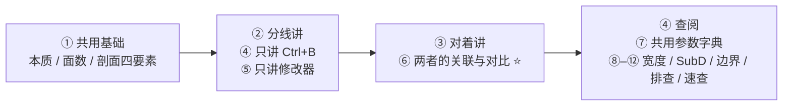

**旧说法订正一览**（校完之后再看同一张表，你会发现「修改器更高级」其实是个误会）：

| # | 旧稿说法 | 官方手册 5.2 LTS |
| - | -------- | ---------------- |
| 1 | `Ctrl+B` 没有 Clamp Overlap | ❌ **有**，工具进行中按 `C` 切换 |
| 2 | `Ctrl+B` 没有 Harden Normals | ❌ **有**，按 `H` 切换 |
| 3 | `Ctrl+B` 没有 Mark Seam / Mark Sharp | ❌ **有**，按 `U` / `K` 切换 |
| 4 | `Ctrl+B` 的 Limit Method「比较简单」 | ❌ **完全没有**，它的限制方式就是你的**选区** |
| 5 | Profile 决定「圆不圆」 | ⚠️ **Segments < 2 时 Profile 完全无效** |
| 6 | Mark Seam = 倒角边自动成为 UV 缝合边 | ❌ 只负责**让已有的 Seam 沿着新边传播**，不会凭空造 Seam |
| 7 | Width Type 有 4 种 | ❌ 有 **5 种**，第 5 种是 `Absolute` |
| 8 | Face Strength 默认 Medium | ❌ 选项是 `None / New / Affected / All` |

> ✅ **唯一真实的参数鸿沟只有一条：Limit Method。** 其余差异（能否回退、能否联动）来自「破坏性 vs 非破坏性」这个工作流属性，不来自功能多少。

---

# 一、Bevel 的本质

> **Bevel = 用一组新的面，替换掉原来的尖锐边。**

它不是「把边磨圆」，也不是「移动边」。它做的是：

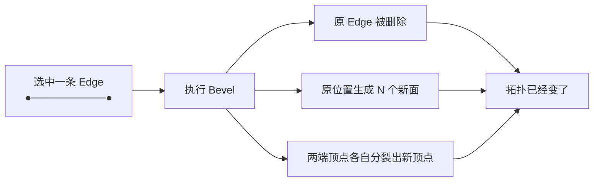

**因为它是拓扑重建而不是变形，所以：**

- 面数会真真实实涨上去（第二节）
- 相邻几何尺寸不够时会挤爆（第四节 `Clamp Overlap`）
- 已经倒过的位置改参数，只能靠重做（第四节路线 A 的代价）

## 为什么一定要倒角

现实世界几乎没有无限尖锐的边，光线会在边缘产生**高光**：

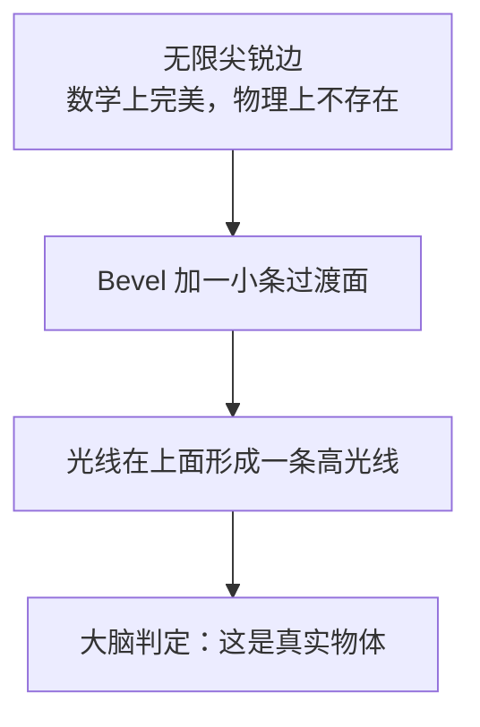

> **倒角的目的不是让模型「看起来圆」，而是在光照下产生一条高光线。**
> 这条判据贯穿全文——第八节所有宽度决策、第九节的 SubD 策略、第十一节的排查，最后都回到这句话。

---

# 二、几何代价：面数会爆炸 ⭐

这是 Bevel 最贵的地方，也是游戏资产里一切「省着用」的起点。

用 Cube 举例，默认 `8V / 12E / 6F`。全选 12 条边做一次 Bevel（Segments = 1）：

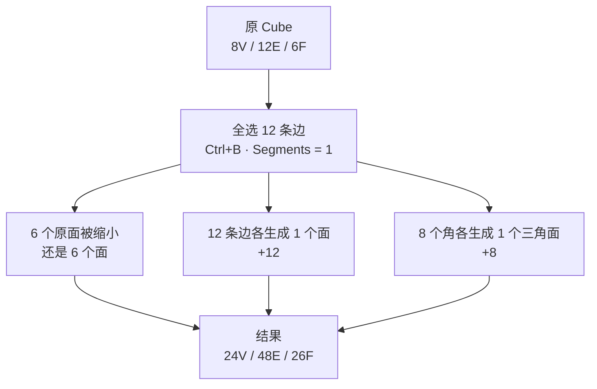

**面数 6 → 26，约 4.3 倍。**

近似公式（对全凸多面体成立）：

```
Bevel 后面数 ≈ 原面数 + 边数 × Segments + 顶点数
```

| Segments | Cube 倒角后面数 | 相对原模型 |
| -------- | --------------- | ---------- |
| 0（原始） | 6 | 1.0× |
| 1 | 26 | 4.3× |
| 2 | 38 | 6.3× |
| 3 | 50 | 8.3× |
| 5 | 74 | 12.3× |

> ⚠️ 这就是游戏资产 **Segments 只用 1–2** 的根本原因。一个 2000 面的道具，全边 Bevel 3 段会冲到 8000+ 面。
> 参照 `Blender学习路线图.md` Stage 6 的预算表：环境道具 PC/主机端也就 2,500 tri 左右。

---

# 三、剖面视角：Width / Width Type / Segments / Profile

把一条边**垂直切一刀**看剖面，这是理解 Bevel 最重要的一张图。**这一组参数在两条路线里完全共用**，所以放在分线讲解之前统一讲清楚。

## 3.1 Width Type：同一个数值的五种含义 ⭐

**同一个 Width 数值，在不同度量方式下含义完全不同。** 官方手册给了 5 种（`Ctrl+B` 和修改器都有）：

| 类型 | 含义 | 什么时候用 |
| ---- | ---- | ---------- |
| **Offset** | 从**原边**向外偏移的距离 | **默认**，绝大多数情况 |
| Width | 倒角**面本身**的宽度 | 要精确控制倒角面宽度时 |
| Depth | 原边到倒角斜面的**垂直深度** | 机械件、有图纸要求时 |
| Percent | 占**相邻边长度**的百分比 | 需要比例自适应时 |
| **Absolute** | 沿相邻边走的**精确距离** | 只有当与倒角边相连的未倒角边**不是直角相交**时，才看得出和 Offset 的区别 |

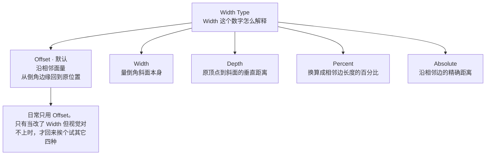

把这条边垂直切开看剖面（90° 原边，Segments = 1）：

```
                面 B
                 ↑
                 │
               Y ●┈┈┈┈┈┈┐
                 ┊      ╲
                 ┊       ╲     ← 倒角斜面 X–Y
                 ┊        ╲      三角形 P–Y–X 就是被切掉的那一块
                 ┊         ╲
       ──────────P──────────X────→  面 A
                 └── Offset ─┘

    P  原来那个尖角顶点，倒角之后就不存在了
    X  倒角斜面在面 A 上的落点，这里生成一条新边
    Y  同理，面 B 上的落点

    Offset    沿两侧面，从落点 X 退回原顶点 P 的距离   ← 默认，日常只用这个
    Width     斜面 X–Y 本身的长度
    Depth     原顶点 P 到斜面 X–Y 的垂直距离
    Percent   上面的距离 ÷ 相邻边的总长度
    Absolute  沿相邻边精确走这么远；只有两侧不垂直时才看得出和 Offset 的区别
```

> 默认用 **Offset**。这是最容易踩的一个坑：你以为在设圆角半径，其实在设偏移量。

## 3.2 Segments：切了几段

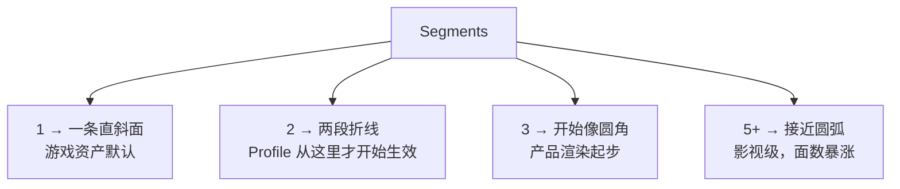

| Segments | 剖面形状 | 剖面新面数 | 适用 |
| -------- | -------- | ---------- | ---- |
| 1 | 一条斜面 | 1 | **游戏资产默认** |
| 2 | 两段折线 | 2 | 塑料、家电外壳 |
| 3 | 三段折线 | 3 | 产品渲染起步 |
| 5+ | 近似圆弧 | 5+ | 影视、特写 |

> ⚠️ **一个已知的面数陷阱**：`Ctrl+B` 进行操作时滚轮直接加 Segments，手一滑就到 8 段；修改器的 Segments 是数值框，必须手动输入，反而更安全。新手做资产时面数失控，几乎总是发生在 `Ctrl+B` 上。

## 3.3 Profile：⚠️ Segments < 2 时完全无效

范围 0–1，**默认 0.5**。但官方手册明确写着：**`Shape` 在 Segments 小于 2 时不起任何作用。**

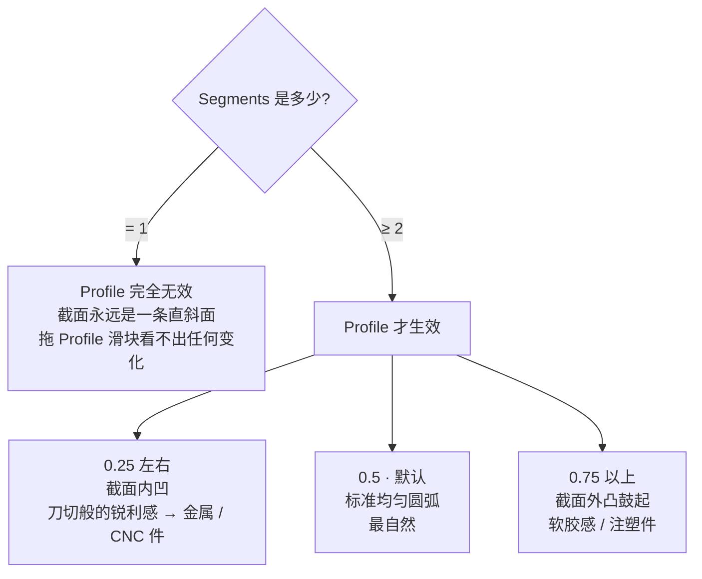

> **同样的限制也适用于 `Miter Shape`**：Segments < 2 时它同样不起作用。
> 记住这条推论：**做游戏资产用 Segments = 1 时，Profile 这一整个维度对你是关闭的**——想要「刀切感」只能靠后面第九节的 SubD 策略，或者直接加到 2 段。

---

# 四、路线 A：`Ctrl+B`（编辑模式 · 破坏性）

## 4.1 它是什么

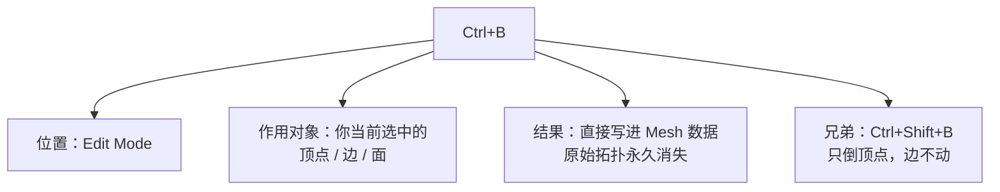

官方定义：**Bevel Vertices = `Shift+Ctrl+B`，Bevel Edges = `Ctrl+B`。** 三个选择模式（1/2/3）都能用：

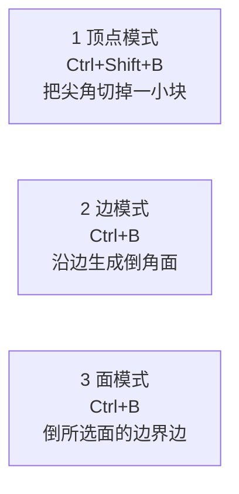

## 4.2 操作流程

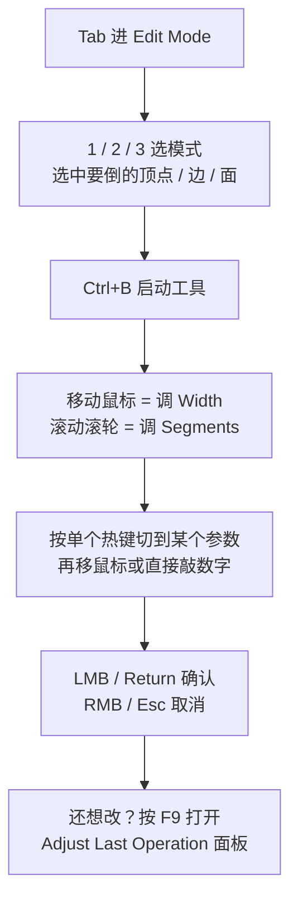

> 操作细节：移鼠标时按住 `Shift` = 精细调节；按住 `Ctrl` = 吸附到粗糙增量。

## 4.3 进行中的模态热键 ⭐ 这条旧稿完全漏了

工具激活时，顶部视口会实时显示当前设置，底部状态条同时列出热键。**按字母选中某个参数，再移鼠标或敲数字：**

| 键 | 参数 | 说明 |
| -- | ---- | ---- |
| `V` | **Affect** 作用对象 | Vertices 只倒顶点 / Edges 倒边及三条以上边交汇的顶点 |
| `M` | **Width Type** | Offset / Width / Depth / Percent / Absolute |
| `A` | **Width** | 倒角大小 |
| `S` | **Segments** | 段数；**滚轮始终可调** |
| `P` | **Profile Shape** | 截面胖瘦，0–1，默认 0.5 |
| `H` | **Harden Normals** | 给新面加自定义分裂法线 |
| `C` | **Clamp Overlap** | 防止倒角越过相邻面的末端 |
| `O` | **Miter Outer** | 外角收尾方式 |
| `I` | **Miter Inner** | 内角收尾方式 |
| `N` | **Intersection Type** | Grid Fill / Cutoff |
| `Z` | **Profile Type** | Superellipse / Custom |
| `U` | **Mark Seams** | 让 Seam 沿新边传播 |
| `K` | **Mark Sharp** | 同上，给硬边 |

> **这就是最常见的误解来源。** 大家以为 `Ctrl+B` 只有「鼠标拖宽度 + 滚轮加段数」两个能力，是因为从来没看底部状态条。实际上 `Ctrl+B` 拥有 Clamp Overlap、Harden Normals、Mark Seam 等全部核心选项——**它缺的不是这些参数，而是 Limit Method。**

## 4.4 它的「限制方式」就是你的选区 ⭐

这是路线 A 唯一、也是最关键的机制：`Ctrl+B` **没有 Limit Method**，所以「哪些边会被倒」这件事，完全由**你按 `Ctrl+B` 之前选了什么**决定。

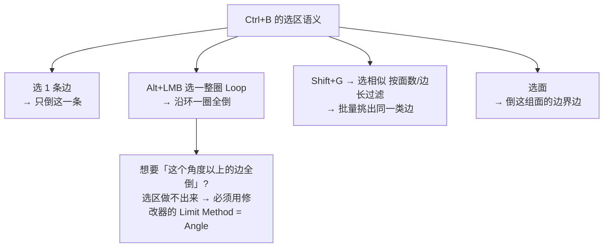

| 想做的事 | `Ctrl+B` 怎么做 | 够不够 |
| -------- | --------------- | ------ |
| 局部一两条边 | 手选 | ✅ 最快 |
| 一整圈 Loop | `Alt+LMB` 选环绕选 | ✅ |
| 一批同特征边 | `Shift+G` 选相似 | ✅ 勉强 |
| **所有超过 30° 的硬边** | 手选会累死 | ❌ **改用路线 B** |
| **不同边不同宽度** | 做不到 | ❌ **改用路线 B + Bevel Weight** |

## 4.5 什么时候用它

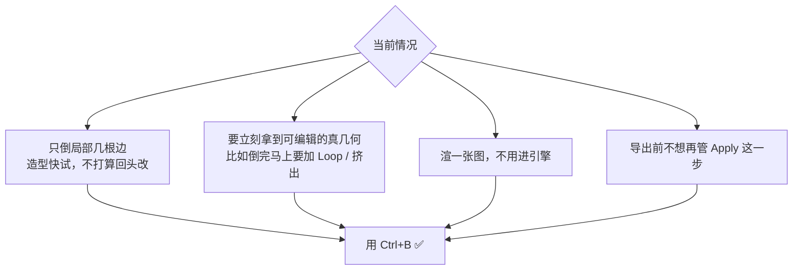

## 4.6 它的代价：不可回退


> **判断标准不是「高级不高级」，而是：这一步之后我还会不会改它？**
> 会改 → 绝不用 `Ctrl+B`。不会改 → `Ctrl+B` 反而更快，还天然满足 6.6 节的导出要求。

---

# 五、路线 B：Bevel 修改器（对象模式 · 非破坏性）

## 5.1 它是什么

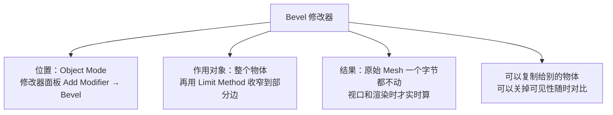

## 5.2 操作流程

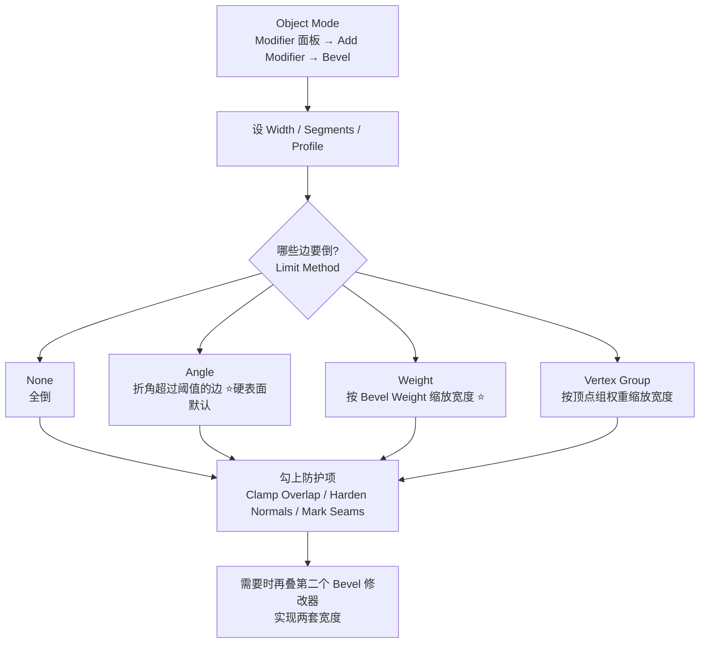

## 5.3 Limit Method：修改器独占的核心能力 ⭐⭐

**这是 `Ctrl+B` 和修改器之间唯一真实的参数鸿沟。** 四种方式：

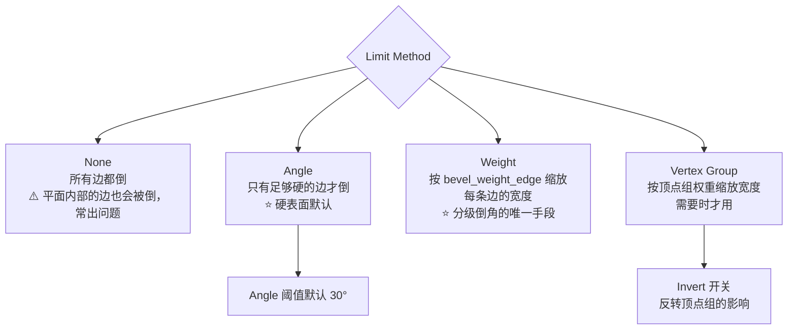

| 方式 | 判定依据 | 典型用法 | 坑 |
| ---- | -------- | -------- | -- |
| **None** | 无限制，全倒 | 极简模型 | ⚠️ 一个平面上 `Ctrl+R` 出来的边也会被倒，模型直接炸线 |
| **Angle** | 相邻面法线的夹角 > `Angle` 阈值才倒 | **硬表面默认**，`Angle = 30°–60°` | 角度都差不多的地方分不开，比如同是 90° 但功能不同的两类边 |
| **Weight** | 每条边的实际宽度 = `Bevel Weight × Width` | **精确分级** | weight = 0 的边完全不倒——这既是特性也是坑 |
| **Vertex Group** | 同上，但用顶点组权重；**边的两个端点都必须在组内**才会倒 | 与已有顶点组复用 | 忘了把两个端点都加进组 → 那条边不倒 |

### Angle 到底在比较什么

这条被讲错得最多。判定不是「角度大于还是小于阈值」的玄学，而是：

```
Limit Method = Angle 的判定规则：

  相邻两个面的法线夹角  >  Angle 阈值   →  这条边会被倒角
  相邻两个面的法线夹角  ≤  Angle 阈值   →  这条边直接跳过
```

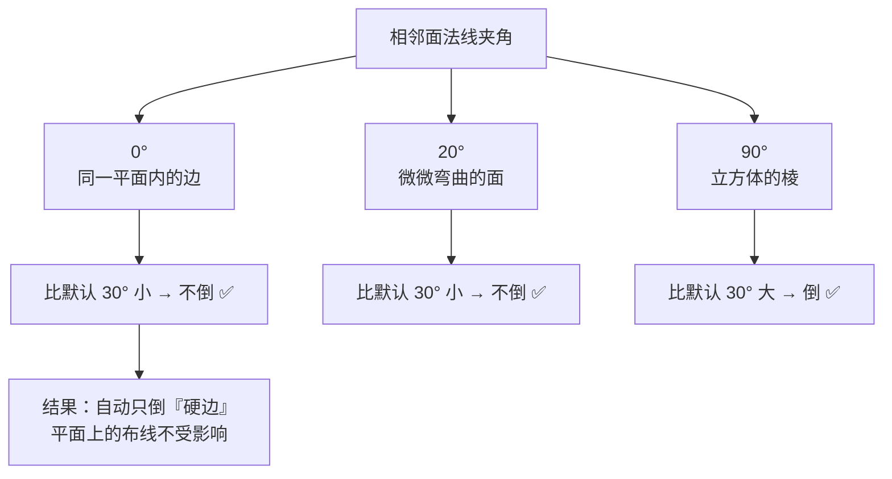

> 官方表述：「Only bevels edges whose angle of adjacent face normals plus the defined Angle is less than 180 degrees」。
> 人话版：**这条边有多"折"，折得超过阈值才倒。** 把 `Angle` 调大 = 只倒更硬的边；调小 = 连轻微起伏也一起倒。
> `Limit Method = Angle` + `Angle = 30°~60°` 是硬表面的**起手式**。

## 5.4 Bevel Weight：一个修改器搞定多种宽度 ⭐⭐

这是 Bevel 从「会用」到「用得好」的分水岭，也是 `Ctrl+B` 结构上做不到的那一件事。

**核心公式：**

```
实际倒角宽度 = Bevel Weight × 修改器的 Width

weight = 1.0  →  宽度 = Width（满值）
weight = 0.5  →  宽度 = Width × 0.5
weight = 0    →  完全不倒角
```

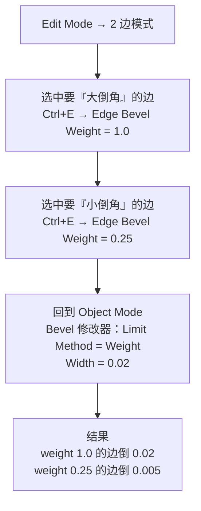

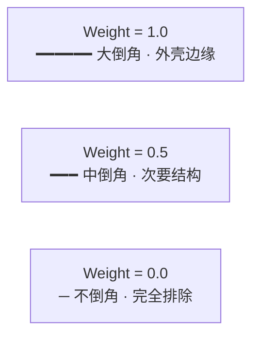

**怎么设：**

| 目的 | 操作 |
| ---- | ---- |
| 单条 / 批选的边 | 边模式选边 → `Ctrl+E` → **Edge Bevel Weight** → 移鼠标或敲数字 |
| 菜单里翻不到 | `F3` 搜 "Bevel Weight"（5.x 的正式菜单名是 `Edge Bevel Weight`） |
| 批量统一 | `Ctrl+E` → **Mean Bevel Weight**（取相邻面的平均值） |
| 可视化检查 | Overlays 下拉 → 勾 **Edge Bevel Weight**（weight 大的边会变色变粗） |

> **5.x 的增强**：Weight 模式读的已不局限于内置权重。它本质上读的是一个**属性**（默认 `bevel_weight_edge` / `bevel_weight_vert`），修改器的下拉里可以直接换成**任意属性**——包括上游修改器生成的属性。这让「用几何节点算出来的值驱动倒角宽度」成为可能。入门阶段先记住默认的 `Ctrl+E` 那条路就够。

## 5.5 什么时候用它

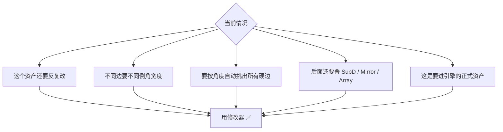

---

# 六、两条路线的关联与对比 ⭐

> 这一节是本篇的核心。理解了这张图，前面两节就不再是「两套并列的知识点」，而是「同一个东西的两个入口」。

## 6.1 心智模型：同一个引擎，两个入口

```mermaid
flowchart TD
    A["Ctrl+B<br/>Edit Mode<br/>选区驱动 · 破坏性"] --> CORE["同一套 Bevel 几何内核<br/>剖面求解 / Miter 收角 / 溢出裁剪 / 法线处理"]
    B["Bevel 修改器<br/>Object Mode<br/>参数驱动 · 非破坏性"] --> CORE
    CORE --> R1["产出的几何结构完全一致"]
    CORE --> R2["共用完全相同的参数含义与默认值"]
    CORE --> R3["坑也是同一批：挤出拉扯、角上炸开、溢出穿模"]
```

**所以正确的心智模型是：**

> **不要把 `Ctrl+B` 和修改器当成两个工具，要把它们当成同一个 Bevel 内核的两种调用方式。**
> 区别只有两点：**在哪里调用**（编辑模式 vs 对象模式）、**结果写不写回原始数据**（破坏性 vs 非破坏性）。
> 至于参数——除 Limit Method 外，一模一样。

## 6.2 参数归属全景图

```mermaid
flowchart TD
    ALL["Bevel 的全部控制"] --> SHARED["共用区 · 绝大多数参数"]
    ALL --> MO["修改器独占区"]
    ALL --> TO["路线 A 独占区"]

    SHARED --> S1["Width / Width Type / Segments / Profile"]
    SHARED --> S2["Miter Inner / Miter Outer / Spread"]
    SHARED --> S3["Intersection Type：Grid Fill / Cutoff"]
    SHARED --> S4["Clamp Overlap / Loop Slide"]
    SHARED --> S5["Harden Normals / Mark Seams / Mark Sharp"]
    SHARED --> S6["Material Index / Face Strength / 自定义 Profile"]

    MO --> M1["Limit Method<br/>None / Angle / Weight / Vertex Group ⭐"]
    MO --> M2["非破坏性<br/>随时改参数 · 可关可见性 · 可复制到别的物体"]
    MO --> M3["参与修改器栈<br/>可与 SubD/Mirror/Array 联动与排序"]

    TO --> T1["模态交互<br/>鼠标实时定 Width，滚轮实时加 Segments"]
    TO --> T2["直接产出可编辑真几何<br/>导出前不必 Apply"]
    TO --> T3["选区即筛选<br/>精确到手选的那一两根边"]
```

**关键观察：`Ctrl+B` 独占的那一格很小。** 这说明它并不是「功能阉割版」——除了 Limit Method，你想要的控制它都有，只是藏在了 `F9` 面板和热键里。

## 6.3 完整对照表

| 维度 | `Ctrl+B` | Bevel 修改器 |
| ---- | -------- | ------------ |
| **模式** | Edit Mode | Object Mode |
| **调用位置** | 视口热键 | 修改器面板 |
| **网格是否被改** | ✅ 永久改写 | ❌ 原始网格不动 |
| **怎么挑边** | **靠选区**（手选 / `Alt+LMB` 环选 / `Shift+G` 相似） | **靠 Limit Method**（None/Angle/Weight/Group） |
| **能否按角度自动筛选** | ❌ | ✅ `Angle` |
| **不同边能否不同宽度** | ❌ | ✅ `Weight` / `Vertex Group` |
| **Clamp Overlap** | ✅ `F9` 面板，热键 `C` | ✅ 面板勾选 |
| **Harden Normals** | ✅ `F9` 面板，热键 `H` | ✅ 面板勾选 |
| **Mark Seams / Sharp** | ✅ `F9` 面板，热键 `U` / `K` | ✅ 面板勾选 |
| **Miter / Spread / Intersections** | ✅ | ✅ |
| **Width Type 五种** | ✅ | ✅ |
| **自定义剖面 Custom Profile** | ✅（`F9` 里调） | ✅（面板控件里调） |
| **改参数的成本** | `F9` 面板，或 `Ctrl+Z` 整段重做 | 拖滑块，实时看结果 |
| **能否回到倒角前** | 只有 `Ctrl+Z`（受撤销栈限制） | 随时，包括保存重开之后 |
| **能否参与修改器栈** | ❌ | ✅ |
| **导出前** | 无需 Apply | 必须 Apply 或勾 `Apply Modifiers` |
| **适合** | 局部快速试造型、一次性定型、渲图 | **正式游戏资产、反复迭代** |

## 6.4 决策树

```mermaid
flowchart TD
    Q1{"这个模型后面还会改吗?"}
    Q1 -->|"会"| M["修改器 ✅"]
    Q1 -->|"定型了"| Q2{"不同边要不要不同倒角宽度?"}
    Q2 -->|"要"| M
    Q2 -->|"不要"| Q3{"要按角度自动挑出所有硬边吗?"}
    Q3 -->|"要"| M
    Q3 -->|"不要"| Q4{"是整个模型大面积统一倒角吗?"}
    Q4 -->|"是"| M
    Q4 -->|"只是局部几根边"| Q5{"改完还会叠其它的修改器吗?"}
    Q5 -->|"会"| M
    Q5 -->|"不会"| C["Ctrl+B 也行 ✅"]
    M --> NOTE["无论如何：改完好习惯是再勾一遍<br/>Clamp Overlap + Harden Normals + Mark Seams"]
    C --> NOTE
```

**一句话版本：**

```mermaid
flowchart LR
    A["要进入产线的资产 → 修改器"]
    B["临时探索 / 局部补刀 → Ctrl+B"]
    C["拿不准 → 用修改器，反正能退"]
```

> 游戏资产**默认走修改器**，理由不是「非破坏性更高级」，而是你要用 `Limit Method = Angle` / `Weight` 这两个东西。它们是硬表面效率的来源，而 `Ctrl+B` 结构上没有。
> 但反过来也要承认：**在已经决定「这一步改完就不动了」的地方，`Ctrl+B` 更快**，而且天然满足 6.6 节的导出要求。

## 6.5 两者的互转

```mermaid
flowchart LR
    CB["Ctrl+B 的结果"] -->|"Ctrl+Z"| U1["回到倒角前 ✅<br/>但受撤销栈限制"]
    MD["修改器结果"] -->|"Ctrl+Z / 关掉可见性"| U2["回到倒角前 ✅<br/>随时都能"]
    MD -->|"Apply 或 Convert to Mesh"| CB
    CB -->|"❌ 没有反向路径"| BAD["想变回非破坏性<br/>只能重做一遍"]
```

| 转换方向 | 怎么做 | 备注 |
| -------- | ------ | ---- |
| 修改器 → 破坏性 | 修改器面板 `Apply`，或 `F3 → Convert to Mesh` 一次性烘掉全部 | 导出前必做，或导出时勾 `Apply Modifiers` |
| 破坏性 → 修改器 | **没有路径** | 这就是为什么第一步就该选对 |

> 唯一的「补救」：如果还想抢救，可以试着把倒角出来的那一圈面删掉再补面——成本远高于重做。**所以决策树的意义在于一开始别选错。**

## 6.6 给游戏资产的一句警告

```mermaid
flowchart TD
    A["用修改器建的资产"] --> B{"导出时勾了 Apply Modifiers 吗?"}
    B -->|"勾了"| C["进引擎一切正常 ✅"]
    B -->|"忘了"| D["SubD 和 Bevel 全部丢失<br/>引擎里看到一个没有倒角的方块 ❌"]
    A --> E["或者导出前先 Apply<br/>Ctrl+A → Apply Rotation & Scale 也别漏"]
```

> 与之对应，`Ctrl+B` 的结果天生就是真几何，没有这个坑。这是路线 A 唯一的长期优势。

---

# 七、共用参数字典

> **`Ctrl+B` 和修改器都有这些参数，含义完全一样。** 差别只在入口：`Ctrl+B` 在操作时的热键 / `F9` 面板；修改器在面板控件。
> 日常查这张表就够，不必分头记两套。

## 7.1 形状组

| 参数 | 范围 | 默认 | 说明 |
| ---- | ---- | ---- | ---- |
| **Affect** | Vertices / Edges | Edges | Vertices = 只倒顶点附近，边不动（等于 `Ctrl+Shift+B`） |
| **Width Type** | Offset/Width/Depth/Percent/Absolute | Offset | 见 3.1 |
| **Width** | ≥ 0 | 0.1 | ⚠️ 默认 0.1 = 10cm，对道具几乎都太大 |
| **Segments** | 1–100 | 1 | 见 3.2；游戏资产 1–2 |
| **Profile Shape** | 0–1 | 0.5 | ⚠️ **Segments < 2 时完全无效**（见 3.3） |
| **Profile Type** | Superellipse / Custom | Superellipse | Custom 用曲线控件画自定义截面 |
| **Miter Shape** | 0–1 | — | 控制 Miter 处的胖瘦；⚠️ 同样在 Segments < 2 时无效 |

## 7.2 Miter 组：拐角怎么收尾

```mermaid
flowchart TD
    MT{"Miter<br/>两条倒角边在拐角处相汇"}
    MT --> S["Sharp<br/>倒角面直接相交<br/>不引入额外顶点 · 默认 · 最快"]
    MT --> A["Arc<br/>在交汇点附近插入两个顶点<br/>用圆弧相连 · 最圆滑"]
    MT --> P["Patch<br/>在交汇点附近插入两个额外顶点<br/>让那里的面不那么挤<br/>⚠️ 对 Inner 无意义，会退化成 Arc"]
    S --> NOTE["什么时候必须换：<br/>Segments ≥ 2 且一个顶点上汇了 3 条以上边<br/>→ 出现 pinch 扭曲，换 Arc 或 Patch"]
```

**Miter 的「内 / 外」怎么分**（这是个容易混淆的点）：

```mermaid
flowchart TD
    V["看一个有面的那一侧"]
    V --> O["夹角大于 180° → Outer Miter 外角<br/>选项：Sharp / Arc / Patch"]
    V --> I["夹角小于 180° → Inner Miter 内角<br/>选项：Sharp / Arc<br/>Patch 无意义，等同 Arc"]
```

| 参数 | 说明 | 什么时候动 |
| ---- | ---- | ---------- |
| **Miter Outer** | 外角收尾方式 | 默认 Sharp |
| **Miter Inner** | 内角收尾方式 | 默认 Sharp |
| **Spread** | 非 Sharp 的 Miter 里，新增顶点离交汇点多远 | 默认 0。做超宽倒角才调 |

> 一般让 Inner / Outer 保持一致。**只有当你发现「外角挺好但内角扭曲」时，才单独调内角。**

## 7.3 Intersections：三条以上边汇在一个顶点时

这是 5.x 手册里比较新的一块，旧稿没提。

```mermaid
flowchart TD
    IT{"Intersection Type<br/>倒角边在顶点处的交汇网格怎么补"}
    IT --> G["Grid Fill · 默认<br/>用平滑网格填满<br/>想要倒角剖面连贯过渡时用"]
    IT --> C["Cutoff<br/>每条边的末端各切一个平盖面<br/>自定义剖面导致交汇太复杂时用"]
    C --> GN["补充：三方交汇时若 Cutoff 面的内角重合<br/>则不会生成中心面"]
```

## 7.4 溢出与法线组 ⭐

```mermaid
flowchart TD
    CO["Clamp Overlap<br/>热键 C"]
    CO --> CO1["自动限制每条边的倒角宽度<br/>保证不会溢出到相邻几何"]
    CO --> CO2["代价：实际宽度可能比你设的小"]
    CO --> WHY["什么时候必须开：<br/>窄面 / 小结构 / 密集细节<br/>→ 做游戏资产基本默认开 ✅"]
```

```mermaid
flowchart LR
    LS1["Loop Slide ON · 默认<br/>遇到相邻边会滑过去<br/>拓扑更干净<br/>宽度可能略不均"]
    LS2["Loop Slide OFF<br/>宽度绝对均匀<br/>复杂处容易重叠"]
```

> 官方提示：当多条边同时倒角而无法在所有边上同时满足 Width 定义时，Bevel 会试图折中。**关掉 Loop Slide 有时反而更容易让宽度符合你的设定**——这条值得在遇到「宽度明明设了就是不对」时试一下。

```mermaid
flowchart TD
    HN["Harden Normals<br/>热键 H"]
    HN --> Y["开 ✅<br/>调整倒角面的逐顶点法线去贴合周围面<br/>周围面的法线不受影响 → 保持平整"]
    HN --> N["关<br/>倒角面被周围面一起平滑<br/>出现奇怪的渐变糊边"]
    Y --> REQ["前置条件：网格需要有自定义分裂法线属性<br/>没有的话 Blender 会自动创建 custom_normal"]
    Y --> REC["硬表面 / 游戏资产：必开"]
```

## 7.5 Mark Seams / Mark Sharp：⚠️ 它是「传播」不是「生成」

这是旧稿错得最隐蔽的一条。官方原文：

- **Mark Seams**：当三条以上共享一个顶点的边里有两条已被标为 UV Seam 时，夹在它们之间的**新边**也会被标为 Seam。
- 修改器版：**如果一条 Seam 边与一条非 Seam 边相交，而你把它们都倒了，这个选项维持 Seam 应有的传播。**

```mermaid
flowchart LR
    IN["输入 A<br/>倒角前已有 Seam / Sharp 标记"] --> MS["Mark Seams U<br/>Mark Sharp K"]
    IN2["输入 B<br/>倒角前什么标记都没有"] --> MS
    MS --> OUT["输出 A ✅<br/>标记沿着倒角产生的新边正确传播"]
    MS --> OUT2["输出 B ❌<br/>还是什么都没有<br/>这个开关不会凭空生成 Seam"]
```

**所以它正确的用法是：**

| 做法 | 结果 |
| ---- | ---- |
| 先手动标 Seam，再勾 Mark Seams 并倒角 | ✅ Seam 自动延伸到倒角新边，UV 展开时边界天然切分 |
| 什么都没标，指望 Mark Seams 帮你标 | ❌ 完全没用 |

> 实践建议：Box-modeling 做硬表面时，**先标的那一批 Seam 通常是几条主结构边**；勾上 Mark Seams 之后倒角，就能一次性把这些标记延伸到倒角新边上，省下大量手动标 Seam 的时间。

## 7.6 材质与面强度

| 参数 | 说明 | 成本提示 |
| ---- | ---- | -------- |
| **Material Index** | 给倒角生成的新面指派材质槽。**`-1` = 继承相邻面的材质**（这样不新增材质槽） | ⚠️ 多一个材质槽 = 多一次 draw call。只在 hero 道具上用 |
| **Face Strength** | `None` / `New` / `Affected` / `All`。给参与倒角的面打标记，配合下游的 Weighted Normals 修改器（勾 Face Influence）使用 | 一般保持 `None` |

```mermaid
flowchart LR
    FS["Face Strength"]
    FS --> N["None<br/>不设面强度"]
    FS --> NW["New<br/>沿边的新面 = Medium<br/>顶点处的新面 = Weak"]
    FS --> AF["Affected<br/>额外把紧贴新面的面设为 Strong"]
    FS --> AL["All<br/>再把模型其余所有面都设为 Strong"]
```

## 7.7 自定义 Profile（进阶）

```mermaid
flowchart TD
    A["Profile Type → Custom"] --> B["面板上出现曲线控件<br/>横轴：从一个面的边界走到另一个面的边界<br/>暗色区域代表模型内部"]
    B --> C["在控件里加控制点，画出你要的截面"]
    C --> D["Blender 按 Segments 数量去采样这条曲线"]
    D --> E["Presets<br/>Support Loops / Steps<br/>⚠️ 按当前 Segments 动态生成<br/>改了 Segments 要重新点一次"]
```

| 采样选项 | 作用 |
| -------- | ---- |
| **Sample Straight Edges** | 在完全笔直的曲线段中间也放采样点（默认关） |
| **Sample Even Lengths** | 按整条剖面的长度均匀分配采样点，而不是每段给同样多的点 |

> 建议：**Segments 至少要和控制点数量一样多**，否则采样点不够，Blender 会把点都给到最弯曲的那几段，直的那几段就丢了。

---

# 八、倒角宽度到底给多少

## 锚点 1：真实加工半径

| 物体 | 边角半径 |
| ---- | -------- |
| 手机 / 电子产品 | 1–3 mm |
| 家具（桌角、柜门） | 0.5–2 mm |
| 家电外壳 | 1–5 mm |
| 汽车钣金 | 3–8 mm |
| 建筑（混凝土、石材） | 5–20 mm |
| 刀具刃口 | 0.05–0.2 mm（几乎尖） |

## 锚点 2：经验比例

```
倒角宽度 ≈ 物体最短边长度 × 0.5% ~ 2%
```

0.6m 高的油桶：`0.6 × 0.5% = 3mm`（锐利）～ `0.6 × 2% = 12mm`（厚重）。

## 锚点 3：镜头距离

```mermaid
flowchart TD
    D{"镜头距离"}
    D --> N["近景特写<br/>第一人称手持<br/>→ 2–5mm，看得见那条高光"]
    D --> M["中景<br/>第三人称<br/>→ 1–2mm 即可"]
    D --> F["远景<br/>载具 / 建筑<br/>→ Segments 1 段就够，细节交给 Normal 贴图"]
```

## 唯一判据：高光

```
自检：Z → Material Preview → 转视角让光扫过边缘
没有高光 → 倒角太小 或 Segments 太少
高光太宽 → 倒角太大
```

> 回到第一节那句话：**你要的是一条高光线，不是一个圆。**

---

# 九、Bevel 与 Subdivision 的三种策略

```mermaid
flowchart TD
    Q{"这个资产的面数预算 / 风格?"}
    Q --> A["低模 / 风格化 / 移动端"]
    Q --> B["有机体 / 圆润产品"]
    Q --> C["硬表面 · 现代默认 ⭐"]
    A --> SA["策略 A<br/>纯 Bevel"]
    B --> SB["策略 B<br/>纯 SubD + 支撑线"]
    C --> SC["策略 C<br/>Bevel 1段 + SubD"]
```

## 策略 A：纯 Bevel（无 SubD）

```mermaid
flowchart LR
    A["低模基础网格"] --> B["Bevel<br/>Segments = 2"] --> C["直接就是最终模型<br/>面数完全可控"]
```

- ✅ 面数精确可控，所见即所得，导出前不用纠结 Apply
- ❌ 段数少了不够圆，段数多了面数爆炸；**Segments = 1 时 Profile 还完全无效**（见 3.3）
- **适合**：低模 / 风格化、移动端、明确不需要圆角的资产

## 策略 B：纯 SubD + 支撑线（无 Bevel）

```mermaid
flowchart LR
    A["低模基础网格"] --> B["Ctrl+R 加支撑线"] --> C["Subdivision Surface"] --> D["形状光滑，边缘靠撑线控制"]
```

- ✅ 面数低、形状光滑
- ❌ 硬边控制全靠支撑线位置，调起来很磨人
- **适合**：有机模型、圆润产品（详见 `05-环切与拓扑-Ctrl+R.md` 第七节）

## 策略 C：Bevel 1 段 + SubD ⭐ 硬表面默认

```mermaid
flowchart TD
    A["低模基础网格"] --> B["Bevel 修改器<br/>Segments = 1<br/>必须排在 SubD 之前"]
    B --> C["Subdivision Surface<br/>Level = 2"]
    C --> D["SubD 把那 1 段斜面平滑成圆角<br/>低面数 + 圆润边缘 + 清晰高光"]
```

```mermaid
flowchart TD
    OK["Bevel → Subdivision ✅<br/>1 段被平滑成圆角，面数可控"]
    NG["Subdivision → Bevel ❌<br/>先细分 4 倍再倒角 = 面数灾难"]
```

- ✅ **1 段倒角 + SubD = 视觉上的圆角**，而基础网格面数很低
- ✅ 倒角宽度直观等于「圆角半径」；**这也是绕开 `Segments = 1 时 Profile 无效` 限制的常用办法**
- ❌ **修改器顺序绝对不能错**

> ⚠️ 顺序放反就是灾难：SubD 在前会先把网格细分 4 倍，再 Bevel 会让面数翻几十倍，且形状失控。
> 这条同时是第十一节排查清单的第 1 步。

---

# 十、与其他工具的边界

| 工具 | 快捷键 | 本质 | 改变形状 | 面数影响 |
| ---- | ------ | ---- | -------- | -------- |
| Extrude | `E` | 复制边界并连接 | ✅ | 中 |
| Inset | `I` | 在面内创建嵌套面 | ✅ | 小 |
| Loop Cut | `Ctrl+R` | 插入一圈拓扑，**不改变形状** | ❌ | 中 |
| Bevel | `Ctrl+B` | 用新面替换尖锐边 | ✅ | **大** |
| Bevel 修改器 | — | 同上，但非破坏性 | ✅ | 大（Apply 后） |

```mermaid
flowchart TD
    Q{"我想干什么?"}
    Q --> A["让尖锐边产生过渡"] --> A1["Ctrl+B / Bevel 修改器"]
    Q --> B["SubD 下要保住硬边"] --> B1["Ctrl+R 加支撑线<br/>见 05 篇"]
    Q --> C["远景细节，不想加面数"] --> C1["Normal 贴图"]
    Q --> D["增加控制点但不变形状"] --> D1["Ctrl+R"]
```

> ⚠️ 别用 Bevel 解决所有「边缘不对」。它是最贵的几何方案：排在 **`Ctrl+R` 支撑线**（SubD 下保硬边，几乎不加面）和 **Normal 贴图**（完全不加面）之间，只在**镜头会近距离看、且需要真实几何**时才值得。

---

# 十一、排查清单

| 现象 | 原因 | 解法 |
| ---- | ---- | ---- |
| ① 一片黑面 / 明暗错乱 | 法线翻转或自相交 | `A` 全选 → `Shift+N`；勾 **Clamp Overlap** |
| ② 倒角面奇怪的渐变糊边 | 法线被周围面平滑了 | 勾 **Harden Normals**；确认有自定义分裂法线或 Auto Smooth |
| ③ 倒角溢出穿模 | Width 大于相邻面尺寸 | **Clamp Overlap**；减小 Width；换 `Limit Method = Weight` |
| ④ 角上炸开 / 面扭曲 | Miter 处理不了多面交汇 | Miter 换 **Arc / Patch**；或换 Intersection Type |
| ⑤ 拖 Profile 完全没反应 | **Segments = 1，Profile 无效** | Segments 加到 ≥ 2，或改走策略 C |
| ⑥ 加了 SubD 后倒角变糊 | 修改器顺序错 / 宽度太小 | Bevel 必须在 SubD **之前**；加大 Width |
| ⑦ 面数暴涨 | Segments 太多 | 降到 1–2；改走策略 C |
| ⑧ 期望 Mark Seam 帮我标好 UV 但没标 | 它是传播不是生成 | 先手动标几条主 Seam，再勾 Mark Seams |
| ⑨ 宽度设了就是不对 | Width Type 理解错了 | 回 3.1 逐个试 5 种度量；或关掉 Loop Slide |
| ⑩ 导出后倒角没了（修改器路线） | 没 Apply | Apply 修改器，或导出勾 `Apply Modifiers` |

**通用排查顺序：**

```mermaid
flowchart TD
    P1["1 检查修改器顺序<br/>Bevel 在 SubD 之前"]
    P2["2 勾 Clamp Overlap"]
    P3["3 勾 Harden Normals"]
    P4["4 Shift+N 重算法线"]
    P5["5 确认 Segments ≥ 2 再谈 Profile"]
    P6["6 检查 Width Type，必要时关 Loop Slide"]
    P7["7 减小 Width / Segments"]
    P8["8 换 Miter Type 或 Intersection Type"]
    P1 --> P2 --> P3 --> P4 --> P5 --> P6 --> P7 --> P8
```

> 还有一个贯穿性的前置项：**Bevel 之前 `Ctrl+A → Scale`。** Object Scale ≠ 1 时倒角会被非均匀拉伸，表现出来的症状和上面好几种都很像，务必先排除。详见 `03-变换系统-G-R-S.md`。

---

# 十二、速查与练习

## 12.1 速查表（游戏硬表面道具）

| 参数 | 推荐值 | 说明 |
| ---- | ------ | ---- |
| 路线 | **Bevel 修改器** | 除非确定改完就不动了 |
| Width | 0.002 – 0.02（2mm–2cm） | 按第八节三个锚点定 |
| Width Type | Offset | 默认 |
| **Segments** | **1–2** | 面数敏感；记住 **1 段时 Profile 无效** |
| Profile | 0.5 | 金属可 0.4，塑料可 0.6（需 Segments ≥ 2） |
| **Limit Method** | **Angle** | 硬表面默认 |
| Angle | 30–60° | 默认 30 |
| Miter Outer / Inner | Sharp | 出问题换 Arc |
| Intersections | Grid Fill | 自定义剖面太复杂时换 Cutoff |
| **Clamp Overlap** | **✅ 开** | 密集细节必开 |
| Loop Slide | ✅ 开（默认） | 宽度对不上时可试着关掉 |
| **Mark Seams** | **✅ 开** | 前提是已手动标过主 Seam |
| Mark Sharp | 视情况 | 配合 Auto Smooth |
| **Harden Normals** | **✅ 开** | 硬表面必开 |
| Material Index | -1 | 别为倒角单独开材质槽，除非是 hero 道具 |
| Face Strength | None | 只在配合 Weighted Normals 时动 |

## 12.2 操作速查

```text
【路线 A · 破坏性 Ctrl+B】
Tab → 1/2/3 选模式 → 选中目标 → Ctrl+B
  移动鼠标 = Width     滚轮 = Segments
  A Width  M Width Type  S Segments  P Profile
  H Harden  C Clamp  O Miter Outer  I Miter Inner
  N Intersections  Z Profile Type  V Affect
  U Mark Seams  K Mark Sharp
LMB 确认 → F9 调和面板重改

【路线 B · 非破坏性 修改器】
Object Mode → Modifier → Add Modifier → Bevel
  Width / Segments / Profile
  Limit Method → Angle / Weight / Vertex Group
  勾 Clamp Overlap / Harden Normals / Mark Seams
导出前：Apply，或导出勾 Apply Modifiers

【Bevel Weight】
Edit Mode → 2 → 选边 → Ctrl+E → Edge Bevel Weight
批量统一：Ctrl+E → Mean Bevel Weight
可视化：Overlays → Edge Bevel Weight
权重 = 0 的边完全不倒

【通用】
F3 搜命令 ｜ Shift+N 重算法线 ｜ Alt+N 法线菜单
Ctrl+A → Scale（Bevel 前必做）
Ctrl+Shift+B  顶点倒角（只切角，边不动）
Alt+LMB 环选 ｜ Shift+G 选相似
```

## 12.3 必练的 6 个动作

| # | 练习 | 检验点 |
| - | ---- | ------ |
| 1 | Cube 全边 Bevel，Segments 从 1 调到 5，记录面数 | 建立面数直觉；验证 2.1 的表格 |
| 2 | 固定 Segments = 1，来回拖 Profile，**确认真的一点没变**；再切到 Segments = 2 重拖 | 亲自验证 Profile 的 Segments ≥ 2 前提 |
| 3 | 带凹槽的方块，对比 `Limit Method = None` vs `Angle` | 理解 Angle 到底过滤掉了什么 |
| 4 | `Ctrl+B` 之后按 `F9`，逐个找到 Harden Normals / Clamp Overlap / Mark Seams | 打破「Ctrl+B 只有拖鼠标」的误解 |
| 5 | 同一模型用 Bevel Weight 给不同边设 1.0 / 0.5 / 0.0，观察第三条为何完全没倒角 | 掌握 Weight 并理解 weight=0 的语义 |
| 6 | Bevel 1 段 + SubD Level 2 做圆角方块，对比纯 Bevel 3 段，比较面数与高光 | 理解策略 C 为什么是默认 |

## 12.4 收尾：一张脑内地图

```mermaid
flowchart TD
    BEV["Bevel"] --> WHAT["是什么<br/>用新面替换尖锐边 · 拓扑重建"]
    BEV --> WHY["为什么<br/>光线在边缘产生高光线"]
    BEV --> COST["代价<br/>面数约 4 倍起跳"]
    BEV --> HOW["两条路线"]

    HOW --> A["Ctrl+B<br/>Edit Mode · 选区驱动 · 破坏性"]
    HOW --> B["Bevel 修改器<br/>Object Mode · 参数驱动 · 非破坏性"]

    A --> SHARED["共用同一套内核与参数"]
    B --> SHARED
    SHARED --> GAP["唯一的真实差异<br/>只有修改器有 Limit Method"]
    GAP --> DEFAULT["结论：游戏资产默认走修改器<br/>但差异远没有旧认知那么大"]

    DEFAULT --> KEY["三个必开项<br/>Clamp Overlap / Harden Normals / Limit Method"]
    KEY --> RESULT["结果：低面数 + 清晰高光 + 可迭代"]
```

**三句话记住：**

| | |
| --- | --- |
| `Ctrl+B` | 同一个 Bevel 内核的编辑模式入口。参数几乎齐备，缺的是 Limit Method；受限于不可回退 |
| Bevel 修改器 | 同一个内核的非破坏性入口。多出 Limit Method + Bevel Weight，是硬表面效率的来源 |
| 两者关系 | 不是「精简版 vs 完整版」，而是「同一件事的两个入口」——选哪个取决于**这一步之后你还会不会改它** |

---

> **下一步**：倒角之后最该学的是 **UV 缝合边与展开** —— 倒角边天然就是 UV 的切分位置（还记得 `Mark Seams` 是「传播」而非「生成」这件事吗，它会直接影响你怎么规划 Seam）。对应路线图 **Stage 3**。
