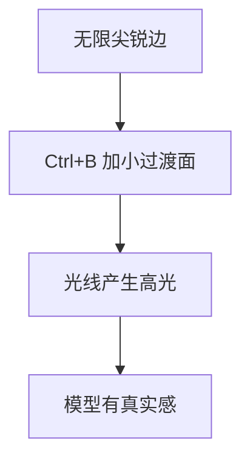
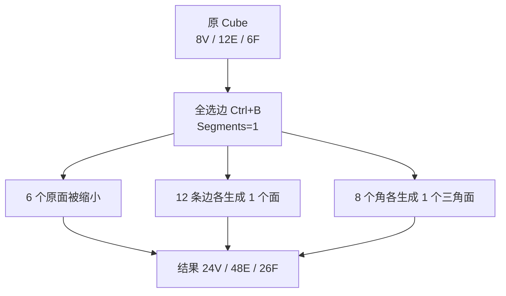
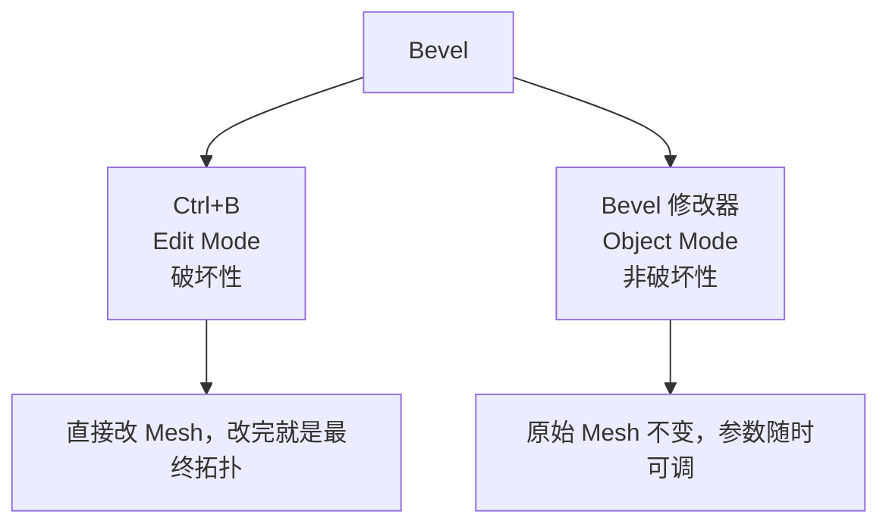
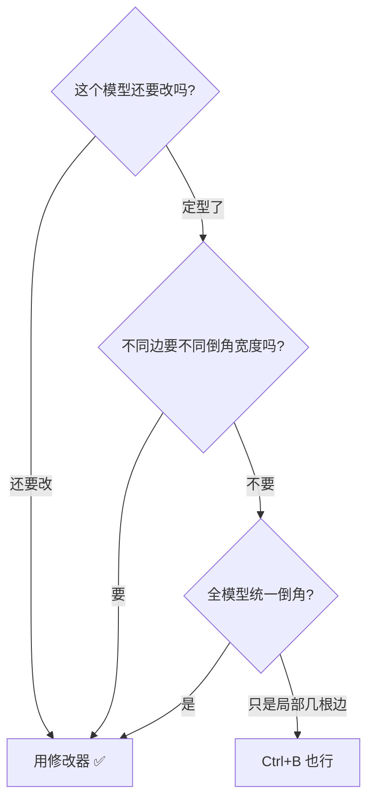
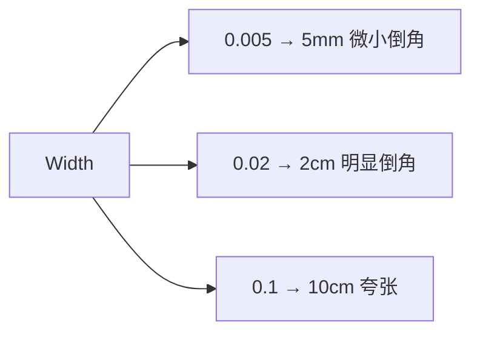
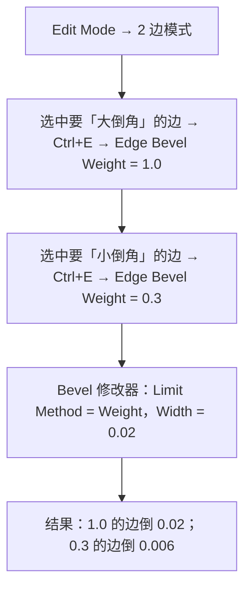
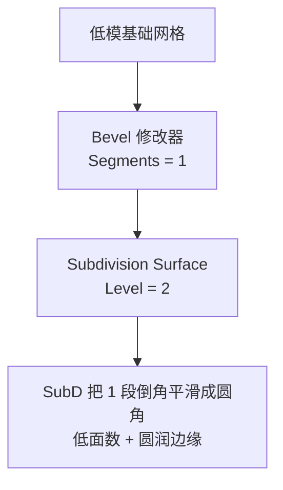
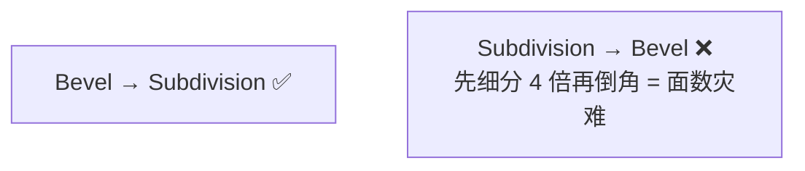
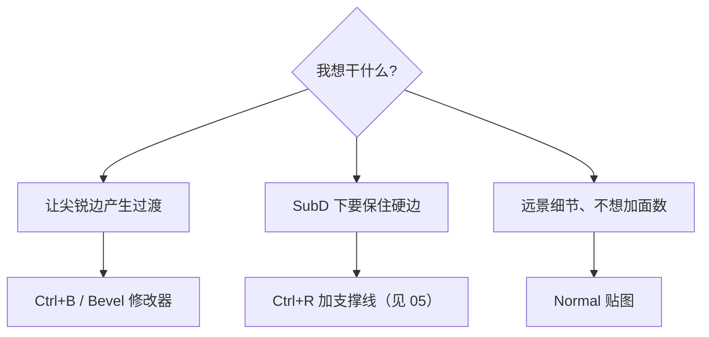
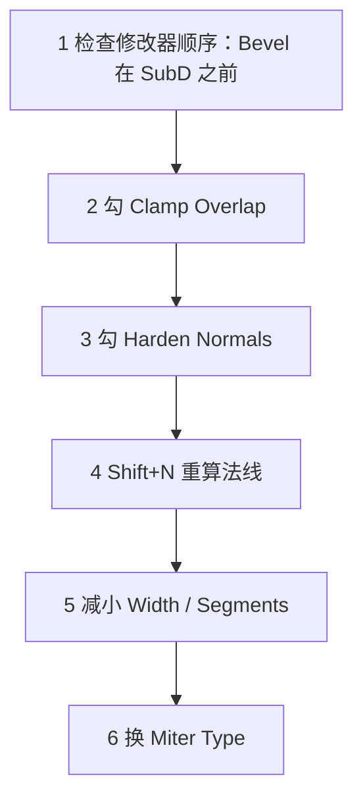

# 06 · 倒角 Bevel：Ctrl+B 与 Bevel 修改器

> 来源合并：`Bevel倒角详解.md` 全文 + `基础练习.md` 第 28–36、45、46 节 + `对象模式与编辑模式.md` 第 23 节
> 一句话：**Bevel = 用一组新的面替换掉原来的尖锐边。** 它是拓扑重建，不是变形。

---

# 一、为什么要倒角

现实世界几乎没有无限尖锐的边，光线会在边缘产生**高光**：

```
理想 Cube：        现实物体：

┌──────┐          ╭──────╮
│      │          │      │
└──────┘          ╰──────╯
```



> **倒角的目的不是让模型「看起来圆」，而是在光照下产生一条高光线。**

---

# 二、几何代价：面数会爆炸 ⭐

全选 Cube 的 12 条边做一次 Bevel（Segments = 1）：



**面数 6 → 26，约 4.3 倍。**

近似公式：`Bevel 后面数 ≈ 原面数 + 边数 × Segments + 顶点数`

| Segments | Cube 倒角后面数 |
| -------- | --------------- |
| 0（原始） | 6 |
| 1 | 26 |
| 2 | 38 |
| 3 | 50 |
| 5 | 74 |

> ⚠️ 这就是游戏资产 **Segments 只用 1–2** 的原因。一个 2000 面的道具，全边 Bevel 3 段可能冲到 8000+ 面。

---

# 三、剖面视角：Segments 到底切了什么

```
原始锐边 90°           Segments=1        Segments=2        Segments=3

    │                    ┌────           ┌────            ┌────
    │                    │╲              │ ╲              │  ╲
    │                    │ ╲             │  ╲             │   ╲
    │                    │  ╲            │   │            │    │
    └────────────        │   ╲           │    ╲           │     ╲
        90°              └─────╲         └──────╲         └───────╲

                        一个斜面        两段折线        三段折线 ≈ 圆弧
```

> **Segments 不是「圆不圆」的唯一决定因素，Profile 才是**（见第五节第 4 项）。

---

# 四、两种 Bevel：`Ctrl+B` vs 修改器 ⭐⭐



| 维度 | `Ctrl+B`（破坏性） | Bevel 修改器 |
| ---- | ----------------- | ------------ |
| 作用位置 | Edit Mode | Object Mode（修改器面板） |
| 原始网格 | 被永久改变 | 保持不变 |
| 改参数 | 只能 `F9` 或 `Ctrl+Z` 重做 | 滑块随时拖 |
| **Bevel Weight 支持** | ❌ | ✅（核心差异） |
| **Limit Method（角度限制）** | 简单 | ✅ 完整 Angle / Weight / Group |
| **Clamp Overlap** | 无 | ✅ 有 |
| 适合 | 快速试造型、一次性定型 | **正式资产、反复迭代** |

## 决策树



> **游戏资产默认用修改器。** 理由不是「非破坏性更高级」，而是你要用 `Limit Method = Angle` + `Clamp Overlap` + `Bevel Weight`，**这三个只有修改器有**。

---

# 五、Bevel 修改器参数全解

Object Mode → Modifier → Add Modifier → Bevel。

## 1. Width（宽度）

倒角大小，默认 0.1（= 10cm，对道具通常太大）。



## 2. Width Type ⭐ 容易被忽略

**同一个 Width 数值，在不同度量方式下含义完全不同。**

| 类型 | 含义 | 什么时候用 |
| ---- | ---- | ---------- |
| **Offset** | 从原边向外偏移的距离（**默认**） | 大多数情况 |
| Width | 倒角面的**总宽度** | 要精确控制倒角面宽度 |
| Depth | 原边到倒角最外点的**垂直深度** | 机械件、有图纸要求 |
| Percent | 占相邻边长度的百分比 | 需要比例自适应 |

```
        ╲                     ╲                    ╲
         ╲                     ╲                    ╲
   ───────╲────          ───────╲────         ──────╲─────
      ↑                     ↑                    ↑
   Offset                 Width                Depth
```

> 默认用 Offset。只有发现「改了 Width 但视觉对不上」时才来检查这个。

## 3. Segments（段数）

游戏资产 **1–2**；产品渲染 / 影视 **3–5**。
注意：修改器里 Segments 是数值框；滚轮调的是 `Ctrl+B` 的。

## 4. Profile（截面胖瘦）⭐

范围 0–1，**默认 0.5**。

| Profile | 效果 | 适用 |
| ------- | ---- | ---- |
| 0.25 | 内凹，像被削掉一块 | 刀切般的锐利感 |
| **0.5** | 标准圆弧，最自然 | **默认** |
| 0.75+ | 外凸鼓起 | 软胶感、注塑件 |

> 金属 / CNC 件可试 0.4（更硬），塑料可试 0.6。

## 5. Limit Method（限制哪些边）⭐⭐

| 方式 | 行为 | 用途 |
| ---- | ---- | ---- |
| None | 所有边都倒 | 简单模型（平面上内部的边也会被倒，常出问题） |
| **Angle** | 只倒夹角 **大于** 阈值的边（默认 30°） | **硬表面默认**，自动只倒硬边 |
| Weight | 只倒设了 Bevel Weight 的边 | 精确分级控制 |
| Group | 只倒指定顶点组内的边 | 配合顶点组 |

> `Limit Method = Angle` + `Angle = 30°~60°` 是硬表面的**起手式**。

## 6. Miter Type（拐角收尾方式）

| 类型 | 行为 |
| ---- | ---- |
| **Sharp**（默认） | 倒角面直接相交，快 |
| Arc | 交汇处圆弧过渡，最圆滑 |
| Patch | 交汇处补一个面片，处理多面交汇 |

> Segments ≥ 2 且角上有 3 条以上边交汇时容易扭曲 → 换 **Arc** 或 **Patch**。

## 7. Miter Inner / Miter Outer

内外角分别设斜接方式。一般跟 Miter Type 一致；只有「外角好但内角扭曲」时才分开调。

## 8. Spread（延展）

倒角宽度过大、倒角面互相重叠时，控制它在重叠区继续延伸多远。**默认 0**，只有做超宽倒角才动。

## 9. Clamp Overlap（钳制重叠）⭐ 防炸利器

自动限制倒角宽度，保证不溢出到相邻几何：

```
不开（自相交穿模）:        开:

┌─────────────┐          ┌─────────────┐
│  ┌────┐     │          │  ┌────┐     │
│  │╲╱╲╱│     │          │  │╲__╱│     │
│  └────┘     │          │  └────┘     │
└─────────────┘          └─────────────┘
```

> **窄面、小结构、密集细节时，这个勾默认开。**

## 10. Loop Slide

默认 **ON**：倒角遇到相邻边会滑过去，拓扑更干净（宽度可能略不均）。
OFF：宽度绝对均匀，但复杂处易重叠。

## 11. Mark Seam / Mark Sharp

| 选项 | 作用 | 价值 |
| ---- | ---- | ---- |
| **Mark Seam** | 倒角边自动标为 **UV 缝合边** | ⭐ 倒角边本就是天然 seam，**做游戏资产强烈建议勾** |
| Mark Sharp | 倒角边自动标为**硬边** | 配合 `Shade Auto Smooth` 保硬边 |

## 12. Harden Normals（硬化法线）⭐

倒角生成的新面**法线不被周围面平滑**，保住各自朝向。

```
不开（糊成一片）:              开（边界清晰）:

┌────────╲────────┐          ┌────────╲────────┐
│▒▒▒▒▒▒▒░░░░░░░░░│          │        ┃        │
└─────────────────┘          └────────┃────────┘
```

> **硬表面必须勾。** 它是「倒角后看起来还是不对」的第一排查项。

## 13. Material Index

给倒角面单独指定材质槽（做掉漆露金属、磨边露基材）。
⚠️ 多一个材质槽 = 多一次 draw call，游戏资产只在 hero 道具上用。

## 14. Vertex Group

配合 `Limit Method = Group` 使用。

## 15. Face Strength

影响加权法线计算，一般保持默认 `Medium`。

---

# 六、参数速查表（游戏硬表面道具）

| 参数 | 推荐值 | 说明 |
| ---- | ------ | ---- |
| Width | 0.002 – 0.02（2mm–2cm） | 按真实尺寸定，见第八节 |
| Width Type | Offset | 默认 |
| **Segments** | **1–2** | 面数敏感 |
| Profile | 0.5 | 金属可 0.4，塑料可 0.6 |
| **Limit Method** | **Angle** | 硬表面默认 |
| Angle | 30–60° | 默认 30 |
| Miter Type | Sharp | 出问题换 Arc |
| **Clamp Overlap** | **✅ 开** | 密集细节必开 |
| Loop Slide | ✅ 开（默认） | |
| **Mark Seam** | **✅ 开** | 方便 UV |
| Mark Sharp | 视情况 | 配合 Auto Smooth |
| **Harden Normals** | **✅ 开** | 硬表面必开 |

---

# 七、Bevel Weight：一个修改器搞定多种宽度 ⭐⭐

**实际倒角宽度 = Bevel Weight × 修改器的 Width**

```
weight = 1.0  →  满值 Width
weight = 0.5  →  Width × 0.5
weight = 0    →  不倒角
```



| 设置方式 | 操作 |
| -------- | ---- |
| 菜单 | 边模式选边 → `Ctrl+E` → **Edge Bevel Weight** |
| 搜索 | `F3` 搜 "Bevel Weight" |
| 批量统一 | `Ctrl+E` → **Mean Bevel Weight**（取相邻面平均值） |
| 可视化 | Overlays → 勾选 **Edge Bevel Weight**（weight 大的边会变色/变粗） |

> `Ctrl+E` 菜单里找不到就 **F3 搜索**，Blender 5.x 的菜单名是 `Edge Bevel Weight`。

---

# 八、倒角宽度到底给多少

## 锚点 1：真实加工半径

| 物体 | 边角半径 |
| ---- | -------- |
| 手机 / 电子产品 | 1–3 mm |
| 家具（桌角、柜门） | 0.5–2 mm |
| 家电外壳 | 1–5 mm |
| 汽车钣金 | 3–8 mm |
| 建筑（混凝土、石材） | 5–20 mm |
| 刀具刃口 | 0.05–0.2 mm（几乎尖） |

## 锚点 2：经验比例

```
倒角宽度 ≈ 物体最短边长度 × 0.5% ~ 2%
```

0.6m 高的油桶：3mm（锐利）～ 12mm（厚重）。

## 锚点 3：镜头距离

| 距离 | 建议 |
| ---- | ---- |
| 近景特写（第一人称手持） | 2–5mm，看得见高光 |
| 中景（第三人称） | 1–2mm 即可 |
| 远景（载具 / 建筑） | 1 段就够，细节交给 Normal 贴图 |

## 唯一判据：高光

```
自检：Z → Material Preview → 转视角让光扫过边缘
没有高光 → 倒角太小（或 Segments 太少）
高光太宽 → 倒角太大
```

---

# 九、Bevel 与 Subdivision 的三种策略

## 策略 A：纯 Bevel（无 SubD）

- ✅ 面数精确可控、所见即所得
- ❌ 段数少了不够圆，多了面数爆炸
- **适合**：低模 / 风格化、移动端

## 策略 B：纯 SubD + 支撑线（无 Bevel）

- ✅ 面数低、形状光滑
- ❌ 硬边全靠支撑线控制，调起来麻烦
- **适合**：有机模型、圆润产品

## 策略 C：Bevel(1段) + SubD ⭐ 硬表面默认



- ✅ **1 段倒角 + SubD = 视觉上的圆角**，基础网格面数很低
- ✅ 倒角宽度直观等于「圆角半径」
- ❌ **修改器顺序不能错：Bevel 必须在 SubD 之前**



---

# 十、与其他工具的边界

| 工具 | 快捷键 | 本质 | 面数影响 |
| ---- | ------ | ---- | -------- |
| Extrude `E` | `E` | 复制边界并连接 | 中 |
| Inset `I` | `I` | 在面内创建嵌套面 | 小 |
| Loop Cut `Ctrl+R` | `Ctrl+R` | 插入一圈拓扑，**不改变形状** | 中 |
| Bevel `Ctrl+B` | `Ctrl+B` | 用新面替换尖锐边 | **大** |
| Bevel 修改器 | — | 同上但非破坏性 | 大（应用后） |



---

# 十一、操作速查

```text
【破坏性 Ctrl+B】
Tab → 2 边模式 → Ctrl+B → 移动鼠标调 Width → 滚轮加 Segments → LMB 确认 → F9 调参数

【非破坏性 修改器】
Object Mode → Modifier → Add Modifier → Bevel
  Width / Segments / Profile → Limit Method(Angle/Weight)
  → 勾 Clamp Overlap / Harden Normals / Mark Seam

【Bevel Weight】
Edit Mode → 2 → 选边 → Ctrl+E → Edge Bevel Weight
批量：Ctrl+E → Mean Bevel Weight
检查：Overlays → Edge Bevel Weight

【通用】
F3 搜命令 ｜ Shift+N 重算法线 ｜ Alt+N 法线菜单 ｜ Ctrl+A → Scale（Bevel 前必做）
```

> 顶点倒角：`1` 顶点模式选中点 → `Ctrl+Shift+B`（切掉一个角）。

---

# 十二、倒角后 6 种问题排查

| 现象 | 原因 | 解法 |
| ---- | ---- | ---- |
| ① 一片黑面 / 明暗错乱 | 法线翻转或自相交 | `A` 全选 → `Shift+N`；勾 **Clamp Overlap** |
| ② 倒角面奇怪的渐变糊边 | 法线被周围面平滑 | 勾 **Harden Normals** |
| ③ 倒角溢出穿模 | Width 大于相邻面尺寸 | **Clamp Overlap**；减小 Width；改用 Weight |
| ④ 角上炸开、面扭曲 | Miter 处理不了多面交汇 | Miter Type 换 **Arc / Patch** |
| ⑤ 加 SubD 后倒角变糊 | 顺序错 / 宽度太小 | Bevel 在 SubD **之前**；加大 Width |
| ⑥ 面数暴涨 | Segments 太多 | 降到 1–2；改策略 C |

**通用排查顺序：**



---

# 十三、必练的 5 个动作

| # | 练习 | 检验点 |
| - | ---- | ------ |
| 1 | Cube 全边 Bevel，Segments 从 1 调到 5，记录面数 | 建立面数直觉 |
| 2 | 固定 Segments=2，Profile 从 0 拖到 1 | 理解 Profile |
| 3 | 带凹槽的方块，对比 `Limit Method = None` vs `Angle` | 理解角度限制 |
| 4 | 同一模型用 Bevel Weight 给不同边设 1.0 / 0.5 / 0.2 | 掌握 Weight |
| 5 | Bevel(1段)+SubD(2) 做圆角方块，对比纯 Bevel(3段) | 理解策略 C |

---

> **下一步**：倒角之后最该学的是 **UV 缝合边与展开** —— 倒角边天然就是 UV 的切分位置（还记得 `Mark Seam` 吗）。对应路线图 **Stage 3**。
