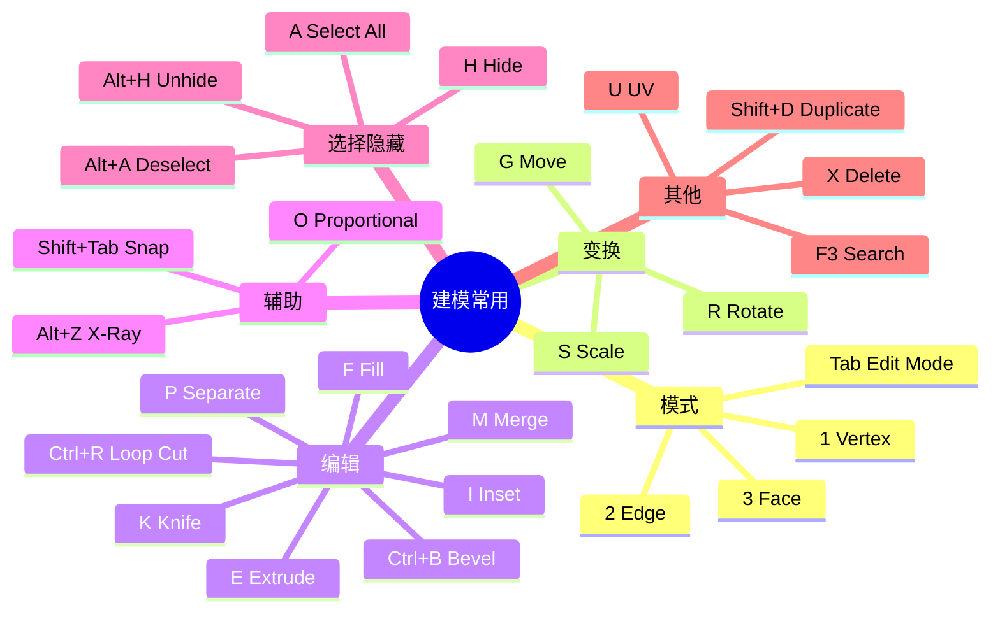
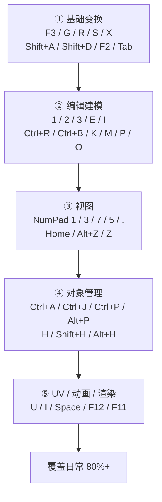

# 07 · 快捷键速查表

> 来源合并：`Blender快捷键.md` 全文（按场景重排、去重）+ 各篇笔记里散落的组合键
> 用法：当工具书查，不要通背。**每周只新增 3–5 个。**

---

# 一、核心 30 个（先背这些）

| 快捷键 | 功能 | 快捷键 | 功能 |
| ------ | ---- | ------ | ---- |
| `G` | 移动 Move | `F3` | **搜索操作（万能）** |
| `R` | 旋转 Rotate | `F2` | 重命名 |
| `S` | 缩放 Scale | `N` / `T` | Sidebar / Toolbar |
| `G X` `G Y` `G Z` | 沿轴移动 | `A` / `Alt+A` | 全选 / 取消 |
| `R X` `R Y` `R Z` | 绕轴旋转 | `H` / `Alt+H` | 隐藏 / 显示全部 |
| `S X` `S Y` `S Z` | 沿轴缩放 | `Shift+A` | 添加对象 |
| `Tab` | Object / Edit 切换 | `Shift+D` | 复制 |
| `Ctrl+A` | Apply 应用变换 | `Alt+D` | 链接复制 |
| `Ctrl+Z` / `Shift+Ctrl+Z` | 撤销 / 重做 | `NumPad .` | 聚焦选中 |
| `X` / `Delete` | 删除 | `Home` | 查看全部 |
| `Ctrl+Space` | 最大化区域 | `1 / 2 / 3` | 顶点 / 边 / 面 |

---

# 二、变换（详见 `03-变换系统-G-R-S.md`）

```text
G / R / S              移动 / 旋转 / 缩放
G X 5  R Z 90  S 0.5   动作 + 轴 + 数值
Shift                  精细模式
Ctrl                   吸附（固定角度 / 网格）
Shift+Ctrl             精细吸附
Shift+Tab              开关 Snapping
X X / Z Z              第二次按同一轴 = 局部轴
O                      Proportional Editing（滚轮调半径）
Ctrl+A → Scale         应用缩放（建模前必做）
```

---

# 三、Object Mode

| 快捷键 | 功能 |
| ------ | ---- |
| `Shift+A` | Add 添加对象 |
| `Shift+D` / `Alt+D` | Duplicate / Linked Duplicate |
| `Ctrl+J` | Join 合并多个 Object |
| `Ctrl+P` / `Alt+P` | Parent / Clear Parent |
| `M` | Move to Collection |
| `F2` | Rename |
| `X` | Delete |
| `Ctrl+A` | Apply |

---

# 四、Edit Mode

| 快捷键 | 功能 | 快捷键 | 功能 |
| ------ | ---- | ------ | ---- |
| `Tab` | 进入 / 退出 | `E` | Extrude 挤出 |
| `1 / 2 / 3` | 顶点 / 边 / 面 | `I` | Inset 内插 |
| `A` / `Alt+A` | 全选 / 取消 | `Ctrl+R` | Loop Cut 环切 |
| `X` | 删除菜单 | `Ctrl+B` / `Ctrl+Shift+B` | 边倒角 / 顶点倒角 |
| `F` | Fill 补面 | `K` | Knife 切刀 |
| `J` | Connect 连接 | `M` | Merge 合并 |
| `V` | Rip 撕裂 | `P` | Separate 分离 |
| `Alt+S` | Shrink/Fatten | `U` | UV 菜单 |
| `Alt+LMB` | 选 Edge Loop | `Ctrl+Alt+LMB` | 选 Edge Ring |
| `G G` | Edge Slide | `Alt+E` | Extrude 变体菜单 |

---

# 五、选择

| 快捷键 | 功能 |
| ------ | ---- |
| `A` / `Alt+A` | 全选 / 取消 |
| `Ctrl+I` | 反选 |
| `B` / `C` | 框选 / 圆形刷选 |
| `L` / `Ctrl+L` | 选择连通区域 |
| `Shift+G` | Select Similar 选相似 |
| `Alt+Z` | X-Ray 透视选择 |
| `H` / `Shift+H` / `Alt+H` | 隐藏选中 / 隐藏未选 / 全部显示 |
| `/` | Local View |

---

# 六、视图导航

| 操作 | 功能 |
| ---- | ---- |
| `MMB` 拖动 | Orbit 旋转 |
| `Shift+MMB` | Pan 平移 |
| `Ctrl+MMB` / 滚轮 | Zoom 缩放 |
| `NumPad 1 / 3 / 7` | Front / Right / Top |
| `Ctrl+NumPad 1 / 3 / 7` | Back / Left / Bottom |
| `NumPad 5` | 透视 / 正交 |
| `NumPad 9` | 反向视图 |
| `NumPad 0` | Camera 视图 |
| `Ctrl+Alt+NumPad 0` | 相机对齐当前视角 |
| `NumPad .` / `Home` | 聚焦选中 / 显示全部 |
| `` ` `` | 视角 Pie Menu |
| `Shift+Tab` | Snapping 开关 |

> 无小键盘：`Edit → Preferences → Input → Emulate Numpad`。

---

# 七、显示与界面

| 快捷键 | 功能 |
| ------ | ---- |
| `Z` | Shading Pie（Solid / Material / Rendered / Wireframe） |
| `Alt+Z` | X-Ray |
| `N` / `T` | Sidebar / Toolbar |
| `F3` | Search |
| `F9` | Adjust Last Operation（上次操作参数） |
| `Ctrl+Space` | 最大化当前区域 |
| `Ctrl+Alt+Q` | Quad View 四视图 |

---

# 八、文件 / 渲染

| 快捷键 | 功能 |
| ------ | ---- |
| `Ctrl+N` / `Ctrl+O` | New / Open |
| `Ctrl+S` / `Ctrl+Shift+S` / `Ctrl+Alt+S` | Save / Save As / Save Copy |
| `Ctrl+Z` / `Ctrl+Shift+Z` | Undo / Redo |
| `F12` / `F11` | Render / 显示 Render |

---

# 九、动画 / 相机

| 快捷键 | 功能 | 快捷键 | 功能 |
| ------ | ---- | ------ | ---- |
| `Space` | 播放 / 暂停 | `NumPad 0` | Camera View |
| `←` / `→` | 上一帧 / 下一帧 | `Ctrl+Alt+NumPad 0` | 相机对齐视角 |
| `↑` / `↓` | 上/下一关键帧 | `G` / `R` | 移动 / 旋转相机 |
| `I` / `Alt+I` | 插入 / 删除 Keyframe | | |

---

# 十、UV 编辑器

| 快捷键 | 功能 | 快捷键 | 功能 |
| ------ | ---- | ------ | ---- |
| `U` | UV Mapping 菜单 | `L` | Select Linked |
| `A` | 全选 | `P` / `Alt+P` | Pin / Unpin |
| `G` / `R` / `S` | 移动 / 旋转 / 缩放 UV | | |

最常用流程：`Tab`（Edit）→ `A` 全选 → `U` → Unwrap。

---

# 十一、Shader 节点 / Sculpt / 骨骼

| 场景 | 快捷键 |
| ---- | ------ |
| Shader Editor | `Shift+A` 加节点 ｜ `G` 移动 ｜ `X` 删除 ｜ `Shift+D` 复制 ｜ `M` Mute ｜ `Ctrl+G` 成组 ｜ `Tab` 进出组 |
| Sculpt | `F` 笔刷大小 ｜ `Shift+F` 强度 ｜ `X` 正负方向切换 |
| Armature | `Ctrl+Tab` Pose Mode ｜ `E` 挤出骨骼 ｜ `Ctrl+P` 绑定 |

---

# 十二、建模常用组合（一张 mindmap）



---

# 十三、建议的背诵顺序（5 阶段）



---

# 十四、Mac 用户

```text
Cmd+Z      撤销        Cmd+Shift+Z 重做
Cmd+S      保存        Cmd+O        打开
```

> 不是所有 `Ctrl` 都能换 `Cmd`，与系统快捷键冲突的会失效。失灵时按 `F3` 搜命令名。
