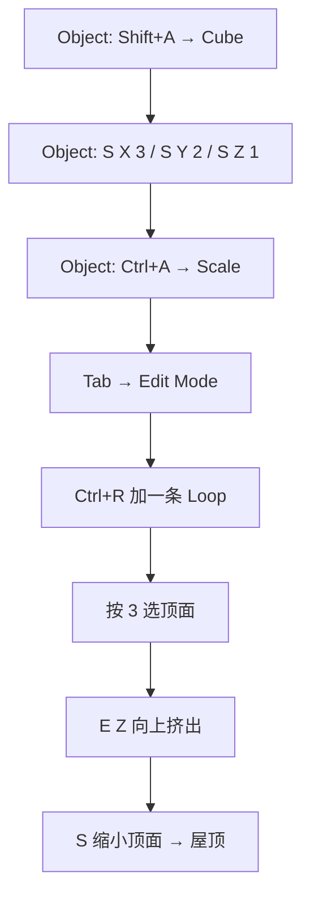
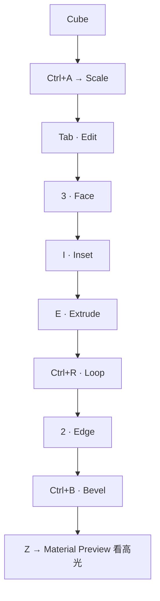
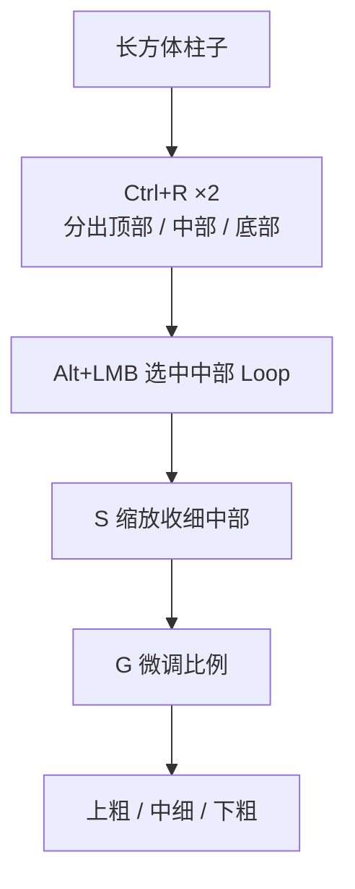
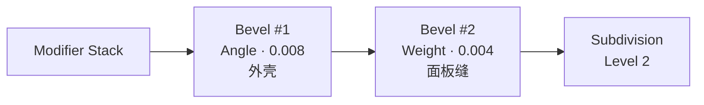

# 08 · 实战练习集

> 来源合并：`对象模式与编辑模式.md` 第 26 节（房子）+ `基础练习.md` 第 41–45、50 节（门、箱子）
> + `环切详解.md` 第 29、31 节（桌腿、5 种用法）+ `Bevel倒角详解.md` 第 11、16 节（电源箱、5 个动作）
> 所有练习共用一条自检：**`Z → Material Preview`，转视角看边缘高光。**

---

# 练习 1 · 房子（模式切换全流程）

目标：体会「Object 管摆放，Edit 管形状」的循环。



```
      /────\
     /      \
    /────────\
    │        │
    └────────┘
```

**检验点**：全程只产生 **1 个 Object**（不是两个）。

---

# 练习 2 · 门（Inset + Extrude + Bevel）

只用 `S / I / E / Ctrl+B`：

| Step | 操作 | 结果 |
| ---- | ---- | ---- |
| 1 | Object：`S X 2`、`S Z 3`，然后 `Ctrl+A → Scale` | 门形比例 |
| 2 | `Tab` → `3` 选正面 | |
| 3 | `I` Inset | 内外双框 |
| 4 | 选中内部面 → `E` 向内挤 | 门的凹槽 |
| 5 | `2` 边模式 → 选门框边 → `Ctrl+B`（2–4 Segments） | 门框圆润高光 |

```
┌──────────────┐
│              │
│   ┌──────┐   │
│   │      │   │  ← 向内挤入
│   └──────┘   │
└──────────────┘
```

**检验点**：凹槽边缘在 Material Preview 下有清晰高光线。

---

# 练习 3 · 游戏箱子（只用 10 个键）

限定按键：`G / R / S / 1 / 2 / 3 / E / I / Ctrl+R / Ctrl+B`



**检验点**：面数控制在 800 tri 以内（环境道具的移动端预算，见 `../07-资产规范与引擎导出/笔记.md`）。

---

# 练习 4 · 桌腿（Loop Cut 控制形状）



**检验点**：能用「线控制形状」解释每一步为什么这样加线。

---

# 练习 5 · 科幻电源箱（Bevel 全流程）⭐

目标：40cm × 30cm × 20cm 的设备箱，串起所有 Bevel 参数。

| Step | 操作 |
| ---- | ---- |
| 0 | `Shift+A` Cube → `S X 0.4 / S Y 0.3 / S Z 0.2` → **`Ctrl+A → Scale`** |
| 1 | Bevel 修改器：Width 0.008、Segments 1、Limit Method = **Angle**（40°）、勾 **Clamp Overlap / Harden Normals / Mark Seam** |
| 2 | `Tab` → `2` 边模式，选中面板四周的边 → `Ctrl+E → Edge Bevel Weight = 0.25`；外壳边保持 1.0 |
| 3 | 再加一个 Bevel 修改器：Limit Method = **Weight**、Width = 0.004 |
| 4 | Subdivision Surface：Level = 2（把 1 段倒角平滑成圆角，面数不炸） |
| 5 | `Z → Material Preview` 看高光；检查面数 |



**检验点**：两套倒角宽度共存；修改器顺序是 Bevel → SubD。

---

# 练习 6 · Loop Cut 的 5 种用法

| # | 用法 | 操作 | 目标 |
| - | ---- | ---- | ---- |
| ① | 基础环切 | `Ctrl+R` → `LMB` → `RMB` | 快速在中心加 Loop |
| ② | 多重环切 | `Ctrl+R` → 滚轮 | 一次加 2 / 3 / 5 / 10 条 |
| ③ | 环切 + 滑动 | `Ctrl+R` → `LMB` → 移动 → `LMB` | 精确控制位置 |
| ④ | 选择 + Edge Slide | `Alt+LMB` → `G G` | 调整已有 Loop |
| ⑤ | 环切 + SubD | `Ctrl+R` → `Alt+LMB` → `G/S` | 理解支撑线控制硬度 |

---

# 练习 7 · Bevel 的 5 个动作

| # | 动作 | 检验点 |
| - | ---- | ------ |
| 1 | Cube 全边 Bevel，Segments 从 1 调到 5，记录面数 | 面数直觉 |
| 2 | 固定 Segments=2，Profile 从 0 拖到 1 | 理解 Profile |
| 3 | 带凹槽的方块，对比 `Limit Method = None` vs `Angle` | 角度限制 |
| 4 | 同一模型用 Bevel Weight 给边设 1.0 / 0.5 / 0.2 | 分级宽度 |
| 5 | Bevel(1段) + SubD(2) 对比纯 Bevel(3段) | 策略 C |

---

# 练习 8 · 圆角立方体（Stage 0 验收项）

不看教程，3 分钟内把 Cube 做成**边缘锐利但整体平滑**的圆角方块。

- 路线 A：`Ctrl+R` 在每条边附近加支撑线 → Subdivision
- 路线 B：Bevel 修改器 Segments=1 → Subdivision（推荐）

**验收**：能说出「为什么这个角糊了」，并指出该在哪加线。

---

# 通用自检清单

- [ ] `Ctrl+A → Scale` 做过了
- [ ] `Z → Material Preview` 转视角看过边缘高光
- [ ] 面数在预算内（右上角 Statistics）
- [ ] 没有 N-Gon、没有孤立顶点（`Mesh → Clean Up`）
- [ ] 修改器顺序正确（Bevel 在 SubD 之前）
