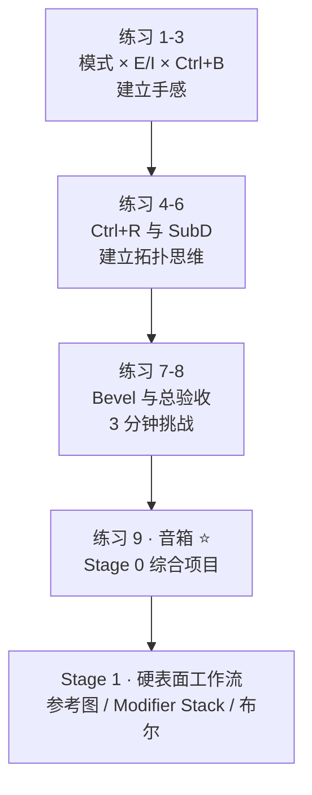
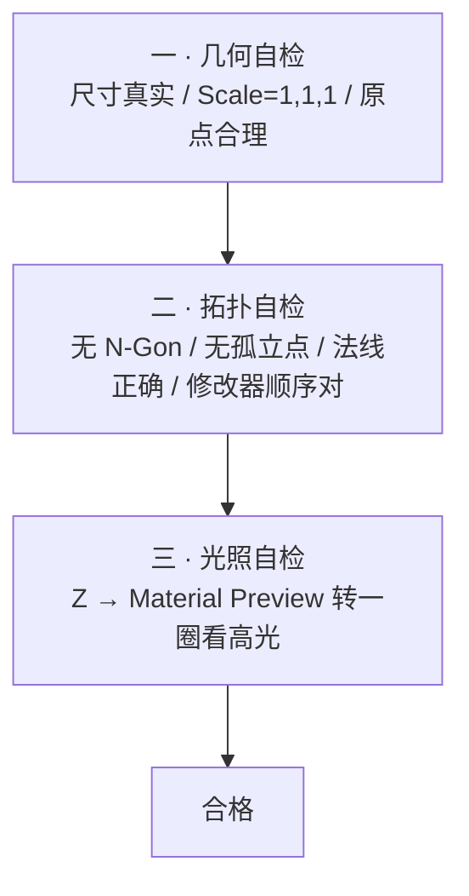
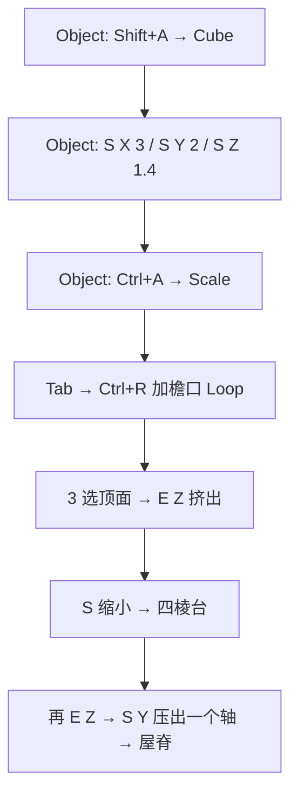
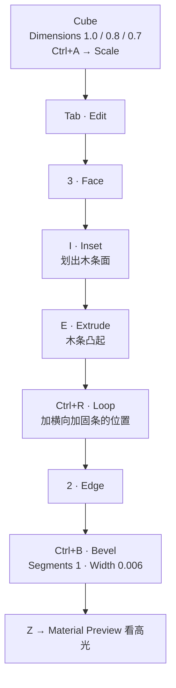
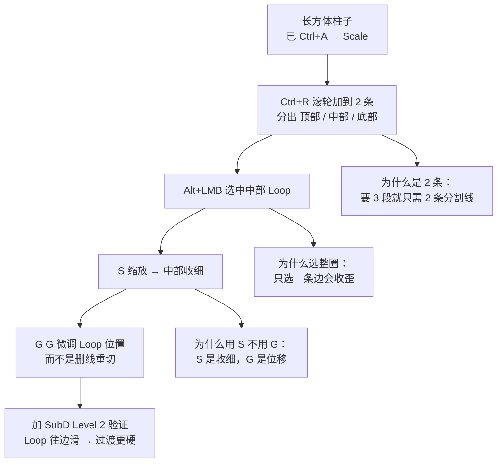
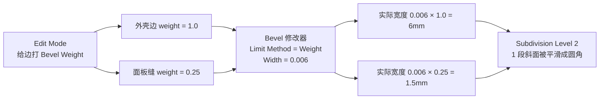
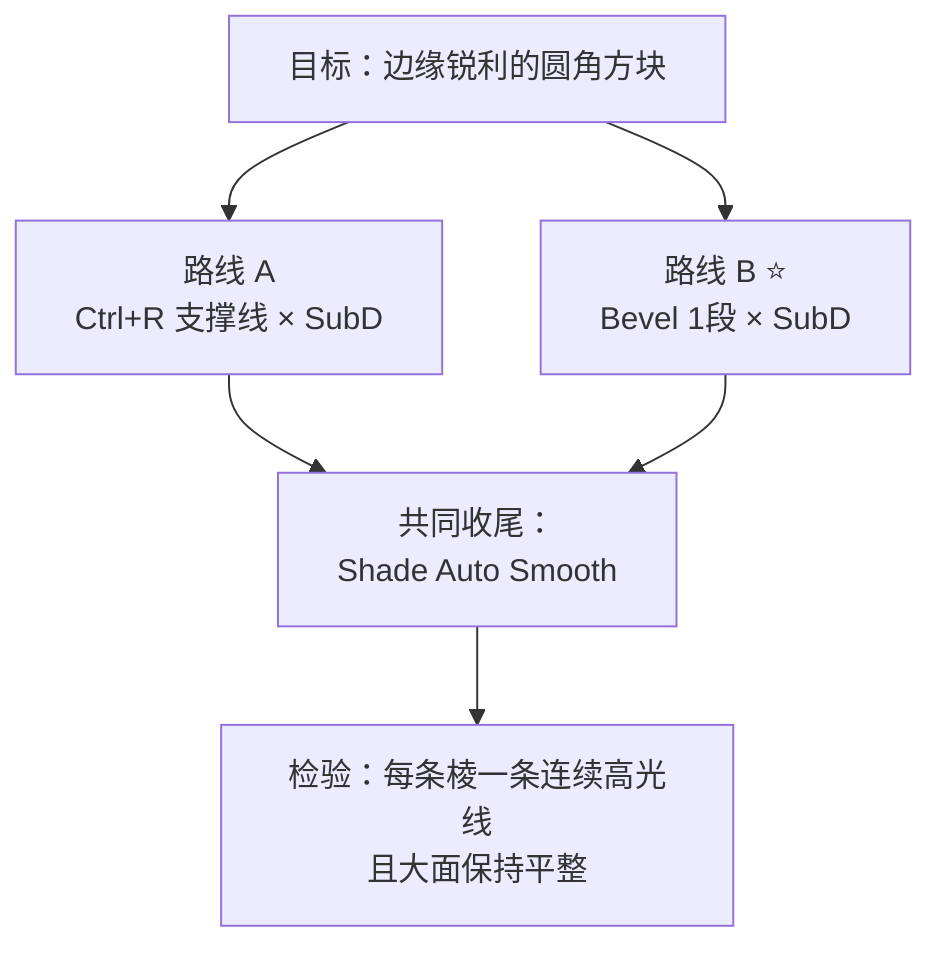
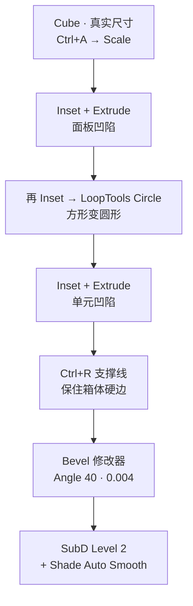

# 08 · 实战练习集

> 来源合并：`对象模式与编辑模式.md` 第 26 节（房子）+ `基础练习.md` 第 41–45、50 节（门、箱子）
> + `环切详解.md` 第 29、31 节（桌腿、5 种用法）+ `Bevel倒角详解.md` 第 11、16 节（电源箱、5 个动作）
> 2026-09-28 优化：订正尺寸换算与 Bevel Weight 默认值、补 Stage 0 缺席的**音箱**、把全部验收标准换成**可判定**的。

一句话：**这篇不是「按一遍就会」，每条练习都必须能自己判定对错——做完自己打勾，而不是「感觉差不多」。**

---

## 本次优化订正一览

| # | 旧稿问题 | 现在 |
| - | -------- | ---- |
| 1 | 练习 5 想做 40cm 的箱子却写 `S X 0.4` —— Cube 默认边长是 **2m**，算出来是 0.8m | 全部换成 **Dimensions 直接输入**，并同时给出对应的 `S` 系数 |
| 2 | 练习 5 写「外壳边保持 1.0」 | Blender 的 Bevel Weight 默认 **0**，必须主动设；已改成显式两步 + Overlays 可视化验证 |
| 3 | 练习 5 叠两个 Bevel 修改器，和 `06` 篇「一个修改器 + Weight 分级」的结论**互相打架** | 主路径改成单 Bevel + Weight；叠两个的场景降级为进阶，并写明代价 |
| 4 | 练习 3 说「只用 10 个键」，但第一步就在用 `Ctrl+A` | 明确区分「10 个建模键」与「流程前置键」 |
| 5 | 练习 7 的动作清单与 `06` 篇 12.3 不一致，且 Profile 那条的前提写反了（写成了 Segments=2 直接拖） | 对齐 `06` 的 6 个动作；Profile 改为**先用 Segments=1 证伪** |
| 6 | Stage 0 的第三个项目「音箱」在这份练习集里**根本没有** | 新增练习 9 |
| 7 | 验收标准大量是「能说出」「看得清」这类不可判定的话 | 每条都换成具体现象 / 数字 / Outliner 里能看到的事实 |

> 交叉引用已刻意保持：**练习 6（环切 5 用法）** 和 **练习 8（圆角方块）** 的编号不变，因为 `05` 篇和 `README` 都引用了它们。

---

## 怎么用这篇

| 你想干嘛 | 走哪几条 |
| -------- | -------- |
| 刚看完 `01`–`04`，想确认自己真的会了 | 练习 1 → 2 → 3 |
| 在补 Stage 0 的拓扑思维 | 练习 4 → 6 → 8 → 9（**9 是本阶段收尾项目**） |
| 在啃 `06` Bevel | 练习 5 → 7 → 8 |
| 想系统过一遍 | 全部 9 条走一遍，约 2.5h |



---

## 三段自检（每条练习都套这个框架）

不要只看「像不像」，按这个顺序过一遍：



| 段 | 具体检查 |
| -- | -------- |
| 一 · 几何 | Object Mode 下 Dimensions 是你给的真实尺寸；Scale = `1,1,1`；Rotation 归零 |
| 二 · 拓扑 | `Mesh → Clean Up` 无残留；`Shift+N` 后无黑面；修改器栈里 **Bevel 在 SubD 之前** |
| 三 · 光照 | Material Preview 下**转一圈 360°**，每条该有高光的棱都要有，且**连续不断** |

> 「没有高光 → 倒角太小 / Segments 太少；高光太宽 → 倒角太大」这句判据贯穿全文，来自 `06` 第八节。

---

# 练习 1 · 房子（模式切换全流程）

> **难度** ★☆☆　|　**时长** ≈ 8 min　|　**前置** [`01`](01-核心概念-Object与Mesh.md) + [`03`](03-变换系统-G-R-S.md)　|　**新增按键** 无

目标：体会「Object 管摆放，Edit 管形状」的循环——**全程只产生 1 个 Object**。

**先定真实尺寸**：墙身 6m × 4m × 2.8m。Cube 默认边长 **2m**，所以缩放系数一律是「目标尺寸 ÷ 2」。

| Step | 模式 | 操作 | 得到什么 |
| ---- | ---- | ---- | -------- |
| 1 | Object | `Shift+A → Mesh → Cube` | 2m 立方体 |
| 2 | Object | `S X 3` / `S Y 2` / `S Z 1.4` | 6 × 4 × 2.8 m |
| 3 | Object | **`Ctrl+A → Scale`** | Scale 回 1,1,1（不然后面所有 Edit 操作都被非均匀拉伸） |
| 4 | Edit | `Tab` → `Ctrl+R` 在靠近顶面处加一圈 Loop | 这圈 Loop = **檐口线**，它是你后面调屋身高度的抓手 |
| 5 | Edit | `3` 选顶面 → `E Z` 向上挤出 | 屋顶体积出现 |
| 6 | Edit | `S` 整体缩小刚挤出的顶面 | 四棱台（庑殿顶雏形） |
| 7 | Edit | 再 `E Z` → **`S Y` 只压一个轴** | 收出屋脊 |



```
侧视：加线 → 挤屋顶 → 收屋脊

   ┌────────┐      ┌────────┐       ┌────────┐
   │        │      │        │       │        │
   ├════════┤ ←檐口 ├────────┤       ├────────┤
   │        │    ╱          ╲      ╱ ╲      ╱ ╲
   │        │  ╱              ╲   ╱   ╲    ╱   ╲
   │        │╱──────────────────╲╱─────╲__╱─────╲
   └────────┘└──────────────────┘└──────────────┘
    Step 4       Step 5-6          Step 7（留一条脊线）
                                   ↑ 顶面没有收成一个点
```

⚠️ **第 7 步千万别把顶面 `S` 缩成一个点。** 那会生成一个**极点（pole）**，周围一圈全变成三角面，之后任何 `Ctrl+R` 到此必断（见 [`05` 第六节](05-环切与拓扑-Ctrl+R.md)）。正确做法是**只压一个轴**，留一条脊线（一条边）。

**检验点**（可判定）：

- [ ] Outliner 里只有 **1 个 Object**（不是两个）
- [ ] 顶点模式下看屋脊：是**一条边**，不是一个点
- [ ] Object Mode 下 Dimensions 显示 `6.000 / 4.000 / …`，且 Scale 是 `1,1,1`
- [ ] `Ctrl+R` 悬停檐口附近的边，预览线能**绕一整圈连回来**（被截断 = 上面有 Tri / N-Gon）

---

# 练习 2 · 门（Inset + Extrude + Bevel）

> **难度** ★☆☆　|　**时长** ≈ 8 min　|　**前置** [`04`](04-挤出与内插-E-I.md)　|　**新增按键** 无

门是练「薄板限制」最好的对象。真实尺寸：**0.9m 宽 × 0.05m 厚 × 2.1m 高**。

| Step | 模式 | 操作 | 注意 |
| ---- | ---- | ---- | ---- |
| 1 | Object | Cube → Dimensions 输入 `X 0.9 / Y 0.05 / Z 2.1` | 等价写法：`S X 0.45` / `S Y 0.025` / `S Z 1.05` |
| 2 | Object | **`Ctrl+A → Scale`** | 门这么薄，漏这步后面 Bevel 必然歪 |
| 3 | Edit | `Tab` → `3` 选正面 → `I` Inset | 边框留 ~0.12m |
| 4 | Edit | 选内部面 → `E` 向内挤 ~0.02 | 凹槽深度必须 < 板厚的一半，否则穿到背面 |
| 5 | Edit | `2` 边模式 → 选门框那圈边 → `Ctrl+B`，Segments 2，Width ≈ **0.008** | 见下方「宽度上限」 |
| 6 | — | `Z → Material Preview` 转视角 | 找那条高光线 |

```
┌──────────────┐
│              │
│   ┌──────┐   │
│   │      │   │  ← 向内挤入（深度 < 板厚/2）
│   └──────┘   │
└──────────────┘

侧视（厚度 0.05m）：
├─0.008─┬──────┬─0.008─┤   ← Ctrl+B 两侧各吃掉 8mm
        └──────┘
   ⚠️ Width 若 ≥ 0.025，两侧倒角在板中间撞一起 → 自相交黑面
```

**宽度上限公式**：`Ctrl+B` 的 Width 必须 **< 板厚 ÷ 2**。这里 0.05 ÷ 2 = 0.025，取 0.008 留足安全量。做完务必按 `C` 打开 **Clamp Overlap**（`06` 4.3 的热键）。

**检验点**：

- [ ] Material Preview 下转视角，门框四条边各有一条**连续**高光线（断了 = 有自相交或重叠面，回 `09-C`）
- [ ] 侧视检查：门厚仍是 5cm，凹槽**没有穿透**到背面
- [ ] Tris < 200
- [ ] 进阶（镶板门）：内部面再 `I` 一次 + `E`，做出第二层凹槽

---

# 练习 3 · 游戏箱子（限定按键 + 面数预算）

> **难度** ★☆☆　|　**时长** ≈ 10 min　|　**前置** `01`–`04`　|　**新增按键** 无

**限定建模键（正好 10 个）**：`G / R / S / 1 / 2 / 3 / E / I / Ctrl+R / Ctrl+B`

> 不占额度：Object 侧的流程前提 **`Ctrl+A → Scale`**、模式切换 **`Tab`**、着色切换 **`Z`**、确认键 **`LMB`**。
> （旧稿把这 10 个之外的 `Ctrl+A` 也算进去了，逻辑上自相矛盾。）

做一只 **1.0 × 0.8 × 0.7 m** 的木箱：



看不到面数怎么办：视口右上角 **Overlays ▾ → Statistics** 勾上，看 **`Tris`** 那一行（不是 Faces）。

**检验点**：

- [ ] Statistics 的 **Tris ≤ 800**（移动端环境道具）或 **≤ 2,500**（PC/主机）——预算表见 [`../07-资产规范与引擎导出/笔记.md`](../07-资产规范与引擎导出/笔记.md)
- [ ] 全程没用过第 11 个建模键
- [ ] Material Preview 下每条**该有**的棱都有高光线（能说清哪几条不需要倒角，也算合格）
- [ ] `Mesh → Clean Up → Delete Loose` 无残留

---

# 练习 4 · 桌腿（Loop Cut 控制形状）

> **难度** ★★☆　|　**时长** ≈ 12 min　|　**前置** [`05`](05-环切与拓扑-Ctrl+R.md)　|　**新增按键** `G G`

从一根长方体柱子做成「上粗 / 中细 / 下粗」，全程只用 `Ctrl+R / Alt+LMB / S / G G`。



```
侧视（加线 → 收腰）：

  ┌──┐                    ┌──┐
  │  │                    │  │
  ├──┤  ← Loop 1          ├──┤
  │  │                    │ ┃┃  ← 中部被 S 收细
  ├──┤  ← Loop 2          │ ┃┃
  │  │                    ├──┤
  └──┘                    └──┘
   加线后                  收细后
```

> **用 `G G` 调位置，不要删线重切。** 每重切一次就多一次不可逆的拓扑变更；`G G` 是拓扑不变、只重新分配空间（[`05` 第五节](05-环切与拓扑-Ctrl+R.md)）。
> 滑动觉得线歪了 → 按 `E` 开 **Even**（改成走相同**绝对距离**，而不是相同百分比）。

**检验点**：

- [ ] 能说出「为什么要加 2 条 Loop」——要 3 段就只需 2 条分割线
- [ ] 加 SubD Level 2 后：把中部 Loop 往**上**滑，过渡变缓；往**下**滑，过渡变急 —— 亲自验证「SubD 后圆角半径 ≈ 支撑线到边缘的距离」
- [ ] 关掉 SubD，网格仍然是干净 Quad（没有任何 Tri / N-Gon）
- [ ] macOS 触控板注意：开了 `Emulate 3 Button Mouse` 会让 `Alt+LMB` 失效 → 改用**双击 LMB** 选环

---

# 练习 5 · 科幻电源箱（Bevel Weight + SubD）⭐

> **难度** ★★★　|　**时长** ≈ 25 min　|　**前置** [`06` 全文](06-倒角-Bevel.md)　|　**新增按键** `Ctrl+E → Edge Bevel Weight`

真实尺寸 **40cm × 30cm × 20cm**。核心考点：**用一个 Bevel 修改器同时给出两种倒角宽度**。

| Step | 模式 | 操作 |
| ---- | ---- | ---- |
| 0 | Object | Cube → Dimensions `X 0.4 / Y 0.3 / Z 0.2` → **`Ctrl+A → Scale`** |
| 1 | Edit | `3` 选正面 → `I` Inset 出面板（`Thickness ≈ 0.03`）→ `E` 向内挤 `0.01` |
| 2 | Edit | `2` 边模式 → 选**外壳轮廓边** → `Ctrl+E → Edge Bevel Weight` 拖到 **1.0** |
| 3 | Edit | 选**面板缝那圈内边** → `Ctrl+E → Edge Bevel Weight` = **0.25** |
| 4 | Edit | Overlays ▾ → 勾 **Edge Bevel Weight**，weight 大的边会变粗变色 → 确认没选错 |
| 5 | Object | Bevel 修改器：Limit Method = **Weight**、Width = **0.006**、Segments = 1，勾 **Clamp Overlap / Harden Normals** |
| 6 | Object | Subdivision Surface：Level 2 |
| 7 | — | `Z → Material Preview` 转一圈；看 Statistics |



⚠️ **两处最容易踩的坑**（旧稿就栽在这）：

1. **Bevel Weight 的默认值是 0，不是 1.0。** 不给外壳边显式设 1.0，在 `Limit Method = Weight` 下外壳**一根都不会倒角**——因为 `weight = 0` 的语义是「完全排除」，不是「最小宽度」。
2. **实际宽度 = Bevel Weight × 修改器 Width。** 所以这里外壳 6mm、面板缝 1.5mm，一个修改器搞定两种宽度——**这正是 Weight 存在的全部意义**（`06` 5.4）。

**那什么时候才需要叠第二个 Bevel 修改器？**（进阶）

- 只有当两套边需要**不同的 Segments / Profile / Width Type** 时才值得（比如外壳要刀切感 Sharp、面板缝要圆弧）。
- **代价**：第二个 Bevel 会把**第一个 Bevel 生成的新边再倒一次**，角上极易炸面。真要叠，必须开 Clamp Overlap，并用 Weight 或 Limit 把作用范围彻底隔离。
- 判断依据回到 `06` 6.4 的决策树：**能用 Weight 分级解决的，就别叠。**

**宽度合理性核对**：最短边 0.2m × 0.5%~2% = **1–4mm**（`06` 锚点 2）。6mm 偏厚重但不出格，适合「科幻设备箱」的体量感。

**检验点**：

- [ ] 外壳棱和面板缝**同时**有高光，且宽度肉眼可分
- [ ] 关掉 Bevel 修改器的可见性（显示器图标）→ 能立刻看到倒角前的样子（证明流程**可逆**）
- [ ] 修改器顺序：**Bevel 在 SubD 之前**（故意拖到 SubD 下面，看面数怎么爆炸）
- [ ] Overlays 里勾 Edge Bevel Weight 复查：没选错的边

---

# 练习 6 · Loop Cut 的 5 种用法

> **难度** ★★☆　|　**时长** ≈ 20 min　|　**前置** `05` 全文　|　**对应** `05` 第十二节的验收判定

| # | 用法 | 操作 | 目标 |
| - | ---- | ---- | ---- |
| ① | 基础环切 | `Ctrl+R` → `LMB` → `RMB` | 快速在中心加 Loop |
| ② | 多重环切 | `Ctrl+R` → 滚轮 | 一次加 2 / 3 / 5 / 10 条 |
| ③ | 环切 + 滑动 | `Ctrl+R` → `LMB` → 移动 → `LMB` | 精确控制位置 |
| ④ | 选择 + Edge Slide | `Alt+LMB` → `G G` | 调整已有 Loop（**不需要删线重切**） |
| ⑤ | 环切 + SubD | `Ctrl+R` 靠边加 Loop → SubD | 理解**支撑线距离 = SubD 后的圆角半径** |

**练到什么程度算「会」**（来自 `05` 12.2，全部可自行打分）：

| # | 验收点 | 判定方式（自己数 / 自己答） |
| - | ------ | -------- |
| ① | 中央加线不用想 | 连续 5 次 `Ctrl+R → LMB → RMB`，位置都落在正中间 |
| ② | 数量控制 | 不看屏幕提示，能一次切出 2 / 5 / 10 条 |
| ③ | 会说清右键的两副面孔 | 能说出**阶段 1** 按 `RMB`（中止）与**阶段 2** 按 `RMB`（居中确认）的区别 |
| ④ | 滑动可控 | 能把一条已有 Loop 精确滑到「贴边」和「居中」两个位置 |
| ⑤ | 支撑线量化 | **先预测**「Loop 往边滑近 → SubD 后圆角变小」，再验证成立 |

> 5 条全通过 = 路线图 Stage 0 的 `Ctrl+R` 部分完成。
> 滑动时别忘了三个开关：`E` 等距 / `F` 翻面 / `C` 钳制。

---

# 练习 7 · Bevel 的 6 个动作

> **难度** ★★☆　|　**时长** ≈ 25 min　|　**前置** `06` 全文　|　**对应** `06` 12.3

> 旧稿只有 5 个且与 `06` 不一致，这里对齐 `06` 的 6 个动作。

| # | 动作 | 操作 | 你应该看到什么 |
| - | ---- | ---- | -------------- |
| 1 | **面数直觉** | Cube 全边 `Ctrl+B`，Segments 从 1 调到 5，每次记 Statistics | 面数 6 → 26 → 38 → 50 → 74（约 4.3× 起跳），验证 `06` 第二节的表格 |
| 2 | **Profile 的前提** | 固定 **Segments = 1**，把 Profile 从 0 拖到 1 → **确认一点变化都没有**；再改成 Segments = 2 重拖 | 亲自证伪「Profile 决定圆不圆」：Segments < 2 时它完全无效 |
| 3 | **角度限制** | 带凹槽的方块，对比 `Limit Method = None` vs `Angle` | `None` 会把平面上 `Ctrl+R` 出来的线也一起倒了；`Angle` 只动硬边 |
| 4 | **`Ctrl+B` 的隐藏参数** | `Ctrl+B` 之后按 **`F9`**，逐个找到 Harden Normals / Clamp Overlap / Mark Seams | 打破「`Ctrl+B` 只有拖鼠标」的误解——它缺的只有 Limit Method |
| 5 | **Weight 分级** | 同一个模型给三条边设 Bevel Weight **1.0 / 0.5 / 0.0** | 前两条宽度不同，**第三条完全不倒角**——`weight=0` 是「排除」而不是「最小」 |
| 6 | **策略 C** | Bevel 1 段 + SubD Level 2，对比纯 Bevel 3 段 | 高光接近，面数差一大截 → 理解为什么它是硬表面默认解 |

---

# 练习 8 · 圆角立方体（Stage 0 验收项 · 3 分钟挑战）

> **难度** ★★☆　|　**时长** ≈ 3 min（不看笔记）　|　**前置** `05` 第七节 + `06` 第九节

目标：**不看教程，3 分钟内**把 Cube 做成**边缘锐利但整体平滑**的圆角方块。

| 路线 | 步骤 | 可调的那个量 |
| ---- | ---- | ------------ |
| **A · 纯 SubD + 支撑线** | Cube → `Ctrl+A → Scale` → Edit → `Ctrl+R` 在 **X/Y/Z 三个方向各加 2 条** Loop，位置贴近各自的对棱（距边 ≈ 边长 2%，2m 的 Cube 取 0.04）→ SubD Level 2 → 右键 **`Shade Auto Smooth`** | **Loop 到边的距离** ≈ 圆角半径 |
| **B · Bevel 1 段 + SubD**（推荐） | Cube → `Ctrl+A → Scale` → Bevel 修改器 **Width 0.02 / Segments 1 / Limit = Angle 40°** / 勾 Clamp + Harden → SubD Level 2 → `Shade Auto Smooth` | **Bevel Width** = 圆角半径 |



两条路的理论基础：路线 A 是 `05` 第七节「策略 B」，路线 B 是 `06` 第九节「策略 C」。**做完后自己说出两者的本质差异**（提示：控制手段是「线的位置」还是「面的宽度」，以及 Low-poly 基础网格面数差多少）。

**糊角归因表**（做完对着查，这也是验收口试内容）：

| 现象 | 根因 | 怎么修 |
| ---- | ---- | ------ |
| 整块像球 | 支撑线离边太远，或 SubD Level 太高 | Loop 往边滑近；Level 降到 2 |
| 棱上高光**断开 / 闪烁** | 重叠面或法线翻了 | `A` 全选 → `Shift+N`；勾 Clamp Overlap |
| 高光太宽糊成一片 | Bevel Width 太大 | 按最短边 **0.5%~2%** 重算（`06` 锚点 2） |
| 加了 Bevel 完全看不出 | 没开 Harden Normals；或 Segments=1 时去拖 Profile | 勾 Harden Normals；Profile 在 Segments<2 时本来就无效 |
| 面数暴涨到几千 | 修改器顺序反了（SubD 在 Bevel 前），或 Segments 太高 | Bevel 必须在 SubD **之前**；Segments 降到 1–2 |
| 明明有 Bevel 但边缘看不出倒角 | 没 `Ctrl+A → Scale`；或.Width Type 理解错了 | Object Mode `Ctrl+A → Scale`；回 `06` 3.1 逐个试 5 种度量 |

**验收**（可判定）：

- [ ] **计时 ≤ 3 分钟**，全程不看笔记
- [ ] 基础网格面数在 **30 面上下**（不是几百）——这是路线 B 相对 A 的核心优势
- [ ] Material Preview 转一圈 360°：每条棱**一条连续、宽度一致**的高光线
- [ ] **口试**：随机抽归因表里一条现象，能说出根因和修法

---

# 练习 9 · 音箱（Stage 0 综合项目）⭐

> **难度** ★★★　|　**时长** ≈ 40 min　|　**前置** `04` + `05` + `06`　|　**新增按键** `Alt+Shift+S` / LoopTools Circle / Grid Fill

这是路线图 Stage 0 的**第三个练习项目**（前两个是练习 8 的圆角方块、练习 4 的桌腿），也是把前面所有工具串起来的收尾项目。目标：**书架音箱 0.30m 宽 × 0.25m 深 × 0.45m 高**。

| Step | 模式 | 操作 | 为什么这么干 |
| ---- | ---- | ---- | ------------ |
| 0 | Object | Cube → Dimensions `X 0.30 / Y 0.25 / Z 0.45` → **`Ctrl+A → Scale`** | 真实单位是后续 Bevel 宽度的锚点 |
| 1 | Edit | `3` 选前面 → `I` Inset 出面板边框（≈0.03）→ `E` 向内挤 0.01 | 面板凹进去，产生第一层体积关系 |
| 2 | Edit | 面板内再 `I` 一次，给低音单元定位（单元直径 ≈ 0.13） | Inset 后可以再 `G` 挪位置，调它在面板上的构图 |
| 3 | Edit | 选中单元面 → **LoopTools → Circle**（或先 `Alt+Shift+S` To Sphere 再 Circle） | 方环变圆环 |
| 4 | Edit | 圆面再 `I` Inset → `E` 向内挤 ~0.008 | 单元凹陷；只有凹进去才会有一圈闭合高光 |
| 5 | Edit | `Ctrl+R` 在箱体**每条竖棱附近**加支撑线（距边 ≈ 0.006） | 保住箱体的「方」（`05` 第七节） |
| 6 | Object | Bevel 修改器：Width **0.004**、Segments 1、**Limit = Angle 40°**、勾 Clamp + Harden | 给所有硬边统一倒角 |
| 7 | Object | Subdivision Level 2 → 右键 **`Shade Auto Smooth`** | 1 段斜面被平滑成圆角 |



**进阶收尾（把圆面的 N-Gon 收掉）**

第 3 步 LoopTools Circle 之后，中间那块圆形面本质上是个 **N-Gon**。两种处置：

| 做法 | 什么时候用 | 操作 |
| ---- | ---------- | ---- |
| 直接删 + Grid Fill | 要继续加 SubD、要进引擎 | 选中圆面 → `X → Only Faces` → `Alt+LMB` 选边界环 → `F3 → Grid Fill`（Span 2 / Offset 0）→ 得到纯 Quad |
| 保留 N-Gon，留给后续 Grid Fill 收掉 | 只是一个凹坑，外面还有面板遮着 | 不动，但在备注里记一笔「这里有 N-Gon，别在这附近 Ctrl+R」 |

⚠️ 注意：**有 N-Gon 的地方 Edge Loop 会终止**（`05` 第六节）。所以如果你打算让 `Ctrl+R` 的线穿过单元区域，就必须先 Grid Fill。

**检验点**：

- [ ] 加 SubD Level 2 之后，箱体 **8 个角仍然是方的**（糊了 = 支撑线离边太远，回练习 4）
- [ ] 低音单元的凹陷边缘在 Material Preview 下有一圈**闭合**的高光（不是某个角度突然消失）
- [ ] 面预算：PC 环境道具 **≤ 2,500 tri**（见 [`../07-资产规范与引擎导出/笔记.md`](../07-资产规范与引擎导出/笔记.md)）
- [ ] `Mesh → Clean Up → Delete Loose` + `Merge By Distance` **全部无残留**
- [ ] 能指出模型里**每一个 N-Gon / 极点**在哪，并说它是**可接受**还是**该修**

> 这条做完 → Stage 0 的三件套（圆角方块 / 桌腿 / 音箱）齐了，对照 [`../01-拓扑与建模思维/笔记.md`](../01-拓扑与建模思维/笔记.md) 的验收标准打勾，然后进 Stage 1（参考图 + Modifier Stack + 布尔）。

---

# 通用自检清单

## 一 · 几何自检（Object Mode）

- [ ] **`Ctrl+A → Rotation & Scale`**：Scale 必须是 `1,1,1`，Rotation 归零
- [ ] Location 归零 / 或明确放在该在的地方；**原点位置合理**（道具：底部中心；门：铰链处）
- [ ] Dimensions 是真实尺寸，场景单位是**米**（`Scene Properties → Units`）

## 二 · 拓扑自检（Edit Mode）

- [ ] `Select → Select All by Trait → Faces by Sides` → **没有 N-Gon**（能说出允许的例外在哪）
- [ ] 没有孤立顶点 / 内部面：`Mesh → Clean Up → Delete Loose`
- [ ] 没有重叠顶点：`M → By Distance`
- [ ] `A` 全选 → **`Shift+N`** 重算法线 → 没有黑面
- [ ] **修改器顺序正确**：Bevel 在 SubD **之前**
- [ ] 关掉每个修改器的可见性，都能看到「改之前的样子」（证明流程可逆）

## 三 · 光照 / 渲染自检

- [ ] `Z → Material Preview`，**转一圈 360°**（不是只看正面）
- [ ] 每条该有的棱都有高光线，且**连续不断**
- [ ] Statistics 的 **Tris 在预算内**
- [ ] 加了 SubD 的形状不崩

---

# 我的练习记录

| 日期 | 练习 | 用时 | 卡在哪 | 怎么解决的 |
| ---- | ---- | ---- | ------ | ---------- |
| | 1 · 房子 | | | |
| | 2 · 门 | | | |
| | 3 · 箱子 | | | |
| | 4 · 桌腿 | | | |
| | 5 · 电源箱 | | | |
| | 6 · 环切 5 用法 | | | |
| | 7 · Bevel 6 动作 | | | |
| | 8 · 圆角方块（3min） | | | |
| | 9 · 音箱 | | | |

> **够通用的坑，记得同步到** [`../09-常见错误与排查.md`](09-常见错误与排查.md) **的 F 节**，以及 [`../速查/常见坑汇总.md`](../速查/常见坑汇总.md)。

---

> **下一步**：练习 8 和练习 9 都通过之后，Stage 0 就结束了 → 进 Stage 1 的 [`../02-硬表面建模工作流/笔记.md`](../02-硬表面建模工作流/笔记.md)，那里开始讲参考图对齐、修改器栈和布尔清理。
