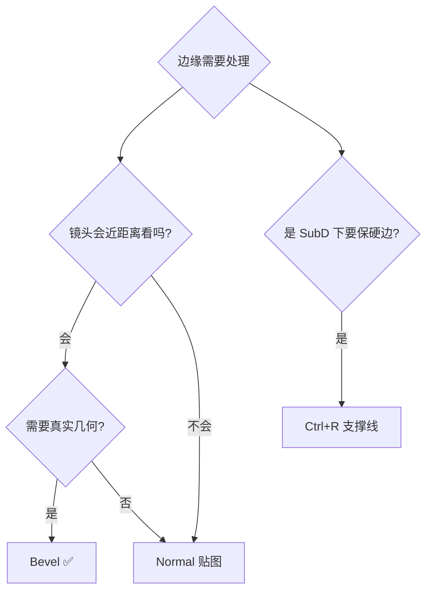
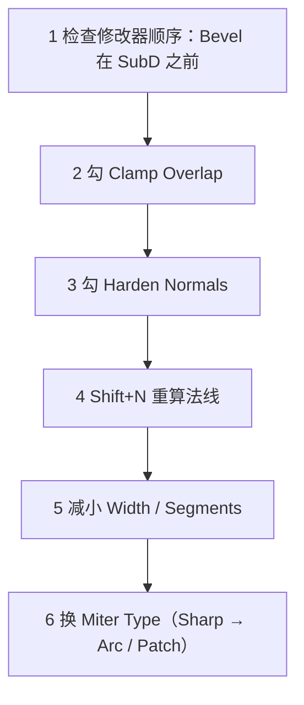

# 09 · 常见错误与排查

> 来源合并：`基础练习.md` 第 49 节（8 个错误）+ `Bevel倒角详解.md` 第 10、14 节（6 问题 + 8 错误）
> + `对象模式与编辑模式.md` 第 29 节 + `Blender快捷键.md` 第 38 节（Mac）
> 去重后按「什么时候会踩」分组。**够通用的坑会同步到 `../速查/常见坑汇总.md`。**

---

# A · 模式与变换

## A1 在 Object Mode 下按建模快捷键

`E / I / Ctrl+R / Ctrl+B` 全部无效。

```
❌ Object Mode + E        ✅ Tab → Edit Mode → E
```

## A2 选错了选择模式

想移动一个面却按了 `1`（顶点模式），结果只挪动一个点。

| 想做的事 | 该按 |
| -------- | ---- |
| 移一个面 | `3` |
| 处理一条边（倒角 / 环切） | `2` |
| 调一个点 / 合并顶点 | `1` |

## A3 没 Apply Scale ⭐ 最高频

```
Object Mode 里 S X 10 → Scale X = 10
进 Edit Mode 做 Ctrl+B → 倒角在 X 方向被拉伸 10 倍 ❌
```

**固定流程**：改完 Object 尺寸 → `Ctrl+A → Scale` → 才进 Edit Mode。

## A4 把 Extrude 当 Move

| 操作 | 本质 |
| ---- | ---- |
| `G` | 移动**已有**几何，拓扑不变 |
| `E` | 复制边界 + 连接，**新增**几何 |

发现模型莫名其妙多了一堆面 → 多半是误用了 `E`。

## A5 把 Inset 当 Loop Cut（或反过来）

```
Loop Cut（整圈拓扑）:      Inset（面内嵌套）:

┌────────┐                ┌────────┐
├────────┤                │ ┌────┐ │
│        │                │ └────┘ │
└────────┘                └────────┘
```

---

# B · 拓扑

## B1 为了「更精细」疯狂加线

拓扑越密越难改。**先用最少的线把形状定住**，需要细节时再加。

## B2 Loop Cut 加错位置

Loop 的位置直接影响：Subdivision 效果、模型轮廓、硬边。不要随手加。

## B3 三角面 / N-Gon 阻断拓扑流

Triangle 和 N-Gon 会让 Edge Loop 中断、转向、结果不可控。保持 **Quad Flow**。

## B4 以为「多边形越多 = 模型越好」

真正决定质量的是 **Topology（组织方式）**，不是面数。

---

# C · Bevel 专项

## C1 忘了 Apply Scale

同 A3，但 Bevel 是**最明显的受害者**：各方向倒角宽度不一致。

## C2 Segments 给太多

Cube 全边 Bevel Segments=8 → 上百个面。游戏资产 **2 段 + SubD** 效果一样好。

## C3 用 `Ctrl+B` 而不是修改器

改需求时要推倒重来。正式资产一律走修改器（还有 `Limit Method` / `Clamp Overlap` / `Bevel Weight` 只有修改器有）。

## C4 不开 Clamp Overlap

密集细节处倒角必然自相交 → 黑面。

## C5 不开 Harden Normals

倒角面被周围面平滑 → 看不出倒角效果，白白浪费面数。

## C6 修改器顺序放反

```
✅ Bevel → Subdivision        ❌ Subdivision → Bevel（面数灾难）
```

## C7 倒角宽度拍脑袋

不参考物体真实尺寸，结果 2 米的柜子倒角 10cm，看起来像塑料玩具。
锚点：真实加工半径 / 最短边 × 0.5%~2% / 镜头距离（见 `06-倒角-Bevel.md` 第八节）。

## C8 用 Bevel 解决所有「边缘不对」



## Bevel 排查顺序



---

# D · 对象管理

| 错误 | 后果 | 解法 |
| ---- | ---- | ---- |
| 以为「看起来 3 个物体」= 3 个 Object | 导出时混成一坨 | Edit Mode `P → By Loose Parts` |
| 用 `Delete` 清理多余顶点 | 形状被破坏 | 用 `X → Dissolve` |
| 删除前没检查 Mesh Island | 残留看不见的孤立几何 | `Mesh → Clean Up` |
| 导出前没 Apply Transform | 引擎里比例 / 轴向错乱 | `Ctrl+A → Rotation & Scale` |

---

# E · Mac 专属

- 不要记成「Mac 上 Ctrl 全换 Cmd」——与系统快捷键冲突的会失效。
- 失灵时：**`F3` 搜命令名**，或去 Keymap 里改键。
- 没小键盘：开 `Preferences → Input → Emulate Numpad`。
- 触控板 MMB 难按：弄个三键鼠标，或把 Orbit 改成 `Alt+LMB`。

---

# F · 我自己踩过的（持续补充）

| 日期 | 现象 | 根因 | 解法 |
| ---- | ---- | ---- | ---- |
| | | | |
