# Blender Bevel（倒角）详解

> 适用版本：Blender 5.2 LTS　|　前置：已掌握 `E / I / Ctrl+R / Ctrl+B` 四大工具（见 `基础练习.md`）
> 本文解决一个具体问题：**你已会用 `Ctrl+B` 拉出倒角，但还不知道怎么控制它、为什么它经常会炸、以及怎么用一套修改器管理整个模型的倒角。**

---

# 一、先一句话讲清 Bevel 的本质

> **Bevel = 用一组新的面，替换掉原来的尖锐边。**

它不是"把边磨圆"，也不是"移动边"。它做的是：


所以 Bevel 是一个**拓扑重建**操作，不是变形操作。这一点决定了它后面所有的脾气。

---

# 二、Bevel 到底改变了什么（几何层面）

用一个 Cube 举例。默认 Cube：

```
8 Vertices / 12 Edges / 6 Faces
```

全选 12 条边做一次 Bevel（Segments = 1）：

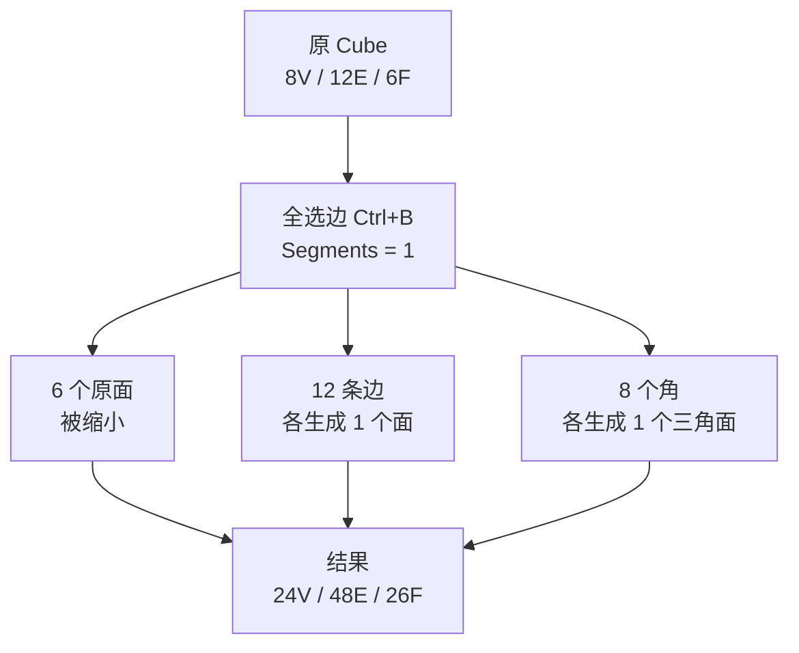

**面数从 6 涨到 26，约 4.3 倍。**

推广成公式（对全凸多面体近似成立）：

```
Bevel 后面数 ≈ 原面数 + 边数 × Segments + 顶点数
```

| Segments | Cube 倒角后面数 |
| -------- | --------------- |
| 0（原始） | 6 |
| 1 | 26 |
| 2 | 38 |
| 3 | 50 |
| 5 | 74 |

> ⚠️ 这就是为什么游戏资产里 **Segments 通常只用 1–2**：倒角是面数爆炸的头号来源。
> 一个 2000 面的道具，全边 Bevel 3 段可能直接冲到 8000+ 面。

---

# 三、剖面视角：倒角到底切掉了什么

把一条边**垂直切一刀**看剖面，这是理解 Bevel 最重要的一张图：

```text
原始锐边（90°）

    │
    │
    │
    └────────────
        90° 直角
```

倒角之后，那个尖角被"削掉"了：

```text
Segments = 1                Segments = 2             Segments = 3

  ┌────                      ┌────                    ┌────
  │╲                         │ ╲                      │  ╲
  │ ╲                        │  ╲                     │   ╲
  │  ╲                       │   │                    │    │
  │   ╲                      │    ╲                   │     ╲
  │    ╲                     │     ╲                  │      ╲
  └─────╲                    └──────╲                 └───────╲

  一个斜面                    两段折线                  三段折线 ≈ 圆弧
```

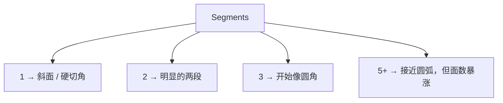

**关键认知**：Segments 不是"圆不圆"的唯一决定因素，**Profile** 才是（见第六节）。

---

# 四、两种 Bevel：`Ctrl+B` vs Bevel 修改器

这是本文最重要的一节。你笔记 `对象模式与编辑模式.md` 第 23 节提过一嘴，这里展开。

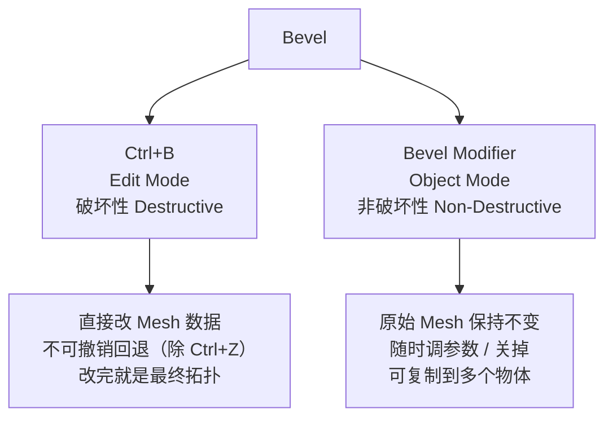

## 对比表

| 维度 | `Ctrl+B`（破坏性） | Bevel 修改器 |
| ---- | ----------------- | ------------ |
| 作用位置 | Edit Mode | Object Mode（修改器面板） |
| 原始网格 | 被永久改变 | 保持不变 |
| 改参数 | 只能靠 `F9` 或 Ctrl+Z 重做 | 随时拖动滑块 |
| Bevel Weight 支持 | 不支持 | ✅ 支持（核心差异） |
| Limit Method（角度限制） | 只有简单选项 | ✅ 完整的 Angle/Weight/Group |
| Clamp Overlap | 无 | ✅ 有 |
| 动态响应 | 无 | 改其他修改器会联动 |
| 适合场景 | 快速试造型、一次性定型 | **正式资产、需要反复迭代** |

## 决策树

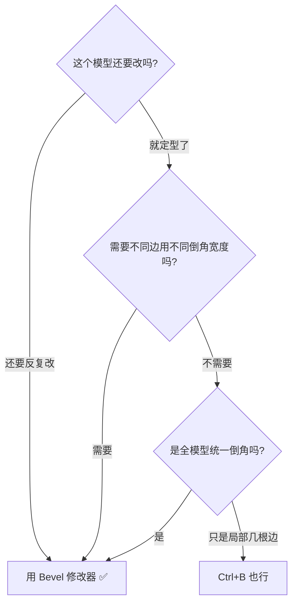

> **游戏资产的实践结论：默认用修改器。**
> 原因不是"非破坏性更高级"，而是：你需要 `Limit Method = Angle` + `Clamp Overlap` + `Bevel Weight`，这三个只有修改器有。

---

# 五、Bevel 修改器参数全解

在 Object Mode → 修改器面板 → Add Modifier → Bevel。参数按顺序：

## 1. Width（宽度）

倒角的**大小**。默认 0.1（Blender 单位 = 米，所以 0.1m = 10cm，对道具来说通常太大）。

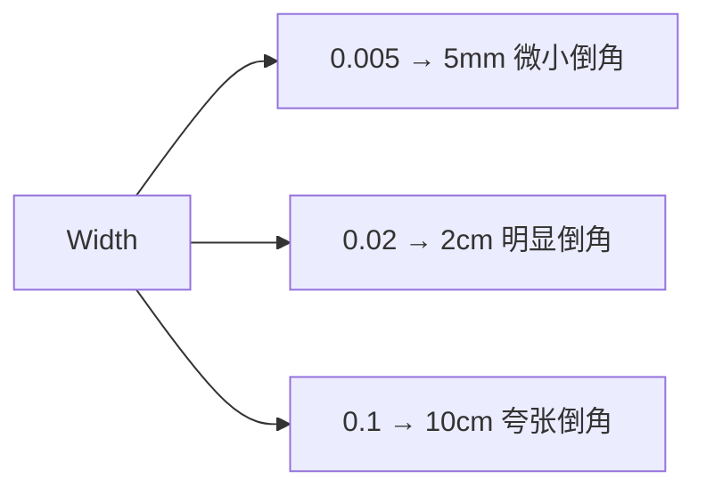

## 2. Width Type（宽度的度量方式）⭐ 容易被忽略

**同一个 Width 数值，在不同 Width Type 下含义完全不同。**

| 类型 | 含义 | 什么时候用 |
| ---- | ---- | ---------- |
| **Offset** | 从原边向外偏移的距离（**默认**） | 大多数情况 |
| **Width** | 倒角面的**总宽度** | 需要精确控制倒角面宽度 |
| **Depth** | 从原边到倒角最外点的**垂直深度** | 机械件、有图纸要求 |
| **Percent** | 占相邻边长度的百分比（0–100%） | 需要比例自适应时 |

```text
剖面示意（同一个形状的三种度量）：

        ╲                         ╲                      ╲
         ╲                         ╲                      ╲
          ╲                         ╲                      ╲
   ────────╲─────            ────────╲─────         ───────╲─────
      ↑                          ↑                       ↑
   Offset                      Width                   Depth
   （沿面测量）              （倒角面本身）          （垂直距离）
```

> 默认用 **Offset** 就行。只有当你发现"改了 Width 但视觉变化对不上预期"时，才来检查这个选项。

## 3. Segments（段数）

见第三节。游戏资产 **1–2**；产品渲染/影视 **3–5**。

注意：修改器里 Segments 是数值框，不是滚轮。滚轮调的是 `Ctrl+B` 的。

## 4. Profile（截面形状）⭐ 很多人不知道

控制倒角截面的"胖瘦"，范围 0–1，**默认 0.5**。

```text
剖面放大对比：

Profile = 0.5          Profile = 0.25         Profile = 0.75
（默认，均匀圆弧）       （内凹）                （外凸）

    ╭──                    ╲                      ┌─
   ╱                        ╲                     │
  │                          ╲                    │
  │                           ╲                   │
  │                            ╲                  │
  │                             ╲                 │
  │                              ─                │
```

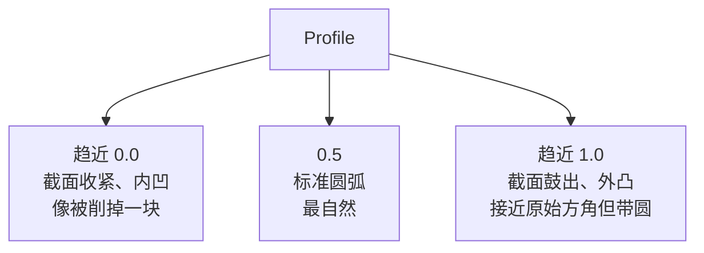

**实际用途**：
- 塑料/注塑件、圆润的产品 → 0.5 或略高
- 金属加工件、CNC 倒角 → 0.5 或略低（更"硬"）
- 想要"鼓鼓的软胶感" → 0.7+
- 想要"刀切的锐利感" → 0.3 左右

## 5. Limit Method（限制方式）⭐⭐ 硬表面最常用

决定**哪些边**会被倒角。

| 方式 | 行为 | 用途 |
| ---- | ---- | ---- |
| **None** | 所有边都倒角 | 简单模型 |
| **Angle** | 只倒角夹角 **大于** Angle 阈值的边（默认 30°） | **最常用**：自动只倒"硬边"，平面内部的边不倒 |
| **Weight** | 只倒角设了 Bevel Weight 的边 | **精确控制**（见第七节） |
| **Group** | 只倒角指定顶点组内的边 | 配合顶点组使用 |

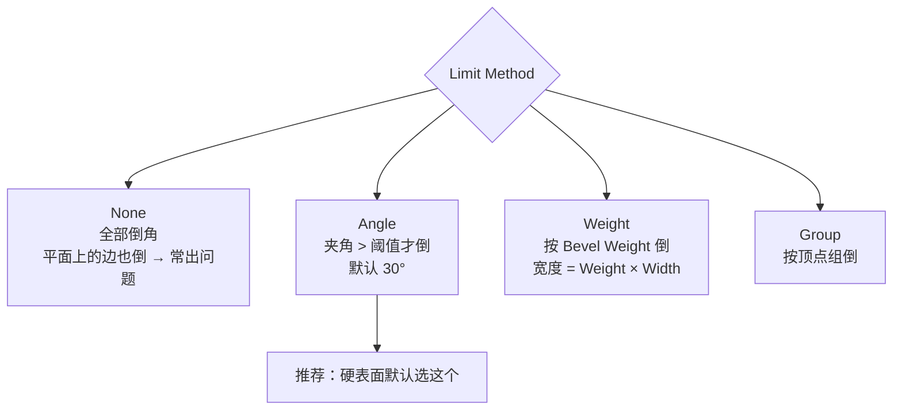

**为什么 Angle 这么重要**：

```text
一个带凹陷的盒子（俯视剖面）：

┌────────┐   ┌────────┐
│        └───┘        │
│                     │
└─────────────────────┘
        ↑
    这个角的夹角是 270°（>30°）→ 会被倒角
        
    而平面上一条普通的边（夹角 180°）→ 不会被倒角
```

> `Limit Method = Angle` + `Angle = 30°~60°` 是硬表面的**默认起手式**。

## 6. Miter Type（斜接类型）—— 拐角处怎么处理

倒角在**多个面交汇的角**上怎么收尾。

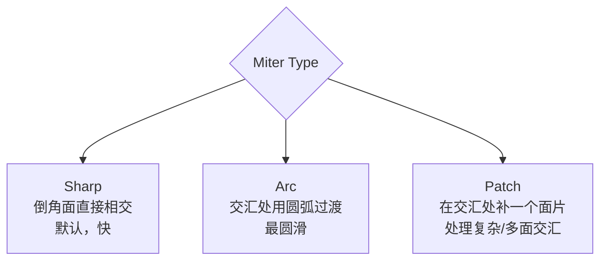

```text
三根边交汇的角（俯视）：

Sharp:              Arc:                Patch:
    ╲                   ╲                   ╲
     ╲                  ╱ ╲                 ╱│╲
   ───╲───           ──╱   ╲──          ──╱ │ ╲──
       ╲               ╲   ╱                │  │
        ╲                ╲╱                 ╲ │ ╱
                                              │
   直接相交           圆弧过渡             插入补片
```

**什么时候需要改**：
- 默认 Sharp 在 **Segments ≥ 2** 且角上有 3 条以上边交汇时，容易出现扭曲的面
- 出现"角上炸开/面扭曲" → 换成 **Arc** 或 **Patch**

## 7. Miter Inner / Miter Outer

内外角分别用不同斜接方式。一般保持和 Miter Type 一致即可。
只有当你发现**外角很好但内角扭曲**（或反之）时才分开调。

## 8. Spread（延展）

当倒角宽度太大、倒角面互相重叠时，Spread 控制倒角**在重叠区域继续延伸多远**。

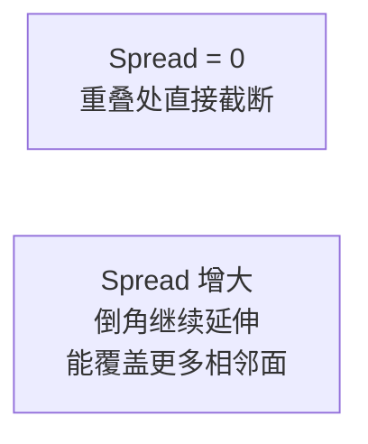

> 一般保持默认 0。只有做**非常宽的倒角**（比如倒角占了整个面的 50%）时才需要。

## 9. Clamp Overlap（钳制重叠）⭐ 防炸利器

勾选后，Blender 会**自动限制倒角宽度**，保证倒角面不会溢出到相邻几何上。

```text
不开 Clamp Overlap（倒角溢出穿模）：

┌─────────────┐
│  ┌────┐     │
│  │╲╱╲╱│     │   ← 倒角面互相穿插，几何自相交
│  └────┘     │
└─────────────┘

开 Clamp Overlap：

┌─────────────┐
│  ┌────┐     │
│  │╲__╱│     │   ← Blender 自动收窄，不让它穿
│  └────┘     │
└─────────────┘
```

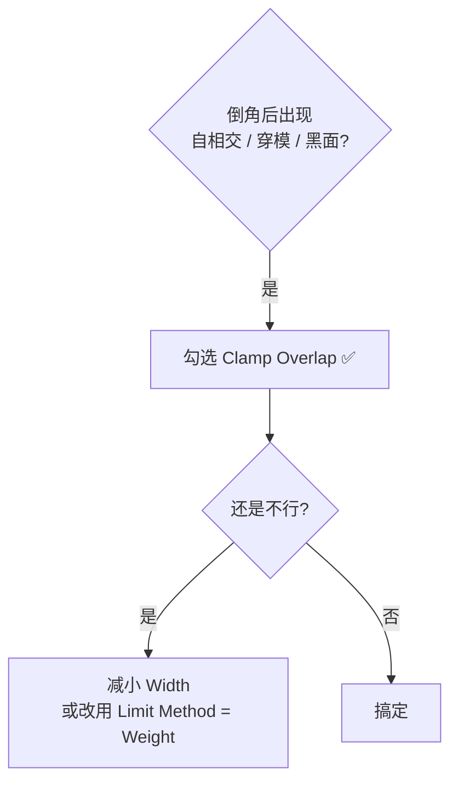

> **做窄面、小结构、密集细节时，这个勾默认开。**

## 10. Loop Slide（环滑动）

默认**开启**。控制倒角遇到相邻边时如何"滑过去"。

- **开启（默认）**：倒角会在遇到其他边时滑动过去，拓扑更干净，但倒角宽度在复杂区域可能不均匀
- **关闭**：倒角宽度绝对均匀，但在复杂拓扑上容易产生重叠

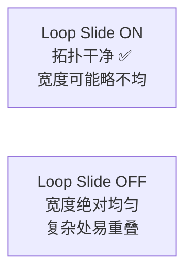

> 默认保持 ON。只有当你在规整的模型上发现倒角宽度明显不均时才关掉试试。

## 11. Mark Seam / Mark Sharp（自动标记）

让 Blender 在**倒角生成的新边**上自动打标记。

| 选项 | 作用 | 价值 |
| ---- | ---- | ---- |
| **Mark Seam** | 倒角边自动标记为 **UV 缝合边** | ⭐ 极大简化 UV 展开！倒角边本来就该是 seam |
| **Mark Sharp** | 倒角边自动标记为 **硬边** | 配合 `Shade Auto Smooth` 保住硬边 |

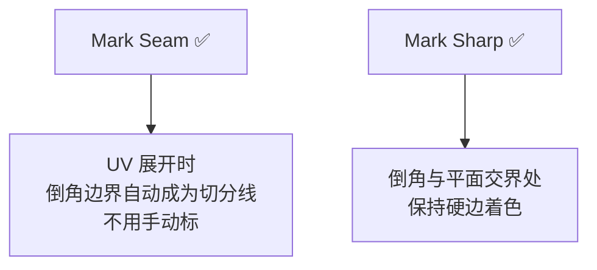

> **做游戏资产时，Mark Seam 强烈建议勾上。** 倒角边就是天然的 UV 切分位置。

## 12. Harden Normals（硬化法线）⭐

勾选后，倒角生成的新面**法线不被周围面平滑**，保持各自的朝向。

```text
不开 Harden Normals（倒角面被平滑，出现奇怪渐变）：

  ┌─────────╲─────────┐
  │▒▒▒▒▒▒▒▒░░░░░░░░░░│   ← 明暗过渡糊成一片
  └──────────────────┘

开 Harden Normals（倒角面保住自己的朝向）：

  ┌─────────╲─────────┐
  │          ┃        │   ← 边界清晰，高光正确
  └─────────┃────────┘
```

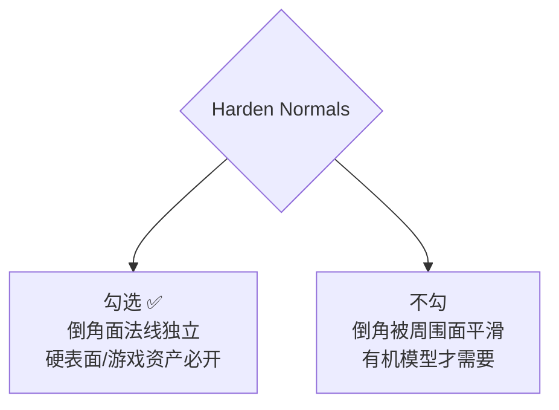

> **硬表面建模：这个必须勾。** 它是"倒角后模型看起来还是不对"的第一排查项。

## 13. Material Index（材质索引）

给倒角生成的面**单独指定一个材质槽**。

用途：让倒角处露出**底色/磨损层**（比如掉漆露出金属、磨边露出基材）。


> 注意成本：这会增加一个材质槽 = **多一次 draw call**。游戏资产慎用，只在 hero 道具上用。

## 14. Vertex Group（顶点组）

配合 `Limit Method = Group` 使用，只在指定顶点组内的边上倒角。

## 15. Face Strength（面强度）

给倒角面标记面强度（影响加权法线计算）。一般保持默认 `Medium`，除非你在用加权法线做特殊效果。

---

# 六、参数速查表

| 参数 | 推荐值（游戏硬表面道具） | 说明 |
| ---- | ---------------------- | ---- |
| Width | 0.002 – 0.02（2mm–2cm） | 按物体真实尺寸定，见第九节 |
| Width Type | Offset | 默认即可 |
| Segments | 1–2 | 面数敏感，别超过 2 |
| Profile | 0.5 | 默认圆弧；金属可试 0.4，塑料可试 0.6 |
| Limit Method | **Angle** | 硬表面默认 |
| Angle | 30–60° | 默认 30 |
| Miter Type | Sharp | 出问题再换 Arc |
| Clamp Overlap | **✅ 开** | 密集细节必开 |
| Loop Slide | ✅ 开（默认） | |
| Mark Seam | **✅ 开** | 方便 UV |
| Mark Sharp | 视情况 | 配合 Auto Smooth |
| Harden Normals | **✅ 开** | 硬表面必开 |

---

# 七、Bevel Weight：用一个修改器实现多种倒角宽度 ⭐⭐

这是 Bevel 从"会用"到"用得好"的分水岭。

## 问题场景

你想让模型的**不同边**有**不同宽度的倒角**：

```text
一个机箱：

  外壳边缘  → 大倒角（0.02）
  面板缝隙  → 小倒角（0.003）
  
如果只用 Width，你只能二选一，或者拆成多个 Bevel 修改器
```

## 解法

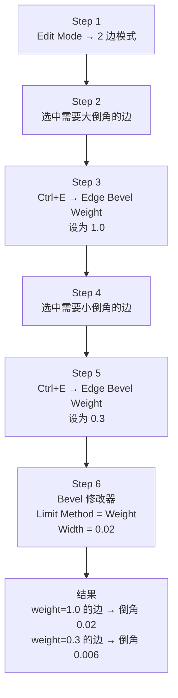

**核心公式**：

```
实际倒角宽度 = Bevel Weight × 修改器的 Width

weight = 1.0  →  宽度 = Width（满值）
weight = 0.5  →  宽度 = Width × 0.5
weight = 0    →  不倒角
```

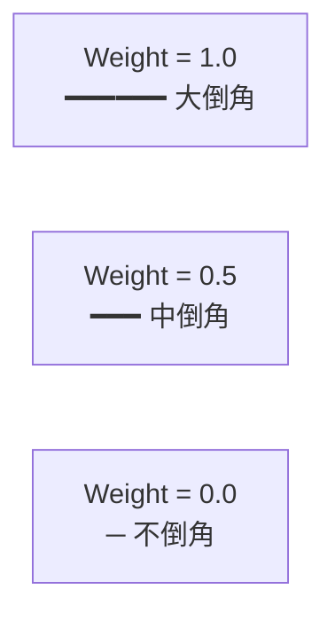

## 怎么设置 Bevel Weight

| 方式 | 操作 |
| ---- | ---- |
| 菜单 | Edit Mode → 边模式 → 选中边 → `Ctrl+E` → **Edge Bevel Weight** → 移动鼠标/输入数值 |
| 搜索 | `F3` → 搜 "Bevel Weight" |
| 批量 | 选中多条边一起设 |
| 快捷 | `Ctrl+E → Mean Bevel Weight`：把选中边的 weight 设为**相邻面的平均值**（快速统一一批边） |

> 如果 `Ctrl+E` 菜单里没找到，直接 **F3 搜索**，Blender 5.x 的菜单名是 `Edge Bevel Weight`。

## 可视化检查

设置完之后你**看不见** weight 是多少，需要开叠加显示：

```
3D Viewport 右上角 Overlays 下拉 → 勾选 "Edge Bevel Weight"
```

开了之后，weight 大的边会**变色/变粗**，方便检查有没有漏设。

---

# 八、Bevel 与 Subdivision 的三种配合策略

你笔记 `基础练习.md` 第 27 节讲了 Loop Cut 与 Subdivision 的关系。倒角是另一条路，两者可以组合。

## 策略 A：纯 Bevel（无 SubD）


- ✅ 面数精确可控
- ✅ 倒角宽度所见即所得
- ❌ 段数少了不够圆，段数多了面数爆炸
- **适合**：低模/风格化游戏资产、移动端

## 策略 B：纯 SubD + 支撑线（无 Bevel）


- ✅ 面数低、形状光滑
- ❌ 硬边控制全靠支撑线，调起来麻烦
- **适合**：有机模型、圆润的产品

## 策略 C：Bevel + SubD ⭐ 硬表面最常用

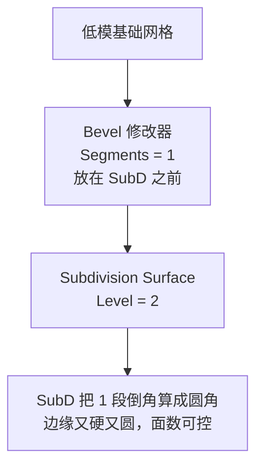

```text
原理（剖面）：

Bevel 1 段后:              SubD 之后:

  ┌────                      ┌───
  │╲                         │ ╲
  │ ╲                  →     │  ╲___
  │  ╲                       │
  └────╲                     └──────
  
  一个斜切面                SubD 把它平滑成圆弧
```

- ✅ **1 段倒角 + SubD = 视觉上的圆角**，但基础网格面数很低
- ✅ 倒角宽度就是"圆角半径"的直观控制
- ✅ 这是现代硬表面工作流的默认做法
- ❌ 修改器顺序不能错：**Bevel 必须在 SubD 之前**

```mermaid
flowchart TD
    OK["Bevel → Subdivision ✅<br/>倒角被平滑成圆角"]
    NG["Subdivision → Bevel ❌<br/>先细分再倒角，面数爆炸且形状失控"]
```

> ⚠️ **顺序错了就是灾难**：SubD 在前会把网格细分 4 倍，再 Bevel 会让面数翻几十倍。

---

# 九、倒角宽度到底该给多少？（现实依据）

这是新手最容易拍脑袋的地方。给你三个锚点：

## 锚点 1：真实世界的加工半径

| 物体 | 典型的边角半径 |
| ---- | -------------- |
| 手机 / 电子产品 | 1–3 mm |
| 家具（桌角、柜门） | 0.5–2 mm |
| 家电外壳 | 1–5 mm |
| 汽车车身钣金 | 3–8 mm |
| 建筑（混凝土、石材） | 5–20 mm |
| 刀具刃口 | 0.05–0.2 mm（几乎尖） |

## 锚点 2：经验比例

```
倒角宽度 ≈ 物体最短边长度 × 0.5% ~ 2%
```

```text
一个 0.6m 高的油桶：
  0.6 × 0.5% = 0.003m = 3mm    → 小倒角（锐利感）
  0.6 × 2%   = 0.012m = 12mm   → 大倒角（厚重感）
```

## 锚点 3：镜头距离（游戏资产的关键）

```mermaid
flowchart TD
    D{"镜头距离"}
    D --> N["近景特写<br/>第一人称手持<br/>→ 2–5mm 倒角，看得见高光"]
    D --> M["中景<br/>第三人称<br/>→ 1–2mm 即可"]
    D --> F["远景<br/>载具/建筑<br/>→ 只需 1 段，靠 Normal 贴图补足"]
```

## 最重要的一条判据

> **倒角的目的是在光照下产生一条高光线，不是让模型"看起来圆"。**

```text
自检方法：
  1. 按 Z → Material Preview
  2. 转动视角，让光扫过边缘
  3. 边缘应该出现一条清晰的细高光

没有高光 → 倒角太小（或 Segments 太少）
高光太宽 → 倒角太大
```

---

# 十、倒角后常见的 6 种问题与排查

| 现象 | 原因 | 解法 |
| ---- | ---- | ---- |
| **① 倒角后一片黑面 / 明暗错乱** | 法线翻转或自相交 | `A` 全选 → `Shift+N` 重算外侧法线；勾选 **Clamp Overlap** |
| **② 倒角面出现奇怪的渐变糊边** | 法线被周围面平滑了 | 勾选 **Harden Normals** |
| **③ 倒角溢出穿模、几何自相交** | 宽度大于相邻面尺寸 | **Clamp Overlap**；或减小 Width；或改用 Weight 限制 |
| **④ 角上炸开、面扭曲** | Miter 处理不了多面交汇 | Miter Type 换 **Arc** 或 **Patch** |
| **⑤ 加了 SubD 后倒角变糊** | 修改器顺序错 / 宽度太小 | Bevel 必须在 SubD **之前**；加大 Width |
| **⑥ 面数突然暴涨** | Segments 太多 | 降到 1–2；改用策略 C（Bevel 1 段 + SubD） |

## 通用排查顺序

```mermaid
flowchart TD
    P1["1 检查修改器顺序<br/>Bevel 在 SubD 之前"]
    P2["2 勾选 Clamp Overlap"]
    P3["3 勾选 Harden Normals"]
    P4["4 Shift+N 重算法线"]
    P5["5 减小 Width 或 Segments"]
    P6["6 换 Miter Type"]
    P1 --> P2 --> P3 --> P4 --> P5 --> P6
```

---

# 十一、完整实战：做一个科幻电源箱

把前面所有参数串起来走一遍。目标：一个 40cm × 30cm × 20cm 的设备箱。

## Step 0：设定真实尺寸

```text
Shift+A → Mesh → Cube
S X 0.4 / S Y 0.3 / S Z 0.2     （物体模式）
Ctrl+A → Scale                    ← 别忘了
```

## Step 1：主体倒角（大倒角）

```mermaid
flowchart TD
    A["Object Mode"] --> B["Add Modifier → Bevel"]
    B --> C["Width = 0.008 (8mm)"]
    C --> D["Segments = 1"]
    D --> E["Limit Method = Angle<br/>Angle = 40°"]
    E --> F["勾选 Clamp Overlap"]
    F --> G["勾选 Harden Normals"]
    G --> H["勾选 Mark Seam"]
```

## Step 2：面板缝隙（小倒角，用 Weight）

```mermaid
flowchart TD
    A["Tab → Edit Mode → 2 边模式"]
    B["选中面板四周的边"]
    C["Ctrl+E → Edge Bevel Weight = 0.25"]
    D["外壳边 weight 保持默认 1.0"]
    A --> B --> C --> D
    E["再加一个 Bevel 修改器<br/>Limit Method = Weight<br/>Width = 0.004"]
    D --> E
```

结果：**两个 Bevel 修改器叠起来，实现两套倒角宽度**。

```mermaid
flowchart LR
    M["Modifier Stack"]
    M --> M1["Bevel #1<br/>Angle 模式<br/>Width 0.008<br/>外壳边缘"]
    M1 --> M2["Bevel #2<br/>Weight 模式<br/>Width 0.004<br/>面板缝隙"]
    M2 --> M3["Subdivision<br/>Level 2"]
```

## Step 3：加 SubD 算圆角

```text
Add Modifier → Subdivision Surface
Levels Viewport = 2
```

因为 Step 1 的 Segments = 1，SubD 会把它平滑成圆角，**面数不会爆炸**。

## Step 4：检查

```text
Z → Material Preview
转动视角，看边缘高光是否清晰
检查面数（右上角 Statistics 或 N 面板）
```

## Step 5：导出前

```text
Ctrl+A → Apply Rotation & Scale
（需要烘焙进网格时）F3 → Convert to Mesh  ← 会把所有修改器一次性应用
```

---

# 十二、Bevel 与其他工具的边界（防混淆对照）

你笔记第 38–40 节讲过 Extrude / Inset / Loop Cut / Bevel 的区别，这里补一张完整的对照表：

| 工具 | 快捷键 | 本质 | 产生新面 | 面数影响 |
| ---- | ------ | ---- | -------- | -------- |
| **Extrude `E`** | `E` | 复制边界并连接 | ✅ 大量 | 中 |
| **Inset `I`** | `I` | 在面内创建嵌套面 | ✅ 少量 | 小 |
| **Loop Cut `Ctrl+R`** | `Ctrl+R` | 插入一圈拓扑，**不改变形状** | ❌ 只切分 | 中 |
| **Bevel `Ctrl+B`** | `Ctrl+B` | 用新面替换尖锐边 | ✅ 沿边生成 | **大** |
| **Bevel 修改器** | — | 同上，但非破坏性 | ✅（视口计算） | 大（应用后） |

```mermaid
flowchart TD
    Q{"我想干什么?"}
    Q --> A["让模型长出来"] --> A1["E Extrude"]
    Q --> B["在面里划一块区域"] --> B1["I Inset"]
    Q --> C["加控制点但不变形状"] --> C1["Ctrl+R Loop Cut"]
    Q --> D["让尖锐边产生过渡"] --> D1["Ctrl+B / Bevel 修改器"]
    Q --> E["让尖锐边变硬（SubD 下）"] --> E1["Ctrl+R 加支撑线"]
```

---

# 十三、Bevel 操作速查

## 破坏性（`Ctrl+B`）

```text
Tab                    进入 Edit Mode
2                      边模式（3 = 面模式，Bevel 也能用）
Ctrl+B                 开始倒角
  移动鼠标              调 Width
  滚轮 ↑                增加 Segments
  P                     （部分版本）切到 Profile 调整
LMB                    确认
F9                     调出上次操作的参数面板
```

## 非破坏性（修改器）

```text
Object Mode
Modifier 面板 → Add Modifier → Bevel
  调 Width / Segments / Profile
  Limit Method → Angle / Weight
  勾 Clamp Overlap / Harden Normals / Mark Seam
```

## Bevel Weight

```text
Edit Mode → 2 边模式 → 选中边
Ctrl+E → Edge Bevel Weight      设置权重
Ctrl+E → Mean Bevel Weight      取相邻面平均值（批量统一）

检查：Overlays → 勾选 Edge Bevel Weight
```

## 通用

```text
F3                      搜命令名（找不到菜单时用）
Shift+N                 重算外侧法线
Alt+N                   法线菜单
Ctrl+A → Scale          应用缩放（Bevel 前必做）
```

---

# 十四、初学者最常犯的 8 个 Bevel 错误

## ① 忘了 Apply Scale

```mermaid
flowchart LR
    A["Object Scale = (1, 5, 1)"] --> B["Ctrl+B"]
    B --> C["倒角在 Y 方向被拉长 5 倍 ❌"]
    D["Ctrl+A → Scale"] --> E["Ctrl+B"] --> F["各方向均匀 ✅"]
```

## ② Segments 给太多

```text
Segments = 8 的 Cube 倒角 → 上百个面
游戏资产完全不需要，2 段 + SubD 效果一样好
```

## ③ 用 Ctrl+B 而不是修改器

改需求时要推倒重来。养成用修改器的习惯。

## ④ 不开 Clamp Overlap

密集细节处倒角必然自相交，出现黑面。

## ⑤ 不开 Harden Normals

倒角面被周围面平滑，看不出倒角效果，白白浪费面数。

## ⑥ 修改器顺序放反

SubD 在 Bevel 之前 = 面数灾难。

## ⑦ 倒角宽度拍脑袋

不参考物体真实尺寸，导致一个 2 米的柜子倒角 10cm（看起来像塑料玩具）。

## ⑧ 用 Bevel 解决所有"边缘不对"

有些问题该用**支撑线**（SubD 下保硬边），有些该用 **Normal 贴图**（远景细节）。
倒角是几何方案，成本高，别滥用。

```mermaid
flowchart TD
    Q{"边缘需要处理"}
    Q --> A{"镜头会近距离看吗?"}
    A -->|"会"| B{"需要真实几何?"}
    B -->|"是"| C["Bevel ✅"]
    B -->|"否"| D["法线贴图"]
    A -->|"不会"| D
    Q --> E{"是 SubD 下要保硬边?"}
    E -->|"是"| F["Ctrl+R 支撑线"]
```

---

# 十五、一张脑内地图收尾

```mermaid
flowchart TD
    BEV["Bevel"]
    BEV --> WHAT["是什么<br/>用新面替换尖锐边"]
    BEV --> HOW["怎么做<br/>Ctrl+B / 修改器"]
    BEV --> PARAM["怎么控制"]
    
    WHAT --> W1["面数约 4 倍起跳"]
    HOW --> H1["Ctrl+B 破坏性"]
    HOW --> H2["修改器 非破坏性 ⭐"]
    
    PARAM --> P1["Width 大小"]
    PARAM --> P2["Segments 段数"]
    PARAM --> P3["Profile 胖瘦"]
    PARAM --> P4["Limit Method 哪些边"]
    PARAM --> P5["Clamp Overlap 防炸"]
    PARAM --> P6["Harden Normals 法线"]
    PARAM --> P7["Bevel Weight 分级宽度 ⭐"]
    
    H2 --> COMBO["Bevel(1段) + SubD<br/>硬表面默认组合"]
    COMBO --> RESULT["低面数 + 圆润边缘 + 清晰高光"]
```

**三句话记住**：

| | |
| --- | --- |
| `Ctrl+B` | 快速试造型，一次性 |
| Bevel 修改器 | 正式资产，能调能改，支持 Weight |
| Bevel Weight | 一个修改器搞定多种宽度，硬表面的分水岭 |

---

# 十六、练手：把这 5 个动作各做 3 遍

| # | 练习 | 检验点 |
| - | ---- | ------ |
| 1 | Cube 全边 Bevel，Segments 从 1 调到 5，记录面数变化 | 建立面数直觉 |
| 2 | 固定 Segments=2，把 Profile 从 0 拖到 1，观察剖面变化 | 理解 Profile |
| 3 | 做一个带凹槽的方块，对比 `Limit Method = None` vs `Angle` | 理解 Angle 限制 |
| 4 | 同一个模型，用 Bevel Weight 给不同边设 1.0 / 0.5 / 0.2 | 掌握 Weight |
| 5 | Bevel(1段) + SubD(2) 做一个圆角方块，对比纯 Bevel(3段) | 理解策略 C |

做完这 5 个，Bevel 就从"会按快捷键"变成"能控制结果"了。

---

> **下一步**：Bevel 之后最该接着学的是 **UV 缝合边与展开**——因为倒角边天然就是 UV 的切分位置（还记得修改器里的 `Mark Seam` 吗）。对应 `Blender学习路线图.md` 的 Stage 3。
