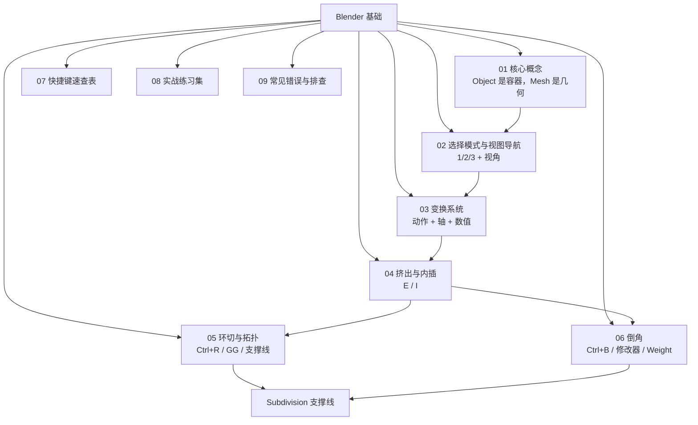

# 00 · 基础（已完成 → 已重组）

路线图定位：Object/Edit 模式、四大工具（E / I / Ctrl+R / Ctrl+B）、快捷键体系**已通**。
对应路线图：[../../Blender学习路线图.md](../../Blender学习路线图.md)

> 本目录的 5 篇原始笔记已按**知识点**重新拆分合并为下面 9 篇，原文保留在 `_原始笔记/`（可对照追溯）。

---

## 一、知识点地图

学习顺序建议：`01 → 02 → 03 → 04 → 05 → 06`，`07` 当工具书随时查，`08` 边学边做，`09` 卡住时翻。

---

## 二、文件清单

| # | 文件 | 覆盖知识点 | 由哪些原文合并而来 |
| - | ---- | ---------- | ------------------ |
| 01 | [核心概念-Object与Mesh](01-核心概念-Object与Mesh.md) | 数据结构、两种模式职责、Scale 陷阱、`Ctrl+A`、Join/Separate、Delete vs Dissolve、破坏性 vs 非破坏性 | 对象模式与编辑模式（全文）+ 基础练习 1–11 + Bevel 1/4 |
| 02 | [选择模式与视图导航](02-选择模式与视图导航.md) | 1/2/3 选择模式、选择工具、MMB/NumPad 导航、Local View、隐藏、Shading、UI、Mac 注意 | 基础练习 2–11 + 快捷键 2/3/4/19–23 + 环切 27 |
| 03 | [变换系统 G/R/S](03-变换系统-G-R-S.md) | 动作+轴+数值语法、精细/吸附、全局轴 vs 局部轴、Apply 菜单、Proportional | 快捷键 6/7/8/18/35/36 + 对象模式 4–6/29 |
| 04 | [挤出与内插 E/I](04-挤出与内插-E-I.md) | Extrude 本质与变体、Inset 本质、Inset+Extrude 组合、E/I/Ctrl+R 对照、四种造型意图 | 基础练习 12–20/38–40/46–48 + 快捷键 10/11 |
| 05 | [环切与拓扑 Ctrl+R](05-环切与拓扑-Ctrl+R.md) | 两次左键语义、右键居中、数量与方向、Loop vs Ring、Quad/Tri/N-Gon、Edge Slide `G G`、支撑线与 SubD、与 K/Subdivide 区别 | 环切详解（全文）+ 基础练习 21–27 + Bevel 8 |
| 06 | [倒角 Bevel](06-倒角-Bevel.md) | 面数代价、剖面、`Ctrl+B` vs 修改器、15 个参数、Bevel Weight、宽度三锚点、SubD 三种策略、6 种问题排查 | Bevel倒角详解（全文）+ 基础练习 28–36/45/46 + 对象模式 23 + 快捷键 13 |
| 07 | [快捷键速查表](07-快捷键速查表.md) | 按场景分类的全量快捷键 + 背诵顺序 | 快捷键（全文，去重重排） |
| 08 | [实战练习集](08-实战练习集.md) | 房子 / 门 / 箱子 / 桌腿 / 科幻电源箱 / 圆角方块 + LoopCut 5 用法 + Bevel 5 动作 | 对象模式 26 + 基础练习 41–45/50 + 环切 29/31 + Bevel 11/16 |
| 09 | [常见错误与排查](09-常见错误与排查.md) | 模式/变换、拓扑、Bevel 专项、对象管理、Mac，去重后的坑 + 排查流程图 | 基础练习 49 + Bevel 10/14 + 对象模式 29 + 快捷键 38 |

---

## 三、重组时消除了哪些重复

| 重复知识点 | 原文出现处 | 现在 |
| ---------- | ---------- | ---- |
| 为什么必须 `Ctrl+A → Scale` | 对象模式 29、基础练习 ③、Bevel ① | 统一在 `03` 讲原理，`09-A3` 留一条坑 |
| Object/Mesh 与两种模式 | 对象模式（全文）、基础练习 2–11 | 集中在 `01` |
| 1/2/3 选择模式 | 对象模式 11、基础练习 2–11、快捷键 4/9 | 集中在 `02` |
| Extrude / Inset 基础 | 基础练习 12–20、快捷键 10/11、对象模式 21 | 集中在 `04` |
| Bevel 基础（Width vs Segments） | 基础练习 28–36、Bevel 详解 1–3 | 合并进 `06`，基础练习只保留其独有的 ASCII 示意 |
| 工具边界对照（E/I/Ctrl+R/Ctrl+B） | 基础练习 38–40、Bevel 12 | 分别并入 `04`（E/I）与 `06`（全表） |
| 常见错误清单 | 基础练习 49、Bevel 14 | 去重合并为 `09` |
| 练习项目（门/箱子/桌腿/电源箱） | 分散在 4 篇 | 统一在 `08` |

---

## 四、基础阶段的遗留动作

- [ ] Blender 版本锁定 **5.2.2 LTS**，macOS 开 `Emulate Numpad`
- [ ] 确认视图导航（Orbit / Pan / Zoom）顺手；触控板用户建议三键鼠标
- [ ] 勾插件：Node Wrangler / LoopTools / Bool Tool / F2 / Auto Mirror / Extra Objects / Import Images as Planes
- [ ] 做完 `08` 里的**练习 6（环切 5 用法）**和**练习 8（圆角方块）**，即 Stage 0 正式开工

## 五、原文归档

`_原始笔记/`：`对象模式与编辑模式.md`、`基础练习.md`、`环切详解.md`、`Blender快捷键.md`、`Bevel倒角详解.md`。
