这部分是 Blender 多边形建模最核心的一组知识。你可以把它理解成：

> **Vertex / Edge / Face 决定“你正在编辑什么”；Extrude / Inset / Loop Cut / Bevel 决定“你如何改变 Mesh”。**

我按一个完整的建模逻辑来讲，而不是单纯罗列快捷键。

---

# 一、先建立整体认知

一个 Mesh 最基本由三种元素组成：

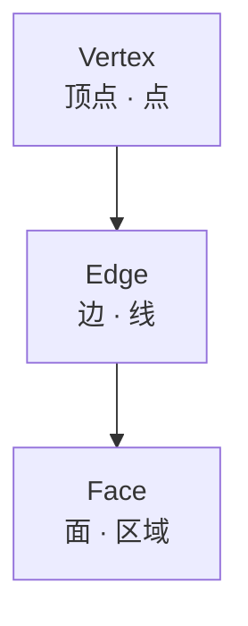

三者关系：3 个 Vertex 围成 1 个三角 Face：

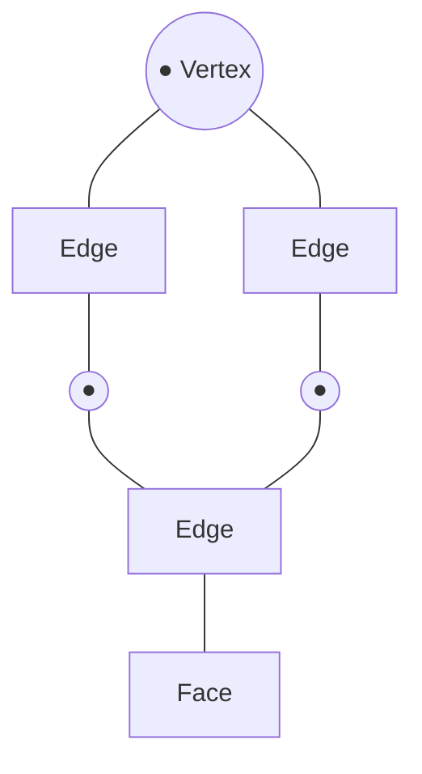

可以把它理解成：

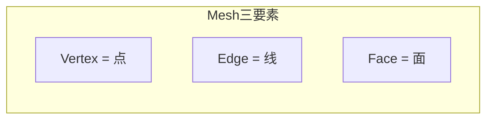

然后四个核心建模工具：

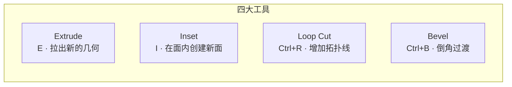

> 这四个工具实际上已经可以完成大量传统硬表面建模。

---

# 二、Vertex / Edge / Face 三种选择模式

进入流程：

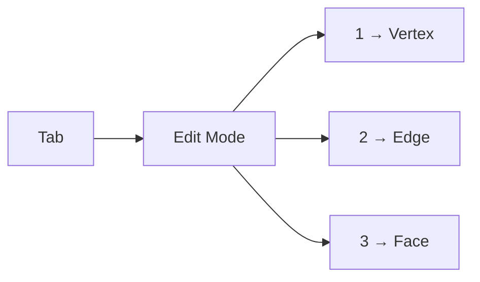

> 注意：这里的 `1/2/3` 是键盘上方的数字键，不是 NumPad。

---

# 三、Vertex Select：顶点模式

快捷键：`1` 进入 Vertex Select。

你看到的是顶点 `●`。

例如 Cube（几何示意，Mermaid 无法表达 3D 空间形状，保留 ASCII）：

```text
       ●──────●
      /│     /│
     ●──────● │
     │ │    │ │
     │ ●────│─●
     │/     │/
     ●──────●
```

选择一个顶点后按 `G` 就可以移动它。


---

# 四、Vertex 模式最适合干什么？

主要用于：

### 1. 改变轮廓

例如（几何示意）：

```text
原来：

●────────●
│        │
│        │
●────────●
```

移动一个顶点：

```text
●────────●
 \       │
  \      │
   ●─────●
```


直接改变模型轮廓。

---

### 2. 做有机形状

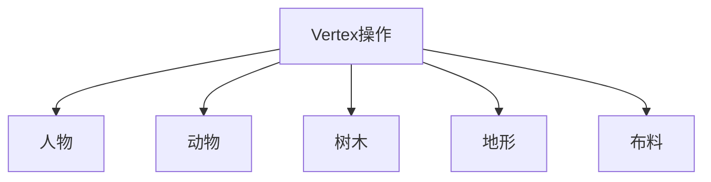

Vertex 操作非常重要。

---

### 3. 修复拓扑

比如两个顶点 `●       ●`，可以按 `M` Merge。


---

# 五、Vertex 模式常用操作

| 快捷键 | 作用 |
| ------ | ---- |
| `G` | 移动 |
| `R` | 旋转 |
| `S` | 缩放 |
| `G X / G Y / G Z` | 沿 X / Y / Z 方向移动 |
| `M` | Merge 合并 |
| `V` | Rip 撕裂 |
| `X` | Delete 删除 |

其中 `M` 非常重要：


---

# 六、Edge Select：边模式

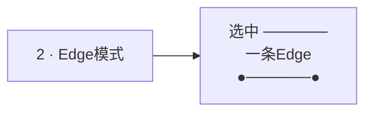

现在选择的是中间这条 Edge。

---

# 七、Edge 模式最适合干什么？

Edge 是传统建模中非常重要的元素。

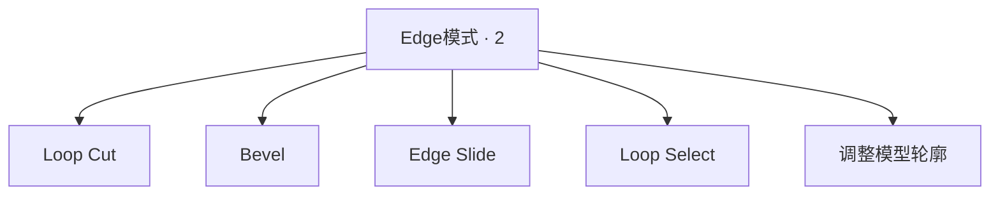

---

# 八、Edge Loop 是什么？

这是 Blender 建模必须理解的概念。

几何示意（保留 ASCII，直观展示“一圈线”）：

```text
┌──────────┐
│          │
│          │
│          │
└──────────┘
```

中间增加一圈：

```text
┌──────────┐
│          │
├──────────┤
│          │
└──────────┘
```

这一圈连续的 Edge 就是 `Edge Loop`：

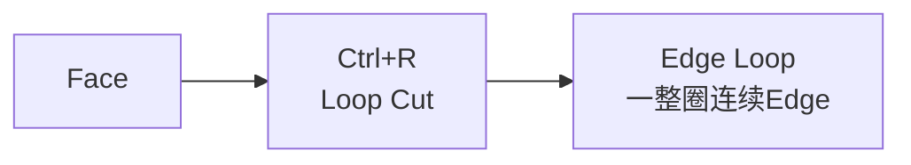

---

# 九、Face Select：面模式

快捷键 `3`，现在选择的是一个 Face（几何示意）：

```text
┌────────┐
│        │
│  Face  │
│        │
└────────┘
```

Face 最适合的操作：

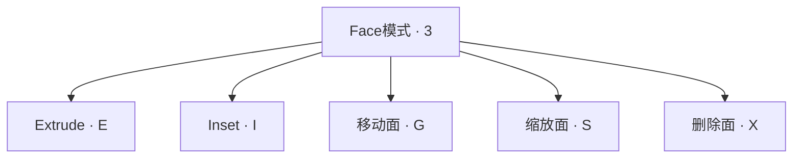

---

# 十、三种模式应该怎么选择？

| 模式 | 主要作用 |
| ---- | -------- |
| Vertex | 改轮廓、改点 |
| Edge | 控制拓扑、Loop、Bevel |
| Face | 建立/移动大块几何 |

一个非常实用的理解：


---

# 十一、三种选择模式并不是孤立的

例如一个 Face（几何示意）：

```text
┌────────┐
│        │
│        │
└────────┘
```

实际上它包含 `4 Vertices + 4 Edges + 1 Face`：

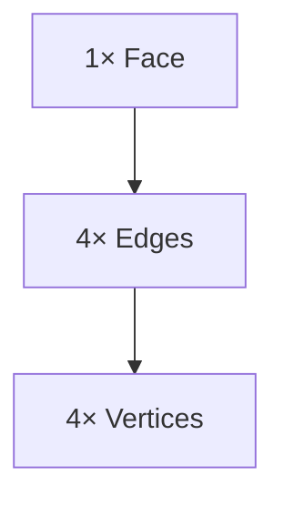

所以 `Face → Edges → Vertices`，它们是相互关联的。

---

# 十二、Extrude：挤出

这是 Blender 最重要的建模操作之一。


通常在 Face Select 模式下使用。

---

# 十三、最简单的 Extrude

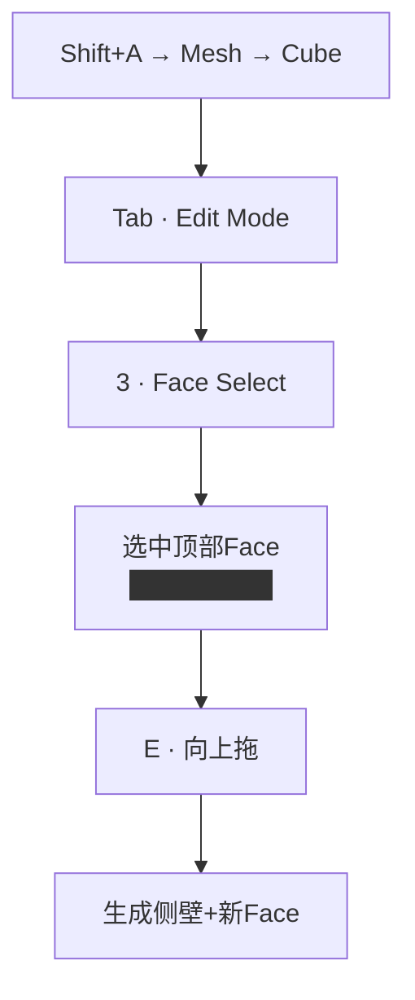

结果（几何示意，3D 拉伸保留 ASCII）：

```text
      ┌────────┐
     /        /│
    /────────/ │
    │        │ │
    │        │ │
    │        │ /
    └────────┘/
```

你实际上创建了：

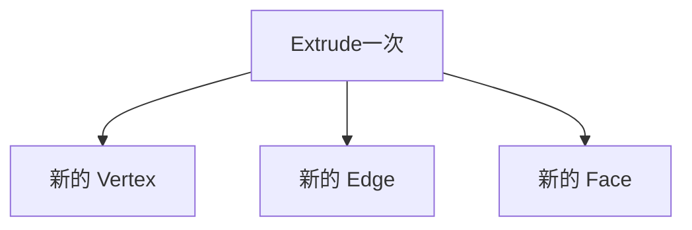

---

# 十四、Extrude 的本质

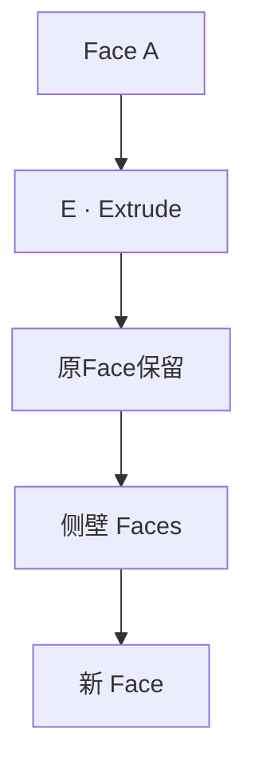

所以 Extrude 不是简单：

> “移动一个面”。

而是：

> **复制选中的几何边界，并在旧几何与新几何之间建立连接。**

这是非常重要的区别。

```mermaid
flowchart LR
    G["G · Move<br/>移动现有几何"] 
    E["E · Extrude<br/>创建新几何并连接"]
```

---

# 十五、Extrude Individual Faces

假设有三个 Face `A | B | C`（几何示意）：

```text
┌───┬───┬───┐
│ A │ B │ C │
└───┴───┴───┘
```

如果选择三个面后直接按 `E`，通常会作为一个连续区域挤出。

而使用 `Alt+E` 可以打开 Extrude 菜单，其中 `Extrude Individual Faces` 可以让每个 Face 独立挤出（几何示意）：

```text
┌───┐ ┌───┐ ┌───┐
│ ↑ │ │ ↑ │ │ ↑ │
└───┘ └───┘ └───┘
```

```mermaid
flowchart TD
    S["选中3个Face"] --> K{"挤出方式"}
    K -->|E| A["整体挤出<br/>连续区域"]
    K -->|Alt+E → Individual| B["独立挤出<br/>A↑ B↑ C↑"]
```

> 这个在建筑、机械、细节建模里非常实用。

---

# 十六、Extrude Along Normals

```mermaid
flowchart LR
    A["Alt+E"] --> B["Extrude Faces Along Normals<br/>每个Face沿自己法线挤出"]
```

意思是：

> 每个 Face 沿着自己的法线方向挤出。

例如三角体（几何示意，不同朝向的面沿各自法线走，保留 ASCII）：

```text
   /\
  /  \
 /____\
```

不同方向的面会沿自己的法线移动。

---

# 十七、Inset：内插面

快捷键 `I`。Inset 和 Extrude 很容易混淆。

```mermaid
flowchart TD
    EXT["Extrude · E<br/>向外/向内拉出几何"]
    INS["Inset · I<br/>在当前Face内部创建新Face"]
```

---

# 十八、最简单的 Inset

Cube 顶面（几何示意）：

```text
┌──────────┐
│          │
│          │
│          │
└──────────┘
```

选择 Face（`3`）然后按 `I` 缩小：

```text
┌──────────┐
│  ┌────┐  │
│  │    │  │
│  └────┘  │
└──────────┘
```

你得到了：

```mermaid
flowchart TD
    IN["I · Inset"] --> O["外部 Face"]
    IN --> I["内部 Face"]
    IN --> R["中间环形区域<br/>新Edge Loop"]
```

---

# 十九、Inset 的本质

原来的 Face，变成嵌套双框（几何示意）：

```text
┌──────────────┐
│              │
│   ┌──────┐   │
│   │      │   │
│   └──────┘   │
│              │
└──────────────┘
```

也就是：

```mermaid
flowchart TD
    A["原 Face"] --> B["创建内部 Face"]
    B --> C["产生新的 Edge Loop"]
```

---

# 二十、Inset + Extrude 是黄金组合

这两个操作组合起来特别强。例如做一个窗户：

```mermaid
flowchart TD
    S1["Step1 · 3 选中墙面Face"]
    S2["Step2 · I Inset<br/>得到内外双框"]
    S3["Step3 · 选中内部Face"]
    S4["Step4 · E 向内挤<br/>形成凹槽"]
    S1 --> S2 --> S3 --> S4
```

几何示意（嵌套关系保留 ASCII）：

```text
┌──────────────┐
│              │
│   ┌──────┐   │
│   │      │   │
│   └──────┘   │
│              │
└──────────────┘
```

现在已经形成一个凹槽。这就是非常典型的 `Inset → Extrude` 建模流程。

---

# 二十一、Loop Cut：环切

```mermaid
flowchart LR
    K["Ctrl+R"] --> F["Loop Cut<br/>增加拓扑结构"]
```

> **增加拓扑结构。**

---

# 二十二、最简单的 Loop Cut

```mermaid
flowchart TD
    A["Cube面"] --> B["Ctrl+R<br/>出现预览线"]
    B --> C["LMB 确认"]
    C --> D["得到新Edge Loop"]
```

几何示意（保留 ASCII）：

```text
┌────────┐     ┌────────┐     ┌────┬───┐
│        │  →  │   │    │  →  │    │   │
│        │     │   │    │     │    │   │
└────────┘     └────────┘     └────┴───┘
```

---

# 二十三、Loop Cut 的真正意义

很多初学者以为：

> Loop Cut 是“切一刀”。

其实更准确：

> **Loop Cut 是在现有拓扑中插入一整圈连续 Edge Loop。**

例如（拓扑示意）：

```mermaid
flowchart TD
    subgraph Before["原来"]
        A1["A"] --- B1["B"]
        A1 --- C1["C"]
        B1 --- D1["D"]
        C1 --- D1["D"]
    end
    subgraph After["Loop Cut后"]
        A2["A"] --- B2["B"]
        A2 --- C2["C"]
        B2 --- D2["D"]
        C2 --- D2["D"]
        M1["◉"] --- M2["◉"]
        M1 --- A2
        M1 --- C2
        M2 --- B2
        M2 --- D2
    end
    Before --> After
```

几何对照（保留 ASCII）：

```text
A────────B      A────────B
│        │  →  │        │
│        │     ├────────┤
C────────D      C────────D
```

这样你就拥有了更多控制点。

---

# 二十四、为什么需要 Loop Cut？

例如一块大平面（几何示意）：

```text
┌────────────┐
│            │
│            │
│            │
└────────────┘
```

你想让中间鼓起来。没有 Loop Cut 就没有足够的顶点：

```mermaid
flowchart TD
    A["大Face<br/>无足够顶点"] --> B["Ctrl+R<br/>加Loop"]
    B --> C["选中中间Edge/Face"]
    C --> D["G / S / E<br/>鼓起/拉伸"]
```

加线后（几何示意）：

```text
┌────────────┐
│            │
├────────────┤
│            │
└────────────┘
```

现在就可以进行 `G / S / E` 等操作。

---

# 二十五、Loop Cut + Slide

```mermaid
flowchart TD
    A["Ctrl+R 预览"] --> B["LMB 确认<br/>先不要右键"]
    B --> C["移动鼠标<br/>Edge Loop Slide"]
    C --> D["精确定位Loop"]
```

几何示意（Loop 上下滑动，保留 ASCII）：

```text
┌────────────┐     ┌────────────┐
│            │  →  │ ────────── │
├────────────┤     │            │
│            │     │            │
└────────────┘     └────────────┘
```

> **Edge Loop Slide**：可以让 Loop 在两个 Edge 之间滑动，可以精确控制 Loop 的位置。

---

# 二十六、一次添加多个 Loop Cut

```mermaid
flowchart LR
    A["Ctrl+R"] --> B["Wheel ↑<br/>增加Cuts数量"] --> C["LMB 确认"]
    B --> D["1 Cut → 3 Cuts"]
```

这是非常高频的操作。

---

# 二十七、Loop Cut 和 Subdivision 的关系

这点非常重要。

```mermaid
flowchart TD
    subgraph 无Loop["无额外拓扑"]
        A1["Cube"] --> B1["Subdivision Surface"] --> C1["很圆"]
    end
    subgraph 有Loop["靠近边缘加Loop"]
        A2["Cube"] --> B2["Ctrl+R 靠边加线<br/>││&nbsp;&nbsp;&nbsp;&nbsp;&nbsp;&nbsp;││"] --> C2["Subdivision"] --> D2["边缘更硬"]
    end
```

几何对照（保留 ASCII）：

```text
无Loop：  Cube → Subdivision → 很圆
有Loop：  ┌────────────┐
          ││          ││
          ││          ││ → Subdivision → 边缘硬
          └────────────┘
```

所以：

> **Loop Cut 经常用于控制 Subdivision 后的形状。**

---

# 二十八、Bevel：倒角

```mermaid
flowchart LR
    K["Ctrl+B"] --> F["Bevel<br/>把尖锐边变成有宽度的过渡面"]
```

---

# 二十九、为什么要 Bevel？

现实世界几乎没有无限尖锐的边。

```mermaid
flowchart LR
    A["理想Cube<br/>┌──┐ 尖锐边"] --> B["Ctrl+B Bevel"] --> C["现实物体<br/>╭──╮ 圆润边"]
```

几何对照（保留 ASCII）：

```text
理想 Cube：       现实物体：

┌──────┐          ╭──────╮
│      │          │      │
└──────┘          ╰──────╯
```

这个圆润的边缘就是 Bevel。

---

# 三十、最简单的 Bevel

```mermaid
flowchart TD
    A["Tab · Edit Mode"] --> B["2 · Edge Select"]
    B --> C["选中一条Edge<br/>────────"]
    C --> D["Ctrl+B + 移动鼠标"]
    D --> E["────── → ──╲╱──<br/>创建新的过渡面"]
```

原来 `──────`，变成 `──╲╱──`，实际上创建了新的面。

---

# 三十一、Bevel Segments

```mermaid
flowchart LR
    A["Ctrl+B"] --> B["Wheel ↑"] --> C["Segments ↑<br/>越来越圆"]
```

例如（切面轮廓示意，保留 ASCII）：

| Segments | 轮廓 | 说明 |
| -------- | ---- | ---- |
| 1 | `╲` | 单斜面 |
| 2 | `╲╱` | 双段折线 |
| 多 | `╭──╮` | 接近圆弧 |

最终看起来越来越圆。

---

# 三十二、Bevel Width

Bevel 最核心参数之一：`Width`。

```mermaid
flowchart TD
    W["Width<br/>倒角有多宽"] --> S["小Width → 窄过渡"]
    W --> L["大Width → 宽过渡<br/>╭────╮"]
```

几何对照（保留 ASCII）：

```text
小 Width：        大 Width：

┌──────┐          ╭────────╮
╲      ╲          │        │
                     ╰────────╯
```

Width 越大：

> 倒角区域越宽。

---

# 三十三、Bevel Segments 与 Width 的区别

非常重要：

| 参数 | 含义 |
| ---- | ---- |
| `Width` | 倒角有多宽 |
| `Segments` | 倒角有多圆 |

```mermaid
flowchart TD
    subgraph SameWidth["同Width = 0.1"]
        A["Segments = 1<br/>╲ 尖锐斜面"]
        B["Segments = 6<br/>╭─╮ 圆润"]
    end
```

Width 不变，但圆润程度增加。

---

# 三十四、Bevel 选择整个模型的边

```mermaid
flowchart TD
    A["2 · Edge模式"] --> B["A · 全选Edge"]
    B --> C["Ctrl+B"]
    C --> D["Wheel ↑ 加Segments"]
    D --> E["圆角 Cube"]
```

这是最经典的 Blender 入门练习之一。

---

# 三十五、Vertex Bevel

Bevel 不仅能倒 Edge，也可以在 Vertex Select 模式下选择 Vertex，然后按 `Ctrl+Shift+B`，这是 **Vertex Bevel**。

```mermaid
flowchart LR
    A["Vertex模式<br/>选中 ●"] --> B["Ctrl+Shift+B"] --> C["切掉角<br/>╱╲<br/>●&nbsp;&nbsp;●"]
```

几何示意（保留 ASCII）：

```text
  ●     →     ╱╲
             ●  ●
              ╲╱
```

可以用于切掉角、制造多边形角、硬表面造型。

---

# 三十六、Edge Bevel 与 Vertex Bevel

| 操作 | 快捷键 | 作用 |
| ---- | ------ | ---- |
| Edge Bevel | `Ctrl+B` | 给边倒角 |
| Vertex Bevel | `Ctrl+Shift+B` | 给顶点倒角 |

```mermaid
flowchart TD
    CB["Ctrl+B"] --> E["Edge"]
    CSB["Ctrl+Shift+B"] --> V["Vertex"]
```

---

# 三十七、四个工具放在一起理解

这是整个建模体系最重要的一张图：

```mermaid
flowchart TD
    MESH["Mesh"]
    V["Vertex"]
    E["Edge"]
    F["Face"]
    MESH --> V
    MESH --> E
    MESH --> F
    V --> VB["Vertex Bevel<br/>Ctrl+Shift+B"]
    E --> EB["Bevel<br/>Ctrl+B"]
    E --> LC["Loop Cut<br/>Ctrl+R"]
    F --> EXT["Extrude<br/>E"]
    F --> INS["Inset<br/>I"]
```

---

# 三十八、Extrude vs Inset

非常容易搞混。

## Extrude

```mermaid
flowchart TD
    A["Face"] --> B["E · 向外/向内拉"] --> C["产生新的几何"]
```

几何示意（纵向拉长，保留 ASCII）：

```text
┌──────┐
│      │
└──────┘
     ↓ E

┌──────┐
│      │
│      │
│      │
└──────┘
```

---

## Inset

```mermaid
flowchart TD
    A["Face"] --> B["I · 向内部缩小"] --> C["创建新的Face"]
```

几何示意（嵌套，保留 ASCII）：

```text
┌────────┐
│ ┌────┐ │
│ │    │ │
│ └────┘ │
└────────┘
```

---

# 三十九、Loop Cut vs Inset

这两个也容易混淆。

### Loop Cut（`Ctrl+R`）

> **整个 Mesh 拓扑中插入连续 Edge Loop。**

几何示意（横切一圈，保留 ASCII）：

```text
┌────────┐
│        │
├────────┤
│        │
└────────┘
```

### Inset（`I`）

> **一个 Face 内部创建一个新的 Face。**

几何示意（面内嵌套，保留 ASCII）：

```text
┌────────┐
│ ┌────┐ │
│ │    │ │
│ └────┘ │
└────────┘
```

对比总结：

```mermaid
flowchart LR
    subgraph 对比
        LC["Loop Cut<br/>切一圈<br/>整圈拓扑"]
        IN["Inset<br/>面里再造面<br/>单个Face内部"]
    end
```

---

# 四十、Bevel vs Inset

这两个也经常一起使用。

```mermaid
flowchart TD
    IN["Inset · I<br/>创建边界<br/>┌─┐嵌套"] --> BEV["Bevel · Ctrl+B<br/>创建过渡面<br/>╲╱斜面"]
```

- Inset 主要是创建边界（几何示意）：

```text
┌──────────┐
│  ┌────┐  │
│  │    │  │
│  └────┘  │
└──────────┘
```

- Bevel 主要是创建过渡面（几何示意）：

```text
┌──────────┐
╲          ╱
 ╲        ╱
```

---

# 四十一、实际建模案例：做一个门

我们用这几个工具完成。初始为 `Cube`。

## Step 1：缩放

Object Mode 下：`S X 2`，`S Z 3`，得到门形（几何示意）：

```text
┌──────┐
│      │
│      │
│      │
│      │
└──────┘
```

然后 `Ctrl+A → Scale` 应用缩放。

```mermaid
flowchart TD
    A["Cube"] --> B["S X 2<br/>S Z 3"] --> C["门形比例"] --> D["Ctrl+A → Scale<br/>应用缩放"]
```

---

# 四十二、Step 2：Edit Mode

```mermaid
flowchart LR
    A["Tab<br/>Edit Mode"] --> B["3<br/>Face Select"] --> C["选中正面"]
```

---

# 四十三、Step 3：Inset

按 `I` 得到（几何示意）：

```text
┌──────────────┐
│              │
│   ┌──────┐   │
│   │      │   │
│   │      │   │
│   └──────┘   │
└──────────────┘
```

```mermaid
flowchart LR
    A["选中门面"] --> B["I · Inset"] --> C["内外双框"]
```

---

# 四十四、Step 4：Extrude

选择内部 Face，按 `E` 向内移动，门的凹槽已经出来了（几何示意同上，为凹陷而非平面嵌套）：

```text
┌──────────────┐
│              │
│   ┌──────┐   │
│   │      │   │  ← 向内挤入
│   │      │   │
│   └──────┘   │
│              │
└──────────────┘
```

```mermaid
flowchart LR
    A["选中内部Face"] --> B["E · 向内挤"] --> C["门凹槽"]
```

---

# 四十五、Step 5：Bevel

```mermaid
flowchart TD
    A["2 · Edge模式"] --> B["选中门框Edge"]
    B --> C["Ctrl+B"]
    C --> D["2~4 Segments"]
    D --> E["门框圆润高光"]
```

门框就会有圆润的高光。

门案例总览：

```mermaid
flowchart TD
    CUBE["Cube"] --> SC["S X 2 / S Z 3<br/>+ Ctrl+A"]
    SC --> TAB["Tab + 3<br/>选中正面"]
    TAB --> IN["I · Inset"]
    IN --> EX["E · 向内Extrude"]
    EX --> BV["2 + Ctrl+B<br/>门框Bevel"]
```

---

# 四十六、为什么游戏模型特别喜欢 Bevel？

因为真实世界光线会在边缘产生高光。

```mermaid
flowchart TD
    A["Edge<br/>无限尖锐边"] --> B["Ctrl+B<br/>小过渡面"]
    B --> C["光线产生高光"]
    C --> D["模型更有真实感"]
```

- 如果完全没有 Bevel：`无限尖锐边`，光线表现往往比较“CG”。
- 加 Bevel 后即使很小，也可能明显改善视觉效果。

---

# 四十七、一个非常重要的硬表面建模公式

以后做机械、武器、家具、建筑、汽车、科幻模型、游戏道具，经常会看到：

```mermaid
flowchart TD
    I["Inset<br/>I"] --> E["Extrude<br/>E"]
    E --> L["Loop Cut<br/>Ctrl+R"]
    L --> B["Bevel<br/>Ctrl+B"]
```

例如完整流程：

```mermaid
flowchart TD
    A["基础 Cube"] --> B["Ctrl+R<br/>增加控制线"]
    B --> C["I<br/>创建边界"]
    C --> D["E<br/>凹槽/凸起"]
    D --> E["Ctrl+B<br/>边缘高光"]
```

---

# 四十八、这四个工具对应四种“造型思想”

这是我非常建议你记住的：

```mermaid
flowchart TD
    subgraph 造型思想
        EXT["Extrude<br/>我要让模型长出来"]
        INS["Inset<br/>我要划一个区域"]
        LOO["Loop Cut<br/>我要增加控制点"]
        BEV["Bevel<br/>我要让尖锐边过渡"]
    end
```

- **Extrude**：我要让模型长出来。

```mermaid
flowchart LR
    A["Face"] --> B["伸出去"]
```

- **Inset**：我要在这个面里面划一个区域。

```mermaid
flowchart LR
    A["Face"] --> B["内部边界"]
```

- **Loop Cut**：我要增加控制点。

```mermaid
flowchart LR
    A["Topology"] --> B["更多 Edge"]
```

- **Bevel**：我要让尖锐边产生过渡。

```mermaid
flowchart LR
    A["Sharp Edge"] --> B["Rounded/Chamfered Edge"]
```

---

# 四十九、初学者最容易犯的 8 个错误

## ① 没有确认当前模式

在 `Object Mode` 下按 `E` 当然不对，先按 `Tab` 进入 Edit Mode。

```mermaid
flowchart TD
    A["Object Mode + E<br/>❌ 无效"] --> B["Tab → Edit Mode"] --> C["E · ✅ 正确"]
```

---

## ② 选择错了模式

想移动一个面应该用 `3`（Face），而不是 `1`（Vertex）。

```mermaid
flowchart LR
    W["想移动面"] --> R["3 Face ✅"]
    W --> X["1 Vertex ❌"]
```

---

## ③ 没有 Apply Scale

尤其是 `Bevel` 可能出现比例异常。

建议：`Object Mode → Ctrl+A → Scale`。

```mermaid
flowchart LR
    A["Object Mode"] --> B["Ctrl+A"] --> C["Scale<br/>Bevel比例正常"]
```

---

## ④ 把 Extrude 当 Move

```mermaid
flowchart TD
    G["G · Move<br/>移动现有几何"]
    E["E · Extrude<br/>创建新几何并连接"]
```

这是本质区别。

---

## ⑤ 把 Inset 当 Loop Cut

```mermaid
flowchart TD
    I["I · Inset<br/>Face内部"]
    L["Ctrl+R · Loop Cut<br/>整圈拓扑"]
```

---

## ⑥ Bevel 太大

初学者经常 `Ctrl+B` 然后倒角特别夸张。实际硬表面模型中 Bevel 通常应该根据物体尺寸、镜头距离和材质来决定。

```mermaid
flowchart LR
    A["Ctrl+B"] --> B{"Width多大?"}
    B -->|过大 ❌| C["变形夸张"]
    B -->|适度 ✅| D["按尺寸/镜头/材质决定"]
```

---

## ⑦ Loop Cut 加错位置

Loop Cut 的位置会直接影响 Subdivision、模型轮廓、硬边。不要随意增加拓扑。

```mermaid
flowchart TD
    L["Loop Cut位置"] --> S["Subdivision效果"]
    L --> O["模型轮廓"]
    L --> H["硬边"]
```

---

## ⑧ 不理解“拓扑”

不要认为 `Polygon 越多 = 模型越好`，更重要的是 `Topology`，即 Vertex、Edge、Face 之间的组织方式。

```mermaid
flowchart TD
    T["Topology<br/>组织方式"] --> V["Vertex"]
    T --> E["Edge"]
    T --> F["Face"]
    T --> Q["质量 ✅<br/>而非单纯多边形数量"]
```

---

# 五十、建议你现在练习这个模型

不要直接去做复杂人物，先做一个游戏箱子，只使用：`G / R / S / 1 / 2 / 3 / E / I / Ctrl+R / Ctrl+B`。

完整过程：

```mermaid
flowchart TD
    A["Cube"] --> B["Ctrl+A → Scale"]
    B --> C["Tab · Edit"]
    C --> D["3 · Face"]
    D --> E["I · Inset"]
    E --> F["E · Extrude"]
    F --> G["Ctrl+R · Loop"]
    G --> H["2 · Edge"]
    H --> I["Ctrl+B · Bevel"]
    I --> J["Z → Material Preview<br/>观察边缘高光"]
```

最后按 `Z → Material Preview` 观察边缘高光。

---

# 五十一、最后建立一张“脑内地图”

```mermaid
flowchart TD
    EDIT["Edit Mode"]
    V["Vertex"]
    E["Edge"]
    F["Face"]
    EDIT --> V
    EDIT --> E
    EDIT --> F
    V --> VB["Vertex Bevel<br/>Ctrl+Shift+B"]
    E --> EB["Ctrl+B<br/>Bevel"]
    E --> LC["Ctrl+R<br/>Loop Cut"]
    F --> EX["E / I<br/>Extrude / Inset"]
```

然后记住：

```mermaid
flowchart TD
    subgraph 脑内地图
        V["Vertex → 改点"]
        E["Edge → 改线<br/>Loop Cut / Bevel"]
        F["Face → 改面<br/>Extrude / Inset"]
    end
```

最后把四个核心操作浓缩成：

| 快捷键 | 一句话 |
| ------ | ------ |
| `E` | 长出来 |
| `I` | 面里面再划一个面 |
| `Ctrl+R` | 增加一圈控制线 |
| `Ctrl+B` | 给边倒角 |

```mermaid
flowchart LR
    E["E<br/>长出来"]
    I["I<br/>面中画面"]
    R["Ctrl+R<br/>加控制线"]
    B["Ctrl+B<br/>倒角"]
```

