可以。理解 Blender 的 **Object Mode（对象模式）** 和 **Edit Mode（编辑模式）**，实际上就是理解 Blender 建模体系的核心。

最重要的一句话：

> **Object Mode 决定“这个物体怎么存在、怎么摆放”；Edit Mode 决定“这个物体长什么样”。**

例如一个 Cube：

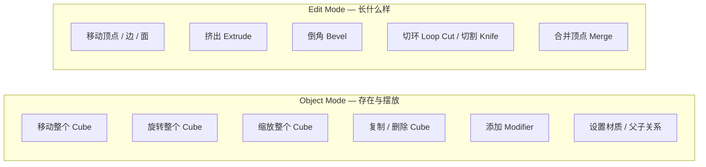

下面从底层结构开始详细讲。

---

# 一、先理解 Blender 的数据结构

一个 Blender 模型不要简单理解成“一个东西”。

实际上可以粗略理解成：

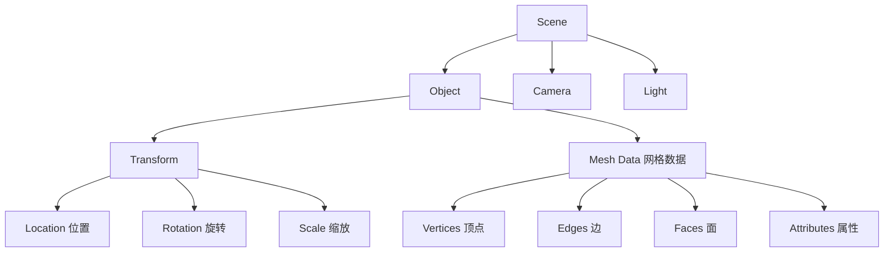

这里最重要的是：

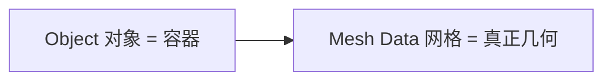

**Object 和 Mesh 不是同一个东西。**

---

# 二、Object Mode 到底是什么？

进入 Blender 默认场景：

```text
Cube
Camera
Light
```

此时默认就是：

```text
Object Mode
```

右上角可以看到：

```text
Object Mode
```

快捷键：

```text
Tab
```

可以在：

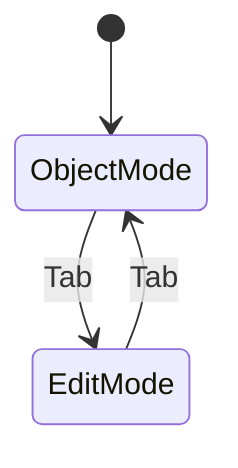

之间切换。

---

# 三、Object Mode：操作的是“对象”

假设场景中有：

```text
       Cube
        ↓
   ┌────────┐
   │        │
   │        │
   └────────┘
```

Object Mode 下选中 Cube：

```text
G
```

你移动的是：

```text
整个 Cube
```

而不是 Cube 里面的顶点。

---

# 四、Object Mode 的 Transform

Object Mode 最核心的就是：

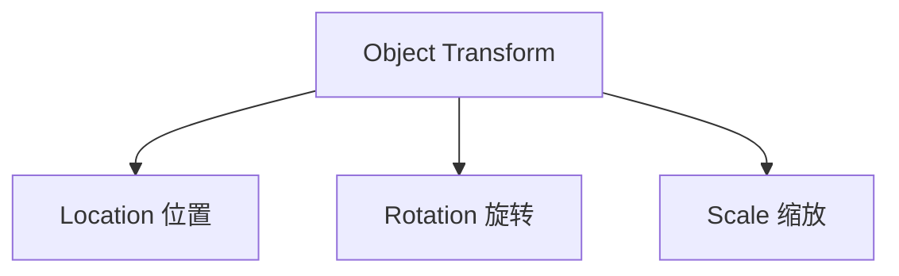

---

## 1. Location

例如：

```text
G X 5
```

Cube：

```text
X = 0
```

变成：

```text
X = 5
```

你实际上修改的是：

```text
Object.location
```

而不是 Mesh 顶点坐标。

---

# 五、Object Mode 的 Scale

假设 Cube 原来：

```text
Dimensions
2 × 2 × 2
```

执行：

```text
S 2
```

视觉上变成：

```text
4 × 4 × 4
```

但是这里有一个非常重要的概念：

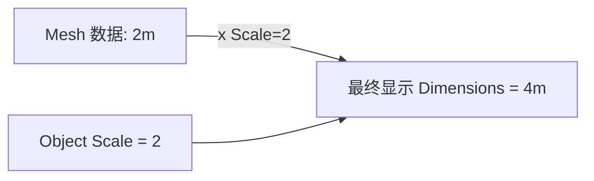

所以你可能看到：

```text
Dimensions = 4m
Scale = 2
```

这意味着：

> Mesh 本身仍然是 2m 的几何体，只是 Object 被缩放了 2 倍。

---

# 六、为什么 Ctrl + A 很重要？

假设：

```text
Cube
Scale = 2
```

执行：

```text
Ctrl + A
→ Scale
```

现在：

```text
Scale = 1
```

但是 Cube 看起来仍然是：

```text
4 × 4 × 4
```

发生了什么？

Blender 把：

```text
Object Scale
```

“烘焙”到了：

```text
Mesh Data
```

所以：

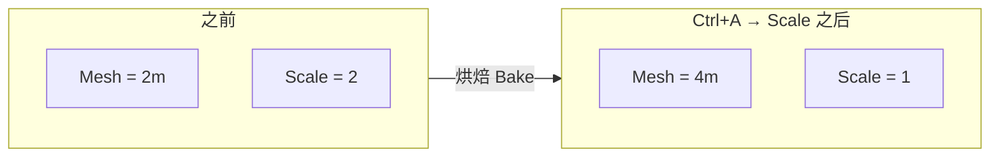

这是 Blender 建模中非常重要的概念。

---

# 七、Edit Mode 到底是什么？

按：

```text
Tab
```

进入：

```text
Edit Mode
```

这时候你不再主要操作 Object Transform。

而是在修改：

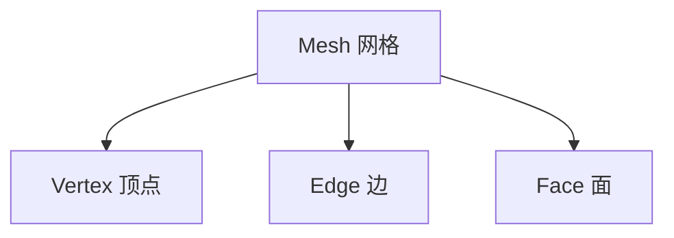

---

# 八、Mesh 的三个基本元素

一个 Mesh 最基本由：

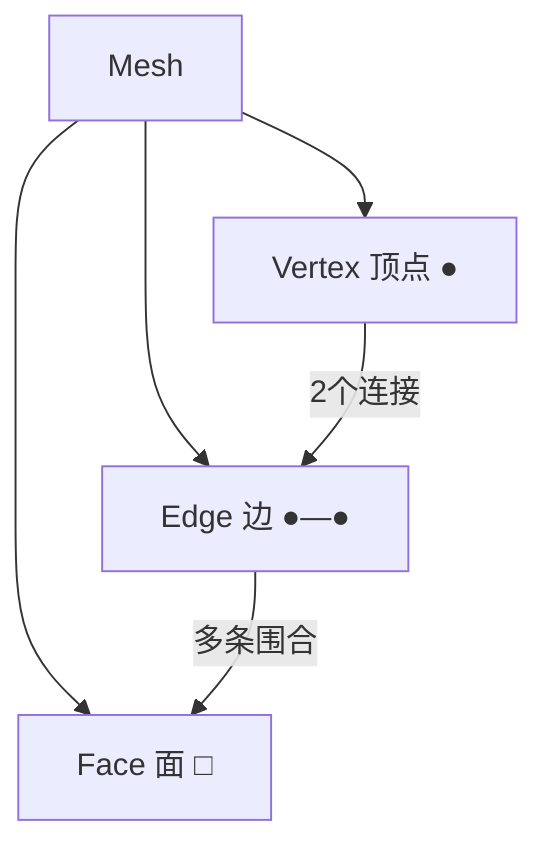

> 注：下面的 `●──●` 立方体线框、`┌──┐` 方框保留为 `text`，因为 Mermaid 无法直观表达 3D 体素示意，ASCII 更清晰。

---

## Vertex

顶点：

```text
●
```

一个立方体：

```text
       ●──────●
      /│     /│
     ●──────● │
     │ │    │ │
     │ ●────│─●
     │/     │/
     ●──────●
```

Cube 有：

```text
8 Vertices
```

---

# 九、Edge

两个 Vertex 连接起来：

```text
●────────●
```

就是 Edge。

Cube：

```text
12 Edges
```

---

# 十、Face

多个 Edge 围成一个面：

```text
┌────────┐
│        │
│        │
└────────┘
```

Cube：

```text
6 Faces
```

所以一个默认 Cube：

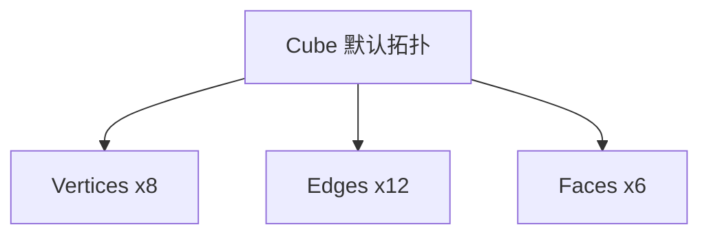
```text
8 Vertices / 12 Edges / 6 Faces
```

---

# 十一、Edit Mode 的三个选择模式

进入 Edit Mode 后：

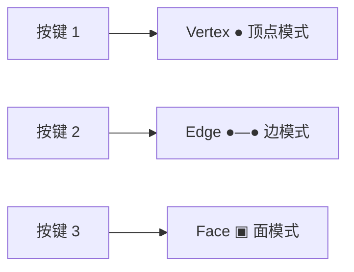

所以：

```text
1
```

你操作：

```text
●
```

---

```text
2
```

你操作：

```text
●────●
```

---

```text
3
```

你操作：

```text
┌────┐
│    │
└────┘
```

这是 Blender 建模最重要的基础。

---

# 十二、Object Mode vs Edit Mode

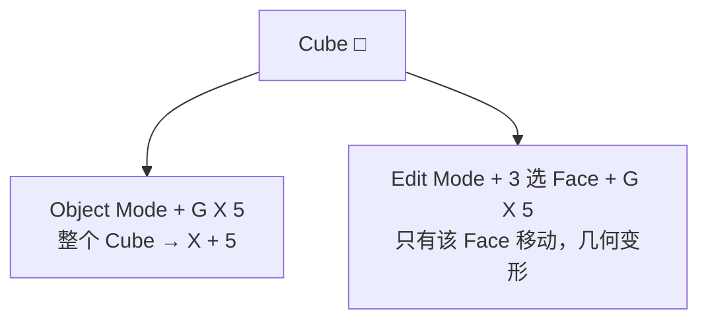

---

Edit Mode：

```text
3
```

选择一个 Face：

```text
┌───────┐
│███████│
└───────┘
```

然后：

```text
G X 5
```

结果：

```text
只有这个 Face 移动
```

Cube 的几何结构发生改变。

---

# 十三、这是两种模式最大的区别

可以这样记：

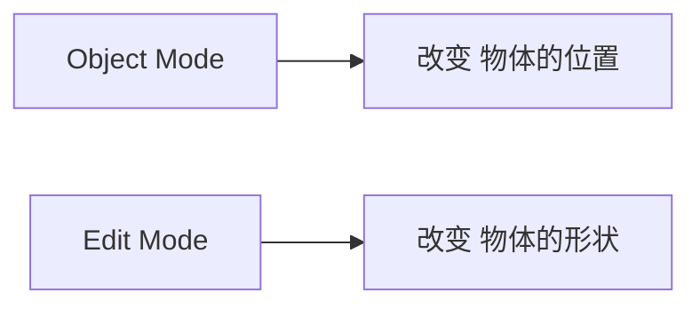

更准确一点：

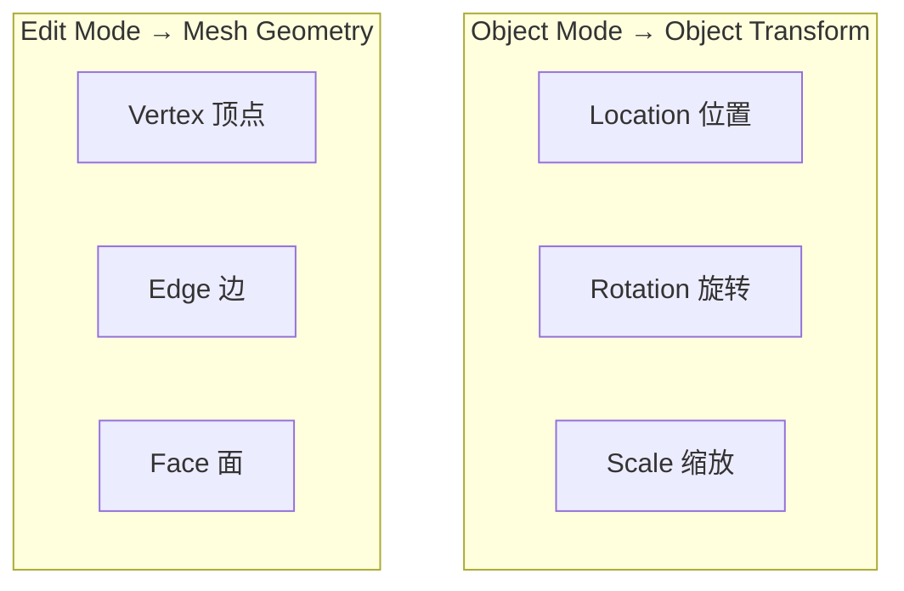

---

# 十四、一个非常重要的例子

创建 Cube：

```text
Shift + A
→ Mesh
→ Cube
```

进入 Edit：

```text
Tab
```

选择一个顶面：

```text
3
```

然后：

```text
E
```

向上拉：

```text
      ┌──────┐
     /      /│
    /──────/ │
    │      │ │
    │      │ /
    └──────┘/
```

你已经把 Cube 变成了：

```text
房子 / 柱子 / 建筑结构
```

注意：

**你没有创建第二个 Object。**

仍然只有：

```text
1 Object
```

但是 Mesh 发生变化。

---

# 十五、Object Mode 和 Edit Mode 的一个巨大区别

假设：

```text
Cube Object
```

你在 Object Mode：

```text
Shift + D
```

会产生：

```text
Cube A
Cube B
```

也就是：

```text
2 Objects
```

---

但是如果你在 Edit Mode：

```text
Shift + D
```

复制的是：

```text
Mesh Geometry
```

而不是 Object。

例如：

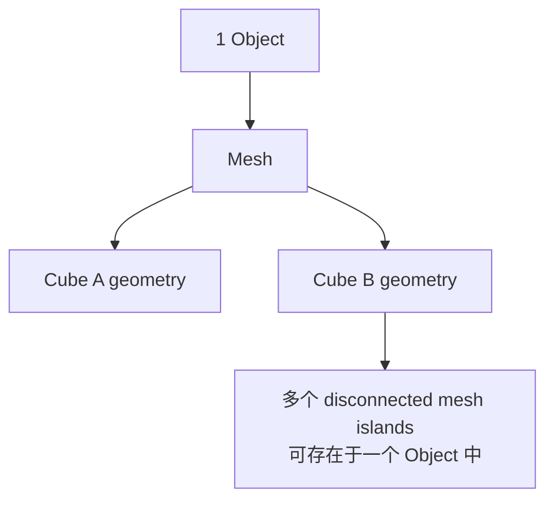

最终可能仍然是：

```text
1 Object
```

里面包含两个不相连的 Mesh。

这就是：

> **多个 disconnected mesh islands 可以存在于一个 Object 中。**

---

# 十六、这也解释了 P：Separate

Edit Mode 中：

```text
P
```

可以：

```text
Selection
By Material
By Loose Parts
```

例如：

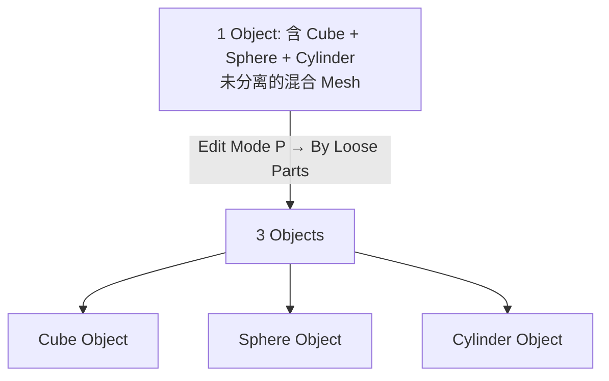

---

# 十七、Ctrl + J 与 P 正好相反

Object Mode：

```text
Ctrl + J
```

Join。

例如：

```text
Cube
Sphere
Cylinder
```

三个 Object：

```text
Object A
Object B
Object C
```

执行：

```text
Ctrl + J
```

变成：

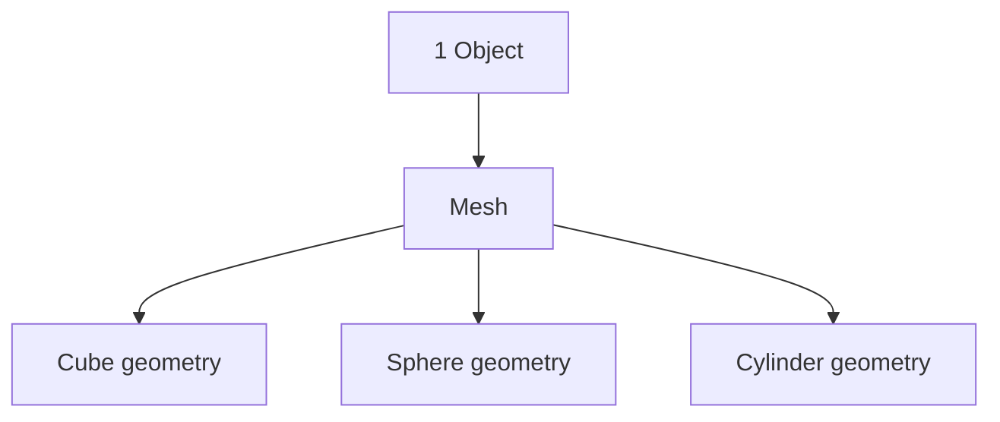

所以：

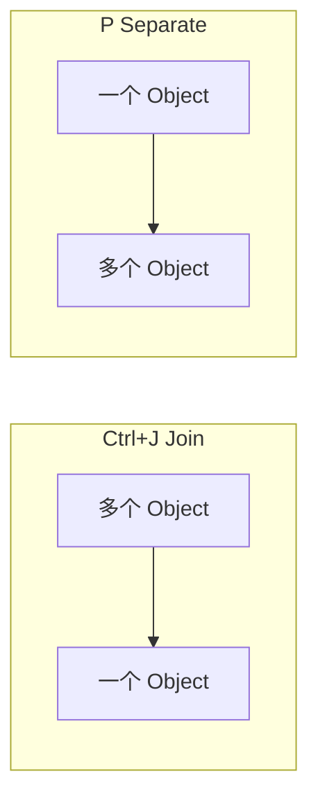

---

# 十八、Object Mode 中的 Delete

Object Mode：

```text
X
```

删除：

```text
整个 Object
```

例如：

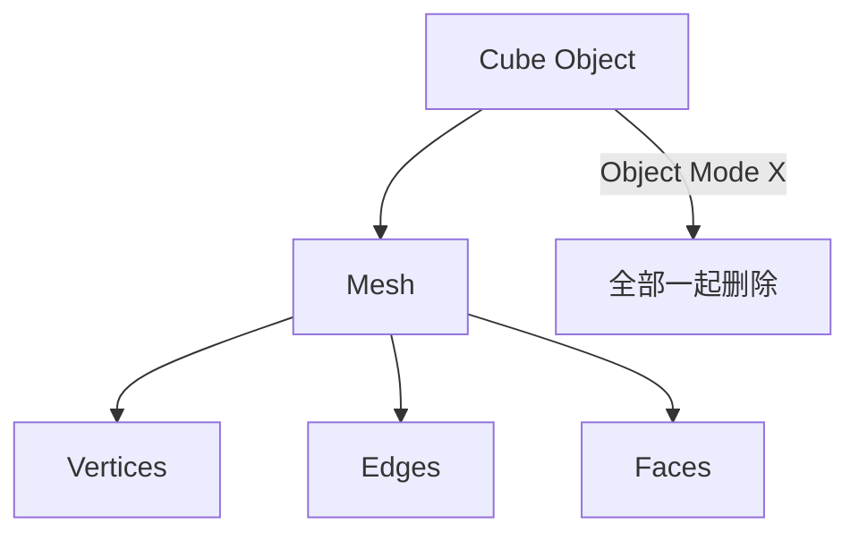

---

# 十九、Edit Mode 中的 Delete

Edit Mode：

```text
X
```

会出现：

```text
Vertices
Edges
Faces
Only Faces
Dissolve
...
```

例如选择：

```text
Face
```

然后：

```text
X
→ Faces
```

只删除：

```text
Face
```

但是：

```text
Object
```

还存在。

---

# 二十、Delete 和 Dissolve 不一样

这是 Edit Mode 非常重要的知识。`●──●──●` 这类一维拓扑示意保留为 `text`，因为 Mermaid 直线表达不如 ASCII 直观：

```text
●────●────●
```

如果直接删除中间 Vertex：

```text
X
→ Vertices
```

可能导致连接结构被删除。

而：

```text
Dissolve
```

的目标是：

> 删除拓扑元素，但尽量保持周围几何形状。

例如：

```text
●────●────●
```

Dissolve 中间点：

```text
●────────●
```

而不是简单破坏模型。

---

# 二十一、Extrude 为什么属于 Edit Mode？

因为：

```text
E
```

是在修改：

```text
Mesh
```

例如：

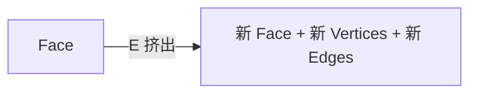

所以 Extrude 本质上是：

> **创建新的几何拓扑。**

---

# 二十二、Loop Cut 为什么属于 Edit Mode？

```text
Ctrl + R
```

本质是在 Edge 之间创建新的拓扑：

```mermaid
flowchart TD
    Edge["Edge"] -->|Ctrl+R Loop Cut| New["Vertices + Edges + Faces"]
    New --> Mesh["必须修改 Mesh Data → 只能在 Edit Mode"]
```

---

# 二十三、Bevel 的 Object Mode / Edit Mode 区别

这是实际工作中特别重要的地方。

## Edit Mode Bevel

```text
Tab
Ctrl + B
```

你直接修改 Mesh：

```mermaid
flowchart LR
    Sharp["原来的锐角"] --> AddGeo["增加几何"] --> Bevel["倒角 Destructive"]
```

---

## Object Mode Modifier

你也可以：

```text
Object Mode → Modifier → Bevel
```

这时候：

```mermaid
flowchart LR
    Orig["原始 Mesh"] --> Mod["Bevel Modifier"] --> Final["最终显示结果<br/>原始 Mesh 未被破坏 Non-Destructive"]
```

原始 Mesh 并没有直接被破坏。

这就是：

> **Destructive vs Non-Destructive**

的重要区别。

---

# 二十四、Edit Mode 更偏“建模”

例如：

```text
E
I
Ctrl + R
Ctrl + B
K
M
P
```

都是典型：

```text
Mesh Editing
```

---

# 二十五、Object Mode 更偏“场景管理”

例如：

```text
G
R
S
Shift + D
Ctrl + J
Ctrl + P
F2
M
Ctrl + A
```

更多是在处理：

```text
Object
```

以及：

```text
Scene
```

---

# 二十六、一个完整建模流程

例如我要做一个简单的房子。

```mermaid
flowchart TD
    S1["Step1 Object: Shift+A → Mesh → Cube"]
    S2["Step2 Object: S X 3 / S Y 2 / S Z 1<br/>房屋主体比例"]
    S3["Step3 Object: Ctrl+A → Scale<br/>Scale=1,1,1 尺寸不变"]
    S4["Step4 Tab → Edit Mode"]
    S5["Step5 Ctrl+R Loop Cut"]
    S6["Step6 按3 选顶部 Face"]
    S7["Step7 E Z 向上挤出"]
    S8["Step8 S 缩小顶部 → 屋顶"]
    S1 --> S2 --> S3 --> S4 --> S5 --> S6 --> S7 --> S8
```

> 房体 ` /────\ ` ASCII 屋形示意保留原文 `text`，Mermaid 不适合画建筑透视。

---

## Step 1：创建 Cube

Object Mode：

```text
Shift + A
→ Mesh
→ Cube
```

---

## Step 2：调整整体尺寸

Object Mode：

```text
S X 3
S Y 2
S Z 1
```

得到房屋主体比例。

---

## Step 3：Apply Scale

```text
Ctrl + A
→ Scale
```

这一步非常重要。

现在：

```text
Scale = 1,1,1
```

但模型尺寸不变。

---

## Step 4：Edit Mode

```text
Tab
```

---

## Step 5：添加 Loop Cut

```text
Ctrl + R
```

---

## Step 6：选择顶部 Face

```text
3
```

---

## Step 7：Extrude

```text
E
Z
```

向上挤出。

---

## Step 8：继续修改顶部

例如：

```text
S
```

缩小顶部。

最终得到类似：

```text
      /────\
     /      \
    /────────\
    │        │
    │        │
    │        │
    └────────┘
```

整个过程中：

```mermaid
flowchart LR
    OM["Object Mode"] --> OC["控制房屋 Object"]
    EM["Edit Mode"] --> EC["控制房屋 Mesh"]
```

---

# 二十七、为什么不能一直在 Object Mode 建模？

当然可以用 Modifier、Sculpt 等方式，但传统 Polygon Modeling 的核心工作通常是：

```mermaid
flowchart TD
    O1["Object Mode: 确定 Object → Apply Transform"]
    E1["Edit Mode: 修改 Mesh → V / E / F"]
    O2["Object Mode: Modifier / Material / Transform / Parent / Collection"]
    E2["Edit Mode: 继续修改 Mesh"]
    O1 --> E1 --> O2 --> E2 --> O1
```

两个模式不断切换。

---

# 二十八、一个非常重要的思维模型

你可以把：

```text
Object
```

想象成：

> **一个“容器”**

而：

```text
Mesh
```

是：

> **容器里面真正的几何数据**

例如：

```mermaid
flowchart TD
    House["Object: House 容器"] --> Loc["Location"]
    House --> Rot["Rotation"]
    House --> Scl["Scale"]
    House --> Mesh["Mesh 真正几何"]
    Mesh --> V["Vertices"]
    Mesh --> E["Edges"]
    Mesh --> F["Faces"]
```

Object Mode：

```text
移动 House
```

Edit Mode：

```text
修改 House 的 Mesh
```

---

# 二十九、最容易犯的错误：Object Mode 缩放后直接建模

比如：

```text
Cube
```

执行：

```text
S X 10
```

现在：

```text
Scale X = 10
```

然后进入 Edit Mode：

```text
Tab
```

再：

```text
Ctrl + B
```

可能发现 Bevel 行为非常奇怪。

原因之一就是：

```text
Object Scale ≠ 1
```

所以硬表面建模经常建议：

```mermaid
flowchart TD
    A["调整 Object 尺寸"] --> B["Ctrl+A → Apply Scale"]
    B --> C["进入 Edit Mode"]
    C --> D["Bevel / Extrude / Loop Cut"]
```

---

# 三十、Object Mode 和 Edit Mode 的快捷键总结

## Object Mode

```text
G       Move Object
R       Rotate Object
S       Scale Object

Shift+D Duplicate Object
Alt+D   Linked Duplicate

Ctrl+A  Apply Transform
Ctrl+J  Join Objects

Ctrl+P  Parent
Alt+P   Clear Parent

F2      Rename
M       Collection
X       Delete
```

---

## Edit Mode

```text
Tab     进入/退出

1       Vertex
2       Edge
3       Face

G       Move Geometry
R       Rotate Geometry
S       Scale Geometry

E       Extrude
I       Inset
Ctrl+R  Loop Cut
Ctrl+B  Bevel
K       Knife

F       Fill
J       Connect
M       Merge
V       Rip
P       Separate
O       Proportional Editing

X       Delete
U       UV Mapping
```

---

# 三十一、最终记住这张图

```mermaid
flowchart TD
    B["Blender Object"] --> OD["Object Data"]
    B --> MD["Mesh Data"]
    OD --> Loc["Location"]
    OD --> Rot["Rotation"]
    OD --> Scl["Scale"]
    MD --> V["Vertex"]
    MD --> E["Edge"]
    MD --> F["Face"]
```

因此：

```mermaid
flowchart TD
    OM["Object Mode"] --> G1["G 移动 Object"]
    OM --> R1["R 旋转 Object"]
    OM --> S1["S 缩放 Object"]
    OM --> A["Ctrl+A Apply"]
    OM --> J["Ctrl+J 合并 Object"]
    OM --> P1["Ctrl+P Parent"]
```

而：

```mermaid
flowchart TD
    EM["Edit Mode"] --> SEL["1 Vertex / 2 Edge / 3 Face"]
    SEL --> G2["G/R/S 移动/旋转/缩放 Geometry"]
    G2 --> OPS["E Extrude / I Inset / Ctrl+R Loop Cut / Ctrl+B Bevel / K Knife / P Separate"]
```

**最关键的区别就是：**

> **Object Mode = “我要操作哪个物体，以及它在场景中的位置/姿态/尺寸”。**
>
> **Edit Mode = “我要改变这个物体内部的 Mesh 拓扑和形状”。**

如果你接下来要学 Blender 建模，建议下一步重点掌握 **Vertex / Edge / Face 三种选择模式 + Extrude / Inset / Loop Cut / Bevel**。这 7 个概念掌握后，Blender 的传统多边形建模基本就真正入门了。
