# Blender Loop Cut（Ctrl + R）详细讲解

**Loop Cut（环切）**是 Blender 建模中最核心的拓扑工具之一。它的本质是：

> **在现有网格的连续 Edge Loop 上插入一圈新的拓扑边。**

快捷键：

> **`Ctrl + R`**

它主要用于：

* 增加模型细分程度
* 控制模型形状
* 为后续 Extrude / Bevel / Inset 提供拓扑
* 控制 Subdivision Surface 的形状
* 制作硬表面模型的支撑线
* 精确调整模型局部比例

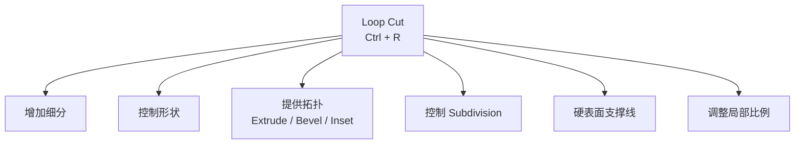

---

# 一、先理解 Loop Cut 到底在做什么

假设我们有一个 Cube，每个面都是一个 Quad：


实际上 Blender 做的就是一次面切分：

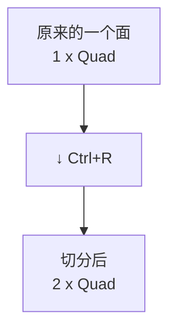

但对于 Cube 来说，它不是只切一个面，而是沿着**整个连续的拓扑环**切过去：

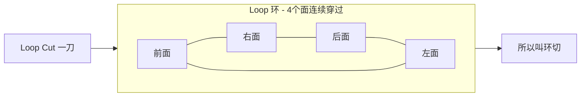

所以叫：

> **Loop Cut = 环切**

---

# 二、使用 Loop Cut 的前提

Loop Cut 主要工作在：

> **Edit Mode（编辑模式）**

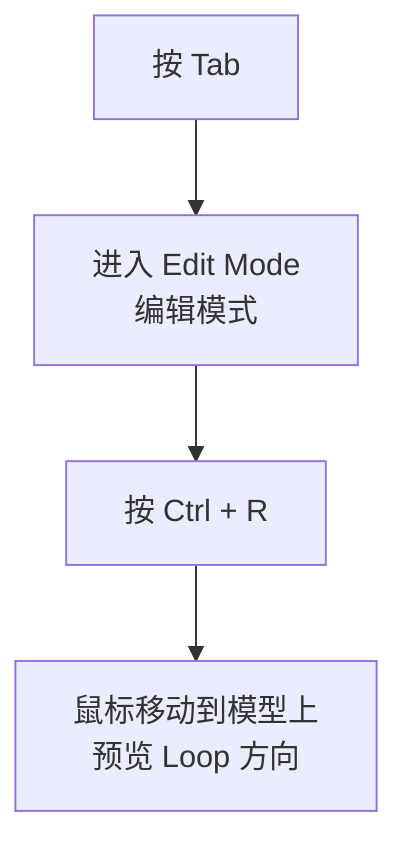

---

# 三、最基本的 Ctrl + R 操作

这是最应该熟练掌握的一套流程。

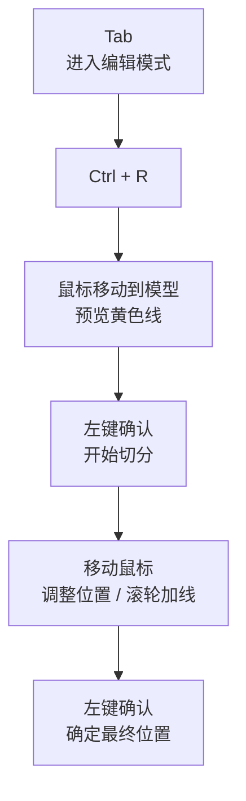

也可以直接居中：

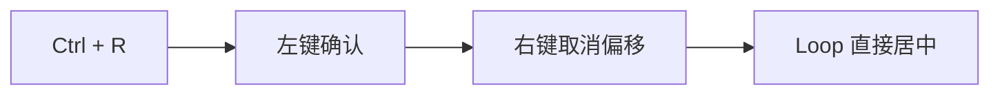

> 这样可以让 Loop Cut **直接居中**。

---

# 四、第一次左键到底做什么？

这是很多初学者容易混淆的地方。

执行 `Ctrl + R`，Blender 会先显示一个**预览线**（黄色预览线）。

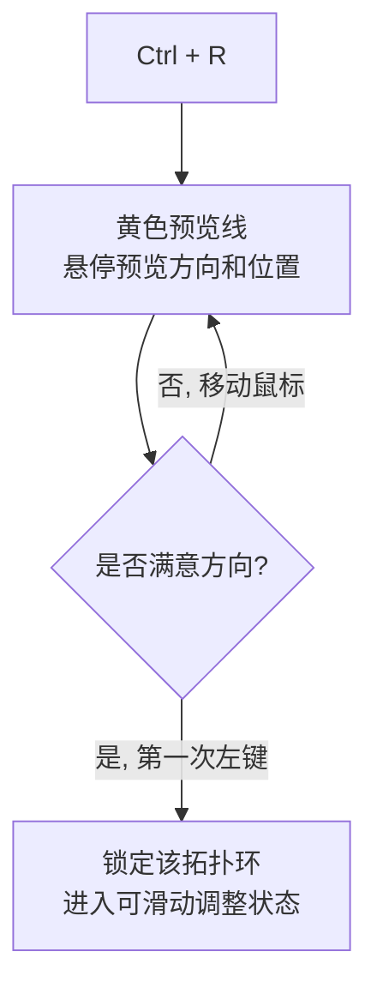

此时：

> **还没有真正确定 Loop Cut 的位置。**

第一次 `Left Click` 相当于：

> **确定开始进行 Loop Cut。**

然后 Blender 会让你继续移动鼠标，决定 `Loop Cut 在哪里？`

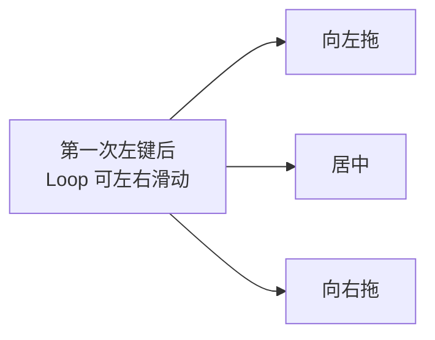

---

# 五、第二次左键做什么？

第二次 `Left Click` 表示：

> **确定 Loop Cut 的最终位置。**


---

# 六、为什么右键可以居中？

这是非常重要的快捷操作。

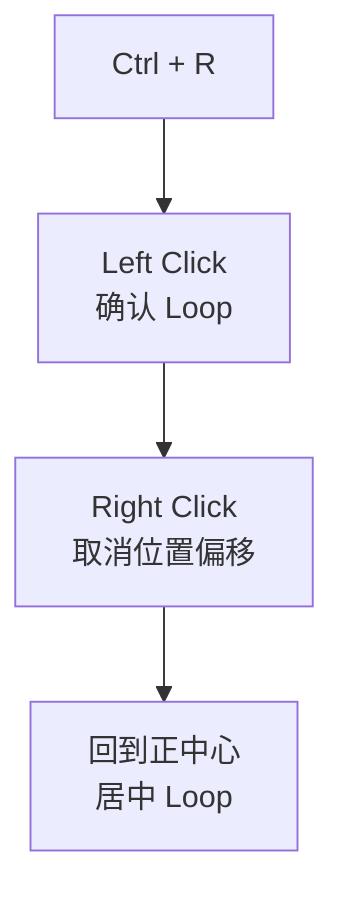

也就是：

> **第一次左键确认 Loop Cut，右键取消位置偏移，让它回到中心。**

所以 `Ctrl + R → 左键 → 右键` 可以理解成：

> **快速在正中央增加一条 Loop。**

---

# 七、滚轮：一次增加多条 Loop Cut

这是 `Ctrl + R` 最重要的技巧之一。执行 `Ctrl + R` 后滚动 `Scroll Wheel` 可以增加切割数量。

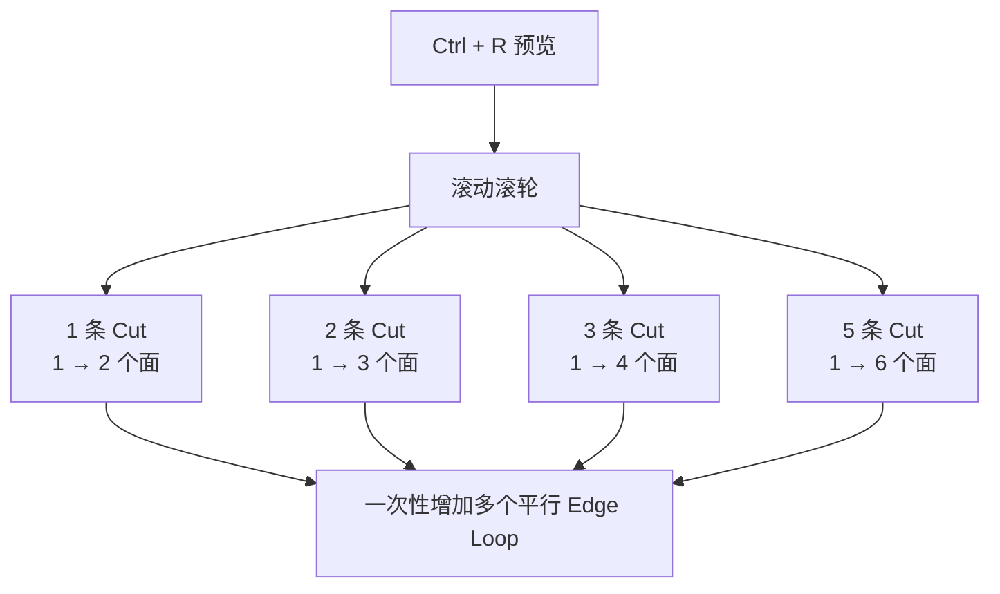

---

# 八、数字键也可以控制 Cut 数量

在 Loop Cut 操作过程中，可以直接输入数量。更常用的思维方式是：

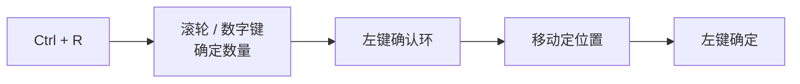

例如想切 1 个 Cut 就是直接 `Ctrl + R`，想切 5 个就是 `Ctrl + R + 滚轮↑`。

---

# 九、Loop Cut 的方向怎么确定？

这是理解 Loop Cut 最重要的地方之一。

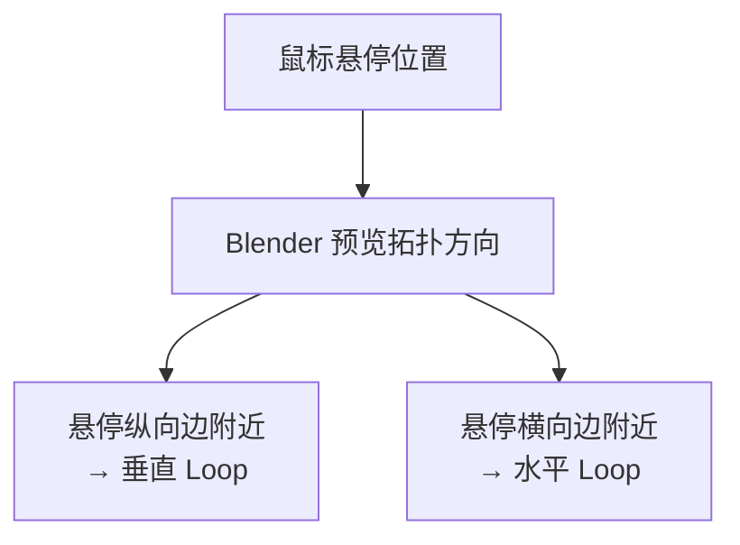

也就是说：

> **鼠标所在的位置决定 Loop Cut 的拓扑方向。**

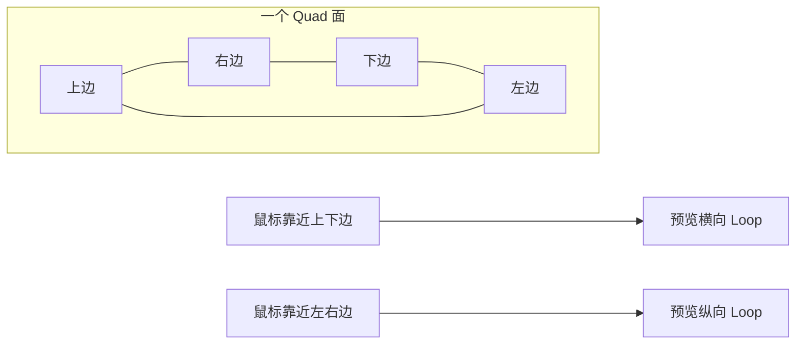

---

# 十、Loop Cut 的本质：Edge Loop

一定要把这两个概念联系起来：

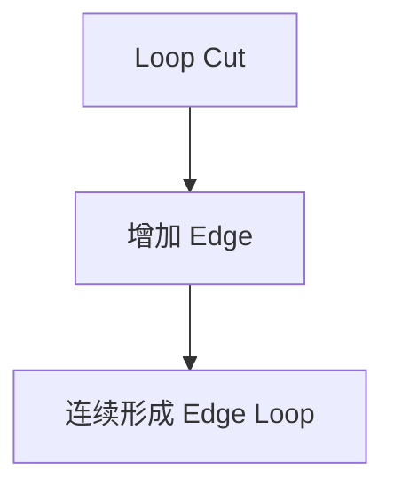

在立方体上，这条线并不是孤立的一条 Edge，它实际上沿着模型的拓扑继续，形成一整个环：

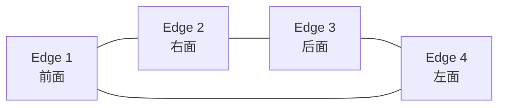

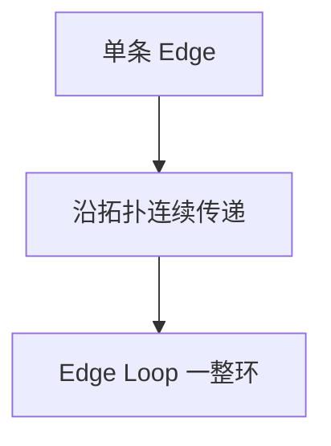

---

# 十一、为什么 Loop Cut 对 Quad 模型特别重要？

Loop Cut 最喜欢 `Quad`（4 条边、4 个顶点）。

如果模型主要由 Quad 构成，Loop Cut 可以非常自然地穿过去：

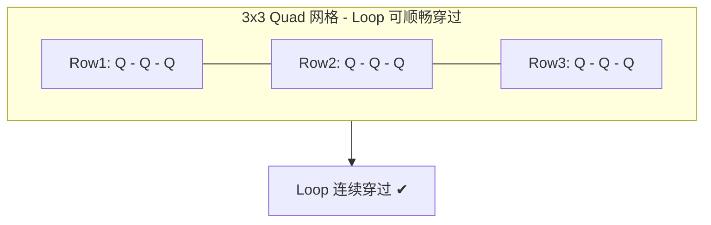


---

# 十二、三角形会发生什么？

Triangle 会阻断 Loop 的连续流动：

```mermaid
flowchart TD
    Quad["Quad 网格"] --> OK["Loop 连续穿过 ✔"]
    Tri["Triangle 三角面<br/>3条边"] --> NG["Loop 无法连续穿过 ✘<br/>中断 / 转向"]
```

这是为什么：

> **角色建模、Subdivision 建模通常非常重视 Quad Topology。**

---

# 十三、N-Gon 也会影响 Loop Cut

N-Gon 表面看起来是一个面，但实际上可能有 5+ 条边。Loop Cut 遇到这种结构时可能无法继续、改变方向、产生非预期结果。

```mermaid
flowchart TD
    NGon["N-Gon<br/>5+ 条边"] --> R1["无法继续"]
    NGon --> R2["改变方向"]
    NGon --> R3["非预期结果"]
    R1 & R2 & R3 --> Suggest["保持 Quad Flow<br/>让 Edge Loop 连续合理流动"]
```

所以建模时经常强调 `Quad Flow`，即：

> 让 Edge Loop 保持连续、合理流动。

---

# 十四、Loop Cut 与 Edge Ring 的区别

这是进阶建模必须理解的。

## Edge Loop

沿着拓扑连续的一圈，Loop Cut 通常创建的就是 `Edge Loop`：

```mermaid
flowchart LR
    subgraph LoopEx["Edge Loop - 首尾相连的一圈"]
        direction LR
        L1["边"] --- L2["边"] --- L3["边"] --- L4["边"] --- L1
    end
    LC["Loop Cut"] --> LoopEx
```

## Edge Ring

Edge Ring 更强调一组平行关系的 Edge：

```mermaid
flowchart LR
    subgraph RingEx["Edge Ring - 平行边集合"]
        direction TB
        R1["边 1"] --- R2["边 2"] --- R3["边 3"] --- R4["边 4"]
    end
```

两者不要混淆：

```mermaid
flowchart TD
    Loop["Loop<br/>连续环形结构"] --> LoopUse["沿着模型绕一圈"]
    Ring["Ring<br/>平行边集合"] --> RingUse["横跨多个面的平行边"]
```

---

# 十五、Loop Cut 最常见用途：调整模型比例

比如制作简单人体，需要不断 `Ctrl + R` 增加肩膀、胸部、腰部、胯部、膝盖、脚踝等 Loop，然后配合 `G / S / E` 调整形状。

```mermaid
flowchart TD
    Body["身体主块"] --> L1["肩膀 Loop"] --> L2["胸部 Loop"] --> L3["腰部 Loop"] --> L4["胯部 Loop"] --> L5["膝盖 Loop"]
    L5 --> GSE["配合 G移动 / S缩放 / E挤出<br/>调整形状"]
```

---

# 十六、Loop Cut + G：调整 Loop 位置

这是非常经典的组合：

```mermaid
flowchart LR
    A["Ctrl + R<br/>增加 Loop"] --> B["G<br/>移动 Loop"] --> C["控制上部 / 下部高度<br/>比例 / 形状"]
```

---

# 十七、Loop Cut + S：控制局部尺寸

选中 Loop（`Alt + Click`）后按 `S` 缩放，可以制作腰、手腕、脚踝、脖子、瓶颈、管道等等。

```mermaid
flowchart TD
    R["Ctrl + R<br/>增加纵向 Loop"] --> Sel["Alt + LMB<br/>选中整圈 Loop"] --> S["S 缩放"] --> Shape["收腰 / 瓶颈 / 手腕<br/>局部变细"]
```

---

# 十八、Loop Cut + E：制作复杂结构

Loop Cut 本身只是**增加拓扑**，真正改变模型结构往往还要配合 `E = Extrude`：

```mermaid
flowchart TD
    Cube["Cube"] --> LC["Ctrl + R<br/>增加控制点"] --> Sel["选面"] --> Ex["E 挤出"] --> Struct["产生新结构<br/>如把手 / 凸起"]
```

因此：

```mermaid
flowchart LR
    A["Loop Cut<br/>增加控制点"] --> B["Extrude<br/>挤出"] --> C["产生结构"]
```

---

# 十九、Loop Cut + Bevel

这是硬表面建模的经典组合：

```mermaid
flowchart TD
    Q1["Cube"] --> Q2["Ctrl + R x1<br/>增加横向 Loop"] --> Q3["Ctrl + R x2<br/>双支撑线"] --> Q4["Bevel Ctrl+B<br/>控制边缘过渡"]
```

就可以控制边缘过渡。

---

# 二十、Loop Cut + Subdivision Surface

这是最重要的用途之一。假设一个 Cube 添加 `Subdivision Surface` 会趋向平滑，如果增加 Loop，边缘会受到更多约束，因此 Loop Cut 又叫 `Support Loop / 支撑线`（虽然严格来说 Support Loop 不一定必须通过 Ctrl+R 创建）。

```mermaid
flowchart TD
    Cube["Cube 方块"] --> Sub["Subdivision Surface"] --> Smooth["趋向平滑 / 变圆"]
    Cube2["Cube + Loop Cut<br/>增加支撑线"] --> Sub2["Subdivision Surface"] --> Hard["保持方正 / 边缘锐利"]
```

---

# 二十一、为什么增加一条线就能让边缘变硬？

可以把 Subdivision 想象成受支撑线距离控制的曲率：

```mermaid
flowchart TD
    NoSup["没有支撑线<br/>Edge 孤立"] --> SM["完全平滑"]
    Sup["有支撑线<br/>Edge + 很近的 Loop"] --> SH["保持锐利"]
```

距离越近越倾向 Sharp，距离越远越倾向 Smooth：

```mermaid
flowchart LR
    Near["Loop 离边缘很近"] --> Sharp["Sharp 锐利"]
    Far["Loop 离边缘很远"] --> Smooth["Smooth 平滑"]
```

所以 `Loop Cut + 移动 Loop` 实际上是在控制：

> **Subdivision 后的曲率。**

---

# 二十二、Loop Cut 的滑动（Edge Slide）

当你 `Ctrl + R → Left Click` 之后移动鼠标，这一步实际上就是 `Edge Slide`，它允许你保持拓扑结构不变，只改变 Loop 的位置：

```mermaid
flowchart LR
    C["中心位置"] --> L["向左滑动"] & R["向右滑动"]
    L & C & R --> Note["拓扑不变<br/>只改变 Loop 位置"]
```

---

# 二十三、Edge Slide 的本质

假设 Loop 在 A、B 两条边之间为 C，移动它实际上并没有增加 Edge，而是重新分配 Edge 之间的空间：

```mermaid
flowchart LR
    A["A 边"] --- C["C Loop<br/>可滑动"] --- B["B 边"]
    C --> C1["靠近 A"] & C2["居中"] & C3["靠近 B"]
```

所以：

```mermaid
flowchart TD
    LC["Loop Cut<br/>= 创建 Loop"] --> ES["Edge Slide<br/>= 移动 Loop<br/>重新分配空间"]
```

---

# 二十四、Ctrl + R 与 K 刀具工具的区别

很多初学者会混淆 `Ctrl + R` 和 `K`：

```mermaid
flowchart TD
    CtrlR["Ctrl + R<br/>规则 Quad / 连续 Edge Loop"] --> RUse["规则切环<br/>整圈拓扑切割"]
    K["K Knife<br/>自由切割 / 任意路径"] --> KUse["自由切<br/>点对点刻线"]
```

---

# 二十五、Ctrl + R 与 Subdivide 的区别

另一个非常重要的区别。Loop Cut 可以控制方向、位置、数量、滑动，是拓扑流向驱动；Subdivide 通常是对选中区域整体细分。

```mermaid
flowchart TD
    LC["Loop Cut<br/>Ctrl+R"] --> LC2["拓扑流向驱动<br/>方向 / 位置 / 数量 / 滑动可控"]
    Sub["Subdivide<br/>右键细分"] --> Sub2["选中区域整体细分<br/>横竖同时切分"]
```

```mermaid
flowchart LR
    subgraph Before["细分前 - 1个面"]
        B1["Quad"]
    end
    subgraph AfterLC["Loop Cut 后 - 单向切分"]
        L1["Quad"] --- L2["Quad"]
    end
    subgraph AfterSub["Subdivide 后 - 双向切分"]
        direction TB
        S1["Quad Quad"] --- S2["Quad Quad"]
    end
    Before --> AfterLC & AfterSub
```

---

# 二十六、Loop Cut 最重要的快捷键组合

建议直接记住下面这张表：

| 操作        | 快捷键               |
| --------- | ----------------- |
| Loop Cut  | `Ctrl + R`        |
| 确认        | `LMB`             |
| 居中        | `RMB`             |
| 增加 Cut 数量 | 滚轮                |
| 移动 Loop   | 鼠标移动 / `G`        |
| Edge Slide | `G G`             |
| 选择 Loop   | `Alt + LMB`       |
| 选择 Ring   | `Ctrl + Alt + LMB` |
| Edge Bevel | `Ctrl + B`        |
| Extrude   | `E`               |
| Scale     | `S`               |
| Move      | `G`               |
| Knife     | `K`               |

其中最值得熟练的是：

```mermaid
flowchart LR
    R["Ctrl + R<br/>环切"] --- A["Alt + LMB<br/>选环"] --- G["G G<br/>滑动"] --- B["Ctrl + B<br/>倒角"] --- E["E<br/>挤出"]
```

---

# 二十七、Alt + 左键选择 Loop

Loop Cut 创建之后，你经常需要重新选择整圈 Loop，方法为 `Alt + Left Click`，Blender 会尝试选择整个 Edge Loop：

```mermaid
flowchart TD
    CR["Ctrl + R<br/>创建 Loop"] --> ALT["Alt + LMB<br/>选中整圈"] --> OP["G / S / E<br/>后续编辑"]
```

这就是 `Ctrl + R + Alt + LMB` 的经典组合。

---

# 二十八、G G：Edge Slide

如果已经选中 Loop，连续按两次 `G` 进入 Edge Slide：

```mermaid
flowchart TD
    Sel["选中 Loop"] --> GG["按 G G"] --> Slide["Edge Slide 模式"] --> L["左移"] & M["居中"] & R["右移"]
```

---

# 二十九、Loop Cut 的一个完整建模例子

假设我们要制作一个简单的桌腿：

```mermaid
flowchart TD
    S0["长方体柱子<br/>初始桌腿"] --> S1["Ctrl + R<br/>增加 2 条横向 Loop<br/>分出顶部 / 中部 / 底部"] --> S2["Alt + LMB<br/>选择中部 Loop"] --> S3["S 缩放<br/>收细中部"] --> S4["G 移动<br/>调整比例"] --> S5["桌腿造型完成<br/>上粗 / 中细 / 下粗"]
```

---

# 三十、Loop Cut 最重要的建模思想

不要把 `Ctrl + R` 仅仅理解为“增加一条线”，应该理解成**增加一个可以控制模型形状的拓扑环**：

```mermaid
flowchart TD
    CR["Ctrl + R"] --> EL["创建 Edge Loop"]
    EL --> G["G / GG<br/>移动 / 滑动"]
    EL --> S["S<br/>缩放"]
    EL --> E["E<br/>挤出"]
    G & S & E --> Shape["控制形状"]
    Shape --> Topo["更精细的模型拓扑"]
```

而如果加入 Subdivision：

```mermaid
flowchart TD
    Base["基础模型"] --> CR2["Ctrl + R"] --> Sup["Support Loop<br/>支撑线"] --> Sub["Subdivision Surface"] --> Ctrl["控制平滑程度"]
```

---

# 三十一、你应该重点掌握的 5 种 Loop Cut 用法

如果你现在正在系统学习 Blender，我建议按这个顺序练：

### ① 基础环切

```mermaid
flowchart LR
    A1["Ctrl + R"] --> B1["LMB 确认"] --> C1["RMB 居中"]
```

目标：

> 能够快速在中心增加 Loop。

---

### ② 多重环切

```mermaid
flowchart LR
    A2["Ctrl + R"] --> B2["Scroll 滚轮"] --> C2["一次增加 2 / 3 / 5 / 10 个 Loop"]
```

目标：

> 一次增加 2、3、5、10 个 Loop。

---

### ③ 环切 + 滑动

```mermaid
flowchart LR
    A3["Ctrl + R"] --> B3["LMB 确认"] --> C3["Move 滑动"] --> D3["LMB 确定位置"]
```

目标：

> 精确控制 Loop 的位置。

---

### ④ 选择 + Edge Slide

```mermaid
flowchart LR
    A4["Alt + LMB 选中"] --> B4["G G 滑动"] --> C4["调整已有 Loop 位置"]
```

目标：

> 已有 Loop 的情况下调整它的位置。

---

### ⑤ Loop Cut + Subdivision

```mermaid
flowchart LR
    A5["Ctrl + R 环切"] --> B5["Alt + LMB 选中"] --> C5["G / S 调整"] --> D5["理解支撑线硬度控制"]
```

目标：

> 理解 Support Loop 如何控制模型硬度。

---

## 最终形成这个 Blender 建模思维

```mermaid
flowchart TD
    Mesh["Mesh 网格"] --> Topo["Topology 拓扑"]
    Topo --> Edge["Edge 边"] & Face["Face 面"]
    Edge --> LC["Loop Cut"]
    Face --> Inset["Inset 内插"]
    LC --> EL["Edge Loop"]
    EL --> G["G 移动"] & S["S 缩放"] & E["E 挤出"]
    G & S & E --> Shape["模型形状"]
```

**一句话记忆：**

> `Ctrl + R` 不是单纯“切一刀”，而是在现有 Quad 拓扑中**插入一个连续的 Edge Loop**；随后通过 **滑动（Slide）、移动（G）、缩放（S）、挤出（E）**，利用这条 Loop 控制模型的局部形状和 Subdivision 后的曲线。

如果你正在按 **Vertex → Edge → Face → Extrude → Inset → Loop Cut → Bevel** 这条路线学 Blender，那么 **Loop Cut 后面最应该紧接着学习的是「Edge Loop / Edge Ring + Edge Slide（GG）+ Loop Cut 的 Falloff/滑动参数 + Subdivision 支撑线」**，这些内容会直接把你从“会操作快捷键”提升到真正理解 Blender 拓扑。

```mermaid
flowchart LR
    V["Vertex 点"] --> E1["Edge 边"] --> F["Face 面"] --> EX["Extrude 挤出"] --> IN["Inset 内插"] --> LC2["Loop Cut 环切"] --> BV["Bevel 倒角"] --> SUB["Subdivision 细分"]
```
