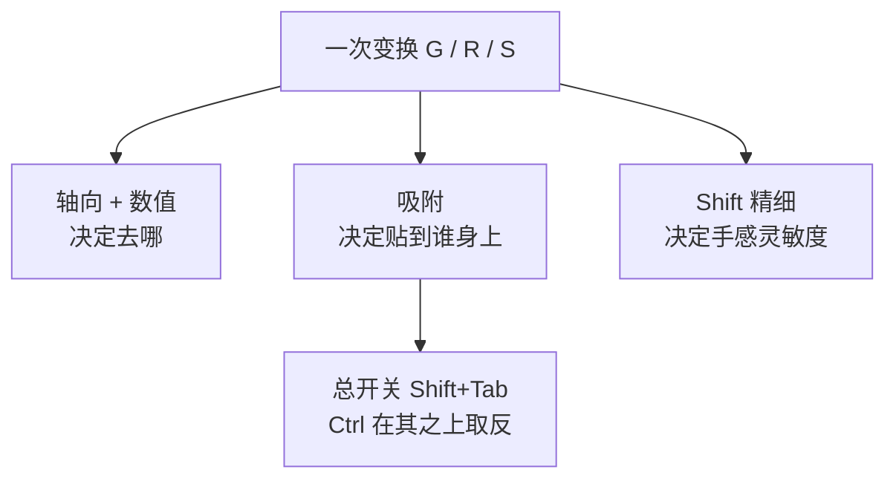
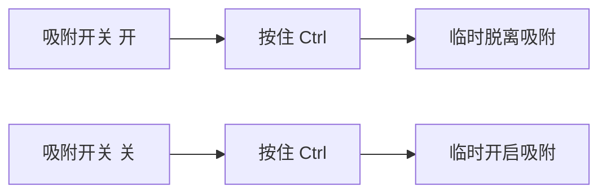
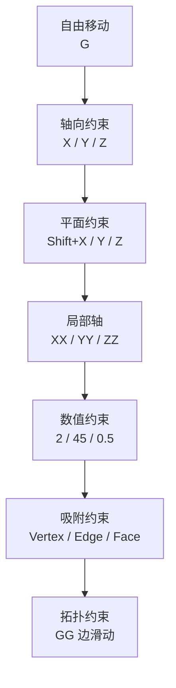

# 精细与吸附（Precision & Snapping）

> 原文 40 节 → 精简为 12 节，并按 **Blender 源码 + 官方手册**修正了 9 处表述。
> 一句话：**轴向管方向，数值管距离，吸附管贴谁，Shift 管手感。**
> 适用模式：Snapping 在 **Object / Edit / Pose Mode** 都可用（手册 Mode 字段）。

---

## 本次修订了什么（原文错漏对照）

| 原文说法 | 实际情况 |
| --- | --- |
| `Ctrl` 是「临时开启吸附」 | `Ctrl` 是**取反**（`SNAP_INV_ON/OFF`）：开着按 = 临时关，关着按 = 临时开 |
| `Shift`「让操作更精细」 | 精确倍率：移动/缩放 **×1/10**，旋转/轨迹球 **×1/30**；**吸附到 Grid 时不起作用** |
| `Shift+Ctrl` = 精细吸附 | 机制是把角度档位从 *Rotation Increment* 切到 *Rotation Precision Increment* |
| 吸附目标 7 种、含 Face Project | 应为 **9 种 base**（漏了 Grid / Edge Perpendicular / Face Center）+ **2 种 Individual**；Face Project 属 Individual 组 |
| Closest = 最近的顶点 | Object Mode 下是**包围盒角点**，Edit Mode 下才是顶点 |
| Pivot Point 与吸附混在一起讲 | 两者独立：只有 Snap Base = **Center** 时才等同于 pivot point |
| 未提 Affect | **默认只有移动受吸附影响**，旋转/缩放的 `use_snap_rotate` / `use_snap_scale` 默认是 **false** |
| Increment 与 Grid 混为一谈 | Increment 是「从起点出发的假想网格」，Grid 是「视口真实网格」，行为不同 |
| 缺 `Ctrl+Shift+Tab` / `Shift+S` / 变换中的 `A` `B` | 补全，见第六、九节 |

---

# 一、先分清三件事



> **轴向约束 ≠ 数值输入 ≠ 吸附 ≠ 精细**，四者可叠加：`G X 5` 是轴向+数值，`G` + 按住 `Ctrl` 是吸附，`G` + 按住 `Shift` 是精细。

---

# 二、轴向与平面约束

| 输入 | 含义 | 模式 |
| --- | --- | --- |
| `G X` | 只沿 X | 通用 |
| `G Y` / `G Z` | 只沿 Y / Z | 通用 |
| `G Shift+X` | **排除** X，在 YZ 平面动 | 通用 |
| `G Shift+Y` | 在 XZ 平面动 | 通用 |
| `G Shift+Z` | 在 XY 平面动 | 通用 |
| `G X X` | 第二次按轴 = **局部轴** | 通用 |

```
G Shift+Z  →  只能在 XY 平面动

       Y
       ↑
       │     ●
       │   ↗
       │ ↗
       ●────────→ X
```

**两次按轴 = 局部轴的补充**：在 Edit Mode 里，第二次按轴取的是**物体自身的局部轴**，不是选中元素的法线。想让顶点沿各自的法线走，要把 Transform Orientation 切到 **Normal**（见第二十七节原文，此处不重复）。

---

# 三、数值输入

```text
G X 5 Enter     X += 5
G X -5 Enter    X -= 5
G X 0.25        X += 0.25
R Z 45          绕 Z 转 45°
S X 2           X 方向 ×2
```

输入数字**优先于**吸附——敲了数字就是绝对值，吸附不再干预。

---

# 四、Shift：精细（真实倍率）

按住期间生效，松手即恢复。源码 `transform_input.cc` 里的 `precision_factor`：

| 变换 | 倍率 |
| --- | --- |
| 移动 / 缩放 | 鼠标位移 **× 1/10** |
| 旋转 / 轨迹球 | **× 1/30**（角度本身更难控） |

两个容易踩的例外：

1. **吸附到 Grid 时，Shift 完全不起作用**。源码注释写死了：`Mouse position during Snap to Grid is not affected by precision`。已经吸在网格上了，再降灵敏度没有意义。
2. 变换中同时做视图导航时，源码有一段 workaround 防止 Shift 被误判。遇到过「Shift 时灵时不灵」，多半撞上了这个。

---

# 五、Ctrl：取反（最容易被讲错的一节）

`Ctrl` 在默认键位里叫 `SNAP_INV_ON` / `SNAP_INV_OFF`，**INV = invert**。



| 总开关 | 按 Ctrl | 结果 |
| --- | --- | --- |
| 开 | 不按 | 吸附生效 |
| 开 | 按住 | **吸附失效**（临时自由） |
| 关 | 不按 | 吸附失效 |
| 关 | 按住 | **吸附生效**（临时对齐） |

一个键同时满足「临时对齐」和「临时挣脱」，不用去动总开关。

生效条件（源码 + RNA 均已确认）：

- 只对 **`G` / `R` / `S`** 三种变换生效；
- **先按 Ctrl 再按 G 也有效**——进入变换时 Ctrl 已按住会直接置上取反标志；
- ⭐ **Affect：默认只有移动受吸附影响**。`use_snap_rotate` 和 `use_snap_scale` 的默认值是 `false`。所以「按 R 再按 Ctrl 没反应」不是坏了，是旋转吸附没打开（Snapping 面板最下面的 Affect，勾上 Rotate / Scale）。

---

# 六、吸附总开关与三个易混键

| 键 | 作用 | 备注 |
| --- | --- | --- |
| `Shift+Tab` | 吸附**总开关**，持久 | 变换过程中按也生效，且会写回场景设置 |
| `Ctrl+Shift+Tab` | 打开吸附面板 | 等价于点顶部磁铁旁的箭头 |
| `Shift+S` | **不是**吸附开关 | 是「对齐」饼菜单：Cursor to Selected 等 8 个操作 |
| `O` | 衰减编辑 | 跟吸附**没关系**，别混 |
| `Shift+LMB` | 多选吸附目标 | 可同时开 Vertex + Edge 等 |

---

# 七、吸附三要素

吸附结果由三项设置共同决定，只调其中一项往往对不上：


## 1) Snap Base —— 拿自己身上哪个点去贴

| 选项 | Object Mode | Edit Mode |
| --- | --- | --- |
| **Closest**（默认） | 包围盒**角点** | 最接近目标的**顶点** |
| Center | 变换中心（= pivot point） | 同左 |
| Median | 所选物体**原点**的平均位置 | 所选**顶点**的平均位置 |
| Active | 活动物体的**原点** | 活动元素的**中心** |

> ⚠️ Closest 在两种模式下拿的点**不一样**——Object Mode 是包围盒角，不是顶点。想让物体原点去贴，选 Center 或 Active。

## 2) Snap Target —— 贴到哪类东西上

见下一节。

## 3) Individual —— 多个元素各自怎么贴

| 选项 | 行为 |
| --- | --- |
| Face Project | 每个物体/顶点各自沿**视线方向投影**到面上（把平板贴合曲面） |
| Face Nearest | 各自贴到**最近的**面点（可以贴到被遮挡的几何） |

> Pivot Point（Median / Individual Origins / Active Element / 3D Cursor / Bounding Box）是**另一套**设置，只影响变换中心。只有 Snap Base = Center 时两者才等价。

---

# 八、九种吸附目标怎么选

| 目标 | 吸到哪 | 典型用途 |
| --- | --- | --- |
| **Increment** | 从**起点**出发、步长等于视口网格的假想网格 | 等距阵列、模块化 |
| **Grid** | 视口**真实显示**的网格线 | 对齐世界原点/整数位 |
| **Vertex** | 离鼠标最近的顶点 | ⭐ 建模最常用，点贴点 |
| **Edge** | 离鼠标最近的边 | 边对齐、延长线上定位 |
| **Face** | 鼠标下那个面的表面 | ⭐ Retopology 重新拓扑 |
| **Volume** | 目标**内部**的深度中心 | 骨骼居中于手臂内、物体穿插堆叠 |
| **Edge Center** | 最近边的中点 | 居中到边 |
| **Edge Perpendicular** | 边上使移动路径**垂直**于该边的点 | 垂直落点、正交对齐 |
| **Face Center** | 鼠标下面片的中心 | 居中到面 |

**Increment ≠ Grid**：Increment 从你**开始拖的位置**起算，按网格步长跳；Grid 直接贴到视口画出来的网格线。**Absolute Increment Snap** 则是把 Increment 改成贴真实网格（手册原文：snap to the viewport grid instead of moving by increments）。

**Face 吸附会穿模**：贴到面上时物体一半会陷进去。没有「Offset 开关」这种东西——正确做法是吸完之后再 `G` 微调偏移，或者按住 `Ctrl` 临时脱离吸附再推一点。

其他常用开关（Target Selection 区）：

| 开关 | 作用 |
| --- | --- |
| Align Rotation to Target | 吸附时把自身 Z 轴对齐到目标**法线** |
| Backface Culling | 排除背面，别吸到看不见的几何 |
| Include Edited / Non-Edited | 是否吸附到同样在 Edit Mode 的 / 不在 Edit Mode 的物体 |
| Snap Peel Object | Volume 模式下把目标当作一个整体，只看最外层 |

---

# 九、变换中的进阶键

变换进行中（还没确认前）还能用这些：

| 键 | 作用 |
| --- | --- |
| `A` | **Add Snap Point**：把当前吸到的点加入自定义吸附点列表（前提：此刻已经吸附到某个点） |
| `Alt+A` | 移除最后一个自定义吸附点 |
| `B` | Set Snap Base：手动指定吸附源 |
| `Shift+滚轮` / `PageUp` `PageDown` | 调衰减编辑影响半径（配合 `O`） |
| `Shift+O` | 衰减曲线饼菜单 |

> 关于 `Ctrl+A`：变换中它是 Add Snap Point；但在 Edit Mode 里 `Ctrl+A` **没有绑定**，全选请按 `A`（详见 `03-变换系统-G-R-S.md`）。

---

# 十、配方与工作流

| 场景 | 做法 |
| --- | --- |
| 拼装机械件 | `Shift+Tab` 开吸附 → Target 选 **Vertex** → Base 选 **Active** → 直接拖 |
| 一堆物体不重叠地堆 | Target 选 **Volume** |
| 吸附开着但要微调一格 | 拖着不动，按住 `Ctrl` 脱离，松开又吸回去 |
| 旋转固定角度 | 先到 Affect 勾上 **Rotate**，Target 选 Increment，`R Z` + `Ctrl` 按 5° 档跳，加 `Shift` 变 1° 档 |
| 把平板贴到曲面 | Individual 选 **Face Project** |
| 重新拓扑 | Target 选 **Face** + 开 Backface Culling |

**跨物体顶点吸附要点**：想让 A 的顶点贴到 B 的顶点，必须**两个物体都在 Edit Mode**（选中 A、B 一起 `Tab`），否则只能贴到物体级的位置。

```text
1. 选中 A、B → Tab 进 Edit Mode
2. 1 顶点模式 → 选 A 的顶点
3. Shift+Tab 开吸附，Target = Vertex
4. G → 移向 B 的顶点 → 自动吸上
```

`E`（挤出）同理，**必须 Edit Mode**，Object Mode 下按 `E` 无反应。

---

# 十一、速查表

```text
── 轴向 / 数值（通用）────────────────────
G / R / S                   移动 / 旋转 / 缩放
G X 5   R Z 45   S X 2      轴 + 数值
G Shift+Z                   排除 Z，XY 平面
G X X                       第二次按轴 = 局部轴

── 精度（通用）──────────────────────────
Shift                       精细（移动 ×1/10，旋转 ×1/30）
                            ⚠️ 吸附到 Grid 时无效

── 吸附（Object / Edit / Pose 都可用）────
Shift+Tab                   总开关（持久）
Ctrl                        取反：开着→临时关，关着→临时开
                            ⚠️ 默认只对移动生效
Ctrl+Shift+Tab              吸附面板
Shift+LMB                   多选吸附目标
Shift+S                     对齐菜单（不是吸附开关）

── 吸附三要素 ───────────────────────────
Snap Base                   Closest / Center / Median / Active
Snap Target                 Increment Grid Vertex Edge Face
                            Volume EdgeCenter EdgePerp FaceCenter
Individual                  Face Project / Face Nearest

── 变换中的进阶键 ───────────────────────
A / Alt+A                   加 / 删自定义吸附点
B                           指定吸附源
Shift+滚轮                  调衰减半径
```

---

# 十二、约束层级（收尾总表）



> 拿到一个建模任务，先问「**我要怎么约束这个操作**」，再动手——而不是 `G` 完之后用眼睛对。

---

# 十三、自检清单

- [ ] 能说清 `Ctrl` 是**取反**而不是「开启吸附」
- [ ] 知道 `Shift` 在旋转时是 ×1/30，且吸附到 Grid 时无效
- [ ] 知道旋转/缩放默认**不受**吸附影响，要在 Affect 里打开
- [ ] 能分清 Snap Base（拿自己的哪个点）和 Snap Target（贴到哪类东西）
- [ ] 知道 Closest 在 Object Mode 是包围盒角、在 Edit Mode 才是顶点
- [ ] 能分清 Increment（从起点跳步）和 Grid（贴真实网格）
- [ ] 跨物体顶点吸附时知道要两个物体都进 Edit Mode
