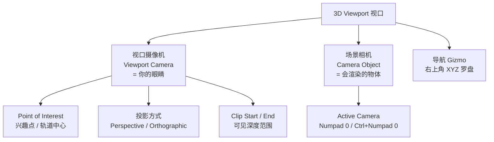
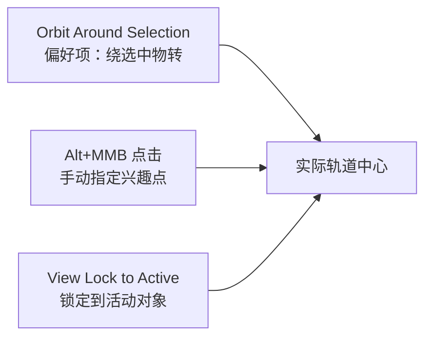

# 视角操作详解（Viewport Navigation）

> 一句话：**视角是「虚拟摄像机」的状态，不属于场景、不进撤销历史。Orbit 绕着看，Pan 平移看，Zoom 拉近看，Dolly 移动焦点。**
> 适用：所有模式（Object / Edit / Sculpt / Pose 通用）。
> 键位依据：Blender 官方手册 *Navigating* 章节（含 5.x）+ 默认 Keymap。

---

## 先建立一张概念图



> **视口摄像机 ≠ 场景相机。** 转视角不会改动任何物体，也不会被 `Ctrl+Z` 撤销；只有按 `Numpad 0` 进入相机视图并用 *Lock Camera to View* 后，导航才会真的移动场景里的相机。

---

# 一、视角有哪几个自由度

把视口摄像机想象成**架在摇臂上的摄影机，摇臂底座钉在一个锚点上**：

```text
              ● 视口摄像机
             /
            /  摇臂（长度 = Zoom / Dolly）
           /
    ━━━━━●━━━━━  ← 锚点 = Point of Interest（Orbit 中心）
          ←──── Pan 就是平移这个锚点
```

| 自由度 | 改变的是 | 类比 | 默认操作 |
| --- | --- | --- | --- |
| **Orbit 环绕** | 摇臂的角度 | 绕着物体转 | `MMB` 拖动 |
| **Pan 平移** | 锚点的位置 | 摄影机横向平移 | `Shift+MMB` |
| **Zoom 缩放** | 摇臂的长度 | 推近 / 拉远 | `Ctrl+MMB` / 滚轮 |
| **Dolly 推拉** | 锚点沿视线方向移动 | 人真的走过去 | `Shift+Ctrl+MMB` |
| **Roll 翻滚** | 机身绕视线自滚 | 歪脖子看 | `Shift+Numpad 4 / 6` |

> **Zoom 和 Dolly 的区别**：Zoom 会让摄像机无限接近焦点，但**永远过不去**——到一定程度就推不动了。这时候要按 `Shift+Ctrl+MMB` 做 Dolly，把焦点本身往后挪。看大场景（建筑、地形）时这个区别会非常明显。

---

# 二、鼠标操作（每天几百次）

## 1) 基础三键

| 操作 | 功能 | 备注 |
| --- | --- | --- |
| `MMB` 拖动 | **Orbit** 环绕旋转 | 主力操作 |
| `Shift+MMB` | **Pan** 平移视图 | |
| `Ctrl+MMB` | **Zoom** 连续缩放 | 上下拖 |
| `Shift+Ctrl+MMB` | **Dolly** 推拉焦点 | ⭐ Zoom 卡住时用 |
| 滚轮 | **Zoom** 步进缩放 | 一格一格跳 |
| `Shift+B` | **Zoom Region** 框选放大 | 拖一个框，视图放大到该区域 |

## 2) `Alt` 的三种用法（很多人不知道）

`Alt` 在 Orbit 上有三档不同行为，非常值得练熟：

| 操作 | 行为 |
| --- | --- |
| `Alt+MMB` **点一下** | 把鼠标下那一点设为**兴趣点**，之后 Orbit 都绕着它转 |
| **按住 `Alt`** 再 `MMB` 拖动 | 拖动会把视图**对齐到某个世界轴**，并自动切到**正交** |
| 先 `MMB` 拖动，**过程中**按住 `Alt` | Orbit 时**吸附**到世界轴和轴之间的对角线 |

```text
按住 Alt 拖        →  停在正前/正侧/正顶等轴向，且变正交
先拖再按 Alt       →  自由旋转，但会"咔"到轴向和对角线上
```

> 想让视角稳稳停在一个正交轴向视图上，**按住 Alt 再拖**是比按小键盘更连续、更直觉的做法。

## 3) 导航 Gizmo（右上角罗盘）

```
        ⬤  ← 拖这个球 = Orbit
       X Y Z  ← 点字母 = 跳到该轴正交视图
    🎥  ← 相机视图
    ⊞   ← 透视 / 正交
    🔍  ← 缩放
```

- 点 **X / Y / Z** 直接切到对应的正交视图；
- **拖动球** = 自由 Orbit；
- 多次点同一个字母会在**正反两面**之间来回翻。

## 4) macOS 触控板用户必读

MMB 在触控板上几乎按不出来，这是最劝退的一环。三条路：

1. 弄一个三键鼠标（最推荐，建模几乎强制）；
2. `Edit → Preferences → Keymap` 里把 **Orbit 改成 `Alt+LMB`**；
3. 触控板双指滚动可以当缩放用，但 Orbit / Pan 还是需要键盘配合。

> 别硬扛。视角卡手会让整个建模过程变成折磨，第一天就该解决掉。

---

# 三、键盘：小键盘视角键

## 1) 六大标准视角

| 键 | 视图 | 看向 |
| --- | --- | --- |
| `Numpad 1` | Front 前 | −Y |
| `Ctrl+Numpad 1` | Back 后 | +Y |
| `Numpad 3` | Right 右 | +X |
| `Ctrl+Numpad 3` | Left 左 | −X |
| `Numpad 7` | Top 顶 | +Z |
| `Ctrl+Numpad 7` | Bottom 底 | −Z |
| `Numpad 5` | **透视 / 正交切换** | |

> 记忆法：`Ctrl` = 反方向。`1 3 7` 分别在键盘左下、右下、左上，正好对应前、右、顶。

## 2) 步进旋转 / 平移 / 缩放

| 键 | 功能 |
| --- | --- |
| `Numpad 8 / 2 / 4 / 6` | 上 / 下 / 左 / 右 旋转 **15°**（步长在偏好 *Rotation Angle* 里改） |
| `Numpad 9` | **翻到另一侧**——绕 Z 转 180°，看模型背面 |
| `Shift+Numpad 4 / 6` | **Roll** 左 / 右翻滚 15° |
| `Ctrl+Numpad 8 / 2 / 4 / 6` | 步进**平移** |
| `Numpad + / -` | 步进**缩放** |

> **Roll 歪了怎么复位**：先按 `Numpad 3` 对齐到全局 X 轴，再 `MMB` 转回透视视角即可。

## 3) 取景与聚焦

| 键 | 功能 |
| --- | --- |
| `Numpad .` | **聚焦选中**——把选中的东西居中放大 ⭐ |
| `Home` | **显示全部**（相机视图下 = Frame Camera Bounds） |
| `Shift+C` | 3D 光标回世界原点 **+ 显示全部** ⭐ 迷路时的万能键 |
| `Numpad /` | **Local View 独显**——只显示选中对象，再按退出 |
| `` ` ``（反引号） | 视角 **Pie Menu** |
| `Ctrl+Alt+Q` | **四视图** Quad View |
| `Ctrl+Space` | 当前区域最大化 |

> **`Numpad .` 和 `Home` 是救命键**。在 3D 空间里迷路太正常了，永远先按 `Home` 找回全局，再 `Numpad .` 钻进去。

## 4) 没有小键盘怎么办

笔记本没有 Numpad：`Edit → Preferences → Input → Emulate Numpad`。

勾选后用**主键盘数字键**模拟小键盘（`1 3 7` 依然对应前/右/顶，`Ctrl+1` = 后视图）。

---

# 四、透视 vs 正交

| | Perspective 透视 | Orthographic 正交 |
| --- | --- | --- |
| 近大远小 | ✅ 有 | ❌ 没有 |
| 平行线 | 会汇聚 | 永远平行 |
| 比例可信度 | 视觉真实 | **尺寸可比对** |
| 适合 | 看造型、看高光、构图 | **对位、对齐、看轮廓** |

```text
透视：  ╱▔▔╲       正交： ┌────┐
       │    │            │    │
        ╲__╱             └────┘
       （远端收窄）      （远端等宽）
```

- 切换键：`Numpad 5`
- 正交下可调 **Ortho Scale**（`N` 面板 → View）
- 透视下可调 **Focal Length**（`N` 面板 → View，默认等效 50mm，越大越"长焦压缩"）
- 偏好里的 **Auto Perspective**：开启后，Orbit 时自动转透视，对齐到轴（Top/Front/Side）时自动转正交。很多人开着它很顺手，也有人觉得被"抢方向盘"——按手感选。

> **工作流建议**：正交下对位建模（比例不会骗人），切透视 + Material Preview 转一圈看高光验收。做倒角/硬表面时这一步不能省。

---

# 五、相机视图：把视角变成渲染画面

| 键 | 功能 |
| --- | --- |
| `Numpad 0` | 进入 / 退出**相机视图** |
| `Ctrl+Numpad 0` | 把选中对象设为**活动相机** |
| `Ctrl+Alt+Numpad 0` | ⭐ **把相机对齐到当前视角**（摆好构图后一键落相机） |
| `Home`（相机视图内） | Frame Camera Bounds 相机边界框居中 |

## Lock Camera to View

`N` 侧栏 → **View** 选项卡 → 勾上 **Lock Camera to View**。

勾上之后在相机视图里做 Orbit / Pan / Zoom，**移动的是场景里的相机本身**，而不是视口摄像机。这是"所见即所得"摆相机的核心开关。

## 相机运镜（相机视图内 + 选中相机）

| 想做什么 | 操作 |
| --- | --- |
| Roll 翻滚 | `R` |
| Pitch 俯仰 | `R` `X` `X` |
| Yaw 摇摄 | `R` `Y` `Y` |
| Dolly 推拉 | `G` `MMB`（或 `G` `Z` `Z`） |
| 横向/纵向 Track | `G` + `X X` / `Y Y` |

> 规律：**按两下轴向键 = 局部轴**。第一下是全局轴，第二下切到物体自身局部轴——相机的局部 Z 正对拍摄方向，所以 `R` `Z` `Z` 就是 Roll。

## 常用工作流

```text
1. 自由视角把构图调好看
2. Ctrl+Alt+Numpad 0     → 相机瞬间就位
3. Numpad 0              → 进相机视图检查
4. 微调：开 Lock Camera to View，直接拖视角
5. F12 渲一发确认
```

---

# 六、兴趣点与视图锁定

Orbit 到底绕**哪个点**转，由这三者决定：



| 方式 | 怎么开 | 特点 |
| --- | --- | --- |
| **Orbit Around Selection**（偏好） | Preferences → Navigation → Orbit & Pan | 没选中时用**上一次**的选择；大地面模型会很别扭 |
| **`Alt+MMB` 点击** | 直接点 | 一次性的即时指定，最灵活 |
| **View Lock to Active** | `F3` 搜 "View Lock" | 视图**锁定**到活动对象，物体移动视角跟着走；`F3` 搜 "View Lock Clear" 解除 |

> 建模一个局部细节时，先 `Alt+MMB` 把兴趣点点在那个细节上，之后的 Orbit 就一直围着它转，不用反复 Pan 回去。

---

# 七、Local View 与四视图

## Local View（独显）

`Numpad /`：只显示选中对象，其余全部隐藏，再按一次退出。

- 改复杂模型内部、或在一堆物体里反复调整一个时极其好用；
- **不是隐藏**，不会改动物体的可见性设置，退出即恢复。

## Quad View（四视图）

`Ctrl+Alt+Q`：切成 顶 / 前 / 右 / 透视 四格。

- 每个象限有**独立的视角**，可分别操作；
- 鼠标所在象限为"活动象限"，`Ctrl+Alt+Q` 再次按下退出；
- 三视图格子里默认是正交，适合精确对位。

---

# 八、Fly / Walk 第一人称漫游

大场景（建筑、地形、关卡）里 Orbit 会很憋屈，用第一人称。

进入：`Shift + ` ``（反引号）。默认是 **Walk** 还是 **Fly** 在 `Preferences → Navigation → Fly & Walk → View Navigation` 里选。

## Walk 行走

| 键 | 功能 |
| --- | --- |
| `W` / `↑`、`S` / `↓`、`A` / `←`、`D` / `→` | 前 / 后 / 左 / 右 |
| `E` / `Q` | 全局上 / 下（需关闭重力） |
| `R` / `F` | 局部上 / 下（需关闭重力） |
| `Space` | **传送**到准星位置 |
| 滚轮 / `Numpad + -` | 调速度 |
| `Shift` / `Alt` | 临时加速 / 减速 |
| `V` | 跳（需开重力） |
| `Tab` | 切换重力 |
| `Z` | 扶正画面（消除倾斜） |
| `.` / `,` | 增 / 减跳跃高度 |
| `LMB` 确认，`Esc` / `RMB` 取消 | |

## Fly 飞行

| 键 | 功能 |
| --- | --- |
| `W` `S` `A` `D` | 加速前 / 后 / 左 / 右 |
| `E` / `Q` | 加速上 / 下 |
| `MMB` 拖动 | 平移视图（**飞行暂停**） |
| 滚轮 | 调加速度 |
| `Alt` | 减速直到停住 |
| `Ctrl` | **锁旋转**——飞行方向不受视线影响，可绕着飞过去的物体看 |
| `X` / `Z` | 轴校正（回水平 / 回正） |
| `LMB` / `Space` 确认，`Esc` / `RMB` 取消 | |

> ⭐ **录相机运镜**：进相机视图 → 打开 Auto Keying → 播放动画 → 开 Fly/Walk。你走的路径会被自动打成相机关键帧。注意退出漫游（按 `LMB`）后才能停播放。

---

# 九、偏好设置：把视角调成自己的手感

`Edit → Preferences → Navigation`

| 选项 | 建议 |
| --- | --- |
| **Orbit Method** | Turntable（保持水平，方向感强）/ Trackball（自由，可任意朝向） |
| **Orbit Around Selection** | 小物件建模开；大地形关 |
| **Auto Depth** | ⭐ **强烈建议开**——用鼠标下的深度来做 pan/zoom，贴脸看细节不飘 |
| **Zoom to Mouse Position** | ⭐ 强烈建议开，配合 Auto Depth 可以"指哪打哪"地缩放 |
| **Auto Perspective** | 看个人习惯 |
| **Smooth View** | 切视角的动画时长，晕 3D 就调 0 |
| **Rotation Angle** | `Numpad 4/6/8/2` 的步进角度，默认 15° |
| **Invert Zoom Direction** | 从 Maya / C4D 转过来的按需反转 |

---

# 十、常见坑

| 现象 | 原因 / 解法 |
| --- | --- |
| 缩放推到一定程度**推不动了** | 到了焦点位置，用 `Shift+Ctrl+MMB` **Dolly** |
| 大模型远处**整体消失** | **Clip End** 太小，`N` 面板 → View 里调大（默认 1000） |
| 贴近看**被切面** | **Clip Start** 太大，调小（默认 0.01） |
| 视角歪了回不来 | `Numpad 3` 对齐全局 X 轴，再 `MMB` 转回透视 |
| 在 3D 空间里**彻底迷路** | `Home` → 再 `Numpad .`；还不行就 `Shift+C` |
| `Ctrl+Z` 撤销不了视角变化 | 视角**不进撤销历史**，正常现象 |
| 选中大地面时 Orbit 很怪 | Orbit 中心在包围盒中心，关掉 *Orbit Around Selection* 或 `Alt+MMB` 手动指定 |
| 没有小键盘按不了 1/3/7 | 开 **Emulate Numpad** |
| Mac 上某个 `Ctrl` 组合没反应 | 与系统快捷键冲突，`F3` 搜命令名执行，或去 Keymap 改键 |

---

# 十一、速查表

```text
── 鼠标 ────────────────────────────────
MMB 拖动                Orbit 环绕
Shift+MMB               Pan 平移
Ctrl+MMB                Zoom 连续缩放
Shift+Ctrl+MMB          Dolly 推拉焦点（Zoom 卡住时用）
滚轮                    Zoom 步进
Shift+B                 框选放大
Alt+MMB 点一下          设为 Orbit 兴趣点
按住 Alt + MMB 拖       对齐到轴 + 自动正交
拖 MMB 时按 Alt         Orbit 吸附到轴向/对角线

── 标准视角 ────────────────────────────
Numpad 1 / Ctrl+1       Front / Back
Numpad 3 / Ctrl+3       Right / Left
Numpad 7 / Ctrl+7       Top / Bottom
Numpad 5                透视 / 正交
Numpad 9                翻到背面（绕 Z 转 180°）

── 步进操作 ────────────────────────────
Numpad 8/2/4/6          旋转 15°
Shift+Numpad 4/6        Roll 翻滚 15°
Ctrl+Numpad 8/2/4/6     步进平移
Numpad +/-              步进缩放

── 取景 ────────────────────────────────
Numpad .                聚焦选中
Home                    显示全部
Shift+C                 光标回原点 + 显示全部
Numpad /                Local View 独显
Ctrl+Alt+Q              四视图
Ctrl+Space              区域最大化
`（反引号）              视角 Pie Menu

── 相机 ────────────────────────────────
Numpad 0                进入相机视图
Ctrl+Numpad 0           选中对象设为活动相机
Ctrl+Alt+Numpad 0       ⭐ 相机对齐当前视角
Lock Camera to View     相机视图内导航 = 移动相机
R / R XX / R YY         Roll / Pitch / Yaw
G MMB（G ZZ）           Dolly 推拉

── 第一人称 ────────────────────────────
Shift+`                 进入 Walk / Fly
WASD / 方向键           移动
Space                   传送（Walk）
Shift / Alt             加速 / 减速
LMB 确认，Esc/RMB 取消
```

---

# 十二、自检清单

- [ ] 能说清 **视口摄像机** 和 **场景相机** 是两回事
- [ ] 知道 Orbit / Pan / Zoom / Dolly 分别在改什么，以及 Zoom 卡住时该用 Dolly
- [ ] 会用 `Alt+MMB` 点击指定 Orbit 兴趣点
- [ ] 知道按住 `Alt` 拖 MMB 会自动对齐轴向并切正交
- [ ] 不用小键盘也能切前 / 右 / 顶视图（Emulate Numpad 或改键）
- [ ] 迷路时第一反应是 `Home` / `Numpad .`
- [ ] 能用 `Ctrl+Alt+Numpad 0` 把摆好的构图落成相机
- [ ] 知道 Clip Start / End 在哪里调（模型被切 / 消失时）
- [ ] 开过 Auto Depth + Zoom to Mouse Position
- [ ] 建模用正交对位、验收用透视 + Material Preview 看高光
