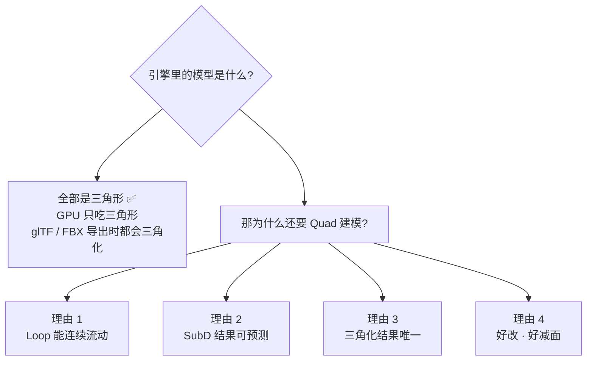
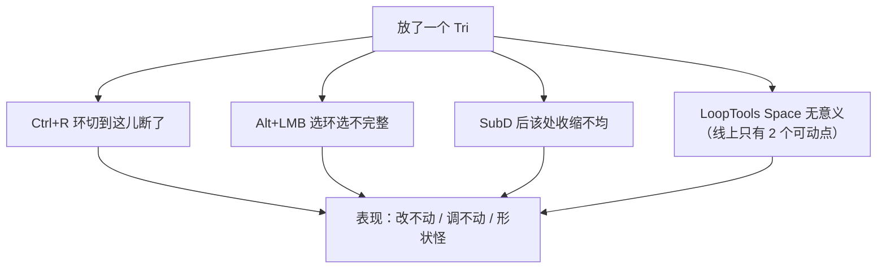
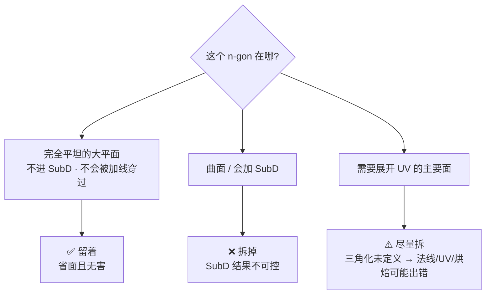
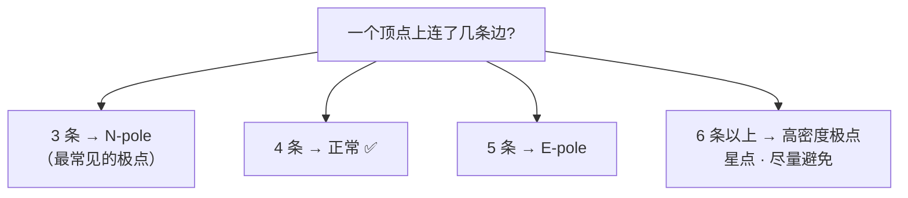
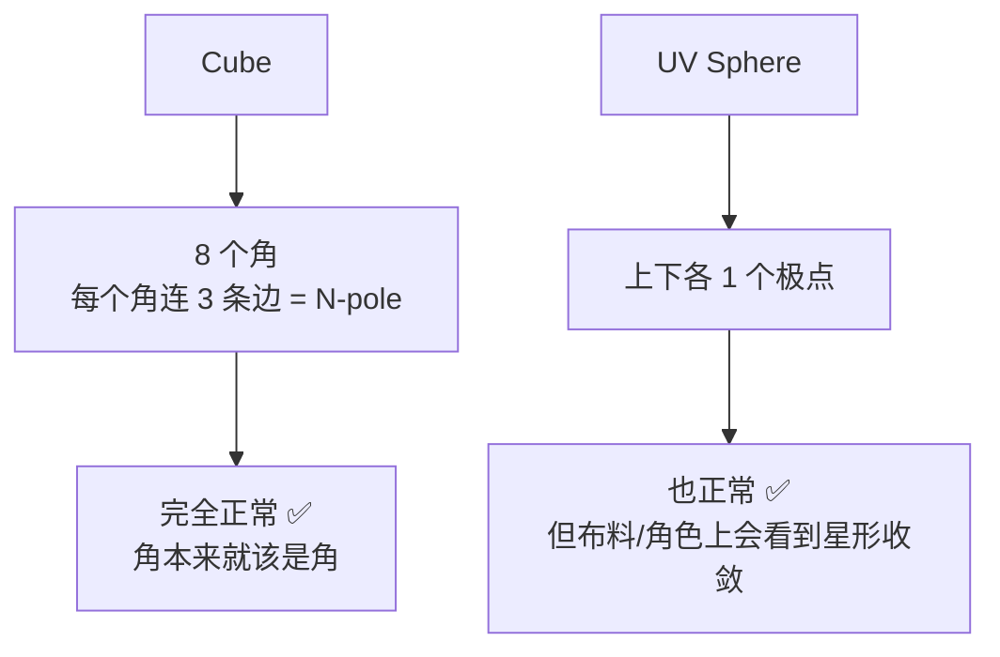
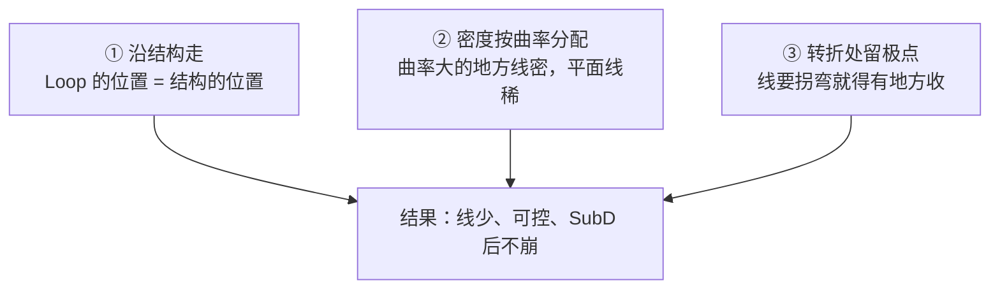
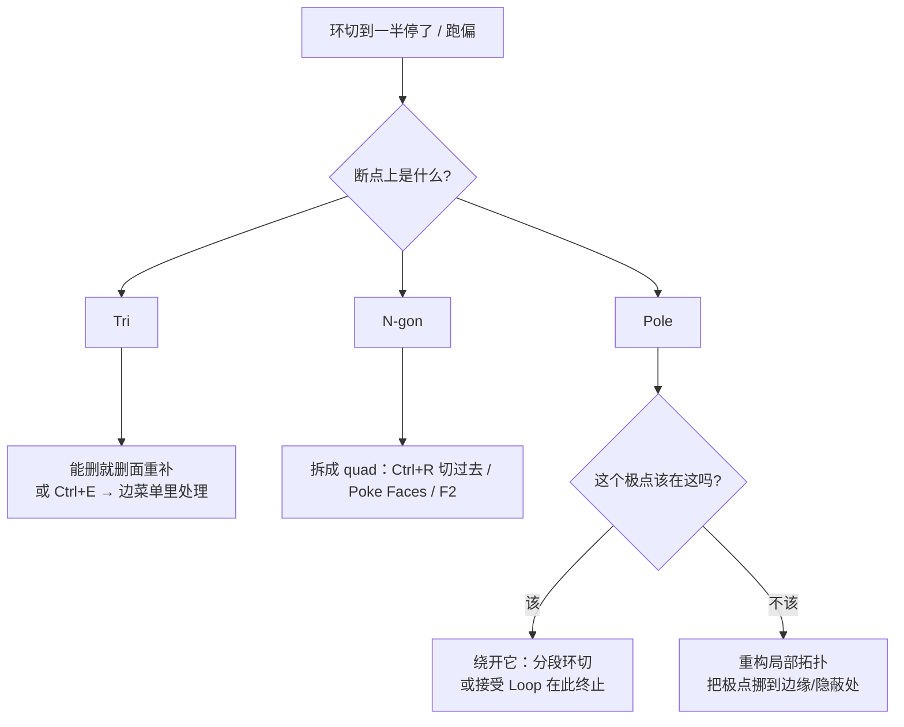
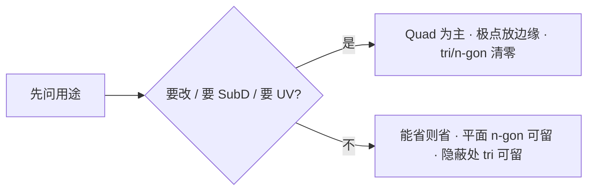

# 01 · 拓扑质量标准：Quad / Tri / N-gon / 极点 / 布线

> 一句话：**拓扑没有「绝对正确」，只有「对这个用途够不够好」。** 本页给你一套能自己打分的判据。
> 前置：[`../00-基础/05-环切与拓扑-Ctrl+R.md`](../00-基础/05-环切与拓扑-Ctrl+R.md) 第六节（Loop/Ring/极点定义）
> 已按 Blender 5.2 LTS 官方手册（Mesh Structure / Mesh Analysis / Loop Cut）校准。

---

## 一、先破一个误会：为什么是 Quad

新手最常听到的说法是「游戏模型要用四边形」。**这句话只对了一半**，而且理由通常是错的。



### 四条真实理由

| # | 理由 | 展开 | 失效条件 |
| - | ---- | ---- | -------- |
| 1 | **Loop 能连续流动** | `Alt+LMB` 选环、`Ctrl+R` 环切、`G G` 滑动，全都建立在 quad 网格上。**Loop 遇到极点就终止**（官方手册原文：*the to be created edge loop stops at the poles*） | 不打算再改线的成品低模 |
| 2 | **SubD 结果可预测** | Catmull-Clark 在规则 quad 上算出的曲面平滑均匀；tri / n-gon 会产生不规则收缩 | 不加 SubD 修改器时 |
| 3 | **三角化结果唯一** | 一个 quad 只有 2 种三角剖分；**n-gon 的三角剖分是未定义的**（官方手册 Mesh Analysis · Distortion 原文：*the triangulation of a distorted n-gon is undefined*）→ 同一份模型在不同环节可能得到不同法线 | 面本来就是平的，怎么三角化都一样 |
| 4 | **好改、好减面** | 加线/收线/挤出都依赖规整的流向 | — |

> **所以正确的说法是：Quad 是为了「建模过程中好操作」，不是为了满足引擎。**
> 引擎那边该三角面就三角面，没人管你建模时是什么。

---

## 二、Tri（三角面）：不是敌人，是「断环标记」

三角面真正的危害只有一条：**它阻断 Edge Loop**。



### 决策表：tri 能不能留

| 位置 | 能不能留 | 理由 |
| ---- | -------- | ---- |
| 平面上的一块区域，不会再改 | ✅ 可以 | 它不阻断任何 loop，还省面 |
| 模型的**背面 / 看不见的面** | ✅ 可以 | 反正没人看，也没人会去那加线 |
| 减面后的低模 LOD | ✅ 可以 | LOD 本来就不参与编辑 |
| 硬表面**大平面中央**（高光会扫过） | ⚠️ 谨慎 | SubD 后可能出现凹陷；且断环影响后续 |
| **需要 loop 流过的地方**（结构转折、边缘附近） | ❌ 必须清 | 断环 = 后续全废 |
| **要进 SubD 的曲面** | ❌ 必须清 | 收缩不均，会看到星状痕迹 |
| 布尔运算的切痕 | ❌ 通常要清 | 布尔产生的碎三角面是硬表面第一大病源（Stage 1 会重点打） |

> 一句话规则：**「这条 tri 会不会挡住我要加的线？」** 会 → 清掉；不会 → 留着省面。

---

## 三、N-gon（5 边以上）：只在一处可以放心留



| 场景 | 结论 | 补充 |
| ---- | ---- | ---- |
| 一块纯平的板（桌面、墙、地） | ✅ 放心留 | 这是 n-gon 唯一舒服的位置 |
| 圆柱的顶盖（n 边） | ⚠️ 看情况 | 不加 SubD、不拉伸 → 留；否则用三角扇或 Grid Fill 处理 |
| 会加 SubD 的模型 | ❌ 拆 | Catmull-Clark 在 n-gon 上的结果最不可预测 |
| 要烘焙 / 展 UV 的面 | ❌ 拆 | 官方手册明确写了扭曲 n-gon 的三角化未定义 |

**怎么拆**：`Ctrl+R` 环切过去（最干净）、`K` 刀具（会留 tri，要再清）、`F2` 补面、`Face → Poke Faces`（把 n-gon 变成三角扇 + 中心点）。

---

## 四、极点 Pole：不是「不能有」，是「不能放错地方」

> **定义：连接的边数 ≠ 4 的顶点，就是极点。**



```
      N-pole（valence 3）              E-pole（valence 5）

            │                                 │
        ────●────                         ────●────
            │                               ╱ │ ╲
                                          ╱   │   ╲
        3 条边 · Loop 到此终止            5 条边 · 环多出来一条
```

### 极点为什么躲不掉

**一个封闭的球面，拓扑上就不可能全是 quad。** 所以目标不是「消灭极点」，而是「把极点放到无害的地方」。



### 放置规则（这是本页最实用的一张表）

| 规则 | 说明 | 反例 |
| ---- | ---- | ---- |
| **放曲率平缓处** | 极点周围越平，SubD 后的异常越不明显 | 放在球面正中 → 星状凹陷 |
| **放边缘 / 转折 / 隐蔽处** | 结构本来就在这里转向，极点正好用来收线 | 放在大平面中央，高光一扫就露馅 |
| **成对出现** | 曲面减线时，一个 E-pole 常配一个 N-pole 抵消 | 只加一个，异常集中 |
| **别放高光会扫过的面** | 转视角时那里会「闪」 | 家电面板、车壳中央 |
| **valence 尽量 ≤ 5** | 6 条以上的星点是硬表面最常见的坑 | 布尔/挤出乱加线后的星点 |
| **离支撑线远一点** | 极点 + 支撑线挤在一起 = 局部必然异常 | 支撑线正好穿过 E-pole |

> 判据：**把模型切成 SubD 2 级，转一圈看有没有「不该亮的暗块 / 不该凹的坑」。有 → 那个位置就是极点放错了。**

---

## 五、布线三原则



### 原则 ① 沿结构走

做人体时 loop 就是解剖结构（肩膀 / 胸 / 腰 / 胯 / 膝）；做硬表面时 loop 就是**结构边界**（面板缝、凹槽边缘、倒角内沿）。

> 加线之前先问：**「这条线代表什么结构？」** 答不上来 → 别加（`00-基础/05` 动机 4 原话）。

### 原则 ② 密度按曲率分配

```
错误示范：均匀加线              正确示范：按曲率分配

┌─┬─┬─┬─┬─┬─┬─┬─┐           ┌───────────┬─┬─┐
├─┼─┼─┼─┼─┼─┼─┼─┤           │           ├─┼─┤   ← 转折处密
├─┼─┼─┼─┼─┼─┼─┼─┤           │           ├─┼─┤
└─┴─┴─┴─┴─┴─┴─┴─┘           └───────────┴─┴─┘
  平面也跟着一起密                 平面保持稀疏
  → 面数浪费 + 难改               → 面数花在真正需要的地方
```

### 原则 ③ 转折处留极点

线要走的方向变了，拓扑就必须有个「收口」——那个收口就是极点。**不要试图用纯 quad 绕过去**，你会得到一堆细长面（spiral），比极点更难收拾。

---

## 六、`Ctrl+R` 断环了怎么修（高频问题）



| 现象 | 原因 | 解法 |
| ---- | ---- | ---- |
| 环切预览线只覆盖一半 | 撞到 tri / n-gon | 清掉那块拓扑 |
| 环切后形状扭曲 | 新环被迫绕开 pole | 先把 pole 挪走 |
| 选环选不完整 | 中间有 tri | 用 `Select → Select All by Trait → Faces by Sides` 先把 tri 全选出来看一眼 |
| 平面上的环「绕圈」不闭合 | 有隐藏的内部面 | 见 [`05-拓扑体检与清理.md`](05-拓扑体检与清理.md) |

---

## 七、自检：这套判据你会不会用

| # | 自检点 | 通过标准 |
| - | ------ | -------- |
| ① | 说清「为什么 Quad」 | 能说出「引擎其实全吃三角面，quad 是为了建模好操作」，而不是「引擎要 quad」 |
| ② | tri 该留该删 | 给 3 个位置，能判断对（平面中央 / 隐蔽面 / loop 必经之路） |
| ③ | n-gon 该留该删 | 唯一能放心留的位置是「完全平坦且不进 SubD」 |
| ④ | 认极点 | 能指出模型里所有 valence ≠ 4 的点，并说出 E-pole / N-pole |
| ⑤ | 极点位置判断 | 看到高光下有星状凹陷，能说出「极点放错位置了」 |
| ⑥ | 断环会修 | 放个 n-gon 到模型里，能自己找出并清掉，环切恢复正常 |



---

## 八、概念速查

| 术语 | 含义 | 怎么找出来 |
| ---- | ---- | ---------- |
| **Quad** | 4 边面 | 默认建模单元 |
| **Tri** | 3 边面 | `Select → Select All by Trait → Faces by Sides`（Equal to 3） |
| **N-gon** | 5 边以上 | 同上（Greater than 4） |
| **Pole / 极点** | valence ≠ 4 的顶点 | 目测 + 经验；SubD 后看异常高光 |
| **N-pole** | valence = 3 | — |
| **E-pole** | valence = 5 | — |
| **Loose Geometry** | 与主体不相连的孤立点/边/面 | `Select → Select All by Trait → Loose Geometry` |
| **Interior Face** | 埋在模型内部的面 | 同上 → Interior Faces |
| **Non-manifold** | 无法判定内外的几何（两个面共用一条边超过 2 个面等） | 同上 → Non Manifold |
| **Manifold / 流形** | 封闭、可判定内外 | 是上面几项全清后的状态 |

---

> **下一步**：[`02-Loop-Ring与边滑动补强-LoopTools.md`](02-Loop-Ring与边滑动补强-LoopTools.md) —— 知道什么算好之后，学「线歪了、圆不圆、分布不均」怎么一键修。
