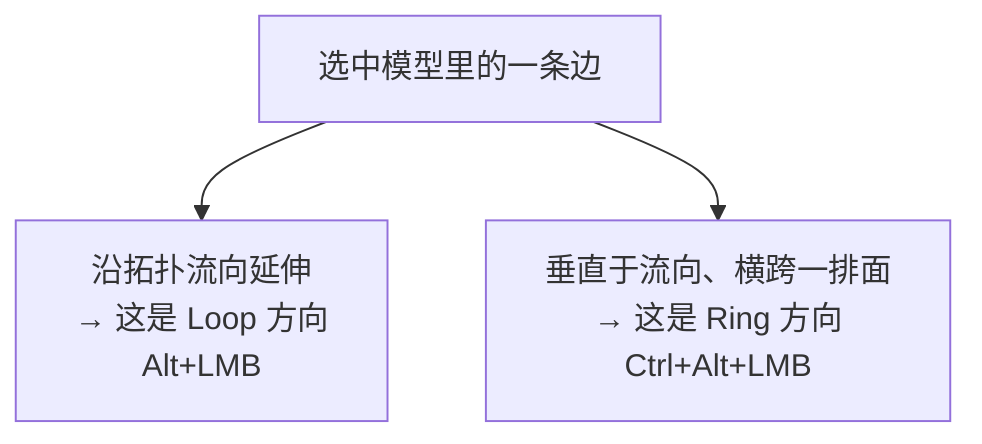
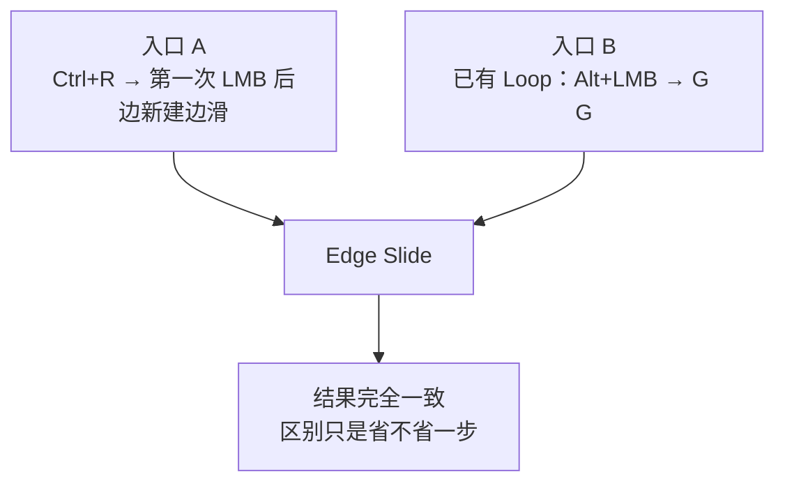
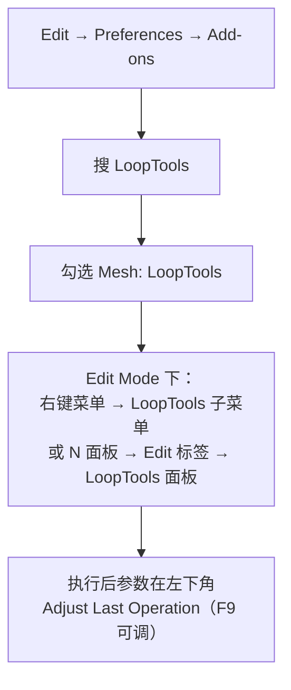
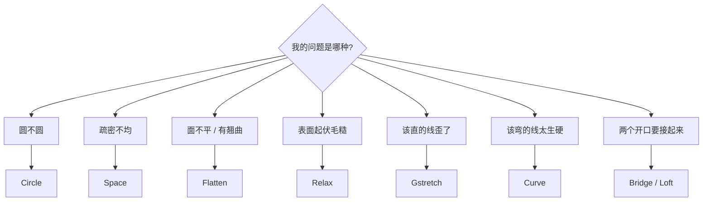
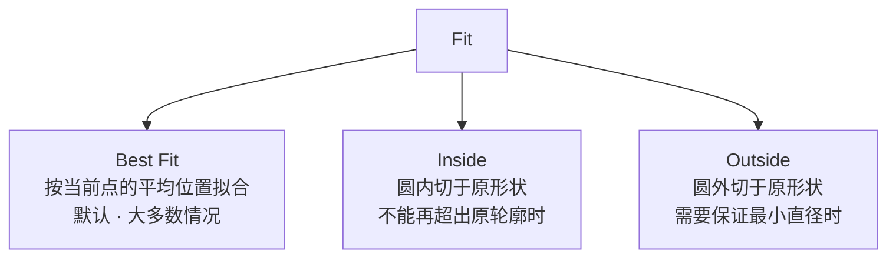

# 02 · Loop / Ring 与边滑动补强 + LoopTools 八件套

> 一句话：**`Ctrl+R` 负责把线加出来，滑动和 LoopTools 负责把线「摆对位置」。** 造型好不好看，八成取决于后者。
> 前置：[`../00-基础/05-环切与拓扑-Ctrl+R.md`](../00-基础/05-环切与拓扑-Ctrl+R.md) 第五、六节（Edge Slide / Loop 与 Ring）
> 本页对 05 篇已有的内容只做一句话回顾，重点讲**它没讲的部分**。

---

## 一、Loop 与 Ring：复习 + 三条补强

### 复习（05 篇第六节已有）

| 概念 | 选择 | 追加选择 |
| ---- | ---- | -------- |
| **Edge Loop** 一条首尾相连的链 | `Alt+LMB` | `Shift+Alt+LMB` |
| **Edge Ring** 一组互相平行的边 | `Ctrl+Alt+LMB` | `Shift+Ctrl+Alt+LMB` |

### 补强 1 · Loop 和 Ring 是「相对的」

同一条边，从这个方向看是 Loop 的一部分，从垂直方向看就是 Ring 的一员。**别背「横的是 loop」，要背「我这次要沿着流走还是横跨过去」。**



| 我想干什么 | 用哪个 |
| ---------- | ------ |
| 整圈收细 / 整圈缩放 / 整圈加线 | **Loop**（`Alt+LMB`） |
| 一排边一起倒角 / 一起缩放 | **Ring**（`Ctrl+Alt+LMB`） |

### 补强 2 · 二次选择 = 选整条边界

对边界边**再按一次** `Alt+LMB`，会选中整条边界。tri 和 n-gon 混合、Loop 选不完整时这招最好用。

### 补强 3 · Face Loop

面模式下 `Alt+LMB` 选的是**面环**（face loop），配合 `Ctrl+Alt+LMB` 可以选面圈。做「一整排面板」「一整圈凹槽」时比边选择更快。

> ⚠️ macOS 触控板：开了 `Emulate 3 Button Mouse` 时 `Alt+LMB` 会被占用，**双击 LMB** 是官方给的替代（05 篇第六节已提醒）。

---

## 二、边滑动 `G G`：三条 05 篇没展开的

> 复习：滑动 = 拓扑不变，只重新分配空间。三开关 `E`（Even）/ `F`（Flip）/ `C`（Clamp），详见 05 篇第五节。

### 1 · `Ctrl+R` 的阶段 2 就是 `G G`



> 所以「先 `Ctrl+R → LMB → RMB` 加到正中，再 `Alt+LMB → G G` 滑到边上」是**绕远路**的。
> 正确做法：`Ctrl+R → LMB → 移动鼠标 → LMB`，一次到位。

### 2 · 顶点也能滑

选中**顶点**后同样可以滑动（Vertex Slide）。修一个点沿着某条边跑偏时比手拖更稳。

> 键位在不同版本/配置下可能变动，**快捷键失效就 `F3` 搜 `Vertex Slide`**，不要死记。

### 3 · `G G` 报错的三种原因（05 篇表格的注音版）

| 报错 | 真正发生了什么 | 判断方法 |
| ---- | -------------- | -------- |
| Invalid selection | 选了**自相交**的 Loop（同一面上选了两条边） | 改用手选一条干净的边再 `Alt+LMB` |
| Invalid selection | 选中的边**跨了多条 Loop** | 逐条 `Alt+LMB` 选，别框选 |
| Invalid selection | 选到了**单面的边界边**（只有一个面相邻） | 换一条两面都有的边 |

---

## 三、LoopTools：八件套

### 先启用



> LoopTools 是**内置**的，但默认没开。找不到入口 90% 是因为没在 Preferences 里勾。

### 八件套一览

| 工具 | 做什么 | 典型场景 | 关键参数 |
| ---- | ------ | -------- | -------- |
| **Circle** ⭐ | 把选中的环变成正圆 | 圆孔、圆柱截面、手动做出来的「歪圆」 | Fit：Best Fit / Inside / Outside；Influence |
| **Space** ⭐ | 沿环**等距**重排顶点 | 「线不均匀」第一解法；栏杆、窗格 | Influence |
| **Flatten** ⭐ | 把选中的点压到同一个平面 | 底面不平、面板翘曲、非共面顶点 | Plane：Best Fit / Normal / View；Influence |
| **Relax** ⭐ | 平滑凹凸，让分布更均匀 | Subdivide 后起伏、手动调乱的面 | 可多次执行；Influence |
| **Curve** | 把折线变成平滑曲线 | 有机过渡、硬边转圆角走线 | Influence；Lock X/Y/Z |
| **Gstretch** | 把一串点拉成一条**直线** | 该直的地方歪了 | Influence |
| **Bridge** | 连接两个（或多个）开口的顶点环 | 补洞、连接两段管 | — |
| **Loft** | 连接多个环并生成一整块面 | 放样、扫描面 | — |



### Circle 的三个 Fit 模式（最容易选错）



> 做「墙上开圆孔」这类有硬尺寸要求的事：**先想清楚这个圆是内切还是外切**，再选 Fit，否则倒角后尺寸会偏。

### Flatten 的三个 Plane 模式

| 模式 | 参考平面 | 什么时候 |
| ---- | -------- | -------- |
| **Best Fit** | 按选中点的平均位置算一个最佳平面 | 默认，绝大多数情况 |
| **Normal** | 沿选中面的平均法线方向压平 | 曲面上开一块平面板 |
| **View** | 按**当前视角**压平 | 想对着屏幕压平（注意：视角一变结果就变） |

---

## 四、四个高频组合（记住这四个就够用 80%）

| # | 场景 | 操作 |
| - | ---- | ---- |
| 1 | **墙上开正圆孔** | 选面 → `I` 内插 → `E` 挤出一点 → 选孔那圈 → LoopTools **Circle** → `I` 再内插 → 删中间面 → 边缘 `Ctrl+B` 倒角 |
| 2 | **一段线疏密不均** | `Alt+LMB` 选整条环 → LoopTools **Space**（Influence 100% 看效果，太狠就降） |
| 3 | **底面不平 / 面板翘** | 选那一片顶点 → LoopTools **Flatten**（Best Fit）→ 再检查一次 |
| 4 | **Subdivide 后表面起伏** | 选区域 → LoopTools **Relax** → 不够就再执行一次（注意别把细节也磨掉） |


---

## 五、坑

- ❌ **Relax 按到爽为止** → 细节会被一起磨平。Influence 别拉满，宁可多按几次小量的
- ❌ **Flatten 用 View 模式** → 你换个视角结果就变了，导出前记得复查
- ❌ **Space 用在有意的渐变疏密上** → 把「故意的密」也匀掉了。渐变节奏是设计，不是错误
- ❌ **Circle 对非闭合的环用** → 结果不可控。先确认选的是一整圈
- ❌ **忘了 LoopTools 要手动启用** → 找半天找不到入口

---

## 六、速查

```text
【选择】
Alt+LMB              边环 Loop
Ctrl+Alt+LMB         边圈 Ring
Shift + 上面两个      追加到已有选区
再按一次 Alt+LMB     选整条边界
面模式 Alt+LMB       面环

【滑动】
Alt+LMB → G G        边滑动（拓扑不变）
滑动中 E / F / C     Even 等距 / Flip 换参照 / Clamp 钳制
顶点滑动             F3 搜 Vertex Slide（键位可能变动）

【LoopTools】
启用：Preferences → Add-ons → Mesh: LoopTools
入口：右键菜单 → LoopTools ｜ N 面板 Edit 标签
参数：左下角 Adjust Last Operation，或 F9

Circle   圆不圆      Fit: Best Fit / Inside / Outside
Space    疏密不均    Influence
Flatten  面不平      Plane: Best Fit / Normal / View
Relax    表面毛糙    Influence（多次小量）
Gstretch 该直的歪了
Curve    该弯的生硬
Bridge / Loft  连接开口
```

---

> **下一步**：[`03-Subdivision修改器与支撑线.md`](03-Subdivision修改器与支撑线.md) —— 线摆对之后，回答「SubD 一开形状会变成什么样」。
