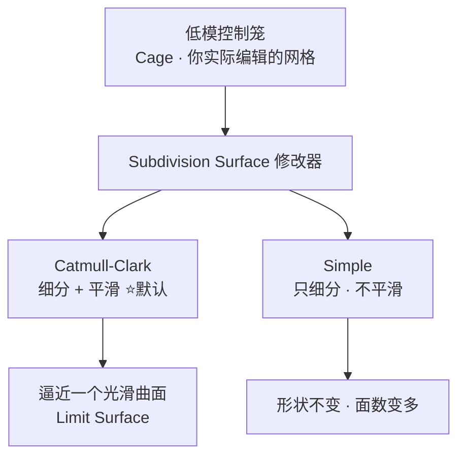
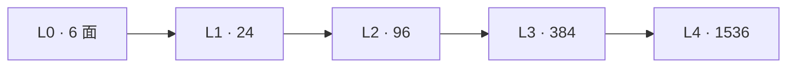
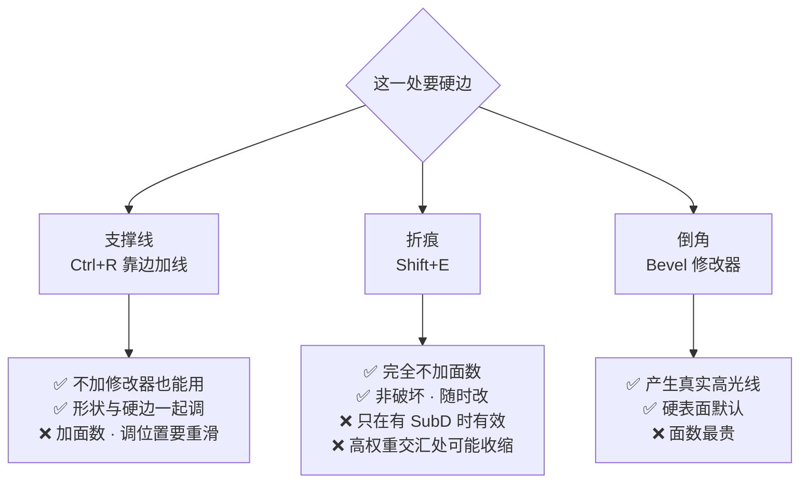
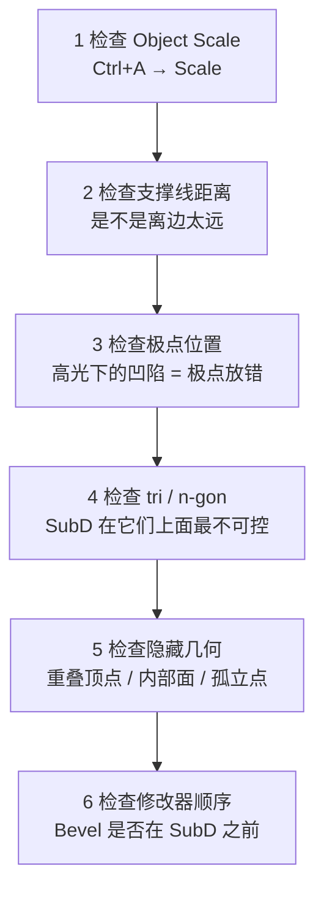

# 03 · Subdivision 修改器与支撑线

> 一句话：**SubD 是一个 ×4ⁿ 的面数放大器；支撑线是站在它前面的方向盘。**
> 前置：[`../00-基础/05-环切与拓扑-Ctrl+R.md`](../00-基础/05-环切与拓扑-Ctrl+R.md) 第七节（支撑线的量化规律）
> 本页补 05 篇没讲的部分：**修改器本身的参数、面数代价、保硬边三方案的取舍、以及崩了以后怎么查。**

---

## 一、Subdivision Surface 修改器是什么



| Type | 行为 | 什么时候用 |
| ---- | ---- | ---------- |
| **Catmull-Clark** | 细分的同时把网格往光滑曲面上拉 | **默认**。有机体、圆角、一切要「光滑」的地方 |
| **Simple** | 只切分，不改变形状 | 需要更多面但不想要平滑时（如配合置换 / 位移、或要保住所有硬边） |

> 常见误解：**「SubD = 让模型更精细」**。错。SubD 的本质是**用低模控制一个光滑曲面**。
> 你编辑的是控制笼，看到的是它逼近出来的曲面。这一点决定了后面所有用法。

---

## 二、面数代价：× 4ⁿ ⭐

**Catmull-Clark 每加一级，面数翻 4 倍。**

| Level | Cube 面数 | 倍率 |
| ----- | --------- | ---- |
| 0（原始） | 6 | 1× |
| 1 | 24 | 4× |
| 2 | 96 | 16× |
| 3 | 384 | 64× |
| 4 | 1,536 | 256× |



### 乘上 Bevel 会怎样（这才是真实场景）

| 做法 | 基础面数 | SubD L2 后 |
| ---- | -------- | ---------- |
| 纯 Cube | 6 | 96 |
| Cube 全边 Bevel 1 段 | 26 | **416** |
| Cube 全边 Bevel 3 段 | 50 | **800** |
| Cube 全边 Bevel 5 段 | 74 | **1,184** |

> ⚠️ 一个「看起来只是个圆角方块」的东西，**Bevel 3 段 + SubD 2 级 = 800 面**。
> 参照路线图 Stage 6 的预算表：环境道具 PC/主机端约 **2,500 tri**。一个方块花掉三分之一预算，这就是面数失控的典型路径。

### 给游戏资产的三条硬规则

1. **视口 Level 可以开 2，但要想清楚最终导出的面数**：导出前要么 Apply（面数就按上表算），要么确认目标引擎/项目接受这个量
2. **Render Levels 与视口 Levels 分开设**：渲染可以更高，但导出/烘焙按实际需要定
3. **SubD 不是免费的细节**：远处看不出的圆角，交给 Normal 贴图，别交给 SubD

---

## 三、参数：只看这四个

| 参数 | 说明 | 建议 |
| ---- | ---- | ---- |
| **Levels** | 视口细分级别 | 编辑时 1–2 就够，太高改不动 |
| **Render** | 渲染级别 | 出图时可 2–3 |
| **Type** | Catmull-Clark / Simple | 默认 Catmull-Clark |
| **Optimal Display** | 只显示控制笼的边，不显示细分产生的内部边 | **做硬表面时开**，线框清爽很多 |

> 还有一个进阶项：**UV Smoothing**（在 Advanced 面板里）控制 UV 是否跟随细分平滑。
> Stage 3 做 UV 时会碰到，本阶段先不动。

---

## 四、支撑线：从「越近越硬」升级到「可预测」

> 05 篇第七节的核心结论：**SubD 后的圆角半径 ≈ 支撑线到边缘的距离。**

```
   d 大（支撑线远离边）          d 小（支撑线贴近边）

   ┌────────────────┐          ┌────────────────┐
   │   │        │   │          │ │            │ │
   └───┼────────┼───┘          └─┼────────────┼─┘
        └─ d ─┘                   └d┘

   SubD 后：                   SubD 后：
      ╭──────╮                    ┃
     ╱        ╲                   ┃
      ╰──────╯                    ┃

   圆角半径 ≈ d（大 → 软）       圆角半径 ≈ d（小 → 硬）
```

### 配方表：想要多大圆角，就知道线加在哪

| 想要的效果 | 做法 |
| ---------- | ---- |
| 半径 R 的圆角 | 在离边缘 **R** 的位置加一条支撑线 |
| 边缘**完全硬**（不倒圆） | 支撑线贴到极近（d → 0），或直接 `Shift+E` 折痕拉满 |
| 边缘**很软** | 支撑线放远（d 大），或不加支撑线 |
| 一个**有宽度的倒角面**（两条棱都要硬） | 加**两条**支撑线，间距 = 想要的倒角面宽度 |

```
单支撑线：                     双支撑线：
┌──────────────┐            ┌──────────────┐
│ │          │ │            │ ││        ││ │
└─┼──────────┼─┘            └─┼┼────────┼┼─┘
  一条线定圆角半径             两条线的间距 = 倒角面宽度
                              两侧各自被撑住 → 倒角面保持平
```

> 这就是为什么硬表面里**支撑线往往是成对的**：单条线给你一个圆角，两条线给你一个「有明确宽度的平面倒角」。

---

## 五、保住硬边：三种方案怎么选



| 维度 | 支撑线 | `Shift+E` 折痕 | Bevel 修改器 |
| ---- | ------ | -------------- | ------------ |
| 面数成本 | 中（每条线 × 4ⁿ） | **0** | **高** |
| 是否需要 SubD | 否 | **是**（无 SubD 时无效） | 否 |
| 非破坏性 | ❌ 改了几何 | ✅ 可随时改 | ✅ |
| 能否产生高光 | 弱 | 无（只是不平滑） | **✅ 强** |
| 最擅长 | 定住大面积结构边界 | 局部补硬、省面 | 镜头会近看的边缘 |

> **业界做法：三者结合。** 主线用支撑线定结构 → 局部细节用 `Shift+E` 补硬 → 镜头近看的边缘用 Bevel 出高光。
> 只认一种方案的，要么面数爆炸，要么高光全无。

---

## 六、修改器顺序 ⭐（错了就是灾难）


> 这条在 [`../00-基础/06-倒角-Bevel.md`](../00-基础/06-倒角-Bevel.md) 第九节策略 C 里有完整推导，那里把它列为排查清单第 1 步。
> **顺序 = Bevel 在上、SubD 在下**（修改器栈从上往下执行）。

---

## 七、SubD 后形状崩了：排查顺序



| 现象 | 原因 | 解法 |
| ---- | ---- | ---- |
| 角全糊了 | 没有支撑线，或离边太远 | 加线 / 往边滑近 |
| 边缘出现莫名的凹陷或凸起 | 极点位置不对 | 把极点挪到边缘或隐蔽处（见 01 篇第四节） |
| 表面有星状痕迹 | 高密度极点（valence ≥ 6） | 重构局部拓扑 |
| 某处被拉伸 | Object Scale ≠ 1 | `Ctrl+A → Scale` |
| 面数突然翻几倍 | Bevel 排在 SubD 之前被细分放大 / Level 加高了 | 查 Level、查顺序 |
| 边缘有锯齿状黑线 | 法线问题 | `Shift+N` 重算；见 04 篇 |
| 形状整体「缩水」 | Catmull-Clark 收敛特性 | 正常现象，靠支撑线抵消 |

---

## 八、自检

| # | 自检点 | 通过标准 |
| - | ------ | -------- |
| ① | 面数直觉 | 随口报出 Cube 在 SubD L1/L2/L3 的面数：**24 / 96 / 384** |
| ② | 圆角可预测 | 给出目标半径，能把支撑线放到对应位置，SubD 后目测吻合 |
| ③ | 双支撑线 | 能做出「有明确宽度的平倒角面」而不是一个圆角 |
| ④ | 三方案取舍 | 给 3 个场景能选对（省面 / 出高光 / 定结构） |
| ⑤ | 顺序 | 不看笔记说出「Bevel 在 SubD 之前」 |
| ⑥ | 会排查 | SubD 崩了能按七节顺序逐项查，而不是删线重来 |

---

## 九、速查

```text
【Subdivision Surface 修改器】
Type:  Catmull-Clark（默认·平滑） / Simple（只细分不变形）
Levels: 视口级别（1–2 就够）
Render: 渲染级别
Optimal Display: 硬表面建议开（只显示控制笼）

【面数】
Catmull-Clark 每级 ×4：  L1=4×  L2=16×  L3=64×  L4=256×
Cube：6 → 24 → 96 → 384 → 1536

【支撑线】
圆角半径 ≈ 支撑线到边缘的距离 d
要硬 → d 小    要软 → d 大
要「有宽度的倒角面」 → 两条支撑线，间距 = 倒角面宽度

【保硬边三选一】
支撑线 Ctrl+R   定结构 · 加面数 · 不依赖修改器
折痕 Shift+E    不加面 · 只在有 SubD 时有效 · 非破坏
Bevel 修改器    出高光 · 面数最贵 · 硬表面默认

【顺序】Bevel → SubD（Bevel 在上）
【排查】Scale → 支撑线距离 → 极点 → tri/n-gon → 隐藏几何 → 顺序
```

---

> **下一步**：[`04-硬边控制四件套-ShadeSmooth-Crease-Sharp-BevelWeight.md`](04-硬边控制四件套-ShadeSmooth-Crease-Sharp-BevelWeight.md) —— SubD 管的是形状，硬边管的是「哪里看起来是硬的」。这是 5.x 改动最大的一块。
