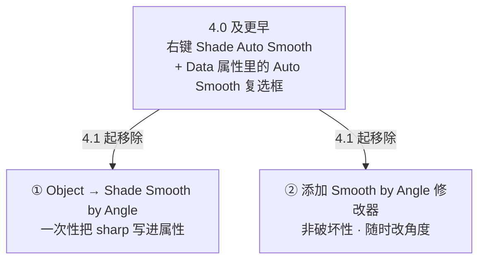
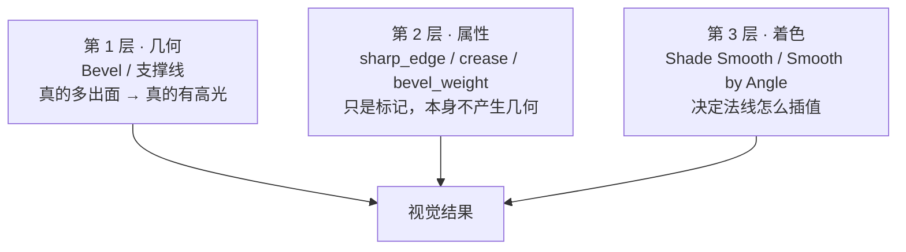
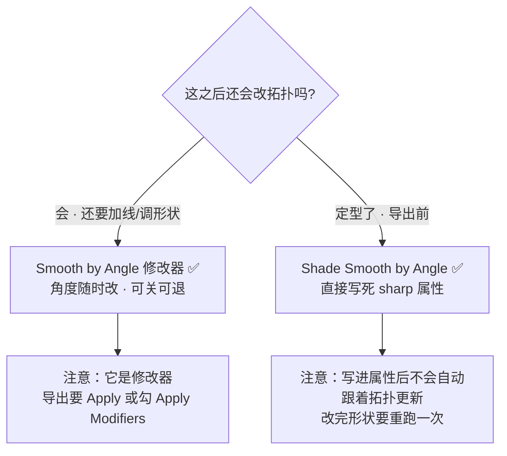
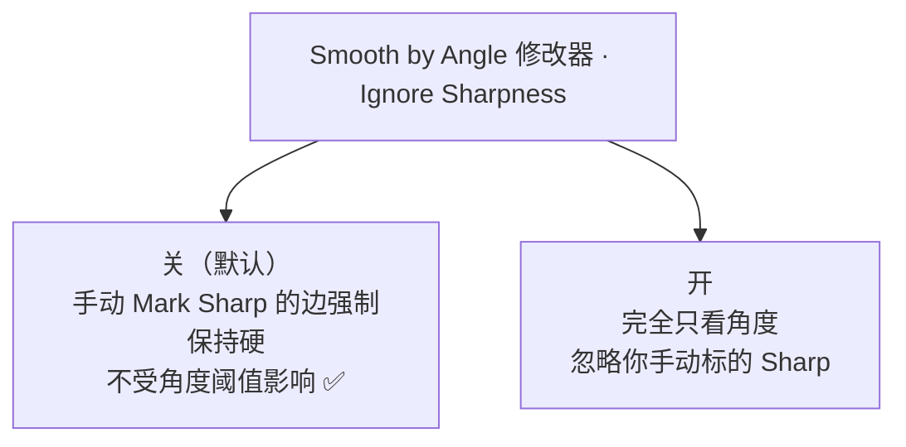
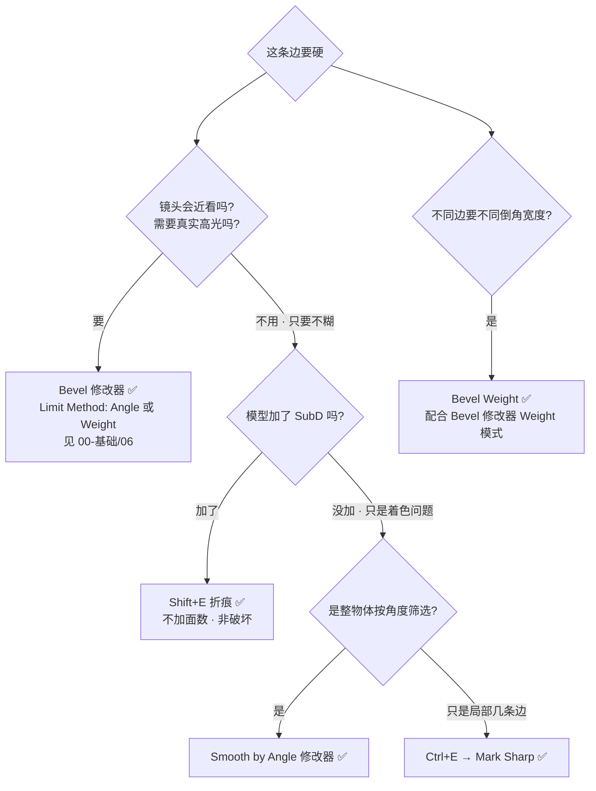
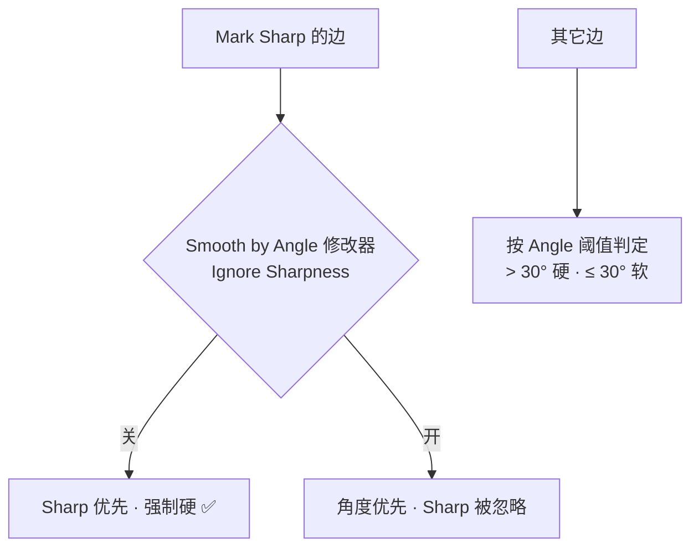

# 04 · 硬边控制四件套（Blender 5.x 新方案）

> 一句话：**「哪里该硬」要分四步想——先看是不是几何问题，再看是哪个属性管着，最后才是着色。**
> ⚠️ **本页包含对路线图 Stage 0 的订正**：`Shade Auto Smooth` 在 4.1 已被移除，见第一节。
> 依据：Blender 4.1 release notes（PR #108014）、官方手册 5.2 LTS（Object Shading / Edge Data / Normals Modifiers）。

---

## 一、5.x 改了什么：Auto Smooth 没了



| 项目 | 4.0 及更早 | **5.2（你现在用的）** |
| ---- | ---------- | ---------------------- |
| 对象菜单项 | `Shade Auto Smooth` | **`Shade Smooth by Angle`** |
| 属性面板开关 | Data → Normals → Auto Smooth 复选框 | **已删除** |
| 非破坏性方案 | 无（开关本身就是数据） | **Smooth by Angle 修改器**（几何节点资产） |
| 默认角度 | 30° | **30°**（两条路默认值一致） |

> **照着老教程学时看到「勾选 Auto Smooth」→ 直接跳过，改用下面第二节的两条路之一。**
> 这也是路线图 Stage 0 清单里「`Shade Auto Smooth` + `Mark Sharp`」需要订正的地方（[`笔记.md`](笔记.md) 第 0 节）。

---

## 二、先建立三层心智模型

硬边不是一个开关，是三层叠加。搞错层 = 改了半天没反应。



| 层 | 手段 | 面数代价 | 能不能反悔 |
| -- | ---- | -------- | ---------- |
| 几何 | Bevel 修改器、支撑线 | 有（Bevel 最贵） | Bevel 非破坏 ✅ |
| 属性 | Mark Sharp / Crease / Bevel Weight | **0** | ✅ 随时清 |
| 着色 | Shade Smooth by Angle / Smooth by Angle 修改器 | **0** | 修改器可退 ✅ |

---

## 三、基线：`Shade Smooth`

> **前提：下面所有「按角度」的方案，都要求物体先被设为 Shade Smooth。** 没做这一步，后面全部看不到效果。

| 操作 | 位置 | 效果 |
| ---- | ---- | ---- |
| `Shade Smooth` | Object 模式，右键菜单 / `Object` 菜单 | 整物体平滑着色（法线插值） |
| `Shade Flat` | 同上 | 整物体平直着色 |


> 硬表面工作流就是：**先全 Smooth，再把该硬的地方挑出来。**
> 反过来（默认 Flat，再手动挑软的地方）在 5.x 里没有对应工具，别走。

---

## 四、四件套：各自管谁

| # | 工具 | 入口 | 写入什么 | **谁读它** | 加面数吗 |
| - | ---- | ---- | -------- | ---------- | -------- |
| ① | **Shade Smooth by Angle** | Object 模式 → `Object` 菜单（一次性 operator） | `sharp_edge` 属性 | 着色；FBX/OBJ 的 smoothing groups | ❌ |
| ①' | **Smooth by Angle 修改器** | Add Modifier → Normals → **Smooth by Angle** | 实时计算（不改原数据） | 着色 | ❌ |
| ② | **Mark / Clear Sharp** | Edit 模式 → `Ctrl+E` 边菜单 → Mark/Clear Sharp | `sharp_edge` 属性 | 着色；**Smooth by Angle 修改器会跳过它们**（除非开 Ignore Sharpness）；Edge Split；Weighted Normal；导出 | ❌ |
| ③ | **Edge Crease** | Edit 模式 → `Shift+E`（或 `Ctrl+E` → Edge Crease） | crease 值 0–1 | **只有 Subdivision Surface 修改器** | ❌ |
| ④ | **Edge Bevel Weight** | Edit 模式 → `Ctrl+E` → Edge Bevel Weight | `bevel_weight_edge` | **只有 Bevel 修改器（Limit Method = Weight）** | ❌ |

> **`Ctrl+E` 是边菜单的通用入口**：没有独立快捷键的边操作（Mark Sharp / Mark Seam / Bevel Weight / Set Sharpness by Angle）都从这儿进。

### ① vs ①'：一次性还是非破坏性



| | Shade Smooth by Angle（operator） | Smooth by Angle（修改器） |
| --- | --- | --- |
| 位置 | Object 菜单 | 修改器面板 |
| 破坏性 | 写进 `sharp_edge` 属性（几何没变，但属性被改） | **完全不动原数据** |
| 改角度 | 重跑一次 | 拖滑块，实时 |
| 参数 | Angle（默认 30°） | Angle（默认 30°）+ **Ignore Sharpness** |
| 导出 | 直接带走 | 需 Apply 或勾 `Apply Modifiers` |

### Ignore Sharpness 这个开关（最容易踩）



> 症状：你明明 Mark Sharp 了一条边，加了 Smooth by Angle 修改器后**它还是软的** → 检查 Ignore Sharpness 是不是被打开了。

### ② Set Sharpness by Angle（编辑模式版）

`Ctrl+E` 边菜单 → **Set Sharpness by Angle**，按相邻面夹角批量写 sharp。

| 参数 | 说明 |
| ---- | ---- |
| Angle | 超过这个角度的边标为 sharp（默认 30°） |
| **Extend** | 新增 sharp 边但**不清除**已有标记（默认关 = 会重算并清掉旧的） |

> 用途：在编辑模式里只想给**选中区域**定硬边，而不是整个物体。

---

## 五、决策树：这里要硬，用哪个



| 场景 | 选谁 | 一句理由 |
| ---- | ---- | -------- |
| 家电外壳的圆角边，镜头很近 | Bevel 修改器 | 高光是真几何才有的 |
| SubD 模型上要保住一条棱，但不想加面 | `Shift+E` | 唯一不加面的 SubD 硬边方案 |
| 一堆面板缝，角度都差不多 | Smooth by Angle 修改器 | 按角度批量，非破坏 |
| 就两三条边要硬，其它都软 | Mark Sharp | 手选最快 |
| 外壳边缘大倒角、内部结构小倒角 | Bevel Weight | Weight 模式才支持分级 |
| 有机模型（角色、抱枕、山坡） | 只要 `Shade Smooth` | 全软，不需要硬边 |

---

## 六、它们怎么互相影响（优先级）



| 组合 | 结果 |
| ---- | ---- |
| Shade Smooth + Smooth by Angle 修改器 | ✅ 硬表面标准配置 |
| Shade Smooth + Mark Sharp（无修改器） | ✅ 也能硬，但要手动标 |
| Mark Sharp + Ignore Sharpness 开 | ❌ 手动标记失效 |
| 没做 Shade Smooth + 任何按角度方案 | ❌ 完全没效果（前提缺失） |
| `Shift+E` 但没有 SubD 修改器 | ❌ 没效果（crease 只被 SubD 读） |
| Bevel Weight 但 Bevel 修改器不是 Weight 模式 | ❌ 没效果 |

---

## 七、导出到引擎会带走什么

| 格式 | sharp / 硬边怎么走 |
| ---- | ------------------- |
| **glTF / GLB** | 主要靠**法线数据**。Blender 里看到的硬边来自 split normals，导出时勾 `Normals` 即可带走（路线图 Stage 6 的 GLB 预设） |
| **FBX / OBJ** | `sharp_edge` 会被导出为 **smoothing groups**（官方手册 Edge Data 明确列出） |
| 修改器方案 | **必须 Apply 或导出勾 `Apply Modifiers`**，否则引擎里拿到的是没处理过的原始网格 |

> ⚠️ 最常见的翻车：在 Blender 里靠 Smooth by Angle **修改器**做出硬边，导出时忘了 Apply → 引擎里整个模型软成一团。

---

## 八、坑

- ❌ **照老教程找 `Shade Auto Smooth`** → 5.x 没有这个按钮，见第一节
- ❌ **没先 `Shade Smooth` 就加 Smooth by Angle 修改器** → 看不到任何变化
- ❌ **Mark Sharp 了但开了 Ignore Sharpness** → 手动标记被无视
- ❌ **用了修改器但导出没 Apply** → 引擎里硬边全丢
- ❌ **`Shift+E` 用在没有 SubD 的模型上** → 白标
- ❌ **Bevel Weight 设了但 Limit Method 不是 Weight** → 白设
- ❌ **把 Sharp 当倒角用** → Sharp 只改法线，不产生高光线。要高光就得真的倒角

---

## 九、自检

| # | 自检点 | 通过标准 |
| - | ------ | -------- |
| ① | 版本差异 | 能说出 5.x 里 `Shade Auto Smooth` 被换成了哪两条路 |
| ② | 前提 | 知道 Smooth by Angle 需要物体先 Shade Smooth |
| ③ | 四件套分工 | 说清 sharp / crease / bevel weight 分别被谁读 |
| ④ | 决策 | 给 4 个场景能选对工具（近景高光 / SubD 省面 / 批量按角度 / 分级倒角） |
| ⑤ | 排错 | 「手动 Sharp 没生效」能在 30 秒内想到 Ignore Sharpness |
| ⑥ | 导出 | 知道修改器方案必须 Apply |

---

## 十、速查

```text
【5.x 硬边方案】
Shade Smooth（前提·Object 菜单）→ 再选下面一条：
  ├ Object → Shade Smooth by Angle      一次性 · Angle 默认 30°
  ├ Add Modifier → Normals → Smooth by Angle   非破坏 · Angle + Ignore Sharpness
  └ Ctrl+E → Mark/Clear Sharp           局部手选

【Ctrl+E 边菜单（5.2）】
Mark/Clear Sharp          硬边标记（也影响 Edge Split / 导出 smoothing groups）
Mark/Clear Seam           UV 缝合边（Stage 3）
Edge Bevel Weight         倒角权重（只影响 Bevel 修改器 Weight 模式）
Edge Crease / Shift+E     折痕（只影响 Subdivision Surface）
Set Sharpness by Angle    按角度批量写 sharp（Angle + Extend）

【谁读谁】
sharp_edge        → 着色 / Smooth by Angle（Ignore Sharpness 关时跳过）/ Edge Split / 导出
crease            → 只有 Subdivision Surface
bevel_weight_edge → 只有 Bevel 修改器（Limit Method = Weight）

【决策】近景高光→Bevel ｜ SubD 省面→Shift+E ｜ 批量→Smooth by Angle ｜ 局部→Mark Sharp ｜ 分级宽度→Bevel Weight
【导出】修改器方案必须 Apply ｜ glTF 走法线 ｜ FBX/OBJ 走 smoothing groups
```

---

> **下一步**：[`05-拓扑体检与清理.md`](05-拓扑体检与清理.md) —— 硬边搞定了，最后一步是证明这个模型真的没问题。
