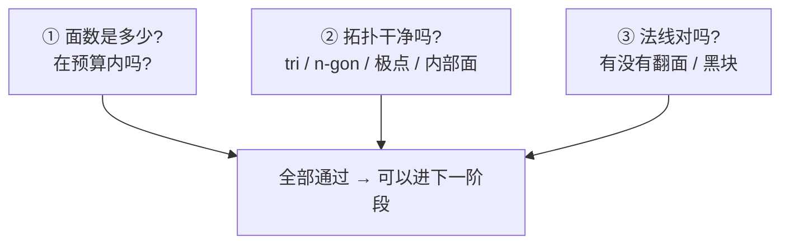
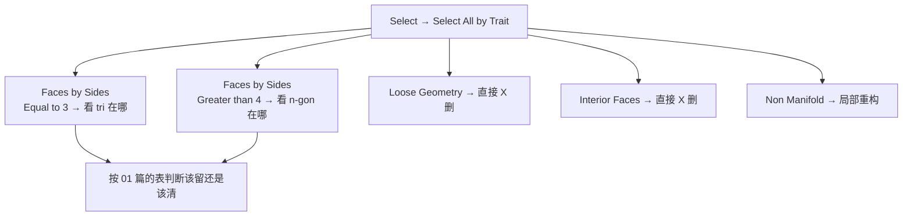
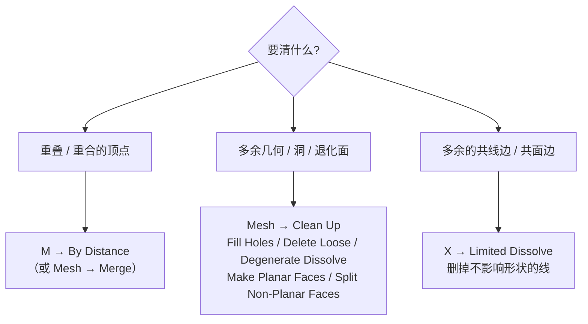
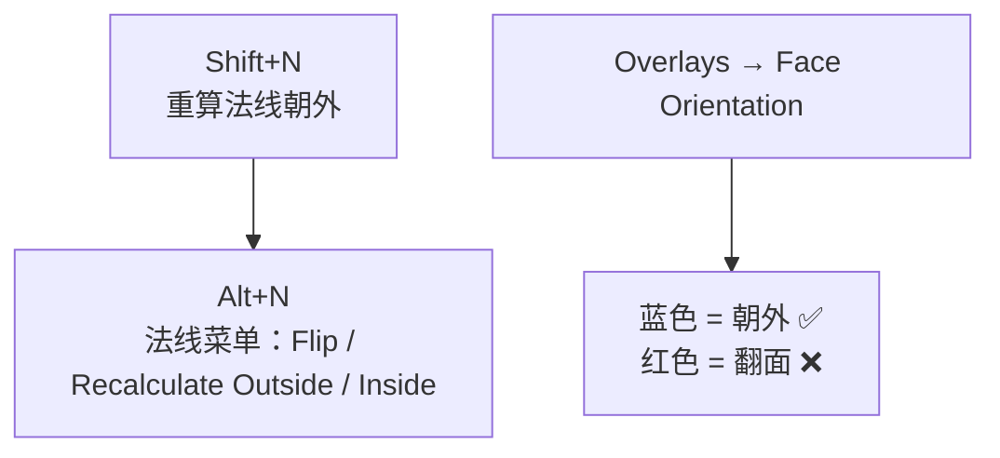
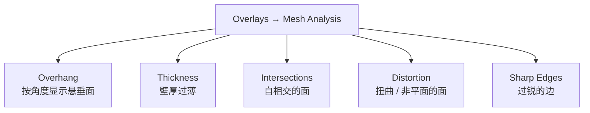
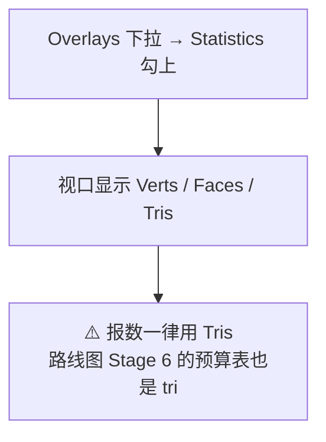

# 05 · 拓扑体检与清理

> 一句话：**做完不等于做对。每个模型交付前都要过一遍这份清单，让它自己证明自己没问题。**
> 前置：[`01-拓扑质量标准`](01-拓扑质量标准-Quad-极点-布线.md)（知道什么算问题）
> 已按 Blender 5.2 LTS 官方手册（Mesh Analysis / Clean Up / Select All by Trait）校准。

---

## 一、体检三问



---

## 二、找问题：用 Trait 选择把「坏东西」全选出来

`Select → Select All by Trait`（找不到就 `F3` 搜 `Select All by Trait`）是本阶段最值钱的一个入口。

| 选项 | 选出什么 | 看到结果说明 |
| ---- | -------- | ------------ |
| **Faces by Sides** | 按面边数筛选 | `Equal to 3` = 全部 Tri；`Greater than 4` = 全部 N-gon |
| **Loose Geometry** | 与主体不相连的孤立点 / 边 / 面 | 有选中 = 有多余几何，删掉 |
| **Interior Faces** | 埋在模型内部的面 | 有选中 = 白占面数，删掉 |
| **Non Manifold** | 无法判定内外的几何 | 有选中 = 布尔/镜像最容易留的坑 |



> **用法技巧**：选出来之后按 `H`（隐藏未选中）反而更方便——先**反选**（`Ctrl+I`）再隐藏，只留下问题面，逐个处理。

---

## 三、清问题：三条清理通道



| 操作 | 作用 | 什么时候用 |
| ---- | ---- | ---------- |
| **`M → By Distance`** | 合并距离极近的顶点 | **每次挤出/布尔/镜像之后都要跑一次**。默认阈值很小，需要时调大 |
| **Fill Holes** | 补洞 | 有破面时 |
| **Delete Loose** | 删孤立几何 | Trait 选出 Loose 之后 |
| **Degenerate Dissolve** | 删零面积面 / 零长度边 | 布尔之后常见 |
| **Make Planar Faces** | 把面压平 | 面板轻微翘曲 |
| **Split Non-Planar Faces** | 把非平面面切开 | SubD 前处理大 n-gon |
| **`X → Limited Dissolve`** | 删掉共线/共面的多余边 | 加线加多了，想减面 |

> 5.x 菜单位置可能有调整，**找不到就用 `F3` 搜命令名**（路线图第 1 节原话，这条在清理操作上特别实用）。

---

## 四、法线：黑块和奇怪的明暗都查这里



| 症状 | 原因 | 解法 |
| ---- | ---- | ---- |
| 一片黑面 / 明暗错乱 | 法线翻转 | `A` 全选 → `Shift+N` |
| 单个面朝里 | 那个面翻了 | 选中 → `Alt+N → Flip` |
| 导出后引擎里一片黑 | 导出前没重算 | `Shift+N` 后再导出 |

> **把 `Face Orientation` 叠加拿进日常习惯**：一眼就能看出红色（朝内）的面，比等渲染出问题再查快十倍。

---

## 五、Mesh Analysis：官方的体检仪

`Header → Overlays → Mesh Analysis`（**只在 Edit Mode + Solid 着色下显示**）。



| 模式 | 对游戏资产有没有用 |
| ---- | ------------------ |
| Overhang / Thickness / Sharp Edges | 官方说这几种主要面向 **3D 打印**，游戏资产用不上 |
| **Intersections** | ✅ **有用**：自相交会让烘焙和布尔全乱 |
| **Distortion** | ✅ **有用**：扭曲面 = 三角化未定义 = 法线/UV 隐患（见 01 篇理由 3） |

> 显示规则：高值红、低值蓝、范围外灰色。开之前记得切到 Edit Mode + Solid。

---

## 六、面数怎么看（用三角形数，不是四边形数）



| 概念 | 说明 |
| ---- | ---- |
| Faces | Blender 里显示的是**面**（一个 quad 算 1） |
| **Tris / 三角形数** | 引擎实际渲染的量（一个 quad = 2 tri） |
| 换算 | 全 quad 网格：**tri ≈ faces × 2** |

> **报面数时永远说 tri**。说「我这个箱子 400 面」，实际上是 800 tri——差一倍，会直接决定要不要减面。

---

## 七、交付前体检清单（复制去用）

```
[ ] Ctrl+A → Apply Rotation & Scale（Scale = 1,1,1）
[ ] 原点位置合理（道具：底部中心；门：铰链处）
[ ] M → By Distance 已跑，无重叠顶点
[ ] Select All by Trait → Loose Geometry：无选中
[ ] Select All by Trait → Interior Faces：无选中
[ ] Select All by Trait → Non Manifold：无选中
[ ] Faces by Sides：tri / n-gon 都在「允许留」的位置（按 01 篇的表判断）
[ ] Shift+N 重算法线；Face Orientation 无红色
[ ] SubD 2 级下转一圈：无星状凹陷、无局部崩坏
[ ] 面数（tri）在预算内，且能说出面数花在哪
[ ] 修改器顺序正确（Bevel 在 SubD 之前）
[ ] 导出前：修改器已 Apply，或导出勾 Apply Modifiers
```

> 后半段和路线图 Stage 6 的「导出前检查清单」是同一套。**从 Stage 0 就按这个标准交**，到 Stage 6 就不用返工。

---

## 八、常见病的诊断表

| 现象 | 可能原因 | 先查这个 |
| ---- | -------- | -------- |
| 面数比预期高很多 | 内部面 / 重复几何 / SubD Level 过高 | Trait → Interior Faces；查 SubD Level |
| 选中一个面，动了一大片 | 有重叠顶点 | `M → By Distance` |
| SubD 后局部塌陷 | 内部面或重叠点 | 上面两条 |
| 布尔后一堆碎面 | 布尔残留 | Degenerate Dissolve + 手动重构（Stage 1 会细讲） |
| 渲染出黑块 | 法线翻转 / 自相交 | `Shift+N`；Mesh Analysis → Intersections |
| 加不进线（`Ctrl+R` 断） | tri / n-gon / pole | 01 篇第六节 |
| 导出后比例不对 | 没 Apply Scale | `Ctrl+A → Scale` |

---

## 九、速查

```text
【找问题 · Select → Select All by Trait】
Faces by Sides      Equal to 3 = Tri ｜ Greater than 4 = N-gon
Loose Geometry      孤立几何 → 删
Interior Faces      内部面   → 删
Non Manifold        非流形   → 重构

【清问题】
M → By Distance         合并重叠顶点（每次布尔/挤出/镜像后都跑）
X → Limited Dissolve    删多余共线/共面边
Mesh → Clean Up         Fill Holes / Delete Loose / Degenerate Dissolve
                        Make Planar Faces / Split Non-Planar Faces
找不到命令 → F3 搜名字

【法线】
Shift+N              重算朝外
Alt+N                Flip / Recalculate Outside / Inside
Overlays → Face Orientation   蓝=外 ✅ 红=内 ❌

【Mesh Analysis】Header → Overlays → Mesh Analysis（Edit Mode + Solid）
  游戏资产看这两个：Intersections / Distortion
  其余（Overhang/Thickness/Sharp Edges）主要服务 3D 打印

【面数】Overlays → Statistics；报数一律用 Tris
```

---

> **下一步**：[`06-练习项目-圆角立方体到音箱.md`](06-练习项目-圆角立方体到音箱.md) —— 把前五篇全部用一遍。
