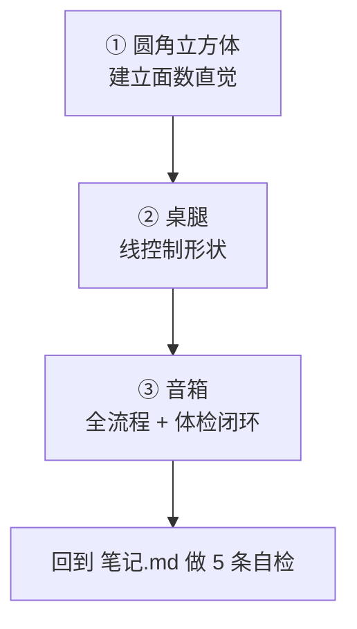
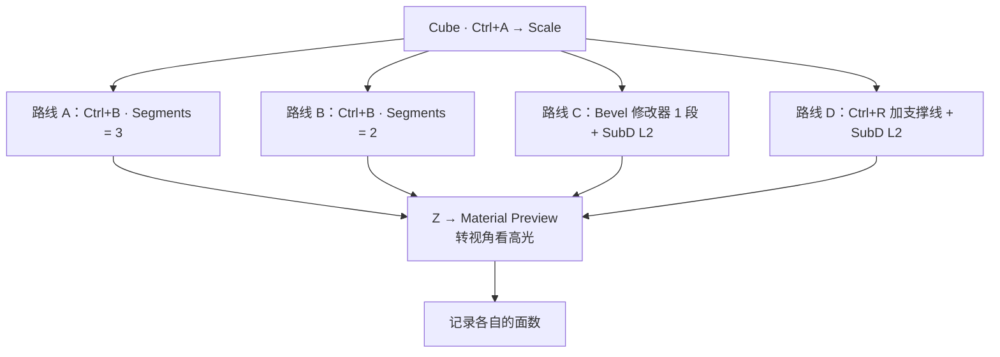
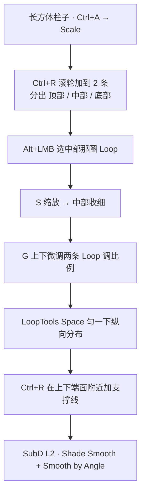
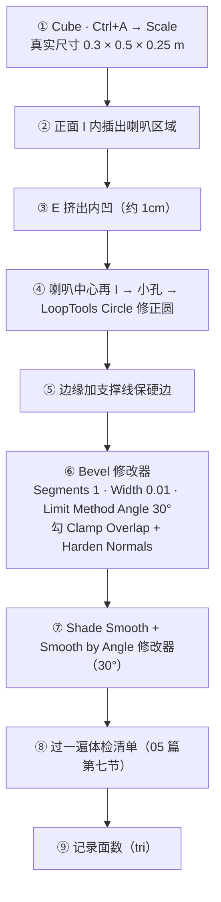
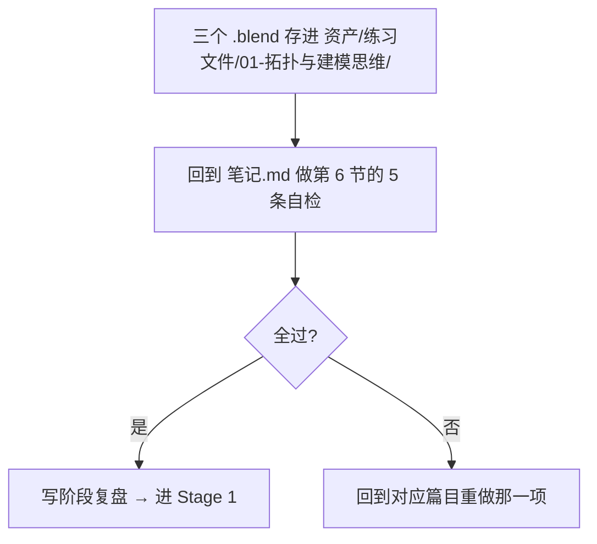

# 06 · 练习项目：圆角立方体 → 桌腿 → 音箱

> 一句话：**前面五篇的知识，在这三个练习里各用一遍。** 做完不记录面数 = 白做。
> 文件统一存到 [`../../资产/练习文件/01-拓扑与建模思维/`](../../资产/练习文件/)，命名：`S0-01_RoundedCube.blend` / `S0-02_TableLeg.blend` / `S0-03_Speaker.blend`

---

## 总览

| # | 项目 | 主要练什么 | 目标面数 | 完成度 |
| - | ---- | ---------- | -------- | ------ |
| 1 | 圆角立方体 | SubD 面数代价、三种做法对比、高光判据 | **记录**三种做法的面数 | ⬜ |
| 2 | 桌腿 | 支撑线的位置语义、LoopTools 匀线 | ≤ 300 tri | ⬜ |
| 3 | **音箱**（验收项目） | 全流程闭环 + 体检 | ≤ 1500 tri | ⬜ |



> 每个练习做完都记一行：做法 / 面数（tri）/ 崩在哪 / 怎么救。这张表是本阶段真正的产出物。

---

## 练习 1 · 圆角立方体（建立面数直觉）

### 步骤



| 路线 | 操作 | 基础面数 | 最终面数（tri） |
| ---- | ---- | -------- | --------------- |
| A | `Ctrl+B` Segments = 3 | 50 | 100 |
| B | `Ctrl+B` Segments = 2 | 38 | 76 |
| C | Bevel 修改器 1 段 + SubD **L2** | 26 → ×16 | **832** |
| D | 支撑线 + SubD L2 | 自己数 | 自己算 |

> 路线 D 的做法：在每个面的边缘附近各加一圈 `Ctrl+R`（离边越近 → 越硬），再叠 SubD。
> 这是 05 篇「纯 SubD + 支撑线」策略的实操，重点体会**滑动那一两毫米带来的硬度变化**。

### 观察高光（唯一判据）

```
Z → Material Preview → 转视角让光扫过边缘
  没有高光      → 倒角太小 或 Segments 太少
  高光太宽      → 倒角太大
  高光断断续续  → 面有问题（法线 / 扭曲面）
```

### 应该得出的结论

1. **同一个视觉圆角，路线 A（纯 Bevel 3 段）只要 100 tri，路线 C 要 832 tri** —— 差 8 倍
2. 所以：**小物件 + 全倒角，别叠 SubD**。SubD 的价值在**大面积曲面**，不在方块圆角
3. 路线 D（支撑线）面数介于两者之间，且**可迭代性最好**——改个位置就能调硬度

### 做崩了

| 现象 | 原因 | 解法 |
| ---- | ---- | ---- |
| 角上炸开、面扭曲 | Miter 处理不了三角交汇 | Bevel 的 Miter 换 Arc / Patch（见 `00-基础/06` 第七节） |
| 倒角溢出穿模 | Width 大于相邻面尺寸 | 勾 Clamp Overlap |
| 加了 SubD 后变糊 | 顺序反了 / 倒角太窄 | Bevel 在 SubD 之前；加大 Width |
| 面数失控 | Segments 手滑滚到 8 | 用修改器的数值框，别用 `Ctrl+B` 滚轮 |

---

## 练习 2 · 桌腿（「线控制形状」）

### 步骤



| 步骤 | 为什么这么做 |
| ---- | ------------ |
| `Ctrl+R` **2 条** | 要 3 段，只需要 2 条分割线（05 篇第十节） |
| `Alt+LMB` 选**整圈** | 只选一条边会收歪 |
| 用 `S` 不用 `G` | `S` 是收细，`G` 是位移 |
| LoopTools **Space** | 手动加的线往往疏密不均，一键匀开 |
| 端面附近加支撑线 | 保住上下端面的硬边（`03` 篇第四节） |

### 验收

- [ ] 侧视轮廓是「上粗 / 中细 / 下粗」，过渡自然
- [ ] SubD L2 后**上下端面仍然平**、边缘不糊
- [ ] 面数 ≤ 300 tri
- [ ] 能说出每一步「为什么在这加线」

### 做崩了

| 现象 | 原因 | 解法 |
| ---- | ---- | ---- |
| 收腰收歪了 | 只选了一条边 | `Alt+LMB` 选整圈再 `S` |
| 端面变圆了 | 端面附近没支撑线 | 靠近端面加一圈 `Ctrl+R` |
| 中段有棱 | 两条 Loop 太集中 | `G G` 滑开，或 Space 匀一下 |
| SubD 后整体缩水 | Catmull-Clark 正常收敛 | 靠支撑线抵消（`03` 篇第四节） |

---

## 练习 3 · 音箱（本阶段验收项目）

### 流程



### 关键参数

| 项 | 值 | 说明 |
| -- | -- | ---- |
| 尺寸 | 0.3 × 0.5 × 0.25 m | 真实尺寸，别用默认 2m（`00-基础` 已强调） |
| Bevel Segments | **1** | 游戏资产默认（`00-基础/06` 第二节） |
| Bevel Width | 0.01（1cm） | 按镜头距离定：中景 1–2mm 就够，近距离才到 5mm |
| Limit Method | **Angle 30°** | 硬表面起手式 |
| Clamp Overlap | ✅ 开 | 密集细节必开 |
| Harden Normals | ✅ 开 | 硬表面必开 |
| SubD | **不开，或只开 L1** | 见下面的面数警告 |

### ⚠️ 面数警告（本练习最重要的一课）

```
Cube 6 面
→ Inset + Extrude 做喇叭后        ≈ 30–40 面
→ Bevel 修改器 1 段（Angle 30°）   ≈ 60–90 面
→ SubD L2（×16）                  ≈ 1,000–1,400 面 → 2,000–2,800 tri ❌
```

> 一个音箱冲到 2,800 tri，已经超过路线图给环境道具 PC/主机端 **2,500 tri** 的预算。
> **所以本练习不要叠 SubD L2。** 想让边缘圆润，靠 **Bevel 2 段** 或 **Bevel 1 段 + SubD L1**。
> 这就是 `03` 篇第二节「×4ⁿ 放大器」的真实代价——不是理论，是一个音箱就爆给你看。

### 验收（逐条打勾）

- [ ] 不看教程能复现整个流程
- [ ] 边缘**有清晰高光**（Material Preview 下转视角确认）
- [ ] 喇叭内凹处没有黑块（法线正确）
- [ ] 支撑线位置：边缘锐利、平面平滑 —— 两种质感同时存在
- [ ] 体检清单全过（无内部面 / 无孤立几何 / 法线朝外 / 无重叠顶点）
- [ ] **面数 ≤ 1500 tri**，且能说出面数主要花在哪一步

### 做崩了

| 现象 | 原因 | 解法 |
| ---- | ---- | ---- |
| 内凹处一片黑 | 法线翻了 | `A` → `Shift+N` |
| 圆孔不圆 | 手动加线的圆总会歪 | LoopTools **Circle**（Fit 选 Best Fit） |
| 倒角把平面上的线也倒了 | Limit Method 用了 None | 改 **Angle** |
| 边缘该硬的地方被倒圆 | 角度阈值太小 | Angle 调到 40–60° |
| 面数超标 | SubD 级别太高 | 降到 L1 或干脆不开 |
| 导出/Apply 后倒角没了 | 修改器没 Apply | Apply 或导出勾 `Apply Modifiers` |

---

## 记录表（每做完一个练习填一行）

| 项目 | 做法要点 | 面数（tri） | 崩在哪 | 怎么救 | 下次注意 |
| ---- | -------- | ----------- | ------ | ------ | -------- |
| 圆角立方体 | | | | | |
| 桌腿 | | | | | |
| 音箱 | | | | | |

---

## 三个练习做完之后



> 复盘里至少写下：**你原本以为对的、但做完发现错了的一件事**。那才是这个阶段真正学到的东西。

---

> **下一步**：回到 [`笔记.md`](笔记.md) 第 6 节做自检，通过后进 **Stage 1 · 硬表面建模工作流**（[`../02-硬表面建模工作流/笔记.md`](../02-硬表面建模工作流/笔记.md)）。
