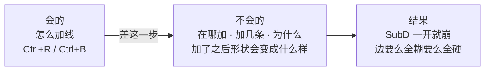
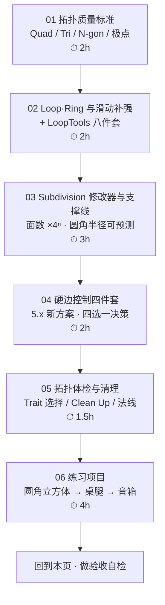

# Stage 0 · 拓扑与建模思维补齐（10–14h）

> **一句话目标**：把「会按 Ctrl+R」升级成「知道该在哪加线、加几条、为什么」。
> 状态：⬜ 未开始　|　开工：　　　|　完成：
> 环境：**Blender 5.2 LTS** · macOS　|　前置：`00-基础` 已通，尤其 [`05-环切与拓扑-Ctrl+R.md`](../00-基础/05-环切与拓扑-Ctrl+R.md)

---

## 0. ⚠️ 先订正：路线图 Stage 0 里有两条已经过时

照着路线图学之前先看这张表，否则你会去右键菜单里找一个**已经被删掉的按钮**。

| # | 路线图 / 本目录旧稿的说法 | **5.2 的实际情况** | 依据 |
| - | ---------------------- | ------------------ | ---- |
| 1 | Subdivision Surface 修改器 + `Shade Auto Smooth`（对象右键菜单） | **`Shade Auto Smooth` 在 4.1 已被移除**。现在有两条路：① `Object → Shade Smooth by Angle`（一次性把 sharp 写进属性）；② 添加 **Smooth by Angle 修改器**（非破坏性，Angle 默认 30°） | Blender 4.1 release notes（PR #108014）／官方手册 Object Shading 与 Normals 修改器 |
| 2 | 法线控制：`Shade Auto Smooth` + `Mark Sharp`（都在 `Ctrl+E` 边菜单） | **前半句过时，后半句仍然对**。Mark Sharp / Clear Sharp 依然在 `Ctrl+E` 边菜单里，快捷键语义不变 | 官方手册 Edge Data（5.2 LTS） |

> **一句话记忆**：老教程里出现「勾选 Auto Smooth 复选框」的地方，**在 5.x 里全部没有这个开关了**，一律换成 `Shade Smooth by Angle`。
> 详细对照见 [`04-硬边控制四件套.md`](04-硬边控制四件套-ShadeSmooth-Crease-Sharp-BevelWeight.md)。
>
> 📌 这两条也建议同步回 `Blender学习路线图.md` 的 Stage 0 清单（路线图第 108–110 行）。

---

## 1. 本阶段在解决什么问题

`00-基础` 你已经会了「怎么按」，`Ctrl+R` 也按得动。但从路线图的定位看，你缺的是**判断力**：

所以本阶段**不新增工具量**，只做三件事：

1. 建立「什么样的拓扑叫好」的判据（能自己给自己打分）
2. 把 SubD 后的形状变成**可预测**的（支撑线距离 = 圆角半径）
3. 把硬边控制从「碰运气」变成**四选一的决策**

---

## 2. 学习路径（按顺序走完就是闭环）

| # | 文件 | 核心问题 | 预估 |
| - | ---- | -------- | ---- |
| 01 | [`01-拓扑质量标准-Quad-极点-布线.md`](01-拓扑质量标准-Quad-极点-布线.md) | 什么样的网格算「干净」 | 2h |
| 02 | [`02-Loop-Ring与边滑动补强-LoopTools.md`](02-Loop-Ring与边滑动补强-LoopTools.md) | 线不均匀、圆不圆怎么办 | 2h |
| 03 | [`03-Subdivision修改器与支撑线.md`](03-Subdivision修改器与支撑线.md) | SubD 之后形状能不能预测 | 3h |
| 04 | [`04-硬边控制四件套-ShadeSmooth-Crease-Sharp-BevelWeight.md`](04-硬边控制四件套-ShadeSmooth-Crease-Sharp-BevelWeight.md) | 哪里该硬、哪里该软，用什么控制 | 2h |
| 05 | [`05-拓扑体检与清理.md`](05-拓扑体检与清理.md) | 做完怎么证明它没问题 | 1.5h |
| 06 | [`06-练习项目-圆角立方体到音箱.md`](06-练习项目-圆角立方体到音箱.md) | 把上面 5 篇用一遍 | 4h |

> 合计约 **12–14.5h**，落在路线图 10–14h 的上沿。**03 和 06 不要压缩**——前者是本阶段的灵魂，后者是唯一能证明你学会了的东西。

---

## 3. 必学清单

> 判断标准不是「我看过了」，而是「不看教程能当场做出来 / 说出来」。每条后面标了出处。

### 模块 1 · 拓扑质量标准（[01](01-拓扑质量标准-Quad-极点-布线.md)）

- [ ] 能说出 **Tri / N-gon 各自「可以留」和「必须清」的位置**
- [ ] 认得出 **E-pole（5 条边）** 与 **N-pole（3 条边）**，并判断它出现在那里合不合理
- [ ] `Ctrl+R` 断环时，能到断点上找出 tri / n-gon / pole 并修掉（而不是硬切）
- [ ] 说出「游戏资产为什么还是 quad 建模」——答案不是「引擎要 quad」（见 01 篇第一节）

### 模块 2 · Loop / Ring 与滑动补强（[02](02-Loop-Ring与边滑动补强-LoopTools.md)）

- [ ] `Alt+LMB` 选环 / `Ctrl+Alt+LMB` 选圈 / 加 `Shift` 追加选择
- [ ] `G G` 边滑动，并会用 `E`（Even）/ `F`（Flip）/ `C`（Clamp）三个开关
- [ ] **LoopTools 八件套**：至少熟练 Circle / Space / Flatten / Relax 四个
- [ ] 知道 LoopTools 在哪（`Preferences → Add-ons` 里要先勾；之后走右键菜单或 `N` 面板 Edit 标签）

### 模块 3 · Subdivision 与支撑线（[03](03-Subdivision修改器与支撑线.md)）

- [ ] Catmull-Clark 与 Simple 的区别，各自什么时候用
- [ ] 记住 **面数 × 4ⁿ**（Level 2 = 16 倍）——所有面数失控都从这里查起
- [ ] **支撑线距离 ≈ SubD 后的圆角半径**，能按目标半径反推该把线加在哪
- [ ] `Shift+E` 折痕与支撑线的取舍
- [ ] Bevel 必须排在 SubD **之前**（顺序反了是灾难）

### 模块 4 · 硬边控制四件套（[04](04-硬边控制四件套-ShadeSmooth-Crease-Sharp-BevelWeight.md)）

- [ ] 5.x 方案：`Shade Smooth` + `Shade Smooth by Angle`（或 Smooth by Angle 修改器）
- [ ] `Ctrl+E → Mark/Clear Sharp`、`Edge → Set Sharpness by Angle` 的差别
- [ ] `Shift+E` Crease 只影响 SubD；`Ctrl+E → Edge Bevel Weight` 只影响 Bevel 修改器的 Weight 模式
- [ ] 面对「这里要硬」能走一遍决策树，四选一

### 模块 5 · 拓扑体检（[05](05-拓扑体检与清理.md)）

- [ ] `Select → Select All by Trait`：Faces by Sides / Loose Geometry / Interior Faces / Non Manifold
- [ ] `Mesh → Clean Up` 各项 + `M → By Distance` + `Shift+N`
- [ ] Overlays → **Mesh Analysis**（5 种模式，Edit Mode + Solid 下才显示）

### 模块 6 · 练习（[06](06-练习项目-圆角立方体到音箱.md)）

- [ ] 圆角立方体：三种做法，能报出各自面数
- [ ] 桌腿：只用 `Ctrl+R / Alt+LMB / S / G` 做出收腰
- [ ] 音箱：走完全流程并过一遍体检清单

---

## 4. 时间怎么切（10–14h 拆成 6 段）

| 段 | 内容 | 产出 |
| - | ---- | ---- |
| ① | 读 01，拿现成的一个模型数 tri / n-gon / pole | 一张「问题点截图 + 数量」 |
| ② | 读 02，把一段歪七扭八的 Loop 用 Space / Circle / Relax 修好 | 修前修后对比 |
| ③ | 读 03 上半：SubD 参数、面数 ×4ⁿ | 记录 Cube 各 Level 面数 |
| ④ | 读 03 下半 + 04：支撑线配方表 + 硬边决策树 | 一张自己画的决策树 |
| ⑤ | 读 05，给 06 的第一个练习做体检 | 体检清单打勾版 |
| ⑥ | 做 06 的三个练习 | 三个 .blend + 面数记录 |

> 单次动手不超过 **45 分钟**就起来动一动。建模是手眼协调活，疲劳后做的东西第二天基本要返工（路线图第 4 节的原话，这条在 Stage 0 尤其灵——你现在练的是判断力，不是手速）。

---

## 5. 练习项目

| # | 项目 | 要点 | 目标面数 | 完成度 |
| --- | --- | --- | --- | --- |
| 1 | 圆角立方体 | Cube → Bevel 3–4 段 → 观察高光 → **对比 Bevel 1 段 + SubD 2 级**的做法 | 记录三种做法的面数 | ⬜ |
| 2 | 桌腿 | 长方体 → `Ctrl+R` ×2 → `Alt+LMB` 选中段 → `S` 收腰 → LoopTools 匀线 | ≤ 300 tri | ⬜ |
| 3 | **音箱**（验收项目） | Inset 喇叭面 → Extrude 内凹 → Bevel 边缘 → SubD → 支撑线保硬边 → 体检 | ≤ 1500 tri | ⬜ |

> 详细步骤、参数与「做崩了怎么救」见 [`06-练习项目-圆角立方体到音箱.md`](06-练习项目-圆角立方体到音箱.md)。

---

## 6. 验收标准（可判定，不是感觉）

- [ ] **3 分钟挑战**：不看教程，把 Cube 做成**边缘锐利但整体平滑**的圆角方块
- [ ] 能指着模型说出「这个角糊了，因为支撑线离边太远」，并**当场滑近、肉眼看到变化**
- [ ] 面对「这条边要硬」，能在 10 秒内说出该用四件套里的哪一个
- [ ] 体检清单（05 篇）**逐条打勾**：无内部面、无孤立几何、无重叠顶点、法线朝外
- [ ] 报得出自己三个练习的**三角形数**，且能说出面数花在哪

### 5 条自检（全部通过才算 Stage 0 完成）

| # | 自检点 | 怎么判定 |
| - | ------ | -------- |
| ① | 圆角可预测 | 说目标「圆角半径 3mm」，能把支撑线放到对应位置，SubD 后目测吻合 |
| ② | 面数有直觉 | 随口报出 Cube 在 SubD Level 1/2/3 下的面数（**24 / 96 / 384**） |
| ③ | 硬边四选一 | 给出 4 个场景（有机曲面 / 平面倒角 / SubD 硬边 / 分级倒角），能选对工具 |
| ④ | 断环会修 | 故意在模型里放一个 n-gon，能自己找出并清掉 |
| ⑤ | 闭环 | 三个练习都过了体检，且文件已存进 `资产/练习文件/01-拓扑与建模思维/` |

---

## 7. 常见坑

> 前三条是路线图原有的，后五条是本阶段补充的。够通用的坑应该同步到 [`速查/常见坑汇总.md`](../速查/常见坑汇总.md)。

- ❌ **为「模型更精细」疯狂加线** → 越密越难改。**先用最少的线把形状定住**
- ❌ **在 Object Scale ≠ 1 的状态下建模** → 每次 `Ctrl+A → Scale`
- ❌ **SubD 后形状崩了就删线重来** → 先检查支撑线距离
- ❌ **把 SubD 当「让模型更细」用** → 它是 ×4ⁿ 放大器。Level 3 一个 Cube 就是 1536 面，加个 Bevel 直接破万
- ❌ **用 Bevel 解决一切边缘问题** → Bevel 是最贵的方案。先想：能不能用支撑线（几乎不加面）或 Normal 贴图（完全不加面）
- ❌ **把所有 n-gon 都清掉** → 平坦、不参与 loop 流动、且不会进 SubD 的大平面上，n-gon 反而更省面
- ❌ **极点放在高光会扫过的大平面上** → SubD 后那里会出现星状凹陷，转视角时特别明显
- ❌ **照着 4.0 之前的教程找 Auto Smooth** → 5.x 已经没有这个开关，见第 0 节订正表

---

## 8. 资源

- **主资源 1**：[`../00-基础/05-环切与拓扑-Ctrl+R.md`](../00-基础/05-环切与拓扑-Ctrl+R.md) —— 第六节（Loop/Ring/极点）、第七节（支撑线）是本阶段的**前置必读**，别跳过
- **主资源 2**：[`../00-基础/06-倒角-Bevel.md`](../00-基础/06-倒角-Bevel.md) 第九节 —— Bevel 与 SubD 的三种策略，与 03 篇是同一件事的两面
- CG Cookie · *Mesh Modeling Bootcamp*（Kent Trammell，10h，付费）——拓扑这块讲得最系统
- YouTube · **Josh Gambrell** / **Cédric Lepiller**（硬表面拓扑思路，免费）
- 官方手册 5.2 LTS：Edge Data / Subdivision Surface / Normals Modifiers / Mesh Analysis

> 本阶段**只允许 1–2 个主资源**（路线图第 7 节防弃坑规则）。建议：上面两篇自己的笔记 + 一门课。

---

## 我的记录

### ____-__-__ · 第 __ 次练习

- **练了什么**：
- **卡点**：
- **怎么解决的**：
- **下次要注意**：

---

## 阶段复盘

1. 学会了什么（3 条以内，用自己的话）：
2. 踩过的坑（≥3 条；够通用的同步到 `速查/常见坑汇总.md`）：
3. 还差什么（Stage 1 要补的）：
4. 产出物清单（文件路径 + 三角形数 + 截图）：

---

> **下一步**：Stage 1 硬表面建模工作流（[`../02-硬表面建模工作流/笔记.md`](../02-硬表面建模工作流/笔记.md)）。
> 本阶段留下的最重要的一条肌肉记忆是：**先定拓扑，再加细节**——它会一直管到 Stage 5 的重拓扑。
