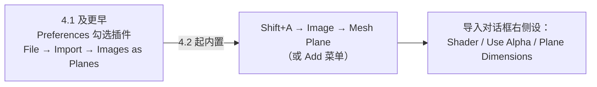
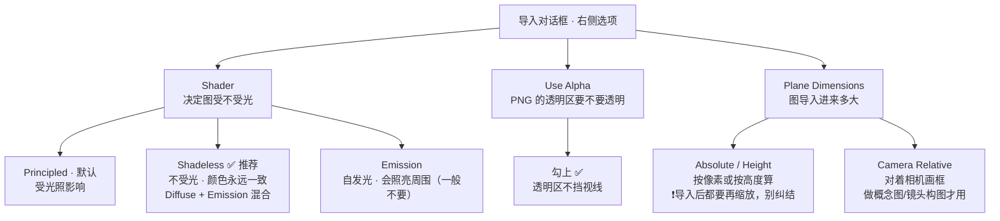
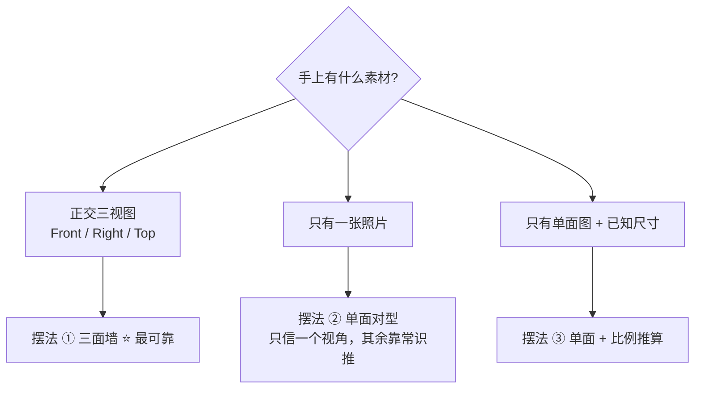
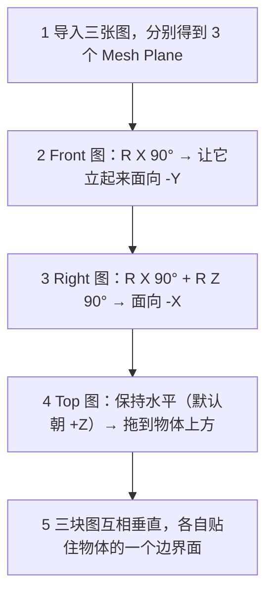
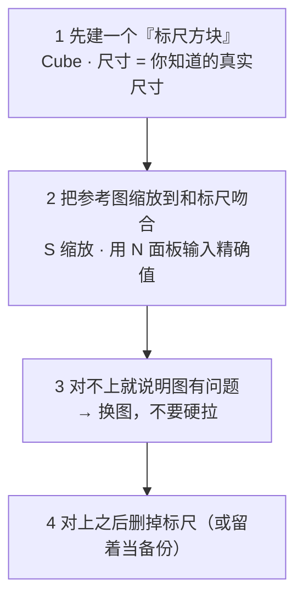
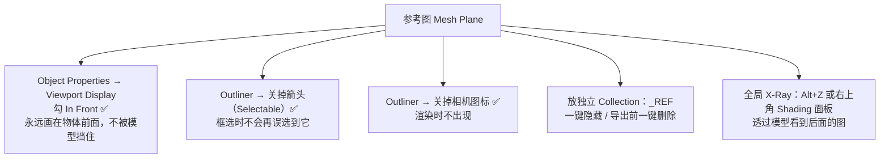
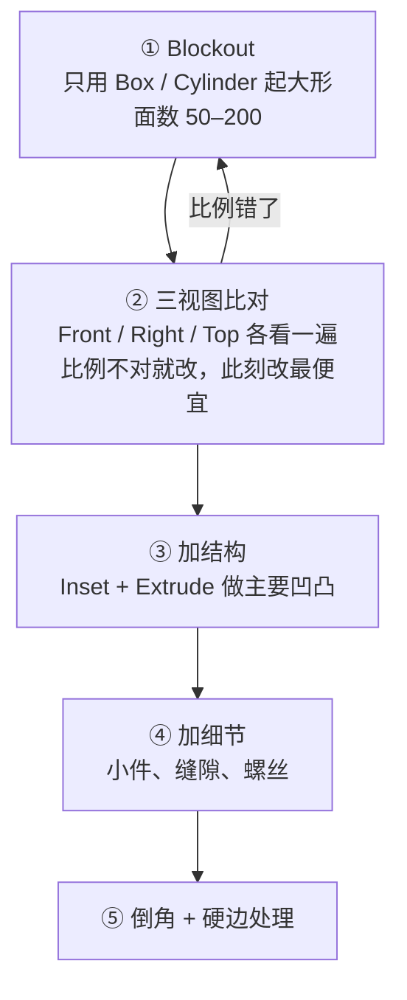
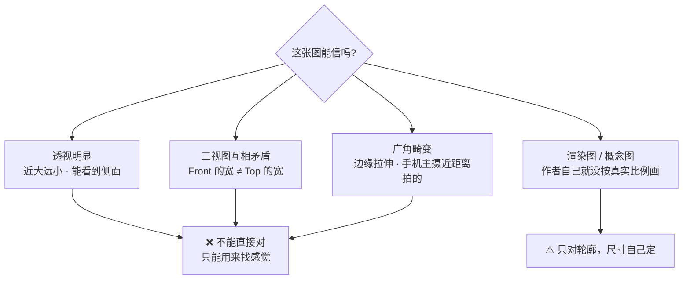

# 01 · 参考图设置与对型

> 一句话：**参考图的价值不在「贴上去」，而在「缩放到真实比例之后你敢信它」。**
> ⚠️ **包含对路线图的订正**：`Import Images as Planes` 在 **4.2 起已内置**，不再需要去 Preferences 勾插件。
> 依据：官方手册 Images as Planes（`3D Viewport → Add → Image → Mesh Plane`）。

---

## 一、5.x 里参考图怎么导入

### 1.1 入口变了



| 版本 | 入口 | 要不要勾插件 |
| ---- | ---- | ------------ |
| ≤ 4.1 | `File → Import → Images as Planes` | 要（Import-Export 分类） |
| **≥ 4.2（你现在用的 5.2）** | `Shift+A → Image → Mesh Plane` | **不要**，已内置 |

> 老教程让你先去 Preferences 勾插件——**这一步在 5.x 里可以跳过**。勾不到的时候别怀疑自己，直接 `F3` 搜 "Mesh Plane"。

### 1.2 导入对话框里真正要看的三个选项



**推荐设置**：`Shader = Shadeless` + `Use Alpha` 勾上 + `Plane Dimensions` 随便（反正后面要缩）。

> **为什么强烈建议 Shadeless**：参考图是为了让你读形状和比例。如果它是 Principled 材质，场景灯光一变，图的明暗也跟着变，深色的部位会被误读成阴影。Shadeless 保证「图就是图」。

---

## 二、三视图怎么摆

### 2.1 三种摆法



### 摆法 ① 三面墙（推荐）



| 视图 | 快捷键（有数字小键盘） | macOS 无小键盘时 |
| ---- | ---------------------- | ----------------- |
| Front | `Numpad 1`（反方向 `Ctrl+Numpad 1`） | `View → Viewpoint → Front`；或把它加进 `Q` 的 Quick Favorites |
| Right | `Numpad 3` | 同上 |
| Top | `Numpad 7` | 同上 |
| 正交 / 透视切换 | `Numpad 5` | 视口右上 Shading 弹出面板，或 `View` 菜单 |

> macOS 注意：`Preferences → Input → Emulate Numpad` 打开后主键盘数字键可以当小键盘用，但**编辑模式下 `1/2/3` 是顶点/边/面选择**，会打架。
> **最稳的办法**：把 Front / Right / Top 加进 **`Q` → Quick Favorites**，一周之后你会发现自己再也没按过小键盘。

### 摆法 ② 单面对型

只有一张照片时，能信的只有一个面。做法是：

1. 把图对齐到那个面（通常是正面）
2. **深度方向靠常识 + 已知尺寸推**（比如工具箱厚度 = 正面宽度的一半）
3. 不要试图从透视图里「量」尺寸——**透视会让同一物体在不同位置显示成不同大小**

---

## 三、⭐ 缩放：让图可信的唯一手段

这是本篇最重要的一节。**导入的默认尺寸毫无意义**，真正让参考图变得有用的，是把它对到一个已知尺寸上。



### 标尺从哪来

| 你手上的信息 | 怎么换算成标尺 |
| ------------ | -------------- |
| 图纸上标了尺寸 | 直接用（如油桶 0.88m 高） |
| 只知道「是人拿着用的」 | 用**手掌 / 人形**做参照：手掌宽约 0.09m，成人身高 1.75m |
| 只知道「能放进某个柜子」 | 用柜格尺寸（常见 0.3–0.4m） |
| 真的什么都不知道 | **先去查**。花 5 分钟查一个真实尺寸，省下后面 1 小时的重做 |

> **判断标准**：缩放完之后，切到 Front 正交视角，把标尺框在图上——**吻合到肉眼挑不出错**才算完。差 5% 在 3D 里非常明显。

---

## 四、参考图的显示设置（不然它会碍事）



| 设置 | 位置 | 不做的后果 |
| ---- | ---- | ---------- |
| **In Front** | Object Properties → Viewport Display | 图被自己的模型挡住，等于没贴 |
| **不可选** | Outliner → 箭头图标 | 框选时把参考图一起选中，Shift+A 加出来的东西全跑到图上了 |
| **不渲染** | Outliner → 相机图标 | 渲染出图时参考图糊在画面上 |
| **独立 Collection** | Outliner → 新建 Collection | 导出时忘了删，引擎里多出一堆带贴图的平面（[`../速查/导出检查清单.md`](../速查/导出检查清单.md)） |

> **命名习惯**：参考图物体和集合都以 `_REF` 开头（如 `_REF_Crate_Front`）。下划线开头会排在列表最前，一眼能看见，导出前扫一眼就知道有没有漏删。

---

## 五、对型流程：Blockout 先行

拿到对齐好的图，不要直接开始做细节。



**为什么 Blockout 必须单独走一遍**：第 ② 步改一个 Box 的尺寸是 10 秒；等做到第 ④ 步才发现比例错了，改起来要动几十个面——大部分人这时候选择「算了吧，差不多」，然后整个道具就废了。

### 比例检查的三个办法

| 办法 | 怎么做 | 精度 |
| ---- | ------ | ---- |
| **目测关键比值** | 高 : 宽 : 深 = ?，和图上画个十字对比 | 粗 |
| **Measure 工具** | `3D Viewport` 工具栏尺子，或 `N` 面板读 Dimensions | 中 |
| **标尺方块常驻** | 场景里留一个 1.75m 的人形 Box 和 1m 的 Cube 不删 | 高（也最省事） |

---

## 六、哪些图不能对型



> **找图顺序**：① 官方图纸 / 产品手册 → ② 建模社区的三视图（ sketchfab / artstation 搜 "blueprint"）→ ③ 长焦照片（50mm 以上，离远点拍）→ ④ 概念图（只参考感觉）。
> **油桶 / 木箱这类标准件，网上一定有图纸**，别自己拍脑袋。

---

## 七、坑

- ❌ **照老教程去 Preferences 勾 Images as Planes** → 4.2 后已内置，勾不到是正常的
- ❌ **用 Principled 材质导入参考图** → 灯光一变图也变，明暗误判成形状
- ❌ **不缩放直接用** → 参考图只是装饰品，比例全靠猜
- ❌ **拿透视图当三视图对** → 怎么对都对不上，还会怀疑自己手残
- ❌ **忘记关 Selectable** → 框选拉出一堆参考图，物体被拖走
- ❌ **忘记关渲染 / 导出前没删** → 引擎里多几张大平面
- ❌ **开了 In Front 之后深度感全丢** → 需要判断前后关系时临时关掉，或改用 `Alt+Z` 全局 X-Ray

---

## 八、自检

| # | 自检点 | 通过标准 |
| - | ------ | -------- |
| ① | 版本差异 | 说出 5.x 里参考图的入口是 `Shift+A → Image → Mesh Plane`，且知道不用勾插件 |
| ② | Shader 选择 | 说出为什么用 Shadeless 而不是 Principled |
| ③ | 缩放 | 能用一个已知尺寸的标尺把图缩到吻合，并说出「对不上怎么办」 |
| ④ | 显示设置 | 30 秒内把参考图设成：In Front + 不可选 + 不渲染 + 独立 Collection |
| ⑤ | 判图 | 给出 4 张图（正交三视图 / 透视照片 / 广角照片 / 概念图），能说出哪些能信 |
| ⑥ | 流程 | 说出 Blockout → 比对 → 结构 → 细节 的顺序，并说出为什么第 2 步不能省 |

---

## 九、速查

```text
【导入】
Shift+A → Image → Mesh Plane          ← 5.x 内置，不用勾插件
  Shader: Shadeless ✅（不受光，颜色恒定）
  Use Alpha: 勾 ✅（PNG 透明区不挡视线）
  Plane Dimensions: 随便，导入后都要再缩放
老教程让你勾插件 → 跳过（4.2 后内置）

【摆三视图】
Front: R X 90°   面向 -Y
Right: R X 90° + R Z 90°   面向 -X
Top:   默认朝 +Z，拖到物体上方
视角快捷键（有小键盘）: Numpad 1 / 3 / 7，正交切换 Numpad 5
macOS 无小键盘: View → Viewpoint 菜单，或 Q → Quick Favorites 收藏

【让图可信】
1 建一个已知尺寸的 Cube 当标尺
2 缩放到和标尺吻合（N 面板输精确值）
3 对不上 → 换图，别硬拉
4 常用标尺：人 1.75m · 门 2.0m · 桌 0.75m · 手掌 0.09m

【参考图显示设置】
Object Properties → Viewport Display → In Front  ✅
Outliner → 关箭头（不可选）  ✅
Outliner → 关相机（不渲染）  ✅
独立 Collection 命名 _REF
全局 X-Ray: Alt+Z

【对型流程】
Blockout（Box 起大形）→ 三视图比对（此刻改最便宜）
→ Inset/Extrude 加结构 → 加细节 → 倒角 + 硬边

【不能对型的图】
透视明显 ❌ ｜ 三视图互相矛盾 ❌ ｜ 广角畸变 ❌ ｜ 概念图 ⚠️ 只参考感觉
```

---

> **下一步**：[`02-单位与真实尺寸.md`](02-单位与真实尺寸.md) —— 图对好了，下一步是让场景里的数字真的等于米。
