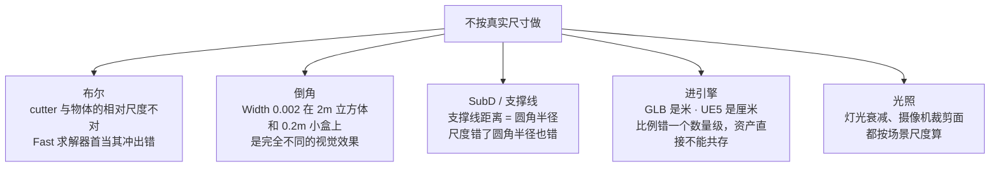
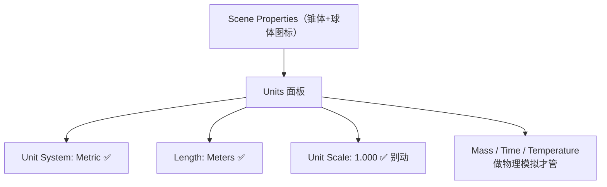
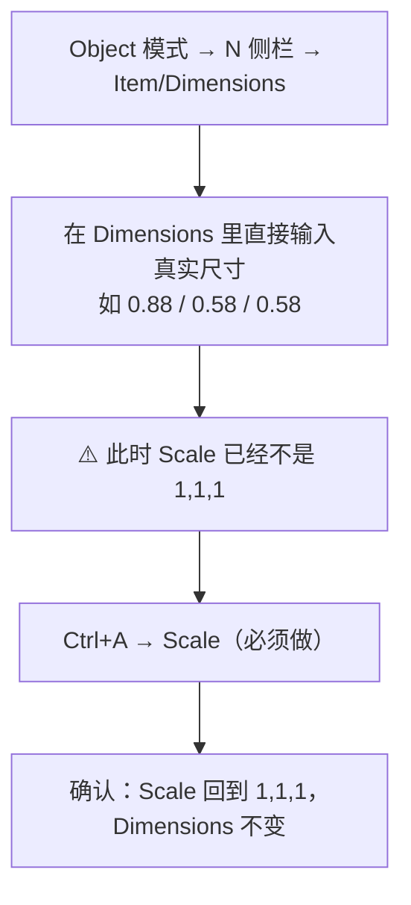
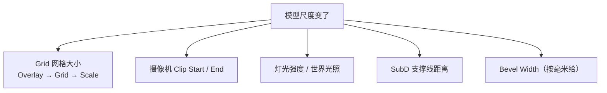

# 02 · 单位与真实尺寸

> 一句话：**Blender 里的 1 = 1 米。你不按米做，后面每一步——布尔、倒角、灯光、引擎导入——都会用错误来提醒你。**
> 依据：官方手册 Scene Properties → Units；glTF 2.0 规范（长度单位为米）。

---

## 一、为什么必须按真实尺寸做

不是强迫症，是四个具体的地方会真的坏掉：



| 环节 | 不按真实尺寸的症状 |
| ---- | ------------------ |
| 倒角 | 同一套参数在不同尺度的道具上效果完全不同，无法复用配方 |
| 布尔 | 共面、微相交、`Fast` 求解器算错 |
| SubD | 支撑线距离失去意义（它是以长度为单位的圆角半径） |
| 引擎 | 场景里 1.8m 的人和 18m 的箱子站在一起 |
| 渲染 | Clip Start 太大 → 小物件被裁掉；太小 → 深度精度不足出 z-fighting |

---

## 二、场景单位怎么设



| 设置项 | 推荐值 | 说明 |
| ------ | ------ | ---- |
| **Unit System** | `Metric` | 另有 `None`（Blender 单位）和 `Imperial`。做游戏资产一律 Metric |
| **Length** | `Meters` | 还有 `Adaptive`（自动缩放显示单位）、`Centimeters`、`Millimeters` 等。**改成 Centimeters 只是改显示，不改内部单位** |
| **Unit Scale** | `1.000` | ⚠️ 这个会**真的缩放场景**。除非你知道自己在做什么，否则永远是 1.0 |
| Mass / Time / Temperature | 默认 | 只有刚体/流体模拟才涉及 |

> ⚠️ **最容易踩的一条**：看到 `Length` 下拉里有 `Centimeters`，以为「改成厘米就能按厘米建模」——**不能**。Blender 内部单位恒为米，`Length` 只决定界面上怎么显示数字。
> 想要「按厘米输入」，正确做法是：Length 保持 Meters，输入时写 `0.02m` 或直接敲 `2cm`——**Blender 的数值框支持带单位输入**（输入 `2mm`、`3cm`、`1ft` 都会自动换算）。这才是正解。

### 数值框带单位输入（非常好用）

```text
在任意数值框里可以直接敲：
  2mm    → 0.002
  3cm    → 0.03
  1.5m   → 1.5
  6in    → 0.1524
  2ft    → 0.6096
```

> 这个功能在 Bevel Width、Solidify Thickness、Dimensions 里都能用。**倒角直接敲 `3mm` 比敲 `0.003` 少一个数量级的心理负担。**

---

## 三、怎么给物体真实尺寸



**三步，一步都不能少：**

1. `N` 面板 → **Dimensions** 输入真实尺寸（不是 Scale）
2. `Ctrl+A → Scale`
3. 回头确认 Scale 是 `1,1,1`

> 为什么第 2 步必须做：改 Dimensions 本质是改 Scale。Scale ≠ 1 时，Bevel 宽度会被非均匀拉伸、SubD 结果变形、布尔精度受影响——这是你笔记 `00-基础` 里已经强调过的老朋友，在 Stage 1 会以「倒角一边宽一边窄」的形式再出现一次。

### 编辑模式里的尺寸控制

| 想做什么 | 怎么做 |
| -------- | ------ |
| 精确缩放到某长度 | 选中边 → `S` + 轴向 → 直接敲数值（支持单位） |
| 量一段距离 | 工具栏 Measure 工具，或 `N` 面板读边长 |
| 让一组边等长 | LoopTools → Space（见 [`../01-拓扑与建模思维/02`](../01-拓扑与建模思维/02-Loop-Ring与边滑动补强-LoopTools.md)） |

---

## 四、尺度锚点表（背下这几个就够）

### 人体与家具（判断「多大算合理」）

| 物体 | 尺寸 |
| ---- | ---- |
| 成人身高 | 1.70–1.80 m |
| 视线高 | 1.60–1.70 m |
| 手掌宽（握拳） | 0.09 m |
| 门（高 × 宽 × 厚） | 2.03 × 0.81 × 0.035 m（美标内门） |
| 桌面高 | 0.72–0.76 m |
| 椅面高 | 0.42–0.45 m |
| 台阶（踏步高 / 深） | 0.15–0.18 / 0.28–0.30 m |
| 标准托盘（欧标） | 1.20 × 0.80 × 0.144 m |

### 本阶段三个练习的尺寸

| 道具 | 尺寸（宽 × 深 × 高） | 备注 |
| ---- | ------------------- | ---- |
| **木箱** | 0.60 × 0.40 × 0.40 m | 木条厚约 0.02 m，铁角件 0.05 m |
| **油桶**（55 加仑标准） | 直径 Ø0.58 × 高 0.88 m | 桶箍凸起 0.01–0.02 m，两道箍 |
| **工具箱 / 弹药箱** | 0.45 × 0.25 × 0.30 m | 把手 Ø0.02 m，锁扣 0.06 × 0.04 m |

### 常见道具参考

| 道具 | 尺寸 |
| ---- | ---- |
| 汽油罐（jerrycan） | 0.35 × 0.17 × 0.47 m |
| 运输集装箱（20ft） | 6.06 × 2.44 × 2.59 m |
| 汽车（紧凑型） | 4.3 × 1.8 × 1.5 m |
| 砖（含灰缝） | 0.215 × 0.1025 × 0.065 m |

> **习惯**：每做一个新道具，先在参考图/网上确认一个**唯一可信的真实尺寸**（通常是高度或直径），其余按比例推。只查一个数字，成本 5 分钟。

---

## 五、尺度变了，这些也要跟着调

这是「按米做」之后最容易忘的连带项。



| 项目 | 位置 | 什么时候调 |
| ---- | ---- | ---------- |
| **Grid Scale** | 视口右上 Overlay 下拉 → Grid → Scale | 做 0.1m 的小物件时，默认 1m 网格太粗，看不到细节比例 → 调到 0.1 或 0.01 |
| **Clip Start** | Camera / View 面板 → Lens → Clip Start | 默认 0.1m。做小于 10cm 的东西会被裁掉 → 调到 0.001 |
| **Clip End** | 同上 | 做室外大场景 → 默认 1000m 不够，调到 5000 |
| **View Clip** | `Preferences → Viewport → Clip Start/End` | 视口（不是相机）的裁剪，做微观模型时同样要调 |

> **症状对照**：模型「近看就消失一块」→ Clip Start 太大。「远处一片 z-fighting 闪烁」→ Clip Start 太小 / End 太大导致深度精度不足。

---

## 六、常见坑

- ❌ **以为改 `Length → Centimeters` 就能按厘米建模** → 它只改显示。内部单位恒为米
- ❌ **改 Unit Scale 来「适配老文件」** → 会把整个场景真的缩放，导入的资产全部错位
- ❌ **只改 Dimensions 不 `Ctrl+A → Scale`** → Bevel 被非均匀拉伸，SubD 变形
- ❌ **用 `S` 缩放物体来调尺寸，然后继续建模** → 同上，而且更容易忘
- ❌ **小道具不调 Clip Start** → 近看模型被裁开，以为是拓扑坏了
- ❌ **不查真实尺寸就开工** → 做完了才发现比例怪，但已经舍不得重做
- ❌ **导入的 FBX/OBJ 尺寸差 100 倍** → 导出方用了厘米。导入时检查 Dimensions，必要时缩放后 Apply（详见 [`../07-资产规范与引擎导出/笔记.md`](../07-资产规范与引擎导出/笔记.md)）

---

## 七、自检

| # | 自检点 | 通过标准 |
| - | ------ | -------- |
| ① | 场景设置 | 能说出 Unit System / Length / Unit Scale 三个的正确值，且说清 `Length` 只改显示 |
| ② | 带单位输入 | 在 Bevel Width 里直接敲 `3mm`，确认它变成 0.003 |
| ③ | 给尺寸 | 拿到一个 Cube，能在 30 秒内把它变成 0.6×0.4×0.4 m 且 Scale = 1,1,1 |
| ④ | 尺度锚点 | 随口报出门高、桌高、台阶高、55 加仑油桶尺寸 |
| ⑤ | 排错 | 「小模型近看消失」能立刻想到 Clip Start |

---

## 八、速查

```text
【场景单位】
Scene Properties → Units
  Unit System: Metric
  Length:       Meters
  Unit Scale:   1.000  ← 别动，这个会真的缩放场景
⚠️ Length 只改显示单位，内部单位恒为米

【数值框带单位输入】
2mm → 0.002 ｜ 3cm → 0.03 ｜ 1.5m → 1.5 ｜ 6in → 0.1524
倒角直接敲 3mm，比敲 0.003 少出错

【给物体真实尺寸 · 三步】
1 N 面板 → Dimensions 输入真实尺寸
2 Ctrl+A → Scale       ← 必须
3 确认 Scale = 1,1,1，Dimensions 不变

【尺度锚点】
人 1.75m ｜ 视线 1.65m ｜ 手掌 0.09m
门 2.03×0.81×0.035 ｜ 桌 0.75 ｜ 椅面 0.45 ｜ 台阶 0.15–0.18
木箱 0.6×0.4×0.4 ｜ 油桶 Ø0.58×0.88 ｜ 工具箱 0.45×0.25×0.30
集装箱 20ft: 6.06×2.44×2.59 ｜ 砖 0.215×0.1025×0.065

【尺度变了要跟着调】
Overlay → Grid → Scale        小物件调到 0.1 / 0.01
Camera → Lens → Clip Start    小物件调到 0.001（默认 0.1 会裁掉）
Clip End                      大场景调到 5000
```

---

> **下一步**：[`03-修改器栈-Mirror-Solidify-Bevel-SubD.md`](03-修改器栈-Mirror-Solidify-Bevel-SubD.md) —— 尺寸定好了，接下来靠修改器栈把对称、厚度、倒角、细分叠起来。
