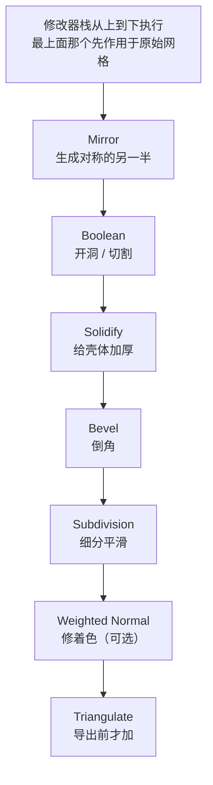
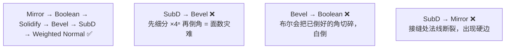
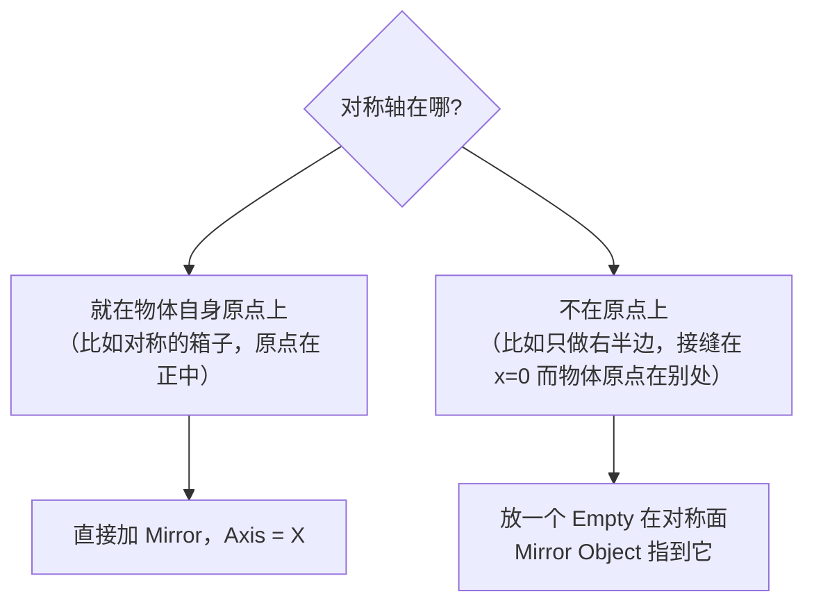
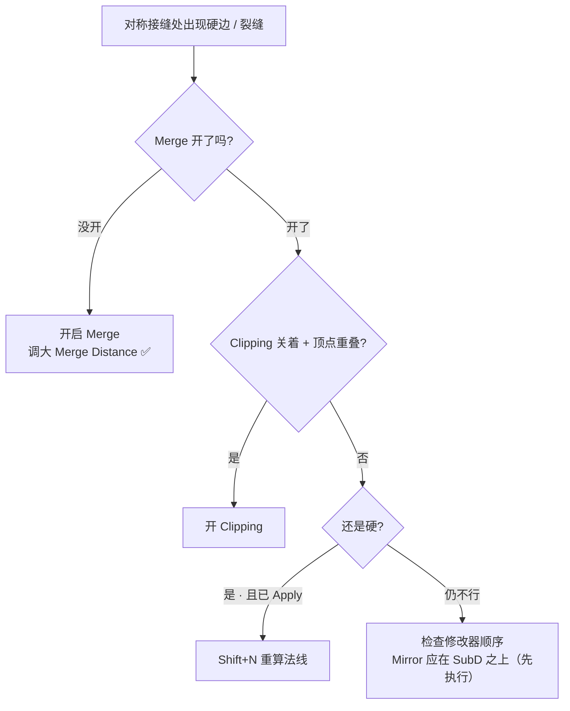
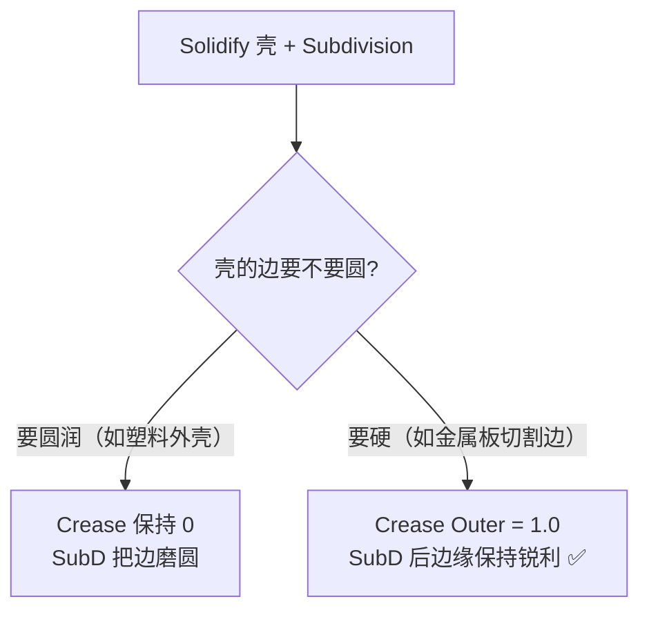
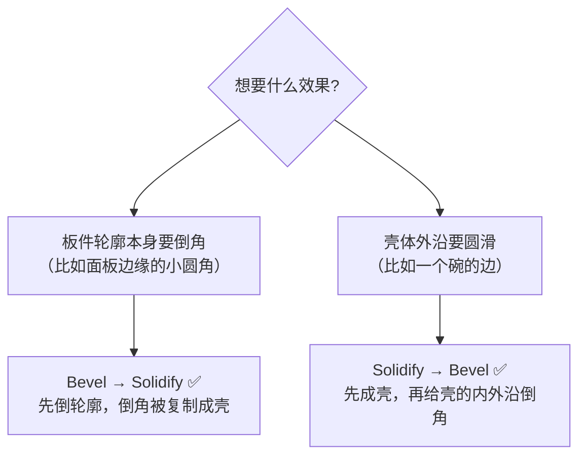
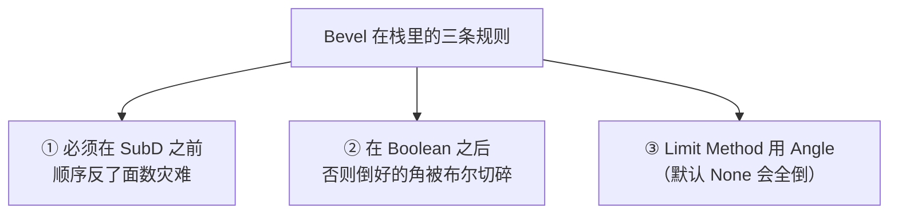

# 03 · 修改器栈：Mirror / Solidify / Bevel / SubD

> 一句话：**修改器不是「加了就生效」，而是「从上往下依次执行」——顺序就是语义，顺序错了结果就是错的。**
> 依据：官方手册 Modifiers（执行顺序）、Mirror / Solidify / Bevel / Subdivision Surface 各页。

---

## 一、栈的语义



**一句话记忆**：从「生成几何」→「改变形状」→「改变平滑度」→「修着色」→「导出处理」。

### 硬表面的推荐顺序

| 顺序 | 修改器 | 为什么在这个位置 |
| ---- | ------ | ---------------- |
| 1 | **Mirror** | 先生成完整几何，后面所有操作都在完整物体上算 |
| 2 | **Boolean** | 它的结果必须干净，且它的产物要参与后续倒角/细分 |
| 3 | **Solidify** | 加厚在结构确定之后 |
| 4 | **Bevel** | ⭐ **必须在 SubD 之前**：先倒 1 段，SubD 再去平滑它 |
| 5 | **Subdivision Surface** | 在 Bevel 之后，把 1 段斜面平滑成圆角 |
| 6 | **Weighted Normal**（可选） | 着色修正，永远在最后 |
| — | **Triangulate** | 只在导出前加，或交给导出器 |



---

## 二、Mirror（对称）

### 2.1 参数

| 参数 | 作用 | 建议 |
| ---- | ---- | ---- |
| **Axis** | 沿哪个轴镜像（可多选） | 通常只开一个（X） |
| **Merge** | 接缝处顶点在阈值内合并 | ✅ 开 |
| **Merge Distance** | 合并阈值 | 默认很小；模型大/尺度大时适当调大 |
| **Clipping** | 禁止顶点越过对称面 | ✅ 开（防穿模，但别依赖它当精度保证） |
| **Bisect** | 沿对称面切掉越界部分 | 需要「两半拼成一个封闭体」时开 |
| **Mirror Object** | 用一个空物体当对称面 | 对称轴不在物体原点时用这个 |
| **Offset** | 沿轴偏移 | 少用 |
| **Flip** | 翻转轴向 | 少用 |

### 2.2 原点是关键



> **最常见的 Mirror 故障 90% 是原点问题**：原点不在对称面上 → 镜像出来的两半分离或重叠。
> 排查顺序：**① 原点位置 → ② Merge 是否开 → ③ Merge Distance 够不够 → ④ 最后才怀疑顺序**。

### 2.3 ⭐ Mirror 的镜像侧法线是反的


| 阶段 | 要不要处理 |
| ---- | ---------- |
| 还在改（修改器未 Apply） | 视口里看起来正常（Blender 会纠正显示），**可以先不管** |
| **Apply 之后** | ⚠️ **必须 `A` → `Shift+N` 重算**，否则带着一半错误法线进布尔/渲染/导出 |

### 2.4 接缝硬边：先怀疑 Merge，不是顺序



> 路线图 Stage 2 的坑写的是「SubD 在 Mirror 之后会在接缝处产生硬边」。更准确的说法是：**Mirror 先执行（排在上面）本身是对的**，接缝硬边的第一嫌疑永远是 Merge/Clipping/法线，不是顺序。

---

## 三、Solidify（加厚）

### 3.1 它解决什么问题


适合：板件、壳、容器外壁、布料、面板。**不适合**：实心物体（那本来就是闭合体）。

### 3.2 参数

| 参数 | 作用 | 建议 |
| ---- | ---- | ---- |
| **Thickness** | 厚度 | 按真实尺寸给（板 0.018m，铁皮 0.002m） |
| **Offset** | -1 ~ 1，厚度往里还是往外 | `0` 居中，`1` 全往外，`-1` 全往里 |
| **Even Thickness** | 拐角处保持等厚 | ✅ 通常开（拐角不鼓包） |
| **Fill Rim** | 侧壁是否封口 | 开放壳要开；要和别的面拼接时可关 |
| **Crease Inner / Outer / Rim** | 给内/外/侧壁写 crease 值 | ⭐ **配合 SubD 用**：Crease Outer = 1.0 让外沿在 SubD 后保持硬 |
| **Material Index Offset** | 新面的材质槽偏移 | 想让内外不同材质时用（代价：多一个材质槽 = 多一次 draw call） |
| **Thickness Vertex Group** | 用顶点组控制局部厚度 | 进阶 |

### 3.3 Crease 与 SubD 的配合（重要）



> 这是 Solidify 最容易被忽略的能力：**它自带 crease 写入**，不用你去手动 `Shift+E`。
> 参照 [`../01-拓扑与建模思维/03-Subdivision修改器与支撑线.md`](../01-拓扑与建模思维/03-Subdivision修改器与支撑线.md)：crease 只被 SubD 读取——**栈里没有 SubD 时，Crease 设了等于白设**。

### 3.4 Solidify 与 Bevel 谁在前



| 顺序 | 结果 |
| ---- | ---- |
| Bevel → Solidify | 倒角随壳一起生成，内外沿都有圆角过渡，**面数较省** |
| Solidify → Bevel | 内外沿分别被倒，**面数更贵**，但圆角更「真」 |

> 游戏资产一般走 **Bevel → Solidify**（省面）。

---

## 四、Bevel（详见 00-基础/06）

本篇只强调它在**栈**里的位置，完整参数见 [`../00-基础/06-倒角-Bevel.md`](../00-基础/06-倒角-Bevel.md)。



**硬表面起手式（直接抄）：**

```text
Bevel 修改器
  Width:        0.002 – 0.02（按镜头定，见 05 篇）
  Segments:     1 – 2
  Limit Method: Angle   ← 默认 None 会让平面上布线边也被倒
  Angle:        30° – 60°
  Clamp Overlap: ✅
  Harden Normals: ✅
  Mark Seams:   ✅（前提：已手动标过主 Seam）
```

---

## 五、Subdivision Surface

| 参数 | 说明 | 建议 |
| ---- | ---- | ---- |
| **Type** | `Catmull-Clark`（平滑）/ `Simple`（只切分不平滑） | 硬表面用 **Catmull-Clark** |
| **Levels（Viewport）** | 视口细分级别 | 1–2 够看 |
| **Render** | 渲染级别 | 通常与 Viewport 一致 |
| **Use Limit Surface** | 按极限曲面而非迭代细分 | 开了边更「贴」，一般保持开 |
| **Optimal Display** | 只显示被修改的边的线框 | ✅ 开，视口干净很多 |
| **UVs → Subdivide UVs** | UV 是否跟着细分 | ⚠️ **游戏资产一般关掉**（UV 应该自己排，见 Stage 3） |

### 面数 × 4ⁿ（再强调一次）

| Level | 面数倍率 | Cube 面数 |
| ----- | -------- | --------- |
| 0 | 1× | 12 tri |
| 1 | 4× | 48 tri |
| 2 | **16×** | 192 tri |
| 3 | 64× | 768 tri |

> Bevel 已经把面数放大 4 倍以上，再叠一个 Level 3 的 SubD → **2000 面的道具直接破万**。
> **硬表面组合拳**：Bevel 1 段 + SubD Level 2，而不是 Bevel 3 段。

---

## 六、Weighted Normal（可选但很香）

用于修正大平面上的着色渐变（尤其倒角 + 布尔之后的碎面区域）。

| 参数 | 说明 |
| ---- | ---- |
| **Keep Sharp** | ✅ 勾上，否则会把你 Mark Sharp 的硬边一起抹平 |
| **Face Influence** | 与 Bevel 的 `Face Strength` 配合时才有效 |
| **Weighting Mode** | 按面/角权重算法，一般用默认 |
| **Thresh** | 权重阈值 |

> 位置：栈的**最后**（在所有改变几何的修改器之后）。
> 坑：**没勾 Keep Sharp → 硬边全被抹平**，你会以为 Bevel 失效了。

---

## 七、修改器的通用操作

| 操作 | 怎么做 | 什么时候用 |
| ---- | ------ | ---------- |
| 改顺序 | 修改器右上角上下箭头（5.x 里也可直接拖拽） | 排错第一步 |
| 关可见性 | 监视器图标（`Show Viewport`） | 对比「加之前 / 加之后」 |
| 编辑模式下显示 cage | 三角形图标（`Show in Edit Mode`） | 开着才能看着倒角结果继续编辑 |
| 复制到其它物体 | 修改器下拉 → `Copy to Selected` | 一批道具统一倒角参数 |
| Apply | 下拉 → `Apply`，或 `Ctrl+A` 菜单 | 导出前必做（或勾 Apply Modifiers） |
| Convert to Mesh | `F3 → Convert to Mesh` | 一次性烘掉全部修改器 |

> ⚠️ **Apply 是不可逆的**（撤销栈之外就回不去了）。**导出前的标准做法是：导出对话框里勾 `Apply Modifiers`，而不是在文件里 Apply**——这样你的 .blend 源文件始终保留可修改的栈。

---

## 八、坑

- ❌ **顺序放反：SubD 在 Bevel 之前** → 面数灾难（先细分 ×4ⁿ 再倒角）
- ❌ **Bevel 在 Boolean 之前** → 倒好的角被布尔切碎，白干
- ❌ **Mirror 原点不在对称面** → 两半分离/重叠
- ❌ **开了 Mirror 但没开 Merge** → 接缝处两排重合顶点，SubD 后裂缝
- ❌ **Mirror Apply 后不 `Shift+N`** → 一半法线朝内，渲染发黑
- ❌ **Bevel 不设 Limit Method（默认 None）** → 平面上布线边也被倒，模型炸线
- ❌ **Solidify 设了 Crease 但栈里没有 SubD** → crease 没人读，白设
- ❌ **Weighted Normal 没勾 Keep Sharp** → 硬边被抹平
- ❌ **在源文件里 Apply 了修改器** → 迭代能力全丢。导出时勾 Apply Modifiers 才对
- ❌ **导出忘了 Apply / 没勾 Apply Modifiers** → 引擎里看到一个没倒角没细分的方块

---

## 九、自检

| # | 自检点 | 通过标准 |
| - | ------ | -------- |
| ① | 顺序 | 说出 Mirror → Boolean → Solidify → Bevel → SubD → Weighted Normal，并说出 Bevel 必须在 SubD 之前的**面数理由** |
| ② | Mirror | 说出原点 / Merge / Clipping / 法线 四个排查点的先后顺序 |
| ③ | Solidify | 说出 Crease Outer 是给谁读的（SubD），以及没有 SubD 时会怎样 |
| ④ | Bevel | 30 秒内配出「硬表面起手式」那一套参数 |
| ⑤ | SubD | 随口报出 Level 2 的面数倍率（16×） |
| ⑥ | Apply | 说出「源文件不 Apply，导出时勾 Apply Modifiers」的理由 |

---

## 十、速查

```text
【推荐栈顺序】
Mirror → Boolean → Solidify → Bevel → Subdivision → Weighted Normal
                                              （导出时 Triangulate）

【顺序铁律】
Bevel 必须在 SubD 之前      ← 否则面数 ×4ⁿ 灾难
Bevel 必须在 Boolean 之后   ← 否则倒好的角被切碎
Mirror 必须在最上（先执行）
Weighted Normal 必须在最后

【Mirror】
Axis: X（通常） ｜ Merge ✅ ｜ Clipping ✅ ｜ Merge Distance 按尺度调
原点不在对称面 → 放 Empty 当 Mirror Object
⚠️ Apply 后必须 A → Shift+N（镜像侧法线是反的）
接缝硬边排查顺序：原点 → Merge → Distance → Clipping → 法线 → 顺序

【Solidify】
Thickness 按真实尺寸给 ｜ Offset: 0 居中 ｜ Even Thickness ✅
Crease Outer = 1.0 → 配合 SubD 保住硬边（没有 SubD 时无效）
游戏资产顺序：Bevel → Solidify（省面）

【Bevel 起手式】
Width 0.002–0.02 ｜ Segments 1–2 ｜ Limit Method: Angle 30–60°
Clamp Overlap ✅ ｜ Harden Normals ✅ ｜ Mark Seams ✅（需先标主 Seam）

【SubD】
Catmull-Clark ｜ Levels 1–2 ｜ Optimal Display ✅ ｜ Subdivide UVs ❌
面数 ×4ⁿ：L1=4× · L2=16× · L3=64×

【通用】
改顺序：右上角箭头 ｜ 关可见性：监视器图标 ｜ 编辑模式显示：三角形图标
Copy to Selected：统一一批道具的参数
⚠️ 源文件里别 Apply，导出时勾 Apply Modifiers
```

---

> **下一步**：[`04-布尔与布尔后清理.md`](04-布尔与布尔后清理.md) —— 栈里最危险的那个环节。
