# 04 · 布尔与布尔后清理 ⭐

> 一句话：**布尔是硬表面里唯一一个「一键毁掉拓扑」的操作。铁律：布尔只用来开洞，结构靠挤出。**
> 依据：官方手册 Boolean Modifier、Bool Tool 插件页（`3D Viewport ‣ Sidebar ‣ Edit tab, Shift-Ctrl-B`）。

---

## 一、先立规矩：什么时候能用布尔

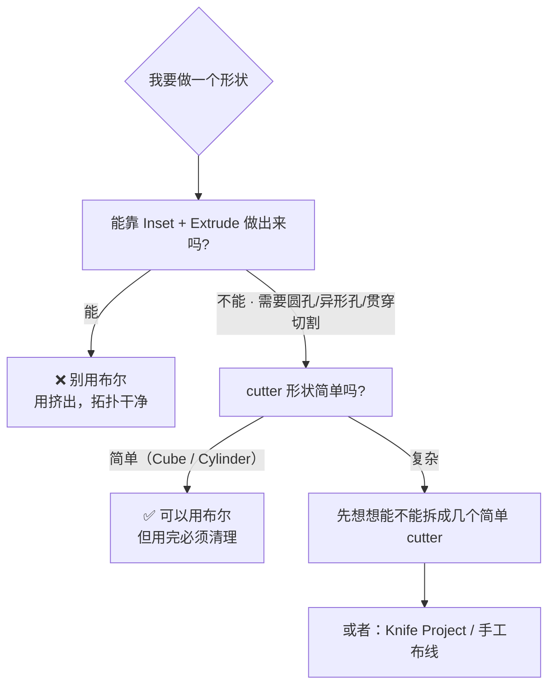

| 需求 | 首选方案 | 布尔是否合适 |
| ---- | -------- | ------------ |
| 方形凹坑 / 凹槽 | `I` Inset + `E` Extrude | ❌ 不需要 |
| 面板缝隙 | `I` + `E` 内凹 | ❌ 不需要 |
| 台阶状结构 | `Ctrl+R` + `E` | ❌ 不需要 |
| **穿透的圆孔** | 布尔（Cylinder cutter） | ✅ 首选 |
| **异形贯穿孔** | 布尔（自建形状 cutter） | ✅ |
| 表面上的铭牌/凹字 | **Normal 贴图**（Stage 4） | ❌ 不值得加面 |
| 表面复杂轮廓的凹陷 | `Knife Project` | ⚠️ 看情况 |

> **判断标准**：如果布尔之后你**不需要**在切口附近继续加拓扑（加线、挤出、倒角），那它通常是安全的。如果你还要在洞口周围继续做结构，**先清理，或者干脆不用布尔**。

---

## 二、Boolean 修改器：参数全解

### 2.1 Operation

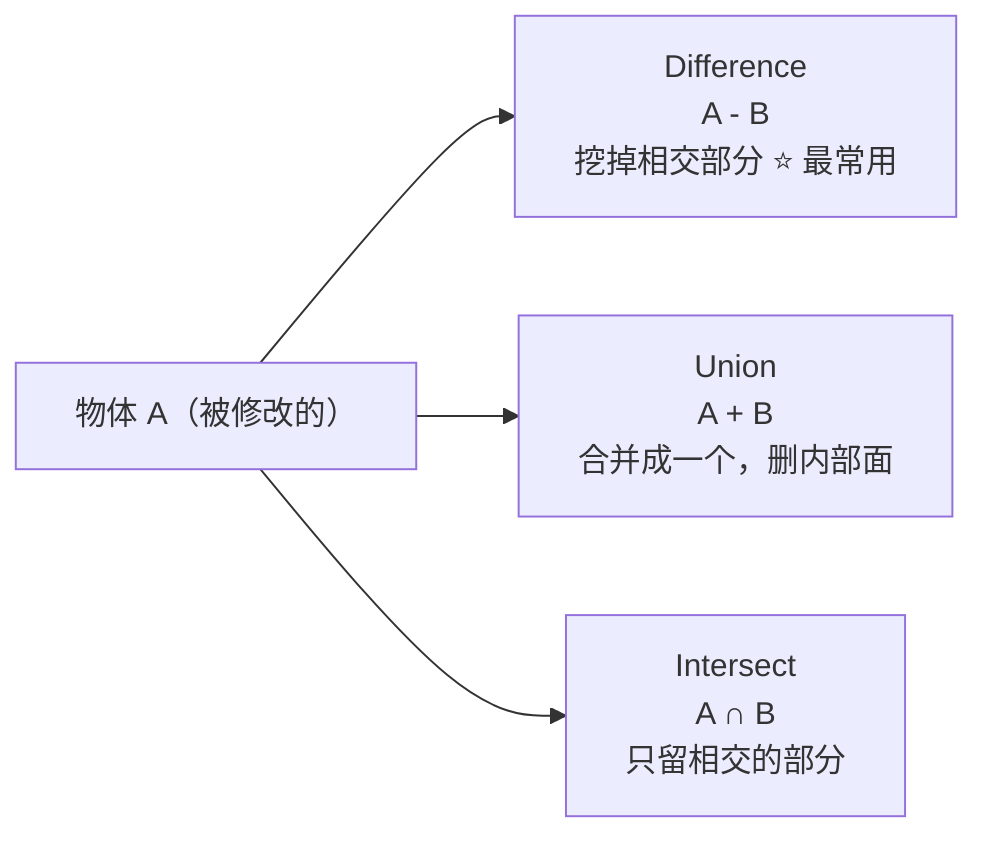

### 2.2 Operand Type

| 类型 | 说明 |
| ---- | ---- |
| **Object** | 单个 cutter 物体 |
| **Collection** | 一整个集合当 cutter（批量开孔很方便）<br/>⚠️ 集合 + `Fast` 求解器时**不能用 Intersect** |

### 2.3 Solver ⭐ 最重要的一项

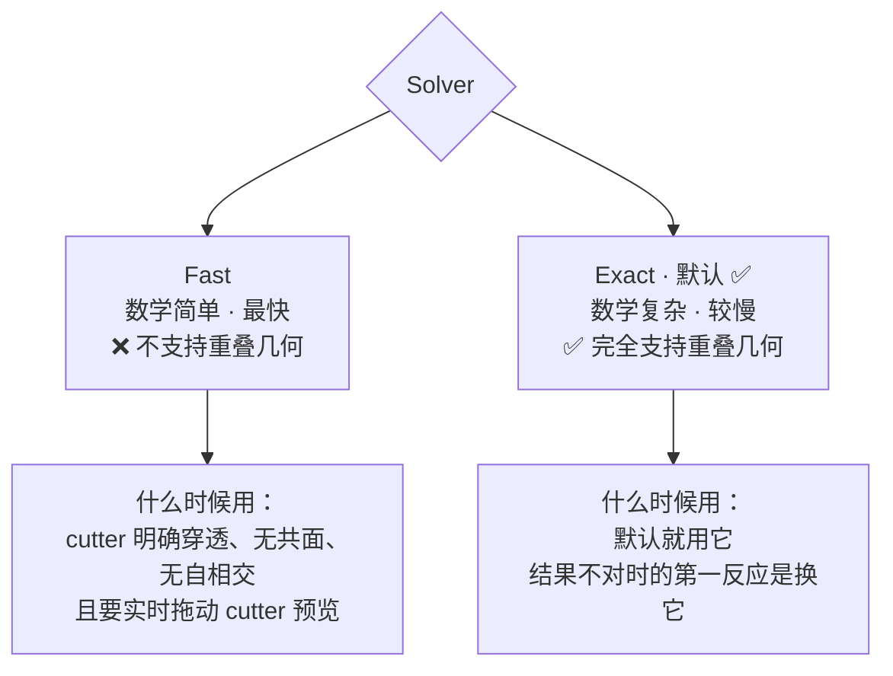

| | Fast | Exact |
| - | ---- | ----- |
| 速度 | 快 | 慢 |
| 重叠几何 | ❌ 不支持 | ✅ 支持 |
| 共面 | 容易出错 | ✅ 处理得好 |
| 典型用途 | 简单穿透切割、实时预览 | **默认** |

### 2.4 Solver Options

| 选项 | 归属 | 说明 |
| ---- | ---- | ---- |
| **Self Intersection** | Exact | 正确处理操作数自身有自相交的情况（更慢）。cutter 或目标有自相交时开 |
| **Hole Tolerant** | Exact | 为非流形几何优化输出（更慢）。⚠️ **只在 Exact 真的出错时才开** |
| **Overlap Threshold** | Fast | 判定「重叠」的最大距离。结果怪异时调它，或直接换 Exact |
| **Double Threshold** | 通用 | 重叠几何判定阈值 |
| **Materials** | Exact | `Index Based`（按材质槽顺序）/ `Transfer`（从 cutter 转移材质） |

### 2.5 让布尔过程可见（调试技巧）

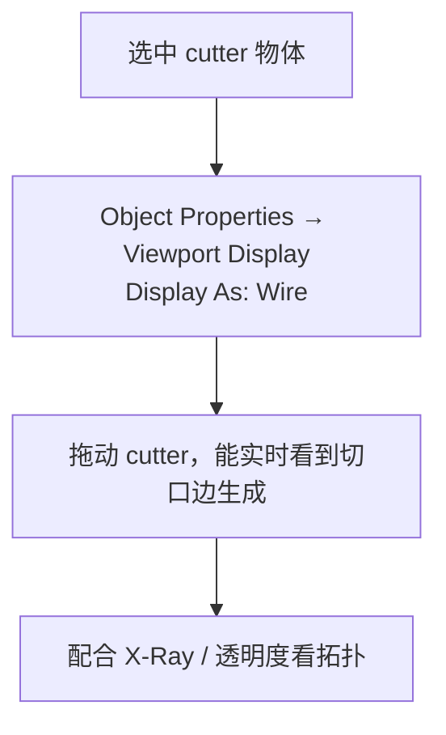

> 官方手册原话：给 cutter 开 Wireframe，就能在移动它时看到布尔边实时生成。

---

## 三、Bool Tool 插件

### 3.1 概念：Brush 与 Canvas

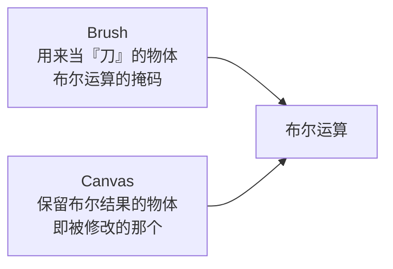

选中顺序：**先选 Brush（刀），最后选 Canvas（被切的，作为 active object），再执行操作。**

### 3.2 Auto Boolean vs Brush Boolean ⭐

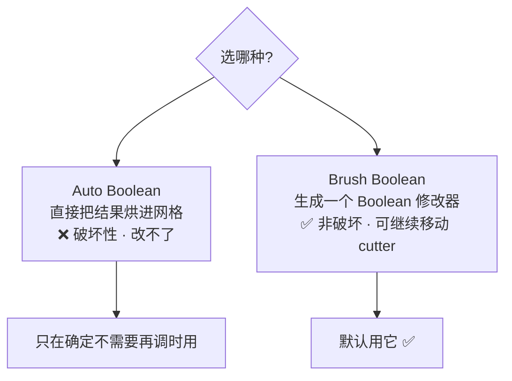

| | Auto Boolean | Brush Boolean |
| - | ------------ | ------------- |
| 结果 | 直接改网格 | 生成 Boolean 修改器 |
| 能否继续调 cutter | ❌ | ✅ |
| 快捷键 | `Shift+Ctrl+Numpad -` 差集<br/>`Shift+Ctrl+Numpad +` 并集<br/>`Shift+Ctrl+Numpad *` 交集<br/>`Shift+Ctrl+Numpad /` 切片 | `Ctrl+Numpad -`<br/>`Ctrl+Numpad +`<br/>`Ctrl+Numpad *`<br/>`Ctrl+Numpad /` |

### 3.3 ⚠️ macOS / 无小键盘用户必读

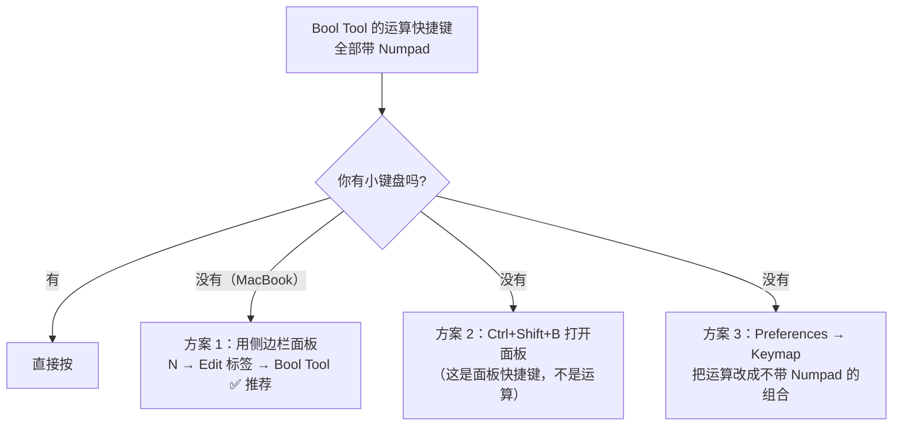

| 入口 | 快捷键 | 说明 |
| ---- | ------ | ---- |
| 侧边栏面板 | `Ctrl+Shift+B` 打开，或 `N` 面板 → **Edit** 标签 | ⭐ **Mac 用户走这条** |
| Auto 运算 | `Shift+Ctrl+Numpad ±*/` | 依赖小键盘 |
| Brush 运算 | `Ctrl+Numpad ±*/` | 依赖小键盘 |
| 插件面板位置 | `3D Viewport ‣ Sidebar ‣ Edit tab` | 官方手册标注 |

> 路线图里把 `Ctrl+Shift+B` 当成「布尔快捷键」是不完整的——它是**打开面板**的键，真正的运算键带 Numpad。
> macOS 上开 `Emulate Numpad` 之后这些组合键有可能可用，但和编辑模式的 `1/2/3` 冲突风险高。**直接用侧边栏按钮最稳。**

---

## 四、布尔前的准备（做对了能省一半清理时间）

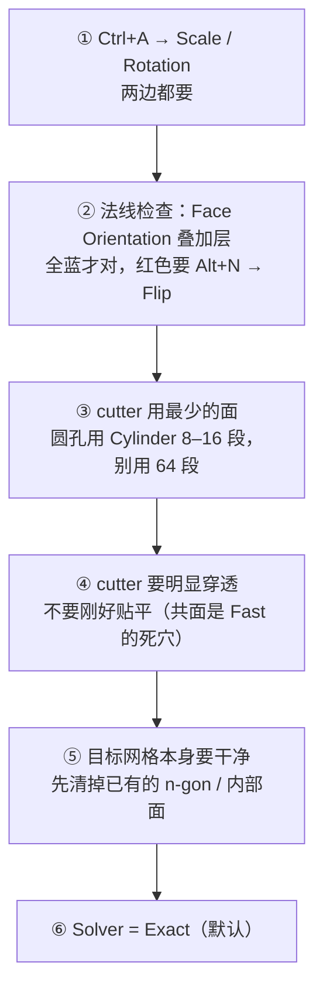

| 准备项 | 不做会怎样 |
| ------ | ---------- |
| Apply Scale | cutter 被非均匀拉伸，切口歪 |
| 法线正确 | 布尔算出「负体积」，出现诡异内部结构 |
| cutter 面少 | 切口周边一堆碎三角，清理量翻倍 |
| 明显穿透 | 共面 → `Fast` 算错、`Exact` 也可能出退化面 |
| 目标干净 | 脏拓扑 × 布尔 = 更脏的拓扑 |

---

## 五、⭐ 布尔后清理五步

这是本篇的核心。布尔本身 30 秒，**清理才是真正的工作**。

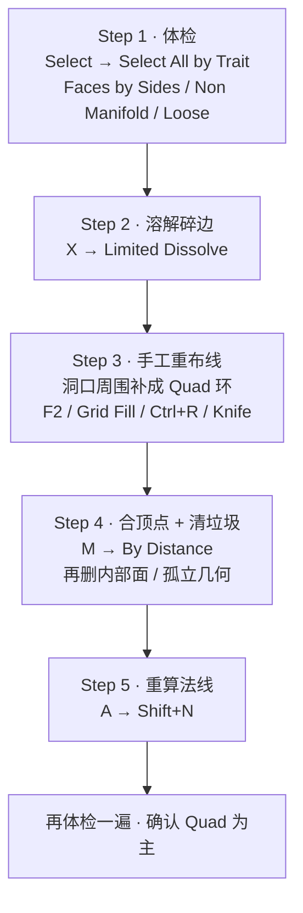

### Step 1 · 体检（先看清有多脏）

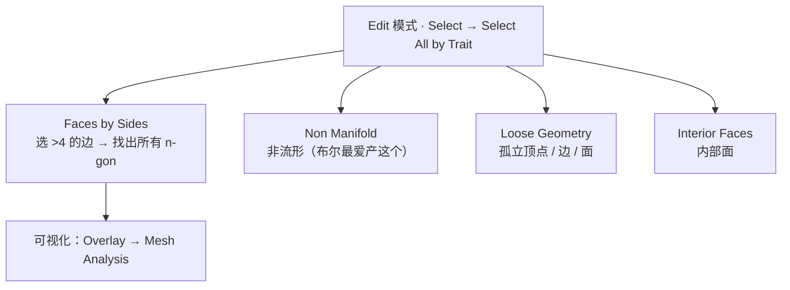

> 详细步骤见 [`../01-拓扑与建模思维/05-拓扑体检与清理.md`](../01-拓扑与建模思维/05-拓扑体检与清理.md)。

### Step 2 · Limited Dissolve

```text
Edit 模式 → A 全选（或只选洞口区域）
→ X / Delete → Limited Dissolve
→ F9 调 Max Angle（默认 5°）
```

| 参数 | 说明 |
| ---- | ---- |
| **Max Angle** | 相邻面夹角小于这个值就合并。默认 5° 很保守，布尔清理常用 5°–15° |

> **这一步能消掉布尔留下的绝大部分碎边**。它不会破坏形状——只合并「几乎共面」的面。

### Step 3 · 手工重布线（真正的技术活）

布尔最难的地方：洞口周围往往是一堆 n-gon 和三角，而你需要它变成**一圈规则的 Quad**。

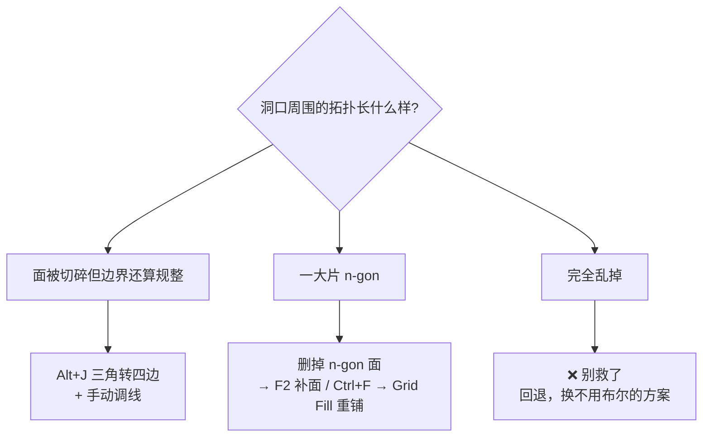

| 工具 | 用法 | 适用 |
| ---- | ---- | ---- |
| **`Alt+J`** | Triangles to Quads | 三角成对的规整区域，**不是万能药** |
| **`F2`** | 快速补面（需勾 F2 插件） | 手补少量缺失面 |
| **`Ctrl+F → Grid Fill`** | 选中一个环形边界，填成规整网格 | ⭐ 圆孔/方孔的边界环，效果很好 |
| **`Ctrl+R`** | 加环线重建分布 | 需要一圈均匀流线时 |
| **`K` Knife** | 手工切线 | 精确控制 |
| **`X → Limited Dissolve`** | 溶解碎边 | 配角，几乎总在用 |

> **Grid Fill 是布尔清理的隐藏王牌**：选中洞口一圈边界边 → `Ctrl+F → Grid Fill` → 它直接给你一片规整的四边面。洞口边界顶点数成偶数时效果最好（所以 cutter 用 8/12/16 段比用 32 段好清理得多）。

### Step 4 · 合并顶点与清垃圾

```text
A → M → By Distance（阈值按模型尺度给，从小往大试）
Select → Select All by Trait → Interior Faces → X 删掉
Select → Select All by Trait → Loose Geometry → X 删掉
```

### Step 5 · 重算法线

```text
A → Shift+N（Recalculate Outside）
再用 Face Orientation 叠加层确认全蓝
```

---

## 六、样例：给一个方块开三个洞（完整流程）

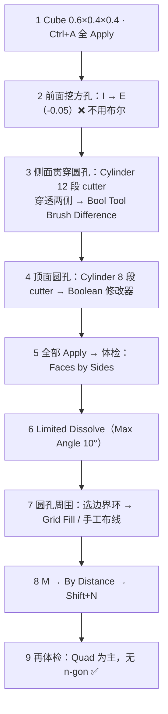

> **注意第 2 步**：方形凹陷根本不需要布尔。这就是为什么「布尔只用来开洞」——结构靠挤出。

---

## 七、不用布尔的开洞方案（掌握两种以上）

| 方案 | 怎么做 | 适用 | 拓扑 |
| ---- | ------ | ---- | ---- |
| **Inset + Extrude** ⭐ | `I` 出内圈 → `E` 向内推 | 方孔、矩形槽、面板缝 | 干净 |
| **Loop Cut + Extrude** | `Ctrl+R` 定位 → 选中面 → `E` | 规则位置的凹凸 | 干净 |
| **顶点对齐 + Bridge** | 两个环形边界顶点数相同 → `Ctrl+E → Bridge Edge Loops` | 圆孔对接、管道 | 很干净 |
| **Knife Project** | 把轮廓物体投影到面上 | 复杂轮廓的表面切割 | 中等（仍需清理） |
| **布尔** | cutter 切割 | 贯穿孔、异形孔 | ⚠️ 需要清理 |
| **Normal 贴图** | Stage 4 烘焙 | 螺丝孔、凹字、浅浮雕 | **完全不加面** |

> **圆孔的正规做法（不用布尔）**：做一个与孔等径的 Cylinder 端面，把它的顶点数和面上的环形布线对齐，然后 `Bridge Edge Loops`。段数一致时结果极其干净。代价是要提前规划布线——**这正是 Stage 0 说的「先定拓扑」**。

---

## 八、坑

- ❌ **布尔完不清理** → 三角面和 n-gon 一堆 → UV / 烘焙全崩
- ❌ **用 `Fast` 处理共面或重叠** → 结果诡异 → 换 `Exact`
- ❌ **cutter 刚好贴平目标表面** → 共面退化 → 让 cutter 明显穿透
- ❌ **cutter 段数给 32/64** → 切口周围碎面成倍增加 → 用 8–16 段
- ❌ **用 Auto Boolean 做还要调的东西** → 破坏性，改不了 → 用 Brush Boolean
- ❌ **Mirror 之后不重算法线就布尔** → 法线朝内导致负体积
- ❌ **在布尔生成的碎边上直接大倒角** → 沿碎边炸开 → 先清理，或用 `Limit Method = Weight` 把布尔边排除
- ❌ **以为 `Alt+J` 能把所有三角变四边** → 它只在特定条件下有效
- ❌ **布尔层级没 Apply 就导出** → 引擎里看到没开洞的原始网格
- ❌ **Mac 上按 Numpad 组合键按不出来** → 用侧边栏面板

---

## 九、自检

| # | 自检点 | 通过标准 |
| - | ------ | -------- |
| ① | 铁律 | 说出「布尔只用来开洞，结构靠挤出」，并举例说明哪些情况不需要布尔 |
| ② | Solver | 说出 Fast / Exact 的区别与各自适用场景 |
| ③ | Bool Tool | 说清 Brush vs Canvas、Auto vs Brush Boolean，以及 Mac 上怎么操作 |
| ④ | 准备 | 说出布尔前的 6 项准备 |
| ⑤ | 清理 | **实操**：给一个刚布尔完的方块，10 分钟内清到「Quad 为主」 |
| ⑥ | 替代方案 | 说出至少 2 种不用布尔的开洞方案 |

---

## 十、速查

```text
【铁律】布尔只用来开洞，结构靠挤出（Inset + Extrude）

【Boolean 修改器】
Operation:  Difference ⭐ / Union / Intersect
Operand:    Object / Collection（集合+Fast 时不能用 Intersect）
Solver:     Exact（默认·支持重叠） / Fast（快·不支持重叠）
Solver Options:
  Self Intersection  自身有自相交时开（更慢）
  Hole Tolerant      非流形出错时才开（更慢）
  Overlap Threshold  Fast 的重叠判定距离
调试：cutter 设 Display As: Wire，实时看切口边

【Bool Tool】
面板：N → Edit 标签（Ctrl+Shift+B 打开面板）
Brush = 刀 ｜ Canvas = 被切的（最后选，作为 active）
Brush Boolean  ✅ 生成修改器·可继续调
Auto Boolean   ❌ 直接烘进网格·破坏性
快捷键（需小键盘）：
  Auto:  Shift+Ctrl+Numpad - / + / * / /
  Brush: Ctrl+Numpad       - / + / * / /
⚠️ Mac 无小键盘 → 用侧边栏按钮

【布尔前 6 项准备】
① Ctrl+A → Scale & Rotation（两边都做）
② 法线检查（Face Orientation 全蓝）
③ cutter 面数最少（Cylinder 8–16 段）
④ cutter 明显穿透，别共面
⑤ 目标网格先清干净
⑥ Solver = Exact

【布尔后清理五步】
1 体检：Select → All by Trait → Faces by Sides / Non Manifold / Loose
2 溶解：X → Limited Dissolve（Max Angle 5°–15°）
3 重布线：Grid Fill ⭐ / F2 / Alt+J / Ctrl+R / K
4 清理：M → By Distance → 删内部面与孤立几何
5 法线：A → Shift+N

【不用布尔的方案】
方孔/凹槽：Inset + Extrude ⭐
圆孔对接：顶点对齐 + Bridge Edge Loops
复杂轮廓表面切割：Knife Project
浅浮雕/螺丝孔：Normal 贴图（0 面数）
```

---

> **下一步**：[`05-倒角策略-宽度-段数-镜头距离.md`](05-倒角策略-宽度-段数-镜头距离.md) —— 洞开好了（并清理干净了），下一步是让所有边缘在光下有那条高光线。
