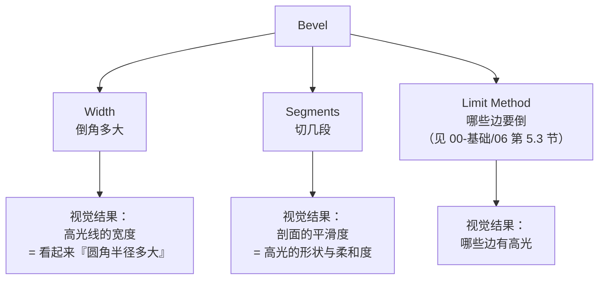
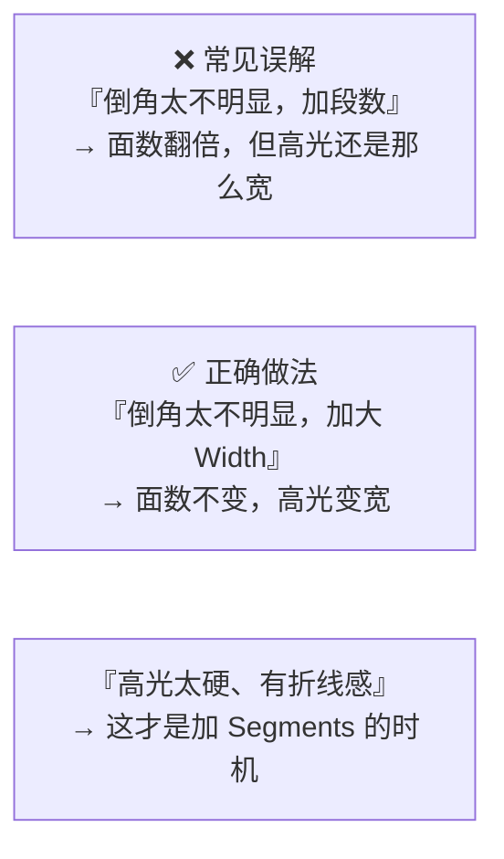
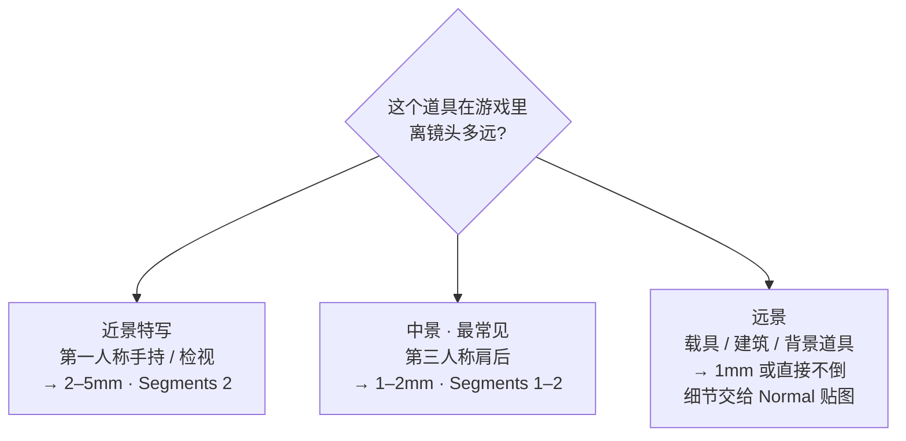
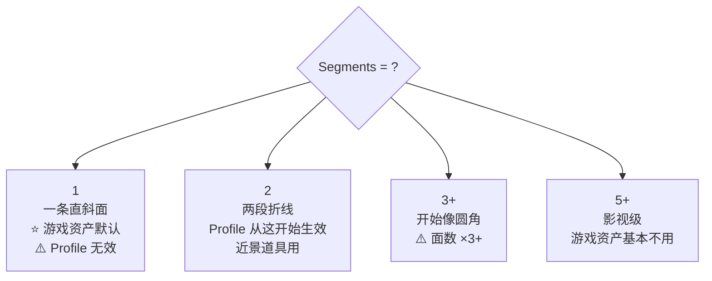
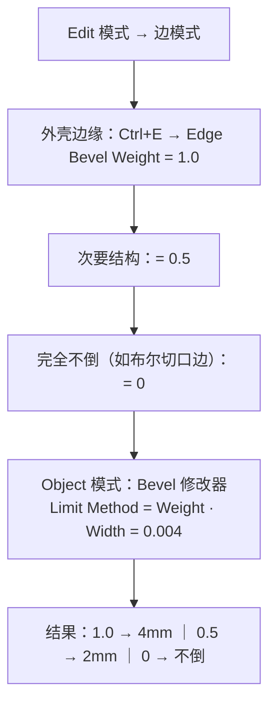
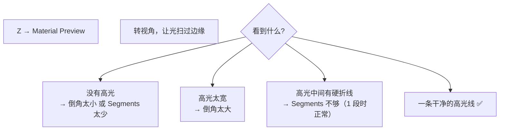

# 05 · 倒角策略：Width / Segments / 镜头距离

> 一句话：**Width 决定「高光有多宽」，Segments 决定「剖面有多圆」——这两个是完全不同的维度，分开想。**
> 本篇只讲**策略与决策**；所有参数的完整解释见 [`../00-基础/06-倒角-Bevel.md`](../00-基础/06-倒角-Bevel.md)。

---

## 一、先把 Width 和 Segments 拆开



| 维度 | 管什么 | 面数代价 | 改了看不出来怎么办 |
| ---- | ------ | -------- | ------------------ |
| **Width** | 高光宽度 / 圆角半径 | 不改面数 | 太小了看不见 → 加大；或在 Material Preview 下转视角 |
| **Segments** | 剖面平滑度 | **面数直接 ×Segments** | ⚠️ Segments = 1 时 Profile 完全无效 |
| **Limit Method** | 倒哪些边 | 影响面数（倒的边越多越贵） | 默认 `None` 会全倒 → 改 `Angle` |



---

## 二、Width 给多少：三个锚点

### 锚点 1 · 真实加工半径（最可靠）

| 物体类型 | 边角半径 |
| -------- | -------- |
| 手机 / 电子产品 | 1–3 mm |
| 家具（桌角、柜门） | 0.5–2 mm |
| 家电外壳 | 1–5 mm |
| 汽车钣金 | 3–8 mm |
| 建筑（混凝土、石材） | 5–20 mm |
| **木箱边角** | 1–2 mm（木材倒棱） |
| **油桶卷边** | 3–6 mm |
| **工具箱冲压边的折边** | 2–4 mm |
| 刀具刃口 | 0.05–0.2 mm（几乎尖） |

> **这个表是本阶段最常用的**。不知道给多少时，先找到物体的材质和工艺，再查这张表。

### 锚点 2 · 经验比例（没资料时用）

```text
倒角宽度 ≈ 物体最短边长度 × 0.5% ~ 2%
```

| 例子 | 计算 | 结果 |
| ---- | ---- | ---- |
| 0.6m 高的油桶 | `0.6 × 0.5%` ~ `0.6 × 2%` | 3mm（锐利）～ 12mm（厚重） |
| 0.3m 高的工具箱 | `0.3 × 0.5%` ~ `0.3 × 2%` | 1.5mm ～ 6mm |
| 0.4m 的木箱 | `0.4 × 0.5%` ~ `0.4 × 2%` | 2mm ～ 8mm |

> **取值的语义**：0.5% = 锐利、工业感；2% = 厚重、塑胶感。**默认从中段 1% 起步**。

### 锚点 3 · ⭐ 镜头距离（游戏资产最终判据）



| 镜头 | Width | Segments | 备注 |
| ---- | ----- | -------- | ---- |
| 近景（手持道具、可检视） | 2–5 mm | 2 | 看得见那条高光，值得花面数 |
| 中景（第三人称场景道具） | 1–2 mm | 1–2 | **本阶段三个练习都在这个档** |
| 远景（背景、载具） | ≤1 mm 或不倒 | 1 | 倒角的活交给 Normal 贴图 |

> **为什么镜头距离是最终判据**：倒角的唯一目的是产生高光线。玩家看不到的高光，就是白花的面数。
> 游戏美术的常规操作：**低模上只倒「轮廓边」和「镜头会扫过的主边」，其余全交给 Normal 贴图。**

---

## 三、Segments 给几段



### 面数账（别忘了 Bevel 本身的代价）

```
Bevel 后面数 ≈ 原面数 + 边数 × Segments + 顶点数
```

| 场景 | 面数变化 |
| ---- | -------- |
| 200 面的道具，全边 Bevel 1 段 | ≈ 200 × 4 ≈ 800 |
| 同上，Bevel 3 段 | ≈ 2000+ |
| 同上，Bevel 1 段 + SubD Level 2 | 视觉≈圆角，基础网格仍 ≈800 |

> **组合拳：Bevel 1 段 + SubD Level 2**，而不是 Bevel 3 段。前者基础面数低、可控；后者面数直接 ×3。
> ⚠️ 前提：**Bevel 必须排在 SubD 之前**（见 [`03-修改器栈`](03-修改器栈-Mirror-Solidify-Bevel-SubD.md)）。

---

## 四、游戏硬表面的倒角配方（直接抄）

```text
Bevel 修改器
  Width:          按第二节三个锚点定（本阶段 0.002–0.006）
  Width Type:     Offset（默认）
  Segments:       1 – 2
  Limit Method:   Angle          ← 默认 None 会全倒，必须改
  Angle:          30° – 60°
  Clamp Overlap:  ✅
  Harden Normals: ✅
  Mark Seams:     ✅（前提：已手动标过主 Seam）
  Material Index: -1             ← 别为倒角单独开材质槽
```

### 为什么这四项不能省

| 项 | 不做的后果 |
| -- | ---------- |
| **Limit Method = Angle** | 默认 `None` 会把平面上 `Ctrl+R` 出来的布线边也全倒 → 模型炸线 |
| **Clamp Overlap** | 密集细节处自相交、黑面 |
| **Harden Normals** | 倒角面被周围面平滑，白花面数却没效果 |
| **Mark Seams** | Stage 3 要手动重标倒角边（⚠️ 它是「传播」不是「生成」，得先手动标主 Seam） |

> 路线图里那条坑「Bevel 修改器没设 Limit Method → 该硬的地方被倒圆」**说反了**。默认 `None` 的症状是「**不该倒的也被倒了**」，不是「该硬的被倒圆」。

---

## 五、分级倒角：Bevel Weight

一个修改器搞定「外壳大倒角、内部小倒角」。



```
实际倒角宽度 = Bevel Weight × 修改器的 Width
weight = 0  →  完全不倒（这是特性，可以主动用来排除某些边）
```

| 目的 | 操作 |
| ---- | ---- |
| 批量设 | 选中边 → `Ctrl+E → Edge Bevel Weight` → 敲数值 |
| 取相邻面均值 | `Ctrl+E → Mean Bevel Weight` |
| 可视化检查 | Overlays → 勾 **Edge Bevel Weight** |
| **排除布尔切口边** | 把那些边的 weight 设成 0 ⭐ 布尔后清理的救命招 |

---

## 六、判定做得对不对：高光检查法



> **唯一判据是那条高光线，不是「看起来圆不圆」。**
> 自检时一定要在 **Material Preview**（有默认 HDRI 光照）下看，Solid 视图下看不到真实光照。

---

## 七、坑

- ❌ **倒角不明显就去加 Segments** → 面数翻倍但高光没变宽。**Width 才是管这个的**
- ❌ **不设 Limit Method（默认 None）** → 平面上的布线边也被倒，模型炸线
- ❌ **不开 Harden Normals** → 倒角面被周围平滑，白花面数
- ❌ **不开 Clamp Overlap** → 密集细节处自相交、黑面
- ❌ **Bevel 排在 SubD 之后** → 面数灾难
- ❌ **在布尔刚切出来的碎边上大倒角** → 沿碎边炸开 → 先清理，或用 `Weight = 0` 排除
- ❌ **忘了 `Ctrl+A → Scale`** → 倒角被非均匀拉伸，一边宽一边窄
- ❌ **Segments = 1 还在拖 Profile** → 无效（Segments < 2 时 Profile 完全不起作用）
- ❌ **忘记 Mark Seams** → Stage 3 要手动重标所有倒角边
- ❌ **给倒角单独开材质槽** → 多一次 draw call

---

## 八、自检

| # | 自检点 | 通过标准 |
| - | ------ | -------- |
| ① | 拆维度 | 说出 Width 和 Segments 各自管什么视觉结果 |
| ② | 锚点 | 给出「第三人称视角的木箱」，30 秒内说出倒角给多少毫米、几段、理由 |
| ③ | 配方 | 不看笔记能配出第四节那一套参数 |
| ④ | 分级 | 会用 Bevel Weight 做 1.0 / 0.5 / 0 三级，并说出 weight = 0 的用途 |
| ⑤ | 判定 | 会用 Material Preview 转视角看高光，并说出三种异常对应的调整方向 |
| ⑥ | 面数 | 说出「Bevel 1 段 + SubD Level 2」优于「Bevel 3 段」的理由 |

---

## 九、速查

```text
【Width vs Segments】
Width    → 高光宽度 / 圆角半径   ← 改这个不改面数
Segments → 剖面平滑度            ← 改这个面数 ×N
Limit Method → 哪些边要倒        ← 默认 None 会全倒，必须改 Angle

【Width 锚点】
真实加工半径：木箱 1–2mm ｜ 油桶卷边 3–6mm ｜ 工具箱折边 2–4mm
              家电 1–5mm ｜ 汽车钣金 3–8mm ｜ 建筑 5–20mm
经验比例：最短边 × 0.5%（锐利）~ 2%（厚重）
镜头距离：近景 2–5mm ｜ 中景 1–2mm ⭐ ｜ 远景 ≤1mm 或交给 Normal

【Segments】
1 → 游戏资产默认（⚠️ Profile 无效）
2 → Profile 生效，近景道具
3+ → 面数 ×3+，游戏资产一般不值

【配方】
Width 0.002–0.006 ｜ Segments 1–2 ｜ Limit Method: Angle 30–60°
Clamp Overlap ✅ ｜ Harden Normals ✅ ｜ Mark Seams ✅ ｜ Material Index -1
组合拳：Bevel 1 段 + SubD Level 2（Bevel 必须在 SubD 之前）

【分级倒角】
Ctrl+E → Edge Bevel Weight（1.0 / 0.5 / 0）
修改器 Limit Method = Weight
weight = 0 → 完全不倒 ⭐ 用来排除布尔切口边
可视化：Overlays → Edge Bevel Weight

【判定】
Z → Material Preview → 转视角看高光
无高光 → 加大 Width ｜ 高光太宽 → 减小 Width ｜ 有折线 → 加 Segments
```

---

> **下一步**：[`06-分离件与一体件-P-Separate-开洞.md`](06-分离件与一体件-P-Separate-开洞.md) —— 倒角搞定后，最后一个结构决策：哪些部分该拆成独立物体。
