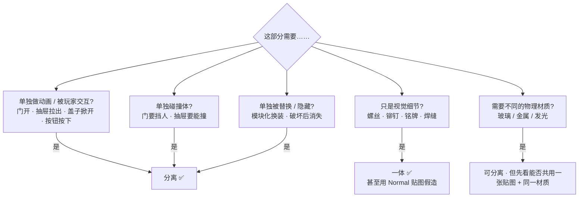
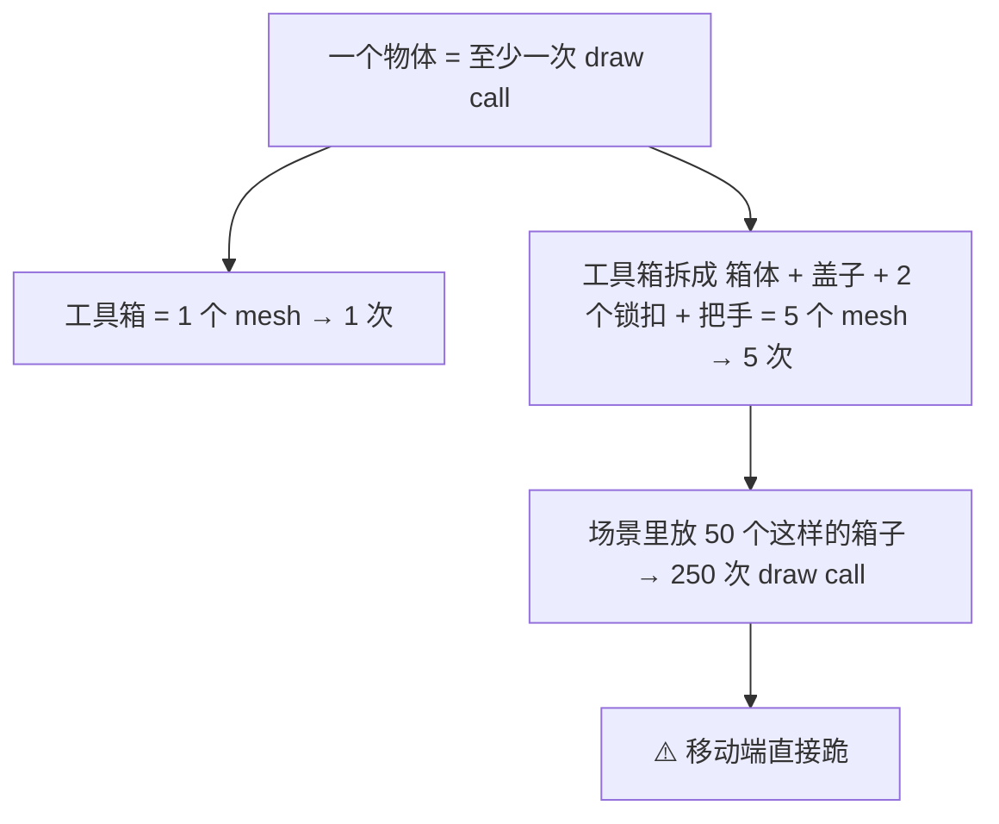
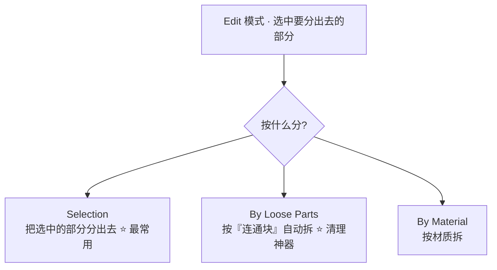
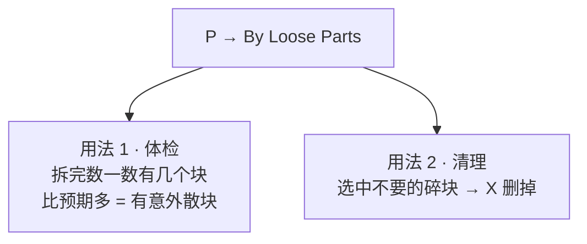
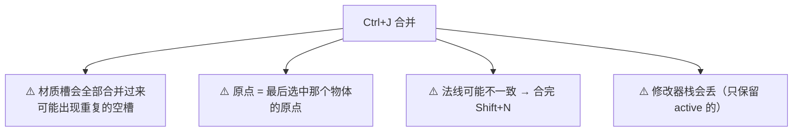
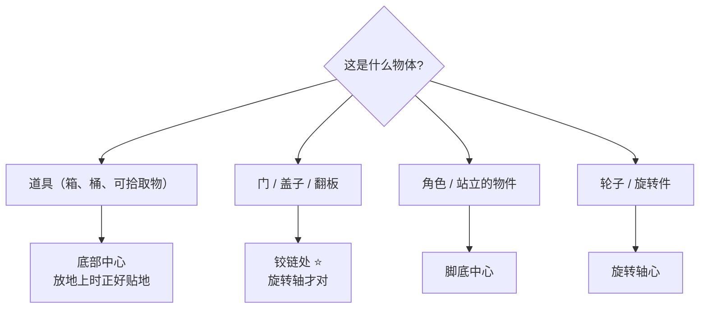

# 06 · 分离件 vs 一体件：`P → Separate` 的决策

> 一句话：**会动的分开，不会动的合起来。** 分错的代价在 Stage 7（动画/交互）才爆，合错的代价在引擎里（draw call）立刻爆。

---

## 一、决策树



### 判定表

| 维度 | 分离 | 一体 |
| ---- | ---- | ---- |
| 动画 / 交互 | ✅ 必须分 | ❌ |
| 单独碰撞 | ✅ | ❌ |
| 单独替换 / 破坏 | ✅ | ❌ |
| 只在一个场景出现一次 | 无所谓 | ✅ 省事 |
| 会被大量重复摆放 | ⚠️ 分离后可用实例化 | 见下 |
| 纯视觉细节 | ❌ | ✅ |
| 同一个材质、同一张贴图 | ❌ 没必要分 | ✅ |

> **默认倾向：能做在一起就做在一起。** 分离是有成本的（见第二节），只在有明确理由时才付。

---

## 二、分离的成本：draw call



| 做法 | draw call | 优点 | 缺点 |
| ---- | --------- | ---- | ---- |
| **一体件** | 1 | 最省、导入简单 | 不能单独动 |
| **分离件** | N | 可单独动画/碰撞/替换 | draw call ×N |
| **分离 + 实例化**（`Alt+D`） | 1（同一实例共享） | 可动 + 省 | 需要引擎支持实例化（都支持） |

> **折中方案**：需要动画的部分（盖子、门）分离，其余全部合进主体。
> 工具箱的正确拆解：**箱体（含把手、锁扣）+ 盖子**，共 2 个物体。不是 6 个。

---

## 三、`P → Separate` 怎么用



| 选项 | 用途 | 典型场景 |
| ---- | ---- | -------- |
| **Selection** | 把当前选区拆成新物体 | 把盖子从箱子上拆下来 |
| **By Loose Parts** ⭐ | 自动按「互不相连的部分」拆开 | **布尔/镜像之后清理散块**；或检查模型里有没有意外的孤立块 |
| **By Material** | 按材质槽拆 | 老文件整理、按材质导出 |

### `By Loose Parts` 的两个用法



> **经验**：做完布尔 + 清理之后跑一次 `P → By Loose Parts`，是发现「漏网的内部碎块」最快的方法。

### Join（`Ctrl+J`）的注意事项



| 合并后要做 | 为什么 |
| ---------- | ------ |
| 检查材质槽，删掉重复/空的 | 多一个槽 = 多一次 draw call 风险 |
| `Set Origin` 重设原点 | 原点会是最后选中的那个 |
| `A → Shift+N` | 两边的法线朝向可能不同 |
| 确认修改器没丢 | Join 只保留 active 物体的栈 |

---

## 四、分离件的原点要放在「功能点」



| 类型 | 原点位置 | 理由 |
| ---- | -------- | ---- |
| 道具 | 底部中心 | 摆到地面时 `Z = 0` 即可贴地 |
| **门 / 盖子** | **铰链轴** ⭐ | 旋转动画才对（Stage 7） |
| 抽屉 | 拉出的滑轨前端或后端 | 沿轴平移 |
| 角色 | 脚下 | 与地面/导航对齐 |
| 轮子 | 轴心 | 自转 |

```text
Set Origin: 右键 → Set Origin，或 Shift+Ctrl+Alt+C
  → Origin to Geometry / Geometry to Origin / Origin to 3D Cursor
```

> **把 3D Cursor 放到铰链位置 → `Set Origin → Origin to 3D Cursor`** 是设铰链原点最快的方法。
> 这一步是 Stage 2 的正式内容，但**在 Stage 1 拆盖子时就该顺手做掉**——晚了就得重新对齐动画。

---

## 五、命名与组织

```text
Prop_Toolbox_Metal_01          箱体
Prop_Toolbox_Metal_01_Lid      盖子（同一资产的附属件）

Collection: Prop_Toolbox_Metal_01
  ├─ Prop_Toolbox_Metal_01
  └─ Prop_Toolbox_Metal_01_Lid
```

| 规则 | 示例 |
| ---- | ---- |
| 类型_名称_变体_序号 | `Prop_Crate_Wood_01` |
| 附属件加后缀 | `..._Lid` / `..._Handle` |
| 一个资产一个 Collection | 便于整体移动/导出（Stage 2） |
| 参考图单独放 `_REF` 集合 | 见 [`01-参考图设置与对型.md`](01-参考图设置与对型.md) |

---

## 六、坑

- ❌ **该分的没分**（门/盖子做成一体）→ Stage 7 要做动画时整个重来
- ❌ **不该分的乱分**（每颗螺丝一个物体）→ draw call 爆炸
- ❌ **Separate 后不设原点** → 后期做动画时旋转轴在几何中心，门绕着中间转
- ❌ **Join 之后不检查材质槽** → 一堆重复空槽，导出后材质错乱
- ❌ **Join 之后不重算法线** → 一半面朝内
- ❌ **Join 以为修改器会保留** → 只保留 active 那个物体的栈
- ❌ **布尔/镜像之后不检查散块** → 模型内部藏着看不见的碎片，面数虚高
- ❌ **分离件忘了单独设碰撞** → 引擎里门开了但碰撞体还在原地

---

## 七、自检

| # | 自检点 | 通过标准 |
| - | ------ | -------- |
| ① | 决策 | 给出 5 个部件（门板 / 螺丝 / 抽屉 / 铆钉 / 把手），能说出哪些该分离 |
| ② | 成本 | 说出「一个物体 ≈ 一次 draw call」，并说出分离件的补救方案（实例化） |
| ③ | Separate | 会用 `P → Selection` 拆盖子，会用 `P → By Loose Parts` 做体检 |
| ④ | 原点 | 会把盖子的原点设到铰链处（30 秒内） |
| ⑤ | Join | 说出 Join 之后要做的三件事（材质槽 / 原点 / 法线） |
| ⑥ | 命名 | 能给「木箱 + 盖子」起出符合规范的两个名字 |

---

## 八、速查

```text
【决策】会动的分开，不会动的合起来
分离：要动画 / 单独碰撞 / 单独替换 / 单独破坏
一体：纯视觉细节（螺丝、铆钉、铭牌）→ 甚至用 Normal 贴图假造
默认倾向：能合就合

【代价】一个物体 ≈ 一次 draw call
分离件补救：Alt+D 实例化（共享一次 draw call）
工具箱正确拆解：箱体 + 盖子 = 2 个物体（不是 6 个）

【Separate】
Edit 模式 → 选中 → P
  Selection       拆选中部分 ⭐
  By Loose Parts  按连通块自动拆 ⭐ 体检/清理神器
  By Material     按材质拆

【Join 之后必做三件事】
① 检查材质槽，删重复空槽
② Set Origin 重设原点
③ A → Shift+N 重算法线
（另外：Join 只保留 active 物体的修改器栈）

【原点位置】
道具 → 底部中心 ｜ 门/盖子 → 铰链处 ⭐ ｜ 角色 → 脚底 ｜ 轮子 → 轴心
Set Origin: 右键菜单 或 Shift+Ctrl+Alt+C
铰链最快做法：3D Cursor 放到铰链 → Origin to 3D Cursor

【命名】
Prop_Toolbox_Metal_01 ｜ Prop_Toolbox_Metal_01_Lid
一个资产一个 Collection ｜ 参考图放 _REF 集合
```

---

> **下一步**：[`07-练习项目-木箱-油桶-工具箱.md`](07-练习项目-木箱-油桶-工具箱.md) —— 把这一整套用三个道具走一遍。
