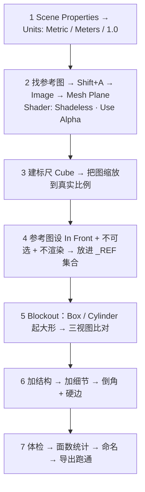
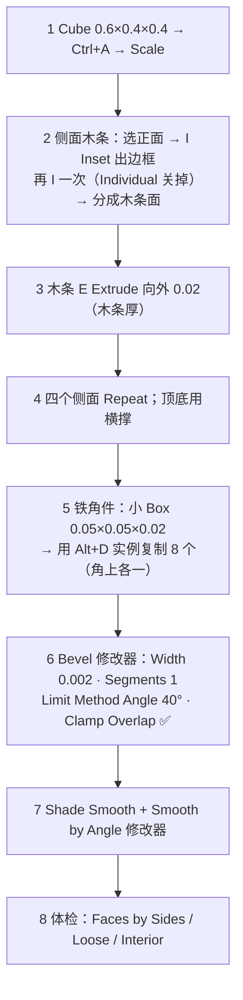
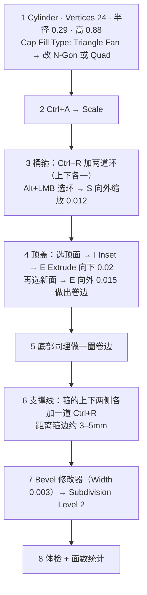
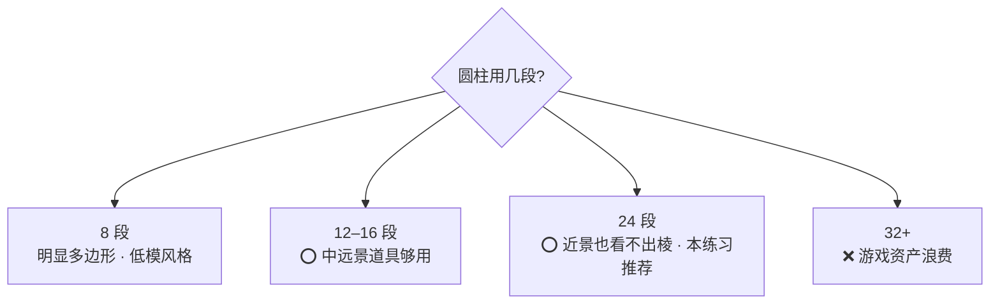
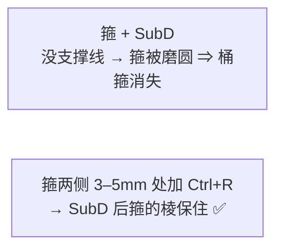
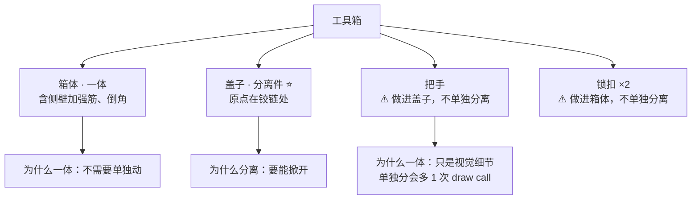
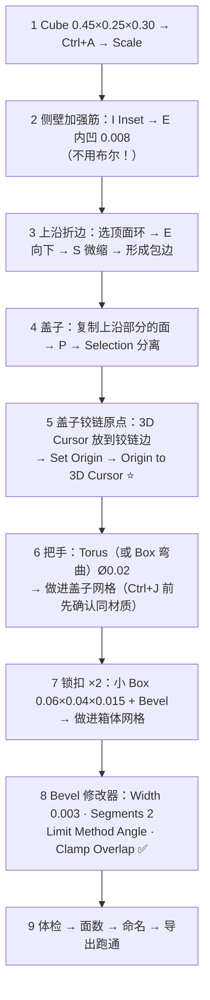

# 07 · 练习项目：木箱 → 油桶 → 工具箱

> 一句话：**三个道具，一个比一个难，第三个是验收项目。做完之后你应该能指着任何一个日常物件说「我知道怎么做」。**
> 文件存到 `../资产/练习文件/02-硬表面建模工作流/`，命名 `Prop_<名称>_<变体>_01`。

---

## 通用开工流程（三个项目都走一遍）



> 面数怎么看：视口右上 Overlay → 勾 **Statistics**（显示 Vertices / Edges / Faces / **Triangles**）。
> **验收看三角形数（tri），不是面数（Faces）**——引擎关心的是 tri。

---

## 项目 1 · 木箱（入门）

### 规格

| 项 | 值 |
| -- | -- |
| 尺寸 | 0.60 × 0.40 × 0.40 m |
| 目标面数 | **≤ 800 tri** |
| 主要训练点 | Inset / Extrude / Bevel / Mirror 复用 / 分离件判断 |
| 预估 | 1.5h |

### 参考图搜集方向

搜索关键词：`wooden crate blueprint` / `wooden crate orthographic` / `军用木箱 三视图`。
找不到三视图就用一张**正面长焦照片 + 已知尺寸**（木箱常见 0.6×0.4×0.4）。

### 步骤



| 步骤 | 关键参数 | 易错点 |
| ---- | -------- | ------ |
| 木条面 | `I` Inset → `I` 再内插（注意 Individual 开关） | 一次 Inset 出不来多条木条，要两次 |
| 挤出木条 | `E` 0.02 m | 别用 Scale 做厚度，那会改比例 |
| 铁角件 | `Alt+D` 不是 `Shift+D` | `Alt+D` 共享数据，8 个角件只占一份内存 |
| 倒角 | Width 0.002（2mm，木材倒棱） | 默认 0.1 = 10cm，箱子直接毁了 |

### 面数账

| 部分 | 大致 tri |
| ---- | -------- |
| 箱体基础 | ~100 |
| 木条（4 面 × 3 条） | ~300 |
| 铁角件（8 × ~12 tri） | ~100 |
| Bevel 1 段后 | ×2–3 |
| **合计** | **~600–800** ⚠️ 容易超 |

> **超预算怎么救**：① 木条从「真挤出」改成「只做正面 + 侧面用 UV/Normal 表现」；② 铁角件从 8 个减到 4 个（只有正面可见的角）；③ Bevel 的 Limit Method 用 Angle，别全倒。

### 做崩了怎么救

| 现象 | 原因 | 解法 |
| ---- | ---- | ---- |
| Inset 出来的面歪斜 | Object Scale ≠ 1 | `Ctrl+A → Scale` 重来 |
| Bevel 后木条间穿模 | Width > 木条间隙 | 开 Clamp Overlap；降到 0.001 |
| 面数破 1500 | Bevel 全倒 + 木条太多 | Limit Method 改 Angle；木条改 Normal 贴图 |
| 铁角件和箱体分离 | 忘了 `Alt+D` 之后还要定位 | 逐一对齐，或用 Array + Mirror |

---

## 项目 2 · 油桶

### 规格

| 项 | 值 |
| -- | -- |
| 尺寸 | Ø0.58 × 高 0.88 m（55 加仑标准桶） |
| 目标面数 | **≤ 800 tri** |
| 主要训练点 | Cylinder 段数决策 / 加环做箍 / 支撑线 / SubD |
| 预估 | 2h |

### 步骤



### Cylinder 段数怎么定



> **判据**：转到 Material Preview，看高光在圆柱面上是不是一条连续的带。24 段基本连续。

### 支撑线为什么必须加



> 原理见 [`../01-拓扑与建模思维/03-Subdivision修改器与支撑线.md`](../01-拓扑与建模思维/03-Subdivision修改器与支撑线.md)：**支撑线距离 ≈ SubD 后的圆角半径**。
> 想要 3mm 的圆角 → 支撑线放在离边 3mm 处。

### 面数账

| 部分 | 大致 tri |
| ---- | -------- |
| Cylinder 24 段 + 盖 | ~100 |
| 两道箍（各 +1 环 × 24） | ~100 |
| 顶/底卷边 | ~100 |
| 支撑线（4 道 × 24） | ~100 |
| **SubD Level 2 之前** | **~400** |
| SubD Level 2 后（视口） | ×16 = 6400 ⚠️ |

> ⚠️ **面数怎么算**：预算里的 800 tri 指的是**导出时的实际网格**。
> **如果用 SubD 且导出时勾了 Apply Modifiers，那就是 6400 tri——远超预算。**
> **正确做法**：油桶这种简单形状**不要叠 SubD**，直接纯 Bevel（Segments 2）做圆角，最终网格 ~800 tri。
> SubD 只是用来**验证拓扑**的（验收标准第 3 条「加 SubD 2 级后形状不崩」是压力测试，不是最终方案）。

### 做崩了怎么救

| 现象 | 原因 | 解法 |
| ---- | ---- | ---- |
| 箍在 SubD 后消失 | 没加支撑线 | 箍两侧各加一道 `Ctrl+R` |
| 顶面出现极点星状凹陷 | Cap Fill Type 是 Triangle Fan | 改 N-Gon（或 Quad 系列），或手工重铺顶面 |
| 箍一圈宽度不均 | Scale 缩放时轴心不对 | 用 `Alt+LMB` 选环 + `S` + `Shift+Z` 限定轴向；LoopTools → Space 匀线 |
| Bevel 在箍的拐角炸开 | Width 大于箍高 | 降到 0.002；开 Clamp Overlap |

---

## 项目 3 · 工具箱 / 弹药箱 ⭐ 验收项目

### 规格

| 项 | 值 |
| -- | -- |
| 尺寸 | 0.45 × 0.25 × 0.30 m |
| 目标面数 | **≤ 2500 tri**（箱体 + 盖子合计） |
| 主要训练点 | 把手 / 锁扣 / 倒角 / **盖子分离 + 铰链原点** |
| 预估 | 2.5h |

### 参考图搜集方向

`ammo box blueprint` / `toolbox orthographic` / `军用弹药箱 三视图`。
弹药箱（如美制 .50 cal 弹箱）有公开尺寸，是很好的练习对象。

### 结构分解（先画后做）



> 这个分解本身就是 [`06-分离件与一体件`](06-分离件与一体件-P-Separate-开洞.md) 的实操。**做完要能说出每一项的理由。**

### 步骤



| 部件 | 做法要点 | 易错点 |
| ---- | -------- | ------ |
| 加强筋 | `I` + `E` 内凹，**不用布尔** | 想用布尔开槽 → 拓扑毁掉 |
| 把手 | Torus 或 `Ctrl+R` + 缩放的 Box | 做成独立物体 → draw call +1 |
| 锁扣 | 小 Box + Bevel（Weight 分级） | 忘记倒角 → 看起来像贴片 |
| **盖子分离** | `P → Selection` | 分离后忘记设铰链原点 |
| Bevel | Width 0.003 · Segments 2（中景道具） | Segments 给 3+ → 面数破预算 |

### 面数账

| 部分 | 大致 tri |
| ---- | -------- |
| 箱体 + 加强筋 | ~600 |
| 盖子 | ~300 |
| 把手（Ø0.02 Torus 12×8 段） | ~200 |
| 锁扣 ×2 | ~200 |
| Bevel 2 段后 | ×2.5–3 |
| **合计** | **~2000–2500** ⚠️ 卡在预算边缘 |

> **超预算怎么救**：① 把手 Torus 段数降到 8×6；② Bevel 降到 1 段（配 Smooth by Angle 修饰）；③ 锁扣的倒角用 `Ctrl+B` 局部手倒，而不是全模型 Bevel 2 段。

### 做崩了怎么救

| 现象 | 原因 | 解法 |
| ---- | ---- | ---- |
| 盖子掀开时绕中心转 | 原点在几何中心 | 3D Cursor 移到铰链 → Set Origin ⭐ |
| 加强筋处 Bevel 穿模 | 筋间距 < 2×倒角宽度 | Clamp Overlap；或倒角降到 0.0015 |
| 把手和盖子之间有缝 | 两个网格没对齐 | 开吸附（磁贴图标 → Vertex），或手工对齐 |
| Join 之后材质错乱 | 材质槽重复 | 检查并删除多余槽 |
| 面数破 3000 | 见上面「超预算怎么救」 | — |

---

## 三个项目的验收清单（逐条打勾）

```text
通用
[ ] 场景单位：Metric / Meters / Unit Scale 1.0
[ ] 参考图已对齐到真实比例（用标尺验过）
[ ] 参考图：In Front + 不可选 + 不渲染 + 在 _REF 集合
[ ] Object Scale = 1,1,1（Ctrl+A 已 Apply）
[ ] 尺寸与规格表一致（用 N 面板核对）

拓扑
[ ] Select → All by Trait → Faces by Sides：无 >4 的面（n-gon）
[ ] 无 Loose Geometry / Interior Faces
[ ] 法线：Face Orientation 全蓝
[ ] Quad 占 95% 以上
[ ] 加 SubD Level 2 后形状不崩（压力测试，做完可撤销）

面数
[ ] 木箱 ≤ 800 tri
[ ] 油桶 ≤ 800 tri
[ ] 工具箱（箱+盖）≤ 2500 tri

交付
[ ] 命名：Prop_Crate_Wood_01 / Prop_Barrel_Metal_01 / Prop_Toolbox_Metal_01
[ ] 工具箱盖子已分离，原点在铰链处
[ ] 存到 资产/练习文件/02-硬表面建模工作流/
[ ] 导出 GLB 一次，在任意引擎里看过（跑通闭环）
```

---

## 扩展变体（做完三个之后的加练）

| 变体 | 训练点 |
| ---- | ------ |
| 破损木箱（缺一块板、木条断裂） | 有机 + 硬表面混合（预热 Stage 5） |
| 油桶堆叠（3 个不同姿态） | 实例化 `Alt+D` + 摆放（预热 Stage 7） |
| 弹药箱开盖状态 | 分离件的动画准备（预热 Stage 7） |
| 带提手和轮子的工具箱 | 更多分离件决策 |

---

## 速查

```text
【开工】
Units: Metric / Meters / 1.0
参考图：Shift+A → Image → Mesh Plane · Shadeless · Use Alpha
缩放到标尺吻合 → In Front + 不可选 + 不渲染 + _REF 集合
Blockout → 三视图比对 → 结构 → 细节 → 倒角 → 体检

【面数】Overlay → Statistics · 看 Triangles（不是 Faces）

【木箱 0.6×0.4×0.4 · ≤800 tri】
Cube → I×2 出木条 → E 0.02 → 铁角件 Alt+D ×8
Bevel 0.002 · Segments 1 · Angle 40° · Clamp ✅
超预算：木条改 Normal 贴图 ｜ 角件减到 4 个

【油桶 Ø0.58×0.88 · ≤800 tri】
Cylinder 24 段 → Ctrl+R ×2 做箍（S 外扩 0.012）
箍两侧 3–5mm 加支撑线 → 顶盖 I+E 做卷边
⚠️ 别叠 SubD 导出（×16 会破预算）；纯 Bevel Segments 2 收尾

【工具箱 0.45×0.25×0.30 · ≤2500 tri ⭐ 验收】
箱体（含加强筋·锁扣）+ 盖子（含把手）= 2 个物体
加强筋用 I+E，不用布尔
盖子：P → Selection 分离 → 原点设到铰链 ⭐
Bevel 0.003 · Segments 2 · Angle · Clamp ✅

【导出前】Ctrl+A → 删参考图 → M By Distance → Shift+N
→ 导出 GLB（勾 Apply Modifiers）→ 引擎里看一眼
```

---

> **下一步**：回到 [`笔记.md`](笔记.md) 做验收自检，然后进入 Stage 2 非破坏性流程与资产管理（[`../03-非破坏性流程与资产管理/笔记.md`](../03-非破坏性流程与资产管理/笔记.md)）。
