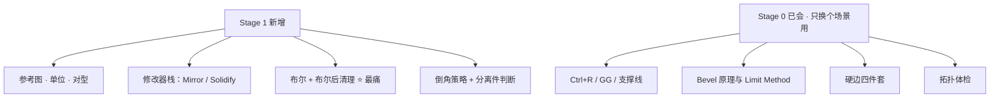
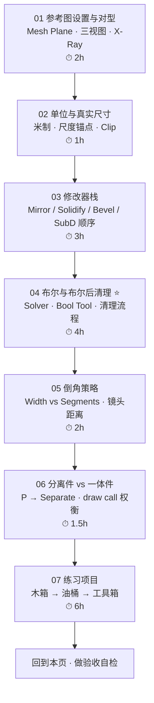
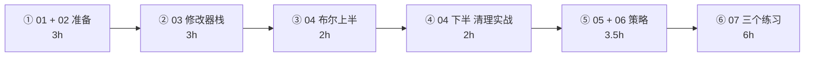

# Stage 1 · 硬表面建模工作流（15–20h）

> **一句话目标**：拿到一张参考图，能按流程做出比例正确、拓扑干净、可继续加工的道具。
> 状态：⬜ 未开始　|　开工：　　　|　完成：
> 环境：**Blender 5.2 LTS** · macOS　|　前置：`00-基础` 已通（尤其 [`06-倒角-Bevel.md`](../00-基础/06-倒角-Bevel.md)）、`01-拓扑与建模思维` 已通（尤其 [`04-硬边控制四件套`](../01-拓扑与建模思维/04-硬边控制四件套-ShadeSmooth-Crease-Sharp-BevelWeight.md)）

---

## 0. ⚠️ 先订正：路线图 Stage 1 里有四条已经过时或说反了

照着路线图学之前先看这张表，否则你会去 Preferences 里找一个**已经不需要勾的插件**，或者被一条说反了的坑带偏。

| # | 路线图 / 本目录旧稿的说法 | **5.x 的实际情况** | 依据 |
| - | ---------------------- | ------------------ | ---- |
| 1 | 插件 `Import Images as Planes` 需要去 `Preferences → Add-ons` 勾选 | **4.2 起已内置**，不再走插件。用 `Shift+A → Image → Mesh Plane`，直接在导入对话框里设材质与尺寸 | 官方手册 Images as Planes（4.2 后归入 `3D Viewport → Add → Image → Mesh Plane`） |
| 2 | 硬边处理：`Shade Auto Smooth` + `Mark Sharp` | **`Shade Auto Smooth` 在 4.1 已被移除**。改成 `Object → Shade Smooth by Angle`，或加 **Smooth by Angle 修改器**。`Mark Sharp` 本身仍然对 | Blender 4.1 release notes（PR #108014）／见 [`../01-拓扑与建模思维/04-硬边控制四件套`](../01-拓扑与建模思维/04-硬边控制四件套-ShadeSmooth-Crease-Sharp-BevelWeight.md) |
| 3 | 「Bevel 修改器没设 Limit Method → **该硬的地方被倒圆**」 | **说反了**。Limit Method 默认 `None` = **所有边都倒**，症状是平面上的布线边也被倒、模型炸线。该硬的地方被倒圆是**另一回事**（那是宽度/角度阈值问题） | 官方手册 Bevel 修改器：`None — No limit, all edges will be beveled` |
| 4 | Bool Tool 用「`Ctrl+Shift+B`」打开 | 面板快捷键确实在 `3D Viewport → Sidebar → Edit` 标签；但 **Auto/Brush Boolean 的运算快捷键全部带小键盘**（`Ctrl+Numpad±`、`Shift+Ctrl+Numpad±`）。macOS 没小键盘时这些按不出来 → **用侧边栏按钮**，或去 Keymap 里改 | 官方手册 Bool Tool（Reference 段：Location `3D Viewport ‣ Sidebar ‣ Edit tab, Shift-Ctrl-B`） |

> 📌 第 1、2 条建议同步回 `Blender学习路线图.md`（插件表第 71 行、Stage 1 清单第 141 与 147 行）；第 3 条同步回 [`速查/常见坑汇总.md`](../速查/常见坑汇总.md) 的「硬表面」段。
>
> 📌 通用兜底：**快捷键按不出来或菜单对不上，一律按 `F3` 搜命令名**，不要死记位置（你自己的笔记第 38 节已经这么做了）。

---

## 1. 本阶段在解决什么问题

Stage 0 结束你已经有「拓扑判断力」：知道线该加在哪、SubD 之后会变成什么样。但那都是**在方块上练的**。Stage 1 要解决的是：把这种判断力用在**有具体形状、具体尺寸、具体功能**的东西上。

所以本阶段只新增**四样东西**，其余都是你已经会的工具在新场景里的用法：

1. **对型的流程**（参考图怎么摆、怎么信、怎么验）
2. **真实尺寸的习惯**（米、毫米、直觉）
3. **布尔这一把刀**（以及用完之后怎么收拾残局）——本阶段最难的一节
4. **倒角的策略**（Width 与 Segments 分开想，按镜头距离给值）

---

## 2. 学习路径（按顺序走完就是闭环）

| # | 文件 | 核心问题 | 预估 |
| - | ---- | -------- | ---- |
| 01 | [`01-参考图设置与对型.md`](01-参考图设置与对型.md) | 图怎么摆、怎么信、比例怎么验 | 2h |
| 02 | [`02-单位与真实尺寸.md`](02-单位与真实尺寸.md) | 为什么必须按米做、怎么给真实尺寸 | 1h |
| 03 | [`03-修改器栈-Mirror-Solidify-Bevel-SubD.md`](03-修改器栈-Mirror-Solidify-Bevel-SubD.md) | 修改器按什么顺序叠、为什么 | 3h |
| 04 | [`04-布尔与布尔后清理.md`](04-布尔与布尔后清理.md) | 什么时候能用布尔，用完怎么收拾 | 4h |
| 05 | [`05-倒角策略-宽度-段数-镜头距离.md`](05-倒角策略-宽度-段数-镜头距离.md) | 倒角给多少、给几段 | 2h |
| 06 | [`06-分离件与一体件-P-Separate-开洞.md`](06-分离件与一体件-P-Separate-开洞.md) | 什么时候该分成两个物体 | 1.5h |
| 07 | [`07-练习项目-木箱-油桶-工具箱.md`](07-练习项目-木箱-油桶-工具箱.md) | 把上面 6 篇用一遍 | 6h |

> 合计约 **19.5h**，落在路线图 15–20h 区间内。
> **04 和 07 不要压缩**：前者是硬表面唯一的「真难点」，后者是唯一能证明你学会了的东西。01 和 02 可以合并成一个晚上做完（它们都是「开工前的准备」，不是技术）。

---

## 3. 必学清单

> 判断标准不是「我看过了」，而是「不看教程能当场做出来 / 说出来」。每条后面标了出处。

### 模块 1 · 参考图设置与对型（[01](01-参考图设置与对型.md)）

- [ ] 用 `Shift+A → Image → Mesh Plane` 导入三视图，并说清和老教程「勾插件」的区别
- [ ] 三块图互相垂直对齐到 Front / Right / Top，且**三视图比例一致**
- [ ] 参考图设为 **In Front / Wire** + 关掉 Selectable，不挡视线、不会误选
- [ ] 用「已知尺寸的标尺方块」把图缩放到真实比例，而不是靠眼估
- [ ] 能说出「这张图不能对型」的三种情况（透视、比例不符、非正交）

### 模块 2 · 单位与真实尺寸（[02](02-单位与真实尺寸.md)）

- [ ] `Scene Properties → Units`：Metric + **Meters**，Unit Scale = 1.0
- [ ] 用 `N` 面板 **Dimensions** 直接给真实尺寸，输完立刻 `Ctrl+A → Scale`
- [ ] 随口给出 5 个尺度锚点（门高、桌高、台阶、油桶、人）
- [ ] 小物体时知道要调 **Clip Start** 和 **Grid Scale** 才能看得见

### 模块 3 · 修改器栈（[03](03-修改器栈-Mirror-Solidify-Bevel-SubD.md)）

- [ ] 说出「栈从上往下依次执行」意味着什么，能画出推荐顺序
- [ ] Mirror：Axis / Merge / Clipping / Mirror Object 各自解决什么问题
- [ ] **知道 Mirror 的镜像侧法线是反的**，Apply 后必须 `Shift+N`
- [ ] Solidify：Thickness / Offset / Even Thickness / **Crease**（配合 SubD）/ Material Offset
- [ ] 说出 Bevel 必须排在 SubD **之前**的理由（不是背的，是算过面数）

### 模块 4 · 布尔与布尔后清理（[04](04-布尔与布尔后清理.md)）⭐

- [ ] 布尔四要素：Operation / Operand Type / **Solver（Fast vs Exact）** / Solver Options
- [ ] `Fast` 不支持重叠几何、`Exact` 慢但可靠 → 能说出各自什么时候用
- [ ] Bool Tool 的 **Brush vs Canvas** 概念；知道 **Auto Boolean 是破坏性的**
- [ ] 记住铁律：**布尔只用来开洞，结构靠挤出**
- [ ] 布尔后清理五步：体检 → Limited Dissolve → 手工重布线 → `M → By Distance` → `Shift+N`
- [ ] 至少掌握 2 种「不用布尔开洞」的替代方案

### 模块 5 · 倒角策略（[05](05-倒角策略-宽度-段数-镜头距离.md)）

- [ ] **Width 与 Segments 分开想**：Width = 高光宽度，Segments = 剖面平滑度
- [ ] 三个锚点给值：真实加工半径 / 经验比例 0.5%–2% / **镜头距离**
- [ ] 游戏资产默认配方：`Segments = 1–2` + `Limit Method = Angle` + `Clamp Overlap` + `Harden Normals`
- [ ] 会用 **Bevel Weight** 做分级倒角（外壳大、内部小）
- [ ] 会用「转视角看高光」判定倒角对不对

### 模块 6 · 分离件 vs 一体件（[06](06-分离件与一体件-P-Separate-开洞.md)）

- [ ] 决策树：要单独动 / 单独碰撞 / 单独替换 → 分离；只是视觉细节 → 一体
- [ ] `P → Selection` 与 `P → By Loose Parts` 的区别（后者是清理散块神器）
- [ ] 分离件的原点放在**功能点**（铰链、把手），不是几何中心
- [ ] 知道「一个物体 ≈ 一次 draw call」，能说出分离件的性能代价

### 模块 7 · 练习（[07](07-练习项目-木箱-油桶-工具箱.md)）

- [ ] 木箱：木条 + 铁角件，≤800 tri
- [ ] 油桶：箍 + 顶盖 + 支撑线，≤800 tri
- [ ] **工具箱（验收项目）**：把手 + 锁扣 + 倒角 + 盖子可分离，≤2500 tri

---

## 4. 时间怎么切（15–20h 拆成 6 段）

| 段 | 内容 | 产出 |
| - | ---- | ---- |
| ① | 读 01 + 02，装好三视图、把场景单位设成米 | 一个「参考图已对齐」的 .blend |
| ② | 读 03，用一个对称道具把 Mirror/Solidify/Bevel/SubD 各走一遍 | 修改器顺序笔记（自己画一遍） |
| ③ | 读 04 上半：Solver、Bool Tool、Brush/Canvas | 布尔成功 + 布尔失败的对照截图 |
| ④ | 读 04 下半：清理五步，拿一个方块开三个洞练手 | 清理前 / 清理后的拓扑对比 |
| ⑤ | 读 05 + 06：倒角配方表 + 分离决策树 | 一张自己画的决策树 + 参数表 |
| ⑥ | 做 07 的三个练习 | 三个 .blend + 面数记录 + 三视图对比 |

> 单次动手不超过 **45 分钟**就起来动一动。Stage 1 比 Stage 0 更耗眼——你要同时盯参考图、面数统计和拓扑体检三个地方。

---

## 5. 练习项目

| # | 项目 | 要点 | 目标面数 | 完成度 |
| --- | --- | --- | --- | --- |
| 1 | 木箱（入门） | Cube → Inset 木条面 → Extrude → Bevel → 铁角件 | ≤800 tri | ⬜ |
| 2 | 油桶 | Cylinder → 加环做箍 → Inset+Extrude 顶盖 → 支撑线 + SubD | ≤800 tri | ⬜ |
| 3 | **工具箱 / 弹药箱**（验收项目） | 把手、锁扣、倒角、盖子可分离 | ≤2500 tri | ⬜ |

> 详细尺寸、步骤参数、「做崩了怎么救」见 [`07-练习项目-木箱-油桶-工具箱.md`](07-练习项目-木箱-油桶-工具箱.md)。
> 文件存到 `../资产/练习文件/02-硬表面建模工作流/`，命名用 `Prop_<名称>_<变体>_01`（规范见 [`../07-资产规范与引擎导出/笔记.md`](../07-资产规范与引擎导出/笔记.md)）。

---

## 6. 验收标准（可判定，不是感觉）

- [ ] 对三视图检查，比例误差肉眼可接受
- [ ] 全部 Quad 为主，无 N-gon（允许极少数）
- [ ] 加 SubD 2 级后形状不崩
- [ ] 面数落在预算内（见 [`../07-资产规范与引擎导出/笔记.md`](../07-资产规范与引擎导出/笔记.md)）
- [ ] 文件命名规范到位（类型_名称_变体_序号）
- [ ] **导出跑通一次**：GLB 导入任意引擎能正常显示（路线图 Stage 6 的铁律：**第 1 个资产就跑通闭环**）

### 5 条自检（全部通过才算 Stage 1 完成）

| # | 自检点 | 怎么判定 |
| - | ------ | -------- |
| ① | 尺寸可信 | 报出三个道具的**真实尺寸（米）**，且场景单位设置正确 |
| ② | 布尔会收尾 | 给一个刚布尔完的方块（满地 n-gon），能在 10 分钟内清到「Quad 为主」并说出每一步干了什么 |
| ③ | 倒角有依据 | 给出一个「第三人身视角的木箱」，能在 30 秒内说出倒角给多少毫米、几段、理由 |
| ④ | 顺序说得清 | 说出 Mirror / Solidify / Bevel / SubD 的推荐顺序，并说出 Bevel 必须在 SubD 之前的**面数理由** |
| ⑤ | 闭环 | 三个练习都过了体检，工具箱已成功导出并在引擎里看过 |

---

## 7. 常见坑

> 前三条是路线图原有的（第 3 条已订正措辞），后面是本阶段补充的。够通用的坑应该同步到 [`速查/常见坑汇总.md`](../速查/常见坑汇总.md)。

- ❌ **布尔完不清理** → 三角面和 n-gon 一堆 → UV / 烘焙全崩。**布尔只用来开洞，结构靠挤出**
- ❌ **Bevel 修改器不设 Limit Method（默认 None）** → 平面上的布线边也被倒，模型炸线。硬表面起手式是 `Angle = 30°–60°`
- ❌ **不做真实尺寸** → 进引擎后比例全乱
- ❌ **照着透视照片对三视图** → 怎么对都对不上。参考图必须是正交三视图，或至少是长焦、无畸变的照片
- ❌ **用 Scale 拉伸物体来「调整尺寸」而不 Apply** → Bevel 宽度、SubD、布尔全被非均匀拉伸带偏
- ❌ **布尔 cutter 边缘刚好贴在表面上（共面）** → `Fast` 求解器必然出错 → 换 `Exact`，或让 cutter 明显穿透
- ❌ **Mirror 之后不检查法线** → 镜像侧法线朝内，渲染一片黑、布尔结果诡异 → Apply 后 `Shift+N`
- ❌ **在布尔生成的边上直接大倒角** → 沿碎边炸开 → 先清理，再倒；必要时用 `Limit Method = Weight` 把布尔边排除
- ❌ **把螺丝、铆钉这类细节做成独立物体** → draw call 爆炸。做进同一个网格，或用 Normal 贴图假造
- ❌ **参照图忘了关渲染** → 导出/渲染时把参考图一起带走 → 导出前删掉所有参考图（[`../速查/导出检查清单.md`](../速查/导出检查清单.md)）

---

## 8. 资源

- **主资源 1**：[`../00-基础/06-倒角-Bevel.md`](../00-基础/06-倒角-Bevel.md) —— Stage 1 用到的一半知识在这篇里，别跳过
- **主资源 2**：[`../01-拓扑与建模思维/05-拓扑体检与清理.md`](../01-拓扑与建模思维/05-拓扑体检与清理.md) —— 布尔后清理的五步里有三步直接抄这篇
- CG Cookie · *Press Start: Learn Blender by Making a Game-Ready Asset*（Jonathan Lampel，5h，付费）—— 最贴这条主线
- YouTube · **Grant Abbitt**「Detailed Game Assets」系列（免费，偏中高级，硬啃很值）
- YouTube · **Imphenzia**（低模游戏资产，免费）
- YouTube · **Blender Secrets**「Easy hole modeling」（开洞技巧，免费，1 分钟一条）
- 官方手册 5.2 LTS：Bevel Modifier / Boolean Modifier / Bool Tool / Images as Planes / Scene Units

> 本阶段**只允许 1–2 个主资源**（路线图第 7 节防弃坑规则）。建议：自己这两篇笔记 + 一门课。

---

## 我的记录

### ____-__-__ · 第 __ 次练习

- **练了什么**：
- **卡点**：
- **怎么解决的**：
- **下次要注意**：

---

## 阶段复盘

1. 学会了什么（3 条以内，用自己的话）：
2. 踩过的坑（≥3 条；够通用的同步到 `速查/常见坑汇总.md`）：
3. 还差什么（Stage 2 要补的）：
4. 产出物清单（文件路径 + 三角形数 + 截图）：

---

> **下一步**：Stage 2 非破坏性流程与资产管理（[`../03-非破坏性流程与资产管理/笔记.md`](../03-非破坏性流程与资产管理/笔记.md)）。
> 本阶段留下的最重要的一条肌肉记忆是：**布尔是最后手段，不是第一手段**——它会一直管到 Stage 4 的烘焙（脏拓扑烤出来的图全是黑块）。
