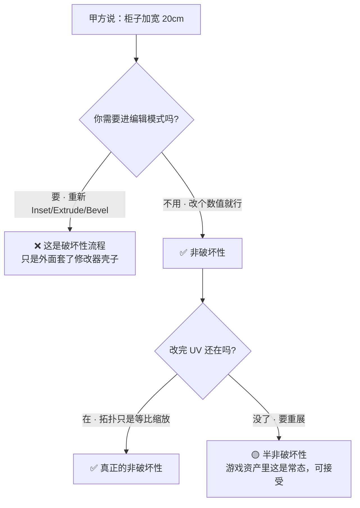
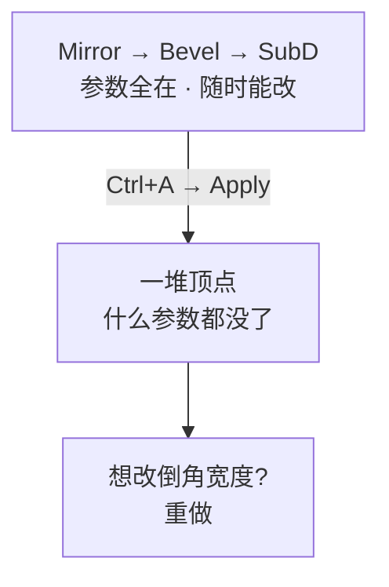
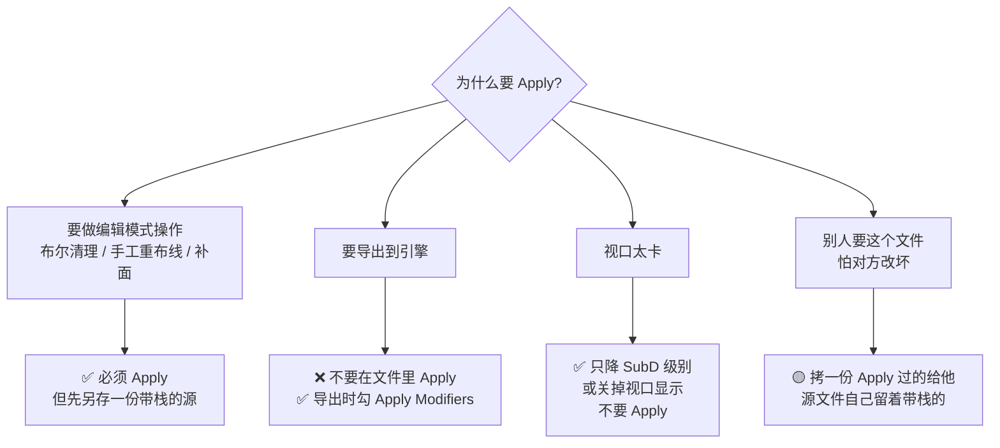
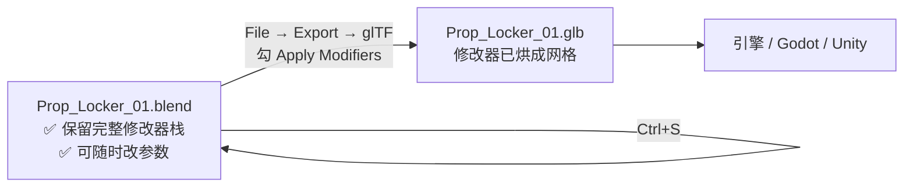
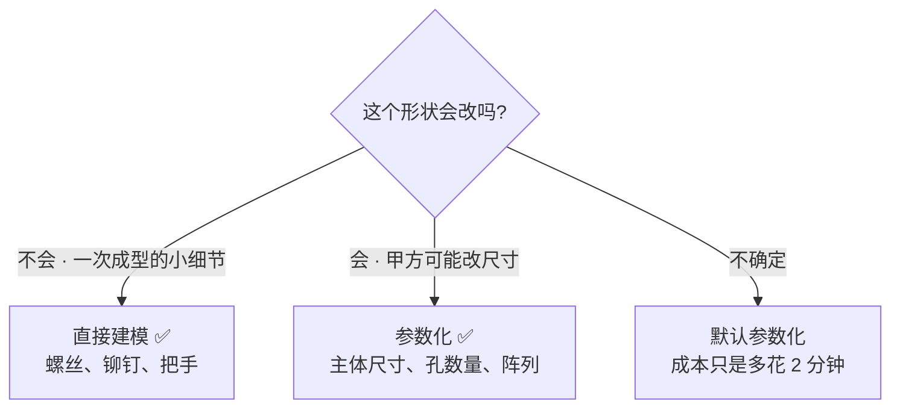

# 01 · 非破坏性的定义与决策框架

> 一句话：**非破坏性不是「用了修改器」，而是「改需求时改参数、不碰几何」。**
> 本篇是本阶段唯一的「思维」内容，后面 7 篇都是它的具体化。

---

## 一、先给一个能执行的定义

网上讲「非破坏性流程」大多停在口号层面。这里给一个**可判定**的定义：

> 一个流程是**非破坏性的**，当且仅当：
> **需求变更时，你能通过改参数达成，而不需要重新编辑顶点。**

判定方法很简单，就一条测试：



⚠️ **「半非破坏性」在游戏资产里是正常的**，不用强求。因为只要几何变了，UV 通常就得重排——这是物理限制，不是流程问题。我们的目标是**把「几何改动」的次数降到最低**，而不是消灭它。

---

## 二、可逆 / 不可逆的分界线

这是本篇最该背下来的一张表：

| 操作 | 可逆? | 说明 |
| ---- | ----- | ---- |
| 加 / 删 / 改**修改器**及其参数 | ✅ 完全可逆 | 随时能改回去，随时能删 |
| 物体级变换（G/R/S） | ✅ 可逆 | 改数值即可 |
| `Alt+D` / `Shift+D` / 集合实例 | ✅ 可逆 | 删除副本不影响源 |
| 集合归属、命名、颜色标签 | ✅ 可逆 | 纯组织操作 |
| **编辑模式里的任何操作** | ❌ **不可逆** | Inset / Extrude / Bevel / 环切 → 烙进顶点了 |
| **`Ctrl+A` Apply 修改器** | ❌ **不可逆** | 栈没了，参数也没了 |
| **`Ctrl+A` Apply Transform** | ❌ 不可逆（但通常无害） | 见 [06 篇](06-原点与变换-Set-Origin-Apply.md) |
| **Bool Tool 的 Auto Boolean** | ❌ **不可逆** | 名字带 "Auto" 的通常都是直接改网格 |
| **`Make Single User`** | ❌ 不可逆 | 共享关系断了就接不回去 |
| **展 UV / 烘焙贴图** | ❌ 不可逆（会覆盖） | 重做等于重来一遍 |
| **Save 覆盖原文件** | ❌ 不可逆 | 用 Save Incremental（[07 篇](07-文件与资产库-Append-Link-Asset-Browser.md)） |


> 💡 心智模型：**Blender 里有一条「单向门」——修改器的世界（参数）和网格的世界（顶点）。**
> 只要还在修改器这一侧，你随时能改主意；一旦 Apply 或进编辑模式，就掉到网格那一侧，回不去了。
> **能晚掉下去，就晚掉下去。**

---

## 三、三个「看起来可逆其实不可逆」的坑

### 3.1 Apply 是最常见的单向门



**为什么大家还是老 Apply？** 三个正当理由：

1. 要做**编辑模式操作**（比如布尔后清理、手工补面）——必须先 Apply
2. 要**导出**（不 Apply 就勾导出面板的 `Apply Modifiers`）
3. 修改器**吃性能**（SubD Level 3 卡视口）

但第 2 条有更好的解法，见下一节。

### 3.2 Auto Boolean 是个陷阱

Bool Tool 的 `Auto Boolean` 会**直接修改网格**（等价于编辑模式布尔）。它方便，但一按下去栈就没了。

> 铁律（Stage 1 已立，这里重申）：**需要保留可逆性时，用 Boolean 修改器，不要用 Auto Boolean。**
> 判断方法：看修改器面板有没有多出一个 `Boolean` 条目——有就是可逆的，没有就是烤死的。

### 3.3 `Make Single User` 一去不回

`Alt+D` 之后想单独改一个副本，`Object → Relations → Make Single User → Object & Data` 会把共享关系断开。**断开了没有「重新链接」的反向操作**（只能删掉重新 `Alt+D`）。

---

## 四、Apply 时机决策树 ⭐

这是本篇唯一需要背下来的图：



### 配套做法：源文件 + 导出时烘焙



| 文件 | 修改器栈 | 用途 |
| ---- | -------- | ---- |
| `.blend` 源文件 | ✅ 保留 | 迭代、改需求 |
| `.glb` / `.fbx` 导出 | 已烘焙 | 进引擎、交付 |

> ⚠️ **一旦你在 `.blend` 里 Apply 了，这个文件就从「源文件」降级成「成品」了。**
> 迭代能力是 Blender 相对其他 DCC 最大的优势之一，别自己扔掉。

### 什么时候「反过来」更好：先破坏性后参数化

有时先做出形状、再套修改器更省事。判断依据：



---

## 五、非破坏性的代价（要诚实）

非破坏性不是免费的。知道代价才能判断什么时候不值得：

| 代价 | 表现 | 什么时候不值 |
| ---- | ---- | ----------- |
| **性能** | SubD Level 3 + Array 200 个 → 视口卡死 | 实例数量上万时考虑烘焙一部分 |
| **文件复杂度** | 一个柜子挂 6 个修改器，Outliner 看不懂 | 超过 8 个修改器就该考虑拆物件 |
| **学习成本** | 新 Array 的参数比 Legacy 多一倍 | 简单的直线阵列用 Legacy 更快 |
| **导出风险** | 忘了勾 Apply Modifiers → 引擎里看到毛坯 | 每次导出前过一遍 [`速查/导出检查清单.md`](../速查/导出检查清单.md) |
| **拓扑不可控** | 布尔/阵列烘出来的拓扑大概率脏 | 要干净拓扑的资产别依赖布尔 |

> 🎯 **实用判断**：**主体的 2–3 个关键维度参数化，其余直接建模。**
> 储物柜例子：柜体宽/高/深、散热孔数量 → 参数化；把手、锁扣、倒角 → 直接建模。
> 全局参数化是强迫症，不是效率。

---

## 六、自检

| # | 自检点 | 通过标准 |
| - | ------ | -------- |
| ① | 定义 | 说出「改需求时改参数、不碰几何」，并说出「半非破坏性」在游戏资产里可接受 |
| ② | 分界线 | 随口举出 5 个不可逆操作（Apply / 编辑模式 / Auto Boolean / Make Single User / 展 UV） |
| ③ | Apply 时机 | 说出「要导出 → 不 Apply，勾 Apply Modifiers」和「要做编辑模式操作 → 必须 Apply 但先另存」 |
| ④ | 单向门 | 说出 Apply 的三个正当理由（编辑模式 / 导出 / 性能） |
| ⑤ | 代价 | 说出非破坏性的 2 个代价，以及「主体参数化、细节直接建」的折中原则 |

---

## 七、速查

```text
【定义】
非破坏性 = 改需求时改参数、不碰几何
判定：需要进编辑模式吗？需要 → 破坏性

【不可逆清单 · 动手前停一下】
Apply 修改器 / Ctrl+A
编辑模式任何操作（Inset · Extrude · Bevel · 环切）
Bool Tool 的 Auto Boolean
Make Single User
展 UV / 烘焙（会覆盖）
Ctrl+S 覆盖原文件 → 用 Save Incremental

【Apply 决策树】
要做编辑模式操作 → ✅ Apply（先另存带栈的源）
要导出           → ❌ 别 Apply，导出时勾 Apply Modifiers
视口卡           → ✅ 只降 SubD 级别，不要 Apply
要交付给别人     → 拷一份 Apply 过的，源文件自己留着

【配套做法】
.blend 源文件保留栈 ｜ .glb 导出时烘焙
勾 Apply Modifiers 是默认动作，不是备选项

【折中原则】
主体的 2–3 个关键维度参数化 ｜ 螺丝铆钉把手直接建模
```

---

> **下一步**：[`02-修改器栈的顺序与非破坏性组合.md`](02-修改器栈的顺序与非破坏性组合.md) —— 把「参数化」落成具体的修改器组合配方。
