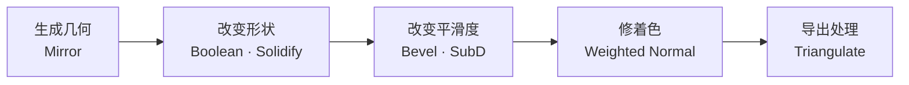
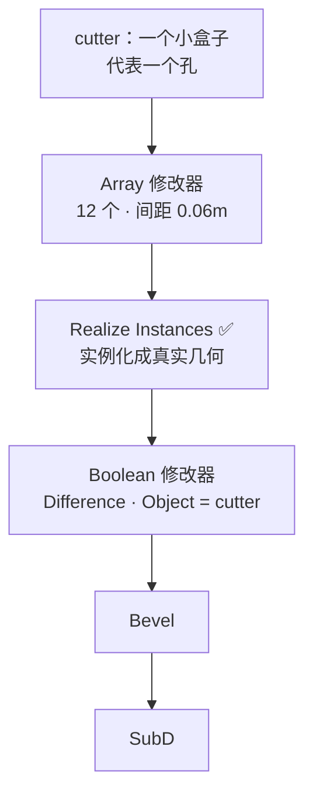
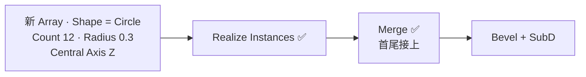
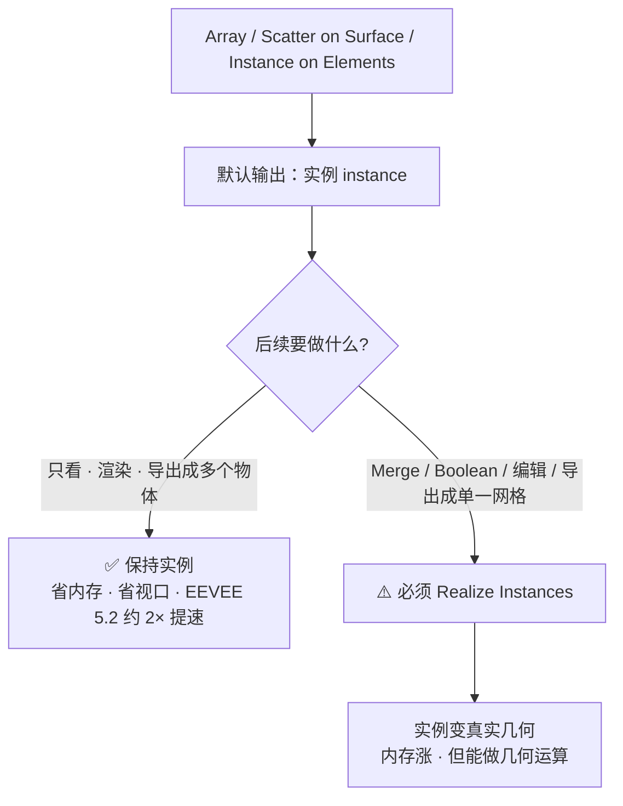

# 02 · 修改器栈的顺序与非破坏性组合

> 一句话：**单个修改器是零件，「配方」才是工具箱——记住 5 个配方，比记住 30 个参数管用。**
> 前置：[`../02-硬表面建模工作流/03-修改器栈-...md`](../02-硬表面建模工作流/03-修改器栈-Mirror-Solidify-Bevel-SubD.md)（顺序语义与 Mirror/Solidify/Bevel/SubD 的每个参数在那篇，本篇**不重复**）

---

## 一、本篇与 02-03 篇的分工

| 内容 | 在哪篇 |
| ---- | ------ |
| 栈从上往下执行的语义 | 02-03 篇第一节 |
| Mirror / Solidify / Bevel / SubD 的**每个参数** | 02-03 篇第二~六节 |
| 修改器的通用操作（改顺序、Copy to Selected…） | 02-03 篇第七节 |
| **一串修改器怎么组合成一套解法** | **本篇** |
| Array / Scatter 这俩**新**修改器 | [03 篇](03-Array与Scatter-on-Surface.md) |

顺序规则回顾（**背下来，本篇所有配方都基于它**）：

```text
Mirror → Boolean → Solidify → Bevel → SubD → Weighted Normal
                                              （导出时 Triangulate）
```



---

## 二、5 个组合配方 ⭐

> 配方 = 一串修改器 + 一组参数，解决一类问题。**先把这 5 个抄会，再谈自由发挥。**

### 配方 A · 对称道具（储物柜主体、机箱、车辆壳）

```text
Mirror  →  Bevel  →  Subdivision Surface  →  Weighted Normal
```

| 修改器 | 关键参数 |
| ------ | -------- |
| Mirror | Axis X ｜ Merge ✅ ｜ Clipping ✅ |
| Bevel | Width 0.002–0.01 ｜ Segments 1–2 ｜ Limit **Angle** 30–60° ｜ Clamp Overlap ✅ ｜ Harden Normals ✅ |
| SubD | Catmull-Clark ｜ Levels 1–2 ｜ Subdivide UVs ❌ |
| Weighted Normal | **Keep Sharp ✅** |

**为什么这么配**：Mirror 先生成完整几何 → Bevel 在细分前只倒 1 段（省面）→ SubD 把那 1 段磨圆 → Weighted Normal 修大平面着色。

> 📌 面数账：Bevel 1 段已经把面数放大约 4 倍，再加 SubD Level 2（×16）。
> 一个 200 面的柜体 → Bevel 后 ~800 → SubD L2 后 **~12800**。**超预算了**。
> 游戏资产的常规做法：**Bevel 1 段 + SubD Level 1**，或者干脆 **Bevel 2 段 + 不用 SubD**。

### 配方 B · 面板开孔（散热孔、通风口、螺丝孔阵）

```text
[cutter 物体] Array  →  Realize Instances
[面板物体]   Boolean(Difference, cutter)  →  Bevel  →  SubD
```



| 环节 | 要点 |
| ---- | ---- |
| cutter 的 Array | 用 **Legacy Array**（要 Merge 时用）或**新 Array 并开 Realize** |
| **Realize Instances** | ⚠️ 新 Array 默认输出实例，Boolean 吃不干净，**必须开** |
| Boolean | Solver 用 **Float**（5.0 前叫 Fast）；cutter 必须**明显穿透**面板，不要刚好共面 |
| Bevel | 开孔边缘会被倒角 → 这正是你想要的；如果炸线，Limit Method 改 **Weight** 排除布尔边 |

> ⚠️ **这是本阶段唯一「看起来很美但要小心」的配方**。
> 布尔烘出来的拓扑是脏的（三角面 + n-gon），**UV 和烘焙会很难做**。
> 生产环境更常见的做法见 [08 篇](08-练习项目-科幻储物柜.md) 的方案 B：网格上只做一个整块凹槽，孔阵交给 **Normal / Alpha 贴图**。
> **配方 B 在练习里用**（为了学 Array），**在真项目里慎用**。

### 配方 C · 板壳件（面板、外壳、容器壁）

```text
Bevel  →  Solidify  →  (SubD)
```

| 顺序 | 什么时候用 |
| ---- | ---------- |
| **Bevel → Solidify** | 游戏资产默认。倒角随壳一起生成，内外沿都有过渡，**省面** |
| Solidify → Bevel | 要「真圆角」的近景资产，面数更贵 |

加 SubD 时用 **Solidify 的 Crease Outer = 1.0** 保住外沿硬边（详见 02-03 篇 3.3 节）。

### 配方 D · 环形阵列（齿轮、螺栓圈、环形散热片）

```text
Array(Circle)  →  Realize Instances  →  Merge  →  Bevel  →  SubD
```



| 参数 | 值 | 说明 |
| ---- | -- | ---- |
| Shape | Circle | 环形分布 |
| Count Method | Count | 固定个数（或 Distance 按间距） |
| Radius | 按真实尺寸 | 米 |
| Central Axis | Z | 环的「上」方向 |
| Circle Segment | Full / Arc | Full = 整圈；Arc = 扇段（配 Sweep Angle） |
| **Align Rotation** | ✅ | 实例沿切线对齐，不然 12 个都朝同一方向 |
| Realize Instances | ✅ | 要 Merge 就必须开 |
| Merge → Distance | 0.001–0.01 | 按尺度调 |

> 💡 Legacy Array 也能做环形：**Object Offset 指向一个旋转的 Empty**（转 30° → 12 个一圈）。
> 老教程全是这么教的。5.x 里直接用新 Array 的 Circle 更直观。

### 配方 E · 曲线排布（管线、电缆、护栏、链条）

```text
Array(Legacy, Fit Type = Fit Curve)  →  Curve  →  Bevel  →  SubD
```

| 环节 | 要点 |
| ---- | ---- |
| Array | Fit Type **Fit Curve**（按曲线长度自动算个数）｜ Relative Offset X = 1.0 |
| Curve 修改器 | Object 指向同一条曲线；Deformation Axis 与曲线方向一致 |
| Caps | Legacy Array 支持 Cap Start / End → 两端接专用收口件 |

> ⚠️ 新 Array 也有 **Curve** 形状（Shape = Curve + Curve Object），但**没有 Caps**。
> 需要收口件 → 用 **Legacy Array**。

---

## 三、实例 vs 真实几何：后续修改器会变行为 ⭐

这是 5.x 新增的认知负担，也是最容易懵的地方。



| 后续操作 | 需要 Realize? | 原因 |
| -------- | ------------- | ---- |
| 视口查看 / 渲染 | ❌ 不需要 | 实例直接渲染 |
| 再叠一个 Array / Scatter | ❌ 不需要 | 可以在实例上继续散布（`Scatter on Instances`） |
| **Merge** | ✅ **必须** | 手册原文：Merge 需要 Realize |
| **Boolean** | ✅ **必须** | 布尔需要真实几何 |
| Bevel / SubD | 🟡 通常要 | 想让倒角跨实例连续就必须 Realize |
| 导出 glTF（保留多物体） | ❌ 不需要 | glTF 会导出为多个节点复用同一个 mesh |
| 导出成**单一网格** | ✅ 需要 | 或勾 Apply Modifiers（导出时会自动 realize） |

> 💡 **偷懒技巧**：**导出时勾 `Apply Modifiers` 会自动把实例烘成真实几何**。
> 所以「导出单一网格」这一条不用手动 Realize，交给导出器就行。

---

## 四、Copy to Selected：给一批道具统一下发参数


| 场景 | 用法 |
| ---- | ---- |
| 一批道具统一倒角 | 调好一个 → Copy to Selected |
| 统一 SubD 级别 | 同上 |
| 统一 Mirror 轴向 | 同上（但注意原点各自独立） |

> ⚠️ **Copy to Selected 会把 active 物体的修改器覆盖到所有选中物体上**——如果目标物体已有同名修改器，会被替换。
> 不确定就先 `Ctrl+Z` 试一下（这一步是可逆的）。

---

## 五、进阶：用 Driver 把参数绑到 Empty（可选）

如果想让「柜子宽度」由一个**空物体**拖动控制（而不是去修改器面板里翻），可以给尺寸加 Driver。

| 步骤 | 操作 |
| ---- | ---- |
| 1 | 放一个 Empty，命名 `CTRL_Width` |
| 2 | 选中柜体的某个尺寸字段（如 Array 的 Distance、或物体的 Scale X）→ 右键 → **Add Driver** |
| 3 | Driver 设置：Type = Scripted Expression 或 取 Empty 的某个变换通道 |
| 4 | 之后拖 Empty 就是拖宽度 |

> 🟡 这是**锦上添花**，不是本阶段必学。**做完整套路线图之后再回来碰 Driver**——它会让文件变复杂，且在导出时被烘掉。
> 现在知道有这回事就行，别在储物柜练习里用。

---

## 六、坑

- ❌ **新 Array 不开 Realize 就接 Boolean** → 布尔结果诡异或完全没孔
- ❌ **Bevel 放在 SubD 之后** → 面数 ×4ⁿ 灾难（02-03 篇第五节）
- ❌ **Boolean 放在 Bevel 之前** → 倒好的角被布尔切碎，白倒
- ❌ **Mirror 之后不 `Shift+N`**（Apply 后）→ 一半法线朝内
- ❌ **Weighted Normal 没勾 Keep Sharp** → 硬边被抹平，你以为 Bevel 失效了
- ❌ **SubD Level 开 3** → 面数直接破万，还以为是自己模型太复杂
- ❌ **在源文件里 Apply** → 迭代能力全丢
- ❌ **配方 B（布尔开孔）直接用在生产资产上** → Stage 3/4 的 UV 和烘焙会教你做人
- ❌ **Solidify 设了 Crease 但栈里没有 SubD** → crease 没人读
- ❌ **环形阵列没开 Align Rotation** → 12 个螺栓全都朝同一边

---

## 七、自检

| # | 自检点 | 通过标准 |
| - | ------ | -------- |
| ① | 顺序 | 背出 `Mirror → Boolean → Solidify → Bevel → SubD → Weighted Normal` |
| ② | 配方 A | 30 秒内给一个对称道具配出完整栈 |
| ③ | 配方 B | 说出 Boolean 前必须开 Realize 的理由 |
| ④ | 配方 D | 说出环形阵列的 4 个关键参数（Count / Radius / Central Axis / Align Rotation） |
| ⑤ | 实例 | 说出「要 Merge / Boolean 必须 Realize，只渲染不用」 |
| ⑥ | 面数 | 报出 Bevel 1 段 + SubD L2 的大致面数倍率（约 ×64 起） |

---

## 八、速查

```text
【总顺序】
Mirror → Boolean → Solidify → Bevel → SubD → Weighted Normal → (Triangulate)

【5 个配方】
A 对称道具：  Mirror → Bevel → SubD → Weighted Normal
B 面板开孔：  cutter: Array → Realize ｜ 面板: Boolean → Bevel → SubD
C 板壳件：    Bevel → Solidify（省面）｜ Solidify → Bevel（真圆角）
D 环形阵列：  Array(Circle) → Realize → Merge → Bevel → SubD
E 曲线排布：  Array(Legacy, Fit Curve) → Curve → Bevel → SubD

【Realize Instances 什么时候开】
✅ Merge / Boolean / 导出成单一网格 / 倒角跨实例连续
❌ 只渲染 / 继续叠 Scatter / 导出成多物体

【面数警戒】
Bevel 1 段 ≈ ×4 ｜ SubD L1 = ×4 ｜ L2 = ×16 ｜ L3 = ×64
游戏小道具：Bevel 1–2 段 + SubD L1，或 Bevel 2 段不用 SubD

【统一参数】
调好一个 → 选中其它 → 修改器下拉 → Copy to Selected
```

---

> **下一步**：[`03-Array与Scatter-on-Surface.md`](03-Array与Scatter-on-Surface.md) —— 本阶段唯一的新工具，也是 5.x 变化最大的一块。
