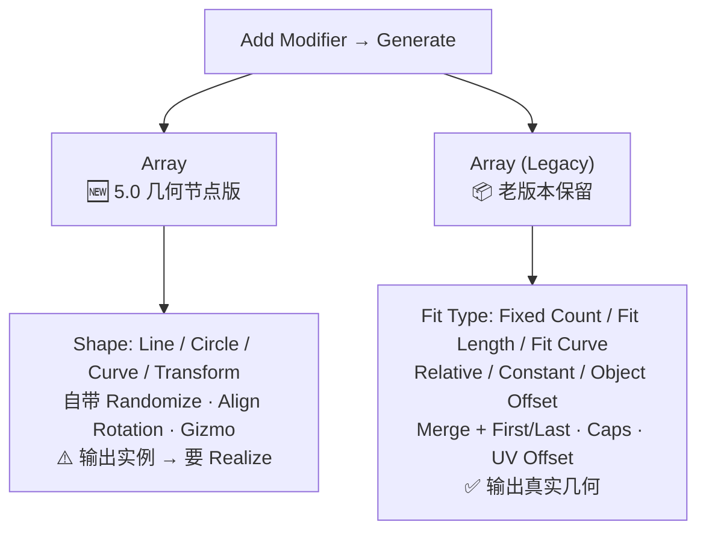
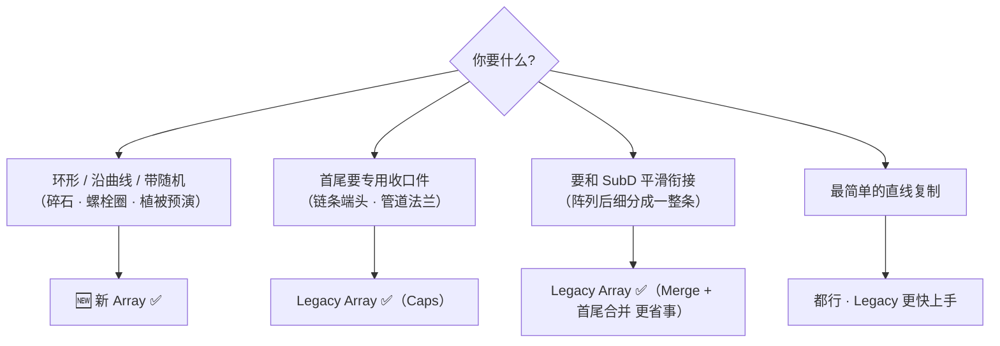
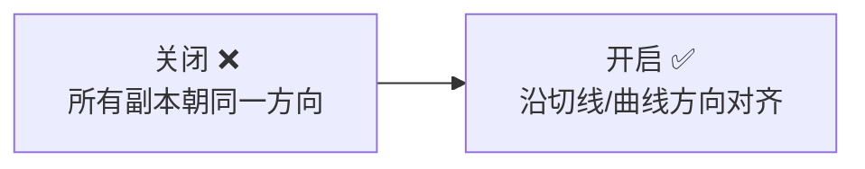
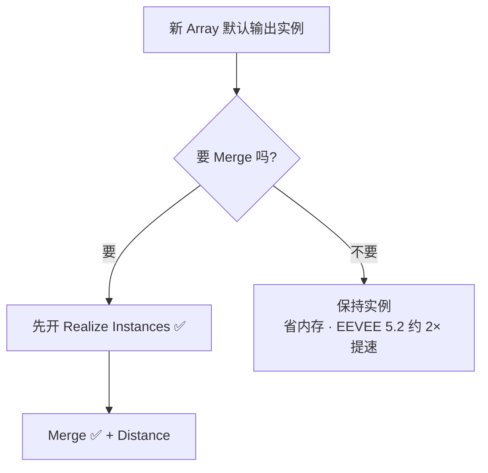
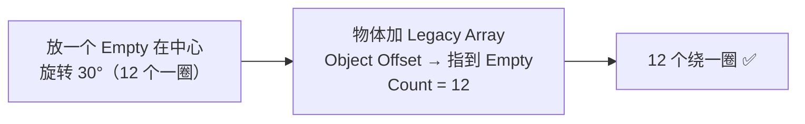
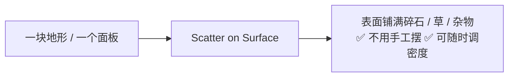
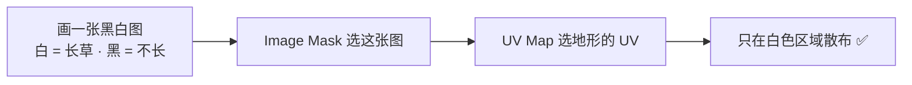
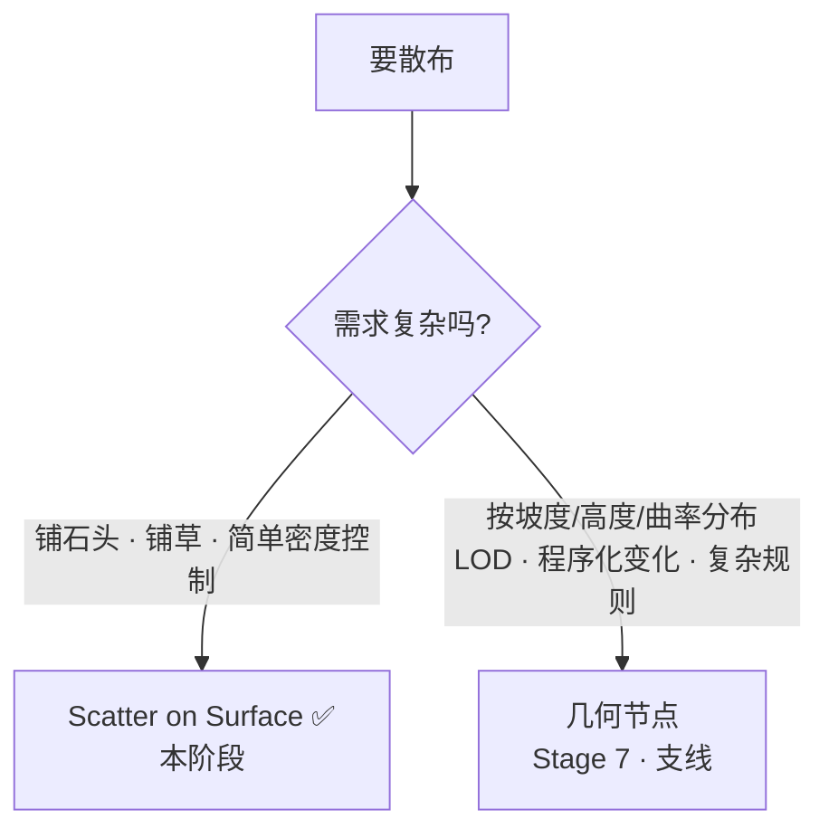

# 03 · Array 与 Scatter on Surface（阵列与散布）

> 一句话：**5.2 里有两个 Array；新的那个输出实例，要 Merge / Boolean 必须开 Realize。**
> 依据：Blender 5.2 LTS 手册 `Array Modifier` / `Array (Legacy) Modifier` / `Scatter on Surface Modifier`；Blender 5.0 release notes · Modeling（commit `8ba63262bf`）

---

## 一、先搞清楚：5.x 有两个 Array

这是本阶段最容易卡住的地方。老教程讲的是 Legacy，新教程讲的是新版，**参数完全不一样**。



| 对比项 | 新 `Array` | `Array (Legacy)` |
| ------ | ---------- | ---------------- |
| 底层 | 几何节点 | 传统 C++ 修改器 |
| 分布形状 | **Line / Circle / Curve / Transform** | 只有线性（环形靠 Object Offset + Empty） |
| 个数控制 | Count Method：Count / Distance | Fit Type：Fixed Count / Fit Length / Fit Curve |
| 随机化 | ✅ 内置 Randomize（位置/旋转/缩放/翻转/Seed） | ❌ 没有 |
| 对齐旋转 | ✅ Align Rotation（沿切线） | ❌ 没有 |
| 首尾封口 | ❌ | ✅ **Caps（Cap Start / Cap End）** |
| Merge | ✅ 但**需先 Realize** | ✅ 直接可用，还有 First & Last Copies |
| 输出 | **实例**（默认） | 真实几何 |
| Gizmo | ✅ 视口直接拖 | ❌ |

### 怎么选



> 🎯 实操建议：**散热孔这种「直线 + 数量少」用 Legacy；环形和随机散布用新的。**
> 不知道选哪个时，**先试 Legacy**——它的行为和所有老教程一致，出问题好查。

---

## 二、新 Array 参数全解

### 2.1 Shape（分布形状）

| Shape | 用途 | 配套参数 |
| ----- | ---- | -------- |
| **Line** | 直线阵列（散热孔、栏杆、书架格） | Offset Method：Relative / **Offset** / Endpoint |
| **Circle** | 环形阵列（螺栓圈、齿轮、环形散热片） | Radius / Central Axis / Circle Segment（Full / **Arc**）/ Sweep Angle |
| **Curve** | 沿曲线分布（管道支架、藤蔓） | Curve Object / Per Curve / Align Rotation |
| **Transform** | 用另一个物体的变换当偏移（螺旋、自定义排布） | Transform Reference：Input / Object |

**Offset Method（Line 时）**：

| 方法 | 含义 | 什么时候用 |
| ---- | ---- | ---------- |
| **Relative** | 按**包围盒尺寸**的倍数偏移（1.0 = 刚好贴着排） | 物体尺寸会变，希望间距跟着变 |
| **Offset** | 固定的**世界空间距离**（米） | ⭐ 游戏资产常用：间距要精确 |
| **Endpoint** | 在起点和终点之间**均分** | 已知总长度、要均分（比如 1.0m 内放 8 个孔） |

> 💡 **Endpoint 是做散热孔最舒服的模式**：你只说「从这到那，放 12 个」，不用算间距。

### 2.2 Count Method

| 方法 | 含义 |
| ---- | ---- |
| **Count** | 固定个数（改柜子宽度时个数不变，间距变） |
| **Distance** | 按间距算个数（改柜子宽度时**个数自动增减**）⭐ 非破坏性的精髓 |

> ⭐ **Distance 模式是本阶段「参数联动」验收点的关键**：
> 柜子加宽 → 散热孔自动多两个。用 Count 模式做不到。

### 2.3 Align Rotation（Circle / Curve 时）



| Shape | 开启后 |
| ----- | ------ |
| Circle | 沿圆周切向排列，并按 Central Axis 适配基础朝向 |
| Curve | 对齐曲线切线，自然跟随曲线形状 |

配套：**Local Rotation X/Y/Z** —— 对齐之后再补一个本地旋转，用来修正源物体的朝向（比如你的螺栓默认朝 Y，但你希望它朝 Z）。

### 2.4 Randomize（随机化）

| 参数 | 作用 |
| ---- | ---- |
| **Offset** | 每轴最大随机位移 |
| **Rotation** | 每轴最大随机旋转 |
| **Scale Axes** | `Uniform`（三轴同一缩放）/ `Axes`（各轴独立） |
| **Scale** | 最大随机缩放系数 |
| **Flipping** | 沿轴随机镜像（让 12 个螺栓不那么雷同） |
| **Exclude First / Last** | 排除第一个/最后一个不受随机影响 |
| **Seed** | 随机种子；改种子换一套排布，其它参数不变 ⭐ |

> 💡 **Seed 是你的朋友**：随机效果不满意时**改种子比改参数快**。
> 定下来之后就别再动种子了——动了整个排布都变，UV 和烘焙可能要重做。

### 2.5 Merge 与 Realize Instances



> 手册原文：`Realize Instances — Converts the generated instances into real geometry. This must be enabled for certain operations such as merging or boolean operations.`

---

## 三、Array (Legacy) 要点

| 参数 | 说明 | 备注 |
| ---- | ---- | ---- |
| **Fit Type** | `Fixed Count` / `Fit Length` / `Fit Curve` | Fit Curve = 按曲线长度自动算个数 |
| **Relative Offset** | 按包围盒尺寸的倍数 | X=1.0 → 刚好首尾相接 |
| **Constant Offset** | 固定世界距离（米） | ⭐ 精确间距用这个 |
| **Object Offset** | 用另一个物体的变换当偏移 | **环形阵列的经典土法**：转 30° 的 Empty → 12 个一圈 |
| **Merge** | 相邻副本按距离合并顶点 | 配合 SubD 用 |
| **First and Last Copies** | 首尾也合并（做圆环时**必须开**，否则 SubD 后有一道缝） | 手册里有对比图 |
| **Caps** | Cap Start / Cap End 用专门的收口物体 | 新 Array 没有这个 |
| **UVs → Offset U/V** | 每个副本的 UV 偏移 | 让重复贴图不那么规律 |

### 经典土法：环形阵列（Legacy）



> 💡 手册提示：`Fit Curve` 和 `Fit Length` 都用**物体的本地坐标尺寸**，所以在物体模式下缩放物体**不会**改变副本数量。想改就得 `Ctrl+A → Scale`。

---

## 四、Scatter on Surface（表面散布）

### 4.1 它解决什么问题



5.0 新增，基于几何节点。**取代了一部分「必须学几何节点才能散布」的需求**——入门阶段用它就够。

### 4.2 核心参数

| 分组 | 参数 | 说明 |
| ---- | ---- | ---- |
| **Selection** | Selection | 只在选中的面上散布（未选区域不长东西） |
| **数量** | Density Method | `Density`（每单位面积的点数）/ `Amount`（总点数） |
|  | Distribution Method | `Random`（纯随机）/ **Poisson Disk**（泊松盘，均匀且互不重叠）⭐ |
|  | Density / Amount | 对应上面的数值 |
|  | **Minimum Distance** | Poisson Disk 时的最小间距（越大越均匀但越少） |
| **遮罩** | Distribution Mask | 用属性/顶点组限制分布区域（值越接近 1 越容易长） |
|  | Image Mask + UV Map | ⭐ 用**贴图**控制分布（配合 UV） |
| **其它** | **Keep Surface** | 保留原表面几何（默认应该开，否则只剩实例） |
|  | Scatter on Instances | 在已有实例上继续散布（可链式叠加多种散布） |
|  | Seed | 随机种子 |

### 4.3 Instancing（实例来源）

| 参数 | 说明 |
| ---- | ---- |
| **Input Type** | `Data-Block`（用物体或集合）/ `Geometry`（用上游几何） |
| **Instance Type** | `Object`（单个物体）/ `Collection`（整个集合）⭐ |
| Object / Collection | 具体指哪个 |
| **Pick Instance** | 用集合时，每个点随机/受控地挑集合里的某一个 ⭐ |
| **Realize Instances** | 转成真实几何 |
| Viewport Visibility | 视口里只显示百分之多少（**大场景救星**） |

### 4.4 Transform（实例变换）

| 参数 | 说明 |
| ---- | ---- |
| **Surface Offset** | 沿法线方向抬起实例（避免半埋进地里） |
| **Align Rotation** | 让实例对齐表面朝向（法线）⭐ 石头贴坡必备 |
| **Alignment Axis** | 对齐用的轴 |
| **Scale** | 统一/分轴缩放 |
| Randomize（面板头部开关） | Offset / Rotation / Scale / Flipping / Seed —— 和新 Array 的 Randomize 一样 |

### 4.5 典型配方：地面撒碎石

```text
1. 准备一个集合 Coll_Rocks，里面放 3 块不同的石头
   ⚠️ 每块石头都要 Ctrl+A → Scale（不然散布后大小乱）
2. 地面物体加 Scatter on Surface
   Density Method:   Density
   Distribution:     Poisson Disk   ← 比 Random 自然得多
   Density:          按尺度给（见下方坑）
   Minimum Distance: 0.3
   Keep Surface:     ✅
3. Instancing
   Input Type:   Data-Block
   Instance Type: Collection → Coll_Rocks
   Pick Instance: ✅          ← 每点随机挑 3 块中的一块
4. Transform
   Align Rotation: ✅
   Surface Offset:  0.02      ← 稍微抬起，别埋进去
5. Randomize（面板头部打开）
   Rotation Z: 360°           ← 每块随机转
   Scale: 0.3                 ← ±30% 大小变化
6. Seed: 调到你满意就锁死
```

### 4.6 用 Image Mask 控制分布区域



> 这是不用顶点绘制就能控制分布的最快办法。**入门阶段够用了**，比权重绘制直观。

---

## 五、与几何节点散布的关系



| 维度 | Scatter on Surface | 几何节点散布 |
| ---- | ------------------ | ------------ |
| 上手 | 5 分钟 | 1–2 小时 |
| 灵活性 | 固定参数 | 任意编程 |
| 按坡度/高度筛选 | 只能靠 Mask 图或属性 | ✅ 原生支持 |
| 可复用 | 修改器不跨物体复用 | 节点组可复用 |

> 🎯 **本阶段只学 Scatter on Surface。几何节点留到 Stage 7**——现在学它会打乱主线，且容易上瘾（路线图第 7 节的「教程仓鼠症」）。

---

## 六、坑

- ❌ **用了新 Array 但没开 Realize 就接 Boolean / Merge** → 没反应或结果诡异
- ❌ **找错 Array** → 老教程讲的 `Fit Type`、`Caps` 只在 Legacy 里，新版找不到
- ❌ **环形阵列没开 Align Rotation** → 12 个螺栓全朝同一边，像贴上去的
- ❌ **Scatter 的源物体没 Apply Scale** → 散布出来的石头大小乱七八糟
- ❌ **Scatter 用 Density 但物体只有 10cm** → Density 是**每单位面积**，尺度小的时候数值要调到几百才看得出东西。小物件建议改用 **Amount**
- ❌ **忘了 Keep Surface** → 地面消失了，只剩一堆石头飘着
- ❌ **不停改 Seed** → 每次排布都变，UV 和烘焙白做。**定下就锁死**
- ❌ **Legacy Array 做圆环不开 First and Last Copies** → SubD 后首尾接缝处有一道明显的断口
- ❌ **改了物体尺寸但没 Apply Scale** → `Fit Length` / `Fit Curve` 用的是本地尺寸，副本数量**不会**跟着变
- ❌ **用 Count 模式做散热孔，还指望改宽度时孔数自动变** → 用 **Distance** 模式才行
- ❌ **散布了几千个实例然后抱怨视口卡** → 调低 `Viewport Visibility`

---

## 七、自检

| # | 自检点 | 通过标准 |
| - | ------ | -------- |
| ① | 两个 Array | 说出新 Array 与 Legacy 的 3 点区别（Shape / Randomize / Caps） |
| ② | Realize | 说出必须开 Realize 的 3 种情况（Merge / Boolean / 导出单网格） |
| ③ | 环形阵列 | 30 秒内配出「12 个螺栓绕一圈，间距 0.05m」 |
| ④ | 参数联动 | 说出散热孔该用 Count 还是 Distance 才能实现「改宽度孔数自动变」 |
| ⑤ | Scatter | 说出 Poisson Disk 与 Random 的区别，以及 Keep Surface 忘了会怎样 |
| ⑥ | 遮罩 | 说出两种控制分布区域的方法（Distribution Mask 属性 / Image Mask 贴图） |

---

## 八、速查

```text
【5.2 有两个 Array】
🆕 Array          Shape: Line/Circle/Curve/Transform · Randomize · Align Rotation · 输出实例
📦 Array (Legacy) Fit Type · Relative/Constant/Object Offset · Merge+First&Last · Caps · UV Offset
选哪个：环形/随机 → 新 ｜ 收口件/平滑衔接 → Legacy ｜ 简单直线 → 都行（Legacy 更快）

【新 Array 关键参数】
Shape:            Line / Circle / Curve / Transform
Offset Method:    Relative（按包围盒）/ Offset（米）/ Endpoint（两端均分）⭐
Count Method:     Count（固定个数）/ Distance（按间距 → 宽度变了个数自动变）⭐
Circle:           Count · Radius · Central Axis · Full/Arc · Sweep Angle
Align Rotation:   ✅ 环形与曲线必开（否则全朝一边）
Randomize:        Offset · Rotation · Scale · Flipping · Exclude First/Last · Seed
Realize Instances: 要 Merge / Boolean / 导出单网格时必须开 ✅

【Legacy Array 要点】
Fit Type:      Fixed Count / Fit Length / Fit Curve（用本地尺寸 → 先 Ctrl+A Scale）
Object Offset: 指一个转了角度的 Empty = 环形土法
First & Last Copies: 做圆环必开，否则 SubD 后有一道缝
Caps:          Cap Start / Cap End（新 Array 没有）

【Scatter on Surface】
数量:   Density（每单位面积）/ Amount（总数） — 小物件用 Amount
分布:   Random / Poisson Disk（⭐ 更自然，配 Minimum Distance）
遮罩:   Distribution Mask（属性/顶点组）/ Image Mask + UV Map
必开:   Keep Surface ✅ ｜ Align Rotation ✅ ｜ Surface Offset 微微抬起
来源:   Instance Type = Collection + Pick Instance ✅（随机挑集合里的物件）
性能:   Viewport Visibility 调低 ｜ Seed 定下就锁死

【铁律】
散布前：源物体必须 Ctrl+A → Scale
```

---

> **下一步**：[`04-数据块复用-AltD-实例-集合实例.md`](04-数据块复用-AltD-实例-集合实例.md) —— 阵列出来的东西怎么复用，以及「改一个全变」到底是 bug 还是特性。
