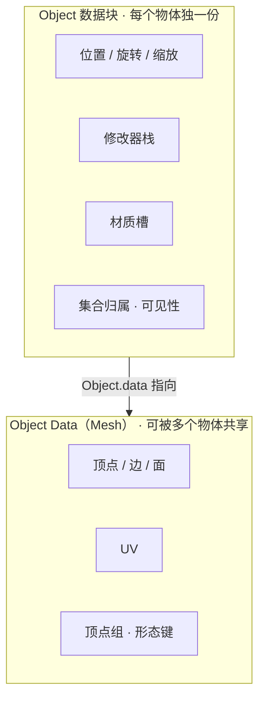
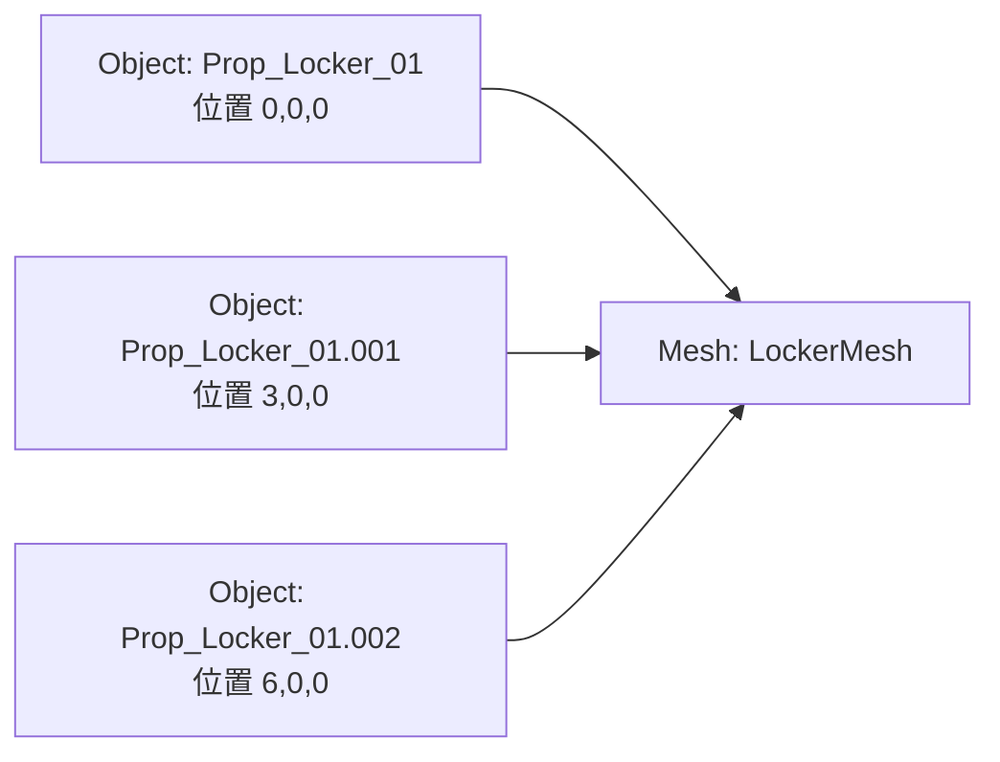
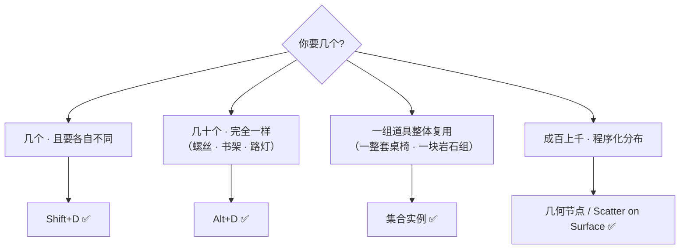
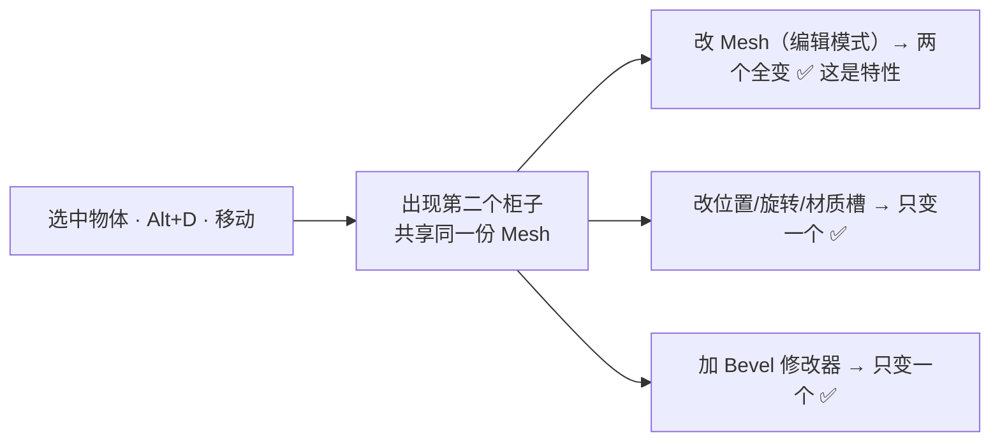
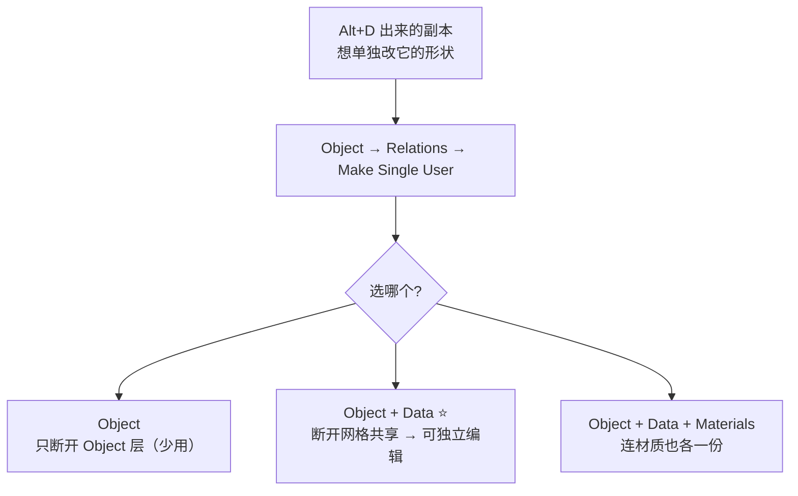
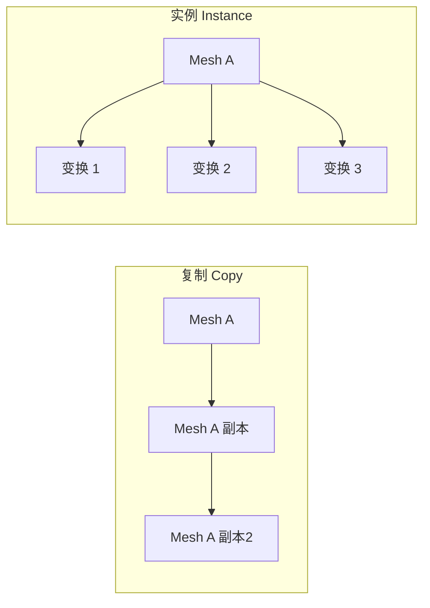
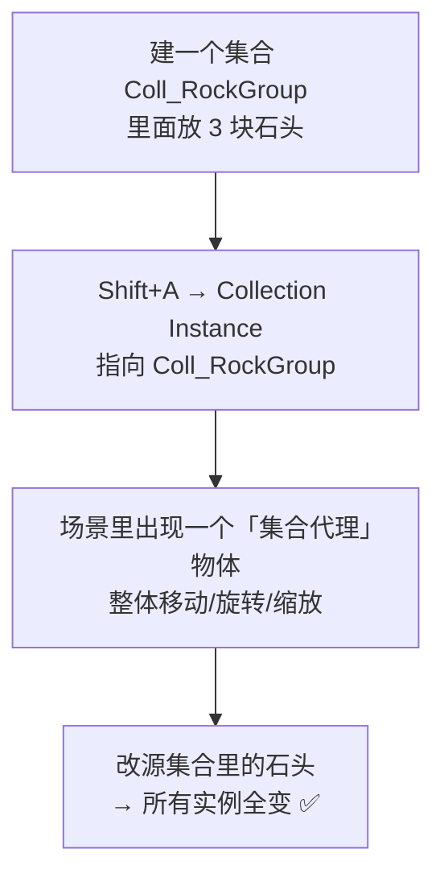
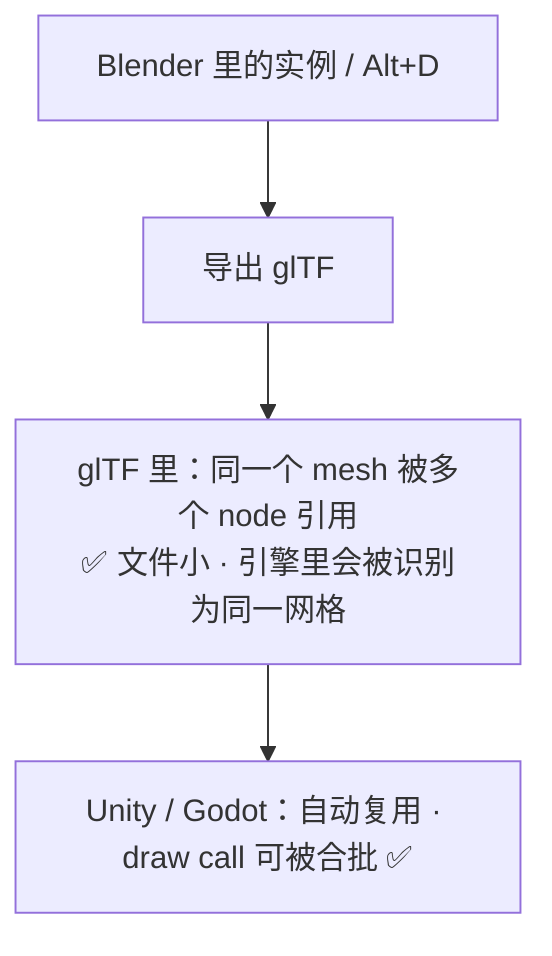

# 04 · 数据块复用：Alt+D / 实例 / 集合实例

> 一句话：**Object 是「谁在哪」，Mesh Data 是「长什么样」——`Alt+D` 只复制前者，共享后者。**
> 前置：[01 篇](01-非破坏性的定义与决策框架.md)（可逆性概念）

---

## 一、先理解 Object 与 Data 是两个东西

这是理解一切复用行为的地基。Blender 里一个「物体」其实是**两个数据块拼起来的**：





**三个物体，一份网格数据。** 改网格 → 三个全变；改位置 → 只变一个。这就是 `Alt+D` 的本质。

### 在 UI 里怎么看

| 位置 | 显示什么 |
| ---- | -------- |
| Outliner → 物体名 | **Object 的名字** |
| `Object Data Properties`（绿色三角形图标） | **Mesh 的名字**，旁边有个数字按钮 = 有多少个物体在用这份数据 |
| Properties → Object Data 面板顶部 | 用户数显示（如 `2`），点一下可以**变成单用户** |

> 💡 **Mesh 名字右边的数字就是「共享计数」**。看到数字 > 1，说明这是 `Alt+D` 出来的。

---

## 二、四种「复制」对照表 ⭐

| 方式 | 快捷键 / 入口 | 共享 Mesh? | 改一个会全变? | 能独立加修改器? | 用途 |
| ---- | ------------- | ---------- | ------------- | ---------------- | ---- |
| **Duplicate** | `Shift+D` | ❌ 各自一份 | ❌ 互不影响 | ✅ | 要做成**不同**资产的两个物体 |
| **Linked Duplicate** | `Alt+D` | ✅ 共享 | ✅ **改网格全变** | ✅（修改器属于 Object） | 同一资产的**多个摆放** |
| **集合实例** | `Shift+A → Collection Instance` | ✅ 共享整个集合 | ✅ 改源集合全变 | ❌（在源集合里改） | 一组道具整体复用、场景散布 |
| **几何节点实例** | 几何节点 `Instance on Points` | ✅ | ✅ | — | 程序化大量散布（Stage 7） |



---

## 三、Alt+D 的实操

### 3.1 基本行为



| 改什么 | 影响范围 | 为什么 |
| ------ | -------- | ------ |
| 编辑模式改顶点 / UV / 顶点组 | **全部** | Mesh 是共享的 |
| 位置 / 旋转 / 缩放 | 单个 | Object 变换是独立的 |
| **修改器栈** | 单个 | 修改器挂在 Object 上 |
| **材质槽里的材质指定** | 单个 | 材质槽属于 Object |
| 材质**本身**的内容（节点/颜色） | **全部** | Material 是另一个共享数据块 |
| 物体名 | 单个 | — |
| **Mesh 名字** | **全部** | 因为是同一个数据块 |

> ⚠️ 最后两条是新手最常踩的：
> **改材质内容会全变**（因为 Material 也共享），**改 Mesh 名字会全变**。

### 3.2 什么时候必须断开：Make Single User



| 选项 | 效果 |
| ---- | ---- |
| `Object` | 只让 Object 数据独立（几乎用不到） |
| **`Object & Data`** | ⭐ 常用：网格独立了，可以单独编辑，但材质仍共享 |
| `Object & Data & Materials` | 连材质也复制一份（要改颜色时用） |

> ⚠️ **不可逆**（[01 篇](01-非破坏性的定义与决策框架.md) 已列）。断开了没有「重新链接」的反向操作，只能删掉重新 `Alt+D`。
> 💡 **改名也算共享**：想给副本的 Mesh 单独改名，`Make Single User` 之后才能改。

### 3.3 反向操作：手动把两个物体的 Mesh 共享起来

```text
1. 选中所有要共享的物体（最后选的那个是"数据源"）
2. Ctrl+L → Link Object Data → Object Data
```

> `Ctrl+L` 是 **Make Links** 菜单，和 `Alt+D` 方向相反：`Alt+D` 是先复制后共享，`Ctrl+L` 是把已有的物体改成共享。

---

## 四、实例（Instance）与集合实例

### 4.1 什么是实例

Blender 里「实例」指的是**不复制几何数据、只记录「在哪个变换下画一次」**的对象。



| 维度 | 复制 | 实例 |
| ---- | ---- | ---- |
| 内存 | N 份几何 | **1 份几何 + N 个变换** |
| 视口开销 | N 份 | 1 份（GPU instancing） |
| 改源 | 互不影响 | **全部跟着变** |
| 独立编辑 | ✅ | ❌ 除非 Realize |

### 4.2 集合实例（Collection Instance）



| 操作 | 怎么做 |
| ---- | ------ |
| 创建 | `Shift+A → Collection Instance`，或在物体属性里设 `Instance Collection` |
| 改内容 | **进源集合改**，不要试图直接编辑实例 |
| 偏移整体 | 集合属性里的 **Instance Offset**（让实例相对源集合有个整体偏移） |
| 转成真实物体 | `Object → Apply → Make Instances Real`（不可逆） |

> ⚠️ 集合实例**不能直接进编辑模式改**。这是它和 `Alt+D` 最大的手感差异。
> 想改 → 去源集合；想让某个实例不一样 → `Make Instances Real` 断开（不可逆）。

### 4.3 5.2 的实际收益：EEVEE 实例场景约 2× 提速

Blender 5.2 的 EEVEE 支持了和 Workbench / Overlay 相同的实例化优化，**CPU 瓶颈的实例密集场景最高约 2× 提速**。官方点名的受益场景：大量重复物体、集合实例、植被、建筑构件、人群。

> 🎯 这不是「锦上添花」——**当你在一个仓库里摆 200 个箱子时，用实例和用复制的帧率可能差一倍**。
> 但注意：**引擎里的实例化是引擎自己的事**（Unity/Godot 有自己的 GPU instancing）。Blender 侧的实例主要收益是**你的工作流**，不是最终游戏性能。

---

## 五、导出时实例会怎样



| 情况 | 结果 |
| ---- | ---- |
| `Alt+D` 的多个物体 | glTF 里**一个 mesh + 多个 node**，引擎里是同一个网格的多个实例 ✅ **好事** |
| 集合实例 | 导出时展开成多个 node（源集合里的每个物体各一个） |
| Scatter / 新 Array 的实例 | 勾 `Apply Modifiers` 后烘成真实几何 → 可能变成**一个巨大的合并网格** ⚠️ |

> ⚠️ 最后一行是个真坑：Scatter 出 500 块石头，导出时勾了 Apply Modifiers → **500 块石头被合并成一个 mesh**。
> 引擎里这就不是一个可合批的实例了，而是一个 500 倍面数的网格。
> **大场景散布的资产不要走「导出单一网格」的路子**——这是 Stage 7 的课题，现在知道就行。

---

## 六、坑

- ❌ **`Alt+D` 之后进编辑模式改了一个，发现全变了** → 这不是 bug。想单独改先 `Make Single User → Object & Data`
- ❌ **改材质颜色发现所有副本都变色** → Material 也是共享数据块。要单独颜色就 `Make Single User → Object & Data & Materials`
- ❌ **给 `Alt+D` 的副本改 Mesh 名字，发现全都改名了** → 同一个数据块。断开后才能改
- ❌ **想改集合实例里的某块石头，进不去编辑模式** → 去源集合改，或 `Make Instances Real`
- ❌ **该用 `Alt+D` 的地方用了 `Shift+D`** → 文件体积翻倍、改一个要改十遍
- ❌ **该用 `Shift+D` 的地方用了 `Alt+D`** → 想做变体结果两个一模一样且联动
- ❌ **`Make Single User` 之后想恢复共享** → 没有反向操作，只能删掉重新 `Alt+D`
- ❌ **Scatter 出几千个实例后导出，发现引擎里是个巨型网格** → 导出时 Apply Modifiers 把实例烘死了
- ❌ **忘了 `Alt+D` 的副本也要各自 `Ctrl+A → Scale`** → 变换是独立的，副本的 Scale 不会自动归 1

---

## 七、自检

| # | 自检点 | 通过标准 |
| - | ------ | -------- |
| ① | 数据块 | 说出 Object 与 Mesh Data 是两个数据块，以及各自存了什么 |
| ② | 四种复制 | 说出 Shift+D / Alt+D / 集合实例 / 几何节点实例 各自的适用场合 |
| ③ | 影响范围 | 说出「改顶点全变 / 改位置只变一个 / 改材质内容全变」并解释原因 |
| ④ | 断开 | 说出 `Make Single User → Object & Data` 的用途与不可逆性 |
| ⑤ | 集合实例 | 说出「不能直接编辑，要去源集合改」 |
| ⑥ | 导出 | 说出 Alt+D 导出到 glTF 后是「一个 mesh + 多个 node」，以及这对引擎是好事 |

---

## 八、速查

```text
【数据块】
Object  = 位置/旋转/缩放 · 修改器栈 · 材质槽 · 集合归属
Mesh    = 顶点/边/面 · UV · 顶点组 · 形态键
Material= 另一个共享数据块（改内容会全变！）
看共享数：Properties → Object Data 面板，名字右边的数字

【四种复制】
Shift+D              各自一份 · 做不同资产
Alt+D                共享 Mesh · 同一资产的多个摆放 ⭐
集合实例             共享整个集合 · 一组道具整体复用
几何节点 / Scatter    程序化大量散布 · Stage 7

【改什么影响什么】
编辑模式改顶点/UV → 全部变
改位置/旋转/缩放   → 单个
改修改器栈         → 单个
改材质槽里的指定   → 单个
改材质内容         → 全部变 ⚠️
改 Mesh 名         → 全部变 ⚠️

【断开共享】
Object → Relations → Make Single User → Object & Data ⭐
                                      └ Object & Data & Materials（要改颜色时）
⚠️ 不可逆！没有反向操作

【反向：把已有的改成共享】
选中（最后选的是数据源）→ Ctrl+L → Link Object Data → Object Data

【集合实例】
创建：Shift+A → Collection Instance
改内容：进源集合改（实例不能直接编辑）
转真实：Object → Apply → Make Instances Real（不可逆）

【导出】
Alt+D → glTF 里一个 mesh + 多个 node → 引擎自动复用 ✅
Scatter 的实例 + Apply Modifiers → 被烘成一个巨型网格 ⚠️

【5.2 收益】
EEVEE 实例密集场景约 2× 提速（重复物体/集合实例/植被/建筑构件/人群）
```

---

> **下一步**：[`05-集合与Outliner-场景组织与命名.md`](05-集合与Outliner-场景组织与命名.md) —— 有了 200 个箱子之后，怎么不让自己找不到东西。
