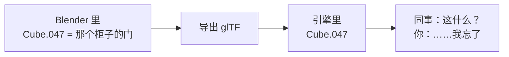
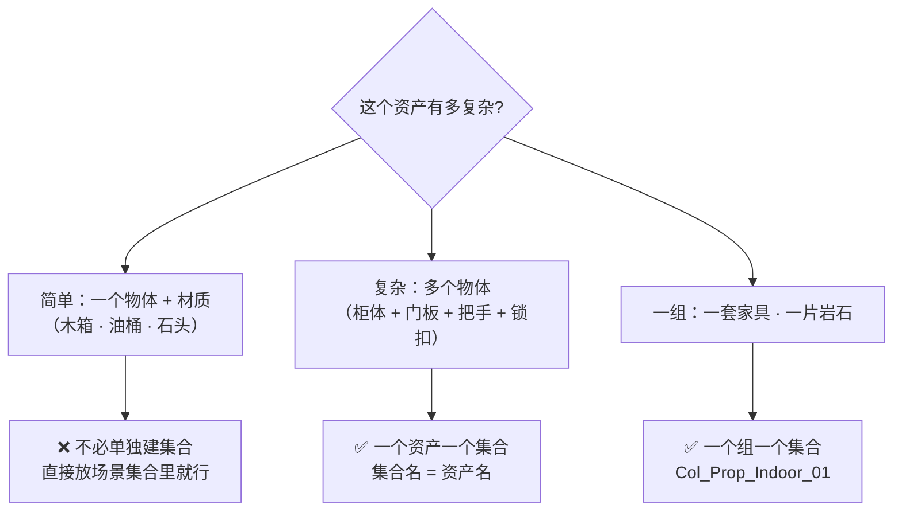
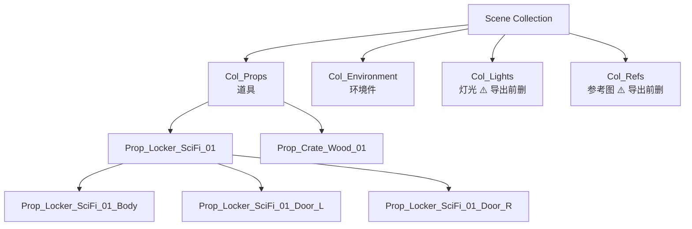
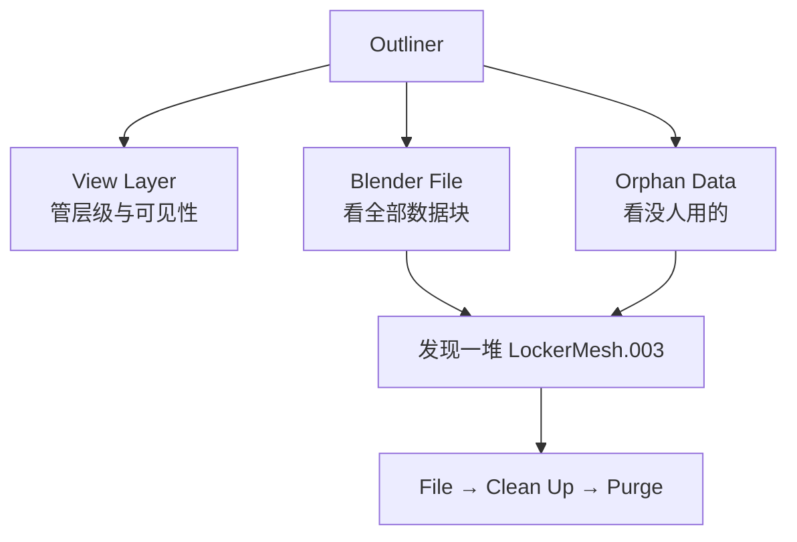
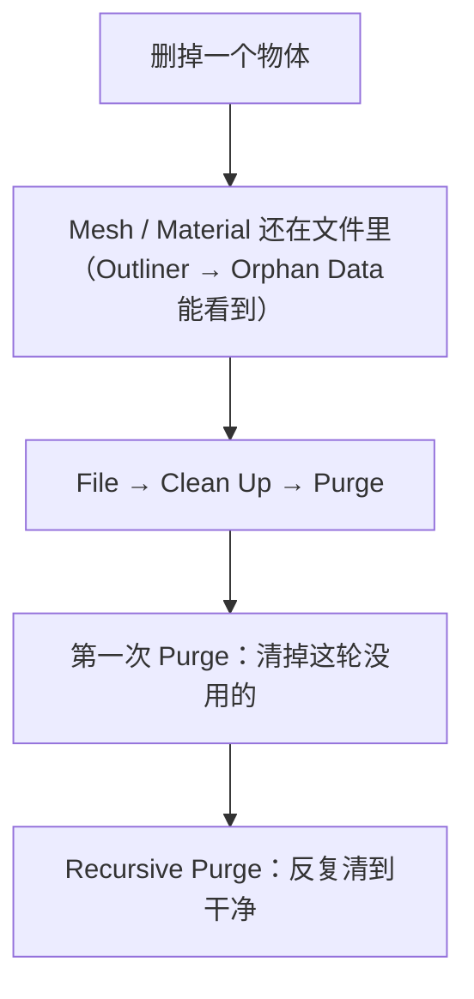

# 05 · 集合与 Outliner：场景组织与命名

> 一句话：**命名和分层不是洁癖，是 Stage 6 导出时唯一能救你的东西——引擎看到的是名字，不是你在 Blender 里记得住哪个是哪个。**

---

## 一、为什么游戏资产特别在乎命名



引擎侧真正「看得见」的只有三样：**物体名、材质名、层级结构**。Blender 里的修改器栈、集合颜色标签、视口显示状态，引擎一个都不知道。

> 🎯 **判据**：导出后打开 glTF 看一眼节点树，**能不能只靠名字看懂这是什么**。能 → 命名合格。

---

## 二、命名规范（直接抄）

| 对象 | 规范 | 例子 |
| ---- | ---- | ---- |
| **Object** | `<类型>_<名称>_<变体>_<序号>` | `Prop_Locker_SciFi_01` |
| **Mesh Data** | 与 Object 同名 | `Prop_Locker_SciFi_01` |
| **Material** | `M_<资产名>_<部位>` | `M_Locker_SciFi_01_Body` |
| **Collection** | 与资产同名 | `Prop_Locker_SciFi_01` |
| **.blend 文件** | 与资产同名 | `Prop_Locker_SciFi_01.blend` |
| **贴图** | `<资产名>_<通道>` | `Locker_SciFi_01_BaseColor` |
| 骨骼 / 动作（支线） | `SK_...` / `AS_...` | `SK_Character_01` |

**类型前缀表**：

| 前缀 | 用途 |
| ---- | ---- |
| `Prop_` | 环境道具（箱、桶、柜、灯） |
| `Char_` | 角色 |
| `Wep_` | 武器 / 手持物 |
| `Veh_` | 载具 |
| `Env_` | 大型环境件（墙、地、建筑模块） |
| `FX_` | 特效相关 |

> 💡 **Blender 5.0 起数据块名字长度上限提到 255 字节**（以前 63），长命名不再被截断。可以放心写完整的规范名。

**绝对禁止**：

- ❌ `Cube`、`Cube.001`、`Plane.047`
- ❌ 中文名（引擎和脚本容易出问题）
- ❌ 空格（用下划线）
- ❌ 大小写混乱（统一 PascalCase 段 + 下划线分隔）

---

## 三、Collection 怎么用

### 3.1 路线图说的「一个资产一个 Collection」——要加个限定



> 📌 **订正路线图**：「一个资产一个 Collection」对**复杂资产**才成立。给每个木箱都建一个集合，Outliner 会比不整理还乱。
> **判据**：**一个资产 ≥ 2 个物体 → 建集合**。

### 3.2 集合的层级怎么分



| 层 | 命名 | 说明 |
| -- | ---- | ---- |
| 顶层分类 | `Col_Props` / `Col_Environment` | 按**用途**分 |
| 资产层 | `Prop_Locker_SciFi_01` | 一个资产一个 |
| 物体层 | `..._Body` / `..._Door_L` | 后缀标部位 |

> ⚠️ **Stage 7 会改这条规则**：大型场景要**按区域分组**（利于视锥剔除），而不是按类型。
> 本阶段先按类型分（场景还小），Stage 7 再改。见 [`../08-场景组装与作品集/笔记.md`](../08-场景组装与作品集/笔记.md)。

### 3.3 常用操作

| 操作 | 怎么做 |
| ---- | ------ |
| 新建集合并移入 | 选中物体 → `M` → New Collection |
| 移入已有集合 | 选中 → `M` → 选目标集合 |
| 从集合移除 | Outliner 右键 → `Unlink`（物体还在场景里） |
| 加入第二个集合 | 选中 → `Ctrl+Shift+G`（或 `M` 时按住 Shift 多选） |
| 重命名 | Outliner 里双击，或 `F2` |
| 重命名连带数据块 | 右键 → `Rename Object & Data` ⭐ |
| 颜色标签 | Outliner 右键 → Set Color Tag |

> 💡 **`Rename Object & Data`** 非常好用：改物体名时把 Mesh 名一起改了，保证规范里的「Object 与 Mesh 同名」。

---

## 四、Outliner 的显示模式

Outliner 右上角的下拉（书本图标）可以切 6 种模式：

| 模式 | 显示什么 | 什么时候用 |
| ---- | -------- | ---------- |
| **View Layer** ⭐ | 场景的集合/物体层级 + 可见性开关 | **日常 90% 时间** |
| **Scenes** | 场景 + 视图层 | 多场景/多视图层时 |
| **Video Sequencer** | 序列器内容 | 做动画剪辑 |
| **Data API** | 所有数据块的完整属性树 | 找某个具体属性（进阶） |
| **Blender File** ⭐ | `.blend` 里的**所有数据块**（含未使用的） | **找僵尸数据** |
| **Orphan Data** ⭐ | 无人使用的数据块 | **清理前看一眼** |



> 💡 **Orphan Data 是本阶段最该养成习惯看的地方**。删掉物体后，它的 Mesh / Material 还留在文件里（带 `.001` 后缀），文件会越来越大。
> 清理：`File → Clean Up → Purge`（或 `Purge → Recursive`）。

---

## 五、集合的可见性开关

Outliner 里集合右边有几个图标，每个管一件事：

| 图标 | 名称 | 作用 |
| ---- | ---- | ---- |
| 👁 眼睛 | **Visibility** | 视口里看不看得见 |
| 🖥 显示器 | **Render Visibility** | 渲染时出不出 |
| ➕ 箭头/光标 | **Selectable** | 能不能被选中（**开着眼睛但关掉这个 = 看得见选不中**，做参考层用） |
| 🎨 色块 | Color Tag | 纯视觉分类 |
| **Holdout** | Holdout | 该集合在渲染中「挖洞」，用于合成 |
| **Indirect Only** | Indirect Only | 只参与间接光（反射/阴影），不直接可见 |

**游戏资产的常见用法**：

| 场景 | 设置 |
| ---- | ---- |
| 参考图 / 对型用的方块 | 眼睛 ✅（看得见）+ **Selectable ❌**（选不中） |
| 占位 blockout | 显示器 ❌（不渲染） |
| 灯光调试用的辅助面 | Indirect Only |

> ⚠️ **参考图一定要关掉 Render Visibility，或者在导出前删掉**。
> 忘了的话，导出的 GLB 里会带几张大图。这是 [`速查/导出检查清单.md`](../速查/导出检查清单.md) 里的常驻条目。

### 视图层的集合排除（进阶）

Outliner → 集合右键 → **Exclude from View Layer**：整个集合从当前视图层消失（相当于临时「卸载」）。

> 大场景调试时用它关掉半个场景，比一个个关眼睛快。入门阶段用不上，Stage 7 会回来。

---

## 六、Local View（隔离显示）


| 平台 | 怎么做 |
| ---- | ------ |
| 有小键盘 | `/`（斜杠） |
| **macOS 没小键盘** | ⚠️ 默认快捷键按不出来 → **开 `Emulate Numpad`**，或 `F3` 搜 **"Local View"**，或走 `View → Local View` 菜单 |

> 💡 建模复杂资产时非常好用：隔离出来专心倒角，不用被旁边的东西挡视线。

---

## 七、清理：Purge 与僵尸数据



| 命令 | 作用 |
| ---- | ---- |
| `File → Clean Up → Purge` | 清掉当前无用户的数据块 |
| `File → Clean Up → Recursive Purge` | 反复清（清掉 A 之后 B 也没人用了，继续清 B） |
| `File → Clean Up → Unused Data-Blocks` | 同上（不同版本叫法） |

> ⚠️ Purge 会删掉**所有**零用户数据块。如果你有「先建好但还没用」的材质，会被清掉。
> 想保留就给它一个假用户（Outliner → Blender File 模式 → 右键数据块 → **Fake User**）。

---

## 八、坑

- ❌ **不改名就导出** → 引擎里一片 `Cube.001`，两周后自己也认不出
- ❌ **Object 改了名，Mesh 还是老名字** → 用 `Rename Object & Data`
- ❌ **给每个小道具都建集合** → Outliner 比不整理还乱。**≥2 个物体才建**
- ❌ **删了物体但不 Purge** → 文件里堆一堆孤儿数据，体积越滚越大
- ❌ **参考图忘了关渲染/忘了删** → 导出 GLB 里带几张 MB 级的图
- ❌ **Purge 掉还没用的材质** → 给它 Fake User
- ❌ **中文命名** → 引擎导入、脚本批处理容易炸
- ❌ **集合名和资产名不一致** → 后面做资产库时会分不清哪个集合属于哪个资产
- ❌ **macOS 上按 `/` 进不了 Local View** → 开 Emulate Numpad，或 `F3` 搜 "Local View"

---

## 九、自检

| # | 自检点 | 通过标准 |
| - | ------ | -------- |
| ① | 命名 | 给一个「科幻储物柜 + 2 扇门」报出 5 个名字（Object / Mesh / Material / Collection / 文件） |
| ② | 集合判据 | 说出「≥2 个物体才建集合」的理由 |
| ③ | 层级 | 画出 Scene → Col_Props → Prop_xxx → 各部位 的三层结构 |
| ④ | Outliner | 说出 View Layer / Blender File / Orphan Data 三种模式各自的用途 |
| ⑤ | 可见性 | 说出参考图该怎么设（可见 ✅ + 可选 ❌ + 渲染 ❌，导出前删） |
| ⑥ | 清理 | 说出 Purge 的位置，以及「想保留未使用材质要加 Fake User」 |

---

## 十、速查

```text
【命名规范】
Object:     Prop_Locker_SciFi_01
Mesh:       同 Object 名
Material:   M_Locker_SciFi_01_Body
Collection: 同资产名
文件:       同资产名 .blend
贴图:       Locker_SciFi_01_BaseColor
前缀: Prop_ 道具 / Char_ 角色 / Wep_ 武器 / Veh_ 载具 / Env_ 环境 / FX_ 特效
5.0 起名字上限 255 字节（以前 63），长命名不会被截断
禁止：Cube.001 · 中文 · 空格

【集合判据】
≥2 个物体的资产 → 建集合 ｜ 单个物体 → 不用建
层级：Scene → Col_Props → Prop_xxx → ..._Body / ..._Door_L

【操作】
M            新建/移入集合
Ctrl+Shift+G 加入第二个集合
F2 / 双击    重命名
右键 → Rename Object & Data   ⭐ Object 与 Mesh 一起改

【Outliner 模式】
View Layer    日常 · 层级与可见性 ⭐
Blender File  全部数据块
Orphan Data   无人使用的数据 ⭐ 清理前看

【可见性开关】
眼睛      视口可见
显示器    渲染可见（参考图关掉！）
Selectable 可选中（参考图关掉 = 看得见选不中）
Holdout / Indirect Only  合成与间接光

【清理】
File → Clean Up → Purge / Recursive Purge
想保留未使用的数据 → Fake User
```

---

> **下一步**：[`06-原点与变换-Set-Origin-Apply.md`](06-原点与变换-Set-Origin-Apply.md) —— 命名之外，引擎最在意的第二件事：原点在哪。
