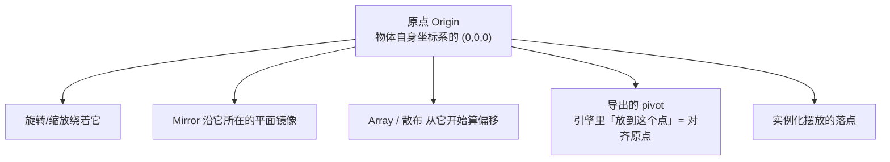
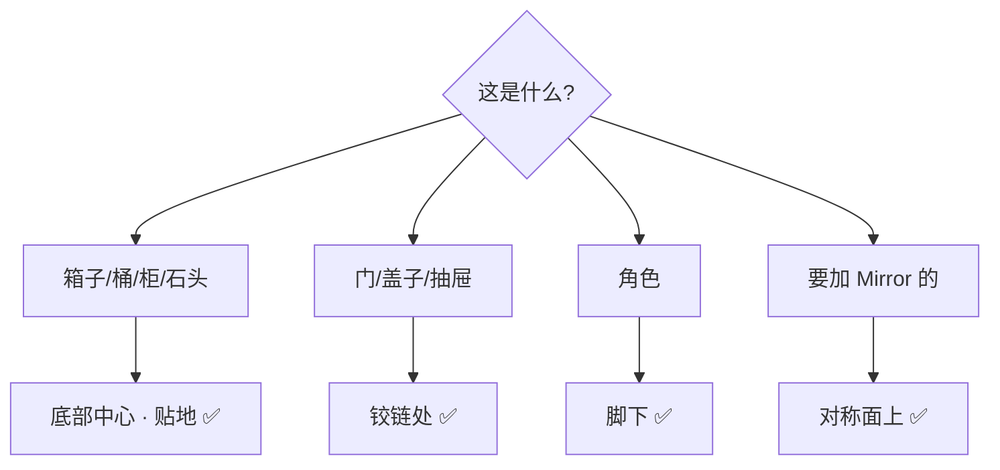
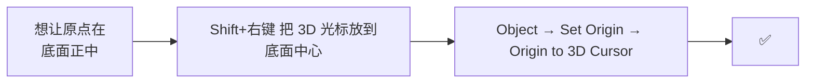
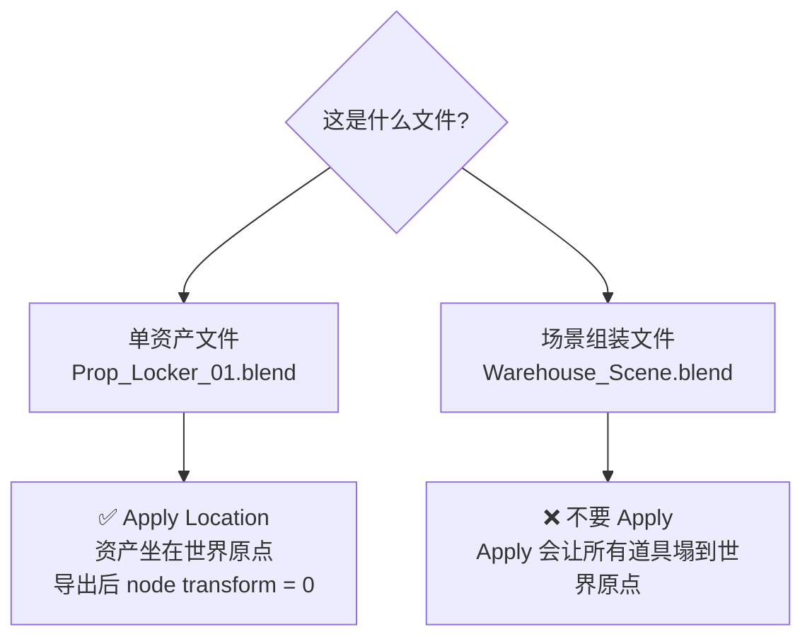
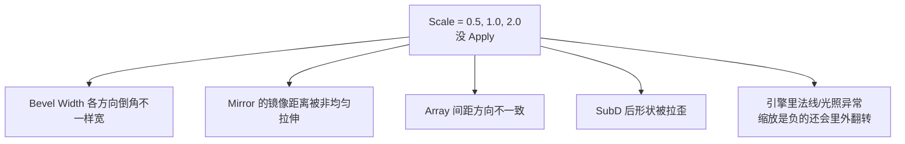
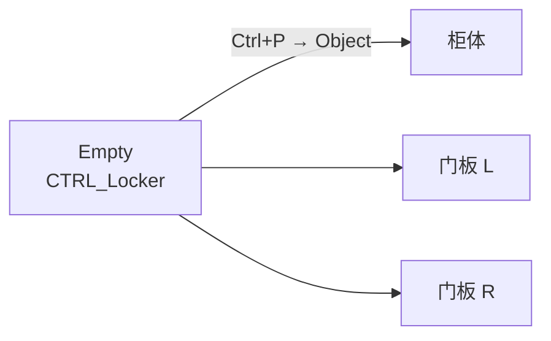

# 06 · 原点与变换：Set Origin / Apply Transform

> 一句话：**原点就是资产在引擎里的「把手」——你把把手装在哪，引擎就绕哪转、从哪摆。**
> 前置：[`../00-基础/03-变换系统-G-R-S.md`](../00-基础/03-变换系统-G-R-S.md)

---

## 一、原点是什么、为什么游戏资产特别在乎



| 场景 | 原点错了会怎样 |
| ---- | -------------- |
| 引擎摆放到地面 | 道具**浮空或陷进地里**（原点在几何中心） |
| 旋转一扇门 | 门绕**自己的中心**转，而不是绕铰链 |
| Mirror | 镜像面不在对称轴上 → **两半撕裂** |
| Array | 阵列从错误的点开始 → 整个阵列跑飞 |
| 缩放 | 从奇怪的点缩放，模型「滑走」 |

> 🎯 **这是本阶段投入产出比最高的一节**：10 分钟学会，能避免后面几十次返工。

---

## 二、原点该放哪（规则表）

| 资产类型 | 原点位置 | 理由 |
| -------- | -------- | ---- |
| **环境道具**（箱、桶、柜、石头） | **底部中心的地面上** | 直接贴地摆放，Y 轴旋转 = 原地打转 |
| **门 / 盖 / 窗 / 抽屉** | **铰链 / 转轴处** | 开门动画绕铰链转 |
| **角色** | **双脚之间的地面** | 贴地 + 骨骼根骨对齐 |
| **手持道具**（枪、刀） | **握把处** | 挂到手部骨骼时自动对齐 |
| **车辆** | **四个轮子接地面中心** | 贴地 + 转向 |
| **对称物体**（要加 Mirror） | **对称面上** | Mirror 的根本前提 |
| 大型环境件（墙、地板模块） | **模块角点** | 网格吸附拼接 |



> ⚠️ **注意冲突**：一个**对称的柜子**，原点既要在底部中心（贴地），又要在对称面上（Mirror）。
> 解法：底部中心 + 对称面 = **底面正中**。两者不冲突——因为对称面通常是竖直的 X=0 平面，它穿过底面正中。**所以对称道具的原点就是「底面正中」**。

---

## 三、Set Origin 怎么用

`Object → Set Origin`（默认快捷键 `Ctrl+Alt+Shift+C`；**macOS 上按不出来就 `F3` 搜 "Set Origin"**）。

| 选项 | 效果 | 什么时候用 |
| ---- | ---- | ---------- |
| **Origin to Geometry** | 原点移到**包围盒中心** | 快速居中（但不贴地） |
| **Origin to Center of Mass (Surface)** | 原点移到**表面**质心 | 有机体 |
| **Origin to Center of Mass (Volume)** | 原点移到**体积**质心 | 实心物体 |
| **Geometry to Origin** | ⚠️ 反方向：**移动几何**，让几何中心到原点 | 想把物体挪到世界原点时 |
| **Origin to 3D Cursor** ⭐ | 原点移到 **3D 光标**位置 | **精确指定原点位置**，本阶段主力 |
| **Origin to Bounding Box Center** | 同包围盒中心 | 同 Origin to Geometry |



### 精确放到「底部中心」的三步法 ⭐

```text
1. 选中物体 → 进编辑模式 → A 全选
2. 把 3D 光标放到包围盒底面中心：
   ・粗放：退出编辑模式，Shift+右键 在底面上点一下（会吸附到面上）
   ・精确：用 Shift+S → Cursor to Selected 得到中心后，再把光标 Z 降到包围盒底部
3. 物体模式 → Object → Set Origin → Origin to 3D Cursor
```

**更省事的精确做法**：

```text
1. 选中物体，进编辑模式，A 全选
2. Shift+S → Cursor to Selected      （光标到几何中心）
3. 切回物体模式，看 N 面板的 Dimensions，取 Z 的一半
4. 把光标的 Z 减掉这个值             （N 面板 → 3D Cursor → Z）
5. Object → Set Origin → Origin to 3D Cursor
```

> 💡 **门板放在铰链**：把 3D 光标放到铰链那条边的中点 → `Origin to 3D Cursor`。
> 用**顶点吸附**（`Shift+右键` 配合吸附开关）能精确落到某个顶点上。

---

## 四、Apply Transform：`Ctrl+A` 各项该不该按

`Object → Apply`（`Ctrl+A`）菜单：

| 项 | 效果 | 该不该 Apply |
| -- | ---- | ------------ |
| **Scale** ⭐ | 把当前缩放写进网格，Scale 归 1,1,1 | ✅ **必须**（导出铁律） |
| **Rotation** ⭐ | 把当前旋转写进网格，Rotation 归零 | ✅ **必须**（导出铁律） |
| **Location** | 把 Location 清零，物体「瞬移」到世界原点 | 🟡 见下 |
| **All Transforms** | 上面三个一起 | 🟡 单资产文件可用 |
| **Visual Transform** | 把带约束/父级的最终视觉变换写进去 | 有父级/约束时用 |
| **Visual Geometry to Mesh** | 把**修改器结果**写进网格 | 等于 Apply 修改器 |

### Location 到底 Apply 不 Apply



> 💡 **关键理解**：`Apply Location` **不会**改变原点相对几何的位置（你的「底面正中」还在底面正中），它只是**把物体整体挪到世界原点**。
> 所以：
> - 单资产文件 → Apply（资产规整地坐在原点，导出后节点变换是单位矩阵）
> - 场景文件 → **不要** Apply（不然 200 个箱子全叠到世界原点去了）

### 顺序：先 Set Origin，再 Apply Scale ⭐


**为什么顺序不能反**：

| 反了会怎样 | 原因 |
| ---------- | ---- |
| 先 Apply Scale 再 Set Origin | Scale 未归 1 时，`Origin to Geometry` 算出来的包围盒中心是**缩放后**的位置。虽然最终位置一样，但如果你用了「Dimensions 的一半」这类手算值，数字是错的 |
| 先 Apply Rotation 再 Set Origin | 旋转写进网格后，你看到的「底面」方向可能已经变了 |

> 🎯 实操口诀：**Set Origin → Apply Scale → Apply Rotation**。三个动作，固定顺序。

---

## 五、为什么 Scale 必须是 1,1,1

这是 [`速查/导出检查清单.md`](../速查/导出检查清单.md) 的第一条，也是最容易被忽略后果的一条：



| 症状 | 根因 |
| ---- | ---- |
| 倒角一边宽一边窄 | 非均匀 Scale + Bevel |
| SubD 后某方向特别圆/特别尖 | 非均匀 Scale + SubD |
| 模型在引擎里里外翻面 | **负 Scale**（镜像后没 Apply） |
| 两个一样的物体倒角不一样大 | Scale 不同但都没 Apply |

> ⚠️ **负 Scale 是最阴险的一种**：Mirror 修改器 Apply 之后，镜像侧的 Scale 可能变成 -1。不 Apply 就导出，引擎里那半边会**里外翻转**。
> 解法：Apply 之后 `A` → `Shift+N` 重算法线（见 02-03 篇 2.3 节）。

---

## 六、变换相关辅助

### 6.1 3D Cursor 与吸附

| 操作 | 快捷键 |
| ---- | ------ |
| 放置 3D 光标 | `Shift+右键` |
| 光标吸附到选中物 | `Shift+S → Cursor to Selected` |
| 选中物吸附到光标 | `Shift+S → Selection to Cursor` |
| 开关吸附 | `Shift+Tab`（磁铁图标） |

### 6.2 Pivot Point 与 Transform Orientation

| 概念 | 位置 | 说明 |
| ---- | ---- | ---- |
| **Pivot Point** | 视口顶部中间 | 变换围绕哪个点（Bounding Box / 3D Cursor / Individual Origins / Active Element…） |
| **Transform Orientation** | 视口顶部中间 | 变换用的坐标系（Global / Local / Normal / View / Gimbal / **Custom**） |

> 💡 **Custom Orientation**：选中一个面/边 → 右上角 `+` 号创建自定义坐标系 → 之后沿它变换。
> 做斜面上的细节（比如斜屋顶上的通风口）时非常有用。本阶段了解即可。

### 6.3 父子级与空物体



| 场景 | 用法 |
| ---- | ---- |
| 一组道具整体移动 | 建一个 Empty 当父级，`Ctrl+P` |
| 环形阵列的旋转中心 | Empty 当 `Object Offset` 的目标（[03 篇](03-Array与Scatter-on-Surface.md)） |
| Mirror 的对称轴不在原点 | Empty 当 `Mirror Object` |

> ⚠️ **导出前检查**：Empty 父级会被导出成 glTF 的空节点。多数引擎能接受（就是多一层 transform），**但最好在导出前把层级理干净**。
> 常用做法：导出时只选要的物体（勾 `Limit to Selected Objects`），Empty 不选就不会带走。

---

## 七、坑

- ❌ **道具原点在几何中心** → 引擎里无法贴地摆放，每次都要手动调 Y
- ❌ **门板原点在中心而不是铰链** → 开门动画绕中心转，看起来像在抽搐
- ❌ **改了 Scale 但不 Apply** → Bevel / Array / Mirror / SubD 全线失真
- ❌ **Mirror Apply 后不 `Shift+N`** → 负 Scale 导致法线翻转，引擎里里外反
- ❌ **先 Apply 再 Set Origin** → 顺序反了，原点算错
- ❌ **在场景文件里 `Ctrl+A → All Transforms`** → 200 个道具全部塌到世界原点
- ❌ **macOS 按不出 `Ctrl+Alt+Shift+C`** → `F3` 搜 "Set Origin"
- ❌ **macOS 按 `/` 进不了 Local View** → `F3` 搜 "Local View" 或开 Emulate Numpad
- ❌ **忘了门板/把手这些分离件也要各自设原点** → 主资产对了，子件全是错的
- ❌ **`Alt+D` 出来的副本以为自动继承了归一化的 Scale** → 变换是 Object 级的，副本要各自 Apply

---

## 八、自检

| # | 自检点 | 通过标准 |
| - | ------ | -------- |
| ① | 规则 | 说出道具 / 门 / 角色 / 对称物体 的原点该放哪 |
| ② | 操作 | 30 秒内把一个箱子的原点放到「底面正中」 |
| ③ | Apply | 说出 Scale / Rotation 必须 Apply，Location 视文件类型而定 |
| ④ | 顺序 | 说出「Set Origin → Apply Scale → Apply Rotation」并解释为什么顺序不能反 |
| ⑤ | 负 Scale | 说出 Mirror Apply 后不 `Shift+N` 会怎样 |
| ⑥ | 场景文件 | 说出为什么场景文件不能 `Ctrl+A → All Transforms` |

---

## 九、速查

```text
【原点规则】
环境道具（箱桶柜石）→ 底部中心 · 贴地
门/盖/抽屉         → 铰链 · 转轴
角色               → 双脚之间的地面
手持道具           → 握把
车辆               → 四轮接地面中心
对称物体           → 对称面（对称道具 = 底面正中）

【Set Origin】Object → Set Origin（Ctrl+Alt+Shift+C；按不出就 F3 搜）
Origin to 3D Cursor ⭐ 精确指定
Origin to Geometry   包围盒中心
Origin to Center of Mass (Surface / Volume)
Geometry to Origin   反方向 · 移动几何到原点

【精确放底部中心】
① 3D 光标放到底面中心（Shift+右键 / Shift+S）
② Object → Set Origin → Origin to 3D Cursor

【Ctrl+A 该不该按】
Scale     ✅ 必须（导出铁律）
Rotation  ✅ 必须（导出铁律）
Location  单资产文件 ✅ ｜ 场景组装文件 ❌（会让所有道具塌到原点）
All Transforms 同上，场景文件慎用
⚠️ Apply Location 不改变「原点相对几何的位置」，只是把物体挪到世界原点

【顺序口诀】
Set Origin → Ctrl+A Scale → Ctrl+A Rotation

【为什么 Scale 必须 1,1,1】
非均匀 Scale → Bevel 一边宽一边窄 · Array 间距不对 · SubD 拉歪
负 Scale（Mirror 未 Apply）→ 引擎里里外翻转 ⚠️
Mirror Apply 后：A → Shift+N 重算法线

【macOS 兜底】
快捷键按不出来 → F3 搜命令名（Set Origin / Local View / ...）
```

---

> **下一步**：[`07-文件与资产库-Append-Link-Asset-Browser.md`](07-文件与资产库-Append-Link-Asset-Browser.md) —— 资产做好了，怎么让它能在下一个项目里直接用。
