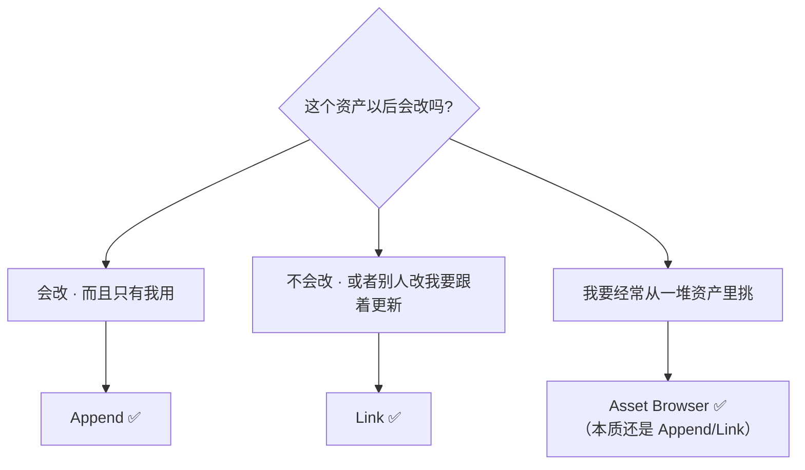
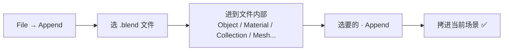
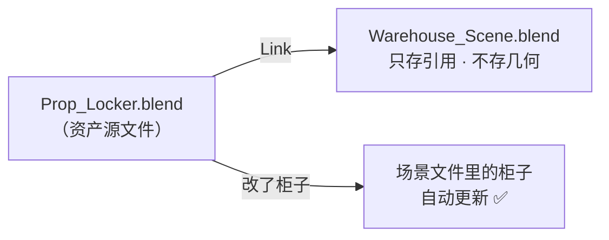
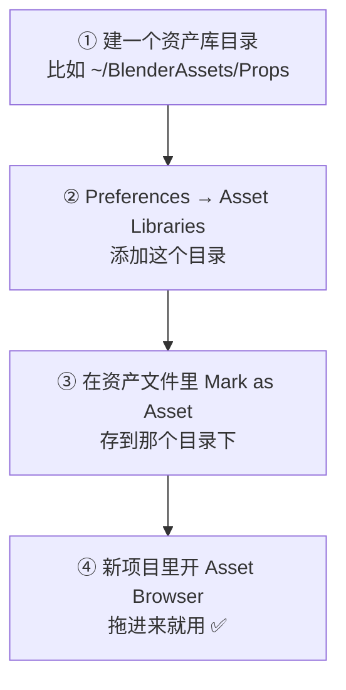
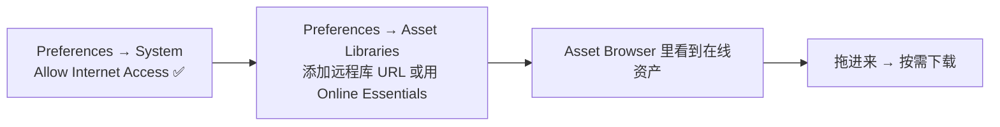
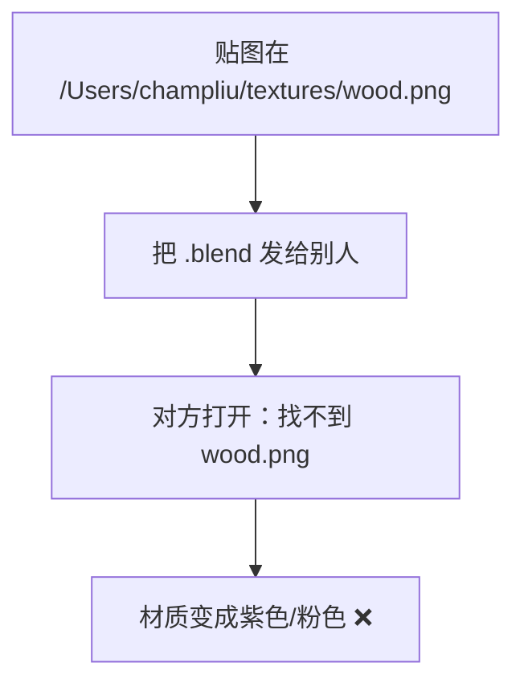
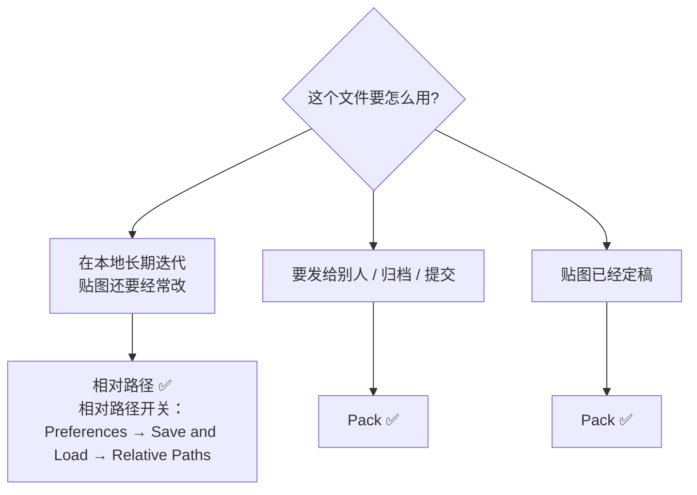
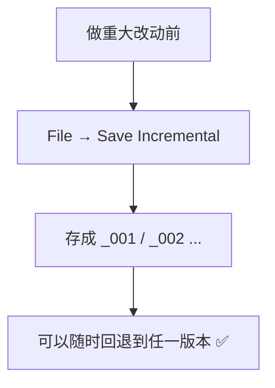

# 07 · 文件与资产库：Append / Link / Asset Browser

> 一句话：**Append 是「拷进来」，Link 是「引用过来」，资产库是「拖过来就能用」——三种复用方式，管的是三种不同的协作关系。**
> 依据：Blender 5.2 LTS 手册 Asset Browser / Asset Libraries；Blender 5.2 release notes · Assets

---

## 一、三种跨文件复用方式

| 方式 | 入口 | 数据在哪 | 改源会跟着变? | 能直接编辑? | 用途 |
| ---- | ---- | -------- | ------------- | ----------- | ---- |
| **Append** | `File → Append` | **拷进当前文件** | ❌ 断开 | ✅ | 从别的文件拿一个资产过来**改** |
| **Link** | `File → Link` | 留在原文件，只存引用 | ✅ | ❌（只读） | 大项目里多人共用一套资产 |
| **Asset Browser** | 编辑器里拖 | 看导入方式（可 Append 可 Link） | 取决于设置 | 取决于设置 | ⭐ **日常复用首选** |



> 🎯 **本阶段只用 Append 和 Asset Browser 就够**。Link 是团队/大项目的事，知道它存在就行。

---

## 二、Append：从别的 .blend 里拿东西



| 要点 | 说明 |
| ---- | ---- |
| 可以 Append 什么 | Object、Collection、Material、Mesh、Node Group、Action…**几乎任何数据块** |
| 之后 | 拷进来的数据是**独立的**，改它不影响原文件 |
| 修改器/约束 | 会一起拷进来（连带依赖） |
| 贴图 | 如果是外部文件，路径要能找到（见第五节） |

> 💡 **最快的复用方式：Append 整个 Collection**。
> 比如 `Prop_Locker_SciFi_01` 这个集合里有柜体 + 2 扇门 + 材质，Append 集合就全来了，层级也保留。

**坑**：Append 进来的东西如果重名，会自动加 `.001`。Append 完**立刻改名**。

---

## 三、Link：引用而不是拷贝（了解即可）



| 操作 | 用途 |
| ---- | ---- |
| `File → Link` | 建立引用 |
| `Object → Relations → Make Local` | 把链接的物体变成本地可编辑（断开链接） |
| **Library Override** | ⭐ 链接后仍想改变换/部分属性 → 用 Library Override，而不是 Make Local |

> 🟡 **单人做游戏资产，基本用不到 Link**。它是影视/团队流程的工具。
> 知道「有这个东西、它解决什么问题」即可，别在这上面花时间。

---

## 四、Asset Browser：日常复用首选 ⭐

### 4.1 三步用起来



| 步骤 | 具体操作 |
| ---- | -------- |
| **① 建目录** | 磁盘上建一个文件夹（不要在 Blender 安装目录里） |
| **② 注册** | `Edit → Preferences → Asset Libraries` → `+` → 选目录 |
| **③ 标记** | 选中物体（或材质/集合）→ 右键 → **Mark as Asset**；或 Asset Browser 里拖进去 |
| **④ 使用** | 任意编辑器左上角切到 **Asset Browser** → 找到资产 → **拖进视口** |

### 4.2 Catalog（目录分类）

资产多了必须分类。两种方式：

| 方式 | 说明 |
| ---- | ---- |
| **Catalog 文件** | 资产库目录下的 `blender_assets.cats.txt`；在 Asset Browser 里右键 → New Catalog |
| **文件夹结构** | 直接按文件夹分（`Props/Indoor/`、`Props/Outdoor/`）——**更简单，推荐入门用** |

> 🎯 入门阶段：**用文件夹分类就够了**。等资产过百再上 Catalog。

### 4.3 5.2 的新变化

| 变化 | 说明 |
| ---- | ---- |
| ⭐ **远程/在线资产库** | 可以注册**远程托管**的资产库，在 Blender 里浏览、**按需下载**。需要 `Preferences → System → Allow Internet Access` 开启 |
| **Online Essentials** | Blender 自带的 Essentials 库扩展了一批在线资产（参数化材质、合成效果、HDR、几何节点预设等），开了联网就能看到 |
| **Asset Libraries 独立设置页** | 5.2 起从原来的 File Paths 挪到了**专门的 Asset Libraries 页面** |
| **All Libraries / Essentials 条目** | 资产库列表里现在有这两个固定条目 |
| **单个资产可指定导入方式** | 每个资产可以设置 `Preferred Import Method`（Append / Link / …），配 `Follow Asset or Preferences` 使用 |



> 💡 **Utility 价值**：对你这种「一个人做游戏资产」的场景，在线资产库的意义是——**不用本地囤一堆 Poly Haven / ambientCG 素材**，联网就能浏览官方精选。
> 但要清楚：**你自己的资产库仍然是本地目录**，那是你真正的复利资产。

### 4.4 该 Mark 什么为资产

| 类型 | 该不该 Mark | 说明 |
| ---- | ----------- | ---- |
| 完成的道具（Object / Collection） | ✅ **主力** | 场景里拖进来就摆 |
| 材质（Material） | ✅ | 一套 PBR 材质复用率极高 |
| 几何节点组（Node Group） | ✅ | Stage 7 之后会大量用到 |
| 灯光 / 世界（HDR 环境） | 🟡 可选 | 出图预设 |
| 半成品 / 练习文件 | ❌ | 会污染资产库 |

> ⚠️ **Mark as Asset 之后的文件要放在资产库目录里**，否则别的项目的 Asset Browser 扫不到。

---

## 五、外部数据：贴图丢了怎么办

这是「换个电脑 / 发给别人 / 提交到 git」时最常见的翻车。



### 5.1 两种策略

| 策略 | 怎么做 | 优劣 |
| ---- | ------ | ---- |
| **相对路径**（推荐） | `File → External Data → Make Paths Relative` | ✅ 整个文件夹拷走就行；❌ 移单个文件会断 |
| **打包进 .blend** | `File → External Data → Pack` | ✅ 单文件自包含；❌ 文件变大，贴图不好单独改 |



### 5.2 常用命令

| 命令 | 作用 |
| ---- | ---- |
| `File → External Data → Make Paths Relative` | 绝对路径改相对 |
| `File → External Data → Make Paths Absolute` | 反过来 |
| `File → External Data → Pack` / `Unpack` | 打包 / 解包贴图 |
| `File → External Data → Find Missing Files` | 批量找回丢失的贴图 |
| `File → External Data → Report Missing Files` | 列出哪些丢了 |
| `File → Clean Up → Purge` | 清无用数据块（[05 篇](05-集合与Outliner-场景组织与命名.md)） |

> 💡 **`//` 前缀就是相对路径**：Blender 里路径显示成 `//textures/wood.png` 说明是相对于 .blend 文件的位置。
> 看到 `/Users/...` 这种完整路径 → 用了绝对路径 → 迟早会丢。

### 5.3 目录约定（配合相对路径）

```text
资产库/
└── Prop_Locker_SciFi_01/
    ├── Prop_Locker_SciFi_01.blend
    └── textures/
        ├── Locker_SciFi_01_BaseColor.png
        ├── Locker_SciFi_01_Normal.png
        └── Locker_SciFi_01_Roughness.png
```

> 🎯 **一个资产一个文件夹，贴图放 `textures/` 子目录**。这样整个文件夹可以随便挪、随便拷。

---

## 六、文件版本与备份

| 机制 | 说明 |
| ---- | ---- |
| `.blend1` | 上次保存的**自动备份**。每次 `Ctrl+S`，前一个版本变成 `.blend1` |
| **Save Incremental** | `File → Save Incremental`（默认 `Ctrl+Alt+S`；**按不出来就 `F3` 搜 "Save Incremental"**）→ 存成 `xxx_001.blend`、`xxx_002.blend`… |
| **Recover Last Session** | `File → Recover → Last Session`（崩溃后救命） |
| 压缩 | `Preferences → Save & Load → Compress File`（勾选后 .blend 体积明显变小，贴图大的文件尤其明显） |



| 场景 | 建议 |
| ---- | ---- |
| 日常 | `Ctrl+S`（`.blend1` 兜底） |
| 要 Apply 修改器 / 要展 UV / 要烘焙**之前** | ⭐ **Save Incremental**（这三类都不可逆） |
| 崩溃 | `File → Recover → Last Session` |

> ⚠️ **`.blend1` 和 `*_001.blend` 会占磁盘**。做完整套路线图后记得清一遍（但要确认 `资产/练习文件/` 里的成品还在）。

---

## 七、本阶段的文件管理规范（汇总）

```text
资产/练习文件/03-非破坏性流程与资产管理/
└── Prop_Locker_SciFi_01/
    ├── Prop_Locker_SciFi_01.blend      ← 源文件 · 保留修改器栈
    ├── Prop_Locker_SciFi_01.blend1     ← 自动备份
    └── textures/                       ← 贴图（相对路径）
```

| 约定 | 值 |
| ---- | -- |
| 位置 | `../资产/练习文件/03-非破坏性流程与资产管理/<资产名>/` |
| 文件名 | 与资产同名 |
| 源文件 | 保留修改器栈，**不 Apply** |
| 贴图 | `textures/` 子目录，相对路径 |
| 导出 | 导出成品放 `../资产/导出成品/`（Stage 6） |

---

## 八、坑

- ❌ **Append 进来不改名** → 一堆 `.001`
- ❌ **用绝对路径存贴图** → 换电脑/发给别人全丢 → Make Paths Relative 或 Pack
- ❌ **Mark as Asset 但文件没放在资产库目录里** → 别的项目的 Asset Browser 扫不到
- ❌ **在 Blender 安装目录里建资产库** → 升级/重装 Blender 会一起没
- ❌ **把半成品 Mark 成资产** → 资产库被垃圾塞满，后来自己都不敢用
- ❌ **Apply / 展 UV / 烘焙之前不 Save Incremental** → 做坏了回不去
- ❌ **以为 `.blend1` 是垃圾文件直接删** → 它是你上一版的后悔药
- ❌ **找 5.2 的资产库设置找不到** → 它搬到**独立的 Asset Libraries 页面**了，不在 File Paths 里
- ❌ **开了在线资产库但没开 Allow Internet Access** → 什么也看不到
- ❌ **压缩包/云盘同步时只发了 .blend 没发 textures 文件夹** → 贴图全丢

---

## 九、自检

| # | 自检点 | 通过标准 |
| - | ------ | -------- |
| ① | 三种复用 | 说出 Append / Link / Asset Browser 的区别（拷进来 / 引用 / 拖拽） |
| ② | 资产库 | 说出建资产库的 4 步（建目录 → 注册 → Mark → 拖入） |
| ③ | 5.2 变化 | 说出远程/在线资产库的两个前提（远程库 URL + Allow Internet Access） |
| ④ | 贴图 | 说出相对路径 vs Pack 各自的适用场景 |
| ⑤ | 找回 | 说出贴图丢了该怎么办（`Find Missing Files` / `Report Missing Files`） |
| ⑥ | 备份 | 说出「Apply / 展 UV / 烘焙之前先 Save Incremental」 |

---

## 十、速查

```text
【三种复用】
Append   File → Append         拷进来 · 独立 · 可编辑 ⭐
Link     File → Link           引用 · 源改了跟着变（团队用）
Asset Browser  拖进来即用 ⭐ 日常首选（本质是 Append/Link）

【建资产库 4 步】
① 磁盘建目录（别放 Blender 安装目录）
② Preferences → Asset Libraries → + → 选目录
③ 选中物体/材质/集合 → 右键 → Mark as Asset
④ 新项目里 Asset Browser → 拖进来

【5.2 新变化】
远程/在线资产库（需 Preferences → System → Allow Internet Access ✅）
Online Essentials 扩展了一批在线资产
Asset Libraries 设置搬到独立页面（不在 File Paths 了）
列表多了 All Libraries / Essentials 两条
单个资产可设 Preferred Import Method

【外部数据】
Make Paths Relative   相对路径（推荐长期迭代）
Pack / Unpack         打包进 .blend（发给别人 / 归档）
Find Missing Files    批量找回
Report Missing Files  列出丢失
⚠️ 路径显示 // 开头 = 相对路径 ✅；显示 /Users/... = 绝对路径 ❌

【版本与备份】
.blend1            上次保存的自动备份
Save Incremental   存成 _001/_002（默认 Ctrl+Alt+S，按不出就 F3 搜）
Recover Last Session  崩溃后恢复
⭐ 铁律：Apply / 展 UV / 烘焙之前 → Save Incremental

【目录约定】
<资产名>/
├── <资产名>.blend    源文件 · 保留栈
└── textures/         贴图 · 相对路径
```

---

> **下一步**：[`08-练习项目-科幻储物柜.md`](08-练习项目-科幻储物柜.md) —— 把 01~07 全部用一遍，这是本阶段唯一的验收项目。
