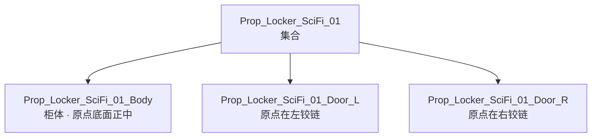
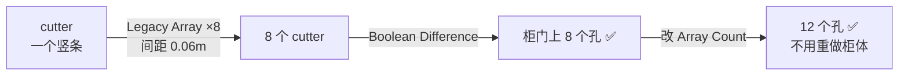
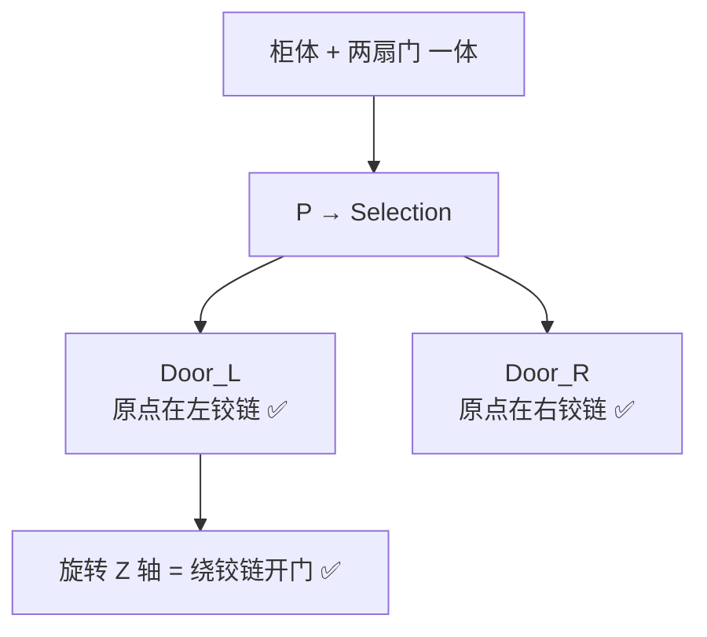
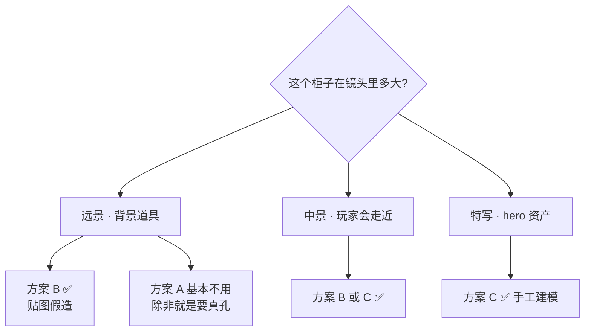

# 08 · 练习项目：科幻储物柜

> 一句话：**这个项目不是「做一个柜子」，是「做一个改需求不返工的柜子」——做完当场演示改宽度和改孔数，才算通过。**
> 前置：[01](01-非破坏性的定义与决策框架.md) ~ [07](07-文件与资产库-Append-Link-Asset-Browser.md) 全看过

---

## 一、项目规格

| 项 | 值 |
| -- | -- |
| **真实尺寸** | 宽 **1.0 m** × 深 **0.5 m** × 高 **2.0 m**（含 0.05 m 底座） |
| **目标面数** | ≤ **2500 tri** |
| **物体数** | 3 个：柜体 + 门板 L + 门板 R |
| **修改器栈** | Mirror → Array(散热孔) → Bevel → SubD → Weighted Normal |
| **原点** | 柜体 / 门板整体 → **底面正中**；门板单独 → **铰链侧边中点** |
| **文件** | `资产/练习文件/03-非破坏性流程与资产管理/Prop_Locker_SciFi_01/Prop_Locker_SciFi_01.blend` |



**设计意图**：为什么是储物柜？因为它同时逼你用上本阶段的**每一样**东西——

| 结构 | 逼你用什么 |
| ---- | ---------- |
| 左右对称 | **Mirror** |
| 一排散热孔 | **Array** + Distance 模式（改宽度孔数自动变） |
| 面板缝隙 | Inset + Extrude（Stage 1 已会，这里要保住可逆） |
| 两扇门板 | **分离件** + 原点在铰链 |
| 摆 3 个在场景里 | **Alt+D** |
| 名字 | **命名规范** |
| 做完能复用 | **Mark as Asset** |

---

## 二、开工前准备（5 分钟）

```text
[ ] 场景单位：Scene Properties → Units → Metric · Meters · Unit Scale 1.0
[ ] 新建目录：资产/练习文件/03-非破坏性流程与资产管理/Prop_Locker_SciFi_01/
[ ] 先存一次盘（Ctrl+S），这样后面的相对路径才有基准
[ ] 参考图：找一张科幻储物柜的正视图 / 三视图，用 Shift+A → Image → Mesh Plane 导入
    设为 In Front + Wire，关掉 Selectable，导出前记得删
```

---

## 三、步骤

### Step 1 · 柜体 Blockout（15 min）

```text
1. Shift+A → Mesh → Cube
2. N 面板 → Dimensions 直接给真实尺寸：X 1.0 · Y 0.5 · Z 2.0
3. 立刻 Ctrl+A → Scale        ⭐ 给完尺寸立刻 Apply，这是肌肉记忆
4. 命名：Object 与 Mesh 都改成 Prop_Locker_SciFi_01_Body
   （Outliner 右键 → Rename Object & Data）
```

### Step 2 · 对称：Mirror（10 min）

柜体本身是左右对称的，但**只做右半边 + Mirror** 才是非破坏性的做法。

```text
1. 确认原点在底面正中（本例：Cube 的包围盒中心 → 先 Set Origin → Origin to 3D Cursor，
   光标放在底面正中）
2. 进编辑模式，删掉 X < 0 的那半边（只留右半）
3. 加 Mirror 修改器：
   Axis: X    Merge: ✅    Clipping: ✅
4. 检查接缝：Merge 开了还裂 → 调大 Merge Distance
```

> ⚠️ **Mirror 的镜像侧法线是反的**。还在改的时候不用管（视口会纠正显示），
> **Apply 之后必须 `A` → `Shift+N`**。详见 [`../02-硬表面建模工作流/03-修改器栈-...md`](../02-硬表面建模工作流/03-修改器栈-Mirror-Solidify-Bevel-SubD.md) 第 2.3 节。

### Step 3 · 面板缝隙：Inset + Extrude（20 min）

```text
1. 选正面 → I（Inset）→ 0.02 m
2. E（Extrude）→ -0.008 m（内凹）
3. 门板轮廓：再 Inset 一次划出门的边界
```

> 💡 **这一步是破坏性的**（编辑模式操作）。这没关系——面板位置不会改，符合 [01 篇](01-非破坏性的定义与决策框架.md) 的「细节直接建模」原则。
> 但要意识到：**一旦做了这步，改柜体宽度就等于要重做**。所以——**先定尺寸，再做细节**。

### Step 4 · 散热孔：Array + Boolean ⭐（30 min）

**cutter 物体**：

```text
1. Shift+A → Cube，命名 Prop_Locker_SciFi_01_Vent_Cutter
2. Dimensions：X 0.03 · Y 0.06 · Z 0.12   （一个竖长条孔）
3. Ctrl+A → Scale
4. 摆到柜门下方第一个孔的位置
5. 关键：让 cutter 在 Y 方向【明显穿透】门板（前后都露出来）
   ⚠️ 不要刚好贴平 —— Float 求解器遇到共面必然出错
```

**阵列**：

```text
6. 给 cutter 加 Array（Legacy）：
   Fit Type: Fixed Count
   Count: 8
   Constant Offset → X: 0.06      （间距 6cm）
   （想让「改宽度孔数自动变」→ 见下方「进阶：Distance 模式」）
```

**挖孔**：

```text
7. 选柜体 → 加 Boolean 修改器：
   Operation: Difference
   Object: Prop_Locker_SciFi_01_Vent_Cutter
   Solver: Float（5.0 前叫 Fast）
8. 孔没出来？→ cutter 没穿透 / 法线反了 / 用了新 Array 没开 Realize
```



**进阶：让孔数跟着宽度自动变**

| Array 版本 | 怎么做 |
| ---------- | ------ |
| **Legacy** | Fit Type → `Fit Length`，Length = 柜门宽度；或 `Fit Curve` |
| **新 Array** | Count Method → **`Distance`**，Distance = 0.06 |

> ⭐ 这是 [笔记.md](笔记.md) 验收自检 ② 的关键。做完当场改柜子宽度试试——**孔数应该自动增减**。

### Step 5 · 倒角与平滑（15 min）

```text
1. Bevel 修改器（排在 Boolean 之后、SubD 之前）：
   Width: 0.004          （4mm，第三人身视角的柜子）
   Segments: 2
   Limit Method: Angle   ← 默认 None 会把平面上布线边也倒，炸线
   Angle: 40°
   Clamp Overlap: ✅
   Harden Normals: ✅
2. Subdivision Surface：Levels 1（⚠️ 别开 2，面数会爆）
3. Weighted Normal：Keep Sharp ✅
4. 面数检查：右上角 Statistics / N 面板看 tri 数
```

| 面数算账 | tri |
| -------- | --- |
| 柜体基础 | ~200 |
| + 布尔开 8 个孔 | ~600 |
| + Bevel 2 段 | ~2400 ⚠️ |
| + SubD L1 | ~9600 ❌ **超了** |

> ⚠️ **Bevel 2 段 + SubD L1 会直接超预算**。二选一：
> - **Bevel 1 段 + SubD L1**（平滑优先）
> - **Bevel 2 段，不用 SubD**（硬表面优先，游戏资产常用）✅ 推荐

### Step 6 · 门板分离 + 原点在铰链 ⭐（20 min）

```text
1. 进编辑模式，选中左门板的所有面
2. P → Selection        （分离成新物体）
3. 命名：Prop_Locker_SciFi_01_Door_L
4. 设原点在铰链：
   ・把 3D 光标放到左门板【靠外侧那条竖边】的中点（用顶点吸附）
   ・Object → Set Origin → Origin to 3D Cursor
5. 右侧：选中剩下的门板面 → P → Selection → 命名 _Door_R → 原点放右铰链
6. 两个门板各自 Ctrl+A → Scale / Rotation
```



> 💡 **验证方法**：选中门板 → `R` → `Z` → 拖一下。**如果绕铰链转，说明原点对了**；如果绕门中心转，原点错了。

### Step 7 · 组织、命名、摆放（20 min）

```text
1. 三个物体 → M → New Collection → 命名 Prop_Locker_SciFi_01
2. 材质：M_Locker_SciFi_01_Body（一个材质就够，别拆太细）
3. 检查命名清单：
   [ ] Object:    Prop_Locker_SciFi_01_Body / _Door_L / _Door_R
   [ ] Mesh:      与 Object 同名
   [ ] Material:  M_Locker_SciFi_01_Body
   [ ] Collection:Prop_Locker_SciFi_01
   [ ] 文件:      Prop_Locker_SciFi_01.blend
4. Alt+D 复制两个柜子摆到旁边（测试共享是否正确）
5. 删掉 cutter 物体（或者留着但关掉渲染可见性 —— 别让它被导出）
```

> ⚠️ **cutter 一定要处理掉**。它是网格物体，忘了删会跟着一起导出，引擎里多一个莫名其妙的长条。

### Step 8 · 参数联动演示 ⭐（10 min · 这是验收动作）

```text
演示 1：把散热孔从 8 个改成 12 个
  → 改 cutter 的 Array Count: 8 → 12
  → ⏱ 应该 < 1 分钟，完全不用进编辑模式

演示 2：把柜子从 1.0m 改成 1.2m
  → 改柜体 Dimensions X
  → 如果用了 Distance / Fit Length 模式，孔数应该自动变成 ~14 个
  → 如果用的是 Fixed Count，孔会变得稀疏 —— 这就是两种模式的差别
```

---

## 四、三种散热孔做法的取舍 ⭐

练习里用方案 A 是为了学 Array。但**真做游戏资产时要知道还有 B 和 C**。

| 方案 | 做法 | 面数 | UV/烘焙 | 适用 |
| ---- | ---- | ---- | ------- | ---- |
| **A · 阵列 + 布尔** | 8 个真孔 | 高（每孔 +数十面） | ⚠️ 脏拓扑，UV 难展 | **练习用** |
| **B · 贴图假造** ⭐ | 网格上只做一个整块凹槽，孔阵画在 **Normal / Alpha** 贴图上 | 极低（凹槽几面） | ✅ 干净 | **游戏资产正解** |
| **C · 手工建模** | Inset + Extrude 手工做 2–3 个槽 | 中 | ✅ 干净 | 孔很少、特写镜头 |



> 🎯 **记住这条**：**布尔开孔在练习里学，在生产里躲**。
> 理由和 Stage 1 一致——布尔后的脏拓扑会让 Stage 3 的 UV 和 Stage 4 的烘焙全崩。

---

## 五、做崩了怎么救

| 症状 | 原因 | 解法 |
| ---- | ---- | ---- |
| 孔没挖出来 | cutter 没穿透 / 刚好共面 | 让 cutter 明显穿透；或换 `Exact` 求解器 |
| 孔是一整条长缝 | Array 的 Constant Offset 是 0 | 检查 Array 的偏移量 |
| 孔变成 8 个叠在一起 | Array 用的 Relative Offset 而不是 Constant | 改 Constant Offset，给米数 |
| 用了新 Array 但布尔没反应 | **没开 Realize Instances** | 开 Realize |
| Mirror 后两半分离 | 原点不在对称面上 | Set Origin 到对称面；别只靠 Clipping |
| Mirror Apply 后一半发黑 | 镜像侧法线反了 | `A` → `Shift+N` |
| 倒角后模型炸线 | Bevel 的 Limit Method 是 None | 改 `Angle` 30–60° |
| SubD 后形状崩了 | 布尔边没倒角就细分 | 先 Bevel，再 SubD；或 Limit Method 用 Weight 排除布尔边 |
| 面数爆到 10000+ | Bevel 段数 + SubD 级别都开高了 | Bevel 1 段 + SubD L1，或 Bevel 2 段不要 SubD |
| 门板绕中心转 | 原点不在铰链 | Set Origin → Origin to 3D Cursor 到铰链边 |
| 导出后多了个长条 | cutter 忘了删 | 删掉，或导出时只选要的物体 |
| 改 Array Count 但孔数不变 | 改错物体了（改到柜体而不是 cutter） | Array 在 **cutter** 上，Boolean 在**柜体**上 |

---

## 六、验收自检（做完逐条打勾）

```text
[ ] 尺寸：报出真实尺寸（1.0 × 0.5 × 2.0 m），场景单位是米
[ ] 对称：Mirror 的 Merge + Clipping 都开了，接缝无裂缝
[ ] 阵列：散热孔由 Array 控制，改 Count 能 < 1 分钟改完
[ ] 参数联动：改柜子宽度，孔数/间距能自动跟上（Distance 或 Fit Length 模式）
[ ] 可逆：关掉 Boolean 能看到没开孔的柜子；关掉 Bevel 能看到没倒角的柜子
[ ] 分离：门板是独立物体，原点在铰链，R+Z 旋转是绕铰链转
[ ] 原点：柜体原点在底面正中
[ ] 命名：Object / Mesh / Material / Collection / 文件 五处全部合规
[ ] 面数：≤ 2500 tri（Statistics 面板核对）
[ ] 拓扑：Quad 为主，无 N-gon（布尔区域允许少量）
[ ] 修改器：源文件里【没有】Apply，栈完整保留
[ ] 复用：Alt+D 摆了 2 个副本；改源柜子材质，3 个一起变
[ ] 清理：cutter 已删或已关渲染；参考图已删；Purge 过一遍
```

**最后一步（提前跑通闭环）**：

```text
[ ] File → Export → glTF 2.0 (.glb)
    Format: glTF Binary
    Limit to: Selected Objects       ← 只选三个柜体物体，cutter 不选
    Apply Modifiers: ✅ ON
    +Y Up: ✅ ON
    UVs: ON ｜ Normals: ON ｜ Tangents: OFF
[ ] 拖进 Godot / Unity 看一眼：比例、原点、法线方向
```

> ⭐ 路线图 Stage 6 的铁律：**在做第 2 个资产之前，先拿第 1 个资产跑通导出→导入→检查的完整链路。**
> 这一步现在做，不要等到 Stage 6。

---

## 七、做完之后

```text
1. 回 [笔记.md](笔记.md) 的「我的记录」写一条练习记录（卡点 + 怎么解决的）
2. 把本阶段踩的通用坑同步到 速查/常见坑汇总.md
3. 把新学的快捷键同步到 速查/快捷键进阶.md
4. Mark as Asset（如果资产库已建好）→ 以后新场景能直接拖
5. 复盘时问自己一句：
   「如果甲方现在说柜子加宽 20cm，我要多久？」
   答案 < 5 分钟 → Stage 2 达标
```

---

> **下一步**：回 [`笔记.md`](笔记.md) 做 5 条自检，通过后进入 Stage 3 UV 与贴图坐标（[`../04-UV与贴图坐标/笔记.md`](../04-UV与贴图坐标/笔记.md)）。
