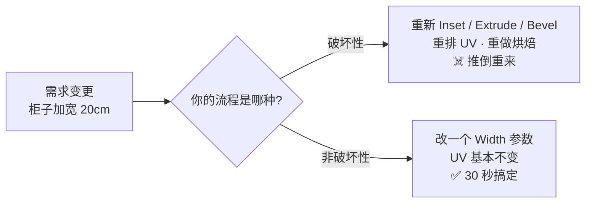
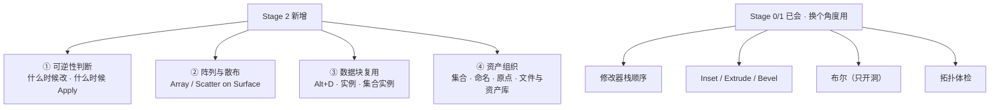
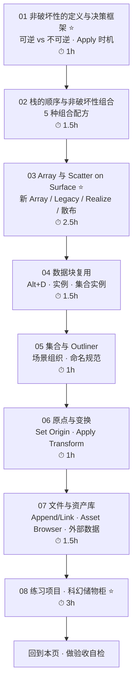
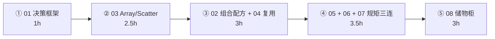

# Stage 2 · 非破坏性流程与资产管理（10–14h）

> **一句话目标**：模型改需求时不推倒重来。
> 状态：⬜ 未开始　|　开工：　　　|　完成：
> 环境：**Blender 5.2 LTS** · macOS　|　前置：`00-基础` 已通、`01-拓扑与建模思维` 已通、`02-硬表面建模工作流` 已通（尤其 [`03-修改器栈`](../02-硬表面建模工作流/03-修改器栈-Mirror-Solidify-Bevel-SubD.md)、[`04-布尔与布尔后清理`](../02-硬表面建模工作流/04-布尔与布尔后清理.md)）

---

## 0. ⚠️ 先订正：路线图 Stage 2 里有三条已经过时或说错了

照着路线图学之前先看这张表。第一条尤其重要——**5.x 里有两个 Array 修改器**，找错那个会直接卡住。

| # | 路线图的说法 | **5.2 的实际情况** | 依据 |
| - | ------------ | ------------------ | ---- |
| 1 | 「新增 Array 修改器的 **Scatter on Surface**（5.0 新增）」 | **Scatter on Surface 是独立的新修改器，不是 Array 的一个功能**。5.0 新增了 6 个基于几何节点的修改器：**Array**（重写版）/ Scatter on Surface / Instance on Elements / Randomize Instances / Curve to Tube / Geometry Input。旧版 Array 保留为 **Array (Legacy)**，所以 5.2 里 `Add Modifier` 菜单能搜到两个 Array | Blender 5.0 release notes · Modeling（commit `8ba63262bf`）／手册 `Array Modifier` 与 `Array (Legacy) Modifier` 两个独立页面 |
| 2 | 「修改器顺序错：SubD 在 Mirror 之后会在接缝处产生硬边」 | **这条因果说反了**。Mirror 先执行（排在 SubD 之上）本身是**对的**。接缝硬边的第一嫌疑永远是 **Merge / Merge Distance / Clipping / 法线**，顺序是最后一个才怀疑的 | [`../02-硬表面建模工作流/03-修改器栈`](../02-硬表面建模工作流/03-修改器栈-Mirror-Solidify-Bevel-SubD.md) 第 2.4 节 |
| 3 | 「Array + Scatter on Surface 做阵列与散布」（暗示加完就能用） | 新的 **Array 默认输出实例（instance），不是真实几何**。要做 **Merge / Boolean / 导出成单一网格**，必须开 **Realize Instances**。Scatter on Surface 同理 | 手册 Array：`Realize Instances — Converts the generated instances into real geometry. This must be enabled for certain operations such as merging or boolean operations.` |

**顺带一条跨阶段订正**（影响 Stage 1 的笔记，但不影响本阶段开工）：

| # | 旧说法 | 5.0 起 |
| - | ------ | ------ |
| 4 | 布尔 Solver：`Fast` vs `Exact` | **`Fast` 已改名为 `Float`**（更准确地反映它是浮点近似求解）。`Exact` 名字没变。编辑模式布尔、修改器、Python API 三处同步改名 | 5.0 release notes（PR #141686） |

> 📌 第 1、3 条建议同步回 `Blender学习路线图.md`（第 47、181 行）；第 4 条同步回 [`../02-硬表面建模工作流/04-布尔与布尔后清理.md`](../02-硬表面建模工作流/04-布尔与布尔后清理.md)；通用坑同步到 [`速查/常见坑汇总.md`](../速查/常见坑汇总.md)。
>
> 📌 通用兜底：**快捷键按不出来、菜单对不上，一律 `F3` 搜命令名**（你自己的笔记第 38 节已经这么做了）。

---

## 1. 本阶段在解决什么问题

Stage 0 给你「拓扑判断力」，Stage 1 给你「做出一个道具的能力」。但 Stage 1 的做法有个致命弱点：**它是破坏性的**——你在编辑模式里 Inset、Extrude、Bevel，每一步都把结果烙进了顶点里。甲方说「柜子加宽 20 公分」「散热孔从 8 个改 12 个」，你就得重做。

所以本阶段只新增**四样东西**，没有一样是新按钮——它们全是你已经会的东西的「组织方式」：

**一句话概括本阶段的判断力**：**每一次动手之前，先问「这个操作还能 undo 吗」；能参数化的就别烤死。**

---

## 2. 学习路径（按顺序走完就是闭环）

| # | 文件 | 核心问题 | 预估 |
| - | ---- | -------- | ---- |
| 01 | [`01-非破坏性的定义与决策框架.md`](01-非破坏性的定义与决策框架.md) | 什么能撤销、什么不能、什么时候必须 Apply | 1h |
| 02 | [`02-修改器栈的顺序与非破坏性组合.md`](02-修改器栈的顺序与非破坏性组合.md) | 一串修改器怎么组合成一套「配方」 | 1.5h |
| 03 | [`03-Array与Scatter-on-Surface.md`](03-Array与Scatter-on-Surface.md) | 两个 Array 有什么区别、散布怎么用 | 2.5h |
| 04 | [`04-数据块复用-AltD-实例-集合实例.md`](04-数据块复用-AltD-实例-集合实例.md) | Alt+D 和 Ctrl+C 的差别、实例为什么省 | 1.5h |
| 05 | [`05-集合与Outliner-场景组织与命名.md`](05-集合与Outliner-场景组织与命名.md) | 场景怎么分层、东西叫什么名字 | 1h |
| 06 | [`06-原点与变换-Set-Origin-Apply.md`](06-原点与变换-Set-Origin-Apply.md) | 原点放哪、什么时候 Ctrl+A | 1h |
| 07 | [`07-文件与资产库-Append-Link-Asset-Browser.md`](07-文件与资产库-Append-Link-Asset-Browser.md) | 资产怎么跨文件复用、贴图丢了怎么办 | 1.5h |
| 08 | [`08-练习项目-科幻储物柜.md`](08-练习项目-科幻储物柜.md) | 把上面 7 篇用一遍 | 3h |

> 合计约 **13h**，落在路线图 10–14h 区间内。
>
> **01 不要跳过**：它是本阶段唯一的「思维」内容，后面 7 篇都是它的具体化。跳过它你会变成「知道 Array 怎么用，但不知道该不该用」。
> **03 和 08 不要压缩**：前者是本阶段唯一的新工具，后者是唯一能证明你学会了的东西。
> 05、06 可以合并成一晚做完（它们都是「规矩」，不是技术）。

---

## 3. 必学清单

> 判断标准不是「我看过了」，而是「不看教程能当场做出来 / 说出来」。每条后面标了出处。

### 模块 1 · 非破坏性的定义与决策框架（[01](01-非破坏性的定义与决策框架.md)）

- [ ] 说出「非破坏性」在本阶段语境下的准确定义：**改需求时改参数，而不是改几何**
- [ ] 背出/画出「可逆 vs 不可逆」分界线：修改器 ✅ / 编辑模式操作 ❌ / Apply ❌
- [ ] 用决策树判断 Apply 时机：什么时候必须 Apply、什么时候绝对不能 Apply
- [ ] 说出 3 个「看起来可逆其实不可逆」的操作（Apply、Boolean 的 Auto、Ctrl+A）
- [ ] 说出「源文件保留栈 + 导出时勾 Apply Modifiers」的配套做法

### 模块 2 · 栈的顺序与非破坏性组合（[02](02-修改器栈的顺序与非破坏性组合.md)）

- [ ] 复述推荐顺序 `Mirror → Boolean → Solidify → Bevel → SubD → Weighted Normal`（详见 02-03 篇）
- [ ] 掌握 5 个组合配方：对称道具 / 面板开孔 / 板壳 / 环形阵列 / 曲线排布
- [ ] 知道 Array / Scatter 输出的**实例**会让后续修改器行为变化，以及 Realize 的时机
- [ ] 会用 `Copy to Selected` 给一批道具统一下发修改器参数

### 模块 3 · Array 与 Scatter on Surface（[03](03-Array与Scatter-on-Surface.md)）⭐

- [ ] 说清 5.2 里 **新 Array** 与 **Array (Legacy)** 的区别，并说出各自的适用场景
- [ ] 新 Array：Shape（Line / Circle / Curve / Transform）+ Offset Method + Count Method
- [ ] 新 Array 的 **Randomize**（Offset / Rotation / Scale / Flipping / Seed / Exclude First-Last）
- [ ] Legacy Array 的 **Fit Type**（Fixed Count / Fit Length / Fit Curve）+ Constant/Relative/Object Offset + **Merge + First&Last** + Caps
- [ ] ⭐ 说出 **Realize Instances** 什么时候必须开（要 Merge / 要 Boolean / 要导出成单网格）
- [ ] Scatter on Surface：Density vs Amount、Random vs **Poisson Disk**、Keep Surface、Align Rotation、Surface Offset
- [ ] Scatter 用 **Collection** 做输入并用 Pick Instance 随机挑，用 **Image Mask** 控制分布区域

### 模块 4 · 数据块复用（[04](04-数据块复用-AltD-实例-集合实例.md)）

- [ ] 说清 Object 与 Object Data（mesh）是**两个不同的数据块**
- [ ] `Shift+D`（复制）vs `Alt+D`（链接复制）的差别：改一个会不会全变
- [ ] 会用 `Object → Relations → Make Single User` 断开共享
- [ ] 说清四种「复制」的适用场合：Shift+D / Alt+D / 集合实例 / 几何节点实例
- [ ] 说清实例省的是**内存与视口开销**，导出时会被展开成真实几何
- [ ] 知道 EEVEE 在 5.2 对实例密集场景有约 **2× 提速**（这是用实例的另一层收益）

### 模块 5 · 集合与 Outliner（[05](05-集合与Outliner-场景组织与命名.md)）

- [ ] 一个资产一个 Collection，Collection 名与资产同名
- [ ] 命名规范：`Prop_<名称>_<变体>_<序号>`，材质 `M_<资产>_<部位>`，文件同名
- [ ] Outliner 的 6 种显示模式，至少会用 View Layer 与 Blender File
- [ ] 集合的 Eye / Screen / Cursor / Holdout / Indirect Only 各自管什么
- [ ] 会用 `M` 把物体移入集合；知道一个物体可以同时属于多个集合
- [ ] 会用 **Orphan Data / Purge** 清理僵尸数据

### 模块 6 · 原点与变换（[06](06-原点与变换-Set-Origin-Apply.md)）

- [ ] 说出游戏资产的原点规则：道具 **底部中心** / 门 **铰链** / 角色 **脚下**
- [ ] 会用 3D Cursor + `Set Origin → Origin to 3D Cursor` 精确放原点
- [ ] 说清 `Ctrl+A` 各项：Scale / Rotation / Location / All Transforms 分别该不该 Apply
- [ ] 知道原点错了会连带搞坏 **Mirror / Array / 实例化 / 旋转 / 引擎摆放**
- [ ] 说出「先 Set Origin，再 Apply Scale」的顺序理由

### 模块 7 · 文件与资产库（[07](07-文件与资产库-Append-Link-Asset-Browser.md)）

- [ ] 说清 **Append**（拷进来）vs **Link**（引用）vs **资产库**（拖拽即用）三种复用方式
- [ ] 会 Mark as Asset + 建 Catalog；知道 5.2 的资产库设置搬到了独立的 **Asset Libraries** 页面
- [ ] 知道 5.2 支持**远程/在线资产库**（需开 `Allow Internet Access`）
- [ ] 会用 `File → External Data`：Make Paths Relative / Pack / Unpack / Find Missing Files
- [ ] 会用 Save Incremental 做版本备份；知道 `.blend1` 是什么
- [ ] 会用 Purge 清理无用数据块

### 模块 8 · 练习（[08](08-练习项目-科幻储物柜.md)）

- [ ] 科幻储物柜：1.0 × 0.5 × 2.0 m，Mirror 对称 + Array 散热孔 + 面板缝 + 可分离门板，≤2500 tri

---

## 4. 时间怎么切（10–14h 拆成 5 段）

| 段 | 内容 | 产出 |
| - | ---- | ---- |
| ① | 读 01，把「可逆 / 不可逆」对照表抄一遍 | 一张自己整理的 Apply 决策树 |
| ② | 读 03，分别用新 Array 的 4 种 Shape 各做一个小练习 | 4 个 .blend（直线 / 圆环 / 曲线 / 变换） |
| ③ | 读 02 + 04，做环形阵列配方 + Alt+D 摆放练习 | 5 个组合配方的参数记录表 |
| ④ | 读 05 + 06 + 07，把前面的练习文件按规范重命名归档 | 一个「已规范化的资产目录」 |
| ⑤ | 做 08 的科幻储物柜 | 1 个 .blend + 面数记录 + 参数改动演示 |

> 本阶段**动手强度比 Stage 1 低，但整理强度高**——你会花不少时间在改名、挪集合、设原点上。别嫌烦：这些规矩在 Stage 6 导出时会一次性回报给你。

---

## 5. 练习项目

| # | 项目 | 要点 | 目标面数 | 完成度 |
| --- | --- | --- | --- | --- |
| 4 | **科幻储物柜**（验收项目） | Mirror 对称 + Array 散热孔 + Inset/Extrude 面板缝 + 独立门板（原点在铰链） | ≤2500 tri | ⬜ |

> 详细尺寸、逐步参数、「做崩了怎么救」见 [`08-练习项目-科幻储物柜.md`](08-练习项目-科幻储物柜.md)。
> 文件存到 `../资产/练习文件/03-非破坏性流程与资产管理/`，命名用 `Prop_<名称>_<变体>_01`（规范见 [05](05-集合与Outliner-场景组织与命名.md)）。

---

## 6. 验收标准（可判定，不是感觉）

路线图给的两条：

- [ ] 关掉某个修改器，能看到「改之前的样子」—— 证明流程是可逆的
- [ ] 改一个参数（比如柜子宽度）能整体跟着变，不用手动重做

### 5 条自检（全部通过才算 Stage 2 完成）

| # | 自检点 | 怎么判定 |
| - | ------ | -------- |
| ① | **可逆性演示** | 当场把储物柜的散热孔从 8 个改成 12 个，**总耗时 < 1 分钟**，且不需要进编辑模式 |
| ② | **参数联动** | 把柜子宽度从 1.0m 改成 1.2m，散热孔、面板缝、门板**全部自动跟上**，没有一处需要手动补 |
| ③ | **两个 Array 说得清** | 说出新 Array 与 Array (Legacy) 的 3 点区别，并说出 Realize Instances 必须开的 3 种情况 |
| ④ | **命名与原点** | 报出储物柜的 Object / Mesh / Material / Collection / 文件名，且原点在**底部中心**、门板原点在**铰链** |
| ⑤ | **复用** | 用 `Alt+D` 摆 3 个柜子，改源柜子的材质后 3 个全变；再 `Make Single User` 让其中一个单独改 |

> ① 和 ② 是本阶段的灵魂。**如果这两条做不到，说明你做的还是 Stage 1 的破坏性流程，只是外面套了个修改器壳子。**

---

## 7. 常见坑

- ❌ **用了新 Array 但没开 Realize Instances** → 想 Merge / 想 Boolean / 导出后实例全不见了
- ❌ **找错 Array** → 5.2 里新 Array 和 Array (Legacy) 参数完全不同，老教程讲的 Fit Type / Caps 只在 Legacy 里有
- ❌ **在源文件里 Apply 了修改器** → 迭代能力全丢。**导出时勾 Apply Modifiers** 才对
- ❌ **Alt+D 之后进编辑模式改了一个** → 所有链接副本全变 → 想单独改先 `Make Single User`
- ❌ **Mirror 原点不在对称轴上** → 模型撕裂。开 Clipping 只能缓解，**原点才是根治**
- ❌ **改了 Scale 不 `Ctrl+A → Scale`** → Bevel 宽度、Array 间距、Mirror 全失真
- ❌ **先 Apply Scale 再 Set Origin** → 顺序反了，原点位置算错。正确顺序：**先 Set Origin → 再 Apply Scale**
- ❌ **道具原点放几何中心** → 进引擎后无法贴地摆放、旋转绕错轴
- ❌ **场景里塞满僵尸数据块** → 文件越来越大、Outliner 一堆 `.001` → 定期 Purge
- ❌ **贴图用绝对路径** → 换个电脑/发给别人全丢 → `File → External Data → Make Paths Relative`，或直接 Pack
- ❌ **Scatter 的源物体没 Apply Scale** → 散布出来的碎石大小乱七八糟
- ❌ **Scatter 用 Density 模式但物体只有 10cm** → 密度数值要调到几百才看得出东西（Density 是**每单位面积**的点数）

---

## 8. 资源

- **主资源 1**：[`../02-硬表面建模工作流/03-修改器栈-...md`](../02-硬表面建模工作流/03-修改器栈-Mirror-Solidify-Bevel-SubD.md) —— 本阶段的顺序知识全在那篇，本篇不重复
- **主资源 2**：官方手册 5.2 LTS —— `Array Modifier` / `Array (Legacy) Modifier` / `Scatter on Surface Modifier` / `Instance on Elements` / `Randomize Instances`（这 5 页本阶段会反复查）
- **主资源 3**：官方手册 `Asset Browser` / `Asset Libraries` / `Linked Libraries`（5.2 新增在线资产库章节）
- Blender 5.0 release notes · Modeling & UV —— 6 个新几何节点修改器的权威清单
- Blender 5.2 release notes · Assets —— 远程资产库、Asset Libraries 设置页迁移
- YouTube · **Blender Secrets**（修改器技巧，1 分钟一条，碎片时间刷）
- YouTube · **Erindale / Harry Blends**（几何节点视角解释新 Array / Scatter，帮你理解「为什么是实例」）

> 本阶段**只允许 1–2 个主资源**（路线图第 7 节防弃坑规则）。建议：自己这 8 篇笔记 + 官方手册按需查。

---

## 我的记录

### ____-__-__ · 第 __ 次练习

- **练了什么**：
- **卡点**：
- **怎么解决的**：
- **下次要注意**：

---

## 阶段复盘

1. 学会了什么（3 条以内，用自己的话）：
2. 踩过的坑（≥3 条；够通用的同步到 `速查/常见坑汇总.md`）：
3. 还差什么（Stage 3 要补的）：
4. 产出物清单（文件路径 + 三角形数 + 截图）：

---

> **下一步**：Stage 3 UV 与贴图坐标（[`../04-UV与贴图坐标/笔记.md`](../04-UV与贴图坐标/笔记.md)）。
> 本阶段留下的最重要一条肌肉记忆是：**动手之前先问「这个还能撤销吗」**——它会一直管到 Stage 4 的烘焙（UV 排好了才改模型，是所有烘焙返工的头号原因）。
