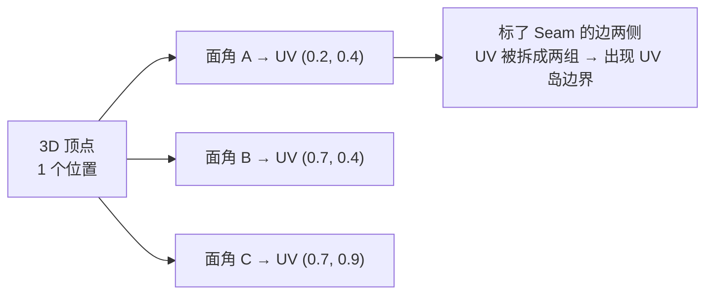
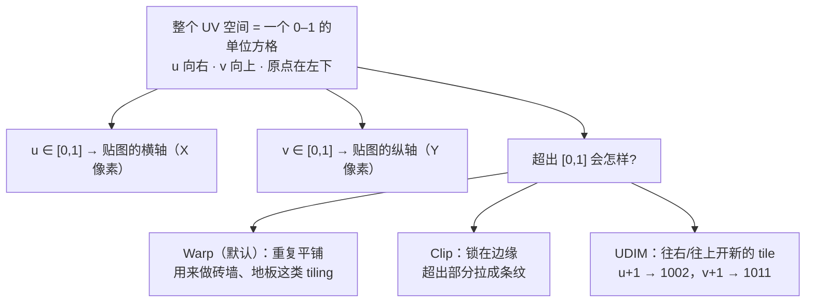
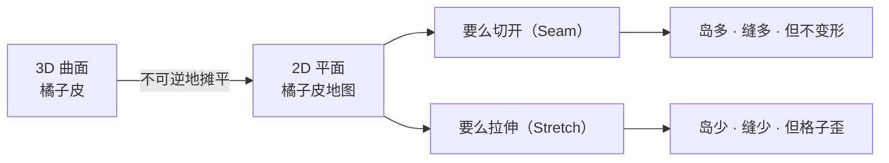
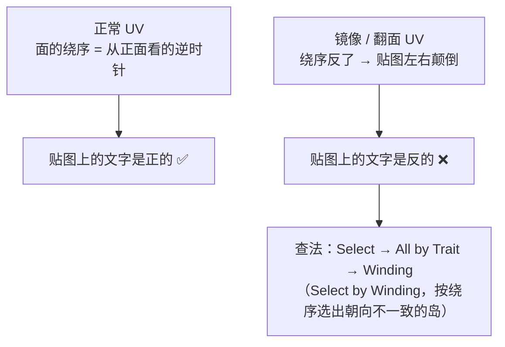
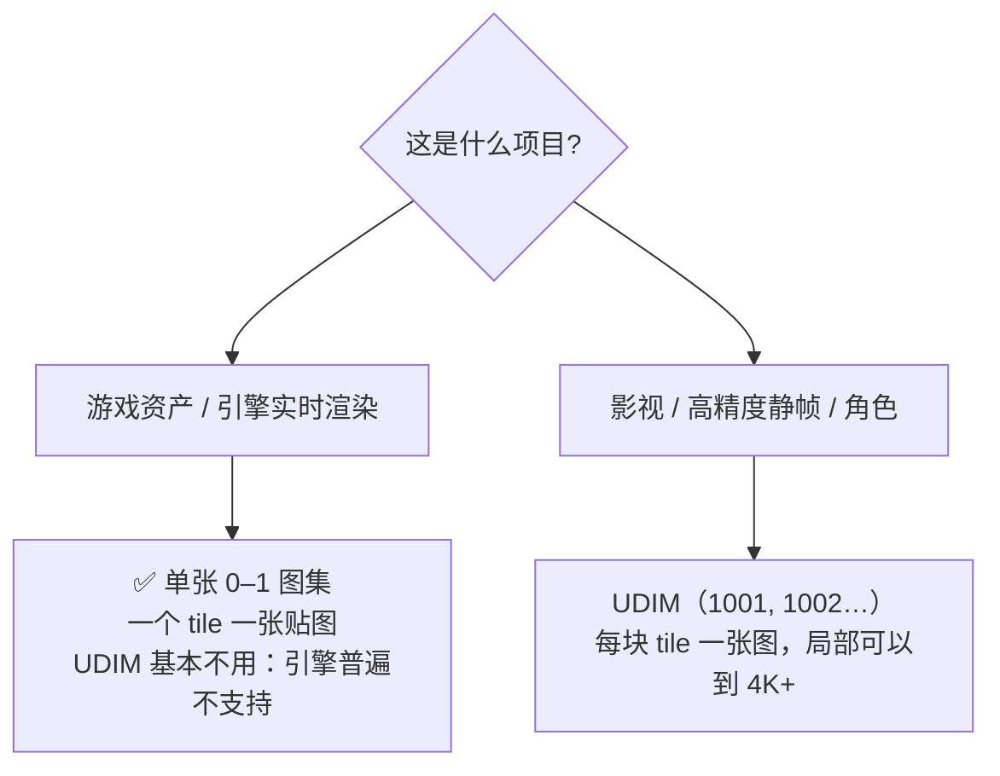

# 01 · UV 到底是什么（坐标 · 手性 · UDIM）

> 一句话：**UV 是「每个面角（face corner）在贴图上的 2D 坐标」**，展开的本质是给这张 2D 图排座位。
> 依据：Blender 5.2 LTS 官方手册 · [UVs](https://docs.blender.org/manual/en/latest/modeling/meshes/uv/index.html) / [UVs & Texture Space](https://docs.blender.org/manual/en/latest/modeling/meshes/uv/uv_texture_spaces.html) / [UDIMs](https://docs.blender.org/manual/en/latest/modeling/meshes/uv/workflows/udims.html)。

---

## 一、先把三个词分清楚

| 词 | 是什么 | 常见误解 |
| --- | --- | --- |
| **UV** | 每个**面角**上的一组 2D 坐标 `(u, v)` | ❌ 以为是「顶点上的坐标」 |
| **UV 贴图 / UV Map** | 整张网格上所有面角的 UV 集合，是一个**数据层**（`Object Data Properties → UV Maps`） | ❌ 以为是贴图图片本身 |
| **贴图 / Image** | 那张实际的 PNG/JPG 图片 | ❌ 以为「展 UV」等于「画贴图」 |

> ⭐ **最关键的一条**：UV 存在 **face corner（面角）** 上，**不是顶点上**。
> 一个顶点只有一个 3D 位置，但如果它是 4 个面的公共点，它就有 4 个独立的 UV。
> **这就是「缝合边能把网格切开」能成立的原因**——切开的是 UV，不是几何。



---

## 二、UV 空间长什么样



| 概念 | 说明 |
| --- | --- |
| **UV 岛（Island）** | UV 空间里一坨连在一起的面。岛与岛之间断开的地方就是 seam |
| **单位方格 / Tile** | `[0,1]` 这个格子。一张贴图 = 一个 tile |
| **UDIM tile** | 超出 `[0,1]` 后按 `1001 + u_tile + 10 × v_tile` 编号的格子（1001/1002/1011…） |
| **Padding / Gutter** | 岛与岛之间留的空白，见 [`06-纹素密度与贴图分辨率.md`](06-纹素密度与贴图分辨率.md) |

---

## 三、为什么必须「展开」：3D → 2D 一定有变形



展开 = **在「切几刀」和「拉多歪」之间做交易**。没有唯一正确答案，只有「对这个资产更合适」的答案。

### 三类变形，各自对应一种检查

| 变形 | 表现 | 怎么查 |
| --- | --- | --- |
| **拉伸 Stretch** | 棋盘格变成长方形 | UV 编辑器 Overlays → Stretching；UV Grid 目测 |
| **剪切 Shear** | 棋盘格变成菱形（格子不方且不直） | `UV → Average Island Scale` 的 **Shear** 可缓解 |
| **面积失真 / 密度不一致** | 两个物件贴图清晰度差很多 | 纹素密度，见 [`06`](06-纹素密度与贴图分辨率.md) |

---

## 四、手性（Winding）与镜像 UV ⭐ 最容易被忽略的一条

UV 有两个方向：**位置**和**朝向**。一个岛可以是「翻过来」的：



**什么时候最容易翻**：

1. **Mirror 修改器**：镜像出来的那一半，UV 天然是镜像的（除非用 `Copy Mirrored UV Coordinates` 处理过）
2. **对称建模后 Apply**：同上
3. **`S X -1` 之类的负缩放**：UV 跟着翻
4. **手工在 UV 编辑器里 `S X -1` 把岛翻过去塞空隙**：最隐蔽的一种

> 判定的土办法永远是那张**带文字或数字的测试图**：如果「F」是反的，就有岛翻了。
> 精确查法：`UV 编辑器 → Select → All by Trait → Winding`（官方手册 `bpy.ops.uv.select_by_winding`）。

---

## 五、单张图集 vs UDIM：游戏资产怎么选



| | 单张图集 | UDIM |
| --- | --- | --- |
| 游戏引擎支持 | ✅ 普遍（glTF/FBX 的 UV channel） | ❌ 大多不支持 |
| 上手成本 | 低 | 高（要管一堆图） |
| 本路线要不要学 | **要** | 只了解概念，不用 |

> 路线图 Stage 3 写了「UDIM 取舍」——结论就是**这条主线不取**。知道它是什么、为什么不用即可。
> 5.0 新增的「按 UDIM tile 移动岛」（Numpad 方向键）是给还在用 UDIM 的人的，你暂时用不上，见 [`04`](04-UV编辑器与岛操作-Pin-Pack-5x同步.md)。

---

## 六、UV 与「引擎里的 UV channel」

一个网格可以有**多套 UV 贴图**（`Object Data Properties → UV Maps` 里的 `+`）：

| 槽位 | 引擎里的名字 | 典型用途 |
| --- | --- | --- |
| 第 1 套（默认 `UVMap`） | `TEXCOORD_0`（glTF）/ UV0 / uv | **主贴图**：Base Color / Normal / Roughness |
| 第 2 套（如 `UVMap_Lightmap`） | `TEXCOORD_1` / UV1 / uv2 | **光照贴图**（烘焙 GI），必须不重叠 |

> 多数游戏道具**只需要第 1 套**。第 2 套只在你要烘焙光照贴图、或引擎明确要求时才做，见 [`07-第二套UV与光照贴图UV.md`](07-第二套UV与光照贴图UV.md)。

---

## 七、坑

- ❌ **以为 UV 存在顶点上** → 理解不了「为什么同一个点能有两组 UV」→ 后面缝合边、Pin、岛的概念全卡住
- ❌ **以为展完 UV 就自动有贴图** → 展 UV 只给坐标，材质里不连 Image Texture 节点就渲染不出来（手册原话：没有材质渲染就是灰色）
- ❌ **用负缩放 / 镜像后不检查手性** → 贴图文字反了，直到 Stage 4 贴上去才发现
- ❌ **把 UV 排到 `[0,1]` 外面还以为没事** → 默认 Warp 会重复平铺，导出后看到奇怪的重复纹理
- ❌ **给游戏资产上 UDIM** → 引擎不吃
- ❌ **岛之间一点空隙不留** → mipmap 一下降，邻岛像素渗进来 → 见 [`06`](06-纹素密度与贴图分辨率.md)

---

## 八、自检

| # | 自检点 | 通过标准 |
| - | ------ | -------- |
| ① | face corner | 说出「UV 存在面角上而不是顶点上」，并解释为什么这让 seam 成为可能 |
| ② | 三类变形 | 说出拉伸 / 剪切 / 面积失真的区别，各对应什么检查手段 |
| ③ | 手性 | 说出一个岛「翻了」的 3 种常见来源，并说出用 Winding 选择怎么查 |
| ④ | UDIM | 说出本主线为什么不用 UDIM |
| ⑤ | 两套 UV | 说出 `TEXCOORD_0` / `TEXCOORD_1` 分别干什么 |

---

## 九、速查

```text
【概念】
UV        = 每个【面角】上的 2D 坐标 (u, v)，不是顶点上的
UV Map    = 整张网格的 UV 数据层（Object Data → UV Maps）
UV 岛     = UV 空间里连在一起的一坨面，岛之间断开处 = seam
UV 空间   = 0–1 单位方格；u 向右，v 向上，原点左下
超出 0–1  → Warp(平铺) / Clip(拉丝) / UDIM(1001,1002,1011…)

【为什么必须切】
3D→2D 必然变形，展开 = 「切几刀」×「拉多歪」的交易

【三类变形】
Stretch 拉伸 → 格子变长方形 → Overlays → Stretching + UV Grid
Shear   剪切 → 格子变菱形   → Average Island Scale 的 Shear
密度不一致   → 清晰度不一   → 纹素密度（06）

【手性 Winding】
镜像的 UV 会让贴图左右颠倒
高危来源：Mirror 修改器 / 负缩放 / 手工 S X -1
查：UV 编辑器 → Select → All by Trait → Winding
土办法：贴一张带「F」或数字的测试图

【UDIM】
游戏资产：❌ 不用（引擎普遍不支持）
影视/高精：✅ 用
本主线：只了解概念

【UV channel】
UVMap（第1套）          → TEXCOORD_0 → 主贴图
UVMap_Lightmap（第2套）  → TEXCOORD_1 → 光照贴图（07）
多数道具只需要第 1 套
```

---

> **下一步**：[`02-缝合边策略-Seam.md`](02-缝合边策略-Seam.md) —— UV 是给面角排座位，那第一件事就是决定**从哪剪开**。
