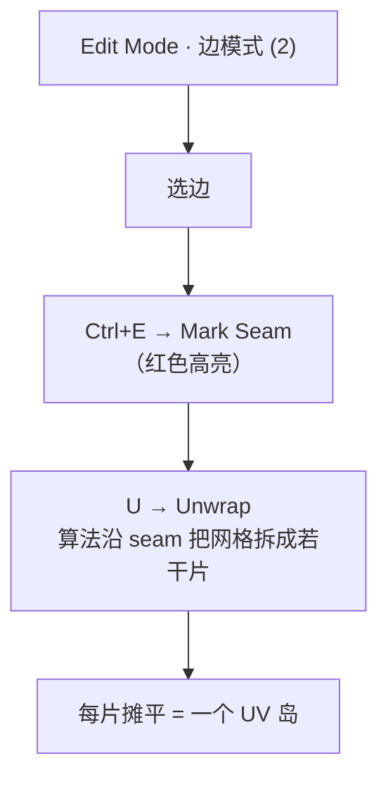
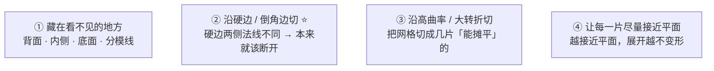
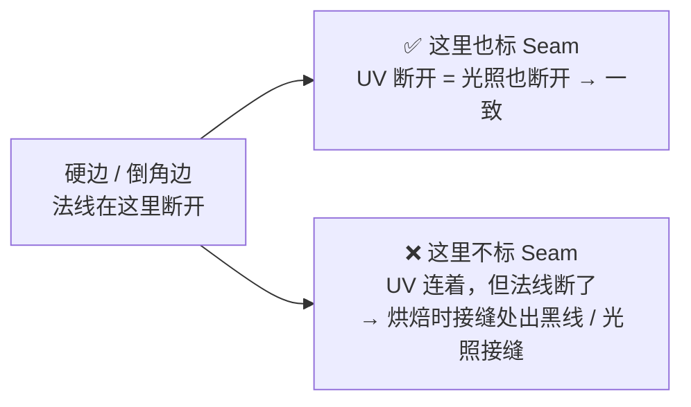
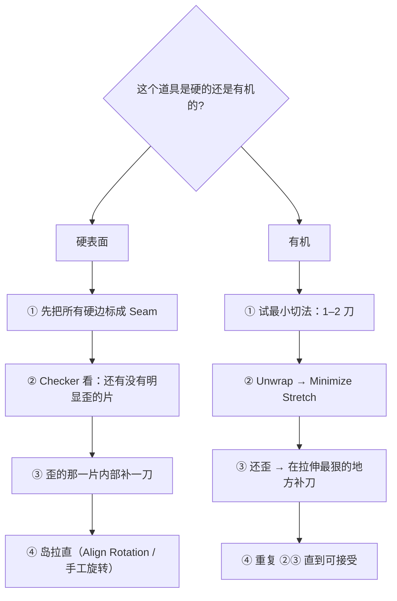
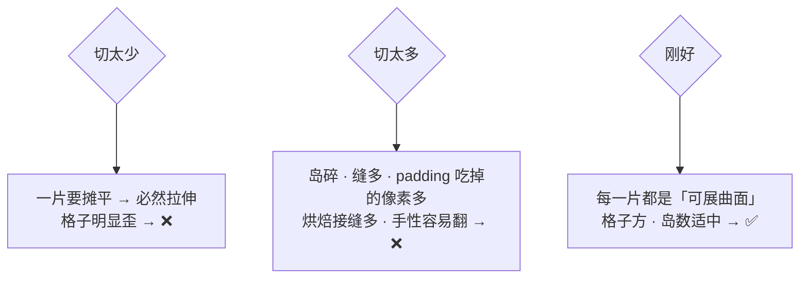
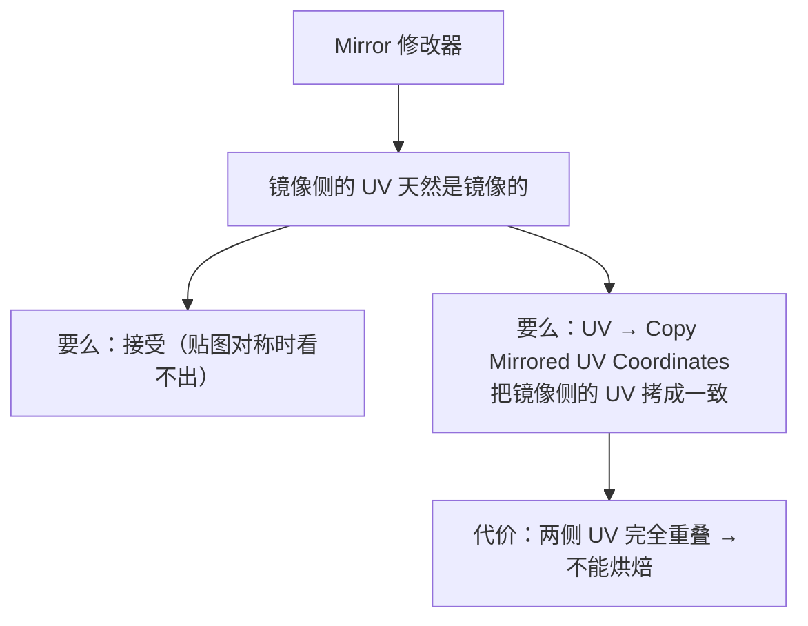
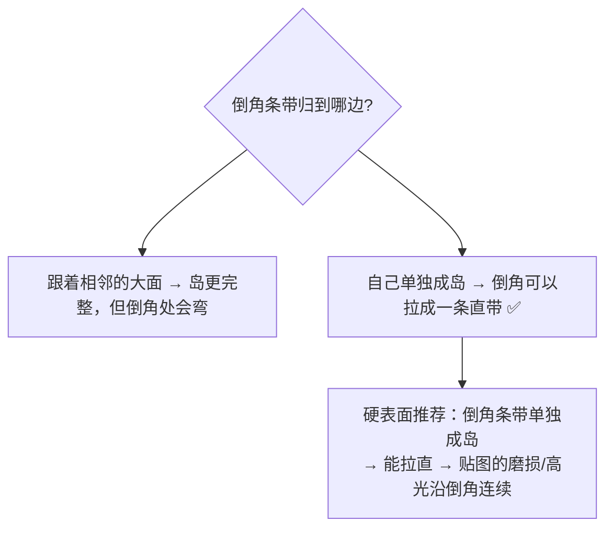

# 02 · 缝合边策略（Seam）⭐

> 一句话：**缝合边是「UV 剪刀线」——它不改几何，只告诉 Unwrap「从这里切开」。**
> 依据：Blender 5.2 LTS 官方手册 · [Seams](https://docs.blender.org/manual/en/latest/modeling/meshes/uv/unwrapping/seams.html) / [Editing UVs](https://docs.blender.org/manual/en/latest/modeling/meshes/uv/editing.html)。

---

## 一、Seam 是什么、不是什么

| | 说明 |
| --- | --- |
| **是** | 存在网格 **边** 上的一个**属性标记**；UV 展开时把它当作切开的边界 |
| **不是** | ❌ 不是真的把网格切开（几何完全没变）❌ 不是硬边（`Mark Sharp`）❌ 不影响渲染和法线 |



> ⚠️ **只有 `Unwrap`（和 `Follow Active Quads`）依赖 seam。** `Smart UV Project` / `Cube Projection` / `Lightmap Pack` 自己算切口，标不标 seam 它们都不看。
> 所以「不标缝合边直接 Unwrap → 一团乱麻」（路线图原话）**只对 Unwrap 成立**，别套到所有方法上。

---

## 二、四条原则：刀该切在哪



### 原则 ② 是最重要的一条（也是验收标准里的那条）



> 路线图验收标准「硬边/倒角边与 UV 缝合边对齐（避免光照接缝）」说的就是这条。
> 好消息：Stage 1 你已经用 `Mark Sharp` / Smooth by Angle 标过硬边了，边缘选择可以复用。

### 反面：不要把 seam 标在平面的正中间

一个大平面上横切一刀 → 白白多出一条缝、多一次 padding 浪费、多一处可能的光照接缝。**平面尽量保持完整。**

---

## 三、硬表面 vs 有机：两套完全不同的思路

| | 硬表面（木箱 / 油桶 / 储物柜） | 有机（岩石 / 树桩 / 生物） |
| --- | --- | --- |
| 目标 | 切成**规整的矩形片**，方便对齐贴图的横平竖直 | **尽量少切**，保住纹理连续性 |
| 思路 | 像**拆纸箱**：照着「盒子展开图」切 | 像**剥橘子**：找最少几刀能摊平 |
| 典型切法 | 沿每条**硬边**切；U 型外壳切 2–3 刀 | 沿肢体根部、大的转折切 1–3 刀 |
| 岛的数量 | 多（10–30 个很正常） | 少（1–5 个） |
| 后续重点 | **拉直 + 对齐 + 排布** | **Minimize Stretch 松弛** |



---

## 四、怎么标得快：选择技巧

| 操作 | 按键 / 路径 | 用途 |
| --- | --- | --- |
| 边模式 | `2` | 进入边选择 |
| 选环 / 选圈 | `Alt+LMB` / `Ctrl+Alt+LMB` | ⭐ 沿一圈边一次选中，切圆柱、切箱子全靠它 |
| 选连通 | `L` | 选中连在一起的边 |
| 选相似 | `Shift+G` | 按属性批量选（Stage 1 已会） |
| **标 / 清 Seam（3D 视口）** | `Ctrl+E → Mark Seam` / `Clear Seam` | 主力入口 |
| **标 / 清 Seam（UV 编辑器）** | `UV → Mark/Clear Seams` | 在 UV 侧操作时用 |
| 选中所有 seam | `Select → All by Trait → Seam` | 复查用 |
| ⭐ **从岛反标 seam** | `UV → Seams from Islands` | **先展完，再从岛边界反着把 seam 标上**，方便二次编辑 |
| 复制镜像 UV | `UV → Copy Mirrored UV Coordinates`（5.0 起改为 C++ 实现，快很多） | 修 Mirror 造成的 UV 不一致 |

> **`Seams from Islands` 是本阶段的隐藏效率点**：你先用 `Smart UV Project` 或 `Cube Projection` 得到一个能看的展开，跑一次 `Seams from Islands` 把切口固化成 seam，之后就能用 `Unwrap` / `Minimize Stretch` 在这个基础上精修了。

---

## 五、切几刀？给一个可执行的权衡



| 资产 | 经验岛数 | 说明 |
| --- | --- | --- |
| 木箱（6 面 + 木条 + 角件） | 3–8 | 外壳可以做成一个「十字展开图」 |
| 油桶（圆柱 + 箍 + 顶底盖） | 3–6 | 侧面沿高切 1 刀摊成长方形；顶底各 1 岛 |
| 工具箱（含把手锁扣） | 8–20 | 分离件各自成岛 |
| 储物柜（Mirror + Array） | 10–30 | 重复结构可以**共用岛**（见下） |

### 重复结构：故意重叠 vs 分开

| 做法 | 什么时候 | 代价 |
| --- | --- | --- |
| **共用同一块 UV**（故意重叠） | 4 个一样的螺丝、6 个一样的散热孔 | ✅ 省 UV 空间、省绘制时间<br/>❌ **不能烘焙光照贴图**、不能画差异 |
| **各自独立岛** | 需要光照贴图，或要画不同磨损 | 吃 UV 空间、绘制量翻倍 |

> 判定标准：**要不要烘焙？** 要烘焙 → 一张图集里**任何**两块都不能重叠（烘焙是按 UV 位置往回投影的，重叠 = 互相覆盖 = 黑块）。不烘焙 + 纯 tiling 材质 → 放心重叠。

---

## 六、Seam 与 Mirror / SubD / 倒角的关系

### Mirror



- **要烘焙光照贴图** → 保持镜像差异，两侧各占一块 UV 空间（不重叠）
- **不要烘焙 + 纹理对称** → `Copy Mirrored UV Coordinates`，省一半空间

### Subdivision Surface

- UV 是**基础网格**上的属性，SubD 不会改变 UV 数量，只是插值
- 但：展 UV 时如果开了 `Use Subdivision Surface`，算法会按**细分后的形状**来优化，能避免「低模展得挺好，细分后一片拉伸」
- 判定：你的资产最终要 Apply SubD 进引擎 → 建议开着展

### 倒角（Bevel）



> 实操口诀：**大面归大面，倒角条带单独走。** 倒角单独成岛后可以 `Align Rotation` 拉成横平竖直的一条，效果比跟着大面弯着好看得多。

---

## 七、坑

- ❌ **以为所有展开方法都要 seam** → 只有 `Unwrap` / `Follow Active Quads` 看 seam，`Smart UV Project`、`Cube Projection`、`Lightmap Pack` 自己算
- ❌ **seam 标在硬边以外的地方** → 平坦区域出现光照接缝（烘焙后尤其明显）
- ❌ **用 `Mark Sharp` 代替 `Mark Seam`** → 两个都是 `Ctrl+E` 菜单里的，容易点错；**Sharp 管渲染法线，Seam 管 UV**，互不相干
- ❌ **Mirror 后直接烘焙** → 镜像侧 UV 重叠 → 一半的烘焙结果被另一半覆盖
- ❌ **倒角忘了处理** → 倒角跟着大面弯曲，贴图的条纹在倒角处扭一下
- ❌ **岛切得碎到每个面一个岛** → padding 吃掉一半 UV 空间，利用率达不到 80%
- ❌ **标完 seam 不复查** → 漏一刀，Unwrap 出来一片还连着、拉得很歪 → 用 `Select → All by Trait → Seam` 整体扫一遍

---

## 八、自检

| # | 自检点 | 通过标准 |
| - | ------ | -------- |
| ① | 概念 | 说出「seam 只是属性，不改几何」，以及哪些展开方法看 seam、哪些不看 |
| ② | 原则 | 说出 4 条切法原则，并解释「沿硬边切」为什么能避免光照接缝 |
| ③ | 硬 vs 有机 | 说出硬表面「拆纸箱」与有机「剥橘子」两套思路的差别 |
| ④ | 效率 | 说出 `Alt+LMB` / `Ctrl+Alt+LMB` / `Seams from Islands` 的用途 |
| ⑤ | 权衡 | 说出「切太少 / 切太多」各自的代价；说出什么时候可以**故意重叠** |
| ⑥ | **实操** | 给一个木箱（含倒角），**5 分钟内**标完 seam 并 `U → Unwrap` 出「格子基本方正」的展开 |

---

## 九、速查

```text
【是什么】
Seam = 边上的一个属性标记，告诉 Unwrap 从这里切开
❌ 不改几何  ❌ 不是 Mark Sharp（Sharp 管法线，Seam 管 UV）
⚠️ 只有 Unwrap / Follow Active Quads 看 seam
   Smart UV Project / Cube Projection / Lightmap Pack 自己算切口

【操作】
3D 视口：边模式 2 → 选边 → Ctrl+E → Mark Seam / Clear Seam
UV 编辑器：UV → Mark/Clear Seams
复  查：Select → All by Trait → Seam
反  标：UV → Seams from Islands ⭐（先展后固化切口）
镜  像：UV → Copy Mirrored UV Coordinates（5.0 起 C++ 实现，更快）
选择：Alt+LMB 选环 · Ctrl+Alt+LMB 选圈 · L 选连通 · Shift+G 选相似

【四原则】
① 藏在看不见的地方
② 沿硬边 / 倒角边切 ⭐（避免烘焙光照接缝）
③ 沿高曲率 / 大转折切
④ 每片尽量接近平面

【硬表面 vs 有机】
硬表面：拆纸箱 · 沿所有硬边切 · 岛多 · 后续靠拉直对齐
有机：  剥橘子 · 最少刀 · 岛少 · 后续靠 Minimize Stretch

【Mirror】
要烘焙   → 两侧各占 UV 空间，不重叠
不烘焙   → Copy Mirrored UV Coordinates，省一半空间

【SubD】
UV 在基础网格上；展时开 Use Subdivision Surface
可避免「低模展得好，细分后拉伸」

【倒角】
大面归大面，倒角条带单独成岛 → 可拉直 → 贴图沿倒角连续

【重叠判断】
要烘焙（AO/Normal/Lightmap）→ 一个都不能重叠
不烘焙 + tiling 材质      → 重复结构可以放心重叠
```

---

> **下一步**：[`03-展开方法全家桶-Unwrap-SmartUV-CubeProjection.md`](03-展开方法全家桶-Unwrap-SmartUV-CubeProjection.md) —— 刀标好了，现在选一把「摊平」的算法。
