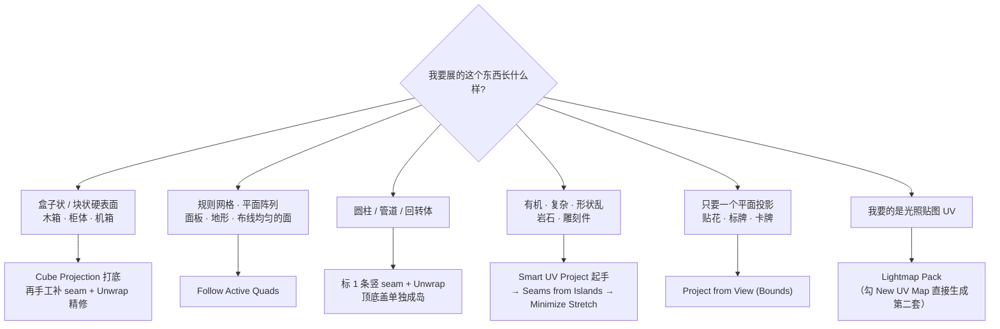
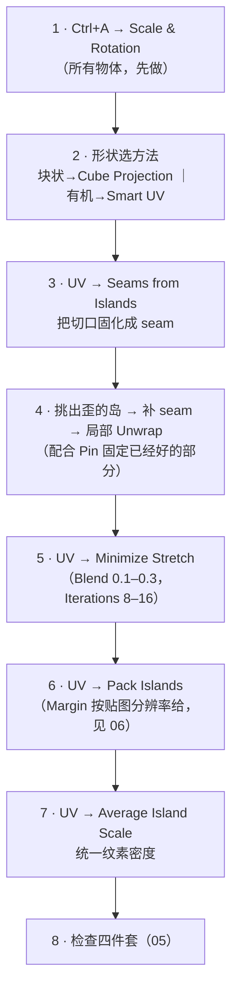

# 03 · 展开方法全家桶（U 菜单逐个拆）

> 一句话：**没有万能展开法，只有「当前这个形状，哪把刀最省事」——选错方法的代价是后面花三倍时间手工修。**
> 依据：Blender 5.2 LTS 官方手册 · [Unwrapping](https://docs.blender.org/manual/en/latest/modeling/meshes/uv/unwrapping/index.html) / [Editing UVs](https://docs.blender.org/manual/en/latest/modeling/meshes/uv/editing.html)。

> 📌 选项名以你本机 5.2 的 *Adjust Last Operation*（`F9`）面板为准；找不到命令一律 `F3` 搜命令名。

---

## 一、决策树：先选方法，再动手



---

## 二、逐个方法

### 2.1 `U → Unwrap`（主力，看 seam）

沿着你标的 seam 把网格切成若干片，再用 **`ABF++`（Angle Based）** 或 **Conformal（LSCM）** 算法摊平。

| 选项 | 说明 | 怎么选 |
| --- | --- | --- |
| **Method** | `Angle Based`（默认）最小化**角度**畸变；`Conformal` 最小化**角度+保形** | 有机件用 `Angle Based`；**机械件/规则面用 `Conformal`**（更保住直角） |
| **Fill Holes** | 岛内部的洞会被临时填起来再算，防止周边 UV 被拉扯 | 面上有洞时开 |
| **Correct Aspect** | 展开时补偿物体的**非均匀缩放** | 老教程常提。**但正解是先 `Ctrl+A → Scale`**，别靠它兜底 |
| **Use Subdivision Surface** | 按 SubD 之后的形状来优化展开 | 最终要 Apply SubD 进引擎时开 |

> ⚠️ **Correct Aspect 不是免死金牌**：非均匀 Scale 会让 Bevel、SubD、布尔全部跟着歪（Stage 1 已强调）。先把 Scale Apply 干净，`Correct Aspect` 只是临时救急。

### 2.2 `U → Smart UV Project`（自动切，不看 seam）

按**面间夹角**自动决定切口，一句话展开。**有机件和形状复杂件的最佳起手式。**

| 选项 | 说明 |
| --- | --- |
| **Angle Limit** | 相邻面夹角超过这个值就切开。默认 66°；调小 → 切得更碎、岛更多；调大 → 岛少但更拉伸 |
| **Island Margin** | 展开后自动在岛之间留的边距（一次性做完，省得再 Pack） |
| **Area Weight** | 让大面在展开中占更大权重，减小大面的拉伸。一般保持开 |
| **Correct Aspect** | 同上 |
| **Stretch to UV Bounds** | 展开后自动缩放到填满 0–1 方格 |

| 优点 | 缺点 |
| --- | --- |
| 不用标 seam，30 秒出结果 | **岛碎**（几十上百个）、方向随机、密度靠 `Average Island Scale` 兜 |
| 有机件效果不错 | 硬表面用它 → 一片片歪着，后期拉直的工作量巨大 |

> ❌ **别把 Smart UV Project 当万能解**。路线图把它和 `Unwrap` 并列提问「适用场景」，答案就是：
> **有机 → Smart；硬表面 → 标 seam + Unwrap（或 Cube Projection 打底）。**

### 2.3 `U → Lightmap Pack`（给光照贴图用）

一步做完「分岛 + 留边距 + 排布」，是第二套 UV 的标准做法。

| 选项 | 说明 |
| --- | --- |
| **Share Texture Space** | 多个选中物体共用同一块 0–1 空间（一整间屋子共用一张光照图时用） |
| **New UV Map** | ⭐ 勾上就直接新建一套 UV Map，不用手动 `+` |
| **Margin** | 岛间距（光照图对 padding 尤其敏感） |

> 详见 [`07-第二套UV与光照贴图UV.md`](07-第二套UV与光照贴图UV.md)。

### 2.4 `U → Follow Active Quads`

先选中一个面作为「参考面」（最后选中的那个是 active），算法沿着 **Quad 网格的规则走向**铺开，产出的 UV 保持网格原有的行列结构。

| 适用 | 不适用 |
| --- | --- |
| 布线均匀的规则网格、面板、地形、由 Array 生成的面阵列 | n-gon / 三角面多的区域（会失败或走歪） |

> 这是「展开后不用再拉直」的方法——因为它天生就是直的。**前提是你的拓扑真的规整**，所以它其实是 Stage 0/1 的兑现：拓扑好的模型才有资格用。

### 2.5 `U → Cube Projection`（硬表面快刀）

按 **6 个轴向**把面投影到立方体的 6 个面上，再拆成展开图。

| 选项 | 说明 |
| --- | --- |
| **Cube Size** | 虚拟立方体大小，影响投影分组 |
| **Correct Aspect** | 同上 |
| **Clip to Bounds** | 把结果裁进 0–1 |
| **Scale to Bounds** | 缩放到填满 0–1 |

| 优点 | 缺点 |
| --- | --- |
| 块状硬表面 10 秒出结果，且**天然横平竖直** | 斜面/曲面投影会拉扯；面朝哪个轴就归哪个组，陡斜面会歪得离谱 |

> **推荐组合拳**：`Cube Projection` 出大形 → `UV → Seams from Islands` 固化切口 → 手工调几个歪的岛 → `Unwrap` / `Minimize Stretch` 精修。
> 这比从零标 seam 快得多，也比纯 Smart UV 干净得多。

### 2.6 `U → Project from View (Bounds)`

从**当前视角**正投影，就像给模型拍张照。

| 适用 | 说明 |
| --- | --- |
| 贴花 / 标牌 / 卡牌 / 正对镜头的平面 | 视角必须正对，斜一点就透视变形 |
| 快速检查某个面的方向 | 配合 `Scale to Bounds` |

### 2.7 `U → Reset`

把所有 UV 重置成默认（每个面铺满整个方格，全重叠）。**作用是「推倒重来」**，不是正常流程的一部分。

### 2.8 辅助：`UV → Seams from Islands`

不是展开方法，但经常和上面这些配着用：**把当前岛的边界反向标成 seam**，方便之后用 `Unwrap` 精修。见 [`02`](02-缝合边策略-Seam.md)。

---

## 三、方法 × 场景 速查表

| 场景 | 首选 | 备选 | 别用 |
| --- | --- | --- | --- |
| 木箱 / 柜体（盒子状） | **Cube Projection** → 精修 | 标 seam + Unwrap | Smart UV Project |
| 油桶 / 管道（回转体） | 标 1 条竖 seam + **Unwrap** | Cube Projection | Smart UV Project |
| 面板 / 规则网格 | **Follow Active Quads** | 标 seam + Unwrap | Smart UV Project |
| 岩石 / 雕刻有机件 | **Smart UV Project** → Minimize Stretch | 最少刀 + Unwrap | Cube Projection |
| 贴花 / 标牌 | **Project from View** | 手工 | — |
| 光照贴图（第 2 套） | **Lightmap Pack** | 复制主 UV + 重排 | — |
| 已经展过要改 | `Seams from Islands` → Unwrap / Minimize Stretch | Pin + Unwrap | 直接 Reset |

---

## 四、组合拳（本阶段最实用的一条工作流）



> 第 3 步是这套流程的枢纽：**Cube/Smart 负责出大形，seam 负责把它变成可精修的状态，Unwrap/Minimize Stretch 负责精修。**

---

## 五、坑

- ❌ **不 Apply Scale 直接展，靠 Correct Aspect 兜** → Bevel / SubD / 布尔同时被带歪，UV 只是受害最明显的那个
- ❌ **硬表面用 Smart UV Project** → 岛碎且歪，拉直的工作量比从零标 seam 还大
- ❌ **有机件硬标一堆 seam 用 Unwrap** → 缝多，纹理断裂明显；有机件应该少切 + 松弛
- ❌ **Follow Active Quads 用在脏拓扑上** → 走不动或直接错乱；它只吃规整 Quad 网格
- ❌ **Cube Projection 用在有大量斜面的模型上** → 斜面投影严重拉伸
- ❌ **SubD 修改器开着但不勾 Use Subdivision Surface** → 低模展得挺好，进引擎 Apply 完 SubD 后一片拉伸
- ❌ **展完不 Pack 直接看** → 岛全挤在角落或者互相压着，看不出真实利用率

---

## 六、自检

| # | 自检点 | 通过标准 |
| - | ------ | -------- |
| ① | 决策 | 给「木箱 / 油桶 / 岩石 / 标牌」四个物体，各能在 10 秒内说出首选展开方法与理由 |
| ② | Unwrap 参数 | 说出 `Angle Based` vs `Conformal` 各自的适用场景 |
| ③ | 哪些看 seam | 说出 6 种方法里哪些依赖 seam、哪些不看 |
| ④ | 组合拳 | 说出「Cube/Smart 出形 → Seams from Islands → 精修 → Minimize Stretch → Pack → Average Scale」这条链路，并说出每步在解决什么 |
| ⑤ | **实操** | 拿一个 Cube 加 Bevel 的小道具，**10 分钟内**展到「格子方正、岛数 ≤ 8」 |

---

## 七、速查

```text
【决策】
块状硬表面 → Cube Projection → Seams from Islands → 精修
回转体     → 标 1 条竖 seam + Unwrap，顶底盖单列
规则网格   → Follow Active Quads
有机/复杂  → Smart UV Project → Minimize Stretch
贴花/标牌  → Project from View (Bounds)
光照贴图   → Lightmap Pack（勾 New UV Map）
推倒重来   → Reset

【Unwrap（看 seam）】
Method:   Angle Based（默认·有机） / Conformal（保直角·机械件）
Fill Holes: 面上有洞时开
Correct Aspect: 只救急，正解是 Ctrl+A → Scale
Use Subdivision Surface: 最终要 Apply SubD 时开 ✅

【Smart UV Project（不看 seam）】
Angle Limit 66°（调小=更碎，调大=更拉伸）
Island Margin: 一次留好边距
Area Weight: 默认开
Stretch to UV Bounds: 自动填满 0–1
❌ 别拿它当万能解

【Lightmap Pack】Share Texture Space / New UV Map ⭐ / Margin
【Follow Active Quads】只吃规整 Quad 网格，n-gon 会歪
【Cube Projection】Cube Size / Correct Aspect / Clip to Bounds / Scale to Bounds
【Project from View】视角必须正对，否则透视变形
【Seams from Islands】从岛边界反标 seam，是「出形 → 精修」的枢纽 ⭐

【组合拳】
Ctrl+A → 选方法出形 → Seams from Islands → 补刀+Unwrap
→ Minimize Stretch → Pack Islands → Average Island Scale → 检查四件套
```

---

> **下一步**：[`04-UV编辑器与岛操作-Pin-Pack-5x同步.md`](04-UV编辑器与岛操作-Pin-Pack-5x同步.md) —— 展开完了，接下来所有活都在 UV 编辑器里：固定、拉直、排布。
