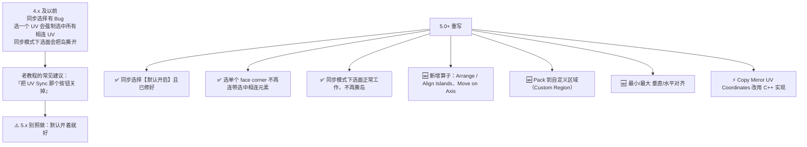
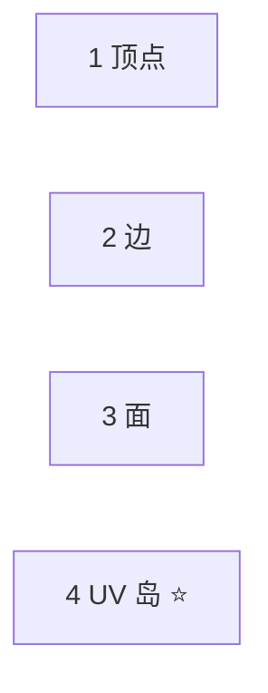
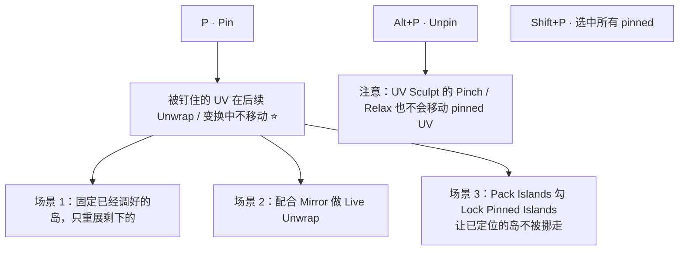

# 04 · UV 编辑器与岛操作（5.x 同步 · Pin · Pack）

> 一句话：**展开只是「出形」，展完之后 80% 的时间都在 UV 编辑器里：钉住、拉直、排布。**
> 依据：Blender 5.2 LTS 官方手册 · [Selecting UVs](https://docs.blender.org/manual/en/latest/editors/uv/selecting.html) / [Editing UVs](https://docs.blender.org/manual/en/latest/modeling/meshes/uv/editing.html)；Blender 5.0 官方 Release Notes（UVerhaul）。

---

## 一、⭐ 5.x 变了什么（UVerhaul）——照老教程学会踩坑

Blender 5.0 把 UV 同步机制整个重写了（官方叫 **UVerhaul**）。**这是本阶段最大的环境差异，也是老教程最坑你的地方。**



> 📌 **路线图第 212 行写「5.x 的 UV 同步机制（比 4.x 少踩很多坑）」——方向对，但没说清楚关键动作差异：
> 老教程教你【关掉同步】，5.x 是【默认开着且不用关】。**

### 5.x 新增 / 重做的算子（都在 UV 编辑器里）

| 算子 | 菜单 | 干什么 | 什么时候用 |
| --- | --- | --- | --- |
| **Arrange / Align Islands** | `UV → Arrange/Align Islands` | 把选中的岛按轴排成一排并对齐 | 把一堆小岛码齐，做「贴图带」时很好用 |
| **Move on Axis** | `UV → Move on Axis`，或 `Numpad 8/2/4/6` | 按固定步长移动岛：<br/>无修饰键 = **UDIM**（整格 1.0）<br/>`Ctrl` = **Dynamic**（按网格尺寸）<br/>`Shift` = **Pixel**（按像素） | UDIM 挪 tile；`Shift` 按像素微调 padding |
| **Set User Region** | `UV → Set User Region`（`Ctrl+B`） | 框一块区域当「自定义排布范围」 | 把 UV 限制在贴图的某个区域（比如只占左半边） |
| **Custom Region 开关** | `UV → Custom Region`（`Ctrl+Alt+B`） | 启用/停用上面那个区域 | 配合 Pack Islands 的 `Pack To → Custom Region` |

> ⚠️ 手册里 `Ctrl+B` 同时出现在 **Box Select Pinned**（选择页）和 **Set User Region**（编辑页）。两者上下文不同，**以你本机实际行为为准**；冲突时 `F3` 搜命令名。

---

## 二、同步 vs 不同步：到底怎么选

| | **Sync Selection 开**（5.x 默认） | **Sync Selection 关** |
| --- | --- | --- |
| 表现 | UV 编辑器 ↔ 3D 视口选择状态共享；3D 里选面，UV 里就选到 | 只有 3D 里已选中的面才在 UV 里显示；两侧选择独立 |
| 优点 | 能同时在两边看「这块对应哪个面」 | 可以单独选中某个 UV 顶点（同一个网格顶点上的多个 UV 之一） |
| 缺点 | 顶点/边模式下，一个顶点可能只有部分 UV 被选中 | 看不到完整 UV 全貌，容易漏岛 |
| 建议 | **默认就用它** | 只在需要「单独拽一个 UV 顶点」时临时关 |

> 手册提示：3D 视口的 `Select Random` / `Select Similar` 等算子会**重置** per-UV 选择数据（把相连 UV 全选上）。所以精细的 UV 选择尽量在 UV 编辑器里做。

---

## 三、选择模式与「粘性选择」



- **`4` = UV Island Selection**：选中 UV 图里连成一片的整组面。⭐ **排布、缩放、旋转时最常用**
- 同步开启时，`Shift`+点选择模式可以同时激活多个模式

### Sticky Selection Mode（粘性选择）⭐ 理解它才不会以为「UV 编辑器坏了」

| 模式 | 行为 |
| --- | --- |
| **Disabled** | 每个 UV 顶点完全独立选中（想分开拽就用它） |
| **Shared Location**（默认） | 同一个网格顶点 + 相同 UV 坐标的 UV 顶点一起选中 → **看起来像多个面共享一个点**，其实它们是各自独立的、重叠在一起的点 |
| **Shared Vertex** | 同一个网格顶点的所有 UV 都选中（哪怕 UV 坐标不同） |

> 想把一个面从岛里「拽出来」却总是连带一片？两个办法：
> **`Y`（Select Split）** 把「看起来连着」的取消选择，或者把 **Sticky 设为 Disabled**。
> 手册明确说 `Select Split` 是纯选择算子，不会真的切开几何。

### 常用选择算子

| 操作 | 键 / 路径 | 用途 |
| --- | --- | --- |
| 选整个岛 | `Ctrl+L`（Select Linked） | 只选了一部分时扩展成整岛 |
| 拆开选择 | `Y`（Select Split） | 把「粘」在一起的取消掉 |
| 扩展 / 收缩 | `Ctrl+Numpad+` / `Ctrl+Numpad-` | More / Less |
| 选相似 | `Shift+G` | 按面积 / 长度 / 材质 / 绕序等 |
| ⭐ 选重叠 | `Select → All by Trait → Overlap` | 烘焙前必查 |
| ⭐ 选翻面 | `Select → All by Trait → Winding` | 查手性/镜像 |
| 选已钉住的 | `Shift+P`（Select Pinned） | 复查 Pin |

---

## 四、Pin（钉住）



> `Pin` 的意义在于**分步推进**：不要指望一次 Unwrap 把所有岛都展好。先把满意的钉住，剩下的一点点磨。

---

## 五、Pack Islands（排布）全参数

`UV → Pack Islands`。**这是把 UV 利用率做到 80%+ 的那一步。**

| 参数 | 说明 | 建议 |
| --- | --- | --- |
| **Shape Method** | `Exact Shape (Concave)` 精确含孔洞 / `Boundary Shape (Convex)` 用凸包 / `Bounding Box` 最快 | 常规用 `Exact Shape`；岛特别多时先用 `Bounding Box` 试排 |
| **Scale** | 缩放到填满一个单位方格（或朝左下角排） | 一般开 |
| **Rotate** | 允许旋转岛来提高利用率 | ✅ **通常保持开启**（手册也这么说） |
| **Rotation Method** | `Any` 任意角 / `Axis-aligned` 先转最小矩形再只 90° / `Cardinal` 只 90° | 硬表面用 `Axis-aligned` 或 `Cardinal`，保住横平竖直 ⭐ |
| **Margin Method** | `Scaled` 按缩放比例 / `Add` 相加 / `Fraction` 按格子比例（最慢） | 常规 `Scaled`；要精确控制像素边距时用 `Fraction` |
| **Margin** | 岛之间的间距 | 按贴图分辨率算，见 [`06`](06-纹素密度与贴图分辨率.md) |
| **Lock Pinned Islands** | 含 pinned UV 的岛不参与移动 | 配合 Pin 用 |
| **Lock Method** | `Scale` / `Rotation` / `Rotation and Scale` | — |
| **Merge Overlapping** | 排布前检测重叠岛并临时合并，保留相对位置 | 想保留「故意重叠」的重复结构时开 |
| **Pack To** | `Closest UDIM` / `Active UDIM` / `Original bounding box` / `Custom Region` | 单张图集就是默认；用自定义区域时选 `Custom Region` |

> 手册性能提示：`Bounding Box` + `Add` 最快；`Fraction` + `Exact Shape` 会明显变慢。

---

## 六、Average Island Scale（统一密度的基础）

`UV → Average Island Scale`：缩放每个岛，让它们的**相对比例一致**。这是「纹素密度一致」的免费实现。

| 选项 | 说明 |
| --- | --- |
| **Non-Uniform** | 允许 U/V 分别缩放，能减小岛内部的平均拉伸 |
| **Shear** | 允许剪切 U 轴，减小剪切变形 |

> ⚠️ 它是「**平均**」意义上的一致，不是精确的 px/m。要精确到数值请看 [`06`](06-纹素密度与贴图分辨率.md)。

---

## 七、Minimize Stretch（松弛）

`UV → Minimize Stretch`：迭代地把 UV 松弛到「拉伸最小」。有机件救拉伸的主力。

| 选项 | 说明 | 建议 |
| --- | --- | --- |
| **Blend** | 0–1。在「最小拉伸」和「原始 UV」之间混合。`0` = 完全最小化，`0.5` = 一半一半 | 常规 **0.1–0.3**（完全最小化会把岛拉变形、破坏已有的对齐） |
| **Iterations** | 迭代次数，越多越平滑也越慢 | 8–16 |
| **Fill Holes** | 过程中临时填掉内部洞，防止周边 UV 被拉扯/重叠 | 岛里有洞时开 |

---

## 八、Stitch / Align / Arrange

| 算子 | 键 / 路径 | 干什么 |
| --- | --- | --- |
| **Stitch** | `Alt+V` | 把共享顶点的、被切开的 UV 缝合回去。<br/>选项：`Use Limit` + `Limit Distance` 限制缝合距离 |
| **Align** | `UV → Align` | 把选中的 UV 对齐到一条线 |
| **Align Rotation** | `UV → Align Rotation` | ⭐ 把岛的边转成横平竖直（硬表面拉直神器） |
| **Arrange / Align Islands** | `UV → Arrange/Align Islands` | 5.x 新增。按轴把岛排一排并对齐<br/>选项：`Initial Position`(Bounding Box / UV Grid / Active UDIM / 2D Cursor)、`Axis`(X/Y)、`Align`(Min/Max/Center/None)、`Order`(大到小/小到大/固定)、`Margin` |
| **Move on Axis** | `Numpad 8/2/4/6`（`Shift`=像素，`Ctrl`=Dynamic，无=UDIM） | 5.x 新增，按固定步长挪岛 |
| **Copy / Paste UVs** | `UV → Copy UVs` / `Paste UVs` | 把一套 UV 布局拷给结构相同的另一个物体 |
| **Export UV Layout** | `UV → Export UV Layout` | 导出 PNG/EPS/SVG 的 UV 线框图，给外部绘制软件用 |

---

## 九、坑

- ❌ **照 4.x 老教程关掉 UV Sync** → 5.x 同步已重写且默认开启，关了反而看不到完整 UV 全貌
- ❌ **岛总是「连带一片」拽不动** → 不懂 Sticky Selection；用 `Y`（Select Split）或 Sticky 设 Disabled
- ❌ **Pack 之后岛全歪了** → `Rotate` 用了 `Any`；硬表面应该 `Cardinal` / `Axis-aligned`
- ❌ **Margin 给 0 或极小** → mipmap 一到就串像素（见 06）
- ❌ **Minimize Stretch 的 Blend 直接给 0** → 拉伸是小了，但岛被拉变形，硬表面的横平竖直全没了
- ❌ **Pack 前没检查重叠** → `Merge Overlapping` 会把你故意重叠的重复结构也合并掉（不想合并就别勾）
- ❌ **在 `Select Random` / `Select Similar` 之后发现精细 UV 选择没了** → 这两个算子会重置 per-UV 选择数据

---

## 十、自检

| # | 自检点 | 通过标准 |
| - | ------ | -------- |
| ① | 5.x 差异 | 说出 UVerhaul 改了什么，以及「老教程让关同步」在 5.x 为什么不适用 |
| ② | 选择 | 说出 `4`（岛选择）、`Ctrl+L`、`Y`、Sticky 三种模式各自的用途 |
| ③ | Pin | 说出 Pin 的 3 个使用场景和 `P` / `Alt+P` / `Shift+P` |
| ④ | Pack | 说出 Shape Method / Rotation Method / Margin / Merge Overlapping 各自怎么选 |
| ⑤ | 松弛 | 说出 Minimize Stretch 的 Blend 为什么不该给 0 |
| ⑥ | **实操** | 给 20 个乱七八糟的岛，**10 分钟内**做到：岛不重叠、硬表面的岛横平竖直、密度基本一致、利用率目测 80%+ |

---

## 十一、速查

```text
【5.x UVerhaul · 必记】
同步选择默认【开启】且已修好 → 老教程的「关同步」别照做
新增：Arrange/Align Islands · Move on Axis · Pack to Custom Region
     · Min/Max 垂直水平对齐
Copy Mirror UV Coordinates 改 C++ 实现

【选择】
1 顶点  2 边  3 面  4 UV 岛 ⭐
Ctrl+L 选整岛 ｜ Y 拆开选择 ｜ Ctrl+Numpad± 扩展/收缩
Shift+G 选相似 ｜ Shift+P 选已钉住
Select → All by Trait → Overlap ⭐ 查重叠
Select → All by Trait → Winding ⭐ 查翻面/镜像
Sticky: Disabled / Shared Location(默认) / Shared Vertex

【Pin】
P 钉住 ｜ Alt+P 取消 ｜ Shift+P 选中所有 pinned
用途：分步推进 · Live Unwrap · Pack 时 Lock Pinned Islands
UV Sculpt 的 Pinch/Relax 也不会移动 pinned

【Pack Islands】
Shape Method:  Exact Shape(常规) / Boundary Shape / Bounding Box(最快)
Rotate:        ✅ 通常开
Rotation Method: Any / Axis-aligned / Cardinal ⭐硬表面用后两个
Margin Method:  Scaled(常规) / Add / Fraction(精确但慢)
Margin:        按贴图分辨率算（见 06）
Lock Pinned Islands / Lock Method / Merge Overlapping
Pack To:       Closest UDIM / Active UDIM / Original bbox / Custom Region

【Average Island Scale】统一相对密度（+Non-Uniform / +Shear）
【Minimize Stretch】Blend 0.1–0.3 · Iterations 8–16 · Fill Holes

【其他】
Stitch        Alt+V（Use Limit + Limit Distance）
Align Rotation ⭐ 硬表面拉直
Arrange/Align Islands（5.x 新增）· Move on Axis（Numpad 8246）
Copy/Paste UVs · Export UV Layout（PNG/EPS/SVG）
Set User Region Ctrl+B ｜ Custom Region 开关 Ctrl+Alt+B
```

---

> **下一步**：[`05-UV检查四件套-拉伸-重叠-密度-方向.md`](05-UV检查四件套-拉伸-重叠-密度-方向.md) —— 排完了，怎么证明它是好的？
