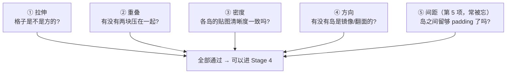
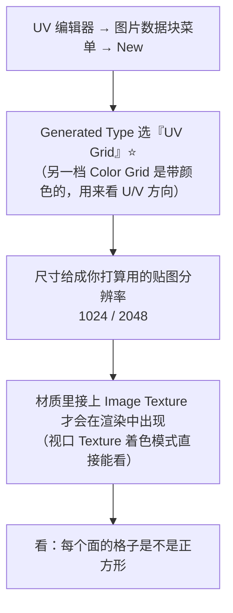
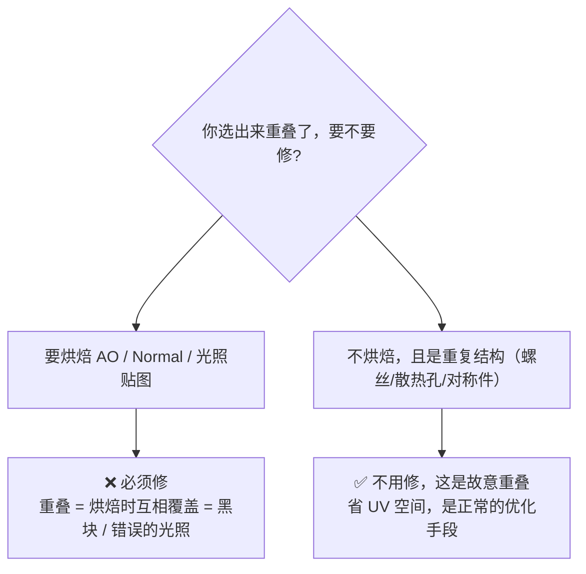
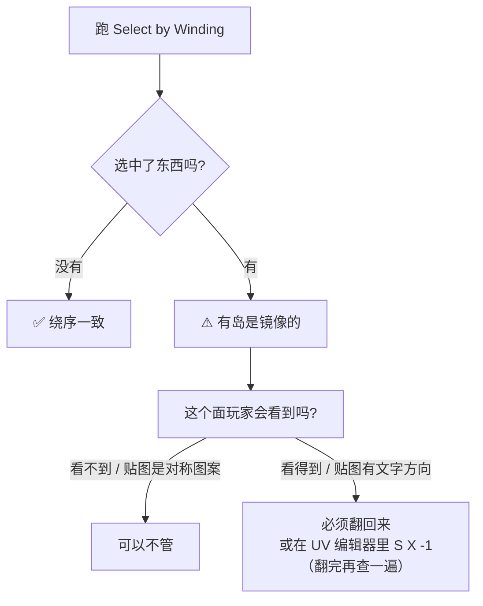
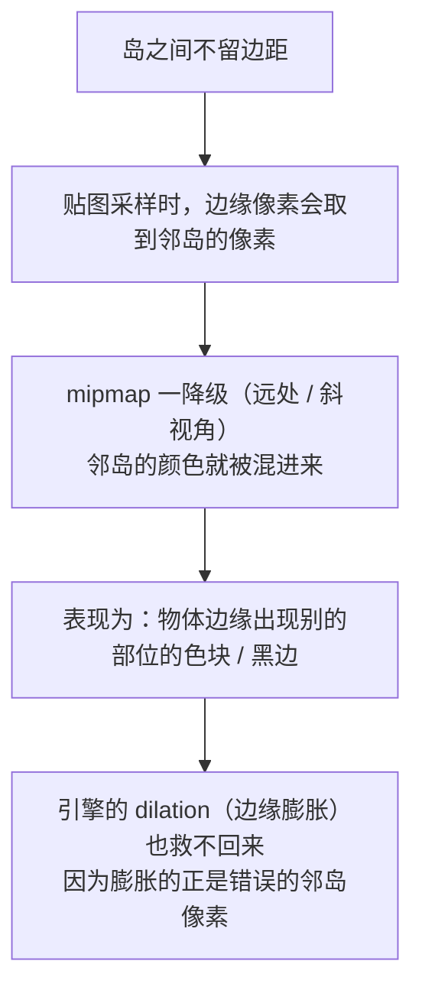
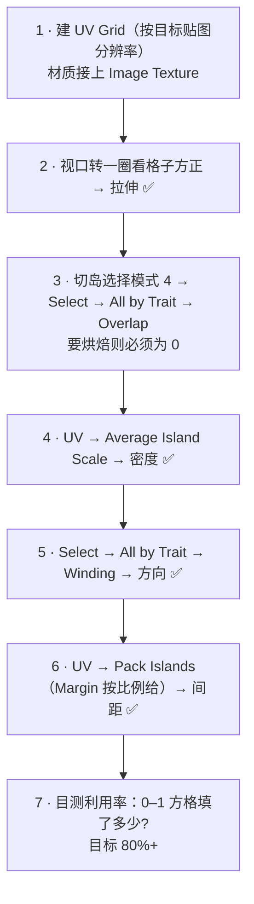

# 05 · UV 检查四件套 ⭐

> 一句话：**「看起来差不多」不算数。四件套跑完、每一项都有明确结论，UV 才算过关。**
> 依据：Blender 5.2 LTS 官方手册 · [Using the Test Grid](https://docs.blender.org/manual/en/latest/modeling/meshes/uv/applying_image.html#using-the-test-grid) / [Selecting UVs](https://docs.blender.org/manual/en/latest/editors/uv/selecting.html)。

---

## 零、检查什么：四件套总览



| # | 检查项 | 工具 | 什么情况下必须过 |
| - | ------ | ---- | ---------------- |
| ① | 拉伸 | UV Grid 测试图 + Stretch 叠加层 | **永远** |
| ② | 重叠 | `Select → All by Trait → Overlap` | **要烘焙时必须零重叠** |
| ③ | 密度 | `Average Island Scale` / 纹素密度工具 | 场景里有多个物件时 |
| ④ | 方向 | `Select → All by Trait → Winding` | 用了 Mirror / 负缩放时 |
| ⑤ | 间距 | Pack Islands 的 Margin | **要烘焙时必须**；mipmap 敏感 |

---

## ① 拉伸：内置棋盘格（不用下载贴图）

官方手册明确写了：**Blender 自带测试图**。



> 手册原话：*Blender has a built-in test image. To use it, press the New button... and change the Generated Type to UV Grid.*
> 📌 **路线图 Stage 3 的练习项目写「加一张棋盘格贴图」——不用去网上找，Blender 自己就能生成。**

### 拉伸的两种量化看法

| 看法 | 怎么做 | 判定 |
| --- | --- | --- |
| **目测** | UV Grid 贴上去转一圈 | 格子基本是正方形；**允许**在次要面、看不见的面上有一点拉伸 |
| **叠加层** | UV 编辑器右上角 **Overlays → Stretching**（可选 `Angle` / `Area` 两种类型） | 颜色越偏「暖/红」= 拉伸越狠。蓝/绿 = 没问题 |

> ⚠️ 该叠加层的入口在不同版本位置略有出入，找不到就在 UV 编辑器的 Overlays 下拉里找 `Stretching`，或 `F3` 搜。

### 判定标准（可判定，不是感觉）

- ✅ **主视面 / 玩家会盯着看的面**：格子必须是正方形，目视无明显长短边差异
- 🟡 **背面 / 底面 / 永远看不到的面**：允许拉伸，甚至可以故意压小省 UV 空间
- ❌ **正视面格子明显成长方形** → 回去补 seam 或 `Minimize Stretch`

---

## ② 重叠：烘焙前的生死线

```text
UV 编辑器 → Select → All by Trait → Overlap
```

- 手册：`Selects all UV faces that overlap with one another... Selects the entire island when island selection mode is enabled`
- ⭐ **先在 UV 编辑器里切到岛选择模式（`4`）**，再跑这个算子，会整岛选中，方便挪走



> **判定标准只有一句话：要烘焙 → 零重叠；不烘焙 → 重叠是你的朋友。**
> 路线图的验收标准写「所有 UV 岛无重叠（烘焙光照贴图的前提下）」——括号里的前提是重点，别无条件执行。

---

## ③ 密度：一致还是不一致

`UV → Average Island Scale` 能把各岛的相对比例拉平（详见 [`06`](06-纹素密度与贴图分辨率.md)）。

**快速目测法**：把 UV Grid 贴到场景里所有物件上，站远看——如果某个物件明显比旁边的「格子更粗」，它的纹素密度就低了。

| 情况 | 处理 |
| --- | --- |
| 同场景同量级的道具（一堆箱子、桶） | **必须一致** |
| 远景/次要物件 | 可以给更低的密度（省贴图预算） |
| Hero 资产（玩家手里的武器） | 给更高密度 |

---

## ④ 方向 / 手性：有没有岛是翻的

```text
UV 编辑器 → Select → All by Trait → Winding
```

按**绕序**选出朝向不一致的岛。这是查「镜像 UV」的精确手段（见 [`01`](01-UV到底是什么-坐标-手性-UDIM.md)）。



> 最容易翻的四个来源：**Mirror 修改器 / 负缩放 / 手工 `S X -1` 塞空隙 / `Copy Mirrored UV Coordinates`**。
> 土办法永远是那张带「F」的测试图：F 反了就是翻了。

---

## ⑤ 间距（padding）：为什么不能排太挤

这是路线图三条坑里最值得展开的一条。



| 贴图分辨率 | 建议 padding（像素） | 换算成 UV Margin（`Fraction`） |
| --- | --- | --- |
| 512 | 2–4 px | ~0.004–0.008 |
| 1024 | 4–8 px | ~0.004–0.008 |
| 2048 | 8–16 px | ~0.004–0.008 |
| 4096 | 16–32 px | ~0.004–0.008 |

> 规律其实是**同一个比例**：padding 取贴图边长的 **0.4%–0.8%**。
> 用 `Pack Islands` 时，如果 `Margin Method = Fraction`，直接填这个比值最省心；用 `Scaled` 的话记得它是「按现有缩放比例乘」，填的是另一个量纲的数，别混用。

---

## 六、一道可复用的检查流程（每次都跑）



### 打印版检查清单

```text
[ ] UV Grid 已生成并接进材质（尺寸 = 目标贴图分辨率）
[ ] 玩家会盯着的面：格子是正方形
[ ] 拉伸叠加层：没有大片暖色/红色区域
[ ] Select → All by Trait → Overlap：
      □ 要烘焙 → 选中数 = 0
      □ 不烘焙 → 只有故意重叠的重复结构
[ ] Average Island Scale 已跑（密度一致）
[ ] Select → All by Trait → Winding：
      □ 选中数 = 0，或选中的都是看不见的面
[ ] Pack Islands 的 Margin 已按分辨率给（贴图的 0.4%–0.8%）
[ ] 利用率目测 80%+
[ ] 硬边 / 倒角边与 seam 对齐（烘焙不出光照接缝）
```

---

## 七、坑

- ❌ **以为棋盘格要去网上下载** → Blender 自带（Image → New → Generated Type: UV Grid）
- ❌ **只在视口里看，没接材质就没渲染** → 手册原话：没有材质渲染出来是灰色，没图是黑色
- ❌ **用不同分辨率的贴图做检查** → padding 和密度判断全错。检查图的尺寸必须等于**你最终要用的**贴图分辨率
- ❌ **无条件要求「零重叠」** → 不烘焙的重复结构重叠是正确的优化
- ❌ **不查 Winding** → Mirror 出来的半边贴图是反的，直到 Stage 4 才发现
- ❌ **Minimize Stretch 之后不重新 Pack** → 松弛完岛会走位，可能又重叠了
- ❌ **密度只在一个物体内部统一，物体之间没统一** → 场景里清晰度参差，一眼看出哪个是「外来户」

---

## 八、自检

| # | 自检点 | 通过标准 |
| - | ------ | -------- |
| ① | 测试图 | 说出怎么用 Blender 内置生成 UV Grid，以及为什么检查图尺寸必须 = 目标贴图分辨率 |
| ② | 重叠判断 | 说出「要烘焙 → 零重叠；不烘焙 → 可重叠」的判据，并说出算子路径 |
| ③ | 手性 | 说出 4 个最容易产生镜像 UV 的来源，以及 Winding 算子怎么用 |
| ④ | padding | 说出不留边距会导致什么现象（要提到 mipmap），并给出 1024/2048 的建议值 |
| ⑤ | **实操** | 给一个展完的道具，**5 分钟内**跑完四件套并给出每一项的结论 |

---

## 九、速查

```text
【① 拉伸】
UV 编辑器 → Image → New → Generated Type: UV Grid ⭐（自带，不用下载）
尺寸 = 你最终要用的贴图分辨率
材质里要接 Image Texture 才会在渲染里出现
Overlays → Stretching（Angle / Area）：暖色/红 = 拉伸
判定：玩家会盯着的面，格子必须是正方形

【② 重叠】
Select → All by Trait → Overlap
（先在 UV 编辑器切岛选择模式 4，会整岛选中）
要烘焙 → 必须 0 重叠（否则黑块）
不烘焙 → 重复结构的故意重叠是正确的优化

【③ 密度】
UV → Average Island Scale
目测：UV Grid 贴到场景所有物件上，站远看格子粗细是否一致

【④ 方向/手性】
Select → All by Trait → Winding
四个高危来源：Mirror / 负缩放 / 手工 S X -1 / Copy Mirrored UV
土办法：贴一张带「F」的测试图

【⑤ 间距 padding】
不留边距 → mipmap 降级时邻岛像素混入 → 边缘色块/黑边
建议 = 贴图边长的 0.4%–0.8%
  512 → 2–4px   1024 → 4–8px
  2048 → 8–16px 4096 → 16–32px
Pack Islands 用 Margin Method = Fraction 时直接填这个比值

【流程】
UV Grid → 看格子 → Overlap → Average Island Scale
→ Winding → Pack Islands(Margin) → 目测利用率 80%+
```

---

> **下一步**：[`06-纹素密度与贴图分辨率.md`](06-纹素密度与贴图分辨率.md) —— 四件套里的「密度」是最难凭感觉判断的一项，把它算成数。
